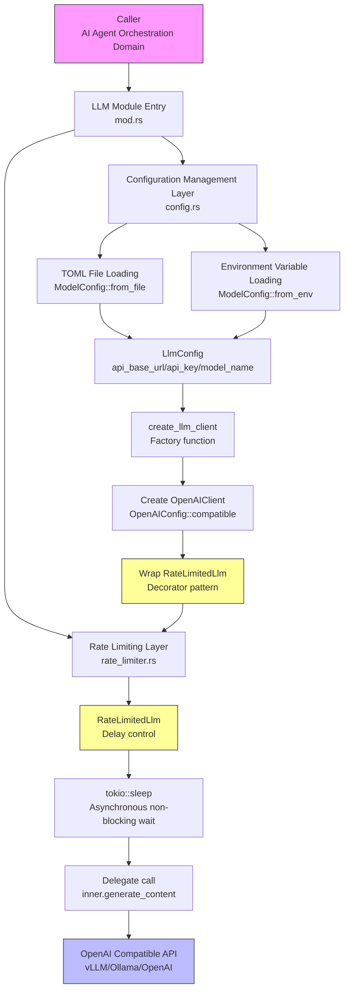
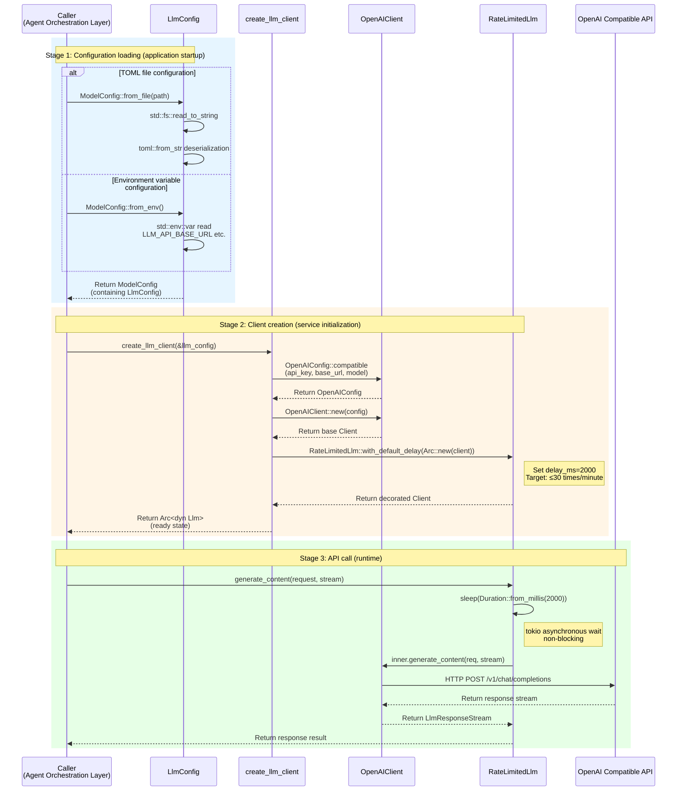

# LLM Service Domain Technical Documentation

## 1. Overview

The LLM Service Domain is the **intelligent capability infrastructure layer** of the Cowork Forge system, responsible for providing unified configuration management, client abstraction, and access control capabilities for large language models (LLMs). This module encapsulates underlying LLM API complexity through standardized interfaces, supporting multiple model providers compatible with OpenAI (including OpenAI official API, vLLM local deployment, Ollama private instances, etc.), and implementing transparent rate limiting protection through decorator pattern.

### Core Responsibilities

| Responsibility Dimension | Description |
|-------------------------|-------------|
| **Configuration Abstraction** | Supports TOML file and environment variable dual-mode configuration, implementing 12-Factor App principles |
| **Client Factory** | Provides unified LLM client creation interface, automatically superimposing rate control layer |
| **Rate Control** | Default 2-second delay strategy, ensuring API call frequency below 30 times/minute, avoiding triggering service provider rate limiting |
| **Protocol Compatibility** | Supports private deployment and local model inference through OpenAI compatibility mode |

---

## 2. Architecture Design

### 2.1 Layered Architecture

The LLM service domain adopts **infrastructure layer** positioning, providing unified entry through Facade pattern, internally implementing separation of configuration management, client factory, and rate limiting three layers:



### 2.2 Design Patterns

| Pattern | Application Location | Purpose |
|---------|---------------------|---------|
| **Factory Pattern** | `create_llm_client` | Convert configuration to runtime instances, isolate creation logic |
| **Decorator Pattern** | `RateLimitedLlm` | Transparently superimpose rate limiting, without invading core LLM logic |
| **Facade Pattern** | `mod.rs` | Unified module entry, simplify API exposure |
| **Dependency Inversion** | `Arc<dyn Llm>` | Implement runtime polymorphism through trait objects, support test doubles |

---

## 3. Core Components Detailed

### 3.1 Configuration Management (config.rs)

The configuration management layer implements **dual-strategy configuration loading**, supporting explicit configuration in production environments and dynamic configuration in containerized environments:

#### Data Structures

```rust
/// Core LLM connection configuration
pub struct LlmConfig {
    pub api_base_url: String,  // Service endpoint, such as https://api.openai.com/v1
    pub api_key: String,       // Authentication key
    pub model_name: String,    // Model identifier, such as gpt-4, llama2-7b
}

/// Wrapper layer, supports future multi-model type extensions
pub struct ModelConfig {
    pub llm: LlmConfig,
    // Reserved extension fields: temperature, max_tokens, etc.
}
```

#### Configuration Loading Strategy

**Strategy 1: TOML File Configuration (Production Environment Recommended)**
- Entry function: `ModelConfig::from_file(path: &str) -> Result<ModelConfig>`
- Implementation mechanism: Uses `serde` + `toml` crate for strongly typed deserialization
- Applicable scenarios: Fixed configuration production environment deployment

**Strategy 2: Environment Variable Configuration (Containerized/Development Environment)**
- Entry function: `ModelConfig::from_env() -> Result<ModelConfig>`
- Environment variable mapping:
  - `LLM_API_BASE_URL` → `api_base_url`
  - `LLM_API_KEY` → `api_key`
  - `LLM_MODEL_NAME` → `model_name`
- Applicable scenarios: Docker containers, CI/CD pipelines, sensitive information injection

#### Client Factory

```rust
/// Create rate-limited LLM client
pub fn create_llm_client(config: &LlmConfig) -> Result<Arc<dyn Llm>> {
    // 1. Create OpenAI compatible configuration
    let openai_config = OpenAIConfig::compatible()
        .with_api_key(&config.api_key)
        .with_base_url(&config.api_base_url)
        .with_model(&config.model_name);
    
    // 2. Instantiate base client
    let base_client = OpenAIClient::new(openai_config);
    
    // 3. Decorate rate limiting layer (default 2-second delay)
    let rate_limited = RateLimitedLlm::with_default_delay(
        Arc::new(base_client)
    );
    
    Ok(Arc::new(rate_limited))
}
```

**Key Design Decisions**:
- Uses `OpenAIConfig::compatible()` to adapt OpenAI compatible endpoints, ensuring seamless integration with local deployment solutions like vLLM, Ollama
- Returns `Arc<dyn Llm>` implementing dependency inversion, upper layer modules call via standard trait interface, decoupled from specific implementation

### 3.2 Rate Limiter (rate_limiter.rs)

The rate limiter adopts **decorator pattern**, adding delay control functionality without modifying original LLM client code:

#### Implementation Structure

```rust
use async_trait::async_trait;
use std::sync::Arc;
use tokio::time::{sleep, Duration};

pub struct RateLimitedLlm {
    inner: Arc<dyn Llm>,      // Decorated LLM client
    delay_ms: u64,            // Delay milliseconds
}

impl RateLimitedLlm {
    /// Custom delay
    pub fn new(inner: Arc<dyn Llm>, delay_ms: u64) -> Self {
        Self { inner, delay_ms }
    }
    
    /// Default 2-second delay (corresponding to 30 RPM limit)
    pub fn with_default_delay(inner: Arc<dyn Llm>) -> Self {
        Self::new(inner, 2000)
    }
}

#[async_trait]
impl Llm for RateLimitedLlm {
    fn name(&self) -> &str {
        self.inner.name()
    }
    
    async fn generate_content(
        &self,
        request: GenerateContentRequest,
        stream: bool,
    ) -> Result<LlmResponseStream> {
        // Non-blocking delay
        sleep(Duration::from_millis(self.delay_ms)).await;
        
        // Delegate to internal implementation
        self.inner.generate_content(request, stream).await
    }
}
```

#### Rate Strategy Calculation

- **Default Configuration**: 2000ms delay = 30 times/minute (Requests Per Minute)
- **Compliance Goal**: Meets mainstream LLM service provider (OpenAI, Azure, etc.) Tier-1 quota limits
- **Asynchronous Implementation**: Uses `tokio::time::sleep` ensuring delay period doesn't block thread, supporting high-concurrency scenarios

---

## 4. Interaction Flow

### 4.1 Runtime Sequence

The complete lifecycle of the LLM service domain includes **configuration loading**, **client creation**, **API call** three stages:



### 4.2 ADK Framework Integration

The LLM service domain deeply integrates with ADK (Agent Development Kit) framework, following its abstraction contracts:

| ADK Component | Integration Method | Role |
|---------------|-------------------|------|
| `adk_core::Llm` | Trait implementation | Defines LLM capability contract, `generate_content` method |
| `adk_model::openai` | Bottom-layer transport | `OpenAIClient` and `OpenAIConfig` provide HTTP communication |
| `adk_core::Tool` | Dependency relationship | Tool system calls model capabilities via LLM client |

---

## 5. Configuration Specifications

### 5.1 TOML Configuration Example

Applicable to production environment explicit configuration file (`cowork.toml`):

```toml
[llm]
api_base_url = "https://api.openai.com/v1"
api_key = "sk-xxxxxxxxxxxxxxxxxxxxxxxx"
model_name = "gpt-4-turbo-preview"

# Optional extension (reserved)
[llm.parameters]
temperature = 0.7
max_tokens = 4096
```

### 5.2 Environment Variable Configuration Example

Applicable to containerized deployment (Docker/Docker Compose):

```bash
# Use OpenAI official API
export LLM_API_BASE_URL="https://api.openai.com/v1"
export LLM_API_KEY="sk-xxxxxxxx"
export LLM_MODEL_NAME="gpt-4"

# Use local vLLM deployment
export LLM_API_BASE_URL="http://localhost:8000/v1"
export LLM_API_KEY="EMPTY"  # vLLM usually doesn't require authentication
export LLM_MODEL_NAME="meta-llama/Llama-2-7b-chat-hf"
```

### 5.3 Configuration Priority

The system adopts **explicit priority** strategy:
1. If TOML file exists and fields are valid, use file configuration
2. If TOML missing or fields incomplete, fallback to environment variables
3. If both missing, return `anyhow::Result` error, preventing application startup

---

## 6. Extensibility Design

### 6.1 Adding New LLM Provider

Current architecture supports adapting any endpoint implementing OpenAI API protocol via `OpenAIConfig::compatible()`. For supporting non-compatible protocols:

1. **Implement Custom Client**: Implement `adk_core::Llm` trait
2. **Extend Configuration Enum**: Add provider type field in `ModelConfig`
3. **Modify Factory Function**: Add branch logic in `create_llm_client`

```rust
// Extension example: Add Azure OpenAI support
pub enum ProviderType {
    OpenAICompatible,
    AzureOpenAI,
}

pub fn create_llm_client(config: &LlmConfig, provider: ProviderType) -> Result<Arc<dyn Llm>> {
    match provider {
        ProviderType::OpenAICompatible => { /* Existing logic */ },
        ProviderType::AzureOpenAI => { /* Azure specific logic */ },
    }
}
```

### 6.2 Custom Rate Strategy

`RateLimitedLlm` supports millisecond-precision delay configuration, can adjust for different service provider quota policies:

```rust
// For high-quota accounts (such as OpenAI Tier-5: 10,000 RPM)
let fast_client = RateLimitedLlm::new(base_client, 6); // 6ms delay ≈ 10,000 RPM

// For strict limits (such as free tier: 3 RPM)
let slow_client = RateLimitedLlm::new(base_client, 20000); // 20-second delay
```

---

## 7. Best Practices

### 7.1 Production Environment Recommendations

1. **Key Management**: Use environment variables or key management services (AWS Secrets Manager, Azure Key Vault) to inject `api_key`, avoid hard-coding
2. **Connection Pool Optimization**: `OpenAIClient` internally maintains HTTP connection pool, recommend using as singleton throughout application lifecycle
3. **Timeout Configuration**: Set reasonable request timeout in `OpenAIConfig` (recommend 30-60 seconds), preventing long text generation causing blocking

### 7.2 Local Development Recommendations

1. **Use Ollama to Reduce Costs**: Point `LLM_API_BASE_URL` to local Ollama instance (`http://localhost:11434/v1`)
2. **Rate Limiting Adjustment**: During local development, can call `RateLimitedLlm::new(inner, 0)` to disable delay, accelerating iteration
3. **Model Downgrade Testing**: Use `gpt-3.5-turbo` and other low-cost models to verify workflows, switch to `gpt-4` in production environment

### 7.3 Troubleshooting

| Phenomenon | Possible Cause | Troubleshooting Method |
|------------|----------------|----------------------|
| `Connection refused` | Local LLM service not started | Check vLLM/Ollama process status, verify port connectivity |
| `429 Too Many Requests` | Insufficient rate limiting | Increase `delay_ms` value, or check service provider quota |
| `401 Unauthorized` | API Key invalid or expired | Verify `api_key` format, check environment variable injection |
| High response latency | Network delay or model load | Use `ping` to check network, consider switching to nearby Region |

---

## 8. Summary

The LLM service domain as the **intelligent capability foundation** of Cowork Forge, through layered architecture design achieves balance of configuration flexibility, protocol compatibility, and access controllability. Its core value lies in:

- **Zero-Intrusion Rate Control**: Decorator pattern implements transparent rate limiting, without affecting business code
- **Dual-Mode Configuration**: Balances development convenience and production security
- **Protocol Abstraction**: OpenAI compatibility layer supports seamless switching from cloud API to local private deployment
- **Resource Protection**: Default 2-second delay strategy prevents API quota exhaustion, ensuring system stability

This module as infrastructure domain provides reliable, compliant, observable LLM calling capabilities for upper-level AI agent orchestration domain, serving as the cornerstone of the entire Cowork Forge system implementing AI-driven software development.