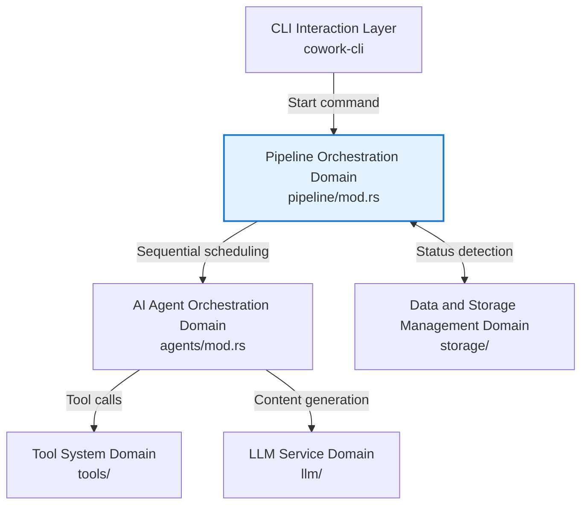
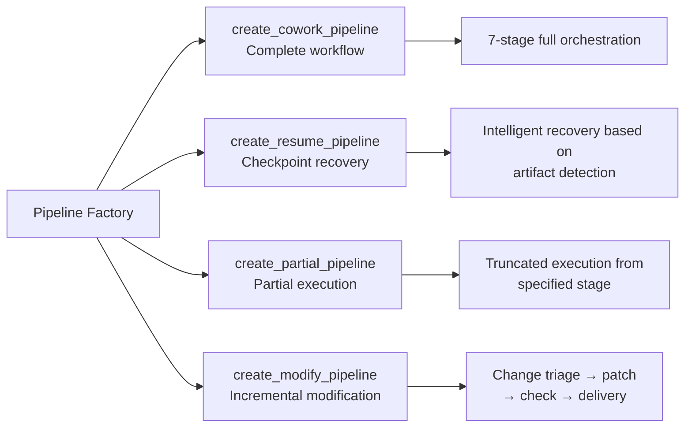
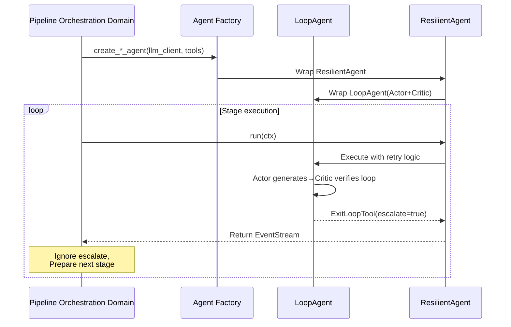

# Pipeline Orchestration Domain Technical Documentation

**Version**: v1.0
**Last Updated**: 2024
**Associated Module**: `crates/cowork-core/src/pipeline/mod.rs`

---

## 1. Overview

### 1.1 Positioning and Responsibilities

The **Pipeline Orchestration Domain** is the core workflow engine of the Cowork Forge system, responsible for defining, building, and executing various stage processes of the software development lifecycle (SDLC). This domain implements three core capabilities: **sequential stage execution**, **state isolation**, and **resilient recovery**, supporting end-to-end automation orchestration from project ideation to final delivery.

### 1.2 Core Responsibilities

| Responsibility Dimension | Function Description |
|--------------------------|---------------------|
| **Stage Orchestration** | Sequentially execute seven stages: Idea → PRD → Design → Plan → Coding → Check → Delivery |
| **State Isolation** | Isolate escalate flags of each stage via `StageExecutor`, ensuring `ExitLoopTool` doesn't affect overall workflow |
| **Mode Adaptation** | Support four workflow modes: complete new, checkpoint recovery, incremental modification, version rollback |
| **Event Stream Management** | Implement asynchronous event stream forwarding, real-time recording of each stage output to session history |

### 1.3 Architecture Positioning

The pipeline orchestration domain is located in the core domain layer, inheriting commands from the CLI interaction layer (receiving execution commands), dispatching to the AI agent orchestration domain (scheduling specific Agent execution), and implementing state persistence through the storage layer.



---

## 2. Core Component Design

### 2.1 StageExecutor Stage Executor

`StageExecutor` is a stage execution container implementing the `Agent` trait. Unlike ADK framework's `SequentialAgent`, it provides **stage-level error isolation** capabilities.

#### 2.1.1 Structure Design

```rust
pub struct StageExecutor {
    /// Pipeline name identifier
    name: String,
    /// Named stage list: (stage name, Agent instance)
    stages: Vec<(String, Arc<dyn Agent>)>,
}
```

#### 2.1.2 Key Features

- **Escalate Isolation Mechanism**: Deliberately ignores the `event.actions.escalate` flag returned by each stage, so that `LoopAgent` using `ExitLoopTool` to exit internal loops won't cause the entire workflow to terminate.
- **Streaming Event Forwarding**: Creates asynchronous streams via `async_stream::stream!` macro, real-time forwarding of sub-agent generated events to upstream consumers.
- **History Recording Append**: Appends each stage's LLM response content to session history via `ctx.session().append_to_history()`, implementing cross-stage context transfer.

### 2.2 Pipeline Factory

Adopts factory pattern to provide four pipeline construction functions, assembling different stage sequences based on business scenarios:



---

## 3. Pipeline Types Detailed

### 3.1 Complete Workflow Pipeline (create_cowork_pipeline)

Builds a seven-stage complete pipeline covering the software development lifecycle, suitable for new projects starting from scratch.

**Stage Sequence**:

1. **Idea Agent**: Organize ideas, generate `idea.md`
2. **PRD Loop** (Actor-Critic): Requirements analysis and verification, generate `prd.md`
3. **Design Loop** (Actor-Critic): Architecture design (constrained to 2-4 components), generate `design.md`
4. **Plan Loop** (Actor-Critic): Task planning (constrained to 5-12 core tasks), generate `plan.json`
5. **Coding Loop** (Actor-Critic): Code implementation and quality verification
6. **Check Agent**: Permissive quality check, verify file existence and feature coverage
7. **Delivery Agent**: Generate delivery report, summarizing requirements and outcomes

**Human-Computer Collaboration Nodes**: PRD, Design, Plan three stages forcibly insert human review (HITL).

### 3.2 Checkpoint Recovery Pipeline (create_resume_pipeline)

Implements capability to continue execution from interrupted project checkpoints, with core logic being **reverse artifact detection**.

#### 3.2.1 Recovery Point Detection Algorithm

The system determines maximum progress recovery point by reverse detecting the existence of artifacts from each stage through storage layer APIs:

```rust
// Pseudo code logic: Check from late to early
let start_stage = if storage.has_code_files(session_id)? {
    "check"  // Code complete, enter quality check stage
} else if storage.has_implementation_plan(session_id)? 
       && storage.has_design_spec(session_id)? {
    "coding" // Implementation plan exists, start from coding stage
} else if storage.has_design_spec(session_id)? {
    "plan"   // Design document exists, start from planning stage
} else if storage.has_requirements(session_id)? {
    "design" // Requirements document exists, start from design stage
} else {
    "prd"    // Start from PRD stage
};
```

#### 3.2.2 Resume Execution Flow

1. Load original session state (including history records and context)
2. Build partial pipeline based on detected `start_stage` by calling `create_partial_pipeline`
3. Skip completed stages, execute subsequent agents sequentially from breakpoint

### 3.3 Partial Execution Pipeline (create_partial_pipeline)

Supports flexible pipeline starting from specified stage, used for **version rollback** scenarios.

**Implementation Mechanism**:
Uses `match` expression to build sub-processes based on start stage:

```rust
match start_stage {
    "prd" => vec![prd_loop, design_loop, plan_loop, coding_loop, check, delivery],
    "design" => vec![design_loop, plan_loop, coding_loop, check, delivery],
    "plan" => vec![plan_loop, coding_loop, check, delivery],
    // ... other stage combinations
}
```

**Application Scenarios**:
- When user is dissatisfied with certain stage results, rollback to that stage via `cowork revert --to <stage>`
- Clear target stage and subsequent artifact states, re-execute based on new session

### 3.4 Incremental Modification Pipeline (create_modify_pipeline)

Dedicated change orchestration workflow designed for requirement changes and feature enhancements.

**Stage Sequence**:

1. **Change Triage Agent**: Analyze change request, identify impact scope (PRD/Design/Plan/Code), evaluate risk level (low/medium/high)
2. **SaveChangeRequestTool**: Persist change analysis results
3. **Code Patch Agent**: Execute incremental modifications based on existing code patterns
4. **Check Agent**: Verify post-modification functional integrity and code quality
5. **Modify Delivery Agent**: Generate PR-like format change report

**Characteristics**:
- Does not re-execute complete SDLC, only performs precise modifications for change scope
- Supports file fingerprint calculation for change tracking and conflict detection

---

## 4. Key Technical Mechanisms

### 4.1 Asynchronous Streaming Execution Model

`StageExecutor::run` method returns `AdkResult<EventStream>`, adopting Rust asynchronous stream for real-time event forwarding:

```rust
async fn run(&self, ctx: Arc<dyn InvocationContext>) -> AdkResult<EventStream> {
    Ok(Box::pin(stream! {
        for (stage_name, agent) in &self.stages {
            // Execute current stage
            let mut stage_stream = agent.run(ctx.clone()).await?;
            
            // Forward event stream
            while let Some(result) = stage_stream.next().await {
                match result {
                    Ok(event) => {
                        // Append content to session history
                        if let Some(content) = extract_content(&event) {
                            ctx.session().append_to_history(content).await?;
                        }
                        yield Ok(event); // Forward upstream
                    }
                    Err(e) => {
                        yield Err(e); // Error terminates entire workflow
                        return;
                    }
                }
            }
        }
    }))
}
```

### 4.2 Stage Isolation and LoopAgent Collaboration

In Actor-Critic dual-agent mode, `LoopAgent` sets `escalate=true` when exiting current loop via `ExitLoopTool`. `StageExecutor` achieves "loop internal failure doesn't spread" isolation strategy by **deliberately ignoring** this flag:

- LoopAgent can normally exit loop in current stage
- Won't propagate to `StageExecutor` causing entire pipeline termination
- Next stage can start execution normally

This design implements isolation strategy of "iteration within stages, sequential execution between stages".

### 4.3 Event Persistence and Context Transfer

Content generated by each stage is written to session history via `append_to_history`, subsequent stages can access accumulated context via `ctx.session().get_history()`, implementing:

- **Requirement Traceability**: Coding stage can view requirements defined at PRD stage
- **Design Constraints**: Plan stage can view architecture constraints from Design stage (2-4 component limit)
- **Change Awareness**: Patch stage can view change scope analyzed at Triage stage

---

## 5. Interaction with Peripheral Modules

### 5.1 Collaboration with AI Agent Orchestration Domain



### 5.2 Interaction with Storage Layer

Pipeline orchestration domain detects artifact status (checkpoint recovery) and saves execution status through storage layer interfaces:

| Interaction Scenario | Storage Interface | Data Content |
|---------------------|------------------|--------------|
| Checkpoint detection | `has_code_files()` / `has_design_spec()` etc. | Detect existence of artifacts from each stage |
| State isolation | `load_session_state()` / `save_session_state()` | Session metadata and execution state |
| History recording | `append_to_history()` | LLM conversation history and stage output |

### 5.3 Interaction with CLI Layer

CLI layer starts pipeline execution via ADK Runner:

```rust
// CLI layer call example
let pipeline = create_cowork_pipeline(config, session_id);
let runner = Runner::new(RunnerConfig::default());
let result = runner.run(pipeline, ctx).await;
```

---

## 6. Implementation Code Examples

### 6.1 StageExecutor Core Implementation

```rust
use std::sync::Arc;
use adk_core::{Agent, InvocationContext, EventStream, AdkResult};
use async_stream::stream;
use futures::StreamExt;

pub struct StageExecutor {
    name: String,
    stages: Vec<(String, Arc<dyn Agent>)>,
}

impl StageExecutor {
    pub fn new(name: impl Into<String>, stages: Vec<(String, Arc<dyn Agent>)>) -> Self {
        Self {
            name: name.into(),
            stages,
        }
    }
}

#[async_trait::async_trait]
impl Agent for StageExecutor {
    fn name(&self) -> &str {
        &self.name
    }
    
    fn description(&self) -> &str {
        "Stage-based workflow executor with escalate isolation"
    }
    
    fn sub_agents(&self) -> &[Arc<dyn Agent>] {
        &[] // Don't expose internal stage structure
    }
    
    async fn run(&self, ctx: Arc<dyn InvocationContext>) -> AdkResult<EventStream> {
        let stages = self.stages.clone();
        
        Ok(Box::pin(stream! {
            for (stage_name, agent) in stages {
                tracing::info!(stage = %stage_name, "Executing stage");
                
                match agent.run(ctx.clone()).await {
                    Ok(mut stream) => {
                        while let Some(result) = stream.next().await {
                            match result {
                                Ok(event) => {
                                    // Key: Deliberately don't check event.actions.escalate
                                    // Implement stage isolation
                                    yield Ok(event);
                                }
                                Err(e) => {
                                    yield Err(e);
                                    return;
                                }
                            }
                        }
                    }
                    Err(e) => {
                        yield Err(e);
                        return;
                    }
                }
            }
        }))
    }
}
```

### 6.2 Pipeline Factory Implementation Fragment

```rust
/// Create complete workflow pipeline
pub fn create_cowork_pipeline(
    config: Arc<AppConfig>,
    session_id: String,
) -> Arc<dyn Agent> {
    let llm = create_llm_client(&config.llm);
    
    // Build stage agents
    let idea_agent = create_idea_agent(llm.clone(), session_id.clone());
    let prd_loop = create_prd_loop(llm.clone(), session_id.clone());
    let design_loop = create_design_loop(llm.clone(), session_id.clone());
    let plan_loop = create_plan_loop(llm.clone(), session_id.clone());
    let coding_loop = create_coding_loop(llm.clone(), session_id.clone());
    let check_agent = create_check_agent(llm.clone(), session_id.clone());
    let delivery_agent = create_delivery_agent(llm, session_id);
    
    let stages = vec![
        ("idea".to_string(), idea_agent),
        ("prd".to_string(), prd_loop),
        ("design".to_string(), design_loop),
        ("plan".to_string(), plan_loop),
        ("coding".to_string(), coding_loop),
        ("check".to_string(), check_agent),
        ("delivery".to_string(), delivery_agent),
    ];
    
    Arc::new(StageExecutor::new("cowork_forge_pipeline", stages))
}

/// Create checkpoint recovery pipeline
pub fn create_resume_pipeline(
    config: Arc<AppConfig>,
    session_id: String,
    base_session_id: String,
) -> Arc<dyn Agent> {
    // Detect existing artifacts to determine recovery point
    let storage = Storage::new(config.storage_path.clone());
    let start_stage = detect_resume_point(&storage, &base_session_id);
    
    // Build partial pipeline based on recovery point
    create_partial_pipeline(config, session_id, start_stage)
}
```

---

## 7. Best Practices and Constraints

### 7.1 Stage Design Principles

1. **Single Responsibility**: Each stage agent only focuses on specific SDLC stage tasks (e.g., PRD stage doesn't handle code implementation)
2. **Explicit Constraints**: Explicitly state constraints in instruction templates (e.g., Design stage limits 2-4 components, Plan stage limits 5-12 tasks)
3. **Fail Fast**: Stage internal errors handled by ResilientAgent retry, stage inter-stage errors immediately terminate pipeline, avoiding invalid execution

### 7.2 State Management Recommendations

- **Artifact Idempotency**: Each stage agent should support repeated execution (idempotent design), enabling resume without duplicate data when resuming from checkpoint
- **History Recording Refinement**: Use `IncludeContents::None` and other optimization methods to control context length, avoiding exceeding LLM Token limits

### 7.3 Extension Guidelines

When adding new stage types:
1. Implement new Agent factory function in `agents/mod.rs`
2. Assemble to `stages` vector in factory functions in `pipeline/mod.rs`
3. If checkpoint recovery support needed, add corresponding `has_*_artifact()` detection function in storage layer

---

## 8. Summary

The pipeline orchestration domain as the core orchestration engine of Cowork Forge implements three core capabilities of **stage isolation**, **sequential execution**, and **resilient recovery** through `StageExecutor`. Its asynchronous stream-based implementation ensures high-performance event processing and real-time feedback, with four pipeline factory functions covering full-scenario requirements of software development lifecycle (new, resume, modify, rollback).

The module design fully considers the particularities of AI workflows (LoopAgent loop exit, human-computer collaboration interruption, context transfer), achieving stable and reliable workflow execution base for upper-level business through exquisite escalate isolation mechanism and state persistence strategy.