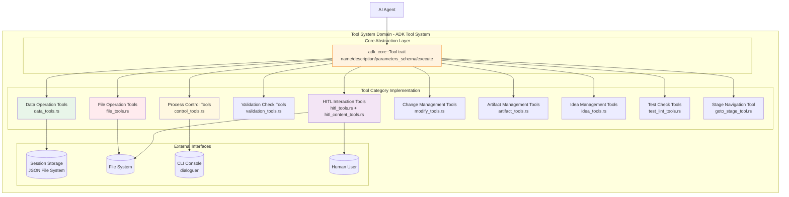
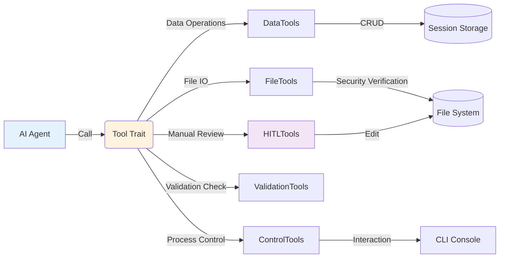
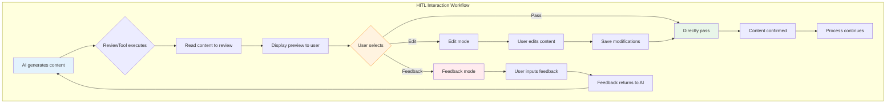
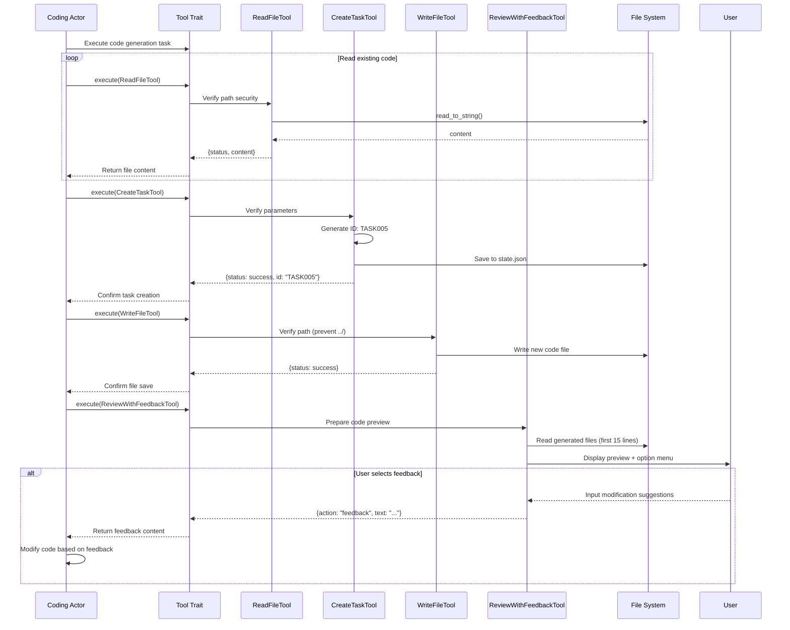

# Tool System Domain Technical Documentation

## 1. Overview

### 1.1 Definition and Positioning

The Tool System Domain is the **capability abstraction layer** of the Cowork Forge core framework, providing standardized, secure, and controllable operation interfaces for AI agents (Agents). By implementing the `adk_core::Tool` trait, this domain translates the decision-making capabilities of large language models (LLMs) into specific system operations, covering data persistence, file system access, process control, and human-in-the-loop (HITL) interaction capabilities.

### 1.2 Core Responsibilities

| Responsibility Dimension | Specific Description |
|-------------------------|---------------------|
| **Capability Encapsulation** | Provides 11 categories of standardized tool interfaces for agents, masking underlying implementation complexity |
| **Security Control** | Implements path traversal protection, command execution timeout, service command interception, and other security mechanisms |
| **Session Isolation** | Implements data operation namespace isolation through `session_id`, supporting multi-project parallel development |
| **Human-Computer Collaboration** | Provides interactive review, feedback collection, and manual decision-making HITL capabilities |
| **Data Consistency** | Ensures CRUD operation atomicity for core data models such as requirements, features, and tasks |

### 1.3 Design Principles

- **Simplicity First**: Tool interfaces maintain minimal design, avoiding over-abstraction
- **Security by Default**: File operations default to path verification, command execution defaults to 30-second timeout
- **Observability**: All tool executions return structured JSON responses with status codes and detailed descriptions
- **Resilient Fault Tolerance**: Supports automatic capture of tool execution errors and manual intervention decisions

---

## 2. Architecture Design

### 2.1 Overall Architecture

The tool system domain adopts a **layered modular architecture**, built based on the ADK (Agent Development Kit) framework's `Tool` trait standard:



### 2.2 Core Component Relationships



---

## 3. Detailed Module Design

### 3.1 Data Operation Tools (Data Tools)

**Module Path**: `crates/cowork-core/src/tools/data_tools.rs`

#### Function Description
Provides CRUD operations for core data models throughout the software development lifecycle (SDLC), supporting full lifecycle management of requirements (Requirements), features (Feature), design components (Design Component), and tasks (Task).

#### Core Tool List

| Tool Name | Function Description | ID Generation Rule | Associated Data Model |
|-----------|---------------------|-------------------|---------------------|
| `CreateRequirementTool` | Create project requirements | `REQ{number:03}` | Requirements |
| `AddFeatureTool` | Add feature functionality | `FEAT{number:03}` | Feature |
| `CreateDesignComponentTool` | Create architecture component | `COMP{number:03}` | DesignComponent |
| `CreateTaskTool` | Create implementation task | `TASK{number:03}` | Task |
| `UpdateTaskStatusTool` | Update task status | - | Task.status |
| `UpdateFeatureStatusTool` | Update feature status | - | Feature.status |
| `GetRequirementsTool` | Query requirement data | - | Requirements |
| `GetDesignTool` | Query design specification | - | DesignSpec |
| `GetPlanTool` | Query implementation plan | - | ImplementationPlan |

#### Technical Implementation Details

1. **Session Isolation Mechanism**: All operations locate to JSON files in the `.cowork/sessions/{session_id}/` directory via `session_id` parameter
2. **Atomic ID Generation**: Uses `format!("{}{:03}", prefix, count)` pattern, with prefixes REQ/FEAT/COMP/TASK respectively
3. **State Machine Management**: Supports feature state transitions (Draft → Review → Completed) and task state transitions (Todo → InProgress → Done)

**Example Call**:
```rust
// AI Agent obtains session_id via ToolContext and executes
let args = json!({
    "title": "User Authentication Module",
    "description": "Implement JWT-based login authentication",
    "priority": "High"
});
// Automatically saves to state.json and returns { "status": "success", "id": "REQ001" }
```

### 3.2 File Operation Tools (File Tools)

**Module Path**: `crates/cowork-core/src/tools/file_tools.rs`

#### Function Description
Provides constrained file system access capabilities, ensuring AI agents execute file read/write and command execution within predefined security boundaries.

#### Core Tool List

| Tool Name | Function | Security Constraints |
|-----------|---------|----------------------|
| `ListFilesTool` | Recursively list directory structure | Path whitelist verification |
| `ReadFileTool` | Read text file content | Prohibit reading binary files |
| `WriteFileTool` | Write/overwrite files | Path traversal protection |
| `RunCommandTool` | Execute Shell commands | 30-second timeout, service command interception |

#### Security Mechanism Details

**Path Security Verification** (`validate_path_security`):
- Prohibit absolute paths (starting with `/` or `\`)
- Prohibit path traversal (`../` or `..\`)
- Limit working directory to project root directory or `.cowork` directory

**Command Execution Security**:
```rust
// Automatically intercept long-running service commands
fn is_blocking_service_command(cmd: &str) -> bool {
    let services = ["npm start", "python -m http.server", "cargo watch"];
    services.iter().any(|s| cmd.contains(s))
}

// 30-second timeout mechanism
let output = tokio::time::timeout(
    Duration::from_secs(30),
    process::Command::new("sh").arg("-c").arg(command).output()
).await;
```

### 3.3 Process Control Tools (Control Tools)

**Module Path**: `crates/cowork-core/src/tools/control_tools.rs`

#### Function Description
Provides standardized interfaces for workflow control, user interaction, and feedback management, supporting Actor-Critic mode feedback loops.

#### Core Tool List

| Tool Name | Function Description | Usage Scenario |
|-----------|---------------------|----------------|
| `ProvideFeedbackTool` | Record feedback history | Critic provides improvement suggestions to Actor |
| `RequestReplanningTool` | Request replanning | Check Agent detects serious issues requiring rollback |
| `AskUserTool` | Ask user confirmation | Decision branches requiring user input |
| `RequestHumanReviewTool` | Request manual review upgrade | Complex scenarios beyond AI decision capability |

#### Interaction Implementation
Uses `dialoguer` crate for rich text interaction:
- Colorful emoji prompts (✅/⚠️/❌)
- Single/multiple selection menus (`Select`/`MultiSelect`)
- Text input (`Input`)

### 3.4 HITL Interaction Tools (Human-in-the-Loop Tools)

**Module Path**:
- `crates/cowork-core/src/tools/hitl_tools.rs`
- `crates/cowork-core/src/tools/hitl_content_tools.rs`

#### Function Description
Implements the core mechanism of human-computer collaboration review, forcing manual review at key quality nodes (PRD, Design, Plan), supporting three interaction modes.

#### Tool Classification

**File Review Mode**:
- `ReviewAndEditFileTool`: Edit or directly pass
- `ReviewWithFeedbackTool`: File review supporting feedback loop

**Content Review Mode**:
- `ReviewAndEditContentTool`: Review text content in memory
- `ReviewWithFeedbackContentTool`: Three-mode content review with feedback (edit/pass/feedback)

#### Workflow



### 3.5 Validation Check Tools (Validation Tools)

**Module Path**: `crates/cowork-core/src/tools/validation_tools.rs`

#### Function Description
Provides automated validation capabilities for data integrity, consistency, and quality, supporting static analysis and dependency relationship checks.

#### Core Tool List

| Tool Name | Validation Content | Algorithm/Mechanism |
|-----------|-------------------|---------------------|
| `CheckDataFormatTool` | JSON Schema compliance | Struct deserialization verification |
| `CheckFeatureCoverageTool` | Feature coverage analysis | Set operations (requirements ⊆ features) |
| `CheckTaskDependenciesTool` | Task dependency cycle detection | DFS depth-first search algorithm |

#### Cycle Detection Implementation
```rust
// CheckTaskDependenciesTool uses DFS to detect cyclic dependencies
fn has_cycle(tasks: &[Task]) -> Result<(), Vec<String>> {
    let mut visited = HashSet::new();
    let mut rec_stack = HashSet::new();
    
    for task in tasks {
        if !visited.contains(&task.id) {
            if dfs_detect_cycle(task, &mut visited, &mut rec_stack, &task_map) {
                return Err(cycle_path);
            }
        }
    }
    Ok(())
}
```

### 3.6 Change Management Tools (Modify Tools)

**Module Path**: `crates/cowork-core/src/tools/modify_tools.rs`

#### Function Description
Supports incremental modification workflow (Modify Workflow), handling change request (ChangeRequest) persistence and loading.

#### Core Tools
- `SaveChangeRequestTool`: Saves change analysis results, including impact scope (PRD/Design/Plan/Code) and risk level (Low/Medium/High)
- `LoadChangeRequestTool`: Loads historical change requests, supporting change traceability

### 3.7 Other Specialized Tools

| Tool Category | File Path | Function Description |
|---------------|-----------|---------------------|
| **Artifact Management** | `artifact_tools.rs` | Saves delivery reports, PRD, design documents, and other final artifacts |
| **Stage Navigation** | `goto_stage_tool.rs` | Supports workflow jumping to specified stage (for Revert scenarios) |
| **Idea Management** | `idea_tools.rs` | Specialized data operations for idea organization stage |
| **Test Check** | `test_lint_tools.rs` | Executes code testing and quality check commands |

---

## 4. Technical Implementation Standards

### 4.1 Tool Trait Implementation Standard

All tools must implement the `adk_core::Tool` trait, using `async_trait` macro to support asynchronous execution:

```rust
#[async_trait]
pub trait Tool: Send + Sync {
    /// Tool identifier (used when LLM calls)
    fn name(&self) -> &str;
    
    /// Function description (provided to LLM as context)
    fn description(&self) -> &str;
    
    /// JSON Schema parameter definition (used to validate LLM input)
    fn parameters_schema(&self) -> Value;
    
    /// Asynchronous execution entry
    async fn execute(
        &self, 
        ctx: Arc<dyn ToolContext>, 
        args: Value
    ) -> Result<Value, AdkError>;
}
```

### 4.2 Error Handling Standard

Uniformly use `AdkError::Tool` to wrap tool execution errors, ensuring error information is readable by LLM:

```rust
match operation {
    Ok(result) => Ok(json!({ "status": "success", "data": result })),
    Err(e) => Err(AdkError::Tool(format!(
        "{} execute failed: {}", 
        self.name(), 
        e
    ))),
}
```

### 4.3 Tool Registration Mechanism

Centralize registration of all tools in `tools/mod.rs`, implementing automated registration via macros or factory pattern:

```rust
pub fn register_all_tools() -> Vec<Arc<dyn Tool>> {
    vec![
        Arc::new(CreateRequirementTool),
        Arc::new(ReadFileTool),
        Arc::new(ReviewWithFeedbackContentTool),
        // ... other tools
    ]
}
```

---

## 5. Interaction Flow Examples

### 5.1 Complete Tool Call Sequence

The following sequence diagram shows the complete flow of AI Agent using multiple tools during the Coding stage:



---

## 6. Security and Performance Considerations

### 6.1 Security Protection Matrix

| Risk Category | Protection Measures | Implementation Location |
|---------------|---------------------|-------------------------|
| **Path Traversal Attack** | Regular expression filtering `../` and absolute paths | `file_tools::validate_path_security` |
| **Command Injection** | Whitelist interception of long-term service commands | `file_tools::is_blocking_service_command` |
| **Resource Exhaustion** | 30-second command execution timeout | `RunCommandTool::execute_with_timeout` |
| **Data Privilege Escalation** | session_id isolation namespace | All DataTools storage path construction |

### 6.2 Performance Optimization

- **Asynchronous IO**: All file and command operations use `tokio::fs` and `tokio::process`, avoiding thread blocking
- **Lazy Loading**: Data tools only load JSON state files when needed, without maintaining resident memory cache
- **Rate Limiting**: Control tool call frequency (default 2-second delay) through `RateLimitedLlm` wrapper

---

## 7. Extensibility Design

### 7.1 New Tool Development Guide

To add tools for specific domains (such as test automation, deployment operations):

1. **Implement Trait**: Create new struct implementing `Tool` trait
2. **Define Schema**: Explicitly define JSON Schema in `parameters_schema()`
3. **Security Audit**: Must call `validate_path_security` if involving file/command operations
4. **Register Tool**: Add to tool registry in `tools/mod.rs`

### 7.2 Tool Composition Pattern

Support tool chain calls to build complex workflows, for example:

```rust
// Change analysis workflow composition
let workflow = vec![
    Arc::new(SaveChangeRequestTool),
    Arc::new(CheckFeatureCoverageTool),
    Arc::new(ReviewWithFeedbackContentTool),
];
```

---

## 8. Summary

The tool system domain serves as the **capability cornerstone** of Cowork Forge. Through standardized `Tool` trait interfaces, it translates AI agents' cognitive capabilities into executable, observable, and controllable system operations. Its design embodies the following core characteristics:

1. **Security First**: Three-layer protection of path verification, timeout control, and command interception ensures system security
2. **Human-Computer Synergy**: HITL tool set implements mandatory manual review at key nodes, ensuring output quality
3. **Data-Driven**: Data tools tightly integrated with session storage, implementing complete lifecycle data management
4. **Resilient Design**: Supports error recovery, replanning, stage rollback, and other fault tolerance mechanisms

This architecture supports diverse needs of independent developers, technical architects, and software engineers in AI-assisted software development scenarios, serving as a key bridge connecting large language model capabilities and software engineering practices.