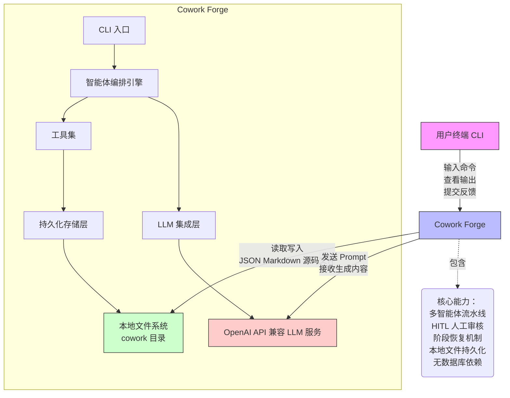

# System Context Overview

## 1. Project Introduction

- **项目名称**：Cowork Forge
- **项目类型**：自动化开发引擎
- **生成时间**：2026-01-28 02:59:53 (UTC)（时间戳：1769569193）

Cowork Forge 是一个基于人工智能智能体（AI Agent）的自动化软件开发系统，旨在通过多智能体协作流水线，实现从模糊项目构想到可交付代码的全流程自动化。系统以命令行界面（CLI）为唯一用户入口，融合大型语言模型（LLM）的推理能力与人类在环（Human-in-the-Loop, HITL）的审核机制，构建了一个轻量、可靠、可追溯的本地化开发闭环。

### 核心功能与业务价值

Cowork Forge 的核心价值在于**将软件开发中重复性、流程化的人工工作自动化**，显著降低开发成本、缩短交付周期、提升输出一致性。系统通过以下关键能力实现这一目标：

- **自动化流程闭环**：从用户输入的初始构想（Idea）出发，依次驱动“需求生成（PRD）→ 架构设计 → 任务规划 → 编码实现 → 质量校验 → 交付报告”七阶段智能体流水线，形成端到端的自动化开发链路。
- **人机协同机制**：在每个关键输出节点（如 PRD、设计文档、代码文件）自动触发人工审核，支持用户编辑、反馈与决策，确保 AI 输出符合业务意图与质量标准。
- **流程容错与恢复**：支持用户在任意阶段中断流程，并恢复至任意前置阶段（如 PRD、Design、Plan），系统自动清理后续产物并重置状态，保障开发过程的灵活性与可控性。
- **全量产物持久化**：所有中间产物（文档、任务、反馈、代码）均以结构化 JSON 文件形式持久化于本地 `.cowork/` 目录，形成完整、可追溯的开发历史，支持审计、复盘与团队协作。

该系统特别适用于**中小型开发团队或独立开发者**，在缺乏完整 CI/CD 和项目管理工具链的场景下，提供标准化、可复用的自动化开发能力，提升工程规范性与交付效率。

### 技术特征概览

- **语言与架构**：采用 Rust 语言构建，模块化设计，高内聚低耦合，具备内存安全、高性能与强类型保障。
- **无外部依赖**：不依赖数据库、Web 服务或微服务架构，完全基于本地文件系统进行状态管理，实现“零部署、即用即走”的轻量哲学。
- **智能体驱动**：每个开发阶段由独立智能体（Agent）执行，智能体通过预设指令模板（Prompt Template）与工具集（Tool Set）协同工作，支持灵活扩展。
- **工具模式（Tool Pattern）**：所有原子化操作（文件读写、数据创建、用户交互）均封装为可插拔的工具模块，遵循统一 `Tool` trait 接口，实现智能体与执行层的解耦。
- **可扩展性**：系统架构支持新增智能体、工具或指令模板，无需修改核心引擎，便于适配不同技术栈或开发规范。

---

## 2. Target Users

Cowork Forge 的目标用户群体聚焦于软件开发全过程中的核心角色，其使用场景高度依赖于人机协同的交互模式。

### 用户角色定义与使用场景

#### 1. 软件开发团队（产品经理、架构师、全栈工程师）

**角色描述**：负责定义项目目标、监督 AI 输出质量、并最终确认交付成果的开发核心成员。

**典型使用场景**：
- **项目启动**：在终端输入 `cowork new` 命令，输入简要构想（如“开发一个支持 OAuth2 的任务管理 Web 应用”），系统自动生成 `idea.md` 并进入 PRD 阶段。
- **人工审核**：当 PRD Agent 生成初步需求文档后，系统弹出编辑界面，用户修正模糊需求、补充非功能性要求（如性能指标、安全合规），并提交反馈。
- **架构确认**：Review Design Agent 生成的系统架构图与组件依赖关系，确认技术选型（如是否使用 PostgreSQL 或 Redis），并批准进入任务拆解。
- **代码生成与校验**：允许 Coding Agent 自动生成代码，但通过 Check Agent 的覆盖率报告确认关键功能是否实现，必要时手动干预。
- **交付验收**：最终接收 Delivery Agent 生成的完整交付报告（含代码结构、PRD、设计图、测试建议），作为项目交付物存档。

**核心需求**：
- 快速将模糊需求转化为结构化 PRD 文档
- 自动生成系统架构设计方案
- 自动化拆解开发任务并管理依赖
- 获得可直接提交的高质量代码
- 在关键节点进行人工审核与反馈
- 获取完整的交付报告与历史记录

#### 2. 技术负责人 / 项目经理

**角色描述**：负责监控整体开发流程、把控质量与规范性、确保流程可追溯的管理者。

**典型使用场景**：
- **流程监控**：通过 `cowork status` 命令查看当前开发阶段、各智能体执行状态、遗留待审项。
- **流程中断与恢复**：发现 Design 阶段方案存在技术风险，立即执行 `cowork resume --stage plan`，跳过当前设计，强制重新规划任务，避免错误扩散。
- **质量审计**：查阅 `.cowork/feedback/` 目录下的结构化反馈历史，分析 AI 输出偏差模式，优化指令模板。
- **交付合规**：确保所有交付产物（PRD、设计、代码、反馈）均被完整记录，满足内部审计或客户交付要求。

**核心需求**：
- 可视化开发流程状态
- 随时中断并恢复流程至任意阶段
- 审查 AI 生成的文档与代码质量
- 获取交付前的完整性验证报告
- 管理开发流程的规范性与可追溯性

> **用户共性**：两类用户均不直接操作底层代码或配置文件，而是通过 CLI 与结构化交互工具完成协作。系统设计以“**最小化认知负荷**”为目标，所有复杂性由智能体与工具链封装，用户仅需关注业务意图与关键决策点。

---

## 3. System Boundaries

Cowork Forge 的系统边界清晰明确，其设计哲学是“**专注核心，拒绝冗余**”——仅包含实现自动化开发闭环所必需的最小功能集，排除所有非核心外部依赖。

### 包含的核心组件（In Scope）

| 组件类别 | 具体组件 | 说明 |
|----------|----------|------|
| **用户入口** | `cowork-cli` | 基于 `clap` 实现的命令行解析器，支持 `new`, `resume`, `status`, `init`, `modify` 等子命令，是用户与系统交互的唯一入口。 |
| **核心引擎** | `cowork-core` | 包含流水线编排、智能体工厂、指令集、工具集、数据模型与存储模块，是系统逻辑中枢。 |
| **智能体流水线** | Idea / PRD / Design / Plan / Coding / Check / Delivery Agent | 七个预定义智能体，每个智能体绑定专属指令模板与工具集，按顺序执行开发阶段。 |
| **工具集** | File / Data / Validation / HITL / Artifact / Control / GotoStage Tools | 七类原子化工具，实现文件读写、数据操作、用户交互、反馈收集、产物保存与流程恢复等具体动作。 |
| **数据模型** | `Requirement`, `Feature`, `DesignComponent`, `ImplementationTask`, `Feedback`, `SessionMetadata` | 定义开发过程中所有核心实体的 Rust 结构体，作为系统内部数据交换契约。 |
| **存储层** | `.cowork/` 目录管理 | 本地文件系统中的标准化目录结构，用于持久化所有开发产物与会话元数据，是系统状态的唯一可信来源。 |
| **LLM 集成层** | LLM 配置与限流模块 | 封装 LLM 客户端连接、API Key 管理、请求速率限制，屏蔽底层服务差异，保障调用稳定性。 |

### 排除的外部组件（Out of Scope）

| 组件类别 | 排除项 | 排除理由 |
|----------|--------|----------|
| **前端界面** | 图形用户界面 (GUI) | 系统定位为开发者工具，CLI 已满足高效交互需求，GUI 会增加复杂性与维护成本。 |
| **数据存储** | 数据库服务器 (PostgreSQL, MySQL) | 采用本地文件系统持久化，避免引入外部依赖，提升可移植性与部署简易性。 |
| **自动化运维** | CI/CD 工具 (GitHub Actions, Jenkins) | 不参与构建、测试、部署流程，仅负责“生成可交付代码”，后续流程由用户自行集成。 |
| **代码托管** | GitHub / GitLab 等平台 | 不自动推送代码、不创建仓库、不管理分支，所有代码生成后由用户手动提交。 |
| **部署架构** | 独立微服务、Web 服务端点 | 系统为单进程 CLI 工具，无网络服务监听，不支持远程调用或分布式部署。 |
| **终端应用** | 移动端或桌面端应用 | 仅支持命令行环境，不提供跨平台 GUI 客户端。 |

> **系统范围总结**：  
> Cowork Forge 的核心边界是**一个运行于本地终端、基于文件系统持久化、通过 CLI 与 LLM 协同完成自动化开发的单机引擎**。其价值不在于替代现有开发工具链，而在于**在开发流程的“构思→编码”阶段，提供一个可信任、可追溯、可干预的自动化中间层**。

---

## 4. External System Interactions

Cowork Forge 与三个外部系统存在明确的交互关系，这些交互是系统实现其核心价值的必要依赖。

### 外部系统列表与交互详情

| 外部系统 | 交互类型 | 交互方向 | 交互内容 | 依赖强度 | 说明 |
|----------|----------|----------|----------|----------|------|
| **用户终端（CLI）** | 标准输入/输出（stdin/stdout/stderr） | 双向 | 用户输入命令（如 `cowork new`）、查看输出（进度、错误、文件预览）、提交反馈（编辑、通过、提问） | ★★★★★（关键） | 系统的唯一用户界面，所有交互均通过终端完成。系统输出为结构化文本、Markdown 文件预览与交互式提示，用户通过终端编辑器（如 vim、nano）进行内容修改。 |
| **本地文件系统** | 文件读写（read/write/create/delete） | 双向 | 读取 `.cowork/` 目录下的历史产物（如 `idea.md`, `prd.json`）；写入新生成的 PRD、设计图、代码文件、反馈日志、会话元数据 | ★★★★★（关键） | 系统的**唯一持久化存储介质**。所有状态、历史、产物均以 JSON、Markdown、源码文件形式存储于项目根目录下的 `.cowork/` 子目录中，确保可移植、可备份、可版本控制。 |
| **OpenAI API / 兼容 LLM 服务** | HTTP API 调用（REST/gRPC） | 单向（系统 → 外部） | 向 LLM 服务发送结构化提示词（Prompt），接收生成的文本内容（如 PRD 文档、架构设计、代码片段） | ★★★★☆（高） | 智能体的“大脑”。系统通过 `llm/config.rs` 加载 API Key、Base URL、模型名称（如 `gpt-4o`），通过 `rate_limiter.rs` 控制请求频率，避免超限。支持 OpenAI、Anthropic、Ollama 等兼容 API，具备可插拔性。 |

### 依赖关系分析

- **强依赖**：本地文件系统与用户终端是系统运行的**必要前提**。若无文件系统，系统无法持久化状态；若无终端，用户无法交互。
- **中强依赖**：LLM 服务是系统**功能实现的核心依赖**。若 LLM 不可用，智能体无法生成内容，流程将阻塞。但系统设计为“**失败可恢复**”：LLM 服务中断时，系统保留已生成产物，待服务恢复后可继续执行。
- **无间接依赖**：系统**不依赖任何网络服务、数据库、云平台或第三方 SDK**，所有依赖均为显式、可控、可配置的外部接口。

> **架构决策启示**：  
> 通过将 LLM 服务视为“黑盒推理引擎”，而非“核心组件”，系统实现了**技术中立性**。未来可无缝切换至开源模型（如 Llama 3、Qwen）或私有部署的 LLM，无需重构核心逻辑。

---

## 5. System Context Diagram

以下是 Cowork Forge 的 C4 SystemContext 架构图，描述了系统与外部实体之间的高层交互关系。

### 图解说明

- **系统边界**：以蓝色矩形框标识 `Cowork Forge`，包含其内部四大逻辑层（CLI入口、智能体引擎、工具集、LLM集成、存储层），但**不展开内部模块**（符合 C4 SystemContext 层级要求）。
- **外部实体**：三个外部系统以不同颜色区分，箭头表示**主动调用方向**。
- **关键交互流**：
  1. 用户通过终端发起 `cowork new`，系统启动流水线。
  2. 智能体引擎调用 LLM 生成 PRD，结果写入 `.cowork/prd.json`。
  3. 工具集调用 HITL 工具，将 PRD 内容展示给用户，用户编辑后反馈保存至 `.cowork/feedback/`。
  4. 后续阶段（设计、编码）重复此模式，所有产物均持久化。
  5. 用户执行 `cowork resume --stage design`，系统读取 `.cowork/design/` 历史，跳过 PRD，重新启动后续流程。

### 架构决策描述

| 决策编号 | 决策内容 | 原因与影响 |
|----------|----------|------------|
| **AD-01** | 采用本地文件系统作为唯一持久化存储 | 避免数据库复杂性，实现“单文件夹即项目”；支持 Git 管理、跨平台迁移、离线使用；代价是不支持并发写入（当前为单用户场景，可接受）。 |
| **AD-02** | 不提供 Web 服务或 API | 降低安全风险与运维负担；聚焦 CLI 工具本质，避免成为“平台”；用户可通过脚本调用 CLI 实现自动化集成。 |
| **AD-03** | LLM 服务为可插拔接口 | 未来可切换至开源模型或私有模型，避免厂商锁定；限流模块保障稳定性，防止因 API 限流导致流程中断。 |
| **AD-04** | 所有交互通过 CLI 完成 | 符合开发者习惯，易于集成到 Shell 脚本与自动化流程；无需学习新界面，降低上手成本。 |

---

## 6. Technical Architecture Overview

### 主要技术栈

| 层级 | 技术选型 | 说明 |
|------|----------|------|
| **核心语言** | Rust 1.75+ | 内存安全、零成本抽象、强类型系统，保障高并发智能体调度与文件操作的可靠性。 |
| **CLI 框架** | `clap` | 用于命令行参数解析，支持子命令、选项、自动帮助文档生成。 |
| **LLM 接口** | `reqwest` + `serde_json` | 通过 HTTP 调用 OpenAI 等 API，序列化请求与响应为 JSON。 |
| **配置管理** | `config` + `dotenv` | 支持从 `config.toml` 与 `.env` 文件加载 LLM 配置，支持环境变量覆盖。 |
| **数据序列化** | `serde` + `serde_json` | 所有数据模型（需求、任务、反馈）均实现 `Serialize/Deserialize`，确保与文件存储兼容。 |
| **文件操作** | `std::fs`, `pathdiff`, `walkdir` | 安全的文件遍历、路径解析与读写，内置路径穿越防护。 |
| **异步支持** | `tokio` | 支持智能体与 LLM 调用的异步非阻塞执行，提升响应效率。 |

### 架构模式

- **分层架构（Layered Architecture）**：系统清晰划分为用户交互层、智能体编排层、工具执行层、数据存储层，各层职责分离，便于维护与测试。
- **智能体模式（Agent Pattern）**：每个开发阶段由独立智能体封装，智能体 = 指令模板 + 工具集 + 状态上下文，支持复用与扩展。
- **工具模式（Tool Pattern）**：所有原子操作（如写文件、发反馈）封装为 `trait Tool` 实现，智能体通过依赖注入调用工具，实现松耦合。
- **状态驱动（State-Driven）**：系统状态由 `.cowork/` 目录下的文件结构定义，流程推进即状态迁移，无需外部状态机引擎。
- **HITL 集成模式**：人工审核不是“旁路”，而是流水线中的**第一等公民阶段**，反馈被结构化存储并作为后续智能体的输入上下文。

### 关键设计决策

| 决策 | 描述 | 优势 | 潜在权衡 |
|------|------|------|----------|
| **无数据库设计** | 所有状态存储于本地文件系统 | 部署零依赖、可版本控制、跨平台、易于调试 | 不支持多用户并发写入（当前为单机工具，合理） |
| **指令模板集中管理** | 所有 Prompt 模板统一存放于 `instructions/` 目录 | 易于优化、版本管理、团队共享 | 模板更新需重启系统（可通过热加载优化） |
| **工具解耦** | 智能体不直接操作文件，仅调用工具 | 可测试性强、可替换实现（如模拟工具用于单元测试） | 工具接口需保持稳定，变更成本较高 |
| **阶段恢复机制** | 支持任意跳转至历史阶段 | 极大提升容错性与人机协作灵活性 | 需精确清理后续产物，实现复杂度高 |
| **轻量级持久化** | 使用 JSON + Markdown 而非二进制 | 人类可读、可编辑、可 diff、可归档 | 存储效率低于数据库，但对小规模项目可接受 |

> **总结**：Cowork Forge 的架构体现了“**开发者优先、工具化思维、轻量可靠**”的设计哲学。它不是试图取代整个开发流程的“超级平台”，而是精准切入“从想法到代码”这一高价值、高重复性环节，通过**结构化、自动化、可干预**的智能体流水线，为开发者提供一个**可信任的自动化协作者**。其架构设计为未来扩展（如支持插件、多项目并行、团队协作）保留了清晰的演进路径。