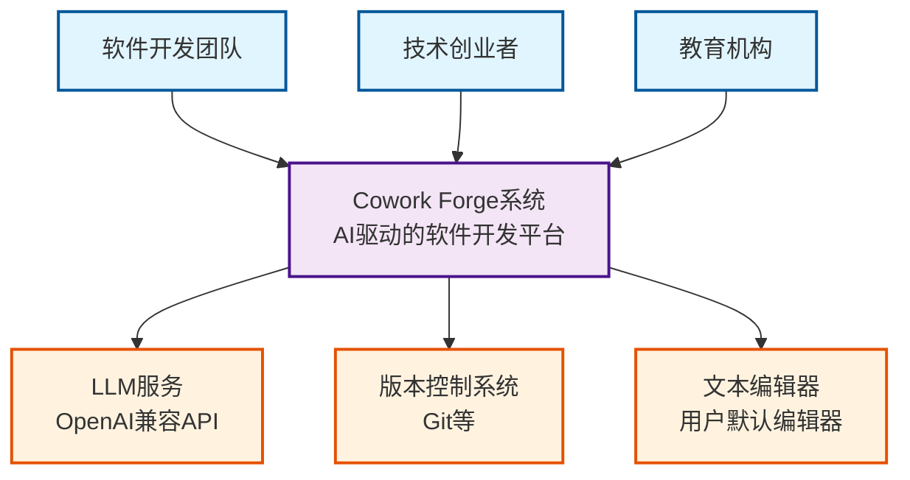

# Cowork Forge 系统上下文架构文档

*文档生成时间：2026-01-29 11:34:43 (UTC)*
*文档版本：v1.0*
*架构级别：C4 Model SystemContext*

## 1. 项目概述

### 1.1 项目简介
**Cowork Forge** 是一个基于AI驱动的智能化软件开发系统，通过命令行界面提供完整的软件开发生命周期管理。系统采用创新的多智能体协作架构，实现从项目构思到交付的全流程自动化，同时集成人机协作（HITL）机制确保开发质量和用户体验。

### 1.2 核心价值主张
- **效率提升**：通过AI智能体自动化软件开发生命周期，显著提升开发效率和质量
- **智能协作**：支持增量修改、版本回退和阶段重入，提供灵活的开发流程控制
- **低门槛使用**：降低软件开发的技术门槛，使非专业用户也能快速创建高质量的软件项目
- **标准化流程**：提供标准化的软件工程实践，确保项目质量和可维护性

### 1.3 技术特性
- **架构模式**：分层架构 + 多智能体协作模式
- **交互方式**：命令行界面（CLI）驱动的交互体验
- **核心机制**：Actor-Critic模式的智能体协作 + HITL人机交互
- **数据管理**：会话隔离的持久化存储架构

## 2. 目标用户分析

### 2.1 主要用户群体

#### 2.1.1 软件开发团队
- **用户描述**：需要快速原型开发和项目迭代的专业开发团队
- **核心需求**：
  - 快速项目启动和标准化开发流程
  - 自动化代码生成和质量保证
  - 版本控制和回退机制支持
  - 团队协作和知识沉淀

#### 2.1.2 技术创业者
- **用户描述**：具备基本技术背景但希望快速验证产品创意的创业者
- **核心需求**：
  - 快速MVP（最小可行产品）开发和验证
  - 降低开发成本和技术复杂性
  - 迭代式开发支持和快速反馈
  - 产品原型的高效创建

#### 2.1.3 教育机构
- **用户描述**：用于软件工程教学和项目实践的培训机构
- **核心需求**：
  - 标准化开发流程演示和教学
  - 自动化代码生成技术的实践教学
  - 项目模板管理和学习进度跟踪
  - 学生项目实践的平台支持

### 2.2 使用场景分析
- **新项目创建**：从构思到交付的完整生命周期管理
- **项目迭代优化**：基于现有项目的增量修改和功能增强
- **教学演示**：软件工程流程的标准演示和实践指导
- **原型验证**：快速创建技术原型进行市场验证

## 3. 系统边界定义

### 3.1 系统范围界定
**核心范畴**：AI辅助软件开发生命周期管理系统，专注于项目创建、修改、交付的智能化管理。

### 3.2 包含的核心组件
```plaintext
✓ 命令行界面（CLI） - 用户交互入口
✓ 多智能体工作流引擎 - 核心业务流程编排
✓ 项目会话管理 - 状态管理和隔离
✓ 文件操作工具 - 安全的文件系统操作
✓ 数据验证工具 - 数据完整性和格式验证
✓ HITL交互模块 - 人机协作机制
✓ LLM集成层 - AI能力接入
✓ 存储管理 - 持久化数据管理
```

### 3.3 明确排除的组件
```plaintext
✗ 代码编译和执行 - 属于运行时环境职责
✗ 数据库管理系统 - 外部基础设施组件
✗ 部署和运维 - 生产环境管理职责
✗ 用户界面渲染 - 前端展示层功能
✗ 网络服务部署 - 基础设施层服务
```

## 4. 外部系统交互

### 4.1 关键外部依赖系统

#### 4.1.1 LLM服务（大型语言模型API）
- **交互类型**：API调用
- **描述**：集成OpenAI兼容接口，提供AI智能决策和内容生成能力
- **依赖强度**：高（核心AI能力依赖）
- **集成方式**：通过LLM集成域的配置管理和API客户端

#### 4.1.2 版本控制系统
- **交互类型**：文件系统操作
- **描述**：基于Git等版本控制系统进行代码版本管理
- **依赖强度**：中（项目版本管理）
- **集成方式**：通过文件操作工具模块实现版本控制集成

#### 4.1.3 文本编辑器
- **交互类型**：进程调用
- **描述**：用户默认的文本编辑器用于HITL交互和内容编辑
- **依赖强度**：低（可选的人机交互）
- **集成方式**：通过HITL交互工具调用外部编辑器进程

### 4.2 交互模式分析
- **同步调用**：LLM API调用采用同步等待模式
- **异步操作**：文件操作和版本控制支持异步处理
- **事件驱动**：HITL交互采用事件驱动模式等待用户输入

## 5. 系统上下文图

### 5.1 C4 SystemContext Diagram



### 5.2 关键交互流程说明

#### 5.2.1 主工作流交互
1. **用户输入**：通过CLI界面提交项目需求或修改请求
2. **智能体处理**：多智能体协作处理软件开发生命周期各阶段
3. **外部依赖**：按需调用LLM服务、版本控制系统和文本编辑器
4. **结果输出**：生成项目文件、交付报告和版本控制记录

#### 5.2.2 错误处理流程
- **LLM服务异常**：重试机制和降级处理
- **文件系统错误**：回滚操作和错误报告
- **用户交互超时**：超时处理和默认选择

## 6. 技术架构概览

### 6.1 主要技术栈
- **编程语言**：Rust（高性能系统级语言）
- **架构模式**：分层架构 + 领域驱动设计
- **AI集成**：OpenAI兼容的LLM API集成
- **数据持久化**：基于文件系统的会话存储
- **CLI框架**：自定义命令行界面框架

### 6.2 核心架构模式

#### 6.2.1 分层架构设计
```
应用层（CLI应用域）     - 用户交互入口
    ↓
业务层（智能体工作流域） - 核心业务流程
    ↓
工具层（工具功能域）     - 具体功能操作
    ↓
数据层（数据存储域）     - 持久化管理
    ↓
基础设施层（LLM集成域） - 外部服务集成
```

#### 6.2.2 多智能体协作模式
- **Actor-Critic模式**：每个智能体配备评审器确保输出质量
- **流水线编排**：支持完整流程和部分流程的灵活组装
- **错误恢复**：HITL机制提供人工干预和错误纠正

### 6.3 关键设计决策

#### 6.3.1 会话隔离架构
- **设计理由**：支持多项目并行开发和状态隔离
- **实现方式**：基于文件系统的会话目录结构
- **优势**：避免状态冲突，支持并发操作

#### 6.3.2 模块化工具设计
- **设计理由**：提高代码复用性和可测试性
- **实现方式**：工具函数独立封装，智能体按需调用
- **优势**：易于扩展和维护，降低耦合度

#### 6.3.3 HITL人机协作
- **设计理由**：平衡自动化效率和人工质量控制
- **实现方式**：关键决策点引入人工审查和确认
- **优势**：提高输出质量，降低AI幻觉风险

## 7. 架构质量属性

### 7.1 可维护性
- **模块化设计**：清晰的领域边界和职责分离
- **测试支持**：工具函数的独立测试能力
- **文档完备**：完整的架构文档和代码注释

### 7.2 可扩展性
- **插件化架构**：新的智能体和工具易于集成
- **配置驱动**：LLM服务和其他参数可配置
- **接口抽象**：外部依赖通过抽象接口隔离

### 7.3 可靠性
- **错误恢复**：完善的异常处理和状态恢复机制
- **数据一致性**：通过验证工具确保数据完整性
- **速率限制**：LLM API调用的保护机制

### 7.4 可用性
- **渐进式交互**：支持从任意阶段重入工作流
- **用户反馈**：实时进度反馈和结果展示
- **帮助系统**：完善的命令行帮助文档

## 8. 总结与展望

Cowork Forge 通过创新的AI智能体架构，为软件开发生命周期管理提供了全新的解决方案。系统在保持高度自动化的同时，通过HITL机制确保开发质量，为不同技术背景的用户提供了统一的开发体验。

未来的架构演进可能包括：
- 更多智能体类型的支持
- 云端协作功能的扩展
- 插件生态系统的建设
- 性能优化和规模化改进

本系统上下文文档为后续的容器级和组件级架构设计提供了坚实的基础，确保了架构决策的一致性和可追溯性。

---
*文档版本：v1.0 | 生成时间：2026-01-29 11:34:43 (UTC) | 架构级别：SystemContext*