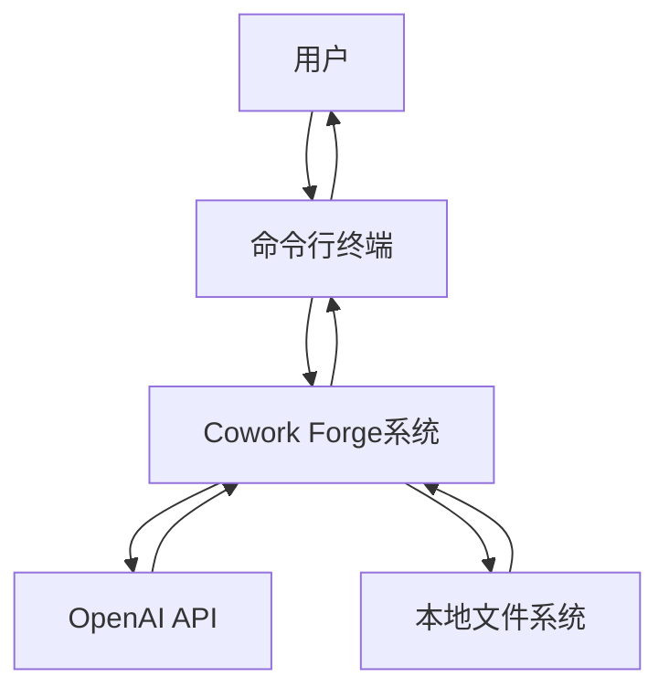

# Cowork Forge 系统上下文架构文档

*文档生成时间：2026-01-30 13:49:49 (UTC)*
*文档版本：v1.0*

## 1. 项目概述

### 1.1 项目基本信息
**项目名称**：Cowork Forge  
**项目类型**：命令行工具（CLI Tool）  
**核心价值**：降低软件开发门槛，提高开发效率，通过AI智能体协作减少人工编码工作量，实现快速原型开发和迭代。

### 1.2 系统描述
Cowork Forge是一个AI驱动的协作式软件开发系统，通过多智能体工作流实现从需求分析到代码交付的全流程自动化。系统采用分层架构设计，以命令行界面为主要交互方式，支持项目创建、修改、恢复和状态监控等核心功能，并内置人类参与循环（HITL）机制确保开发质量。

### 1.3 技术特征
- **架构模式**：分层架构 + 智能体协作模式
- **交互方式**：命令行界面（CLI）
- **核心机制**：多智能体工作流、人类参与循环（HITL）
- **技术栈**：Rust语言开发，模块化设计

## 2. 目标用户分析

### 2.1 主要用户角色

#### 软件开发者
- **角色描述**：需要快速原型开发或自动化编码辅助的专业开发人员
- **核心需求**：
  - 减少重复编码工作
  - 快速验证技术方案
  - 自动化代码生成
- **使用场景**：日常开发中的原型创建、代码重构、技术验证

#### 技术项目经理
- **角色描述**：负责项目规划和技术方案设计的管理人员
- **核心需求**：
  - 快速生成技术原型
  - 规范化开发流程
  - 项目状态可视化
- **使用场景**：项目规划阶段的技术方案验证、进度跟踪

#### 初创团队
- **角色描述**：资源有限需要快速验证产品概念的技术团队
- **核心需求**：
  - 降低开发成本
  - 加速产品迭代
  - 标准化开发流程
- **使用场景**：产品MVP开发、概念验证、快速迭代

### 2.2 用户交互模式
所有用户均通过命令行终端与系统交互，系统提供一致的操作体验和反馈机制。

## 3. 系统边界定义

### 3.1 系统范围
**核心业务范围**：AI辅助软件开发工作流管理系统

### 3.2 包含的核心组件
1. **CLI命令行接口** - 用户交互入口
2. **多智能体工作流引擎** - 流程编排核心
3. **会话管理系统** - 状态持久化管理
4. **文件操作工具集** - 本地文件读写
5. **验证工具集** - 数据格式和依赖验证
6. **存储管理层** - 项目数据持久化
7. **LLM集成层** - 外部AI服务对接

### 3.3 排除的外部依赖
- **代码编辑器**：系统不提供代码编辑功能
- **版本控制系统**：版本管理由外部工具处理
- **持续集成系统**：CI/CD流程不在系统范围内
- **部署平台**：应用部署由专门平台负责
- **数据库管理系统**：使用本地文件存储，不依赖外部数据库

## 4. 外部系统交互

### 4.1 外部依赖系统列表

#### OpenAI API
- **交互类型**：API调用
- **功能描述**：提供大语言模型服务用于AI智能体决策和代码生成
- **依赖程度**：关键依赖，影响核心智能体功能
- **交互频率**：高频调用，每个开发阶段都需要LLM参与

#### 本地文件系统
- **交互类型**：文件读写
- **功能描述**：存储项目文件、配置和会话数据
- **依赖程度**：核心依赖，系统运行的基础
- **数据格式**：结构化JSON文件、项目源代码文件

#### 命令行终端
- **交互类型**：用户交互
- **功能描述**：用户交互界面和命令执行环境
- **依赖程度**：必需依赖，唯一的用户交互渠道
- **兼容性**：支持主流命令行环境（Terminal、CMD、PowerShell等）

### 4.2 交互模式分析


## 5. 系统上下文图

### 5.1 C4 SystemContext 图描述

```mermaid
C4Context
    title Cowork Forge 系统上下文图
    
    Person(developer, "软件开发者", "使用系统进行快速原型开发")
    Person(pm, "技术项目经理", "使用系统进行技术方案验证")
    Person(startup, "初创团队", "使用系统加速产品迭代")
    
    System(cowork_forge, "Cowork Forge", "AI驱动的协作式软件开发系统")
    
    System_Ext(openai, "OpenAI API", "大语言模型服务提供商")
    System_Ext(filesystem, "本地文件系统", "项目文件和会话数据存储")
    System_Ext(terminal, "命令行终端", "用户交互界面")
    
    developer --> terminal
    pm --> terminal
    startup --> terminal
    
    terminal --> cowork_forge
    cowork_forge --> openai
    cowork_forge --> filesystem
```

### 5.2 关键交互流程

#### 主要数据流：
1. **用户指令流**：用户 → 终端 → Cowork Forge
2. **AI服务流**：Cowork Forge → OpenAI API → 智能决策
3. **数据持久化流**：Cowork Forge ↔ 本地文件系统
4. **结果反馈流**：Cowork Forge → 终端 → 用户

### 5.3 架构决策说明
- **选择CLI模式**：简化部署，降低使用门槛，适合开发者工作流
- **依赖外部LLM**：利用成熟的大语言模型能力，专注工作流编排
- **本地文件存储**：保证数据隐私，简化系统依赖
- **模块化设计**：支持功能扩展，便于维护和升级

## 6. 技术架构概览

### 6.1 主要技术栈
- **开发语言**：Rust
- **架构模式**：分层架构 + 领域驱动设计
- **外部依赖**：OpenAI API、本地文件系统
- **数据格式**：JSON、文本文件
- **并发模型**：基于异步任务的工作流执行

### 6.2 核心架构模式

#### 分层架构设计
系统采用清晰的分层架构，各层职责分明：
- **应用层**：CLI命令行接口，用户交互入口
- **工作流层**：多阶段执行流程管理
- **智能体层**：业务逻辑实现，AI智能体协作
- **工具层**：原子操作能力提供
- **数据层**：持久化存储管理
- **基础设施层**：外部服务集成

#### 智能体协作模式
采用Actor-Critic模式的智能体协作机制，每个智能体专注于特定开发阶段，通过工作流引擎协调执行。

### 6.3 关键设计决策

#### 人类参与循环（HITL）机制
- **设计意图**：确保AI生成内容的质量和准确性
- **实现方式**：在关键决策点引入人工审核和干预
- **价值**：平衡自动化效率与质量控制

#### 会话管理设计
- **持久化策略**：支持项目状态的保存和恢复
- **恢复机制**：允许从任意阶段重新开始工作流
- **数据完整性**：通过验证工具确保会话数据一致性

#### 工具化架构
- **可扩展性**：工具集采用插件化设计，支持功能扩展
- **安全性**：文件操作工具包含安全检查和权限控制
- **复用性**：工具可在不同智能体间共享使用

### 6.4 质量属性考虑

#### 可维护性
- 模块化设计，清晰的领域边界
- 完善的代码组织结构（crates模式）
- 详细的文档和注释支持

#### 可扩展性
- 工具集的插件化设计
- 工作流阶段的可配置性
- 智能体类型的可扩展支持

#### 可靠性
- 错误恢复机制（ResilientAgent）
- 速率限制控制（RateLimiter）
- 数据验证和完整性检查

## 7. 总结

Cowork Forge作为一个创新的AI辅助软件开发工具，通过精心设计的系统上下文架构，在降低开发门槛和提高效率方面展现出显著价值。系统的核心优势在于将复杂的工作流管理与AI智能体技术有机结合，同时通过人类参与循环机制确保输出质量。

该系统上下文文档为后续的技术设计、开发实施和系统演进提供了清晰的架构基础。基于当前分析，系统具有良好的扩展性和维护性，能够满足目标用户群体的核心需求。

---
*文档生成完成时间：2026-01-30 13:49:49 (UTC)*  
*置信度评分：0.95（基于现有研究数据）*