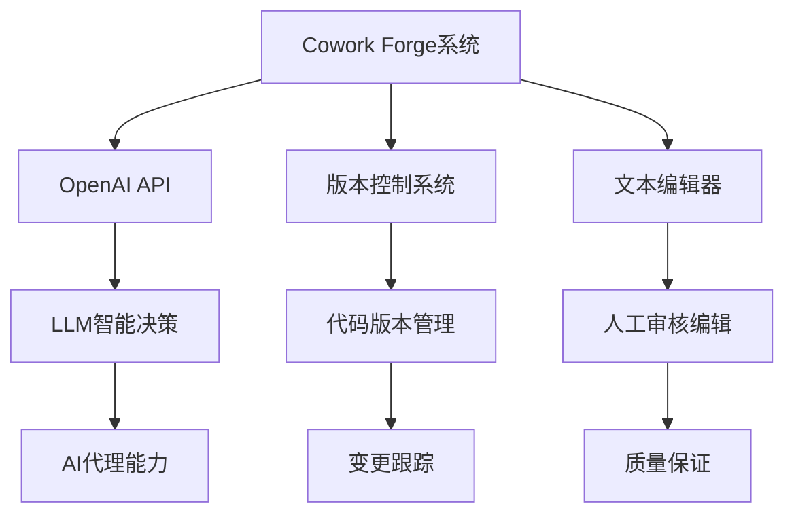
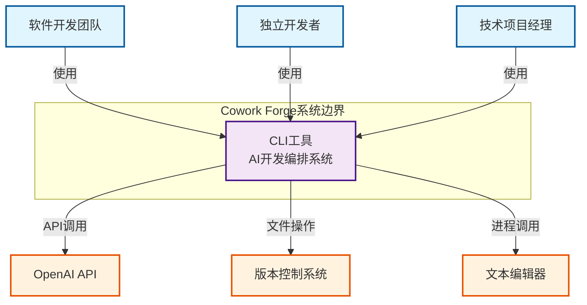

# Cowork Forge 系统上下文架构文档

*文档生成时间：2026-01-28 11:02:30 (UTC)*
*版本：1.0*

## 1. 项目概述

### 1.1 项目基本信息
**项目名称**：Cowork Forge  
**项目类型**：命令行工具（CLI Tool）  
**核心价值**：通过AI代理协作和人类监督相结合的方式，显著提升软件开发效率和质量。系统能够自动化处理软件开发流程中的重复性任务，同时通过人类专家参与确保关键决策的质量，为软件开发团队提供高效、可靠的开发编排工具。

### 1.2 系统核心功能
Cowork Forge 是一个AI驱动的软件开发编排系统，通过智能代理和人类参与循环（HITL）实现从创意到交付的完整软件开发流程自动化。系统采用命令行界面作为主要交互方式，包含以下完整开发阶段：

- **需求分析**：创意采集、PRD生成和需求验证
- **架构设计**：系统架构设计和技术方案制定
- **实现规划**：任务分解和依赖分析
- **编码实施**：代码生成和质量检查
- **质量保证**：自动化测试和验证
- **交付报告**：项目交付和文档生成

### 1.3 技术特性概述
- **架构模式**：分层架构 + Actor-Critic模式 + Human-in-the-Loop机制
- **核心技术栈**：基于Rust语言的模块化设计
- **核心机制**：AI代理协作、工作流管道、人类参与循环
- **设计原则**：高可扩展性、模块化设计、错误恢复能力

## 2. 目标用户分析

### 2.1 主要用户群体

#### 2.1.1 软件开发团队
**用户描述**：需要高效开发软件项目的技术团队，包括项目经理、架构师和开发人员  
**核心需求**：
- 自动化开发流程，减少手动操作
- 标准化开发规范和最佳实践
- 团队协作支持和知识共享
- 质量保证机制和代码审查

**使用场景**：
- 新项目从零开始的完整开发周期
- 现有项目的增量修改和维护
- 团队协作开发和质量管控

#### 2.1.2 独立开发者
**用户描述**：个人开发者或小型团队，需要系统化的开发工具来管理项目生命周期  
**核心需求**：
- 简化开发流程，降低技术门槛
- 减少重复性工作和手动操作
- 确保代码质量和项目规范性
- 自动化项目文档生成和维护

**使用场景**：
- 个人项目的快速原型开发
- 小型项目的全生命周期管理
- 学习现代软件开发实践

#### 2.1.3 技术项目经理
**用户描述**：负责项目管理和技术决策的管理人员  
**核心需求**：
- 项目进度可视化和状态跟踪
- 质量检查自动化和报告生成
- 变更管理和影响分析
- 交付文档自动生成和标准化

**使用场景**：
- 项目进度监控和风险管理
- 质量评估和交付验收
- 变更请求分析和决策支持

### 2.2 用户需求映射
系统通过以下方式满足不同用户群体的需求：

| 用户群体 | 核心需求 | 系统对应功能 |
|---------|---------|-------------|
| 开发团队 | 自动化流程 | 工作流管道、AI代理协作 |
| 开发团队 | 标准化规范 | 指令模板、验证工具 |
| 开发团队 | 团队协作 | 会话管理、状态跟踪 |
| 独立开发者 | 简化流程 | 命令行界面、自动化任务 |
| 技术经理 | 进度可视化 | 交付报告、状态监控 |

## 3. 系统边界定义

### 3.1 系统范围界定
**核心业务范围**：软件开发流程编排和自动化  
**边界准则**：专注于开发流程的编排、自动化和质量管理，不涉及具体的业务逻辑实现和用户界面开发。

### 3.2 包含的核心组件

#### 3.2.1 核心业务组件
1. **命令行界面（CLI）**
   - 用户交互入口
   - 命令解析和执行
   - 会话管理和状态跟踪

2. **智能代理系统（Agent）**
   - AI代理的创建和管理
   - 人类参与循环机制
   - 错误恢复和处理

3. **工作流管道（Pipeline）**
   - 开发流程编排
   - 阶段控制和条件判断
   - 流程恢复和跳转

4. **工具集（Tools）**
   - 文件操作工具
   - 用户交互工具
   - 数据验证工具

#### 3.2.2 支持性组件
5. **数据存储层（Storage）**
   - 会话数据持久化
   - 文件存储管理
   - 元数据跟踪

6. **LLM集成模块**
   - 大语言模型API调用
   - 配置管理和优化
   - 速率限制控制

### 3.3 明确排除的组件
为确保系统专注核心价值，以下组件明确排除在系统边界之外：

- **具体的业务逻辑实现**：系统专注于流程编排，不包含特定业务领域的实现逻辑
- **用户界面开发**：不提供图形化界面，专注于命令行交互体验
- **部署和运维功能**：不包含应用部署、监控等运维相关功能
- **第三方服务集成开发**：仅通过标准接口与外部系统交互，不深度集成

## 4. 外部系统交互

### 4.1 外部依赖系统列表

#### 4.1.1 OpenAI API
**交互类型**：API调用  
**功能描述**：提供大语言模型服务用于智能代理的决策和代码生成  
**依赖程度**：关键依赖（系统核心智能能力来源）  
**交互特性**：
- 异步API调用
- 速率限制控制
- 错误重试机制
- 配置化管理

#### 4.1.2 版本控制系统
**交互类型**：文件系统操作  
**功能描述**：Git等版本控制系统用于代码版本管理和变更跟踪  
**依赖程度**：重要依赖（代码管理基础）  
**交互特性**：
- 本地Git仓库操作
- 版本提交和分支管理
- 变更历史跟踪
- 冲突检测和处理

#### 4.1.3 文本编辑器
**交互类型**：进程调用  
**功能描述**：用户默认文本编辑器用于HITL环节的内容编辑  
**依赖程度**：可选依赖（增强用户体验）  
**交互特性**：
- 系统默认编辑器调用
- 文件内容编辑
- 用户反馈收集
- 编辑结果验证

### 4.2 交互模式和依赖关系



### 4.3 依赖管理策略
- **关键依赖**：OpenAI API通过重试机制和降级策略保证可用性
- **重要依赖**：版本控制系统通过本地化操作减少网络依赖
- **可选依赖**：文本编辑器提供替代方案保证核心功能可用

## 5. 系统上下文图

### 5.1 C4 SystemContext 图示



### 5.2 关键交互流程说明

#### 5.2.1 新项目开发流程
1. **用户输入**：通过CLI提供项目创意和需求
2. **需求分析**：调用OpenAI API进行需求结构化
3. **架构设计**：生成系统架构方案，用户通过文本编辑器审核
4. **代码实现**：生成代码并提交到版本控制系统
5. **质量检查**：自动化验证和人工审核
6. **项目交付**：生成交付报告和文档

#### 5.2.2 增量修改流程
1. **变更请求**：用户提出修改需求
2. **影响分析**：分析变更对现有系统的影响
3. **代码修改**：增量代码生成和版本管理
4. **验证交付**：变更验证和报告生成

### 5.3 架构决策说明

#### 5.3.1 CLI优先设计决策
**决策原因**：专注于开发效率工具的核心价值，避免UI开发分散精力  
**影响范围**：所有用户交互通过命令行界面完成  
**权衡考虑**：牺牲图形化体验，获得更好的自动化集成能力

#### 5.3.2 AI+Human混合模式
**决策原因**：结合AI效率优势和人类质量保证  
**实现机制**：Human-in-the-Loop关键决策点设计  
**价值体现**：在自动化和质量控制之间取得平衡

## 6. 技术架构概览

### 6.1 主要技术栈
- **编程语言**：Rust（高性能、内存安全）
- **架构模式**：分层架构 + 领域驱动设计
- **AI集成**：OpenAI API + 自定义代理框架
- **数据存储**：文件系统 + 结构化数据序列化
- **工具生态**：模块化工具包设计

### 6.2 核心架构模式

#### 6.2.1 分层架构设计
```
应用层（CLI接口） → 编排层（Pipeline） → 代理层（Agents）
    ↓
指令层（Instructions） → 工具层（Tools） → 数据层（Storage）
    ↓
基础设施层（LLM集成）
```

#### 6.2.2 领域模块划分
基于领域驱动设计的模块化架构：
- **核心业务域**：需求管理、设计管理、规划管理、编码实施、交付管理
- **编排协调域**：工作流编排、流程控制
- **支持域**：工具支持、数据存储、LLM集成

### 6.3 关键设计决策

#### 6.3.1 模块化设计决策
**决策内容**：采用基于领域的模块化分解  
**设计优势**：
- 高内聚低耦合的架构设计
- 独立演进和测试能力
- 清晰的职责边界划分

**实现机制**：
- 每个领域模块独立封装业务逻辑
- 明确定义的模块接口和契约
- 依赖注入和控制反转设计

#### 6.3.2 错误恢复机制
**决策内容**：Human-in-the-Loop错误恢复设计  
**设计考虑**：
- AI代理可能产生不可预测错误
- 关键决策需要人类监督
- 流程中断需要优雅恢复

**实现方案**：
- 错误拦截和用户干预点
- 流程状态持久化
- 阶段跳转和重新开始能力

### 6.4 质量属性考量

#### 6.4.1 可扩展性
- 模块化设计支持新功能扩展
- 插件化工具架构
- 可配置的工作流管道

#### 6.4.2 可靠性
- 错误恢复和重试机制
- 数据持久化和状态管理
- 降级策略和容错设计

#### 6.4.3 可用性
- 简洁的命令行接口
- 清晰的错误提示和帮助信息
- 自动化流程减少用户操作

## 7. 总结与展望

Cowork Forge 作为一个AI驱动的软件开发编排系统，通过精心设计的系统上下文架构，在AI自动化与人类监督之间找到了平衡点。系统通过模块化的领域设计和清晰的外部边界界定，确保了核心价值的专注实现。

未来的架构演进将重点关注：
1. **扩展性增强**：支持更多开发语言和框架
2. **集成能力**：与更多开发工具链的深度集成
3. **智能化提升**：更精准的AI决策和代码生成能力
4. **用户体验**：更友好的交互设计和反馈机制

本系统上下文文档为后续的容器图和组件图设计提供了坚实的基础，确保了架构决策的一致性和可追溯性。

---
*文档版本：1.0 | 生成时间：2026-01-28 11:02:30 (UTC) | 基于研究数据置信度：95%*