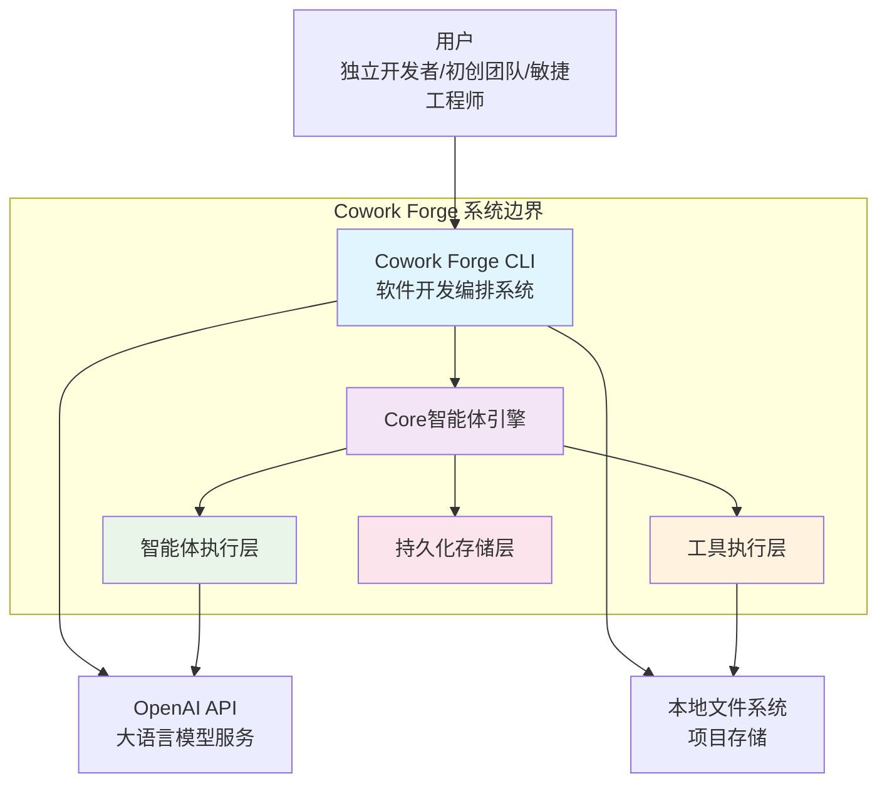

# Cowork Forge 系统上下文架构文档

**文档版本**: 1.0  
**生成时间**: 2026-01-29 06:34:02 (UTC)  
**文档类型**: C4模型 SystemContext级别架构文档

## 1. 项目概述

### 1.1 项目基本信息
- **项目名称**: Cowork Forge
- **项目类型**: CLI工具（命令行界面应用）
- **核心定位**: 基于AI智能体的软件开发编排系统

### 1.2 核心价值主张
Cowork Forge 通过多智能体协作流程自动化完成从需求构思到代码交付的完整软件开发周期。系统采用"最小可行架构"原则，强制拒绝过度设计，旨在显著降低开发者的认知负荷与手动操作成本。其核心价值体现在：

- **效率提升**: 自动化处理重复性、流程化开发工作
- **质量保证**: 通过结构化流程确保代码质量一致性
- **敏捷支持**: 支持增量修改与历史回溯，适合快速迭代场景
- **成本优化**: 特别为资源有限的初创团队和独立开发者设计

### 1.3 技术特性概览
- **架构风格**: 模块化分层架构，遵循"编排层-智能体层-工具层-数据层"四层结构
- **核心语言**: Rust语言构建，强调性能与安全性
- **智能体模式**: 采用Actor-Critic双智能体协作机制
- **交互机制**: 人类参与循环（HITL）在关键节点引入人工审核
- **持久化策略**: 基于文件系统的JSON/Markdown存储，严格限制操作范围

## 2. 目标用户分析

### 2.1 独立开发者
**用户画像**: 缺乏团队支持的个人开发者，希望快速将想法转化为可运行的代码。

**核心需求**:
- 自动化完成从想法到代码的全流程
- 避免过度设计，专注于核心功能实现
- 获得结构化交付报告用于展示或存档
- 支持中途修改与恢复工作状态

**典型使用场景**: 个人项目原型开发、开源工具快速实现、学习项目的快速验证。

### 2.2 初创团队
**用户画像**: 资源有限的小型创业团队，需要快速验证产品可行性。

**核心需求**:
- 标准化开发流程以减少团队沟通成本
- 通过AI辅助确保需求与实现的一致性
- 生成可交付的文档与代码包
- 支持轻量级迭代与变更追踪

**典型使用场景**: MVP产品开发、概念验证、快速原型迭代。

### 2.3 敏捷开发工程师
**用户画像**: 熟悉敏捷方法的开发者，希望借助AI工具提升效率但保留控制权。

**核心需求**:
- 在关键节点保留人工审核权限（HITL机制）
- 灵活控制开发流程的启动与回退
- 获取清晰的变更影响分析报告
- 避免AI生成冗余代码或测试

**典型使用场景**: 敏捷项目开发、代码重构、功能扩展。

## 3. 系统边界定义

### 3.1 系统范围界定
Cowork Forge CLI工具及其核心智能体引擎，专注于软件开发流程的自动化编排，不包含任何前端界面、Web服务或复杂的后端基础设施。

### 3.2 包含的核心组件
```plaintext
✓ cowork-cli（命令行入口点）
✓ cowork-core（核心智能体引擎）
  - 智能体指令域（10个智能体模板）
  - 智能体执行域（运行时管理）
  - 工具执行域（11个操作工具）
  - 持久化存储域（会话管理）
  - LLM集成域（模型服务对接）
✓ LLM配置与速率限制模块
✓ 文件系统操作工具集
✓ JSON/Markdown持久化存储
✓ HITL人机交互工具
```

### 3.3 明确排除的外部依赖
```plaintext
✗ Web前端界面或图形化界面
✗ 移动应用或跨平台客户端
✗ 云服务部署系统
✗ CI/CD流水线（如GitHub Actions）
✗ 数据库服务（如PostgreSQL、MongoDB）
✗ 测试框架集成
✗ 系统监控与日志服务
✗ 第三方API网关
```

## 4. 外部系统交互

### 4.1 OpenAI API服务
**交互类型**: API调用（单向依赖）  
**角色描述**: 作为底层大语言模型服务提供方，负责执行智能体的推理与生成任务。

**交互细节**:
- 通过自定义配置连接OpenAI兼容的API端点
- 支持模型参数调优与速率限制控制
- 智能体执行过程中发起推理请求
- 依赖强度: 高（核心功能依赖）

### 4.2 本地文件系统
**交互类型**: 文件读写（双向交互）  
**角色描述**: 作为持久化存储介质，保存所有开发会话数据与项目文件。

**交互细节**:
- 严格限制操作范围在项目根目录内
- 存储结构化文档（JSON/Markdown）与中间产物
- 支持会话状态的保存与恢复
- 安全机制: 路径验证防止越权访问

### 4.3 用户终端（CLI）
**交互类型**: 命令行交互（双向交互）  
**角色描述**: 作为人机交互的主要接口，用户通过命令行与系统进行交互。

**交互细节**:
- 用户输入指令启动项目、提供反馈、编辑内容
- 系统通过交互式工具实现双向沟通
- 支持流程中断与恢复控制
- 交互频率: 中等（关键节点交互）

## 5. 系统上下文图

### 5.1 C4 SystemContext Diagram



### 5.2 关键交互流程说明

#### 5.2.1 主开发流程
```
用户指令 → CLI解析 → 流水线编排 → 智能体执行 → 工具调用 → 数据持久化
```

#### 5.2.2 外部依赖调用链
```
智能体推理需求 → LLM API调用 → 响应处理 → 结果持久化
用户文件操作 → 工具层封装 → 文件系统IO → 状态更新
```

### 5.3 架构决策说明

**决策1**: 选择CLI工具模式而非Web应用  
**理由**: 更符合开发者工作习惯，降低部署复杂度，便于集成到现有开发流程中。

**决策2**: 采用模块化分层架构  
**理由**: 职责分离明确，便于测试和维护，支持功能的独立演进。

**决策3**: 依赖文件系统而非数据库  
**理由**: 简化技术栈，降低运维成本，更适合小型项目和快速原型开发。

## 6. 技术架构概览

### 6.1 主要技术栈
- **开发语言**: Rust（强调内存安全与性能）
- **智能体框架**: 基于LLM的自主智能体架构
- **持久化方案**: JSON文件存储 + Markdown文档
- **配置管理**: TOML配置文件 + 环境变量
- **CLI框架**: Rust标准命令行参数解析

### 6.2 架构模式应用

#### 6.2.1 分层架构模式
```
表现层 (CLI入口) → 应用层 (流水线编排) → 领域层 (智能体引擎) → 基础设施层 (存储/LLM)
```

#### 6.2.2 智能体协作模式
采用Actor-Critic双智能体模式，每个开发阶段由Actor生成内容，Critic进行质量评估，形成自我完善的闭环。

#### 6.2.3 HITL人机交互模式
在关键决策点引入人工审核，确保AI生成内容符合用户意图，平衡自动化与可控性。

### 6.3 关键设计决策

#### 6.3.1 最小可行架构原则
**决策**: 强制拒绝过度设计，专注于核心价值交付  
**影响**: 系统保持轻量级，降低使用门槛，提升开发效率

#### 6.3.2 会话隔离设计
**决策**: 每个项目独立会话目录，状态完全隔离  
**影响**: 支持多项目并行开发，避免状态污染

#### 6.3.3 工具化架构
**决策**: 将复杂操作封装为原子化工具  
**影响**: 提升代码复用性，降低智能体复杂度

## 7. 总结与展望

Cowork Forge 作为一个创新的AI驱动软件开发工具，通过智能体协作和流程自动化，为软件开发带来了新的可能性。其系统上下文架构体现了简洁性、实用性和扩展性的平衡，为后续的功能演进奠定了坚实的基础。

当前架构支持的核心业务流程包括全新项目创建、增量修改、阶段恢复和人机交互反馈，覆盖了软件开发的主要场景。随着技术的不断发展，该系统具备向更复杂开发场景扩展的潜力。

---
**文档生成说明**: 本文档基于系统上下文研究报吿和领域模块分析结果自动生成，准确反映了Cowork Forge系统的当前架构状态。