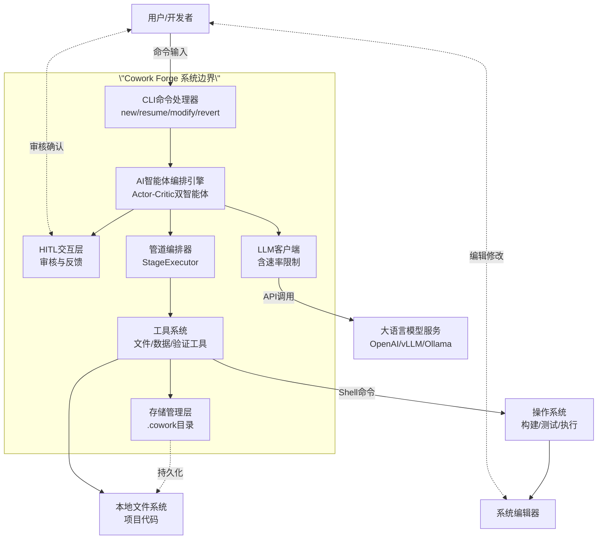
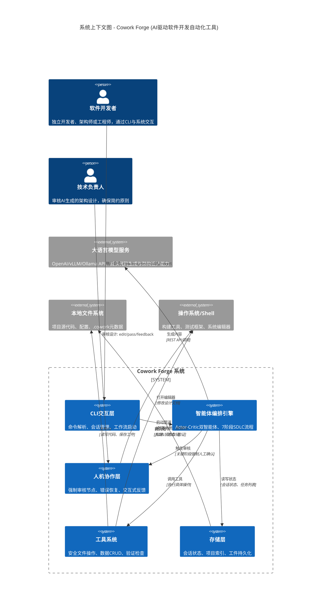
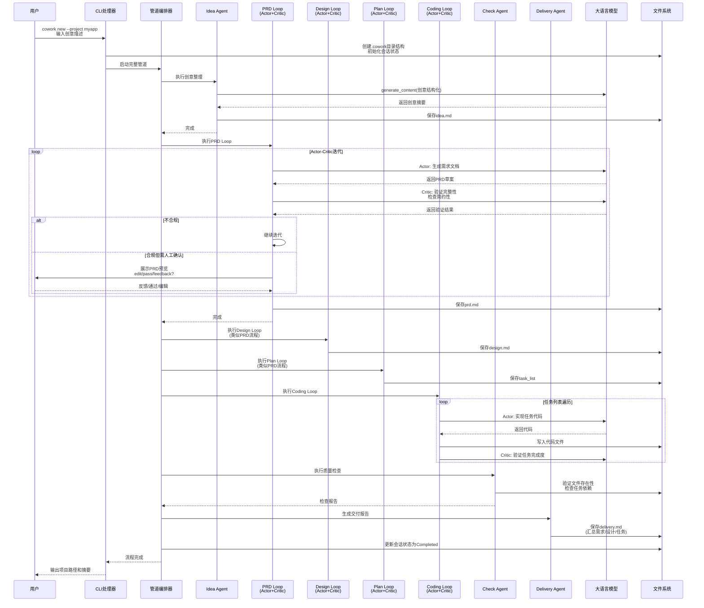
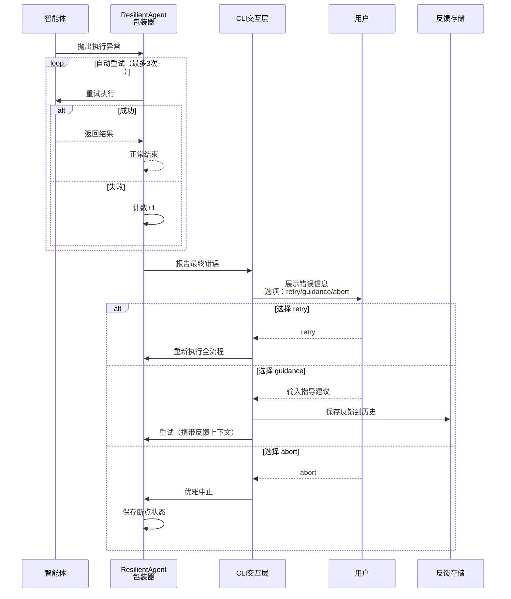

# Cowork Forge 系统上下文架构文档

**文档版本**: v1.0  
**生成时间**: 2025-01-21  
**文档级别**: C4 System Context (Level 1)

---

## 1. 项目概述

### 1.1 系统简介

**Cowork Forge** 是一款基于AI智能体的软件开发自动化CLI工具，采用多智能体Actor-Critic协作架构，旨在通过人工智能代理（AI Agents）的协作自动化完整的软件开发生命周期（SDLC）。系统覆盖从需求构思到最终交付的七个核心阶段：需求分析（Idea）、产品设计（PRD）、架构设计（Design）、任务规划（Plan）、代码实现（Coding）、质量检查（Check）和项目交付（Delivery）。

### 1.2 核心业务价值

Cowork Forge 通过以下方式创造业务价值：

- **开发效率提升**：通过AI自动化需求分析、架构设计、代码生成等关键环节，显著降低软件开发的复杂度，使独立开发者和小团队能够快速将创意转化为可交付软件
- **质量保障机制**：采用**人机协作模式（HITL, Human-in-the-Loop）**，在PRD、Design、Plan等关键质量节点强制引入人工审核，确保AI生成内容符合业务预期
- **简约架构约束**：贯彻\"简约优先\"（Simplicity-First）原则，通过指令模板强制约束架构设计（限制2-4个核心组件）和任务规划（5-12个核心任务），防止AI陷入过度工程化（Over-Engineering）和无限迭代循环
- **灵活工作模式**：支持**完整新建（New）**、**增量修改（Modify）**、**断点恢复（Resume）**和**版本回退（Revert）**四种工作模式，通过会话隔离机制实现多项目并行开发和状态可追溯性

### 1.3 关键技术特征

| 特征维度 | 技术实现 | 业务价值 |
|---------|---------|---------|
| **多智能体架构** | Actor-Critic双智能体协作模式（执行Agent + 审核Agent） | 确保每阶段输出质量，实现自我纠正机制 |
| **管道编排引擎** | 基于ADK（Agent Development Kit）的顺序阶段执行器 | 支持灵活的流程组合（完整流程、部分流程、续接流程） |
| **弹性错误恢复** | ResilientAgent包装器（自动重试+人机决策） | 执行失败时自动重试3次，仍失败则提供交互式恢复选项 |
| **文件安全控制** | 路径遍历防护 + 命令执行沙箱（30秒超时） | 防止AI操作越权，保障用户本地环境安全 |
| **状态持久化** | 基于JSON的本地文件系统存储（.cowork目录） | 实现会话级隔离、断点续接和版本回溯 |

---

## 2. 目标用户与使用场景

### 2.1 用户角色定义

系统服务三类核心用户角色，每类角色关注不同的功能维度：

#### 2.1.1 独立开发者 / 技术创业者
- **特征描述**：需要将创意快速转化为MVP（最小可行产品）的独立开发者，或构建原型验证市场需求的初创团队
- **核心诉求**：
  - 避免从零开始的架构设计负担，直接获得可维护的初始代码库
  - 支持快速原型验证和新需求快速迭代
  - 能够从任意断点恢复开发，无需重复已完成的工作
- **典型场景**：通过`cowork new`命令输入产品创意，系统自动生成完整的Web应用代码、数据库模型和API接口

#### 2.1.2 技术架构师
- **特征描述**：负责技术选型、架构评审和技术债务管理的技术负责人
- **核心诉求**：
  - 确保AI生成的架构符合简约原则，避免微服务过度拆分或抽象层过度设计
  - 在设计阶段（Design Loop）进行人工审核，把控技术选型和模块划分合理性
  - 防止AI在实现阶段陷入无限迭代（通过escalate标志和最大迭代限制）
- **典型场景**：审核AI生成的`design.md`文档，确认组件划分在2-4个以内，必要时使用系统编辑器直接修改架构决策

#### 2.1.3 软件开发工程师
- **特征描述**：寻求在AI辅助下提升编码效率和代码质量的实现工程师
- **核心诉求**：
  - 基于明确的任务列表（Task List）指导AI生成代码，确保功能覆盖度
  - 通过代码质量检查工具验证AI生成代码的依赖正确性和文件完整性
  - 支持增量修改现有项目，实现类似\"AI辅助重构\"的能力
- **典型场景**：使用`cowork modify`命令输入变更需求，AI分析影响范围后自动修改相关代码文件，并生成变更报告

### 2.2 使用场景矩阵

| 工作模式 | 触发命令 | 适用场景 | 关键特性 |
|---------|---------|---------|---------|
| **完整新建** | `cowork new --project <name>` | 从零开始构建新项目 | 全阶段执行，生成完整工件链（idea→prd→design→plan→code→check→delivery） |
| **断点恢复** | `cowork resume --session <id>` | 因错误中断或主动停止后继续 | 自动检测已完成阶段，从断点续接执行 |
| **增量修改** | `cowork modify --change <desc>` | 对现有项目需求变更或功能增强 | 变更影响分析（PRD/Design/Plan/Code），执行代码补丁 |
| **版本回退** | `cowork revert --to <stage>` | 对某阶段结果不满意，重新生成 | 继承前置状态，清空目标阶段及后续工件，重新执行 |

---

## 3. 系统边界与范围

### 3.1 系统边界定义

Cowork Forge作为本地运行的CLI工具，其系统边界明确区分了**内部核心能力**与**外部依赖责任**，采用\"轻内核+重智能\"的边界策略：系统本身提供编排、协调和质量控制能力，而将智能计算外包给外部LLM服务。

**边界划定原则**：
- **包含边界**：智能体生命周期管理、工作流编排、本地状态持久化、人机交互协调、文件安全访问控制
- **排除边界**：LLM模型推理、代码运行时环境、分布式协作服务、云基础设施管理

### 3.2 系统内部组件（Included Components）

系统内部包含以下核心子系统，共同构成完整的AI驱动开发能力：

| 组件类别 | 具体组件 | 功能职责 |
|---------|---------|---------|
| **交互入口层** | CLI命令行界面 | 支持6个核心命令（new/resume/revert/modify/status/init），基于clap实现参数解析，集成tracing结构化日志 |
| **智能体编排层** | 多智能体编排系统 | 实现7个阶段的Actor-Critic双智能体（Idea、PRD、Design、Plan、Coding、Check、Delivery），智能体工厂模式创建 |
| **质量保障层** | HITL交互层 | 强制人工审核节点，支持edit/pass/feedback三种交互模式，集成系统默认编辑器 |
| **流程控制层** | 管道编排引擎 | StageExecutor顺序执行各阶段，支持四种管道构建器（完整/续接/部分/修改） |
| **工具抽象层** | 内部工具系统 | 11类标准化工具：数据操作工具集、文件操作工具（含路径安全验证）、验证检查工具、HITL交互工具、变更管理工具等 |
| **数据管理层** | 会话与状态存储 | 基于JSON文件的本地持久化，管理.cowork目录结构，实现ProjectIndex和Session状态机 |
| **基础设施层** | LLM客户端与速率限制器 | 封装OpenAI兼容API，支持vLLM/Ollama等，实现RateLimitedLlm（默认2秒延迟，<30次/分钟） |

### 3.3 系统外部依赖（Excluded Components）

以下组件/系统明确处于Cowork Forge系统边界之外，系统通过标准化接口与其交互但不负责其内部实现：

| 外部系统类别 | 排除项 | 边界说明 |
|-------------|--------|---------|
| **AI计算资源** | LLM服务的内部实现细节 | 仅通过REST API调用外部LLM，不托管模型推理服务 |
| **运行时环境** | 实际业务应用程序的运行时 | 生成代码但不负责编译、部署或运行用户业务应用 |
| **开发环境** | IDE或编辑器插件 | 调用系统默认编辑器（如vim/vscode）但不实现编辑器功能 |
| **DevOps设施** | CI/CD流水线集成、容器编排平台（K8s）、云基础设施管理 | 生成适合CI/CD的配置但不直接集成这些平台 |
| **版本控制** | 分布式版本控制系统服务端（Git服务端） | 操作本地文件系统但不直接操作Git服务器 |
| **测试框架** | 测试自动化框架（pytest/jest等）的详细配置 | 通过RunCommandTool调用测试命令但不管理框架配置 |

---

## 4. 外部系统交互与依赖

Cowork Forge 作为本地CLI工具，与四类外部系统存在紧密的交互关系，这些外部系统构成了系统运行的必要生态环境。

### 4.1 大语言模型服务（LLM Services）

**交互方式**：REST API调用（OpenAI兼容接口）

**功能定位**：系统的\"智能大脑\"，提供自然语言理解、代码生成、架构设计等认知能力。

**详细交互描述**：
- **接口标准**：支持OpenAI API格式，兼容vLLM、Ollama等本地或云端部署方案
- **调用场景**：
  - Idea阶段：理解并结构化用户原始创意
  - PRD阶段：生成产品需求文档
  - Design阶段：创建系统架构设计（受简约原则约束）
  - Coding阶段：根据任务列表生成代码实现
- **质量控制**：通过RateLimitedLlm装饰器实现速率限制（默认2秒延迟，确保调用频率<30次/分钟），防止API限流和成本失控

### 4.2 本地文件系统（Local File System）

**交互方式**：文件IO操作（读写、目录遍历）

**功能定位**：系统的\"持久化层\"，存储项目代码、会话数据和中间工件。

**详细交互描述**：
- **项目代码空间**：用户指定的工作目录，AI在此生成、修改源代码文件
- **系统元数据目录**（.cowork/）：位于用户主目录或项目根目录，存储：
  - `project_index.json`：会话索引和状态追踪
  - `sessions/<id>/`：各会话的工件目录（idea.md、prd.md、design.md等）
  - `state.json`：运行时状态数据（需求、任务、功能列表等）
- **安全措施**：所有文件操作通过`validate_path_security`进行路径遍历防护，限制AI只能访问项目目录和系统元数据目录

### 4.3 操作系统/Shell

**交互方式**：命令执行（Shell命令调用）、进程管理

**功能定位**：系统的\"执行层\"，提供构建、验证和编辑能力。

**详细交互描述**：
- **命令执行**：通过`RunCommandTool`执行shell命令进行：
  - 项目构建（如`cargo build`、`npm install`）
  - 测试验证（如`pytest`、`cargo test`）
  - 代码检查（如`clippy`、`eslint`）
  - **安全约束**：30秒超时机制、拦截阻塞性服务命令（如`systemctl start`）
- **编辑器集成**：通过系统调用打开用户默认编辑器（`$EDITOR`），支持在HITL审核阶段人工编辑AI生成的文档（如修改design.md）

### 4.4 终端交互界面（Terminal UI）

**交互方式**：标准输入输出（STDIN/STDOUT），基于dialoguer库

**功能定位**：系统的\"人机接口\"，实现HITL（Human-in-the-Loop）协作。

**详细交互描述**：
- **交互模式**：对话式CLI，支持：
  - **菜单选择**：在Idea、PRD、Design、Plan阶段展示edit/pass/feedback选项
  - **内容预览**：显示AI生成文档的前12-15行摘要供快速审核
  - **反馈捕获**：支持用户输入文本反馈指导AI迭代
  - **错误决策**：执行失败时提供retry/guidance/abort选项
- **实时反馈**：支持LLM流式输出（--stdout标志），实时显示AI思考过程

### 4.5 外部交互关系图（逻辑视图）

**图注**：实线表示数据/控制流，虚线表示人机交互或持久化关系。

---

## 5. 系统上下文架构图（C4 System Context）

下图展示了Cowork Forge在整体架构中的位置及其与外部参与者和系统的关系：

### 5.1 关键架构决策说明

#### 决策1：本地优先（Local-First）架构
**决策内容**：系统作为本地CLI工具运行，不依赖云服务端（除LLM API外），所有状态和数据本地存储。  
**决策理由**：
- 保护用户代码隐私，敏感代码不离开本地环境
- 支持离线工作（除需要LLM生成内容时）
- 降低运维复杂度，无需维护多租户云服务

#### 决策2：Actor-Critic双智能体模式
**决策内容**：每个关键阶段（PRD/Design/Plan/Coding）配置两个智能体：Actor负责生成内容，Critic负责质量验证。  
**决策理由**：
- 实现自我纠正机制，Critic可强制Actor迭代改进
- 防止单一智能体陷入确认偏误（Confirmation Bias）
- 通过Critic强制执行\"简约优先\"约束（如组件数量检查）

#### 决策3：强制人机协作（Mandatory HITL）
**决策内容**：在Idea→PRD→Design→Plan的关键转换节点设置强制人工审核，未通过审核无法进入下一阶段。  
**决策理由**：
- AI可能产生幻觉（Hallucination），特别是在需求理解阶段
- 早期错误若未被发现，在Coding阶段修正成本极高
- 确保业务意图与技术实现的正确对齐

#### 决策4：文件系统即状态存储（File System as State Store）
**决策内容**：使用JSON文件和Markdown文档作为唯一状态存储，不引入数据库。  
**决策理由**：
- 利用Git进行状态版本控制（.cowork目录可加入.gitignore或版本控制）
- 人工可读的工件（prd.md、design.md）便于直接审查和修改
- 简化架构，降低系统复杂度

---

## 6. 核心业务流与交互序列

### 6.1 完整新建工作流（Happy Path）

### 6.2 弹性错误恢复流程

当智能体执行遇到异常（如LLM服务超时、Max Iterations达到上限）时，系统启动弹性恢复机制：

---

## 7. 非功能性需求与约束

### 7.1 安全约束

- **路径安全**：所有文件操作通过`validate_path_security`验证，禁止访问项目目录和.cowork目录之外的文件，防止路径遍历攻击（Path Traversal）
- **命令安全**：`RunCommandTool`实现30秒超时和服务命令拦截（禁止执行`systemctl`、`service`等系统管理命令）
- **数据隔离**：会话级隔离机制确保多项目并行开发时数据不混淆，通过UUID会话ID和独立的session目录实现

### 7.2 性能特征

- **LLM调用频率**：通过RateLimitedLlm限制为<30次/分钟，避免API限流和过高的API成本
- **并发模型**：当前版本采用顺序执行模型（Sequential Execution），各阶段和任务按顺序执行，确保状态一致性
- **资源占用**：作为CLI工具，内存占用主要来自LLM上下文缓存和项目文件索引，典型场景<500MB内存

### 7.3 可观测性

- **结构化日志**：集成`tracing`框架，支持RUST_LOG环境变量控制日志级别，输出JSON格式结构化日志便于分析
- **会话追踪**：每个会话拥有唯一的UUID和完整的状态历史（State Transitions），支持通过`cowork status`查看当前会话进度

---

## 8. 总结与架构演进方向

### 8.1 架构核心洞察

Cowork Forge的架构设计体现了**\"智能编排，人工把控\"**的核心理念：

1. **分层隔离**：通过CLI层、编排层、智能体层、工具层的清晰分层，实现了业务逻辑与技术实现的解耦
2. **反馈驱动**：HITL机制不仅仅是一个功能特性，而是架构的核心支柱，确保AI的自主性与人类的控制力的平衡
3. **简约约束**：通过指令模板（Instruction Templates）和Critic智能体，将\"简约优先\"原则从建议转化为强制性架构约束

### 8.2 未来演进方向（非当前范围）

基于当前System Context，系统未来可能扩展的方向包括：

- **IDE插件集成**：将CLI能力封装为VSCode/JetBrains插件，提供更流畅的编辑体验（当前排除在边界外）
- **多模态支持**：引入图像理解能力，支持基于UI草图生成前端代码（当前仅支持文本交互）
- **团队协作**：实现基于Git的会话共享和冲突解决，支持多人协作模式（当前为单用户会话隔离）

---

**文档结束**

*本文档基于C4模型System Context级别规范编写，描述了Cowork Forge系统的整体轮廓、用户角色、外部依赖和核心业务流。如需了解Container（容器）级别或Component（组件）级别的详细架构，请参阅相关补充文档。*
