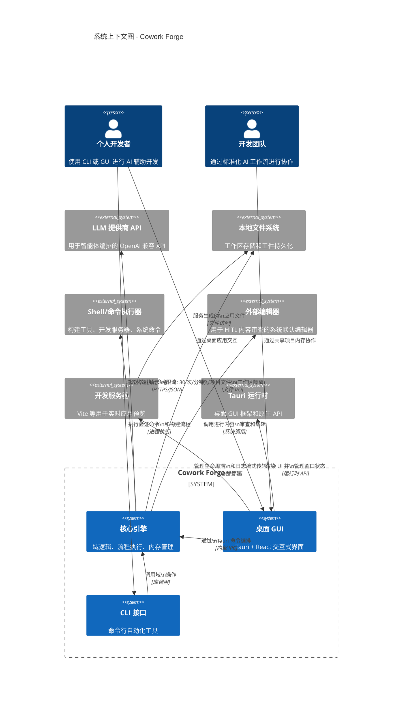

# 项目概述：Cowork Forge 系统上下文

## 1. 执行摘要

**Cowork Forge** 是一个 AI 原生的迭代式软件开发平台，通过结构化的七阶段开发流程编排自主多智能体工作流。该系统利用大型语言模型（LLM）将自然语言想法转化为生产就绪的软件，同时通过复杂的内存管理系统维护项目连续性。

作为基于 Rust 架构构建的独立桌面应用程序，Cowork Forge 提供两种交互模式：用于自动化工作流的命令行界面和用于交互式开发的基于 Tauri 的图形界面。该平台采用领域驱动设计（DDD）原则和六边形架构模式，确保核心业务逻辑、基础设施关注点和表示层之间的清晰分离。

## 2. 系统概述

### 2.1 核心目标

Cowork Forge 解决了在 AI 辅助软件开发中维护架构一致性和上下文连续性的挑战。系统的主要目标包括：

- **自主开发编排**：通过确定的 7 阶段流程（创意 → PRD → 设计 → 计划 → 编码 → 检查 → 交付）自动化从概念化到交付的完整软件开发生命周期
- **上下文内存保留**：通过持久性内存聚合在开发迭代中维护组织知识，支持三种继承模式的演进开发（完整、部分、无）
- **人在回路治理**：在关键阶段实施验证门，确保人工监督以进行质量控制和架构对齐
- **双接口可访问性**：通过共享核心域同时支持自动化 CLI 工作流和交互式 GUI 体验

### 2.2 业务价值

该平台通过以下方式提供可衡量的价值：

| 价值主张 | 描述 |
|-------------------|-------------|
| **开发加速** | 通过自动化需求文档、架构设计和初始代码脚手架生成，减少样板代码生成时间 |
| **架构一致性** | 通过 Critic 智能体根据质量标准验证输出的 Actor-Critic 模式强制执行标准化工作流 |
| **知识保留** | 在迭代中保留架构决策、设计模式和技术见解，防止长时间运行项目中的上下文丢失 |
| **标准化方法论** | 通过结构化阶段门和验证协议为团队提供一致的开发实践 |
| **本地执行** | 完全在本地基础设施上运行，无需云依赖，确保数据隐私并降低运营成本 |

### 2.3 技术特性

**架构模式**：六边形/端口和适配器，采用领域驱动设计  
**核心技术栈**： 
- **后端**：Rust（Tokio 异步运行时），带 adk-rust 智能体框架
- **前端**：React 18 配合 Ant Design（GUI）、clap（CLI）
- **桌面外壳**：用于跨平台原生能力的 Tauri 运行时
- **持久化**：基于 JSON 的文件存储，包含工作区隔离

**关键技术特性**：
- **限流 LLM 集成**：装饰器模式实现，每分钟 30 次请求且单一并发控制
- **事件驱动通信**：通过事件发射在 Tauri 后端和 React 前端之间进行实时双向 IPC
- **安全优先操作**：所有文件系统操作的路径验证和工作区隔离
- **内存中心设计**：通过持久性内存聚合（决策、模式、知识快照）实现项目连续性

## 3. 目标用户和利益相关者

### 3.1 个人开发者

**画像**：在原型开发和样板减少方面寻求生产力提升的软件开发人员和技术负责人。

**使用场景**：
- 根据自然语言描述进行快速原型设计
- 自动生成项目需求和技术文档
- 通过演进迭代对现有代码库进行迭代优化
- 具有集成预览功能的本地开发环境管理

**关键需求**：
- 双接口灵活性（CLI 用于脚本化，GUI 用于探索）
- 最小配置开销和自动技术检测
- 在自动化执行期间暂停和干预的能力
- 本地工件存储和对生成输出的完全透明

### 3.2 开发团队

**画像**：需要跨多个项目标准化工作流和知识保留的中小型开发团队。

**使用场景**：
- 使用标准化项目初始化来帮助新团队成员入职
- 跨多个微服务或模块维护架构一致性
- 为组织知识库保留设计决策和模式
- 通过共享项目内存协作审查 AI 生成的工件

**关键需求**：
- 具有技术栈检测的多项目管理
- 标准化开发方法论执行
- 团队成员和迭代之间的知识保留
- 关键架构决策的人工在回路验证

### 3.3 AI 增强开发者

**画像**：探索 AI 辅助开发方法论并需要了解 AI 决策过程的技术早期采用者。

**使用场景**：
- 使用完整审计跟踪试验 AI 生成的架构设计
- 为智能体提供反馈以迭代优化输出
- 通过逐阶段执行监控研究 AI 推理模式
- 根据安全和性能标准验证 AI 生成的代码

**关键需求**：
- 具有实时进度监控的透明智能体工作流
- 全面工件可见性（需求、设计、计划、代码）
- Actor-Critic 模式交互的反馈循环
- 每个流程阶段的继续或重新生成的控制机制

## 4. 系统范围和边界

### 4.1 系统范围定义

Cowork Forge 作为一个**独立的 AI 辅助开发环境**运行，生成项目工件、编写代码、验证实现并管理项目演进。系统完全在本地机器上运行，通过外部 LLM API 编排 AI 智能体，同时将所有项目状态、迭代历史和生成的工件保存在本地存储中。

### 4.2 包含的组件

系统边界涵盖以下核心架构组件：

| 组件类别 | 具体组件 |
|-------------------|---------------------|
| **核心域逻辑** | 项目和迭代聚合、生命周期管理、继承模式逻辑 |
| **AI 流程引擎** | 7 阶段工作流控制器、带 ADK 集成的阶段执行器、Actor-Critic 模式实现 |
| **智能体指令系统** | 约 2000 行提示工程（每个阶段的 Actor/Critic 指令、知识生成） |
| **工具生态系统** | 30+ ADK 工具（文件工具、数据工具、验证工具、HITL 工具、内存工具、部署工具） |
| **内存管理** | 项目内存和迭代知识域、查询索引、知识提升工作流 |
| **持久化层** | 项目存储、迭代存储、内存存储，采用基于 JSON 的存储和工作区目录结构（`.cowork-v2`） |
| **用户界面** | CLI 接口（基于 clap）、基于 Tauri 的 GUI（React 前端，8 面板界面） |
| **基础设施服务** | 限流 LLM 客户端工厂、InteractiveBackend 特性实现（CLI 和 Tauri）、用于开发服务器的 ProcessRunner |

### 4.3 排除的组件

以下组件在系统边界之外运行，视为外部依赖：

- **版本控制系统**：Git 操作和仓库管理
- **云基础设施**：托管服务、云部署平台、远程计算资源
- **CI/CD 流程**：持续集成和交付自动化
- **包注册表**：npm、crates.io、PyPI 和其他外部依赖仓库
- **LLM 训练基础设施**：模型训练、微调或托管基础设施

## 5. 外部系统交互

### 5.1 外部系统概览

### 5.2 交互详情

#### 5.2.1 LLM 提供商 API
- **交互类型**：出站 API 调用（HTTPS/JSON）
- **目的**：基于智能体的代码生成、文档创建、架构决策和 Critic 验证
- **约束**：限流至每分钟 30 次请求，带并发控制（单一信号量）以确保 API 配额合规和成本控制
- **数据交换**：包含项目上下文和指令的提示；包含生成工件的流式响应

#### 5.2.2 本地文件系统
- **交互类型**：本地文件 I/O
- **目的**：工作区管理、工件存储、项目文件操作和内存持久化
- **安全模型**：路径验证和工作区隔离，确保所有操作保持在指定项目目录内（`.cowork-v2` 约定）
- **数据交换**：JSON 元数据文件、markdown 文档、源代码文件 和知识快照

#### 5.2.3 Shell/命令执行器
- **交互类型**：进程执行
- **目的**：项目验证（编译、测试）、依赖安装、构建流程和开发服务器管理
- **执行上下文**：跨平台命令执行，在项目工作区内具有工作目录隔离
- **数据交换**：命令 stdin/stdout/stderr 流、用于成功/失败判定的退出码

#### 5.2.4 外部编辑器
- **交互类型**：外部进程调用
- **目的**：人在回路内容审查工作流，用户在首选编辑器中编辑生成的内容
- **集成**：系统默认编辑器检测和调用，用于包含阶段输出的临时文件
- **数据交换**：临时内容文件的文件路径；用户修改保存回系统

#### 5.2.5 开发服务器
- **交互类型**：进程管理和监控
- **目的**：生成的前端应用程序的实时预览（如 Vite、Webpack 开发服务器）
- **生命周期管理**：进程生成、通过 Tauri 事件的日志流式传输、优雅关闭协调
- **数据交换**：实时 stdout/stderr 日志流式传输、应用资产的 HTTP 服务

#### 5.2.6 Tauri 运行时
- **交互类型**：运行时框架依赖
- **目的**：桌面 GUI 能力、窗口管理、跨平台原生 API，以及 Rust 后端和 JavaScript 前端之间的安全 IPC
- **架构角色**：为 React 前端提供表示层容器，支持系统托盘集成、原生菜单和安全上下文隔离
- **数据交换**：命令调用（invoke）、事件发射（智能体事件、流式响应）和二进制资产管理

## 6. 关键架构决策

### 6.1 多阶段流程与 Actor-Critic 模式
系统实现了一个确定的 7 阶段工作流（创意 → PRD → 设计 → 计划 → 编码 → 检查 → 交付），其中每个阶段采用 Actor-Critic 模式。这确保 AI 生成的输出在继续之前经过验证，反馈循环使质量标准不满足时能够重新生成。

### 6.2 具有共享核心的双接口策略
架构通过 `InteractiveBackend` 特性抽象同时支持 CLI 和 GUI 接口，确保业务逻辑与接口无关。这使得自动化优先的用户能够利用脚本化能力，而交互式用户则受益于实时可视化和控制。

### 6.3 内存中心演进开发
系统不是将每个开发会话视为孤立的，而是维护持久的内存聚合（项目内存、迭代知识），捕获决策、模式和见解。这支持三种继承模式（完整、部分、无）的演进迭代，支持复杂的重构和增量开发工作流。

### 6.4 工作区隔离和安全
所有文件操作都通过路径验证机制限制在指定的工作区目录内。这种安全优先的方法防止 AI 智能体访问或修改预期项目范围之外的文件，解决了自主代码生成中的安全问题。

### 6.5 事件驱动 GUI 架构
基于 Tauri 的 GUI 采用事件驱动模型进行实时执行监控。后端事件（智能体消息、工具调用、流式响应、进度更新）被发射到 React 前端，实现 AI 智能体活动的实时可视化，无需轮询开销。

## 7. 技术栈总结

| 层级 | 技术 | 目的 |
|-------|-----------|---------|
| **核心域** | Rust、Tokio、adk-rust | 异步智能体编排、域逻辑 |
| **持久化** | JSON、文件系统 | 实体存储、内存索引 |
| **LLM 集成** | OpenAI 兼容 API、自定义限流器 | 带配额管理的智能体能力 |
| **CLI** | clap、dialoguer、colored | 带交互提示的命令行界面 |
| **GUI 后端** | Tauri、Rust | 桌面运行时、系统集成 |
| **GUI 前端** | React 18、Ant Design、Monaco Editor | 交互式用户界面、代码编辑 |
| **进程管理** | Tokio 进程、跨平台 shell | 开发服务器控制、构建执行 |

---

**文档版本**：1.0  
**分类**：架构文档（C4 系统上下文级别）  
**下一步**：请参阅容器和组件级图表以获取详细的内部架构文档。
