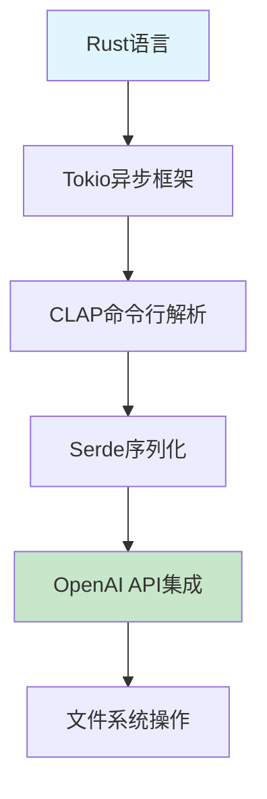
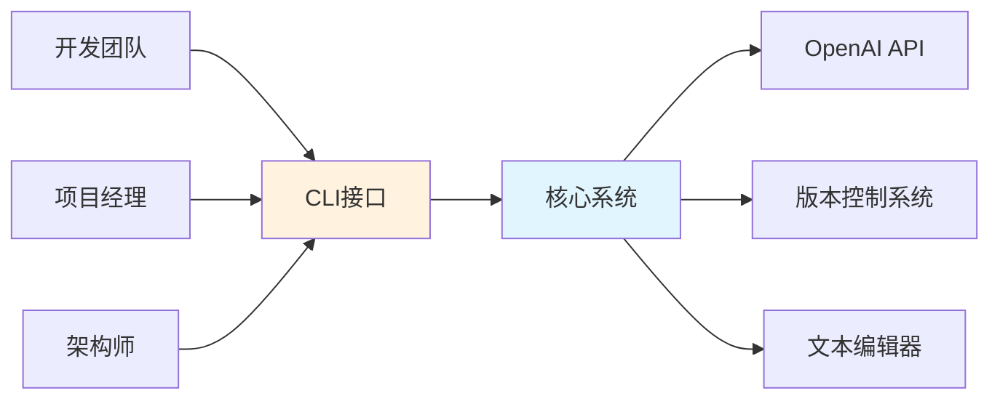
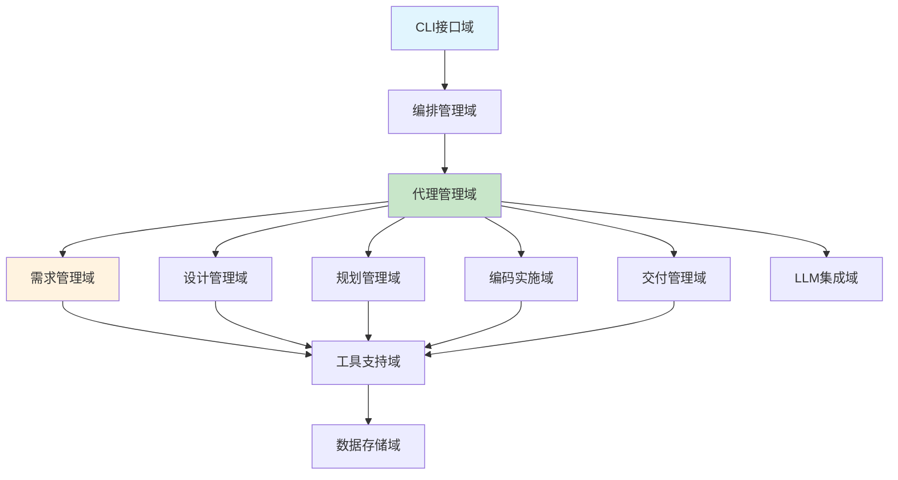
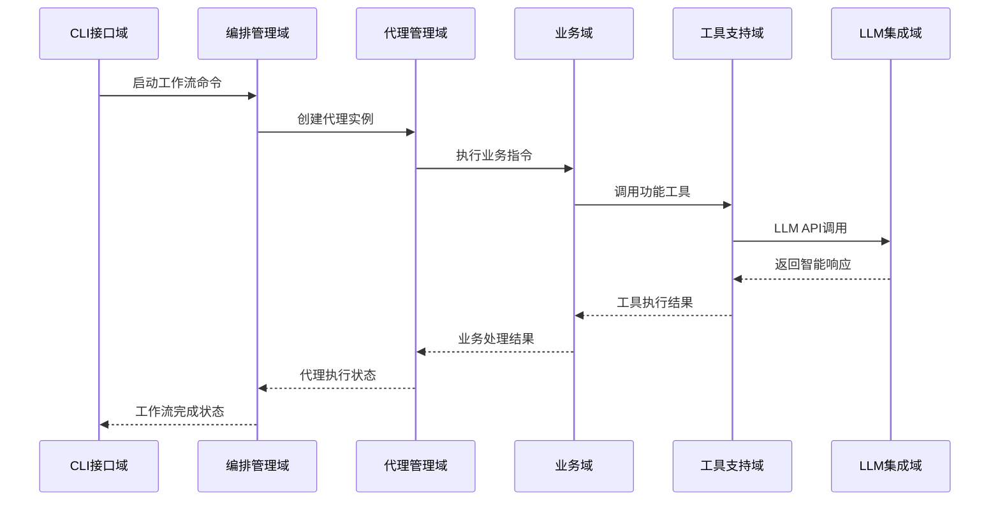
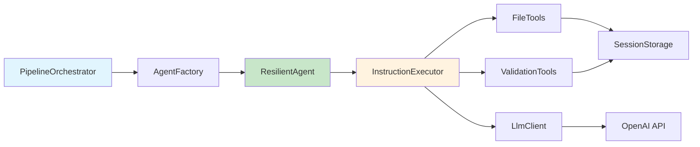
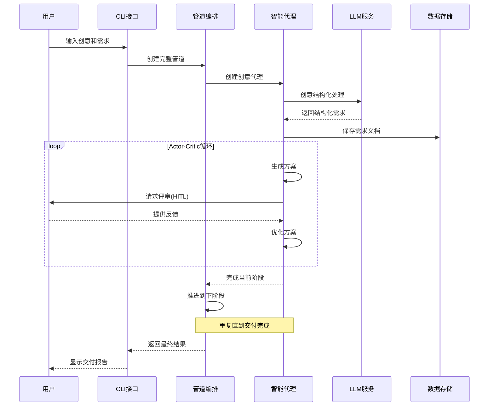
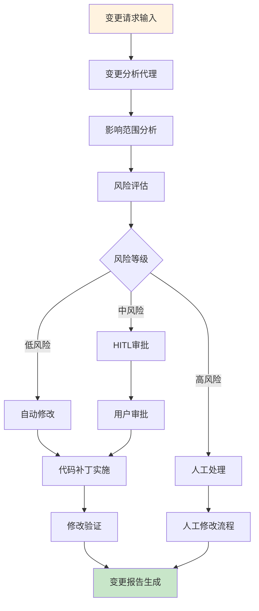
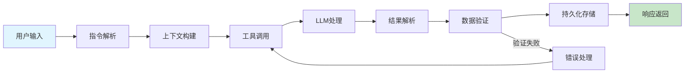
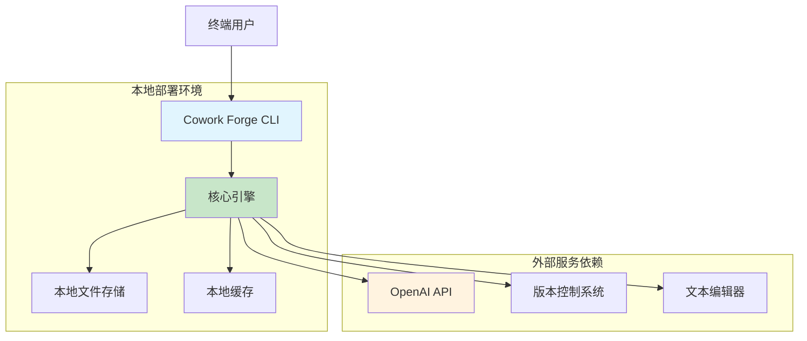

# Cowork Forge 系统架构文档

## 1. 架构概览

### 1.1 架构设计理念
Cowork Forge 采用**AI驱动的人类参与循环（HITL）**架构设计理念，将智能自动化与人类专家监督有机结合。系统基于**分层模块化**架构，实现了从创意到交付的完整软件开发流程自动化。

### 1.2 核心架构模式
- **分层架构模式**：清晰的层次分离，每层专注特定职责
- **Actor-Critic模式**：代理协作机制，确保决策质量
- **管道过滤器模式**：工作流编排，支持灵活流程控制
- **容错恢复模式**：多层错误处理，保障系统稳定性

### 1.3 技术栈概览


## 2. 系统上下文

### 2.1 系统定位与价值
Cowork Forge 是一个AI驱动的软件开发编排系统，通过智能代理协作和人类监督相结合的方式，显著提升软件开发效率和质量。

**核心价值主张**：
- 自动化处理重复性开发任务
- 人类专家参与关键决策保证质量
- 标准化开发流程和规范
- 灵活的流程控制和错误恢复

### 2.2 用户角色与场景



**主要用户群体**：
- **软件开发团队**：需要高效开发工具的技术团队
- **独立开发者**：个人开发者或小型团队
- **技术项目经理**：负责项目管理和技术决策

### 2.3 外部系统交互
| 外部系统 | 交互类型 | 用途 | 重要性 |
|---------|---------|------|--------|
| OpenAI API | API调用 | 提供LLM智能决策能力 | 高 |
| 版本控制系统 | 文件操作 | 代码版本管理和变更跟踪 | 高 |
| 文本编辑器 | 进程调用 | HITL环节的内容编辑 | 中 |

### 2.4 系统边界定义
**包含组件**：
- 命令行界面(CLI)
- 智能代理系统(Agent)
- 工作流管道(Pipeline)
- 数据存储层(Storage)
- 工具集(Tools)
- LLM集成模块

**排除组件**：
- 具体的业务逻辑实现
- 用户界面开发
- 部署和运维功能
- 第三方服务集成开发

## 3. 容器视图

### 3.1 领域模块划分



### 3.2 领域模块架构

#### 3.2.1 核心业务域
**需求管理域** (`crates/cowork-core/src/instructions/idea.rs, prd.rs`)
- 创意代理模块：创意采集和结构化处理
- PRD代理模块：产品需求文档生成和验证
- 变更分析模块：变更请求分析和范围确定

**设计管理域** (`crates/cowork-core/src/instructions/design.rs`)
- 设计代理模块：系统架构设计和评审
- 设计验证模块：设计验证和覆盖率检查

**编码实施域** (`crates/cowork-core/src/instructions/coding.rs, code_patch.rs`)
- 编码代理模块：代码实现和质量检查
- 代码补丁模块：增量代码修改
- 质量检查模块：最小质量验证

#### 3.2.2 支撑技术域
**编排管理域** (`crates/cowork-core/src/pipeline/mod.rs`)
- 管道编排器：工作流管道创建和管理
- 阶段控制模块：阶段跳转和流程恢复

**代理管理域** (`crates/cowork-core/src/agents/mod.rs`)
- 代理工厂模块：代理创建和生命周期管理
- HITL恢复模块：人类参与循环错误恢复

### 3.3 存储设计
**数据存储架构**：
```rust
// 数据模型定义 (crates/cowork-core/src/data/models.rs)
pub struct Session {
    pub id: String,
    pub created_at: DateTime<Utc>,
    pub current_stage: Stage,
    pub metadata: HashMap<String, serde_json::Value>,
}

pub struct Artifact {
    pub session_id: String,
    pub artifact_type: ArtifactType,
    pub content: String,
    pub created_at: DateTime<Utc>,
}
```

**存储策略**：
- 基于文件系统的会话范围存储
- JSON格式序列化，确保可读性
- 事务完整性保证，避免数据不一致

### 3.4 域间模块通信



## 4. 组件视图

### 4.1 核心功能组件

#### 4.1.1 管道编排组件 (`pipeline/mod.rs`)
```rust
pub struct PipelineOrchestrator {
    session_manager: SessionManager,
    agent_factory: AgentFactory,
    stage_validator: StageValidator,
}

impl PipelineOrchestrator {
    pub fn create_cowork_pipeline(&self) -> Result<Pipeline> {
        // 完整开发流程编排
    }
    
    pub fn create_resume_pipeline(&self, from_stage: Stage) -> Result<Pipeline> {
        // 从指定阶段恢复流程
    }
}
```

#### 4.1.2 智能代理组件 (`agents/mod.rs`)
```rust
pub struct ResilientAgent<T> {
    inner_agent: T,
    hitl_handler: HitlHandler,
    max_retries: usize,
}

impl<T: Agent> Agent for ResilientAgent<T> {
    fn execute(&self, context: &Context) -> Result<Artifact> {
        // 带错误恢复的代理执行逻辑
    }
}
```

### 4.2 技术支撑组件

#### 4.2.1 工具支持组件 (`tools/mod.rs`)
**文件工具模块**：
- 安全文件读写操作
- 命令执行和结果捕获
- 路径安全验证

**控制工具模块**：
- 用户反馈收集
- 内容评审和编辑
- 交互式查询处理

#### 4.2.2 LLM集成组件 (`llm/mod.rs`)
```rust
pub struct LlmClient {
    client: OpenAI,
    rate_limiter: RateLimiter,
    config: LlmConfig,
}

impl LlmClient {
    pub async fn complete(&self, prompt: &str) -> Result<String> {
        // 带速率限制的LLM调用
    }
}
```

### 4.3 组件职责划分

| 组件类别 | 组件名称 | 主要职责 | 关键接口 |
|---------|---------|----------|----------|
| **编排组件** | PipelineOrchestrator | 工作流编排和管理 | create_pipeline() |
| **代理组件** | AgentFactory | 代理创建和生命周期管理 | create_agent() |
| **业务组件** | InstructionExecutor | 业务指令执行 | execute_instruction() |
| **工具组件** | FileTools | 安全文件操作 | read_file(), write_file() |
| **存储组件** | SessionStorage | 会话数据持久化 | save_artifact() |

### 4.4 组件交互关系



## 5. 关键流程

### 5.1 核心功能流程

#### 5.1.1 新项目开发流程



#### 5.1.2 项目修改流程


### 5.2 技术处理流程

#### 5.2.1 错误恢复流程
```rust
// 错误恢复机制实现 (crates/cowork-core/src/agents/hitl.rs)
impl<T: Agent> Agent for ResilientAgent<T> {
    fn execute(&self, context: &Context) -> Result<Artifact> {
        for attempt in 0..self.max_retries {
            match self.inner_agent.execute(context) {
                Ok(artifact) => return Ok(artifact),
                Err(error) => {
                    if attempt == self.max_retries - 1 {
                        return self.hitl_handler.handle_error(error, context);
                    }
                    // 重试逻辑
                }
            }
        }
        unreachable!()
    }
}
```

#### 5.2.2 数据流路径


### 5.3 异常处理机制
- **重试机制**：网络错误和临时故障自动重试
- **降级策略**：LLM服务不可用时提供基础功能
- **HITL介入**：复杂错误请求人类专家干预
- **状态回滚**：确保失败操作的事务完整性

## 6. 技术实现

### 6.1 核心模块实现

#### 6.1.1 Actor-Critic模式实现
```rust
// Actor-Critic代理实现 (crates/cowork-core/src/agents/mod.rs)
pub struct ActorCriticAgent {
    actor: Box<dyn Agent>,
    critic: Box<dyn Agent>,
    max_iterations: usize,
}

impl Agent for ActorCriticAgent {
    fn execute(&self, context: &Context) -> Result<Artifact> {
        let mut current_artifact = self.actor.execute(context)?;
        
        for iteration in 0..self.max_iterations {
            let critique = self.critic.execute(&context.with_artifact(&current_artifact))?;
            
            if critique.is_approved() {
                break;
            }
            
            // 基于反馈优化方案
            current_artifact = self.actor.execute(
                &context.with_feedback(critique.feedback())
            )?;
        }
        
        Ok(current_artifact)
    }
}
```

#### 6.1.2 工作流管道实现
```rust
// 管道编排实现 (crates/cowork-core/src/pipeline/mod.rs)
pub struct DevelopmentPipeline {
    stages: Vec<Box<dyn PipelineStage>>,
    current_stage: usize,
    session: Session,
}

impl Pipeline for DevelopmentPipeline {
    fn execute(&mut self) -> Result<()> {
        while self.current_stage < self.stages.len() {
            let stage = &self.stages[self.current_stage];
            
            if !stage.should_execute(&self.session)? {
                self.current_stage += 1;
                continue;
            }
            
            match stage.execute(&self.session) {
                Ok(()) => {
                    self.session.update_stage(stage.next_stage());
                    self.current_stage += 1;
                }
                Err(e) => return self.handle_stage_error(e, stage),
            }
        }
        Ok(())
    }
}
```

### 6.2 关键算法设计

#### 6.2.1 依赖分析算法
```rust
// 任务依赖分析 (crates/cowork-core/src/tools/validation_tools.rs)
pub fn analyze_dependencies(tasks: &[Task]) -> Result<DependencyGraph> {
    let mut graph = DependencyGraph::new();
    
    for task in tasks {
        graph.add_node(task.id.clone(), task.clone());
    }
    
    for task in tasks {
        for dep in &task.dependencies {
            if let Some(dep_task) = tasks.iter().find(|t| &t.id == dep) {
                graph.add_dependency(&task.id, &dep_task.id)?;
            }
        }
    }
    
    // 检测循环依赖
    if let Some(cycle) = graph.find_cycle() {
        return Err(Error::CircularDependency(cycle));
    }
    
    Ok(graph)
}
```

#### 6.2.2 内容验证算法
```rust
// 特征覆盖率验证 (crates/cowork-core/src/tools/validation_tools.rs)
pub fn validate_feature_coverage(design: &DesignSpec, requirements: &Requirements) -> Result<CoverageReport> {
    let required_features: HashSet<_> = requirements.features.iter().collect();
    let designed_features: HashSet<_> = design.components
        .iter()
        .flat_map(|c| &c.features)
        .collect();
    
    let covered_features: HashSet<_> = required_features
        .intersection(&designed_features)
        .collect();
    
    let coverage_ratio = covered_features.len() as f32 / required_features.len() as f32;
    
    Ok(CoverageReport {
        coverage_ratio,
        missing_features: required_features.difference(&designed_features).cloned().collect(),
        extra_features: designed_features.difference(&required_features).cloned().collect(),
    })
}
```

### 6.3 数据结构设计

#### 6.3.1 核心数据模型
```rust
// 核心业务数据结构 (crates/cowork-core/src/data/models.rs)
#[derive(Debug, Clone, Serialize, Deserialize)]
pub struct Requirements {
    pub id: String,
    pub title: String,
    pub description: String,
    pub features: Vec<Feature>,
    pub constraints: Vec<Constraint>,
    pub acceptance_criteria: Vec<String>,
    pub created_at: DateTime<Utc>,
    pub updated_at: DateTime<Utc>,
}

#[derive(Debug, Clone, Serialize, Deserialize)]
pub struct DesignSpec {
    pub architecture: Architecture,
    pub components: Vec<ComponentDesign>,
    pub technologies: Vec<TechnologyChoice>,
    pub patterns: Vec<DesignPattern>,
}
```

#### 6.3.2 会话管理数据结构
```rust
// 会话状态管理 (crates/cowork-core/src/storage/mod.rs)
pub struct SessionState {
    pub id: String,
    pub current_stage: Stage,
    pub artifacts: HashMap<ArtifactType, Artifact>,
    pub metadata: SessionMetadata,
    pub created_at: DateTime<Utc>,
    pub updated_at: DateTime<Utc>,
}

pub struct SessionMetadata {
    pub user_id: Option<String>,
    pub project_name: String,
    pub settings: HashMap<String, serde_json::Value>,
    pub error_history: Vec<ErrorRecord>,
}
```

### 6.4 性能优化策略

#### 6.4.1 LLM调用优化
- **请求批处理**：合并相关请求减少API调用次数
- **结果缓存**：缓存频繁使用的LLM响应
- **速率限制**：智能调节请求频率避免限流

#### 6.4.2 文件操作优化
- **增量更新**：仅修改变化部分减少IO操作
- **内存缓存**：热点数据内存缓存提升访问速度
- **异步操作**：非阻塞IO提升并发处理能力

## 7. 部署架构

### 7.1 运行时环境要求

**系统要求**：
- Rust 1.70+ 开发环境
- OpenAI API访问权限
- 文件系统读写权限
- 网络连接（LLM API调用）

**依赖组件**：
```yaml
dependencies:
  tokio: "1.0"           # 异步运行时
  serde: "1.0"           # 序列化框架
  reqwest: "0.11"        # HTTP客户端
  clap: "4.0"            # 命令行解析
  chrono: "0.4"          # 时间处理
  uuid: "1.0"            # 唯一标识生成
```

### 7.2 部署拓扑结构



### 7.3 可扩展性设计

#### 7.3.1 水平扩展点
- **工具插件机制**：支持自定义工具扩展
- **代理类型扩展**：可添加新的智能代理类型
- **指令模板扩展**：支持新的业务指令开发

#### 7.3.2 垂直扩展策略
- **配置化扩展**：通过配置文件调整系统行为
- **模块化替换**：关键组件支持实现替换
- **流水线定制**：支持自定义工作流编排

### 7.4 监控与运维

#### 7.4.1 日志监控
```rust
// 结构化日志实现
pub fn setup_logging() -> Result<()> {
    tracing_subscriber::fmt()
        .with_max_level(Level::INFO)
        .with_target(false)
        .with_timer(tracing_subscriber::fmt::time::UtcTime::rfc_3339())
        .init();
    Ok(())
}
```

#### 7.4.2 性能指标
- **LLM调用耗时**：监控API响应时间
- **阶段执行时间**：各开发阶段性能分析
- **错误率统计**：系统稳定性监控
- **用户交互时长**：用户体验指标

#### 7.4.3 健康检查
- **依赖服务检查**：LLM API连通性验证
- **存储可用性**：文件系统权限检查
- **配置有效性**：运行时配置验证

## 8. 架构洞察与设计思考

### 8.1 可扩展性设计

**扩展点分析**：
1. **工具扩展**：通过实现`Tool` trait添加新功能工具
2. **代理扩展**：新的业务域可通过实现`Agent` trait集成
3. **指令扩展**：支持自定义业务指令开发
4. **存储扩展**：可替换存储后端支持不同存储方案

**扩展策略**：
```rust
// 工具扩展接口设计
pub trait Tool: Send + Sync {
    fn name(&self) -> &str;
    fn description(&self) -> &str;
    fn execute(&self, context: &ToolContext) -> Result<ToolResult>;
}

// 代理扩展接口设计  
pub trait Agent: Send + Sync {
    fn name(&self) -> &str;
    fn execute(&self, context: &Context) -> Result<Artifact>;
}
```

### 8.2 性能考量

**性能瓶颈分析**：
1. **LLM API调用**：网络延迟和速率限制是主要瓶颈
2. **文件IO操作**：大量小文件操作可能影响性能
3. **用户交互等待**：HITL环节的用户响应时间

**优化策略**：
- **异步并发**：利用Tokio运行时实现非阻塞操作
- **缓存策略**：LLM结果和文件内容缓存
- **批量处理**：合并相关操作减少系统调用

### 8.3 安全性设计

**安全机制**：
1. **输入验证**：所有用户输入和外部数据严格验证
2. **路径安全**：文件操作使用安全路径处理避免目录遍历
3. **API安全**：LLM API密钥安全管理和传输
4. **错误处理**：敏感信息在错误日志中脱敏

### 8.4 架构演进思考

**短期改进方向**：
- 增强错误恢复机制的智能化程度
- 优化HITL交互体验，减少用户等待
- 扩展支持的开发语言和框架

**长期架构愿景**：
- 支持分布式团队协作
- 集成更多开发工具和平台
- 实现更智能的代码理解和生成能力

---

## 文档总结

本架构文档全面分析了Cowork Forge系统的架构设计、技术实现和部署策略。系统采用分层模块化架构，结合AI自动化与人类专家监督，为软件开发团队提供了高效、可靠的开发编排工具。架构设计充分考虑了可扩展性、性能和安全性，为系统的长期演进奠定了坚实基础。

该文档为开发团队提供了清晰的技术指导，为运维团队提供了详细的部署方案，为技术决策者提供了全面的架构洞察，是理解和维护Cowork Forge系统的重要参考材料。