# Cowork Forge 系统架构文档

## 1. 架构概览

### 1.1 架构设计理念
Cowork Forge 采用"最小可行架构"设计理念，通过AI智能体自动化完成软件开发全流程，同时保留关键节点的人工干预权限。系统遵循"编排层-智能体层-工具层-数据层"四层架构模式，确保各层职责清晰、依赖关系单向流动。

**核心设计原则**：
- **简洁性优先**：强制拒绝过度设计，专注于核心功能实现
- **人类参与循环**：在关键决策点引入人工审核，确保流程可控
- **增量迭代**：支持任意阶段的中断与恢复，适配敏捷开发需求
- **模块化封装**：各功能域高度内聚，通过清晰接口交互

### 1.2 核心架构模式
系统采用**智能体流水线编排模式**，通过Actor-Critic双智能体协作确保输出质量。整体架构基于**事件驱动的状态机模型**，支持流程的灵活跳转与回溯。

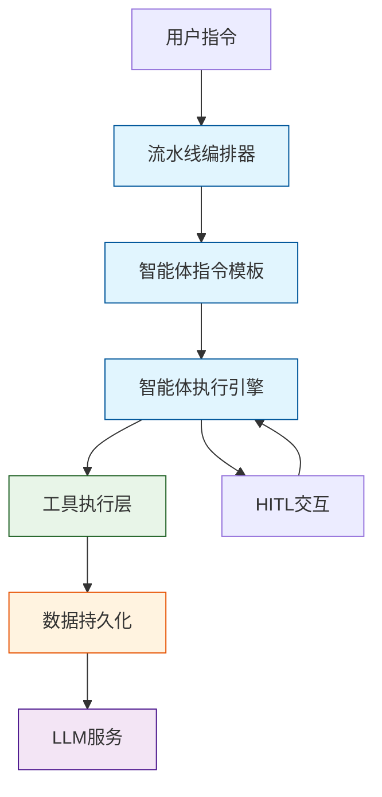

### 1.3 技术栈概览
- **开发语言**: Rust（高性能系统级语言）
- **AI集成**: OpenAI兼容API（支持自定义端点）
- **存储方案**: 本地文件系统 + JSON序列化
- **交互方式**: 命令行界面（CLI）
- **架构模式**: 模块化分层架构 + 智能体协作模式

## 2. 系统上下文

### 2.1 系统定位与价值
Cowork Forge 是一个基于AI的软件开发编排系统，旨在通过多智能体协作自动化完成从需求构思到代码交付的完整开发周期。系统核心价值在于显著降低开发者的认知负荷与手动操作成本，特别适用于资源有限的初创团队和独立开发者。

### 2.2 用户角色与场景

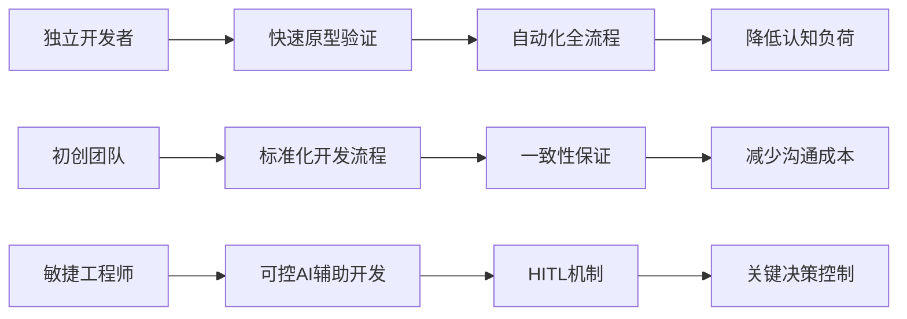

**核心用户群体**：
1. **独立开发者**：缺乏团队支持，需要快速将想法转化为可运行代码
2. **初创团队**：资源有限，需要标准化流程确保开发效率
3. **敏捷开发工程师**：希望在AI辅助下保持对关键决策的控制权

### 2.3 外部系统交互

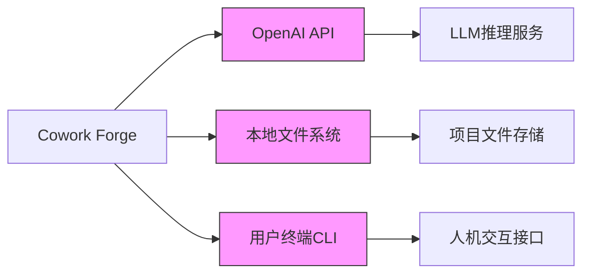

**关键外部依赖**：
- **OpenAI API**: 提供底层大语言模型服务，负责智能体的推理与生成任务
- **本地文件系统**: 作为持久化存储介质，保存会话数据、项目文件和中间产物
- **用户终端**: 人机交互的主要接口，支持指令输入和反馈提供

### 2.4 系统边界定义
**包含组件**：
- cowork-cli（命令行入口）
- cowork-core（核心智能体引擎）
- LLM配置与速率限制模块
- 文件系统操作工具
- JSON/Markdown持久化存储
- HITL交互工具

**排除组件**：
- Web前端界面、移动应用
- 云服务部署系统、CI/CD流水线
- 数据库服务、测试框架
- 监控系统、第三方API网关

## 3. 容器视图

### 3.1 域模块划分
系统采用六域模块架构，各域职责清晰，依赖关系严格单向：

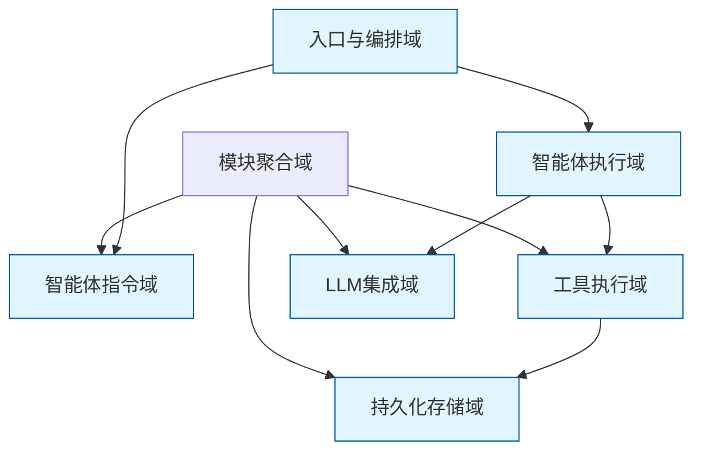

### 3.2 域模块架构详述

#### 3.2.1 入口与编排域
**核心职责**：系统启动、流程编排与会话控制
- **CLI入口模块**：解析命令行参数，初始化会话目录结构
- **流水线编排模块**：定义并执行不同阶段组合的开发流程

**关键接口**：
```rust
// 核心流水线接口
pub fn full_pipeline() -> Result<Session>;      // 全新项目流程
pub fn modify_pipeline() -> Result<Session>;    // 增量修改流程  
pub fn resume_pipeline() -> Result<Session>;    // 阶段恢复流程
```

#### 3.2.2 智能体指令域
**核心职责**：定义智能体行为逻辑与决策规则
- **10个智能体指令模板**：涵盖Idea→PRD→Design→Plan→Coding→Check→Delivery全流程
- **Actor-Critic模式**：每个阶段采用双智能体协作确保输出质量

**指令模板示例**：
```rust
// PRD智能体指令结构
pub const PRD_ACTOR_INSTRUCTION: &str = r#"
你是一个产品经理，负责将原始想法转化为结构化需求...
关键约束：禁止过度设计，专注于最小可行产品...
输出格式：严格的JSON结构...
"#;
```

#### 3.2.3 智能体执行域
**核心职责**：智能体实例化、调用与管理
- **智能体构建器**：创建LLM智能体实例，绑定工具集
- **人机交互封装**：通过ResilientAgent实现错误恢复机制

**核心实现**：
```rust
pub struct ResilientAgent {
    max_retries: u32,
    error_handler: Box<dyn ErrorHandler>,
    hitl_tools: Vec<Box<dyn Tool>>,
}
```

#### 3.2.4 工具执行域
**核心职责**：提供原子化操作能力
- **11个专用工具模块**：文件操作、数据管理、验证、交互等
- **统一Tool trait接口**：确保工具的可组合性和可扩展性

**工具分类**：
- **文件操作工具**：ListFilesTool、ReadFileTool、WriteFileTool
- **数据操作工具**：SaveRequirementsTool、LoadRequirementsTool
- **HITL交互工具**：ReviewAndEditContentTool、ProvideFeedbackTool
- **会话控制工具**：GotoStageTool、SaveChangeRequestTool

#### 3.2.5 持久化存储域
**核心职责**：开发产物与会话状态管理
- **会话存储管理**：基于文件系统的隔离存储方案
- **数据模型定义**：结构化数据的Rust序列化支持

**存储结构**：
```
.cowork/
├── sessions/
│   ├── {session_id}/
│   │   ├── metadata.json
│   │   ├── requirements.json
│   │   ├── design.json
│   │   ├── feedback_history.json
│   │   └── artifacts/
```

#### 3.2.6 LLM集成域
**核心职责**：大语言模型服务对接与优化
- **配置管理**：支持自定义API端点和认证配置
- **速率限制**：防止API调用超限，确保系统稳定性

### 3.3 存储设计
系统采用**文件系统+JSON序列化**的轻量级存储方案，具有以下特点：
- **会话隔离**：每个开发会话独立存储，支持并行开发
- **版本追踪**：通过中间产物保存实现变更追溯
- **格式标准化**：所有数据采用JSON格式，确保可读性和工具兼容性

### 3.4 域间模块通信
域间采用**服务调用**和**数据依赖**两种通信模式，确保依赖关系的清晰性和可维护性。

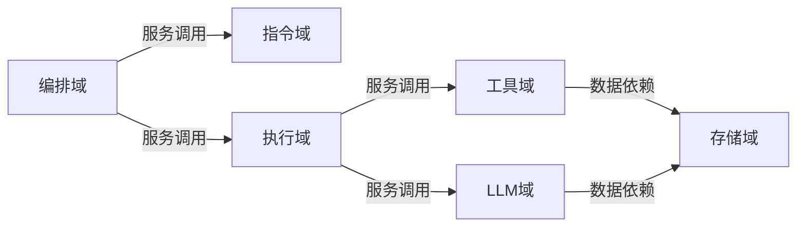

## 4. 组件视图

### 4.1 核心功能组件

#### 4.1.1 流水线编排组件
**职责**：协调智能体执行顺序，管理流程状态转换
```rust
pub struct PipelineOrchestrator {
    current_stage: DevelopmentStage,
    session_state: SessionState,
    agent_registry: HashMap<Stage, Box<dyn Agent>>,
}
```

#### 4.1.2 智能体工厂组件
**职责**：按需创建智能体实例，配置工具绑定
```rust
pub struct AgentFactory {
    llm_client: LlmClient,
    tool_registry: ToolRegistry,
    instruction_loader: InstructionLoader,
}
```

#### 4.1.3 工具执行引擎
**职责**：统一调度工具执行，处理工具间依赖关系
```rust
pub struct ToolEngine {
    tool_cache: HashMap<ToolId, Box<dyn Tool>>,
    dependency_graph: ToolDependencyGraph,
    execution_context: ToolContext,
}
```

### 4.2 技术支持组件

#### 4.2.1 错误恢复组件
**职责**：智能体执行异常的检测与恢复处理
```rust
pub struct ErrorRecoveryManager {
    error_patterns: Vec<ErrorPattern>,
    recovery_strategies: HashMap<ErrorType, RecoveryStrategy>,
    hitl_escalation: HitlEscalationPolicy,
}
```

#### 4.2.2 会话管理组件
**职责**：会话生命周期管理，状态持久化与恢复
```rust
pub struct SessionManager {
    session_store: SessionStore,
    state_serializer: StateSerializer,
    conflict_resolver: ConflictResolver,
}
```

#### 4.2.3 配置管理组件
**职责**：统一管理系统配置，支持环境差异化配置
```rust
pub struct ConfigManager {
    base_config: AppConfig,
    environment_config: EnvironmentConfig,
    user_overrides: UserConfig,
}
```

### 4.3 组件职责划分

| 组件类别 | 组件名称 | 核心职责 | 重要性 |
|---------|---------|---------|--------|
| 核心业务组件 | 流水线编排器 | 流程调度与状态管理 | 10 |
| 核心业务组件 | 智能体执行器 | AI任务执行与结果处理 | 10 |
| 核心业务组件 | 工具调度器 | 原子操作执行与依赖管理 | 9 |
| 技术支撑组件 | 错误恢复器 | 异常处理与流程恢复 | 9 |
| 技术支撑组件 | 会话管理器 | 状态持久化与隔离 | 9 |
| 技术支撑组件 | 配置管理器 | 系统配置统一管理 | 7 |

### 4.4 组件交互关系

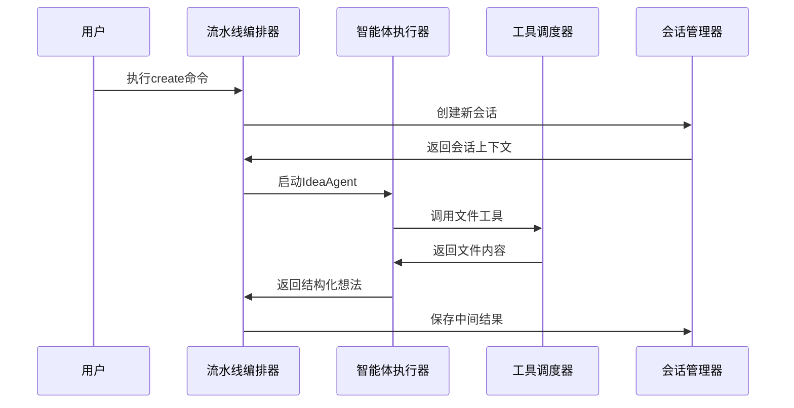

## 5. 关键流程

### 5.1 核心功能流程

#### 5.1.1 全新项目创建流程

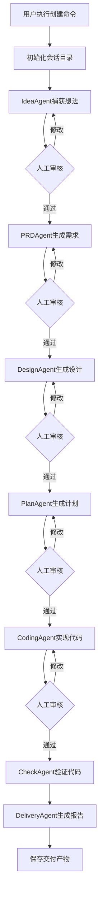

**流程特点**：
- **七阶段流水线**：Idea→PRD→Design→Plan→Coding→Check→Delivery
- **双重审核机制**：每个阶段包含AI生成和人工审核两个环节
- **严格质量门控**：只有通过审核才能进入下一阶段

#### 5.1.2 增量修改流程

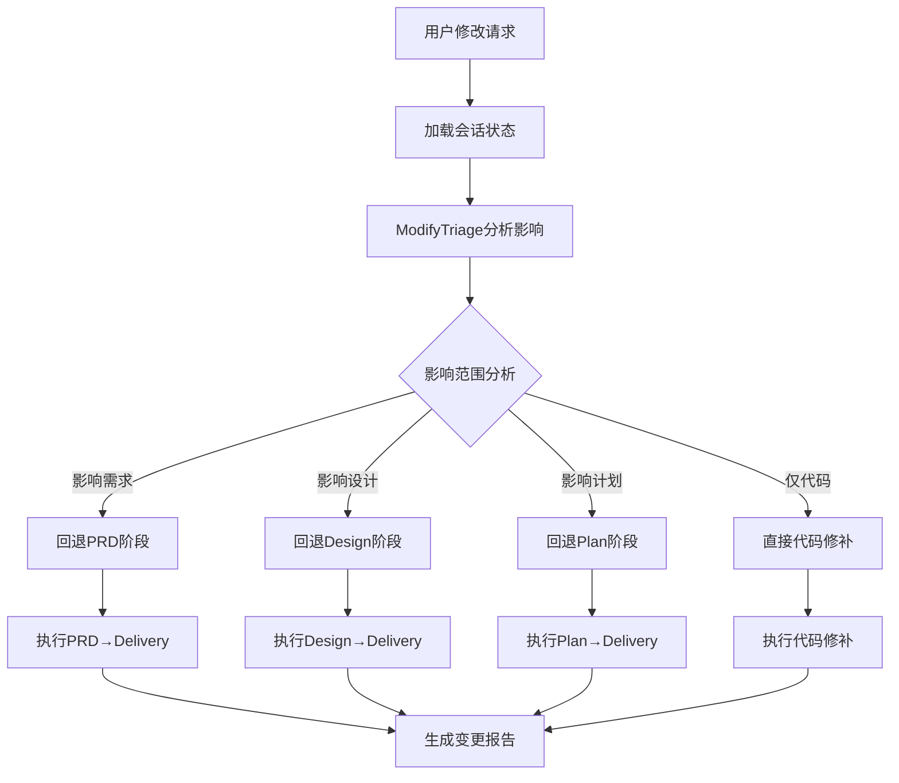

**流程优势**：
- **精准影响分析**：智能判断修改影响范围，避免不必要的重新执行
- **灵活回退机制**：支持从任意阶段重新开始，最大化利用已有成果
- **变更追踪完整**：记录变更前后差异，生成详细的变更报告

### 5.2 技术处理流程

#### 5.2.1 人机交互反馈流程

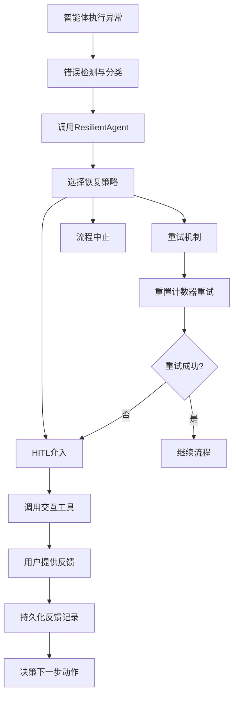

**技术特点**：
- **多层次恢复**：从简单重试到人工介入的渐进式恢复策略
- **反馈持久化**：所有用户反馈均被记录，供后续阶段参考
- **决策透明化**：恢复决策基于明确的规则和用户输入

### 5.3 数据流路径

#### 5.3.1 主要数据流

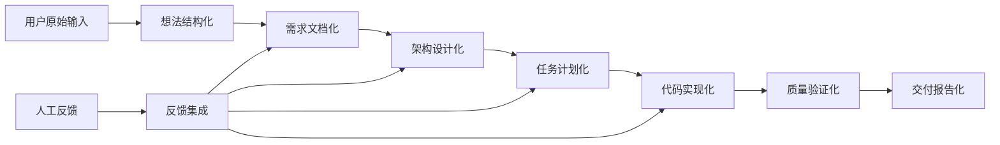

**数据流特性**：
- **单向递增**：数据从抽象到具体单向流动，确保一致性
- **反馈集成**：人工反馈及时集成到数据流中，影响后续生成
- **版本追踪**：每个阶段的数据版本都被完整保存

### 5.4 异常处理机制

系统采用**防御性编程**理念，构建多层次的异常处理体系：

**异常分类处理**：
1. **可恢复异常**：通过重试或HITL机制自动恢复
2. **业务逻辑异常**：通过修改输入或调整参数解决
3. **系统级异常**：需要人工介入的系统故障

**异常处理策略**：
```rust
pub enum ErrorHandlingStrategy {
    RetryWithBackoff { max_retries: u32 },    // 指数退避重试
    RequestHumanIntervention { tool: HumanTool }, // 人工介入
    FallbackToAlternative { alternative: Agent }, // 降级方案
    AbortWithReport { reason: String },       // 中止并报告
}
```

## 6. 技术实现

### 6.1 核心模块实现

#### 6.1.1 智能体指令引擎实现
**技术选型**：基于Rust的宏系统实现类型安全的指令模板

```rust
// 智能体指令宏实现
macro_rules! define_agent_instruction {
    ($name:ident, $template:expr, $output_type:ty) => {
        pub struct $name;
        impl AgentInstruction for $name {
            type Output = $output_type;
            
            fn template() -> &'static str {
                $template
            }
            
            fn parse_output(&self, raw: &str) -> Result<Self::Output> {
                // JSON解析与验证逻辑
                serde_json::from_str(raw).context("Failed to parse agent output")
            }
        }
    };
}

// 使用示例
define_agent_instruction!(
    PrdAgent, 
    PRD_TEMPLATE,
    PrdOutput
);
```

#### 6.1.2 工具执行引擎实现
**架构模式**：基于Trait的对象安全设计，支持动态工具发现

```rust
pub trait Tool: Send + Sync {
    fn name(&self) -> &str;
    fn description(&self) -> &str;
    fn execute(&self, input: ToolInput) -> Result<ToolOutput>;
    fn parameters(&self) -> Vec<ParameterSchema>;
}

// 工具注册表实现
pub struct ToolRegistry {
    tools: HashMap<String, Arc<dyn Tool>>,
    dependency_graph: ToolDependencyGraph,
}

impl ToolRegistry {
    pub fn register_tool<T: Tool + 'static>(&mut self, tool: T) {
        let name = tool.name().to_string();
        self.tools.insert(name, Arc::new(tool));
    }
    
    pub fn resolve_dependencies(&self, tool_name: &str) -> Vec<&dyn Tool> {
        // 依赖解析逻辑
    }
}
```

### 6.2 关键算法设计

#### 6.2.1 Actor-Critic协作算法
**算法原理**：双智能体协作确保输出质量

```rust
pub struct ActorCriticPair<A, C> 
where 
    A: Agent, 
    C: Agent 
{
    actor: A,
    critic: C,
    max_iterations: u32,
    quality_threshold: f32,
}

impl<A, C> ActorCriticPair<A, C> 
where 
    A: Agent, 
    C: Agent 
{
    pub async fn execute(&self, input: &str) -> Result<String> {
        let mut iteration = 0;
        let mut current_output = self.actor.execute(input).await?;
        
        while iteration < self.max_iterations {
            let critique = self.critic.execute(&current_output).await?;
            let quality_score = self.evaluate_quality(&critique);
            
            if quality_score >= self.quality_threshold {
                return Ok(current_output);
            }
            
            // 基于批判重新生成
            let refinement_input = format!("原输出: {}\n批判意见: {}", current_output, critique);
            current_output = self.actor.execute(&refinement_input).await?;
            iteration += 1;
        }
        
        Err(anyhow!("未能达到质量阈值 after {} 次迭代", self.max_iterations))
    }
}
```

#### 6.2.2 变更影响分析算法
**算法目标**：精准识别修改请求的影响范围

```rust
pub struct ChangeImpactAnalyzer {
    dependency_graph: ProjectDependencyGraph,
    historical_changes: ChangeHistory,
    impact_rules: Vec<ImpactRule>,
}

impl ChangeImpactAnalyzer {
    pub fn analyze_impact(&self, change_request: &ChangeRequest) -> ImpactAnalysis {
        let mut impact = ImpactAnalysis::new();
        
        // 基于依赖图分析
        impact.merge(self.analyze_dependency_impact(change_request));
        
        // 基于历史变更模式分析
        impact.merge(self.analyze_historical_impact(change_request));
        
        // 基于规则引擎分析
        impact.merge(self.analyze_rule_based_impact(change_request));
        
        impact
    }
    
    fn analyze_dependency_impact(&self, change: &ChangeRequest) -> ImpactAnalysis {
        // 图遍历算法识别受影响组件
        let visited = self.dependency_graph.traverse_from(change.target_component());
        ImpactAnalysis::from_components(visited)
    }
}
```

### 6.3 数据结构设计

#### 6.3.1 会话状态数据结构
**设计理念**：不可变数据结构确保状态一致性

```rust
#[derive(Debug, Clone, Serialize, Deserialize)]
pub struct SessionState {
    pub session_id: Uuid,
    pub created_at: DateTime<Utc>,
    pub current_stage: DevelopmentStage,
    pub completed_stages: HashSet<DevelopmentStage>,
    pub artifacts: HashMap<ArtifactType, ArtifactMetadata>,
    pub feedback_history: Vec<FeedbackRecord>,
}

#[derive(Debug, Clone, Serialize, Deserialize)]
pub struct ArtifactMetadata {
    pub artifact_type: ArtifactType,
    pub file_path: PathBuf,
    pub checksum: String,
    pub created_at: DateTime<Utc>,
    pub version: u32,
}

#[derive(Debug, Clone, Serialize, Deserialize)]
pub struct FeedbackRecord {
    pub stage: DevelopmentStage,
    pub timestamp: DateTime<Utc>,
    pub feedback_type: FeedbackType,
    pub content: String,
    pub resolved: bool,
}
```

#### 6.3.2 智能体上下文数据结构
**设计目标**：支持智能体间的信息传递与上下文保持

```rust
#[derive(Debug, Clone)]
pub struct AgentContext {
    pub session_id: Uuid,
    pub previous_outputs: Vec<StageOutput>,
    pub constraints: ProjectConstraints,
    pub user_preferences: UserPreferences,
    pub technical_context: TechnicalContext,
}

#[derive(Debug, Clone)]
pub struct TechnicalContext {
    pub programming_language: ProgrammingLanguage,
    pub framework: Option<String>,
    pub architecture_pattern: ArchitecturePattern,
    pub testing_strategy: TestingStrategy,
}

#[derive(Debug, Clone)]
pub struct ProjectConstraints {
    pub max_complexity: ComplexityLevel,
    pub required_features: HashSet<Feature>,
    pub excluded_patterns: HashSet<Pattern>,
    pub performance_requirements: PerformanceReq,
}
```

### 6.4 性能优化策略

#### 6.4.1 LLM调用优化
**策略**：批量处理与缓存机制减少API调用

```rust
pub struct OptimizedLlmClient {
    inner_client: LlmClient,
    request_batcher: RequestBatcher,
    response_cache: LruCache<String, String>,
    rate_limiter: RateLimiter,
}

impl OptimizedLlmClient {
    pub async fn batch_process(&self, requests: Vec<LlmRequest>) -> Result<Vec<LlmResponse>> {
        // 批量请求合并
        let batched_requests = self.request_batcher.batch(requests);
        
        // 缓存查找
        let (cached, non_cached) = self.split_cached_requests(batched_requests);
        
        // 并发处理未缓存请求
        let fresh_responses = self.process_concurrently(non_cached).await?;
        
        // 结果合并与缓存更新
        self.merge_responses(cached, fresh_responses)
    }
}
```

#### 6.4.2 文件操作优化
**策略**：增量更新与智能缓存减少IO操作

```rust
pub struct FileSystemOptimizer {
    file_cache: FileCache,
    change_detector: ChangeDetector,
    incremental_updater: IncrementalUpdater,
}

impl FileSystemOptimizer {
    pub fn write_file_optimized(&self, path: &Path, content: &str) -> Result<()> {
        if self.change_detector.needs_update(path, content)? {
            if self.incremental_updater.supports_incremental(path) {
                self.incremental_updater.update_incremental(path, content)?;
            } else {
                self.write_file_full(path, content)?;
            }
            self.file_cache.update(path, content);
        }
        Ok(())
    }
}
```

## 7. 部署架构

### 7.1 运行时环境要求

**最低系统要求**：
- **操作系统**: Linux/macOS/Windows (64位)
- **内存**: 8GB RAM (推荐16GB)
- **存储**: 1GB可用空间 + 项目所需空间
- **网络**: 稳定的互联网连接（用于LLM API调用）

**软件依赖**：
- **Rust工具链**: 1.70+ (用于源码编译)
- **OpenAI API密钥**: 有效的API访问凭证
- **文件系统权限**: 项目目录的读写权限

### 7.2 部署拓扑结构

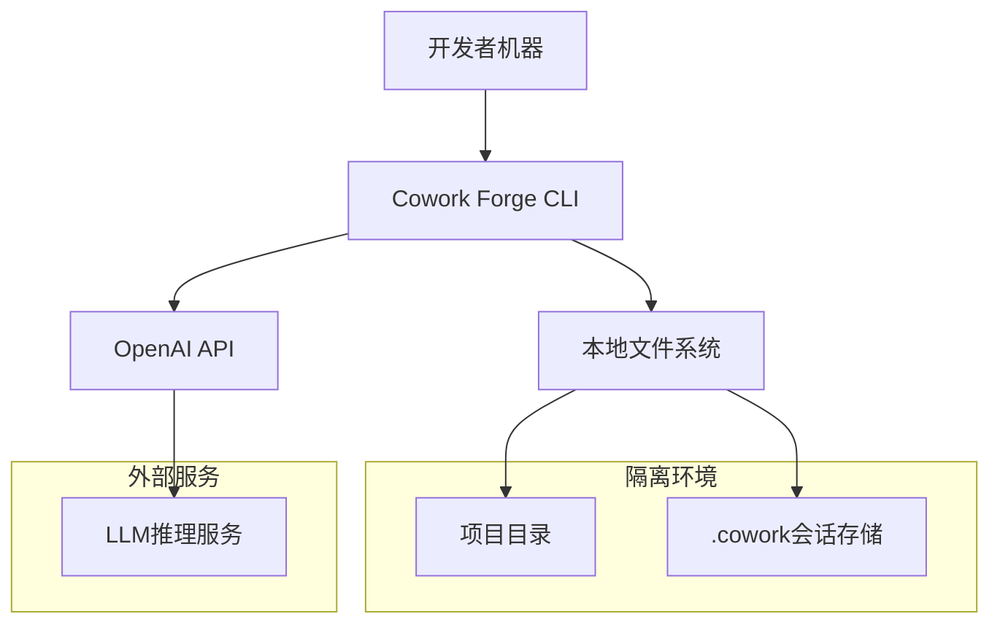

**部署特点**：
- **本地化部署**：所有核心逻辑在用户本地执行
- **网络最小化**：仅LLM API调用需要网络访问
- **数据本地化**：所有项目数据存储在本地，确保隐私安全

### 7.3 可扩展性设计

#### 7.3.1 横向扩展点
**智能体扩展**：通过实现新的指令模板支持新的开发阶段
```rust
// 扩展示例：代码审查智能体
define_agent_instruction!(
    CodeReviewAgent,
    CODE_REVIEW_TEMPLATE,
    CodeReviewOutput
);
```

**工具扩展**：通过实现Tool trait支持新的操作能力
```rust
// 扩展示例：数据库迁移工具
pub struct DatabaseMigrationTool;
impl Tool for DatabaseMigrationTool {
    fn name(&self) -> &str { "database_migration" }
    // ... 具体实现
}
```

#### 7.3.2 纵向扩展策略
**性能扩展**：
- **并发处理**：支持多个智能体并行执行独立任务
- **缓存优化**：LLM响应缓存、文件操作缓存等多级缓存
- **资源复用**：智能体实例池、工具实例池等资源复用机制

**功能扩展**：
- **插件架构**：支持第三方工具和智能体的动态加载
- **配置驱动**：通过配置文件支持行为定制化
- **模板系统**：可定制的输出模板和流程模板

### 7.4 监控与运维

#### 7.4.1 日志与监控
**日志策略**：结构化日志支持问题诊断和流程追踪
```rust
pub struct StructuredLogger {
    session_id: Uuid,
    log_level: LogLevel,
    output_format: LogFormat,
}

// 日志示例
info!(
    session_id = %session.id,
    stage = "prd_generation",
    duration_ms = duration.as_millis(),
    "PRD生成完成，包含{}个需求",
    requirements.len()
);
```

**监控指标**：
- **流程耗时**：各阶段执行时间监控
- **API使用**：LLM调用次数和成功率
- **资源使用**：内存和存储空间使用情况
- **错误率**：各阶段错误发生频率

#### 7.4.2 运维最佳实践

**配置管理**：
```toml
# config.toml 示例
[llm]
api_key = "sk-..."
base_url = "https://api.openai.com/v1"
model = "gpt-4"
rate_limit = 10

[storage]
session_retention_days = 30
max_session_size_mb = 1000

[performance]
max_concurrent_agents = 3
cache_ttl_minutes = 60
```

**故障处理**：
1. **网络故障**：自动重试机制 + 离线模式降级
2. **API限流**：自适应速率限制 + 请求队列
3. **存储不足**：自动清理旧会话 + 容量预警
4. **配置错误**：配置验证 + 安全默认值

---

## 架构洞察与建议

### 可扩展性设计评估
**优势**：
1. **模块化架构**：清晰的域边界支持独立扩展
2. **插件化设计**：工具和智能体支持动态扩展
3. **配置驱动**：行为可通过配置调整，无需代码修改

**改进建议**：
1. **增加插件注册机制**：支持第三方扩展的标准化注册
2. **完善配置验证**：启动时验证配置完整性，避免运行时错误
3. **性能监控集成**：内置性能指标收集，为容量规划提供数据支持

### 性能考虑深度分析
**当前瓶颈**：
1. **LLM API延迟**：网络往返时间成为主要性能瓶颈
2. **序列化开销**：JSON序列化/反序列化在大量数据时可能成为瓶颈
3. **文件IO**：频繁的文件操作可能影响性能

**优化方向**：
1. **异步流水线**：支持阶段间并行执行，减少总体耗时
2. **二进制序列化**：对性能敏感场景考虑MessagePack等二进制格式
3. **内存文件系统**：对临时文件使用内存文件系统加速IO

### 安全设计完善建议
**现有机制**：
1. **路径限制**：文件操作严格限制在项目目录内
2. **输入验证**：所有用户输入都经过验证和清理
3. **API安全**：LLM API密钥通过环境变量管理

**增强建议**：
1. **沙箱执行**：对执行命令进行沙箱隔离，防止恶意代码执行
2. **审计日志**：记录所有敏感操作，支持安全审计
3. **数据加密**：对敏感配置和会话数据进行加密存储

本架构文档为Cowork Forge系统提供了完整的技术参考，既可作为开发团队的技术指南，也可作为新成员的系统培训材料。架构设计体现了"最小可行架构"的理念，在保证功能完整性的同时，保持了系统的简洁性和可维护性。