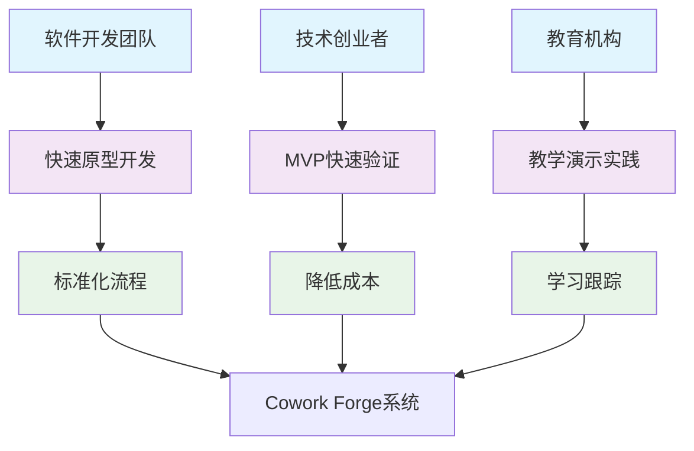
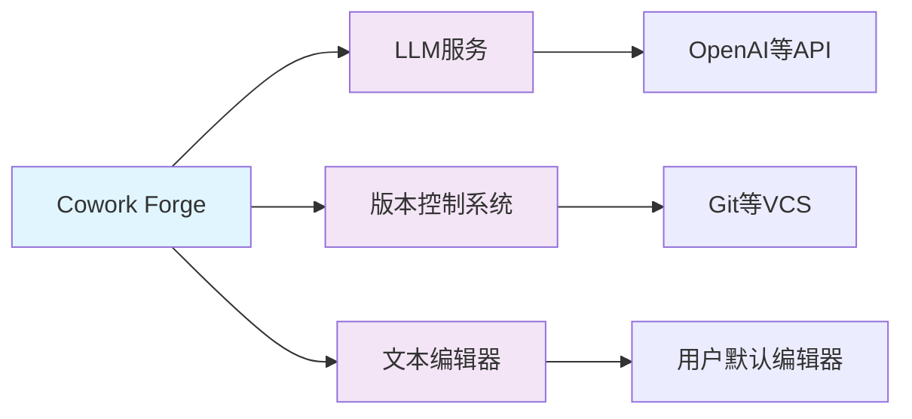
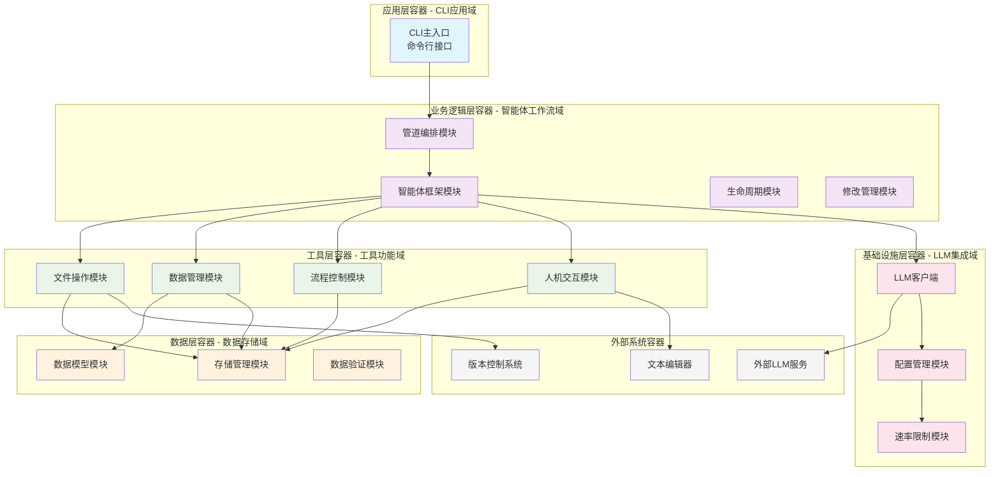
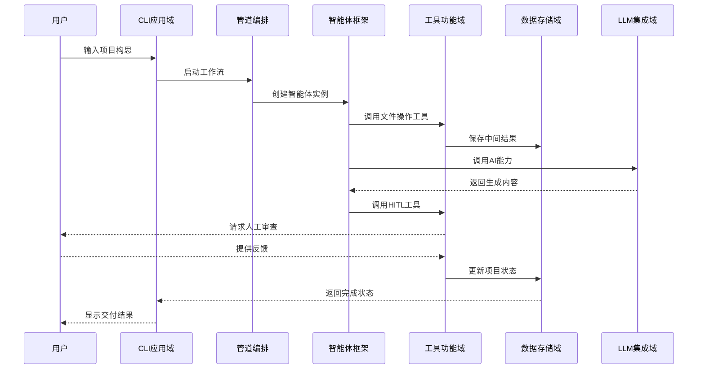
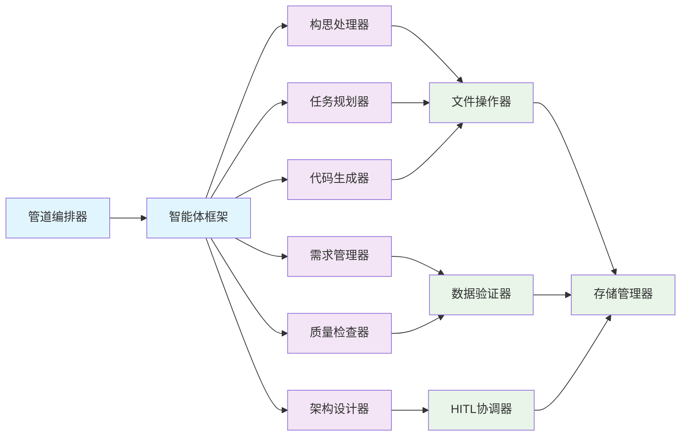
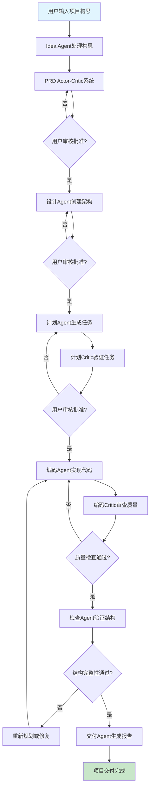
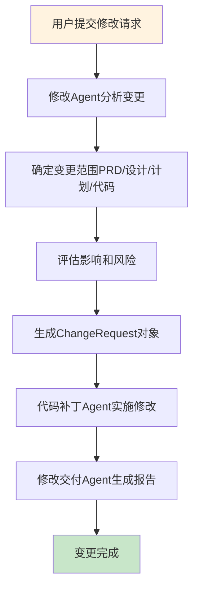
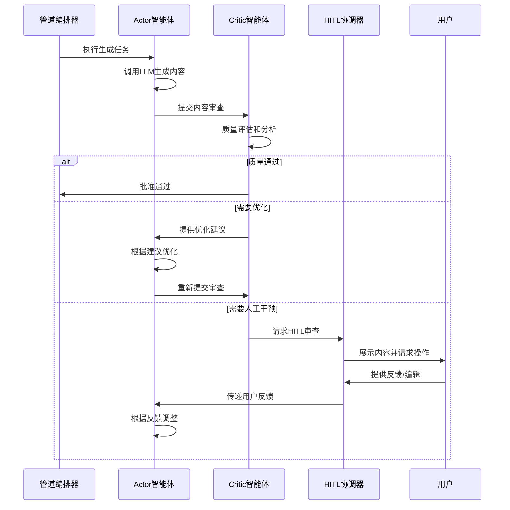
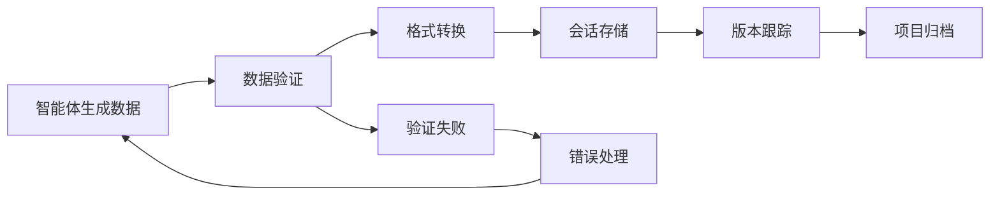
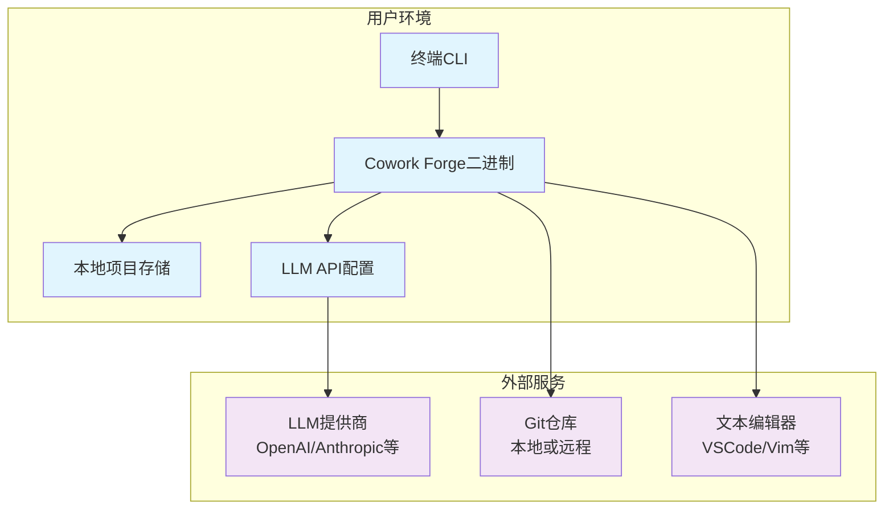

# Cowork Forge 系统架构文档

*文档生成时间：2026-01-29 11:37:13 (UTC)  
文档版本：1.0  
基于研究材料综合分析*

## 1. 架构概述

### 1.1 架构设计理念
Cowork Forge 采用**分层模块化架构**设计，以AI智能体为核心驱动，实现软件开发生命周期的全流程自动化。架构设计遵循以下核心理念：

- **智能体优先原则**：以多智能体协作为基础，采用Actor-Critic模式确保开发质量
- **人机协作机制**：集成Human-in-the-Loop(HITL)机制，关键决策点引入人工干预
- **会话隔离设计**：支持多项目并行开发，确保数据安全性和版本独立性
- **增量修改支持**：独特的修改管理模块支持灵活的项目变更和错误恢复

### 1.2 核心架构模式
系统采用**分层架构**与**管道过滤器模式**相结合的设计：

```
分层架构：CLI应用层 → 业务逻辑层 → 工具层 → 数据层 → 基础设施层
管道模式：构思 → PRD → 设计 → 计划 → 编码 → 检查 → 交付
```

### 1.3 技术栈概览
| 层级 | 技术组件 | 主要功能 |
|------|----------|----------|
| 应用层 | Rust CLI框架 | 命令行接口和用户交互 |
| 业务层 | 智能体框架 | Actor-Critic模式的多智能体协作 |
| 工具层 | 功能工具集 | 文件操作、数据验证、流程控制 |
| 数据层 | JSON Schema + 文件存储 | 数据模型定义和持久化管理 |
| 基础设施层 | LLM API集成 | AI能力接入和配置管理 |

## 2. 系统上下文

### 2.1 系统定位与价值
Cowork Forge 是一个**AI驱动的软件开发生命周期管理系统**，核心价值在于：

- **效率提升**：通过AI智能体自动化传统软件开发流程，减少人工干预
- **质量保障**：集成多轮审查机制和HITL人机协作，确保交付质量
- **灵活性**：支持增量修改、阶段重入和错误恢复，适应多样化开发需求
- **易用性**：降低软件开发技术门槛，使非专业用户也能创建高质量项目

### 2.2 用户角色与场景



#### 2.2.1 主要用户群体
- **软件开发团队**：需要快速原型开发和标准化流程的专业团队
- **技术创业者**：具备技术背景但希望降低开发成本的创业者
- **教育机构**：用于软件工程教学和项目实践的培训机构

### 2.3 外部系统交互



#### 2.3.1 外部依赖系统
- **LLM服务**：提供AI内容生成和决策支持能力
- **版本控制系统**：用于代码版本管理和变更跟踪
- **文本编辑器**：支持HITL机制的人工编辑和审查

### 2.4 系统边界定义
**包含组件**：
- 多智能体工作流引擎和管道编排
- 项目会话管理和状态跟踪
- HITL人机协作交互机制
- 文件操作和数据验证工具集

**排除组件**：
- 代码编译和执行环境
- 数据库管理系统
- 部署和运维平台
- 用户界面渲染引擎

## 3. 容器视图

### 3.1 域模块划分



### 3.2 域模块架构详解

#### 3.2.1 CLI应用域
- **职责**：提供用户交互入口，管理项目会话和工作流执行
- **核心组件**：命令行参数解析器、会话管理器、工作流启动器
- **技术特性**：基于Rust的CLI框架，支持异步任务执行

#### 3.2.2 智能体工作流域
- **职责**：实现软件开发生命周期的核心工作流编排
- **核心模式**：Actor-Critic多智能体协作模式
- **子模块**：
  - **管道编排模块**：动态组装智能体工作流
  - **智能体框架模块**：提供智能体创建和协作基础框架
  - **生命周期模块**：覆盖构思到交付的全流程智能体
  - **修改管理模块**：支持增量修改和变更管理

#### 3.2.3 工具功能域
- **职责**：提供具体的功能操作工具集，支持智能体功能实现
- **工具分类**：
  - **文件操作工具**：安全文件系统操作和命令执行
  - **数据管理工具**：结构化数据创建、修改和验证
  - **流程控制工具**：反馈记录、重规划和阶段跳转
  - **人机交互工具**：HITL内容审查和编辑交互

#### 3.2.4 数据存储域
- **职责**：数据模型定义、序列化和持久化存储管理
- **存储策略**：基于文件的会话隔离存储架构
- **数据模型**：完整的软件开发生命周期数据结构

#### 3.2.5 LLM集成域
- **职责**：LLM基础设施集成，提供配置管理和API调用支持
- **核心功能**：配置加载、速率限制、客户端管理

### 3.3 存储设计
系统采用**文件基础的持久化存储策略**，具有以下特点：

- **会话隔离**：每个项目会话独立存储，支持并行开发
- **版本管理**：通过Git集成支持代码版本控制
- **数据完整性**：JSON Schema验证确保数据结构正确性
- **恢复能力**：支持从任意阶段重启工作流

### 3.4 域间模块通信



## 4. 组件视图

### 4.1 核心功能组件

#### 4.1.1 管道编排组件
**位置**: `crates/cowork-core/src/pipeline/mod.rs`
- **职责**：动态组装和管理工作流管道
- **核心功能**：
  - 全项目创建管道组装
  - 阶段重入管道创建
  - 增量修改管道配置
  - 错误恢复管道重建

#### 4.1.2 智能体协作组件
**位置**: `crates/cowork-core/src/agents/mod.rs`
- **职责**：实现Actor-Critic模式的智能体协作框架
- **核心模式**：
  - **Actor智能体**：负责内容生成和任务执行
  - **Critic智能体**：负责质量审查和反馈提供
  - **HITL协调器**：管理人机协作交互流程

#### 4.1.3 生命周期管理组件
**位置**: `crates/cowork-core/src/instructions/`
- **职责**：实现软件开发生命周期的各个阶段
- **阶段组件**：
  - **构思处理组件** (`idea.rs`)：项目创意分析和结构化
  - **需求管理组件** (`prd.rs`)：产品需求文档生成和验证
  - **架构设计组件** (`design.rs`)：系统架构设计和评审
  - **任务规划组件** (`plan.rs`)：开发任务分解和排期
  - **代码实现组件** (`coding.rs`)：自动化代码生成和审查
  - **质量检查组件** (`check.rs`)：项目结构完整性验证
  - **项目交付组件** (`delivery.rs`)：最终交付报告生成

### 4.2 技术支持组件

#### 4.2.1 文件操作组件
**位置**: `crates/cowork-core/src/tools/file_tools.rs`
- **职责**：提供安全的文件系统操作能力
- **安全特性**：目录遍历防护、命令执行沙箱、路径验证

#### 4.2.2 数据验证组件
**位置**: `crates/cowork-core/src/tools/validation_tools.rs`
- **职责**：确保数据结构的完整性和一致性
- **验证机制**：JSON Schema验证、依赖关系检查、格式合规性

#### 4.2.3 HITL交互组件
**位置**: `crates/cowork-core/src/tools/hitl_tools.rs`
- **职责**：管理人机协作的交互流程
- **交互模式**：编辑模式、通过模式、反馈模式

### 4.3 组件职责划分

| 组件类别 | 组件名称 | 主要职责 | 关键技术 |
|---------|---------|---------|---------|
| 核心业务 | 管道编排器 | 工作流组装和执行 | 动态管道模式 |
| 核心业务 | 智能体框架 | 多智能体协作管理 | Actor-Critic模式 |
| 核心业务 | 生命周期管理器 | 阶段流程控制 | 状态机模式 |
| 技术支持 | 文件操作器 | 安全文件系统访问 | 沙箱安全机制 |
| 技术支持 | 数据验证器 | 数据结构完整性 | JSON Schema |
| 技术支持 | HITL协调器 | 人机交互管理 | 编辑会话管理 |

### 4.4 组件交互关系



## 5. 关键流程

### 5.1 核心功能流程

#### 5.1.1 项目创建完整工作流



**流程特点**：
- **多轮审查机制**：每个阶段都包含Actor生成和Critic审查
- **HITL介入点**：关键决策点引入用户审核和批准
- **迭代优化**：未通过审查时自动重试或调整
- **端到端自动化**：从构思到交付的全流程覆盖

#### 5.1.2 增量修改工作流



**流程特点**：
- **精准变更**：只修改受影响的部分，减少不必要的重做
- **影响评估**：自动分析变更对项目其他部分的影响
- **可控修改**：通过ChangeRequest对象跟踪修改过程

### 5.2 技术处理流程

#### 5.2.1 智能体协作技术流程



### 5.3 数据流路径

#### 5.3.1 主要数据流
```
用户输入 → 会话状态初始化 → 智能体处理 → 中间结果存储 → 
HITL交互 → 结果验证 → 最终交付 → 项目归档
```

#### 5.3.2 数据持久化流程


### 5.4 异常处理机制

#### 5.4.1 智能体执行异常处理
```rust
// 伪代码示例
impl AgentExecutor {
    fn execute_with_retry(&self, task: Task) -> Result<Output, Error> {
        for attempt in 1..=MAX_RETRIES {
            match self.execute_task(&task) {
                Ok(output) => return Ok(output),
                Err(Error::Recoverable(e)) => {
                    log::warn!("Attempt {} failed: {}, retrying...", attempt, e);
                    self.adjust_approach_based_on_error(e);
                }
                Err(Error::Fatal(e)) => {
                    return Err(Error::Fatal(e));
                }
            }
        }
        Err(Error::MaxRetriesExceeded)
    }
}
```

#### 5.4.2 HITL超时处理机制
- **超时检测**：设置合理的等待时间阈值
- **默认处理**：超时后采用预设的默认决策
- **状态恢复**：支持从超时点重新恢复交互

## 6. 技术实现

### 6.1 核心模块实现

#### 6.1.1 智能体框架实现

**核心数据结构**：
```rust
// 智能体基础 trait
pub trait Agent {
    type Input;
    type Output;
    type Error;
    
    fn execute(&self, input: Self::Input) -> Result<Self::Output, Self::Error>;
    fn can_recover(&self, error: &Self::Error) -> bool;
}

// Actor-Critic 模式实现
pub struct ActorCriticSystem<A, C> 
where 
    A: Agent,
    C: Critic<Input = A::Output>,
{
    actor: A,
    critic: C,
    max_iterations: usize,
}

impl<A, C> ActorCriticSystem<A, C> 
where 
    A: Agent,
    C: Critic<Input = A::Output>,
{
    pub fn execute_with_review(&self, input: A::Input) -> Result<A::Output, Error> {
        for iteration in 0..self.max_iterations {
            let output = self.actor.execute(input.clone())?;
            let review = self.critic.review(&output);
            
            match review.decision {
                ReviewDecision::Approve => return Ok(output),
                ReviewDecision::Revise(feedback) => {
                    // 根据反馈调整输入，继续迭代
                    let adjusted_input = self.adjust_input(input, feedback);
                    continue;
                }
                ReviewDecision::HITL => {
                    // 触发人机协作流程
                    let user_feedback = self.request_hitl_review(&output);
                    let adjusted_input = self.integrate_user_feedback(input, user_feedback);
                    continue;
                }
            }
        }
        Err(Error::MaxIterationsExceeded)
    }
}
```

#### 6.1.2 管道编排器实现

**管道组装逻辑**：
```rust
pub struct PipelineBuilder {
    stages: Vec<PipelineStage>,
    context: PipelineContext,
}

impl PipelineBuilder {
    pub fn new() -> Self {
        Self {
            stages: Vec::new(),
            context: PipelineContext::default(),
        }
    }
    
    pub fn add_full_project_creation(mut self) -> Self {
        self.stages.extend_from_slice(&[
            PipelineStage::IdeaProcessing,
            PipelineStage::PRDCreation,
            PipelineStage::DesignArchitecture,
            PipelineStage::TaskPlanning,
            PipelineStage::CodingImplementation,
            PipelineStage::QualityChecking,
            PipelineStage::ProjectDelivery,
        ]);
        self
    }
    
    pub fn add_stage_reentry(mut self, entry_point: PipelineStage) -> Self {
        // 根据重入点构建部分管道
        let partial_stages = self.get_stages_from(entry_point);
        self.stages.extend(partial_stages);
        self
    }
    
    pub fn build(self) -> Pipeline {
        Pipeline {
            stages: self.stages,
            context: self.context,
        }
    }
}
```

### 6.2 关键算法设计

#### 6.2.1 智能体协作算法
```rust
// 多智能体协作调度算法
impl AgentOrchestrator {
    fn schedule_agents(&self, task: &Task) -> ExecutionPlan {
        let mut plan = ExecutionPlan::new();
        
        // 基于任务类型和依赖关系调度智能体
        match task.task_type {
            TaskType::FullProjectCreation => {
                plan.add_sequence(vec![
                    AgentType::IdeaProcessor,
                    AgentType::PRDCreator,
                    AgentType::DesignArchitect,
                    AgentType::TaskPlanner,
                    AgentType::Coder,
                    AgentType::QualityChecker,
                    AgentType::DeliveryAgent,
                ]);
            }
            TaskType::IncrementalModification => {
                plan.add_parallel(vec![
                    AgentType::ChangeAnalyzer,
                    AgentType::ImpactAssessor,
                ]);
                plan.add_sequence(vec![
                    AgentType::CodePatcher,
                    AgentType::ModificationDelivery,
                ]);
            }
        }
        
        plan
    }
}
```

#### 6.2.2 HITL决策算法
```rust
// HITL介入决策算法
impl HITLDecisionEngine {
    fn should_trigger_hitl(&self, context: &ReviewContext) -> bool {
        // 基于多个因素的综合决策
        let confidence_score = context.confidence_score;
        let complexity = context.task_complexity;
        let historical_accuracy = self.get_historical_accuracy(context.agent_type);
        let user_preference = self.get_user_hitl_preference();
        
        // 加权决策公式
        let hitl_score = 
            (1.0 - confidence_score) * 0.4 +
            complexity * 0.3 +
            (1.0 - historical_accuracy) * 0.2 +
            user_preference * 0.1;
        
        hitl_score > self.hitl_threshold
    }
}
```

### 6.3 数据结构设计

#### 6.3.1 项目会话数据结构
```rust
#[derive(Serialize, Deserialize, Clone)]
pub struct ProjectSession {
    pub session_id: Uuid,
    pub project_name: String,
    pub created_at: DateTime<Utc>,
    pub current_stage: PipelineStage,
    pub artifacts: HashMap<ArtifactType, Artifact>,
    pub metadata: SessionMetadata,
    pub version_history: Vec<SessionVersion>,
}

#[derive(Serialize, Deserialize, Clone)]
pub struct Artifact {
    pub artifact_type: ArtifactType,
    pub content: String,
    pub created_at: DateTime<Utc>,
    pub version: u32,
    pub validation_status: ValidationStatus,
    pub dependencies: Vec<ArtifactDependency>,
}
```

#### 6.3.2 智能体执行上下文
```rust
pub struct AgentExecutionContext {
    pub session: Arc<ProjectSession>,
    pub tools: Arc<dyn ToolProvider>,
    pub llm_client: Arc<dyn LLMClient>,
    pub storage: Arc<dyn StorageBackend>,
    pub config: AgentConfig,
}

pub struct AgentConfig {
    pub max_retries: u32,
    pub timeout: Duration,
    pub temperature: f32,
    pub enable_hitl: bool,
    pub validation_strictness: ValidationLevel,
}
```

### 6.4 性能优化策略

#### 6.4.1 LLM调用优化
- **请求批处理**：将多个相关请求合并为单个LLM调用
- **结果缓存**：缓存频繁使用的LLM生成结果
- **速率限制**：智能调节API调用频率，避免超限

#### 6.4.2 内存管理优化
```rust
// 智能内存管理策略
impl ProjectSessionManager {
    fn optimize_memory_usage(&self) {
        // 惰性加载：只加载当前需要的项目数据
        // 增量更新：只保存变更的部分，而非完整状态
        // 缓存清理：定期清理不再使用的会话数据
    }
}
```

#### 6.4.3 并发处理优化
- **异步执行**：使用Rust的async/await实现非阻塞IO
- **并行处理**：对独立任务进行并行执行
- **资源池**：管理LLM客户端连接池和文件句柄

## 7. 部署架构

### 7.1 运行时环境要求

#### 7.1.1 硬件要求
| 资源类型 | 最低要求 | 推荐配置 | 说明 |
|---------|---------|---------|------|
| CPU | 2核心 | 4核心以上 | 支持并发智能体执行 |
| 内存 | 4GB | 8GB以上 | 缓存项目会话数据 |
| 存储 | 10GB | 50GB以上 | 项目文件和历史版本 |
| 网络 | 稳定互联网连接 | 高速低延迟 | LLM API调用依赖 |

#### 7.1.2 软件依赖
- **操作系统**：Linux/macOS/Windows (支持Rust运行)
- **Rust版本**：1.70.0 或更高版本
- **Git**：2.25.0 或更高版本（版本控制集成）
- **文本编辑器**：用户默认编辑器（HITL交互）

### 7.2 部署拓扑结构



### 7.3 可扩展性设计

#### 7.3.1 水平扩展策略
- **会话隔离**：每个项目会话独立，支持多项目并行处理
- **无状态设计**：智能体执行上下文可序列化，支持分布式执行
- **插件架构**：支持自定义智能体和工具的动态加载

#### 7.3.2 垂直扩展策略
```rust
// 可配置的资源限制
pub struct SystemConfig {
    pub max_concurrent_sessions: usize,
    pub max_memory_per_session: ByteSize,
    pub max_file_operations_per_second: u32,
    pub llm_api_rate_limit: RateLimitConfig,
}

impl SystemConfig {
    pub fn adjust_for_environment(&mut self, env: Environment) {
        match env {
            Environment::Development => {
                self.max_concurrent_sessions = 3;
                self.max_memory_per_session = ByteSize::gb(1);
            }
            Environment::Production => {
                self.max_concurrent_sessions = 50;
                self.max_memory_per_session = ByteSize::gb(4);
            }
        }
    }
}
```

### 7.4 监控与运维

#### 7.4.1 系统监控指标
- **性能指标**：LLM API响应时间、文件操作延迟、内存使用率
- **业务指标**：项目完成率、阶段通过率、HITL介入频率
- **质量指标**：代码生成质量评分、用户满意度反馈

#### 7.4.2 日志管理策略
```rust
// 结构化日志记录
#[derive(Serialize)]
pub struct SystemLog {
    pub timestamp: DateTime<Utc>,
    pub level: LogLevel,
    pub session_id: Option<Uuid>,
    pub component: String,
    pub operation: String,
    pub duration: Option<Duration>,
    pub success: bool,
    pub error_message: Option<String>,
    pub metadata: serde_json::Value,
}

// 日志级别配置
pub enum LogLevel {
    Error,    // 系统错误和异常
    Warn,     // 警告和性能问题
    Info,     // 业务流程跟踪
    Debug,    // 调试信息（开发环境）
    Trace,    // 详细跟踪（故障排查）
}
```

#### 7.4.3 故障恢复机制
- **会话快照**：定期保存会话状态，支持故障恢复
- **优雅降级**：LLM服务不可用时提供降级方案
- **数据备份**：自动备份关键项目数据

---

## 架构洞察与最佳实践

### 可扩展性设计亮点
1. **模块化架构**：各域模块职责清晰，支持独立演进和扩展
2. **插件化智能体**：支持自定义智能体的动态注册和集成
3. **配置驱动**：系统行为可通过配置文件灵活调整

### 性能优化建议
1. **LLM调用优化**：实施请求合并、结果缓存和智能重试机制
2. **内存管理**：采用惰性加载和增量更新策略减少内存占用
3. **并发处理**：充分利用Rust的异步特性提高吞吐量

### 安全设计考量
1. **文件操作安全**：实施路径验证和命令执行沙箱
2. **数据完整性**：通过JSON Schema验证确保数据结构正确性
3. **会话隔离**：项目间数据完全隔离，防止信息泄露

### 运维实践指导
1. **监控部署**：建立完整的指标监控和告警体系
2. **日志管理**：实施结构化日志和分级日志策略
3. **备份策略**：定期备份项目数据和系统配置

本架构文档为开发团队、运维团队和技术决策者提供了全面的系统理解，支持高效的开发协作和系统运维。