# 系统架构文档：Cowork Forge

**文档版本**：1.0  
**生成时间**：2026-02-14 05:10:16 (UTC)  
**分类**：架构概述  
**目标受众**：软件架构师、高级开发人员、DevOps 工程师

---

## 1. 架构概述

### 1.1 设计理念

Cowork Forge 体现了一种**混合 AI-人类协作架构**，旨在编排自主软件开发，同时通过结构化干预点保持人类监督。架构基于三个基本原则构建：

1. **认知增强**：系统作为人类开发者认知的延伸，通过 AI 智能体在迭代中保留组织知识，同时自动化机械开发任务。

2. **结构化自主**：而非无约束的 AI 生成，系统强制执行严格的 7 阶段流程（创意→PRD→设计→计划→编码→检查→交付），带有验证门，通过 Actor-Critic 模式确保质量保证。

3. **接口不可知论**：核心域逻辑保持纯净且独立于接口问题，通过端口和适配器模式同时支持自动化优先的 CLI 工作流和交互式 GUI 体验。

### 1.2 核心架构模式

#### 六边形架构（端口和适配器）
系统实现了严格的**六边形架构**，以 `cowork-core` crate 为中心，包含纯域逻辑。所有外部关注点（LLM API、文件系统、用户界面）通过明确定义的端口连接：

- **入站端口**：`InteractiveBackend` 特性实现 CLI 和 GUI
- **出站端口**：用于持久化的仓库抽象、用于 AI 集成的 LLM 客户端接口
- **适配器**：`cowork-cli`、`cowork-gui` 和基础设施模块中的具体实现

#### 领域驱动设计（DDD）
架构遵循 DDD 战术模式：
- **聚合**：`Project`（根）、`Iteration`、`ProjectMemory` 实施一致性边界
- **值对象**：`Artifacts`、`StageResult`、`InheritanceMode`（完整/部分/无）
- **域服务**：流程编排、继承分析、变更范围检测
- **仓库**：`ProjectStore`、`IterationStore`、`MemoryStore` 抽象持久化

#### 事件驱动架构（GUI 层）
基于 Tauri 的桌面应用程序实现事件驱动架构：
- **非对称通信**：请求用命令（invoke），流式响应用事件（emit）
- **实时流式传输**：LLM 令牌流、进程日志和智能体活动通过 Tauri 事件系统流动
- **状态同步**：React 前端维护本地状态，而后端发射状态变更事件

#### Actor-Critic 模式
每个流程阶段实现 Actor-Critic 模式：
- **Actor**：根据指令生成工件（代码、文档、计划）
- **Critic**：验证质量、检查约束、建议改进
- **反馈循环**：人类输入通过批评上下文重新生成 Actor 输出

### 1.3 技术栈概览

| 层级 | 技术 | 目的 | 架构角色 |
|-------|-----------|---------|-------------------|
| **核心域** | Rust + Tokio | 异步运行时执行流程 | 域逻辑隔离 |
| **AI 编排** | adk-rust | 智能体框架和工具生态系统 | AI 智能体生命周期管理 |
| **LLM 集成** | OpenAI 兼容 API | 代码生成和推理 | 基础设施适配器 |
| **限流** | 自定义信号量 + 延迟 | 30 次/分钟合规 | 横切关注点 |
| **CLI 接口** | clap + dialoguer | 命令解析和终端 UI | 主要适配器 |
| **GUI 后端** | Tauri | 桌面运行时和系统集成 | 次要适配器 |
| **GUI 前端** | React 18 + Ant Design | 组件化交互式 UI | 表示层 |
| **持久化** | JSON + serde | 模式演化和存储 | 仓库实现 |
| **安全** | 路径验证 + 沙箱 | 工作区隔离 | 安全边界 |

---

## 2. 系统上下文（C4 1 级）

### 2.1 系统定位和价值

Cowork Forge 定位为**本地优先 AI 开发环境**，介于传统 IDE 和基于云的 AI 编码助手之间。与云解决方案不同，它保持完整的数据 locality，同时提供简单代码补全工具无法实现的结构化 AI 编排。

**核心价值主张**：
- **连续性**：内存系统跨开发会话保留架构决策
- **一致性**：强制的 7 阶段流程确保系统化开发方法论
- **控制**：人在回路门在关键阶段防止 AI 幻觉传播
- **灵活性**：双接口支持同时满足自动化脚本和探索性开发

### 2.2 用户角色和场景

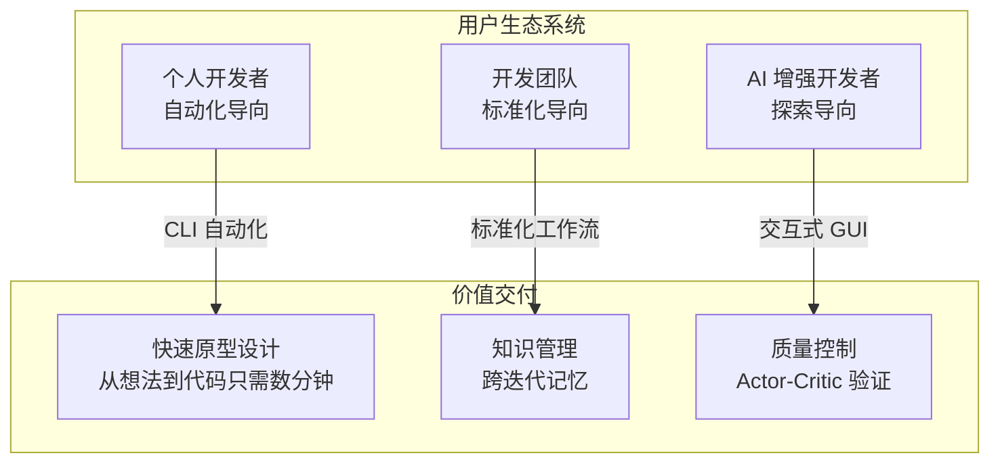

**主要用户原型**：

1. **个人开发者**：利用 CLI 进行快速原型设计，通过自动化从自然语言描述生成样板和脚手架。

2. **开发团队**：使用内存系统跨多个项目维护架构标准，使用继承模式系统地演进现有代码库。

3. **AI 增强开发者**：更喜欢 GUI 接口以了解 AI 决策过程，利用实时流式传输和 HITL 验证以交互方式引导开发过程。

### 2.3 外部系统交互

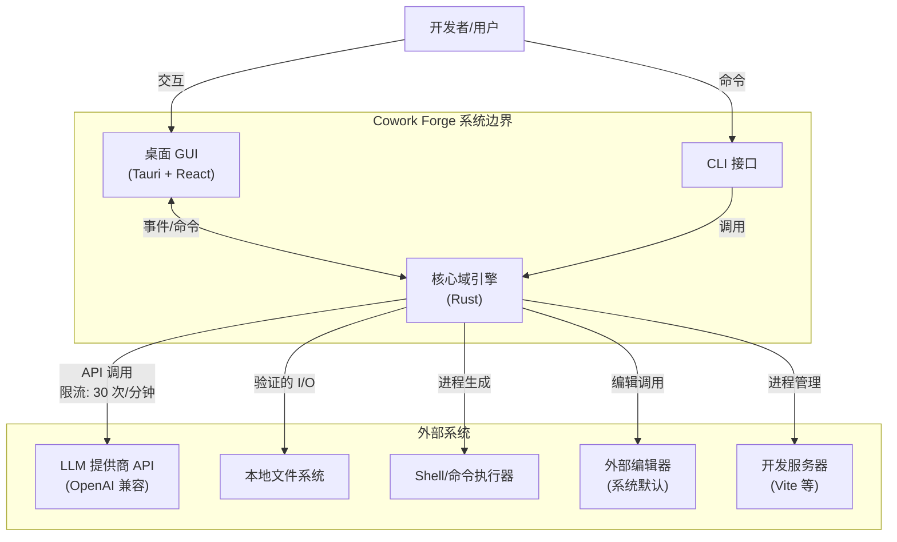

**外部依赖**：

- **LLM 提供商 API**：OpenAI 兼容端点用于智能体推理。交互限流（每分钟 30 次请求）并带有并发控制（单一信号量）以管理 API 配额和成本。

- **本地文件系统**：项目、迭代和内存的主要持久化机制。访问通过工作区验证约束以防止路径遍历攻击。

- **Shell/命令执行器**：用于项目验证（依赖安装、构建、测试）和开发服务器管理。命令在项目工作区边界内进行清理和执行。

- **外部编辑器**：在 HITL 流程中调用的系统默认编辑器，用于内容审查和修改（如 vim、VS Code、nano）。

- **开发服务器**：用户提供的服务器进程（Vite、Webpack 开发服务器），通过 ProcessRunner 管理以提供实时预览功能。

### 2.4 系统边界定义

**范围内组件**：
- 核心域逻辑（迭代、项目、内存聚合）
- 带阶段执行器的 7 阶段 AI 智能体流程
- 智能体指令库（约 2000 行提示工程）
- 工具生态系统（30+ ADK 工具：文件、数据、验证、HITL、内存）
- 基于 JSON 的项目/迭代存储的持久化层
- 带参数解析的 CLI 命令接口
- 基于 Tauri 的 GUI 和 React 前端
- 用于开发服务器的实时进程运行器
- 限流 LLM 客户端工厂
- 跨平台桌面应用程序外壳

**范围外组件**：
- 第三方 LLM 训练基础设施
- 版本控制系统集成（Git 操作）
- 外部包注册表管理（npm、crates.io）
- 云部署平台和 CI/CD 流程
- 远程协作功能（实时多用户编辑）

---

## 3. 容器视图（C4 2 级）

### 3.1 域模块划分

Cowork Forge 结构为**多 crate Rust 工作区**，具有遵循 DDD 战略设计的清晰域边界：

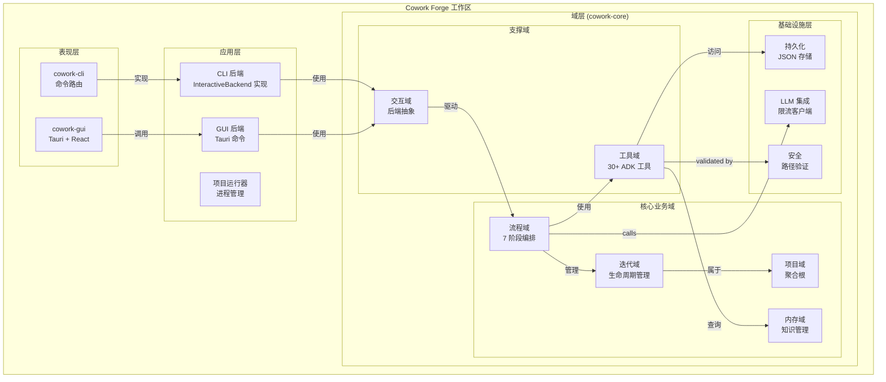

### 3.2 容器架构

#### 核心域容器（`cowork-core`）
系统的心脏包含纯业务逻辑，无外部依赖：

- **域层**：实体（`Project`、`Iteration`、`Memory`）、值对象（`InheritanceMode`）和域服务（流程编排）
- **流程层**：阶段特性实现、阶段执行器和指令库
- **工具层**：30+ ADK 工具，按功能组织（文件、数据、HITL、内存、验证）
- **基础设施层**：带限流的 LLM 配置、JSON 持久化和交互后端

#### CLI 容器（`cowork-cli`）
实现基于终端交互的薄适配器：
- **Clap 解析器**：命令行参数解析和路由
- **InteractiveBackend 实现**：基于终端的 HITL，带 dialoguer 提示和彩色输出
- **命令处理器**：委托给核心域的薄包装

#### GUI 容器（`cowork-gui`）
基于 Tauri 的桌面应用程序，带 React 前端：
- **Tauri 后端**：通过 IPC 暴露核心功能的 Rust 命令
- **React 前端**：8 面板界面（项目、迭代、编辑器、运行器、内存、知识）
- **事件系统**：用于流式传输和 HITL 的实时双向通信

### 3.3 存储设计

系统实现**JSON 优先持久化**以实现可移植性和版本控制兼容性：

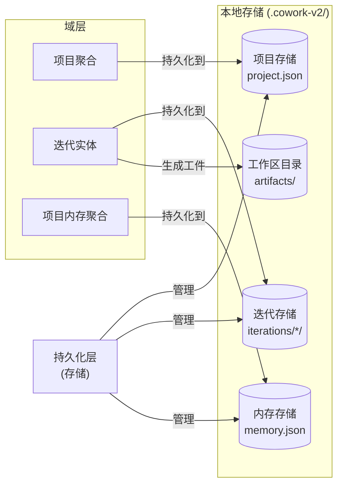

**存储特性**：
- **项目存储**：元数据、技术栈检测、迭代摘要
- **迭代存储**：阶段工件（idea.md、prd.md、design.md、plan.md、代码文件）、执行状态
- **内存存储**：跨迭代的架构决策、模式、问题、学习
- **工作区**：流程执行期间 AI 智能体生成的文件系统工件

### 3.4 域间通信

**同步通信**：
- **命令模式**：CLI/GUI 通过命令处理器调用域操作
- **仓库模式**：域聚合通过存储抽象持久化
- **特性抽象**：`InteractiveBackend` 特性实现多态用户交互

**异步通信**（仅 GUI）：
- **事件流式传输**：Tauri 后端发射事件（`agent_event`、`tool_call`、`input_request`）用于实时 UI 更新
- **进程流式传输**：开发服务器日志通过 `project_log` 事件流式传输
- **背压处理**：Tokio 通道管理流式 LLM 响应而不阻塞

---

## 4. 组件视图（C4 3 级）

### 4.1 核心功能组件

#### 流程编排组件

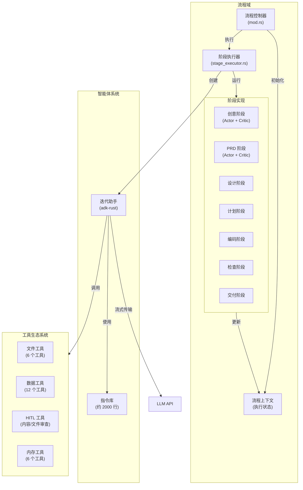

**组件职责**：
- **流程控制器**：管理迭代生命周期、阶段排序和错误处理
- **阶段执行器**：连接域逻辑与 adk-rust 框架，管理智能体生命周期
- **阶段实现**：七个遵循策略模式的具体策略，每个都有特定指令和工件生成逻辑
- **迭代助手**：处理流式传输、工具调用和人类交互的 AI 智能体包装器

#### 内存管理组件

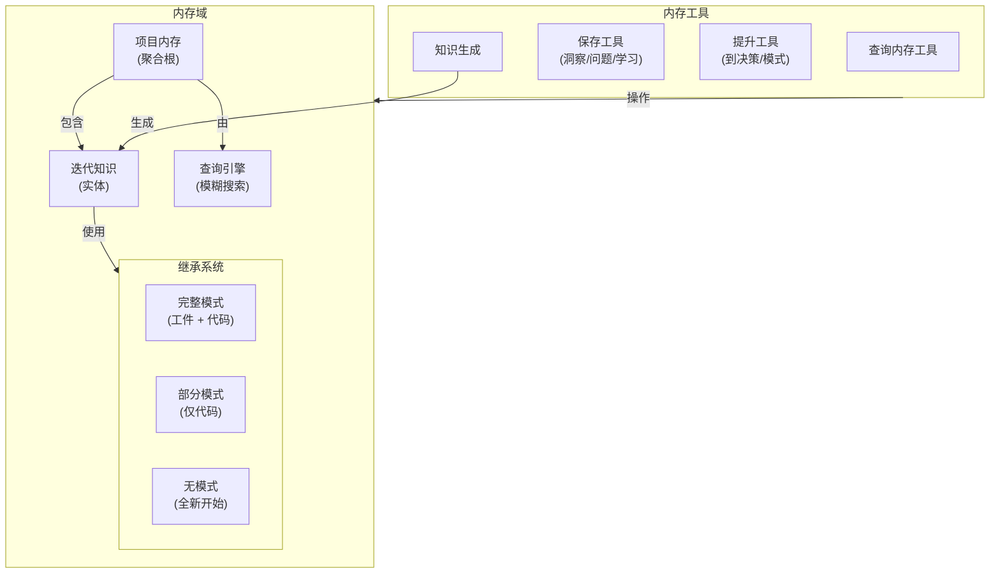

**内存继承模式**：
- **完整**：完整工件和代码转移用于重大重构（从任何阶段继续）
- **部分**：仅代码继承用于增量功能开发（通常从编码阶段开始）
- **无**：无历史负担的新迭代（从创意阶段开始）

### 4.2 技术支持组件

#### 带限流的 LLM 集成

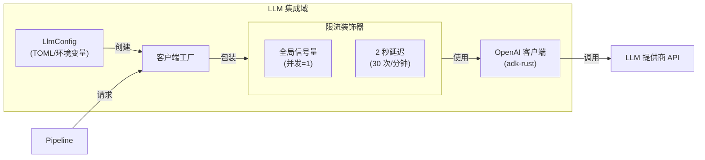

**限流策略**：
- **令牌桶替代方案**：使用信号量（concurrency=1）结合固定延迟（2 秒）以强制每分钟 30 次请求
- **全局范围**：限流器在所有流程阶段之间共享以防止 API 配额耗尽
- **背压**：请求阻塞直到容量可用，确保合规而不丢弃请求

#### 安全和验证层

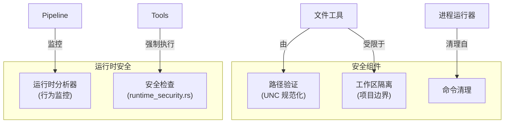

### 4.3 组件交互关系

**关键路径依赖**：
1. **流程 → 工具**：流程执行器将工具集注入 AI 智能体；工具访问文件系统和内存
2. **工具 → 持久化**：所有数据修改通过仓库模式流向 JSON 存储
3. **流程 → 交互**：HITL 门暂停执行直到 InteractiveBackend 返回用户输入
4. **GUI ↔ 后端**：Tauri 命令触发域操作；事件将进度流回 React

**解耦机制**：
- **基于特性的后端**：`InteractiveBackend` 特性将流程与特定 UI 实现解耦
- **依赖注入**：阶段执行器接收工具依赖而不是构造它们
- **事件驱动更新**：GUI 组件对事件做出反应而不是轮询，减少耦合

---

## 5. 关键流程

### 5.1 创世迭代创建流程

将自然语言想法转化为完整软件项目的主要工作流：

```mermaid
flowchart TD
    Start([用户提供想法]) --> Entry{入口点}
    Entry -->|CLI: cowork iter| CLI[CLI 解析器]
    Entry -->|GUI: 创建按钮| GUI[React 前端]
    
    CLI --> Init[初始化流程上下文]
    GUI --> Init
    
    Init --> Stage1[创意阶段<br/>捕获需求<br/>输出: idea.md]
    Stage1 -->|HITL 门| Confirm1{用户确认}
    Confirm1 -->|编辑/反馈| Stage1
    Confirm1 -->|批准| Stage2
    
    Stage2[PRD 阶段<br/>Actor/Critic 模式<br/>输出: prd.md] -->|HITL 门| Confirm2{用户确认}
    Confirm2 -->|编辑/反馈| Stage2
    Confirm2 -->|批准| Stage3
    
    Stage3[设计阶段<br/>系统架构<br/>输出: design.md] -->|HITL 门| Confirm3{用户确认}
    Confirm3 -->|编辑/反馈| Stage3
    Confirm3 -->|批准| Stage4
    
    Stage4[计划阶段<br/>任务生成<br/>输出: plan.md] -->|HITL 门| Confirm4{用户确认}
    Confirm4 -->|编辑/反馈| Stage4
    Confirm4 -->|批准| Stage5
    
    Stage5[编码阶段<br/>代码实现<br/>输出: 源文件] -->|HITL 门| Confirm5{用户确认}
    Confirm5 -->|编辑/反馈| Stage5
    Confirm5 -->|批准| Stage6
    
    Stage6[检查阶段<br/>质量验证<br/>输出: check_report.md] -->|HITL 门| Confirm6{用户确认}
    Confirm6 -->|编辑/反馈| Stage6
    Confirm6 -->|批准| Stage7
    
    Stage7[交付阶段<br/>最终报告<br/>输出: delivery_report.md] --> Deploy[部署到项目根目录]
    
    Deploy --> Knowledge[生成知识快照<br/>决策、模式、技术栈]
    Knowledge --> Persist[持久化到内存存储]
    Persist --> Complete([迭代完成])
    
    style Start fill:#e1f5fe
    style Complete fill:#c8e6c9
    style Stage1 fill:#fff3e0
    style Stage2 fill:#fff3e0
    style Stage3 fill:#fff3e0
    style Stage4 fill:#fff3e0
    style Stage5 fill:#fff3e0
    style Stage6 fill:#fff3e0
    style Stage7 fill:#fff3e0
```

**流程特性**：
- **阶段门**：每个阶段包含可选的 HITL 确认；用户可以通过、编辑或请求带反馈的重新生成
- **工件积累**：每个阶段生成持久工件（markdown 文档、代码文件）在工作区可见
- **Actor-Critic 验证**：PRD 和设计阶段采用双智能体验证，Critic 智能体审查 Actor 输出
- **知识捕获**：完成后，系统提取架构决策、模式和技术栈以供未来迭代使用

### 5.2 演进迭代流程

通过智能变更范围分析在先前迭代基础上实现增量开发：

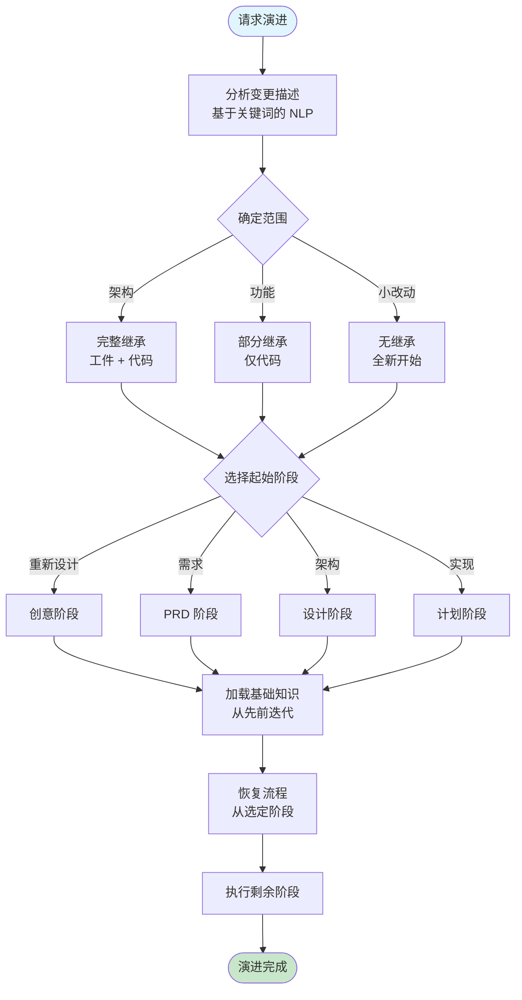

**继承策略**：
- **变更范围分析**：NLP 关键词匹配确定最佳起始阶段（"redesign" → 创意，"add feature" → 编码，"fix bug" → 检查）
- **知识转移**：来自父迭代的基础知识（决策、模式、问题）加载到智能体上下文
- **工作区管理**：继承模式决定哪些文件复制到新迭代工作区

### 5.3 GUI 实时执行流程

用于交互式开发监控的事件驱动架构：

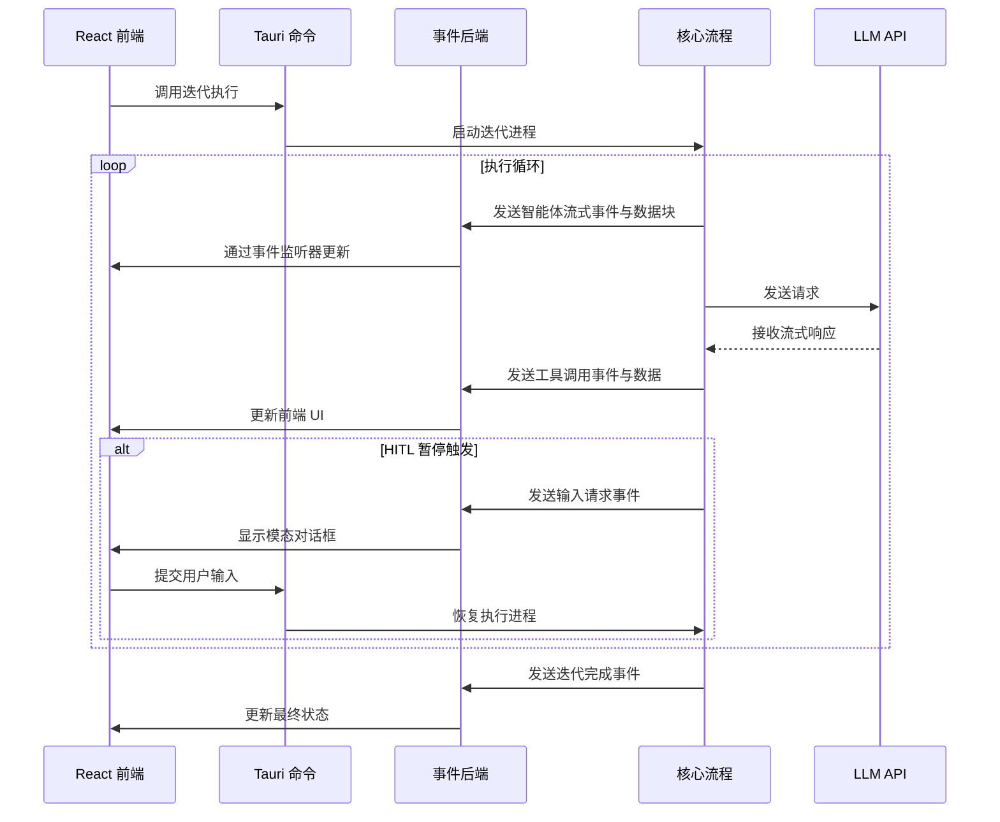

**事件类型**：
- `agent_event`：高级智能体消息（阶段转换、完成）
- `agent_streaming`：用于实时显示的逐令牌 LLM 输出
- `tool_call`/`tool_result`：工具执行可视化
- `input_request`：带 oneshot 通道响应的 HITL 模态框触发
- `project_log`：开发服务器 stdout/stderr 流式传输

### 5.4 人在回路验证流程

关键决策点的结构化人工监督：

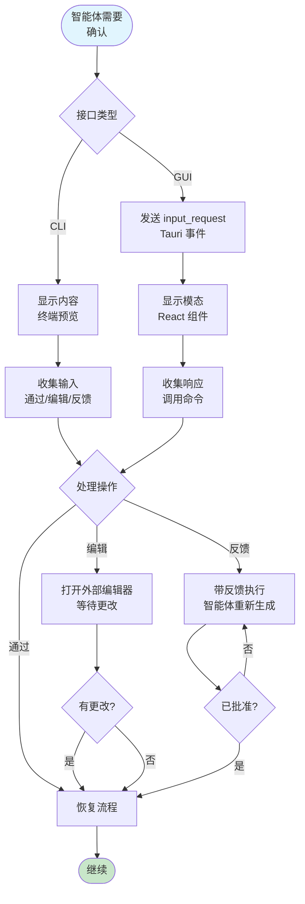

---

## 6. 技术实现

### 6.1 核心模块实现

#### 流程控制器（`crates/cowork-core/src/pipeline/mod.rs`）

流程实现**模板方法模式**，带阶段特定实现：

```rust
// 基于架构分析的概念结构
pub struct PipelineController {
    context: PipelineContext,
    backend: Arc<dyn InteractiveBackend>,
}

impl PipelineController {
    pub async fn execute_genesis_iteration(&mut self, idea: &str) -> Result<Iteration> {
        // 阶段序列：Idea -> PRD -> Design -> Plan -> Coding -> Check -> Delivery
        let stages = vec![
            Box::new(IdeaStage) as Box<dyn Stage>,
            Box::new(PRDStage),
            // ... 剩余阶段
        ];
        
        for stage in stages {
            let result = self.execute_stage_with_hitl(stage).await?;
            self.context.update(result);
        }
        
        self.generate_knowledge_snapshot().await
    }
    
    async fn execute_stage_with_hitl(&self, stage: Box<dyn Stage>) -> Result<StageResult> {
        let result = stage.execute(&self.context).await?;
        
        if stage.requires_confirmation() {
            match self.backend.request_confirmation(&result).await? {
                UserAction::Pass => Ok(result),
                UserAction::Edit => self.open_editor_and_reload().await,
                UserAction::Feedback(feedback) => {
                    stage.execute_with_feedback(&self.context, feedback).await
                }
            }
        } else {
            Ok(result)
        }
    }
}
```

#### InteractiveBackend 特性（`crates/cowork-core/src/interaction/mod.rs`）

定义用户交互端口，启用六边形架构：

```rust
#[async_trait]
pub trait InteractiveBackend: Send + Sync {
    // 显示方法
    async fn display_message(&self, msg: &str);
    async fn display_stream(&self, content: &str);
    async fn display_tool_call(&self, tool_name: &str, params: &Value);
    
    // HITL 方法
    async fn request_confirmation(&self, content: &Artifact) -> Result<UserAction>;
    async fn request_input(&self, prompt: &str) -> Result<String>;
    
    // 进度跟踪
    async fn update_progress(&self, stage: &str, progress: f32);
}
```

实现：
- **CLI 后端**：使用 `dialoguer` 提示、`console` 彩色输出、终端表格用于迭代列表
- **Tauri 后端**：使用 `AppHandle` 事件发射、`tokio::sync::oneshot` 用于 HITL 响应通道

### 6.2 关键算法设计

#### 变更范围分析算法

确定演进迭代的最佳起始阶段：

```rust
fn analyze_change_scope(description: &str) -> Stage {
    let lower = description.to_lowercase();
    
    if lower.contains("redesign") || lower.contains("architectural") {
        Stage::Idea
    } else if lower.contains("requirement") || lower.contains("feature spec") {
        Stage::PRD
    } else if lower.contains("design") || lower.contains("component") {
        Stage::Design
    } else if lower.contains("implement") || lower.contains("code") {
        Stage::Coding
    } else {
        Stage::Idea // 默认为完全重新考虑
    }
}
```

#### 带模糊匹配的内存查询

支持三种查询范围，带关键词过滤：

```rust
pub fn query_memories(
    &self,
    scope: QueryScope,
    category: Option<MemoryCategory>,
    keywords: &[String],
    limit: usize,
) -> Vec<MemoryEntry> {
    let candidates = match scope {
        QueryScope::Project => self.load_project_memories(),
        QueryScope::Iteration(id) => self.load_iteration_memories(id),
        QueryScope::Latest => self.merge_latest_memories(),
    };
    
    candidates
        .filter(|m| category.map_or(true, |c| m.category == c))
        .filter(|m| keywords.iter().any(|k| m.content.contains(k)))
        .take(limit)
        .collect()
}
```

### 6.3 数据结构设计

#### 项目聚合

```rust
pub struct Project {
    pub id: ProjectId,
    pub name: String,
    pub project_type: ProjectType,
    pub tech_stack: TechStack,
    pub created_at: DateTime<Utc>,
    pub iterations: Vec<IterationSummary>,
    pub current_iteration: Option<IterationId>,
}

pub struct Iteration {
    pub id: IterationId,
    pub project_id: ProjectId,
    pub mode: IterationMode, // Genesis or Evolution
    pub inheritance: InheritanceMode,
    pub status: IterationStatus, // Draft, Running, Completed, Failed
    pub stages: HashMap<Stage, StageResult>,
    pub workspace_path: PathBuf,
}
```

#### 内存聚合

```rust
pub struct ProjectMemory {
    pub project_id: ProjectId,
    pub decisions: Vec<Decision>,
    pub patterns: Vec<Pattern>,
    pub insights: Vec<Insight>,
    pub issues: Vec<Issue>,
    pub tech_stack: TechStackKnowledge,
}

pub struct IterationKnowledge {
    pub iteration_id: IterationId,
    pub summary: String,
    pub promoted_memories: Vec<MemoryId>, // 提升到项目级别
    pub stage_insights: HashMap<Stage, Vec<Insight>>,
}
```

### 6.4 性能优化策略

#### 异步流程执行
- **Tokio 运行时**：用于 I/O 密集型操作（LLM 调用、文件 I/O）的多线程异步执行
- **流式架构**：LLM 响应直接流式传输到 UI 而不缓冲，减少延迟感知
- **并发工具调用**：在依赖允许的情况下，独立工具执行并发运行

#### 内存管理
- **延迟加载**：项目内存在按需加载而不是启动时加载
- **增量持久化**：只有修改过的实体序列化到磁盘，而不是整个聚合
- **工作区隔离**：每个迭代有独立工作区防止文件争用

#### 限流优化
- **令牌桶替代方案**：固定延迟 + 信号量比令牌桶更简单，适用于单用户场景
- **请求批处理**：在可能的情况下，多个小请求合并（尽管受限于基于聊天的 LLM API）

---

## 7. 部署架构

### 7.1 运行时环境要求

**系统要求**：
- **操作系统**：跨平台（Windows 10+、macOS 12+、Linux Ubuntu 20.04+）
- **运行时**：核心用 Rust 运行时（Tokio），Node.js（仅用于 Tauri 构建）
- **内存**：最低 4GB RAM（大型项目推荐 8GB）
- **存储**：500MB 应用程序 + 项目工作区（每个项目通常 50-200MB）
- **网络**：需要互联网连接以访问 LLM API（OpenAI 兼容端点）

**依赖**：
- **外部**：LLM API 密钥（OpenAI、Anthropic 或兼容）
- **系统**：默认文本编辑器（vim、nano、VS Code 等）、Node.js（用于生成的项目）
- **可选**：开发服务器（Vite、Webpack）用于预览功能

### 7.2 部署拓扑

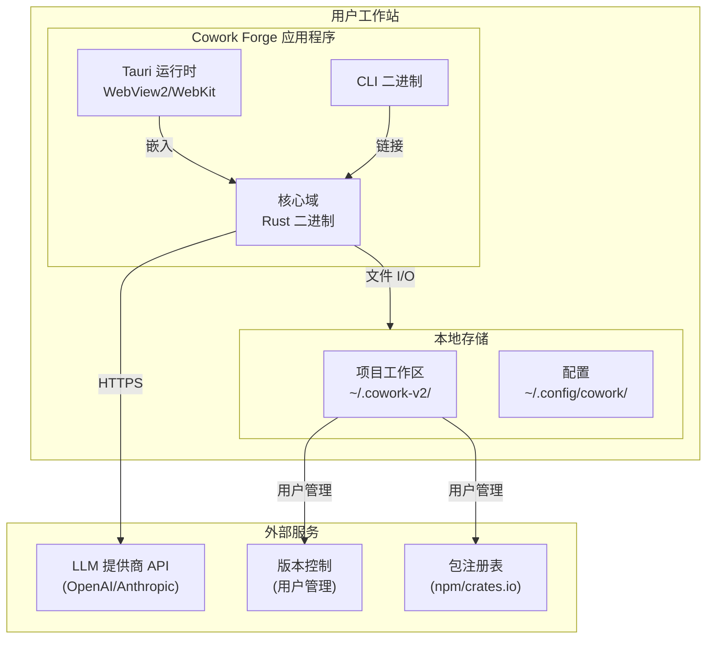

**分发模型**：
- **桌面应用程序**：基于 Tauri 的安装程序（macOS 用 .dmg，Windows 用 .msi，Linux 用 .AppImage/.deb）
- **CLI 工具**：可安装的 Cargo crate 或独立二进制
- **核心库**：作为 Rust crate 发布，用于嵌入其他工具

### 7.3 可扩展性设计

**当前架构限制**：
- **单用户**：无多用户协作功能；设计用于个人工作站
- **本地优先**：所有计算和存储都是本地的；无需水平扩展
- **同步 LLM**：限流（30 次/分钟）防止并行 LLM 请求扩展

**扩展点**：
- **插件架构**：工具系统支持自定义 ADK 工具注入，用于特定领域操作
- **自定义阶段**：流程特性系统允许自定义阶段实现（例如，安全审查阶段）
- **多模型支持**：LLM 配置支持多个提供者；可扩展到本地模型（Llama、Mistral）
- **内存后端**：仓库模式允许替换 JSON 存储为数据库后端（SQLite、PostgreSQL），用于团队场景

### 7.4 监控和运维

**可观察性**：
- **日志记录**：通过 `tracing` crate 进行结构化日志，可配置级别（开发用 DEBUG，生产用 INFO）
- **指标**：流程执行持续时间、阶段成功率、LLM 令牌消耗
- **事件跟踪**：Tauri 事件在 GUI 模式下提供实时执行可见性

**运维注意事项**：
- **备份**：项目存储为纯文本（JSON + Markdown）在用户目录中；标准备份解决方案适用
- **迁移**：JSON 模式版本控制支持向前兼容；`.cowork-v2` 目录命名允许并行版本安装
- **安全**：工作区路径验证防止未授权文件访问；无网络监听器暴露（仅出站 LLM 调用）

**健康检查**：
- **LLM 连接性**：`cowork status` 验证命令测试 API 密钥和连接性
- **工作区完整性**：加载时自动验证项目结构
- **工具可用性**：运行时检查所需外部工具（编辑器、shell 命令）

---

## 架构决策记录（ADR）

### ADR-001：多 Crate 工作区结构
**决策**：在 Cargo 工作区内将 CLI、GUI 和核心分离为不同的 crate。  
**理由**：实现独立部署（CLI 用于自动化，GUI 用于交互）同时共享域逻辑。防止 GUI 依赖（Tauri、WebView）膨胀 CLI 二进制。

### ADR-002：基于特性的后端抽象
**决策**：`InteractiveBackend` 特性统一 CLI 和 GUI 交互。  
**理由**：单一流程代码路径支持自动化和交互模式，无需在域层中条件逻辑。

### ADR-003：JSON 优先持久化
**决策**：使用基于文件的 JSON 存储而不是数据库。  
**理由**：可移植性、版本控制兼容性和本地优先架构。使用户能够使用标准工具检查和修改项目状态。

### ADR-004：基础设施层限流
**决策**：用于 LLM 限流（30 次/分钟）的装饰器模式，带信号量并发控制。  
**理由**：API 配额保护和成本控制。全局限流器确保无论流程阶段并行性如何都保持合规。

### ADR-005：非对称通信的事件驱动 GUI
**决策**：Tauri 命令用于请求，事件用于流式响应。  
**理由**：命令为操作提供请求-响应语义；事件为流式 LLM 令牌和进程日志启用服务器推送，无需轮询开销。

---

## 结论

Cowork Forge 展示了将**六边形架构**和**领域驱动设计**原则应用于 AI 辅助开发领域的成熟实践。架构通过 7 阶段流程和 HITL 验证门成功平衡了 AI 自主性和人类监督。

关键架构优势包括：
- **清晰分离**：核心域保持纯净和可测试，与 UI 和基础设施关注点隔离
- **双接口策略**：优雅的基于特性的抽象同时支持 CLI 自动化和 GUI 交互性
- **知识持久化**：内存系统弥补了无状态 AI 智能体和有状态软件开发之间的差距
- **安全优先**：工作区隔离和路径验证防止尝试文件系统遍历的提示注入攻击

系统为演进扩展做好了准备，清晰的域边界支持未来增强，如团队协作功能、其他 AI 模型集成或自定义流程阶段。
