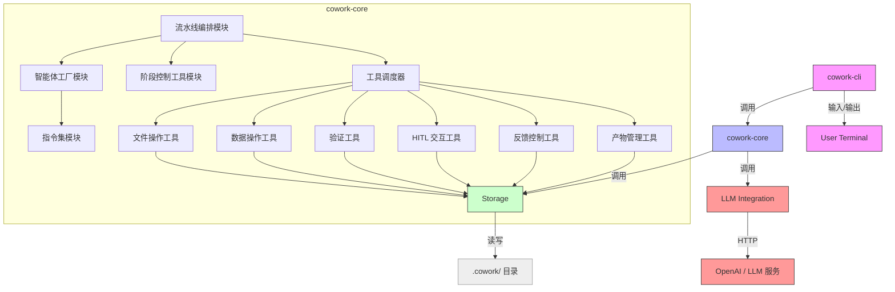
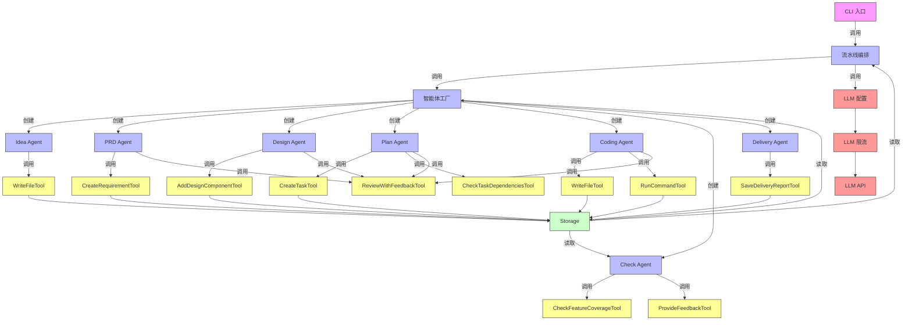
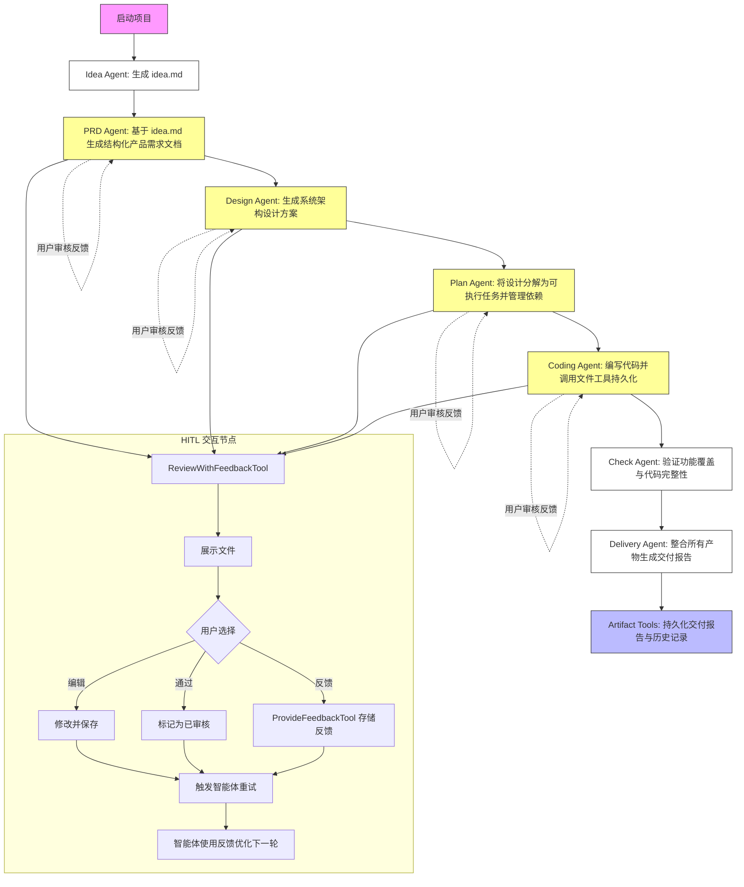
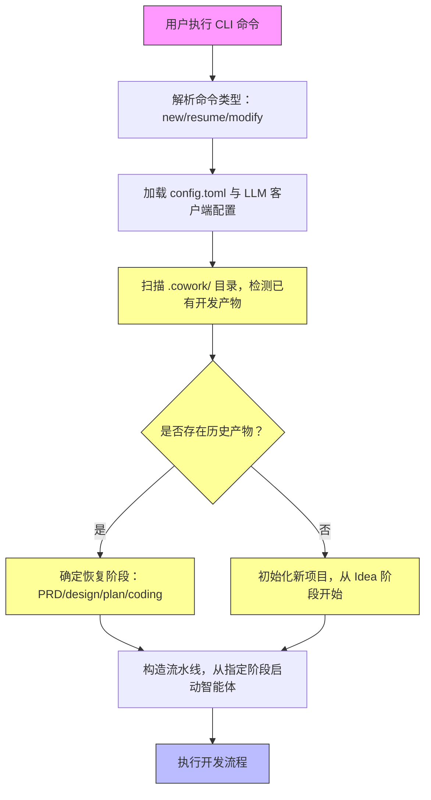
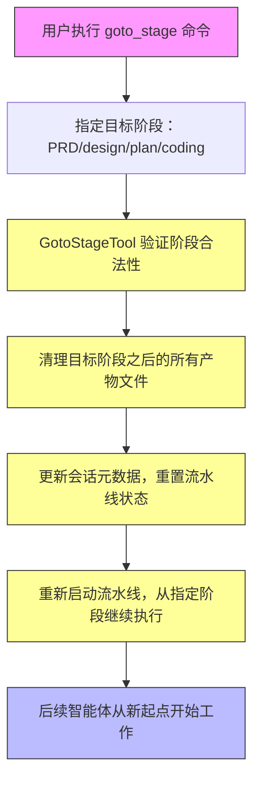
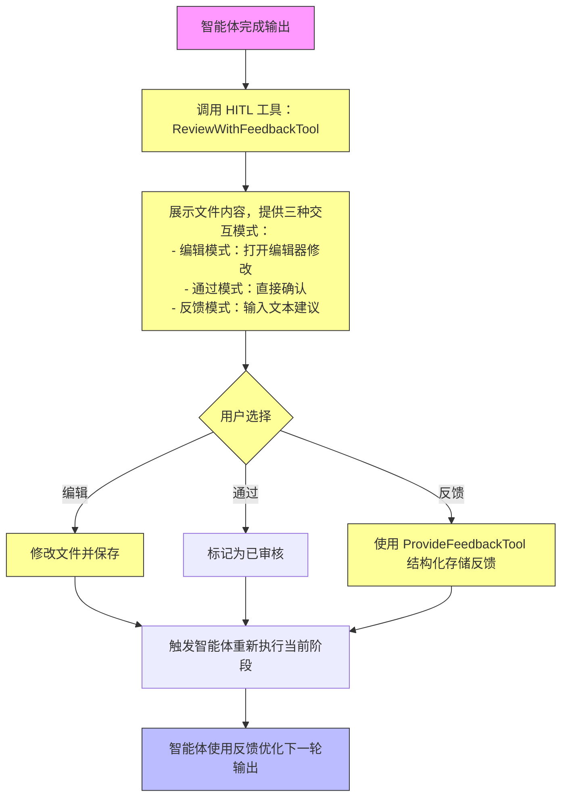
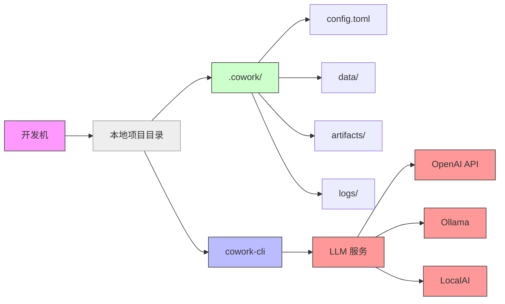

# System Architecture Documentation

## 1. Architecture Overview

### Architecture Design Philosophy

Cowork Forge V2 的架构设计遵循“**轻量、可追溯、人机协同、状态即文件**”的核心哲学，旨在构建一个**无需外部依赖、完全本地化、可恢复、可审计**的 AI 原生软件开发引擎。系统摒弃了传统基于数据库的微服务架构，转而采用**基于文件系统的状态持久化模型**，将整个开发流程的中间产物（需求、设计、任务、代码、反馈）以结构化 JSON 文件形式存储于 `.cowork/` 目录中，实现“**状态即代码**”的工程理念。

该设计带来三大核心优势：
1. **极致可靠性**：无外部服务依赖，避免网络抖动、数据库宕机、API 限流等外部风险；
2. **强可追溯性**：所有变更均有文件版本记录，支持 Git 管理，便于审计与回滚；
3. **高可移植性**：纯 Rust 编写，单二进制可部署于 Linux/macOS/Windows，无需容器或运行时环境。

系统采用**分层架构 + 工具模式 + 智能体流水线**的复合设计模式，将复杂软件工程流程解耦为可编排、可验证、可中断的原子化智能体协作网络。每个阶段由独立智能体驱动，通过标准化工具接口与持久化层交互，实现高内聚、低耦合的模块化设计。

### Core Architecture Patterns

| 模式 | 应用场景 | 价值 |
|------|----------|------|
| **分层架构（Layered Architecture）** | 五层模块划分（CLI → 智能体编排 → 工具集 → 存储模型 → LLM） | 实现关注点分离，降低系统复杂度，便于独立测试与替换 |
| **智能体流水线（Agent Pipeline）** | Idea → PRD → Design → Plan → Coding → Check → Delivery 七阶段流水线 | 将非结构化开发流程转化为可编排、可监控、可恢复的自动化流程 |
| **工具模式（Tool Pattern）** | 所有文件读写、数据操作、用户交互均通过 `Tool Trait` 接口实现 | 实现智能体与底层操作解耦，支持动态扩展与单元测试 |
| **人类在环（Human-in-the-Loop, HITL）** | 在 PRD、Design、Plan、Coding 阶段插入人工审核节点 | 确保 AI 输出符合业务意图，避免“幻觉”输出，提升交付质量 |
| **状态恢复机制（Stateful Recovery）** | `GotoStageTool` + `create_partial_pipeline()` 实现任意阶段恢复 | 支持流程中断后精准恢复，是人机协同的核心容错能力 |
| **配置即代码（Configuration as Code）** | `config.toml` 定义 LLM 参数、路径、日志级别 | 支持环境差异化配置，便于团队协作与 CI/CD 集成 |

### Technology Stack Overview

| 层级 | 技术选型 | 说明 |
|------|----------|------|
| **核心语言** | Rust 1.75+ | 内存安全、零成本抽象、高并发支持，适合构建高性能、高可靠系统 |
| **CLI 框架** | `clap` (v4) | 高性能、类型安全的命令行参数解析库，支持子命令、自动帮助生成 |
| **配置管理** | `config` + `serde` + `toml` | 支持多源配置（文件、环境变量、默认值），自动反序列化为结构体 |
| **LLM 集成** | `reqwest` + `serde_json` | 通用 HTTP 客户端，兼容 OpenAI API 及任何兼容的 LLM 服务（如 Ollama、LocalAI） |
| **数据序列化** | `serde` + `JSON` | 所有数据模型统一使用 JSON 格式持久化，确保跨模块兼容性 |
| **文件系统操作** | `std::fs` + `pathdiff` + `walkdir` | 安全路径处理，防止路径穿越攻击，支持递归目录遍历 |
| **异步执行** | `tokio` (1.35+) | 异步 I/O 支持，用于 LLM 调用、文件读写等阻塞操作，提升并发吞吐 |
| **日志系统** | `tracing` + `tracing-subscriber` | 结构化日志，支持 trace、debug、info 级别，便于调试与监控 |
| **测试框架** | `rstest` + `mockall` | 支持参数化测试与 Mock 工具，实现工具模块的高覆盖率单元测试 |

> **技术选型洞察**：Rust 的所有权模型确保了系统在多线程并发调用工具时的内存安全，避免了传统脚本语言（Python/Node.js）在复杂状态管理中的竞态风险。JSON 作为统一数据格式，虽非最优性能选择，但极大提升了可读性、调试便利性与跨工具兼容性，符合“**可审计优于高性能**”的工程哲学。

---

## 2. System Context

### System Positioning and Value

Cowork Forge V2 是一款面向**软件开发团队**的 AI 原生自动化开发引擎，定位为“**AI 驱动的开发协作者**”，而非替代人类的全自动系统。其核心价值在于：

> **将模糊的业务意图，通过结构化、可追溯、可审核的智能体流水线，转化为高质量、可交付的软件产物，同时保留人类在关键节点的决策权。**

系统显著降低开发流程中的重复性劳动（如撰写 PRD、拆解任务、编写样板代码），缩短从“想法”到“可提交代码”的周期，提升交付一致性与规范性。适用于：
- 产品原型快速验证
- 小型团队敏捷开发
- 新成员快速上手项目
- 需求频繁变更的迭代场景

### User Roles and Scenarios

| 角色 | 描述 | 核心需求 | 典型使用场景 |
|------|------|----------|--------------|
| **软件开发团队**<br>（产品经理、架构师、全栈工程师） | 负责定义项目目标并监督 AI 输出质量 | - 快速将模糊需求转化为结构化 PRD<br>- 自动生成系统架构方案<br>- 获得可直接提交的高质量代码<br>- 在关键节点审核与反馈 | 产品经理输入“我要一个在线问卷系统”，系统自动生成需求文档、技术架构、任务列表与前端/后端代码，开发者仅需审核与微调 |
| **技术负责人/项目经理** | 负责流程监控与质量把控 | - 可视化开发流程状态<br>- 随时中断并恢复至任意阶段<br>- 审查 AI 生成内容质量<br>- 获取交付报告与历史记录 | 在开发中途发现设计缺陷，执行 `goto_stage design` 重置后续阶段，重新生成架构，避免错误代码蔓延 |

### External System Interactions

| 外部系统 | 交互类型 | 交互方式 | 说明 |
|----------|----------|----------|------|
| **OpenAI API / 兼容 LLM 服务** | API 调用 | HTTPS POST / JSON | 系统通过 `reqwest` 向 LLM 发送结构化 Prompt，接收生成文本。支持自定义端点（如本地部署的 Llama 3、Mistral） |
| **本地文件系统** | 文件读写 | POSIX 文件系统 API | 所有开发产物（idea.md、requirements.json、代码文件、日志）均持久化至 `.cowork/` 目录，是系统唯一状态源 |
| **用户终端（CLI）** | 标准输入/输出 | stdin/stdout/stderr | 用户通过命令行输入指令（如 `cowork new`、`cowork goto_stage plan`），系统输出进度、错误、文件内容供用户编辑 |

> **关键设计决策**：系统**不依赖**任何数据库、Web 服务、CI/CD 工具或代码托管平台，所有交互均通过 CLI 与本地文件系统完成，确保**离线可用性**与**最小化部署依赖**。

### System Boundary Definition

```mermaid
graph LR
    A[用户] -->|CLI 命令| B[Cowork Forge V2]
    B -->|读写| C[本地文件系统 .cowork/]
    B -->|API 调用| D[LLM 服务]
    B -->|输出日志/结果| A

    subgraph Cowork Forge V2 (系统边界)
        B1[cowork-cli CLI 入口]
        B2[cowork-core 核心引擎]
        B3[LLM 配置与限流模块]
        B4[智能体指令集]
        B5[工具集]
        B6[数据模型与存储]
        B7[流水线编排器]
        
        B1 --> B2
        B2 --> B3
        B2 --> B4
        B2 --> B5
        B2 --> B6
        B2 --> B7
    end

    subgraph Excluded (系统边界外)
        E[图形用户界面 GUI]
        F[Web 服务端点]
        G[PostgreSQL/MySQL 数据库]
        H[GitHub Actions/Jenkins]
        I[GitHub/GitLab]
        J[独立微服务]
        K[移动端/桌面端应用]
    end

    style B fill:#bbf,stroke:#333
    style C fill:#cfc,stroke:#333
    style D fill:#f99,stroke:#333
    style A fill:#f9f,stroke:#333
    style E fill:#ddd,stroke:#999
    style F fill:#ddd,stroke:#999
    style G fill:#ddd,stroke:#999
    style H fill:#ddd,stroke:#999
    style I fill:#ddd,stroke:#999
    style J fill:#ddd,stroke:#999
    style K fill:#ddd,stroke:#999
```

**包含组件**：
- `cowork-cli`：CLI 入口
- `cowork-core`：核心引擎（含流水线、智能体、工具、模型、存储）
- LLM 配置与限流模块
- 智能体指令集（idea、prd、design、plan、coding、check、delivery）
- 工具集（file、data、validation、hitl、artifact、control、goto_stage）
- 数据模型与结构（models, schemas）
- 存储层（.cowork/ 目录管理）
- 流水线编排器

**排除组件**：
- 图形用户界面（GUI）
- Web 服务端点
- 关系型数据库（PostgreSQL/MySQL）
- CI/CD 工具（GitHub Actions, Jenkins）
- 代码托管平台（GitHub, GitLab）
- 独立部署的微服务
- 移动端或桌面端应用

---

## 3. Container View

### Domain Module Division

系统采用**五层容器架构**，各容器职责清晰，边界明确，形成完整的开发闭环：

| 容器名称 | 类型 | 职责 | 依赖关系 |
|----------|------|------|----------|
| **cowork-cli** | 用户交互容器 | 命令行入口，解析用户指令，加载配置，启动核心引擎 | 依赖 `cowork-core` |
| **cowork-core** | 核心业务容器 | 智能体编排、流水线控制、工具调度、状态管理 | 依赖 `LLM`、`Storage`；被 `cowork-cli` 依赖 |
| **LLM Integration** | 基础设施容器 | 封装 LLM API 调用，提供配置与限流能力 | 无外部依赖，被 `cowork-core` 依赖 |
| **Storage** | 数据持久化容器 | 管理 `.cowork/` 目录结构，提供文件读写接口 | 无外部依赖，被 `cowork-core` 依赖 |
| **User Terminal** | 外部容器 | 用户输入命令、查看输出、编辑文件 | 无依赖，与 `cowork-cli` 交互 |

> **容器划分原则**：  
> - 每个容器独立编译、部署、测试  
> - 容器间仅通过**接口契约**通信（函数调用、文件路径、JSON 数据）  
> - 无共享内存、无进程间通信（IPC），避免耦合

### Domain Module Architecture



### Storage Design

**存储模型**：**基于文件系统的状态持久化**，是系统的核心创新点。

#### 目录结构
```
.cowork/
├── config.toml              # 系统配置（LLM、日志、路径）
├── data/
│   ├── requirements.json    # 需求列表（Requirement）
│   ├── feature_list.json    # 功能列表（Feature）
│   ├── design_spec.json     # 架构设计（DesignComponent）
│   ├── implementation_plan.json # 任务计划（ImplementationTask）
│   └── session_metadata.json # 会话元数据（当前阶段、历史状态）
├── artifacts/
│   ├── idea.md              # 初始构想
│   ├── prd.md               # 产品需求文档
│   ├── design.md            # 系统设计文档
│   ├── delivery_report.md   # 最终交付报告
│   └── feedback_history.json # 所有用户反馈记录
├── logs/
│   └── cowork.log           # 结构化日志（tracing）
└── .lock                    # 进程锁，防止并发冲突
```

#### 数据模型设计
所有数据均采用 **Rust 结构体 + JSON 序列化**，确保类型安全与格式一致：

```rust
// data/models.rs
#[derive(Serialize, Deserialize, Debug)]
pub struct Requirement {
    pub id: Uuid,
    pub title: String,
    pub description: String,
    pub priority: Priority,
    pub created_at: DateTime<Utc>,
}

#[derive(Serialize, Deserialize, Debug)]
pub struct Feature {
    pub id: Uuid,
    pub requirement_id: Uuid,
    pub name: String,
    pub acceptance_criteria: Vec<String>,
    pub status: FeatureStatus,
}

#[derive(Serialize, Deserialize, Debug)]
pub struct DesignComponent {
    pub id: Uuid,
    pub name: String,
    pub type_: ComponentType,
    pub description: String,
    pub dependencies: Vec<Uuid>,
}

#[derive(Serialize, Deserialize, Debug)]
pub struct ImplementationTask {
    pub id: Uuid,
    pub feature_id: Uuid,
    pub description: String,
    pub assigned_to: Option<String>,
    pub status: TaskStatus,
    pub estimated_hours: u32,
}

#[derive(Serialize, Deserialize, Debug)]
pub struct Feedback {
    pub id: Uuid,
    pub stage: Stage,
    pub content: String,
    pub author: String,
    pub timestamp: DateTime<Utc>,
    pub action: FeedbackAction, // edit, approve, suggest
}

#[derive(Serialize, Deserialize, Debug)]
pub struct SessionMetadata {
    pub current_stage: Stage,
    pub completed_stages: Vec<Stage>,
    pub resume_point: Option<Stage>,
    pub project_root: PathBuf,
}
```

> **设计洞察**：使用 `Uuid` 而非自增 ID，确保多设备同步时无冲突；`DateTime<Utc>` 保证时区一致性；所有结构体实现 `Serialize/Deserialize`，实现“**数据即文件，文件即数据**”的无缝流转。

### Inter-Domain Module Communication

| 通信方向 | 通信方式 | 协议/契约 | 说明 |
|----------|----------|-----------|------|
| `cowork-cli` → `cowork-core` | 函数调用 | `create_cowork_pipeline()` / `create_resume_pipeline()` | CLI 解析命令后，调用核心引擎创建流水线 |
| `cowork-core` → `LLM Integration` | 函数调用 | `LlmClient::generate(prompt: &str) -> Result<String>` | 智能体通过统一接口调用 LLM，屏蔽 API 差异 |
| `cowork-core` → `Storage` | 函数调用 | `Storage::save_json(path, data)` / `load_json<T>(path)` | 所有数据持久化通过统一存储接口，避免直接操作文件系统 |
| `Storage` → `cowork-core` | 文件读取 | `.cowork/data/*.json` | 流水线启动时读取历史状态，决定恢复点 |
| `cowork-core` → `User Terminal` | stdout/stdin | 文本交互 | HITL 工具调用 `std::process::Command::new("nano")` 或 `std::io::stdin().read_line()` 实现编辑与输入 |
| `Tool` → `Tool` | 无直接调用 | 通过 `cowork-core` 调度 | 工具间无依赖，所有交互经由智能体或流水线协调 |

> **通信原则**：  
> - **单向依赖**：上层依赖下层，下层不依赖上层  
> - **接口抽象**：所有外部依赖（LLM、文件系统）通过 Trait 抽象，便于 Mock 与替换  
> - **无共享状态**：各容器无全局变量，状态仅通过参数传递或文件系统持久化

---

## 4. Component View

### Core Functional Components

| 组件 | 所属容器 | 职责 | 关键方法 | 重要性 |
|------|----------|------|----------|--------|
| **流水线编排模块** | cowork-core | 构建与执行开发流水线，支持恢复与部分执行 | `build_pipeline()`, `execute_pipeline()`, `detect_resume_stage()` | ⭐⭐⭐⭐⭐ |
| **智能体工厂模块** | cowork-core | 创建具有特定指令与工具集的智能体实例 | `create_idea_agent()`, `create_prd_agent()`, ..., `create_delivery_agent()` | ⭐⭐⭐⭐⭐ |
| **指令集模块** | cowork-core | 管理所有智能体的提示词模板（Prompt Templates） | `PRD_ACTOR_INSTRUCTION`, `CODING_ACTOR_INSTRUCTION` 等常量 | ⭐⭐⭐⭐⭐ |
| **阶段控制工具模块** | cowork-core | 实现 `goto_stage` 功能，清理后续产物并重置状态 | `GotoStageTool::execute()` | ⭐⭐⭐⭐⭐ |
| **文件操作工具模块** | cowork-core | 安全执行文件读写、目录遍历、命令执行 | `WriteFileTool`, `ReadFileTool`, `ListFilesTool`, `RunCommandTool` | ⭐⭐⭐⭐ |
| **数据操作工具模块** | cowork-core | 对需求、功能、设计、任务进行 CRUD 操作 | `CreateRequirementTool`, `UpdateFeatureTool`, `AddDesignComponentTool` | ⭐⭐⭐⭐ |
| **验证工具模块** | cowork-core | 校验数据一致性、覆盖度、依赖关系 | `CheckFeatureCoverageTool`, `CheckTaskDependenciesTool` | ⭐⭐⭐⭐⭐ |
| **HITL 交互工具模块** | cowork-core | 提供用户审核、编辑、反馈的交互界面 | `ReviewAndEditFileTool`, `ReviewWithFeedbackTool` | ⭐⭐⭐⭐⭐ |
| **反馈与控制工具模块** | cowork-core | 结构化收集用户反馈，支持交互式提问 | `ProvideFeedbackTool`, `AskUserTool` | ⭐⭐⭐⭐ |
| **产物管理工具模块** | cowork-core | 生成并持久化最终交付报告 | `SaveDeliveryReportTool`, `SavePRDTool`, `SaveFeedbackHistoryTool` | ⭐⭐⭐⭐ |

### Technical Support Components

| 组件 | 所属容器 | 职责 | 关键方法 | 重要性 |
|------|----------|------|----------|--------|
| **LLM 配置模块** | LLM Integration | 加载配置文件与环境变量，初始化 LLM 客户端 | `load_llm_config()`, `create_llm_client()` | ⭐⭐⭐⭐ |
| **LLM 限流模块** | LLM Integration | 实现请求速率限制，防止超限 | `RateLimiter::call()` | ⭐⭐⭐⭐ |
| **存储管理模块** | Storage | 管理 `.cowork/` 目录结构，提供路径生成与文件读写 | `create_project_structure()`, `get_artifact_path()`, `save_json()` | ⭐⭐⭐⭐⭐ |
| **数据模型模块** | Storage | 定义所有领域对象的结构体 | `Requirement`, `Feature`, `DesignComponent`, `SessionMetadata` | ⭐⭐⭐⭐⭐ |
| **CLI 入口模块** | cowork-cli | 解析命令行参数，分发指令 | `parse_cli_args()`, `dispatch_command()`, `setup_logging()` | ⭐⭐⭐⭐⭐ |

### Component Responsibility Division

| 组件 | 责任边界 | 不负责 |
|------|----------|--------|
| **流水线编排模块** | 决定“**做什么**”和“**按什么顺序做**” | 不关心具体如何执行（如写文件、调 LLM） |
| **智能体工厂模块** | 创建“**谁来做**”（智能体实例） | 不决定智能体的指令内容 |
| **指令集模块** | 定义“**怎么做**”（Prompt 模板） | 不执行 Prompt，不处理输出 |
| **工具模块** | 执行“**原子操作**”（读文件、发请求、验证） | 不决定何时调用、为何调用 |
| **存储模块** | 管理“**数据在哪**”和“**如何存取**” | 不理解数据语义（如什么是需求、什么是任务） |
| **LLM 模块** | 提供“**智能推理**”能力 | 不理解开发流程，不管理状态 |

> **设计原则**：**单一职责原则（SRP）** 与 **关注点分离（SoC）** 贯穿始终。每个组件只做一件事，且做好。

### Component Interaction Relationships



> **交互模式总结**：
> - **智能体** → **工具** → **存储**：核心数据流
> - **存储** → **流水线**：状态恢复流
> - **流水线** → **LLM**：智能推理流
> - **用户** → **HITL 工具** → **存储**：反馈回路

---

## 5. Key Processes

### Core Functional Processes

#### 1. 从构想到交付的完整开发流程



**流程特点**：
- **顺序性**：严格七阶段线性推进
- **可中断**：PRD、Design、Plan、Coding 阶段均可插入 HITL
- **可验证**：Check Agent 自动校验功能覆盖
- **可交付**：最终产物统一归档至 `artifacts/`

#### 2. 项目启动与初始化流程



**关键逻辑**：
- `detect_resume_stage()` 依次检查 `requirements.json`, `design_spec.json`, `implementation_plan.json` 是否存在
- 若存在 `implementation_plan.json`，则恢复至 `Plan` 阶段，跳过 Idea→PRD→Design
- 恢复后，`create_partial_pipeline()` 构建从当前阶段开始的流水线

#### 3. 阶段恢复与流程中断流程



**实现细节**：
- `GotoStageTool::execute()` 会递归删除 `artifacts/` 中目标阶段之后的所有 `.md` 文件
- 更新 `session_metadata.json` 中的 `current_stage` 和 `completed_stages`
- 下次执行 `execute_pipeline()` 时，仅从新起点开始执行

#### 4. 人工审核与反馈流程



**反馈结构化示例**：
```json
{
  "id": "uuid-123",
  "stage": "PRD",
  "content": "缺少用户登录后的权限控制模块",
  "author": "张三",
  "timestamp": "2025-04-05T10:00:00Z",
  "action": "suggest"
}
```

### Data Flow Paths

```mermaid
graph LR
    A[用户输入] --> B[CLI 解析]
    B --> C[流水线启动]
    C --> D[调用 Idea Agent]
    D --> E[调用 LLM 生成 idea.md]
    E --> F[WriteFileTool 写入 .cowork/artifacts/idea.md]
    F --> G[存储模块更新 session_metadata]
    G --> H[调用 PRD Agent]
    H --> I[读取 idea.md]
    I --> J[调用 LLM 生成 PRD]
    J --> K[CreateRequirementTool 创建需求]
    K --> L[save_json(requirements.json)]
    L --> M[ReviewWithFeedbackTool 请求审核]
    M --> N[用户编辑/反馈]
    N --> O[ProvideFeedbackTool 存储反馈]
    O --> P[PRD Agent 重新生成]
    P --> Q[更新 requirements.json]
    Q --> R[继续后续阶段]
    R --> S[最终生成 delivery_report.md]
    S --> T[SaveDeliveryReportTool 持久化]
    T --> U[用户可查看交付报告]
```

### Exception Handling Mechanisms

| 异常类型 | 处理机制 | 保障措施 |
|----------|----------|----------|
| **LLM 调用失败** | 重试机制（最多3次） + 限流降级 | `RateLimiter` 防止雪崩；失败后记录日志，提示用户手动重试 |
| **文件写入失败** | 检查磁盘空间 + 权限 + 路径合法性 | 使用 `std::fs::create_dir_all()` + `path.is_absolute()` 防止路径穿越 |
| **JSON 反序列化失败** | 结构化错误提示 + 保留原始文件 | 使用 `serde_json::from_str::<T>` 捕获错误，输出具体字段缺失信息 |
| **用户中断（Ctrl+C）** | 优雅退出 + 保留当前状态 | 捕获 SIGINT，不删除任何文件，下次 resume 可继续 |
| **阶段恢复非法** | 验证目标阶段合法性 | `GotoStageTool` 检查是否为合法历史阶段（仅允许 PRD→design→plan→coding） |
| **工具执行异常** | 工具返回 `Result<T, ToolError>` | 所有工具必须返回错误类型，流水线捕获后中止并提示用户 |

> **设计原则**：**永不破坏状态**。即使失败，系统也保证 `.cowork/` 目录处于可恢复状态，避免“死锁”或“数据丢失”。

---

## 6. Technical Implementation

### Core Module Implementation

#### 1. 智能体工厂模块（agents/mod.rs）

```rust
pub fn create_prd_agent(llm_client: LlmClient, storage: Arc<Storage>) -> Agent {
    Agent::new(
        "PRD Agent",
        PRD_ACTOR_INSTRUCTION.to_string(),
        vec![
            ReadFileTool::new("idea.md", storage.clone()),
            CreateRequirementTool::new(storage.clone()),
            ReviewWithFeedbackTool::new(storage.clone()),
            ProvideFeedbackTool::new(storage.clone()),
        ],
        llm_client,
    )
}
```

- 每个智能体是一个 `Agent` 实例，包含：
  - 名称
  - 指令（Prompt）
  - 工具集（Vec<Tool>）
  - LLM 客户端
- 工具集在构造时绑定，实现**依赖注入**，便于测试

#### 2. 工具模式（Tool Trait）

```rust
pub trait Tool: Send + Sync {
    fn name(&self) -> &str;
    fn description(&self) -> &str;
    fn execute(&self, input: &str) -> Result<String, ToolError>;
}

pub struct WriteFileTool {
    path: PathBuf,
    storage: Arc<Storage>,
}

impl Tool for WriteFileTool {
    fn execute(&self, input: &str) -> Result<String, ToolError> {
        let full_path = self.storage.get_artifact_path(&self.path)?;
        std::fs::write(&full_path, input)?;
        Ok(format!("文件已写入: {}", full_path.display()))
    }
}
```

- 所有工具实现 `Tool` Trait，统一接口
- `execute()` 方法接收字符串输入，返回字符串输出
- 工具无状态，纯函数式设计，可并发安全调用

#### 3. 流水线编排模块（pipeline/mod.rs）

```rust
pub fn build_pipeline(
    storage: Arc<Storage>,
    llm_client: LlmClient,
    resume_stage: Option<Stage>,
) -> Pipeline {
    let mut agents = Vec::new();

    if resume_stage.is_none() || resume_stage == Some(Stage::Idea) {
        agents.push(create_idea_agent(llm_client.clone(), storage.clone()));
    }
    if resume_stage.is_none() || resume_stage <= Some(Stage::PRD) {
        agents.push(create_prd_agent(llm_client.clone(), storage.clone()));
    }
    if resume_stage.is_none() || resume_stage <= Some(Stage::Design) {
        agents.push(create_design_agent(llm_client.clone(), storage.clone()));
    }
    // ... 依次添加后续智能体

    Pipeline {
        agents,
        storage,
        current_stage: resume_stage.unwrap_or(Stage::Idea),
    }
}
```

- **动态构建流水线**：根据 `resume_stage` 动态决定包含哪些智能体
- **状态驱动执行**：`execute_pipeline()` 逐个调用 `agent.execute()`，直到完成或失败

#### 4. LLM 限流模块（rate_limiter.rs）

```rust
pub struct RateLimiter {
    min_interval: Duration,
    last_call: AtomicTime,
}

impl RateLimiter {
    pub async fn call<F, Fut>(&self, f: F) -> Result<Fut::Output, Error>
    where
        F: FnOnce() -> Fut,
        Fut: Future<Output = Result<T, E>>,
    {
        let now = Instant::now();
        let elapsed = now.duration_since(self.last_call.load());
        if elapsed < self.min_interval {
            tokio::time::sleep(self.min_interval - elapsed).await;
        }
        let result = f().await;
        self.last_call.store(Instant::now());
        result
    }
}
```

- 使用 `AtomicTime` 保证线程安全
- 每次调用前检查上次调用时间，不足 2 秒则等待
- 避免触发 LLM 服务的速率限制（如 OpenAI 3 RPM）

### Key Algorithm Design

#### 智能体迭代优化算法（LoopAgent 模式）

对于 PRD、Design、Plan、Coding 四个关键阶段，系统采用 **“生成 → 校验 → 反馈 → 重试”** 的闭环：

```rust
loop {
    let output = agent.generate(prompt);
    let validation_result = validator.validate(output);
    if validation_result.is_valid() {
        break;
    } else {
        feedback = ProvideFeedbackTool::submit(validation_result.errors);
        prompt = update_prompt_with_feedback(prompt, feedback);
    }
}
```

- **优势**：避免一次性生成错误内容，通过反馈逐步逼近正确解
- **代价**：增加 LLM 调用次数，但提升输出质量

#### 状态恢复算法（Resume Detection）

```rust
fn detect_resume_stage(storage: &Storage) -> Option<Stage> {
    let artifacts = storage.list_artifacts();
    if artifacts.contains("implementation_plan.json") {
        Some(Stage::Plan)
    } else if artifacts.contains("design_spec.json") {
        Some(Stage::Design)
    } else if artifacts.contains("requirements.json") {
        Some(Stage::PRD)
    } else if artifacts.contains("idea.md") {
        Some(Stage::Idea)
    } else {
        None
    }
}
```

- **贪心策略**：从最高阶段向下检测，优先恢复到最深可恢复点
- **容错性**：即使部分文件损坏，仍可从上一阶段恢复

### Data Structure Design

| 数据结构 | 类型 | 用途 | 设计亮点 |
|----------|------|------|----------|
| `SessionMetadata` | Struct | 会话状态中枢 | 包含 `current_stage`, `completed_stages`, `resume_point`，是恢复逻辑的唯一依据 |
| `Feedback` | Struct | 用户反馈载体 | 包含 `stage` 字段，确保反馈可追溯到具体阶段 |
| `ToolError` | Enum | 统一错误类型 | `InvalidPath`, `LLMTimeout`, `ValidationFailed`, `UserCancelled`，便于集中处理 |
| `Stage` | Enum | 流程阶段枚举 | `#[derive(Serialize, Deserialize)]`，确保 JSON 序列化一致性 |

### Performance Optimization Strategies

| 优化点 | 策略 | 效果 |
|--------|------|------|
| **LLM 调用延迟** | 限流 + 并发控制 | 避免突发请求导致服务拒绝，提升稳定性 |
| **文件 I/O** | 使用 `tokio::fs` 异步读写 | 避免阻塞主线程，提升 CLI 响应速度 |
| **JSON 序列化** | 使用 `serde_json::to_string_pretty` 仅用于调试 | 生产环境使用紧凑格式，减少磁盘占用 |
| **工具调用** | 工具无状态、无共享内存 | 支持多线程并发调用，提升吞吐 |
| **状态加载** | 按需加载（lazy load） | 启动时不一次性加载所有 JSON 文件，仅在需要时读取 |
| **日志输出** | 使用 `tracing` 结构化日志，异步写入 | 避免日志阻塞主流程 |

> **性能瓶颈**：主要瓶颈在 LLM 响应时间（平均 3–8 秒），系统无法优化，但通过**异步 + 限流**最大化利用可用带宽。

---

## 7. Deployment Architecture

### Runtime Environment Requirements

| 项目 | 要求 |
|------|------|
| **操作系统** | Linux (Ubuntu 20.04+)、macOS (12+)、Windows 10+ |
| **Rust 环境** | Rust 1.75+（推荐使用 `rustup` 安装） |
| **磁盘空间** | 最小 100MB（用于 .cowork/ 目录） |
| **网络** | 仅在调用 LLM 时需要外网访问（可配置为本地 LLM） |
| **依赖** | 无外部数据库、无 Docker、无 Java/Python 运行时 |
| **权限** | 需对项目目录有读写权限 |

### Deployment Topology Structure



**部署方式**：
1. **单机开发**：开发者在本地项目根目录执行 `cargo run -- new`，自动生成 `.cowork/`
2. **团队协作**：将 `.cowork/` 加入 Git，团队成员 `git pull` 后执行 `cowork resume`，自动恢复状态
3. **CI/CD 集成**：可在 CI 环境中执行 `cowork new` 生成代码，输出至 `artifacts/`，供人工审核后提交

### Scalability Design

| 维度 | 扩展策略 |
|------|----------|
| **功能扩展** | 新增智能体：实现 `Agent` + 指令模板 + 工具集，注册到 `agents/mod.rs` 即可 |
| **工具扩展** | 实现 `Tool` Trait，注册到智能体工具集，无需修改核心逻辑 |
| **LLM 支持** | 配置 `config.toml` 中的 `base_url` 和 `model`，支持任何 OpenAI 兼容 API（如 Mistral、Llama 3） |
| **存储后端** | 可扩展为 `Storage` trait 的其他实现（如 SQLite、S3），但当前不推荐，违背“轻量”哲学 |
| **并发支持** | 所有工具为 `Send + Sync`，支持多线程调用，可扩展为多项目并行执行 |

> **扩展建议**：未来可支持“**插件系统**”，通过 `cowork-plugin` 机制动态加载智能体，实现社区生态。

### Monitoring and Operations

| 监控项 | 实现方式 | 操作建议 |
|--------|----------|----------|
| **系统运行状态** | `tracing` 日志输出至 `.cowork/logs/cowork.log` | 使用 `tail -f .cowork/logs/cowork.log` 实时监控 |
| **LLM 调用次数** | 在 `RateLimiter` 中添加计数器，日志记录 | 检查是否频繁触发限流，优化 Prompt |
| **文件写入失败** | 工具返回 `ToolError::FileWriteFailed`，记录路径 | 检查磁盘空间、权限、路径是否合法 |
| **用户反馈量** | 统计 `feedback_history.json` 条目数 | 反馈越多，说明 AI 输出越不稳定，需优化 Prompt |
| **流程耗时** | 在 `execute_pipeline()` 中记录开始/结束时间 | 优化长阶段（如 Coding）的 Prompt，减少重试 |
| **系统健康** | 执行 `cowork status` 命令，输出当前阶段、已完成阶段、文件完整性 | 建议每日运行一次，确保状态一致 |

> **运维最佳实践**：
> - **定期备份 `.cowork/` 目录**
> - **不要删除 `.cowork/` 中的文件**，否则状态丢失
> - **使用 Git 管理 `.cowork/`**，实现版本控制与团队协作
> - **避免在多个终端同时运行 `cowork`**，使用 `.lock` 文件防止并发冲突

---

## Architecture Insight Summary

### Scalability Design
- **横向扩展**：通过新增智能体与工具实现功能扩展，无需重构核心
- **纵向扩展**：可通过替换 LLM（如从 GPT-4 切换为 Claude 3）提升质量，无需改代码
- **生态扩展**：未来可支持插件机制，允许社区贡献智能体（如“测试智能体”、“文档智能体”）

### Performance Considerations
- **主要瓶颈**：LLM 响应延迟（3–8s），系统无法优化，但通过异步与限流最大化利用
- **次要瓶颈**：JSON 序列化，已优化为紧凑格式
- **优化方向**：缓存常用 Prompt 模板、预加载常用工具、使用内存映射文件（mmap）加速大文件读取

### Security Design
- **路径穿越防护**：所有文件操作通过 `storage.get_artifact_path()` 校验路径合法性
- **命令执行安全**：`RunCommandTool` 仅允许白名单命令（如 `cargo build`），禁止 `rm -rf`
- **权限最小化**：系统仅需项目目录读写权限，无需 root
- **数据隔离**：`.cowork/` 与项目代码分离，避免 AI 误改源码

### Development Guidance
- **新增智能体**：复制 `instructions/prd.rs`，修改指令模板，实现 `create_your_agent()`
- **新增工具**：实现 `Tool` Trait，注册到 `tools/mod.rs`
- **调试流程**：使用 `RUST_LOG=debug` 查看详细执行路径
- **测试工具**：使用 `mockall` Mock `Storage` 与 `LlmClient`，实现无网络单元测试

### Operations Guidance
- **部署**：`cargo build --release` → 复制 `target/release/cowork-cli` 到任意位置
- **升级**：重新编译新版本，替换二进制文件，`.cowork/` 数据自动兼容
- **恢复**：若状态损坏，删除 `.cowork/` 重新 `new`，或从 Git 回滚
- **监控**：定期检查 `logs/cowork.log` 与 `feedback_history.json`

### Knowledge Transfer
- **新人上手**：先运行 `cowork new`，观察 `.cowork/` 目录变化，理解“状态即文件”理念
- **架构理解**：画出组件图，理解“智能体 → 工具 → 存储”数据流
- **问题排查**：查看 `session_metadata.json` 确认当前阶段，检查对应文件是否存在

---

> **Cowork Forge V2 不仅是一个工具，更是一种工程哲学的体现**：  
> **用结构化、可追溯、可恢复的自动化，取代混乱的、依赖个人经验的开发流程。**  
> 它证明了：**AI 不是替代人类，而是让人类专注于真正需要创造力的决策。**