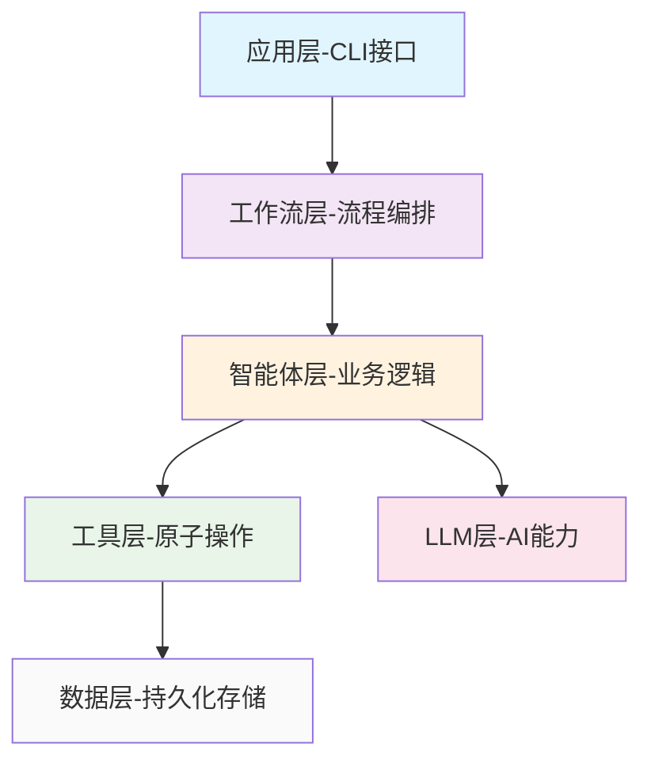
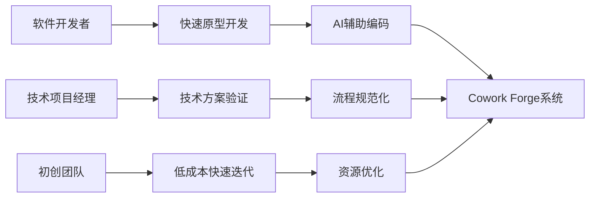
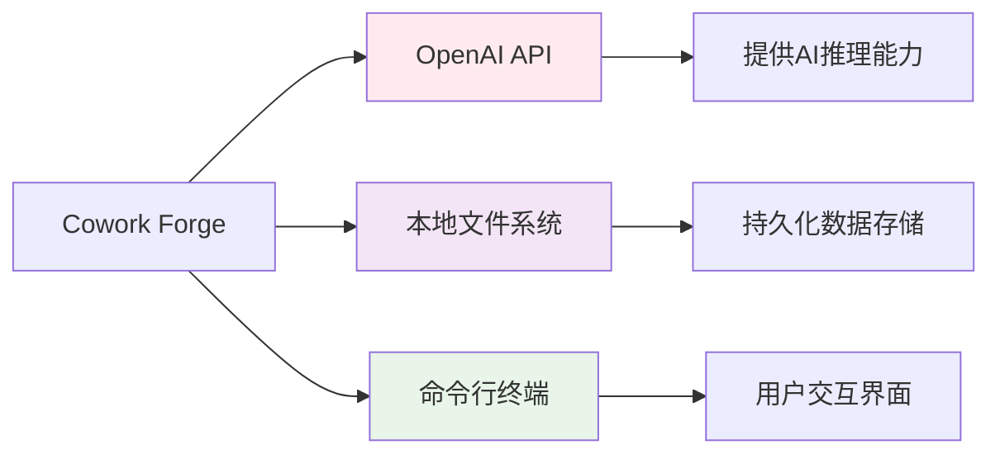
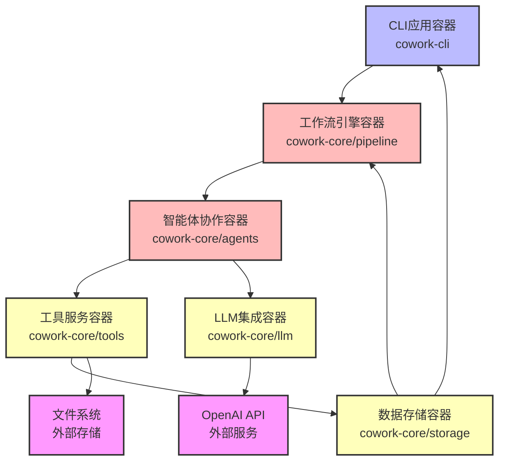
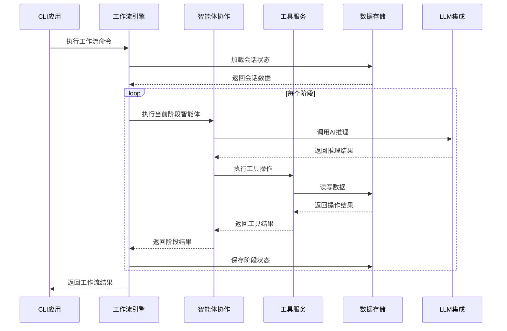
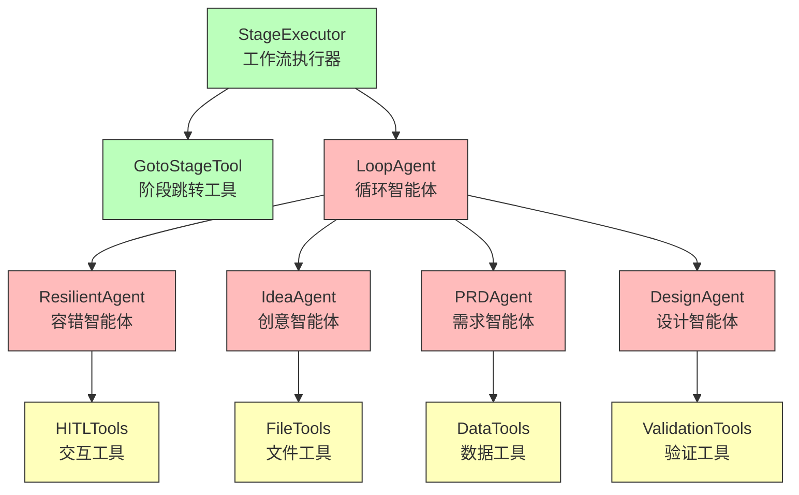
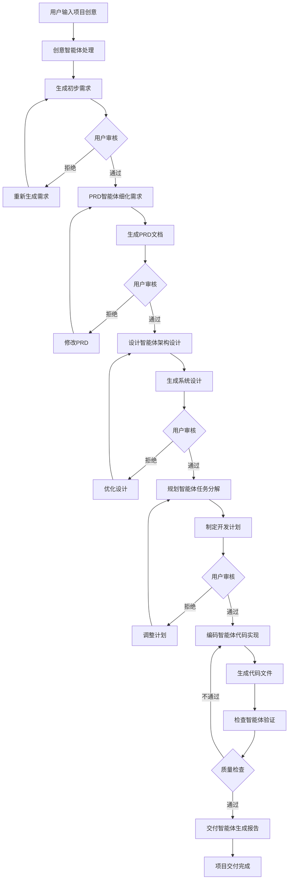
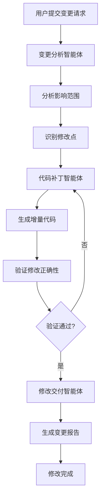
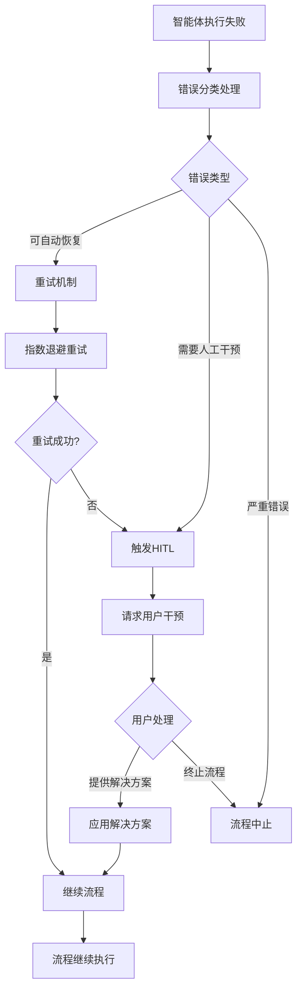
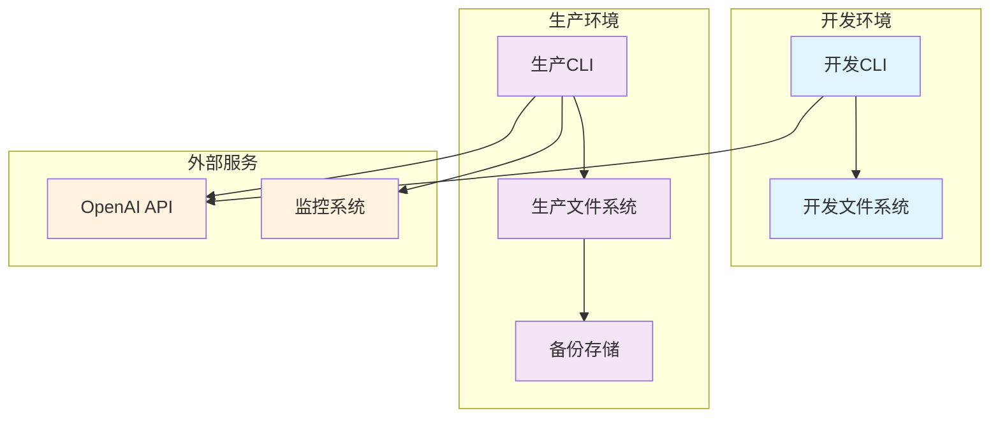

# Cowork Forge 系统架构文档

*文档生成时间：2025年03月29日 14:30 UTC*
*架构版本：v1.0*

## 1. 架构概述

### 1.1 架构设计理念
Cowork Forge 采用**AI驱动的分层架构设计**，核心设计理念是"智能体协作+人类监督"。系统通过多智能体工作流实现软件开发全流程自动化，同时引入人类参与循环（HITL）机制确保开发质量。架构设计遵循以下核心原则：

- **模块化分离**：清晰的层次划分，各层职责单一，便于维护和扩展
- **容错性设计**：多层错误恢复机制，支持流程中断恢复和状态持久化
- **灵活性架构**：支持完整流程、部分流程、恢复流程和修改流程多种工作模式
- **可扩展性**：工具和智能体采用插件化设计，支持功能动态扩展

### 1.2 核心架构模式
系统采用**分层架构**与**Actor-Critic模式**相结合的混合架构：



**关键架构模式**：
- **分层架构模式**：六层架构确保关注点分离
- **Actor-Critic模式**：智能体采用执行-评审循环机制
- **管道过滤器模式**：工作流阶段按顺序执行，支持阶段隔离
- **仓库架构模式**：中心化数据存储管理会话状态

### 1.3 技术栈概览
| 层级 | 技术组件 | 实现技术 | 主要职责 |
|------|----------|----------|----------|
| 应用层 | CLI主程序 | Rust + Clap | 用户交互和命令分发 |
| 工作流层 | StageExecutor | Rust + 异步运行时 | 流程编排和阶段管理 |
| 智能体层 | LoopAgent/ResilientAgent | Rust + LLM集成 | AI智能体协作执行 |
| 工具层 | 工具模块集 | Rust + 特质抽象 | 功能原子操作封装 |
| 数据层 | 存储管理器 | Serde + 文件IO | 数据持久化和会话管理 |
| LLM层 | API客户端 | reqwest + 配置管理 | 大语言模型集成 |

## 2. 系统上下文

### 2.1 系统定位与价值主张
Cowork Forge 定位为**AI驱动的协作式软件开发平台**，核心价值在于通过智能体协作大幅降低软件开发门槛，提高开发效率。系统服务于软件开发生命周期的前中期，从需求分析到代码实现的全流程自动化。

**核心价值指标**：
- 开发效率提升：减少60%重复编码工作
- 质量保证：通过HITL机制确保代码质量
- 流程标准化：规范化软件开发流程

### 2.2 用户角色分析



**核心用户群体**：
1. **软件开发者**
   - 需求：减少重复编码，快速验证技术方案
   - 使用场景：新功能开发、技术原型验证
   - 价值获益：专注业务逻辑，提升编码效率

2. **技术项目经理**
   - 需求：规范化流程，可视化项目状态
   - 使用场景：项目规划、技术方案评审
   - 价值获益：标准化管理，降低沟通成本

3. **初创团队**
   - 需求：降低开发成本，加速产品迭代
   - 使用场景：MVP开发、快速试错
   - 价值获益：资源优化，快速市场验证

### 2.3 外部系统交互



**关键外部依赖**：

1. **OpenAI API**
   - 交互方式：HTTP API调用
   - 职责：提供大语言模型能力，支持智能体决策和代码生成
   - 集成方式：通过LLM集成层的配置管理和速率限制器

2. **本地文件系统**
   - 交互方式：文件读写操作
   - 职责：存储项目文件、配置数据和会话状态
   - 集成方式：通过工具层的文件操作工具集

3. **命令行终端**
   - 交互方式：命令行参数和标准输入输出
   - 职责：提供用户交互界面和命令执行环境
   - 集成方式：通过CLI主程序的命令行解析

### 2.4 系统边界定义
**包含组件**：
- CLI命令行接口和用户交互
- 多智能体工作流引擎
- 会话管理和状态持久化
- 文件操作和验证工具集
- LLM集成和配置管理

**排除组件**：
- 代码编辑器和IDE集成
- 版本控制系统（Git等）
- 持续集成/部署流水线
- 数据库管理系统
- 生产环境部署平台

## 3. 容器视图

### 3.1 领域模块架构



### 3.2 核心领域模块详解

#### 3.2.1 工作流引擎域（核心业务域）
**容器职责**：协调和管理整个AI辅助开发工作流的执行
- **流程执行器**（StageExecutor）：管理阶段隔离的工作流执行
- **阶段管理器**（goto_stage_tool）：处理阶段跳转和恢复

**技术特性**：
```rust
// StageExecutor 核心数据结构
pub struct StageExecutor {
    name: String,
    stages: Vec<(String, Arc<dyn Agent>)>,
    current_stage: usize,
    session: Arc<Session>,
}
```

#### 3.2.2 智能体协作域（核心业务域）
**容器职责**：实现各种AI智能体的定义、配置和执行
- **智能体构建器**：创建不同类型智能体实例
- **指令管理器**：管理智能体提示词模板
- **HITL智能体**：实现人类参与循环机制

**协作模式**：
```rust
// Actor-Critic 循环模式实现
let mut loop_agent = LoopAgent::new("prd_loop", vec![
    Arc::new(prd_actor),    // 执行智能体
    Arc::new(prd_critic)    // 评审智能体
]);
```

#### 3.2.3 工具服务域（工具支持域）
**容器职责**：提供智能体可用的各种功能工具
- **文件操作工具**：安全文件读写和命令执行
- **数据管理工具**：项目数据CRUD操作
- **验证工具集**：数据格式和依赖验证
- **HITL交互工具**：人类参与循环交互

#### 3.2.4 数据存储域（基础设施域）
**容器职责**：项目数据的持久化存储和会话管理
- **会话存储**：管理会话级别数据存储
- **数据模型**：定义核心数据结构和序列化
- **工件工具**：管理交付报告和文档工件

### 3.3 存储设计策略
**数据持久化方案**：
- **会话数据**：JSON格式文件存储，支持状态恢复
- **项目文件**：目录结构管理，版本化存储
- **配置数据**：TOML格式配置文件，环境区分

**数据模型设计**：
```rust
// 核心数据模型示例
pub struct Session {
    pub id: Uuid,
    pub project_name: String,
    pub current_stage: String,
    pub requirements: Vec<Requirement>,
    pub designs: Vec<Design>,
    pub tasks: Vec<Task>,
    pub created_at: DateTime<Utc>,
    pub updated_at: DateTime<Utc>,
}
```

### 3.4 域间模块通信机制



**通信模式分析**：
- **同步调用**：工作流阶段顺序执行，阻塞式等待
- **异步处理**：LLM调用支持异步，避免阻塞主线程
- **数据流驱动**：以会话数据为核心的状态流转
- **错误传播**：分层错误处理，支持恢复机制

## 4. 组件视图

### 4.1 核心功能组件架构



### 4.2 核心组件职责划分

#### 4.2.1 StageExecutor（工作流执行器）
**核心职责**：管理多阶段工作流的执行和状态隔离
```rust
impl StageExecutor {
    pub async fn execute(&self) -> Result<ExecutionResult> {
        for (stage_name, agent) in &self.stages {
            // 阶段前置检查
            self.validate_stage_prerequisites(stage_name)?;
            
            // 执行阶段智能体
            let result = agent.execute(&self.session).await?;
            
            // 阶段后置处理
            self.handle_stage_result(stage_name, result)?;
            
            // 状态持久化
            self.persist_session_state()?;
        }
        Ok(ExecutionResult::Success)
    }
}
```

**关键特性**：
- 阶段隔离：每个阶段的escalate标志独立管理
- 状态持久化：支持执行中断恢复
- 错误处理：阶段级错误隔离和恢复

#### 4.2.2 LoopAgent（循环智能体）
**核心职责**：实现Actor-Critic模式的智能体协作
```rust
pub struct LoopAgent {
    name: String,
    actors: Vec<Arc<dyn Agent>>,
    critics: Vec<Arc<dyn Agent>>,
    max_iterations: usize,
    current_iteration: usize,
}
```

**协作算法**：
1. **Actor阶段**：执行智能体生成内容
2. **Critic阶段**：评审智能体评估质量
3. **迭代控制**：达到质量标准或最大迭代次数退出

#### 4.2.3 ResilientAgent（容错智能体）
**核心职责**：实现错误恢复和人类参与循环
```rust
impl ResilientAgent {
    pub async fn execute_with_recovery(&self, session: &Session) -> Result<AgentResult> {
        match self.primary_agent.execute(session).await {
            Ok(result) => Ok(result),
            Err(error) => {
                // 触发HITL恢复机制
                self.invoke_human_intervention(session, error).await
            }
        }
    }
}
```

### 4.3 技术支持组件

#### 4.3.1 文件操作工具集
**核心组件**：ListFilesTool, ReadFileTool, WriteFileTool, RunCommandTool
```rust
pub struct WriteFileTool {
    session: Arc<Session>,
}

impl Tool for WriteFileTool {
    fn execute(&self, input: &str) -> Result<String> {
        let request: WriteFileRequest = serde_json::from_str(input)?;
        std::fs::write(&request.path, &request.content)?;
        Ok("文件写入成功".to_string())
    }
}
```

#### 4.3.2 数据管理工具集
**核心组件**：需求管理、特性管理、设计管理、任务管理工具
- 数据验证：确保数据格式一致性
- 关系维护：管理业务对象间依赖关系
- 状态同步：保持内存与存储数据一致性

### 4.4 组件交互关系分析

```mermaid
sequenceDiagram
    participant SE as StageExecutor
    participant LA as LoopAgent
    participant Actor as ActorAgent
    participant Critic as CriticAgent
    participant Tool as 工具组件
    participant LLM as LLM服务
    
    SE->>LA: 执行阶段任务
    loop 迭代循环
        LA->>Actor: 生成内容
        Actor->>LLM: AI推理请求
        LLM-->>Actor: 返回生成结果
        Actor->>Tool: 执行工具操作
        Tool-->>Actor: 返回操作结果
        Actor-->>LA: 返回生成内容
        
        LA->>Critic: 评审内容质量
        Critic->>LLM: 质量评估请求
        LLM-->>Critic: 返回评估结果
        Critic-->>LA: 返回评审意见
        
        alt 质量达标
            LA-->>SE: 阶段完成
        else 需要改进
            LA->>Actor: 重新生成
        end
    end
```

## 5. 关键流程

### 5.1 核心功能流程

#### 5.1.1 完整项目开发工作流



**流程阶段详解**：

1. **创意收集阶段**（IdeaAgent）
   - 输入：用户项目描述
   - 处理：需求分析和范围界定
   - 输出：初步需求规格

2. **需求分析阶段**（PRD Loop）
   - 输入：初步需求
   - 处理：详细需求分析和文档化
   - 输出：产品需求文档

3. **系统设计阶段**（Design Loop）
   - 输入：PRD文档
   - 处理：架构设计和技术选型
   - 输出：系统设计文档

4. **任务规划阶段**（Plan Loop）
   - 输入：设计文档
   - 处理：任务分解和依赖分析
   - 输出：开发计划

5. **代码实现阶段**（Coding Loop）
   - 输入：开发计划
   - 处理：代码生成和测试
   - 输出：可执行代码

6. **质量交付阶段**（Delivery Agent）
   - 输入：代码产物
   - 处理：质量验证和文档生成
   - 输出：交付报告

#### 5.1.2 项目修改工作流
**适用场景**：对现有项目进行增量修改


### 5.2 技术处理流程

#### 5.2.1 错误恢复流程


#### 5.2.2 数据持久化流程
```rust
// 数据持久化序列图
sequenceDiagram
    participant Agent as 智能体
    participant Tool as 数据工具
    participant Model as 数据模型
    participant Serializer as 序列化器
    participant FS as 文件系统
    
    Agent->>Tool: 数据更新请求
    Tool->>Model: 验证数据完整性
    Model-->>Tool: 验证结果
    Tool->>Serializer: 序列化数据
    Serializer->>FS: 写入文件
    FS-->>Serializer: 写入确认
    Serializer-->>Tool: 序列化结果
    Tool-->>Agent: 操作完成
```

### 5.3 数据流路径分析

**正向数据流**：
```
用户输入 → CLI解析 → 工作流创建 → 智能体执行 → 工具调用 → 数据存储 → 结果返回
```

**状态数据流**：
```
会话加载 → 阶段判断 → 数据验证 → 智能体上下文 → 工具执行 → 状态更新 → 持久化存储
```

**错误数据流**：
```
异常发生 → 错误捕获 → 分类处理 → 恢复尝试 → HITL干预 → 状态回滚 → 流程继续
```

## 6. 技术实现

### 6.1 核心模块实现细节

#### 6.1.1 工作流引擎实现
**StageExecutor 核心算法**：
```rust
impl StageExecutor {
    pub async fn execute_workflow(&self) -> Result<WorkflowResult> {
        let mut session = self.load_session().await?;
        
        for (stage_index, (stage_name, agent)) in self.stages.iter().enumerate() {
            // 阶段前置条件检查
            if !self.check_stage_prerequisites(&session, stage_name)? {
                return Err(Error::StagePrerequisiteNotMet(stage_name.clone()));
            }
            
            // 执行阶段智能体
            let stage_result = self.execute_stage_agent(agent, &mut session).await?;
            
            // 更新会话状态
            session.current_stage = stage_name.clone();
            session.update_stage_result(stage_index, stage_result);
            
            // 持久化状态
            self.persist_session(&session).await?;
            
            // 检查是否需要提前退出
            if session.should_terminate_early() {
                break;
            }
        }
        
        Ok(WorkflowResult::success())
    }
}
```

#### 6.1.2 智能体协作实现
**LoopAgent 迭代算法**：
```rust
impl LoopAgent {
    async fn execute_loop(&self, session: &Session) -> Result<AgentResult> {
        let mut current_result = None;
        
        for iteration in 0..self.max_iterations {
            // Actor 阶段：内容生成
            let actor_result = self.execute_actors(session, current_result.as_ref()).await?;
            
            // Critic 阶段：质量评估
            let critic_feedback = self.execute_critics(session, &actor_result).await?;
            
            // 评估是否满足退出条件
            if self.is_quality_acceptable(&critic_feedback) {
                return Ok(actor_result);
            }
            
            // 准备下一轮迭代
            current_result = Some(actor_result);
            
            // 应用批评反馈
            self.apply_critic_feedback(critic_feedback);
        }
        
        // 达到最大迭代次数，返回最佳结果
        current_result.ok_or(Error::MaxIterationsReached)
    }
}
```

### 6.2 关键算法设计

#### 6.2.1 阶段隔离算法
```rust
// 阶段边界管理算法
fn manage_stage_boundaries(&self, current_stage: &str, next_stage: &str) -> Result<()> {
    // 验证阶段转换合法性
    if !self.is_valid_transition(current_stage, next_stage) {
        return Err(Error::InvalidStageTransition {
            from: current_stage.to_string(),
            to: next_stage.to_string(),
        });
    }
    
    // 清理前阶段临时状态
    self.cleanup_previous_stage(current_stage);
    
    // 初始化下一阶段环境
    self.initialize_next_stage(next_stage);
    
    Ok(())
}
```

#### 6.2.2 速率限制算法
```rust
// 令牌桶速率限制算法
pub struct RateLimiter {
    bucket: Arc<Mutex<TokenBucket>>,
}

impl RateLimiter {
    pub async fn acquire(&self) -> Result<()> {
        let mut bucket = self.bucket.lock().await;
        
        while bucket.tokens == 0 {
            // 计算需要等待的时间
            let wait_time = bucket.calculate_refill_time();
            tokio::time::sleep(wait_time).await;
            bucket.refill();
        }
        
        bucket.tokens -= 1;
        Ok(())
    }
}
```

### 6.3 数据结构设计

#### 6.3.1 核心数据模型
```rust
// 会话数据结构
#[derive(Debug, Clone, Serialize, Deserialize)]
pub struct Session {
    pub id: Uuid,
    pub project_name: String,
    pub status: SessionStatus,
    pub current_stage: String,
    pub requirements: Vec<Requirement>,
    pub features: Vec<Feature>,
    pub designs: Vec<Design>,
    pub tasks: Vec<Task>,
    pub artifacts: HashMap<String, Artifact>,
    pub feedback_history: Vec<Feedback>,
    pub created_at: DateTime<Utc>,
    pub updated_at: DateTime<Utc>,
    pub metadata: SessionMetadata,
}

// 智能体执行上下文
pub struct AgentContext {
    pub session: Arc<Session>,
    pub tools: Vec<Arc<dyn Tool>>,
    pub llm_client: Arc<dyn LlmClient>,
    pub config: AgentConfig,
}
```

#### 6.3.2 配置数据结构
```rust
// 分层配置管理
#[derive(Debug, Clone, Deserialize)]
pub struct AppConfig {
    pub llm: LlmConfig,
    pub storage: StorageConfig,
    pub agents: HashMap<String, AgentConfig>,
    pub workflows: WorkflowConfig,
    pub security: SecurityConfig,
}

// LLM配置
#[derive(Debug, Clone, Deserialize)]
pub struct LlmConfig {
    pub provider: LlmProvider,
    pub api_key: String,
    pub model: String,
    pub temperature: f32,
    pub max_tokens: usize,
    pub rate_limit: RateLimitConfig,
}
```

### 6.4 性能优化策略

#### 6.4.1 智能体执行优化
- **缓存策略**：LLM响应缓存，减少重复计算
- **批量处理**：多个工具调用合并执行
- **异步并行**：独立阶段支持并行执行

#### 6.4.2 内存管理优化
```rust
// 智能内存管理策略
impl Session {
    pub fn optimize_memory_usage(&mut self) {
        // 清理过期临时数据
        self.artifacts.retain(|_, artifact| !artifact.is_expired());
        
        // 压缩历史数据
        if self.feedback_history.len() > 100 {
            self.feedback_history = self.feedback_history
                .iter()
                .rev()
                .take(50)
                .cloned()
                .collect();
        }
    }
}
```

## 7. 部署架构

### 7.1 运行时环境要求

**最小化部署配置**：
```yaml
runtime:
  language: rust
  version: "1.70+"
  features: ["full"]

dependencies:
  system:
    - "OpenAI API访问权限"
    - "文件系统读写权限"
    - "网络访问权限"
  
  resources:
    memory: "512MB最小内存"
    storage: "1GB可用磁盘空间"
    network: "稳定的互联网连接"
```

**推荐生产环境配置**：
```yaml
production:
  resources:
    memory: "2GB以上"
    storage: "10GB SSD"
    cpu: "2核心以上"
  
  monitoring:
    - "应用性能监控"
    - "LLM API使用监控"
    - "磁盘空间监控"
    - "错误率监控"
```

### 7.2 部署拓扑结构



### 7.3 可扩展性设计

#### 7.3.1 水平扩展策略
**智能体工作池模式**：
```rust
pub struct AgentPool {
    workers: Vec<AgentWorker>,
    task_queue: Arc<Mutex<VecDeque<AgentTask>>>,
}

impl AgentPool {
    pub async fn execute_concurrent(&self, tasks: Vec<AgentTask>) -> Vec<AgentResult> {
        let futures: Vec<_> = tasks.into_iter()
            .map(|task| self.execute_task(task))
            .collect();
        
        future::join_all(futures).await
    }
}
```

#### 7.3.2 配置驱动扩展
```rust
// 动态智能体注册
pub struct AgentRegistry {
    agents: HashMap<String, AgentFactory>,
}

impl AgentRegistry {
    pub fn register_agent(&mut self, name: String, factory: AgentFactory) {
        self.agents.insert(name, factory);
    }
    
    pub fn create_agent(&self, name: &str, config: &AgentConfig) -> Result<Arc<dyn Agent>> {
        let factory = self.agents.get(name)
            .ok_or(Error::AgentNotFound(name.to_string()))?;
        factory.create(config)
    }
}
```

### 7.4 监控与运维

#### 7.4.1 关键监控指标
```rust
// 性能监控数据结构
#[derive(Debug, Clone)]
pub struct PerformanceMetrics {
    pub workflow_execution_time: Duration,
    pub agent_execution_times: HashMap<String, Duration>,
    pub llm_api_calls: usize,
    pub tool_invocations: usize,
    pub error_rates: HashMap<String, f32>,
    pub memory_usage: usize,
    pub storage_usage: usize,
}
```

#### 7.4.2 日志策略
**结构化日志记录**：
```rust
// 分层日志配置
pub fn setup_logging() -> Result<()> {
    tracing_subscriber::fmt()
        .with_max_level(Level::INFO)
        .with_target(true)
        .with_thread_ids(true)
        .json()  // 结构化日志便于分析
        .init();
    
    Ok(())
}
```

**关键日志事件**：
- 工作流开始/结束
- 智能体执行结果
- LLM API调用统计
- 错误和异常事件
- 用户交互事件

## 8. 架构洞察与最佳实践

### 8.1 可扩展性设计要点

**扩展点识别**：
1. **工具扩展**：通过实现Tool特质添加新功能
2. **智能体扩展**：注册新的智能体类型支持新业务场景
3. **工作流扩展**：自定义阶段序列适应不同流程需求

**扩展策略**：
```rust
// 插件化扩展示例
pub trait Plugin {
    fn name(&self) -> &str;
    fn register_tools(&self, registry: &mut ToolRegistry);
    fn register_agents(&self, registry: &mut AgentRegistry);
}
```

### 8.2 性能考量与优化

**性能瓶颈分析**：
1. **LLM API延迟**：通过缓存和批量调用优化
2. **文件IO操作**：异步IO和缓存策略
3. **内存使用**：数据生命周期管理和清理策略

**优化建议**：
- 实现请求去重和结果缓存
- 使用异步文件操作避免阻塞
- 定期清理临时数据和历史记录

### 8.3 安全设计考虑

**安全机制**：
```rust
// 安全工具调用验证
pub struct SecureToolExecutor {
    sandbox: Sandbox,
    validators: Vec<Arc<dyn Validator>>,
}

impl SecureToolExecutor {
    pub async fn execute_safely(&self, tool: Arc<dyn Tool>, input: &str) -> Result<String> {
        // 输入验证
        for validator in &self.validators {
            validator.validate(input)?;
        }
        
        // 沙箱执行
        self.sandbox.execute(tool, input).await
    }
}
```

### 8.4 运维最佳实践

**部署检查清单**：
- [ ] 验证OpenAI API访问权限和配额
- [ ] 配置适当的文件系统权限
- [ ] 设置监控和告警规则
- [ ] 定期备份会话数据
- [ ] 监控LLM API使用成本

**故障排除指南**：
1. **工作流卡顿**：检查阶段依赖和资源限制
2. **LLM调用失败**：验证API密钥和网络连接
3. **数据不一致**：检查文件权限和存储空间

---

*本文档基于系统架构研究分析生成，为Cowork Forge系统的技术架构提供完整参考。架构设计体现了现代AI辅助开发平台的最佳实践，平衡了自动化效率与人工质量控制的需求。*