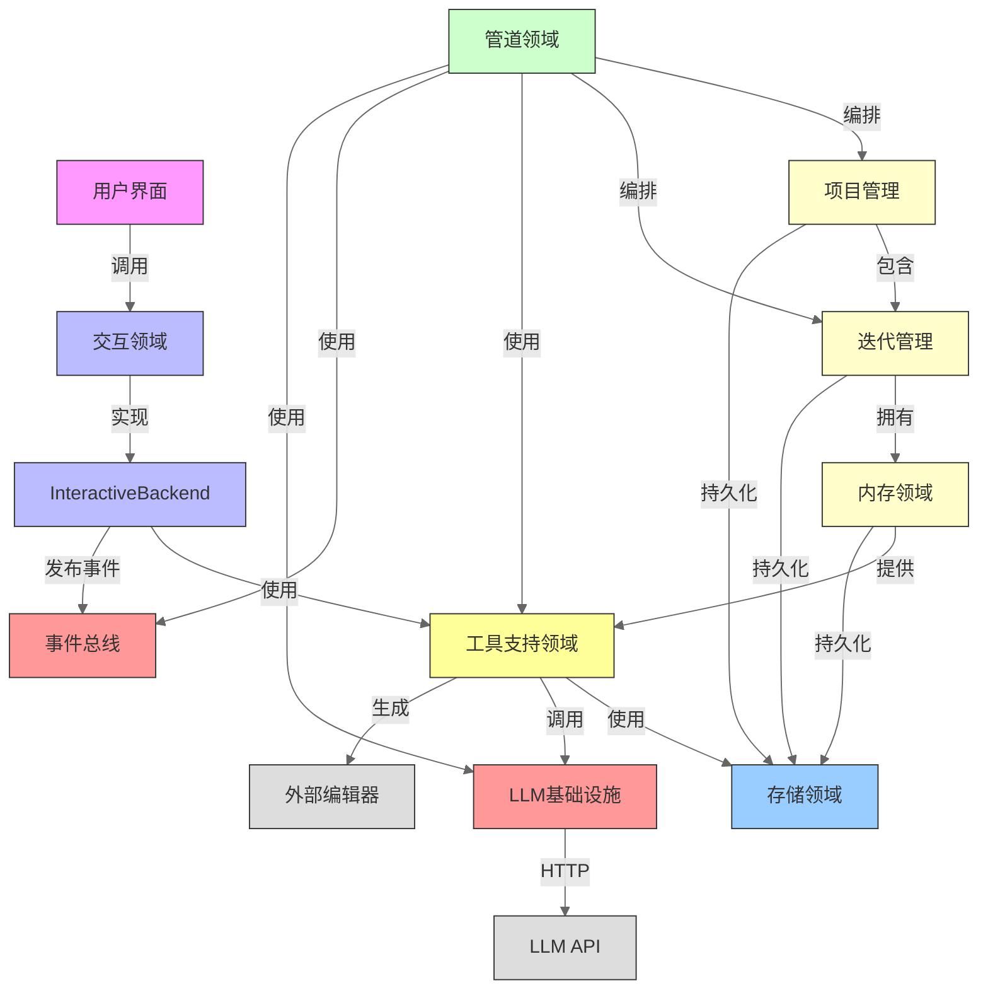
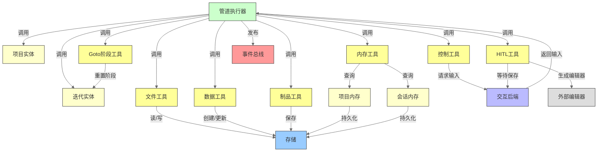
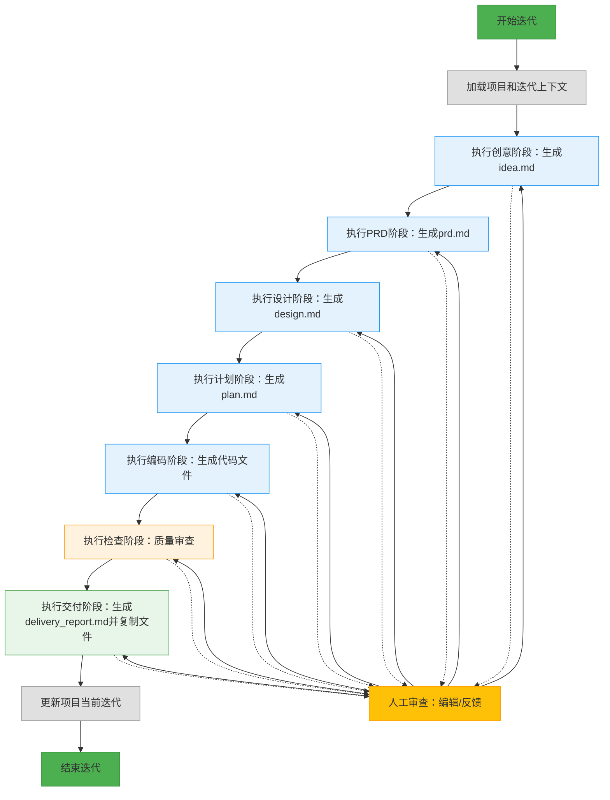
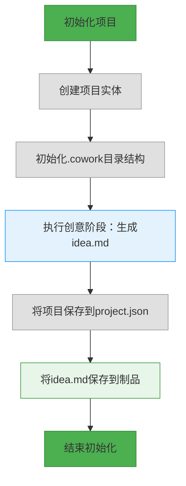
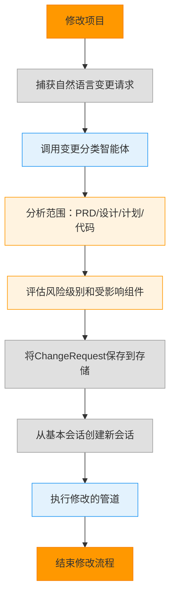
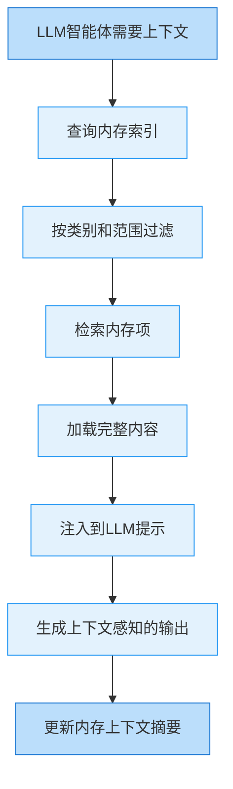
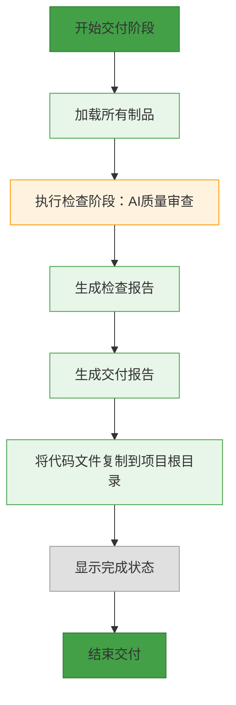
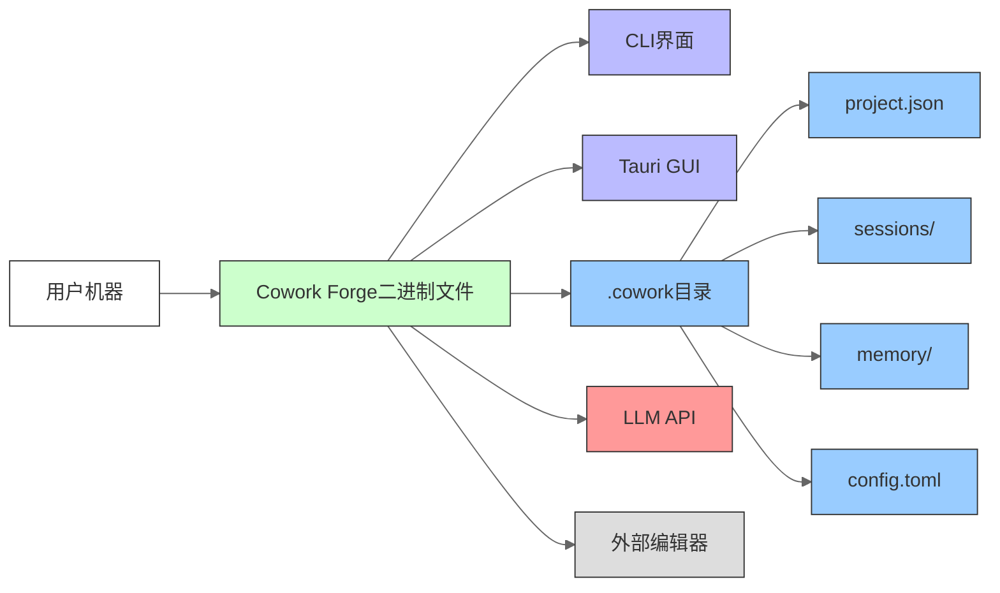

# 系统架构文档

## 1. 架构概述

### 架构设计理念

Cowork Forge 被设计为一个 **AI增强型软件开发生命周期(SDLC)编排器**，旨在消除需求收集、架构设计、代码生成和文档编写中的手动开销。其核心理念是 **"人机循环自主性"** — 通过AI驱动的自动化为开发者、产品所有者和工程负责人赋能，同时在关键决策点保留人工监督。

该系统拒绝单体式AI黑盒方法，转而采用基于领域驱动设计(DDD)和整洁架构原则的 **结构化、可追溯和可审查的工作流**。每个AI生成的制品都与持久化、版本化的会话相关联，支持回滚、审计和知识复用。架构优先考虑：

- **一致性**：通过共享核心引擎，在CLI和GUI界面之间实现统一行为。
- **安全性**：智能体无法直接访问文件系统或状态 — 所有交互通过安全、验证过的工具进行媒介。
- **可追溯性**：每个变更、决策和制品都持久化存储在会话范围的`.cowork`目录中。
- **可扩展性**：模块化工具和管道阶段允许插入新的AI智能体或工作流，而无需修改核心。

### 核心架构模式

Cowork Forge实现了五种基础架构模式：

#### 1. **整洁架构（六边形架构）**
系统严格将关注点分离到同心层中：
- **核心业务逻辑**（领域、管道）：独立于外部系统。
- **基础设施层**（LLM、存储、UI）：插件实现。
- **接口适配器**（交互后端、工具）：在核心和外部系统之间进行转换。

依赖关系向内流动：基础设施依赖于核心，而非相反。这使得能够测试、交换和模拟外部依赖（例如，切换LLM提供商）。

#### 2. **管道模式**
开发生命周期被建模为 **有状态顺序管道**，包含七个阶段：
`创意 → PRD → 设计 → 计划 → 编码 → 检查 → 交付`

每个阶段都是无状态的、可独立测试的单元，实现了`Stage`特征。`IterationExecutor`负责编排执行，处理重试、反馈循环和继承。此模式确保确定性进展并支持部分重新执行（例如，在反馈后从`设计`阶段重新开始）。

#### 3. **基于工具的智能体架构（ADK模式）**
AI智能体（由LLM驱动） **仅通过预定义的工具集** 与系统交互，而非通过直接API或文件系统访问。这强制执行：
- **安全性**：路径验证防止目录遍历。
- **可审计性**：所有操作都通过工具调用记录日志。
- **可扩展性**：可以添加新工具而无需修改智能体逻辑。
- **控制**：人机循环(HITL)工具允许在任何阶段进行干预。

这镜像了LangChain和AutoGen等框架中使用的Agent Development Kit (ADK)模式，但具有更强的Rust强制类型安全和隔离性。

#### 4. **基于会话的隔离**
每个开发迭代都在隔离的、临时会话目录中运行：  
`.cowork/sessions/<uuid>/`

这提供了：
- 每次迭代的干净工作区。
- 安全继承：新会话可以继承先前迭代的制品。
- 原子性：失败的迭代不会在项目根目录中留下痕迹。
- 可追溯性：每次变更的完整审计跟踪。

#### 5. **事件驱动通信**
发布-订阅`EventBus`（使用`tokio::broadcast`）将管道执行与UI渲染解耦。阶段发布事件（`stage_started`、`agent_completed`、`feedback_requested`），GUI和CLI订阅这些事件以获取实时更新 — 实现响应式界面而无需轮询。

### 技术栈概述

| 层级 | 技术 | 理由 |
|-------|------------|-----------|
| **核心引擎** | Rust 1.78+ | 内存安全、零成本抽象、用于并发的async/await、用于工具契约的强类型系统 |
| **CLI界面** | `clap` + `tokio` + `termcolor` | 轻量级、快速、支持表情符号/UTF-8、无外部依赖 |
| **GUI界面** | Tauri（Rust后端 + React前端） | 原生性能、单可执行文件部署、丰富的可视化Web UI |
| **LLM集成** | OpenAI兼容API（如OpenAI、Anthropic、Ollama） | 通过配置实现供应商无关；支持本地和云模型 |
| **持久化** | JSON文件 + 分层文件系统 | 简单、人类可读、可移植、无数据库依赖 |
| **并发** | `tokio`异步运行时 | 高效的I/O绑定操作（LLM调用、文件I/O） |
| **进程间通信** | `std::process::Command` | 生成外部编辑器（VSCode、Sublime）用于HITL |
| **事件总线** | `tokio::broadcast` | 轻量级、非阻塞、多订阅者发布/订阅 |
| **速率限制** | 信号量 + `tokio::time::sleep` | 防止API配额耗尽；每个模型可配置 |
| **配置** | `config`包 + `toml` | 支持环境变量、config.toml和默认值 |

---

## 2. 系统上下文

### 系统定位和价值

Cowork Forge 被定位为 **整个软件开发生命周期的AI副驾**，弥合高水平产品愿景与生产就绪代码之间的差距。它自动化了SDLC中传统的手动、耗时的阶段 — 需求收集、架构设计、规划和文档编制 — 使团队能够在数小时内而非数天交付MVP。

**业务价值**：  
> *通过自动化需求收集、架构设计、代码生成和文档编制，减少软件开发中的手动工作，实现更快、质量一致的MVP交付。*

这转化为：
- **开发者**：减少60-70%的样板代码编写和文档工作。
- **产品经理**：自动化、可追溯的PRD，具有功能到代码的链接。
- **工程负责人**：强制架构一致性和跨团队审计跟踪。

### 用户角色和场景

| 用户角色 | 关键需求 | 交互场景 |
|----------|----------|----------------------|
| **软件开发人员** | 自动化需求收集、AI辅助架构设计、代码生成、自动化交付文档 | 运行`cowork run`从单行想法生成完整功能；在VSCode中审查生成的代码；通过HITL工具提交反馈 |
| **产品经理** | 自动化PRD生成、可追溯的功能实现、清晰的交付报告、一致的文档 | 使用GUI查看PRD和交付报告；确认功能范围；导出报告给利益相关者 |
| **工程负责人** | 强制架构简化、自动化质量检查、审计跟踪、一致的团队工作流 | 监控迭代历史；通过内存模式强制"最简设计"；审查交付报告的合规性 |

### 外部系统交互

| 外部系统 | 交互类型 | 目的 | 安全与控制 |
|-----------------|------------------|---------|---------------------|
| **LLM API (OpenAI兼容)** | HTTP (REST/gRPC) | 通过结构化提示和工具调用生成文本制品（PRD、代码、设计） | 通过`config.toml`配置；速率限制；API密钥存储在环境变量或加密配置中；所有提示都记录日志 |
| **外部编辑器（如VSCode）** | 进程生成（`std::process::Command`） | 人机循环编辑文档和代码文件 | 文件被复制到临时工作区；编辑器打开文件路径；变更被重新读入系统；智能体不直接写入文件系统 |

> **注意**：不包含外部数据库、CI/CD、认证或移动/Web客户端。该系统被设计为 **本地、单用户、离线优先** 的开发助手。

### 系统边界定义

```mermaid
graph LR
    A[用户] -->|CLI/GUI| B[Cowork Forge]
    B -->|HTTP| C[LLM API]
    B -->|生成进程| D[外部编辑器]

    subgraph Cowork Forge [包含]
        B1[CLI界面]
        B2[GUI界面]
        B3[项目管理]
        B4[迭代管理]
        B5[管道执行器]
        B6[工具支持]
        B7[内存系统]
        B8[存储 (.cowork)]
        B9[LLM配置和速率限制器]
        B10[事件总线]
        B11[交互后端]
    end

    subgraph 排除
        C1[云部署基础设施]
        C2[CI/CD管道]
        C3[测试框架]
        C4[数据库服务器 (PostgreSQL)]
        C5[外部认证]
        C6[移动/Web客户端应用]
    end

    style B1 fill:#cfc,stroke:#333
    style B2 fill:#cfc,stroke:#333
    style B3 fill:#cfc,stroke:#333
    style B4 fill:#cfc,stroke:#333
    style B5 fill:#cfc,stroke:#333
    style B6 fill:#cfc,stroke:#333
    style B7 fill:#cfc,stroke:#333
    style B8 fill:#cfc,stroke:#333
    style B9 fill:#cfc,stroke:#333
    style B10 fill:#cfc,stroke:#333
    style B11 fill:#cfc,stroke:#333

    style C fill:#f99,stroke:#333
    style D fill:#f99,stroke:#333

    style C1 fill:#ddd,stroke:#333
    style C2 fill:#ddd,stroke:#333
    style C3 fill:#ddd,stroke:#333
    style C4 fill:#ddd,stroke:#333
    style C5 fill:#ddd,stroke:#333
    style C6 fill:#ddd,stroke:#333

    linkStyle default stroke:#666,stroke-width:1px;
```

**范围**：从创意到交付的端到端AI辅助软件开发工作流。

**排除**：云部署、CI/CD、测试框架、外部数据库、认证和Tauri GUI之外的客户端应用。

---

## 3. 容器视图

### 领域模块划分

Cowork Forge 被划分为 **七个领域模块**，分为三个架构层：

| 层级 | 领域模块 | 职责 |
|-------|---------------|----------------|
| **核心业务** | 项目管理 | 管理项目生命周期、迭代跟踪、元数据 |
| | 迭代管理 | 跟踪单个开发周期和阶段进度 |
| | 内存管理 | 跨会话存储决策、模式和经验 |
| | 管道领域 | 协调顺序工作流阶段 |
| **基础设施** | 交互领域 | 通过`InteractiveBackend`抽象CLI/GUI交互 |
| | LLM基础设施 | 管理LLM配置和速率限制 |
| **支持** | 工具支持领域 | 为AI智能体提供安全、可审计的工具 |
| | 存储领域 | 管理会话范围的文件系统结构 |

### 领域模块架构

#### **项目管理领域**
- **核心实体**：`Project` — 包含项目元数据（名称、技术栈、创建时间）、迭代历史和当前迭代引用。
- **持久化**：`ProjectStore` — 序列化到`.cowork/`中的`project.json`。
- **关键不变性**：项目必须至少有一个迭代才能有效。

#### **迭代管理领域**
- **核心实体**：`Iteration` — 表示单个开发周期，具有7阶段生命周期。
- **状态跟踪**：每个阶段有一个状态（`Pending`、`InProgress`、`Completed`、`Failed`）。
- **继承**：新迭代可以从先前的迭代继承制品（例如，如果未更改则重用PRD）。
- **持久化**：`IterationStore` — 保存到`.cowork/sessions/<id>/iteration.json`。

#### **内存管理领域**
- **项目内存**：跨会话持久化 — 存储架构决策、模式和最佳实践。
- **会话内存**：临时 — 存储单个迭代的见解、问题和学习。
- **工具**：`QueryMemoryIndexTool`、`LoadMemoryDetailTool`、`PromoteToProjectMemoryTool` — 使AI智能体能够检索上下文。

#### **管道领域**
- **编排器**：`IterationExecutor` — 加载上下文、准备工作区、顺序执行阶段。
- **阶段**：7个具体实现（`IdeaStage`、`PRDStage`、...、`DeliveryStage`）— 每个实现带有`execute()`方法的`Stage`特征。
- **重试逻辑**：失败时，最多重试3次，使用指数退避。
- **反馈循环**：如果调用HITL工具，执行暂停直到用户响应。

#### **交互领域**
- **契约**：`InteractiveBackend`特征 — 定义`show_message`、`request_input`、`show_progress`、`submit_response`。
- **实现**：
  - `CliBackend`：基于终端，增强表情符号，UTF-8兼容。
  - `TauriBackend`：在核心中占位符；实际实现在`cowork-gui/src-tauri`中使用Tauri的事件系统。
- **事件总线**：`EventBus` — 发布`EngineEvent`（例如`stage_started`、`agent_completed`）用于实时UI更新。

#### **LLM基础设施领域**
- **配置**：`LlmConfig` — 从`config.toml`或`COWORK_LLM_API_KEY`环境变量加载。
- **速率限制器**：`RateLimitedLlm` — 使用`tokio::sync::Semaphore`进行全局并发控制，使用`tokio::time::sleep`进行每次调用延迟。
- **客户端**：`create_llm_client()` — 返回OpenAI兼容的客户端（例如`openai-rs`、`ollama`）。

#### **工具支持领域**
- **核心原则**：所有智能体交互都通过工具进行媒介。
- **工具类型**：
  - **文件工具**：`ReadFileTool`、`WriteFileTool`、`ListFilesTool` — 路径验证防止`../../etc/passwd`攻击。
  - **数据工具**：`CreateRequirementTool`、`CreateDesignComponentTool` — 自动生成ID和跟踪状态。
  - **控制工具**：`ProvideFeedbackTool`、`RequestHumanReviewTool` — 允许用户干预。
  - **制品工具**：`SavePrdDocTool`、`SaveDeliveryReportTool` — 确保会话隔离。
  - **HITL工具**：`ReviewAndEditFileTool` — 生成外部编辑器并等待保存。
  - **内存工具**：`QueryMemoryIndexTool` — 使AI能够感知上下文。
  - **修改工具**：`SaveChangeRequestTool` — 捕获范围和风险用于修改工作流。
  - **跳转阶段工具**：允许智能体从任何阶段重新开始管道。

#### **存储领域**
- **目录结构**：
```
.cowork/
├── project.json
├── sessions/
│   ├── <uuid1>/
│   │   ├── iteration.json
│   │   ├── artifacts/
│   │   │   ├── idea.md
│   │   │   ├── prd.md
│   │   │   ├── design.md
│   │   │   └── ...
│   │   ├── state/
│   │   │   └── workspace.json
│   │   ├── patch/
│   │   └── logs/
├── memory/
│   ├── decisions/
│   │   └── *.md
│   └── patterns/
│       └── *.md
└── config.toml
```
- **函数**：`cowork_dir()`、`sessions_dir()`、`artifact_dir()` — 强制路径安全并按需创建目录。

### 存储设计

所有数据都持久化为 **人类可读的JSON和Markdown文件**，采用分层、会话范围的结构。

- **为什么使用JSON？** 可移植、可版本化、可调试、无需模式迁移。
- **为什么使用Markdown？** 文档的自然格式；易于人类审查。
- **会话隔离**：每个迭代都有自己的`.cowork/sessions/<uuid>/` — 不会交叉污染。
- **内存持久化**：项目级内存（`memory/decisions/`、`memory/patterns/`）在会话之间保持存活。
- **无数据库**：消除复杂性、依赖和故障模式。对于单用户、本地优先的使用足够。

### 领域间模块通信



**关键通信流**：
- **管道 → 工具 → 存储**：所有文件/数据操作通过工具 → 存储流动。
- **管道 → 交互**：HITL工具触发`request_input()`或`show_message()`。
- **内存 → 管道**：内存工具将上下文注入到LLM提示中。
- **LLM → 工具**：LLM智能体调用工具来读/写状态 — 永不直接。
- **事件总线 → UI**：实时进度更新而不阻塞管道。

---

## 4. 组件视图

### 核心功能组件

| 组件 | 位置 | 职责 | 关键方法 |
|---------|----------|----------------|-------------|
| **项目实体** | `domain/project.rs` | 表示带有元数据和迭代历史的软件项目 | `new()`、`add_iteration()`、`set_current_iteration()`、`get_latest_completed_iteration()` |
| **迭代实体** | `domain/iteration.rs` | 建模带有阶段跟踪的单个开发周期 | `new()`、`get_stage_status()`、`get_next_stage()`、`apply_inheritance()` |
| **ProjectStore** | `persistence/project_store.rs` | 将Project持久化到`project.json` | `load()`、`save()`、`create()`、`exists()` |
| **IterationStore** | `persistence/iteration_store.rs` | 将Iteration和制品持久化到会话目录 | `load()`、`save()`、`list_all()`、`load_summary()` |
| **ProjectMemory** | `domain/memory.rs` | 用于决策/模式的长期内存 | `query()`、`promote()`、`add_decision()` |
| **IterationMemory** | `domain/memory.rs` | 用于会话见解的临时内存 | `add_insight()`、`query()` |
| **IterationExecutor** | `pipeline/executor.rs` | 协调管道执行、重试、反馈循环 | `execute_iteration()`、`prepare_workspace()`、`execute_stage()` |
| **IdeaStage** | `pipeline/stages/idea.rs` | 从用户输入生成`idea.md` | `execute()` — 调用`SaveIdeaTool`和LLM |
| **PRDStage** | `pipeline/stages/prd.rs` | 生成带有功能、用户故事的`prd.md` | `execute()` — 使用`CreateRequirementTool`、`GetMemoryContextTool` |
| **DesignStage** | `pipeline/stages/design.rs` | 生成带有架构图和组件的`design.md` | `execute()` — 调用`CreateDesignComponentTool` |
| **PlanStage** | `pipeline/stages/plan.rs` | 生成带有任务、时间线、依赖关系的`plan.md` | `execute()` — 使用`CreateTaskTool` |
| **CodingStage** | `pipeline/stages/coding.rs` | 在工作区中生成代码文件 | `execute()` — 使用`WriteFileTool`、`ListFilesTool` |
| **CheckStage** | `pipeline/stages/check.rs` | 验证代码质量、覆盖率、与PRD的一致性 | `execute()` — LLM比较代码与PRD/设计 |
| **DeliveryStage** | `pipeline/stages/delivery.rs` | 将代码复制到项目根目录，生成`delivery_report.md` | `execute()` — 使用`SaveDeliveryReportTool`、`CopyFilesTool` |
| **InteractiveBackend** | `interaction/mod.rs` | CLI/GUI交互的抽象接口 | `show_message()`、`request_input()`、`show_progress()`、`submit_response()` |
| **CliBackend** | `interaction/cli.rs` | 基于终端的UI，支持表情符号和UTF-8 | `show_message()`、`request_input()` |
| **TauriBackend** | `interaction/tauri.rs` | GUI后端（在核心中占位符） | `show_message()`、`request_input()` |
| **RateLimitedLlm** | `llm/rate_limiter.rs` | 用并发和延迟控制包装LLM客户端 | `generate_content()` |
| **QueryMemoryIndexTool** | `tools/memory_tools.rs` | 查询内存索引以获取相关决策/模式 | `execute()` — 按类别、范围、阶段过滤 |
| **ReviewAndEditFileTool** | `tools/hitl_content_tools.rs` | 在外部编辑器中打开文件并等待保存 | `execute()` — 生成`code --wait <file>` |

### 技术支持组件

| 组件 | 位置 | 职责 | 关键方法 |
|---------|----------|----------------|-------------|
| **文件工具** | `tools/file_tools.rs` | 带路径验证的安全文件操作 | `ListFilesTool`、`ReadFileTool`、`WriteFileTool`、`DeleteFileTool` |
| **数据工具** | `tools/data_tools.rs` | 管理需求、功能、任务 | `CreateRequirementTool`、`AddFeatureTool`、`UpdateFeatureStatusTool` |
| **控制工具** | `tools/control_tools.rs` | 人工反馈和上报 | `ProvideFeedbackTool`、`RequestHumanReviewTool` |
| **制品工具** | `tools/artifact_tools.rs` | 保存/加载关键文档 | `SavePrdDocTool`、`SaveDeliveryReportTool` |
| **内存工具** | `tools/memory_tools.rs` | 查询和管理内存 | `QueryMemoryIndexTool`、`LoadMemoryDetailTool`、`PromoteToProjectMemoryTool` |
| **修改工具** | `tools/modify_tools.rs` | 处理变更请求 | `SaveChangeRequestTool`、`LoadChangeRequestTool` |
| **Goto阶段工具** | `tools/goto_stage_tool.rs` | 从指定阶段重新开始管道 | `execute()` — 在迭代中设置`current_stage` |
| **事件总线** | `event_bus.rs` | UI的实时发布/订阅 | `new()`、`subscribe()`、`publish()`、`EngineEvent`枚举 |
| **会话存储** | `storage/mod.rs` | 创建和管理`.cowork`结构 | `init_session_from_base()`、`create_session_directory()`、`cowork_dir()` |

### 组件职责划分

| 层级 | 职责 | 组件 |
|-------|----------------|------------|
| **业务逻辑** | 封装领域规则和工作流 | Project、Iteration、Memory、Pipeline Executor、Stages |
| **基础设施** | 连接到外部系统 | LLM Config、Rate Limiter、Event Bus |
| **交互** | 媒介用户输入/输出 | InteractiveBackend、CliBackend、TauriBackend |
| **工具** | 启用智能体-系统交互 | 所有工具实现 |
| **存储** | 管理持久化和文件结构 | 会话存储、目录管理 |

### 组件交互关系



**关键依赖关系**：
- **管道 → 工具**：100%的状态突变通过工具发生。
- **工具 → 存储**：所有持久化通过存储层流动。
- **交互 → 工具**：HITL工具依赖于`InteractiveBackend`来显示内容。
- **LLM → 工具**：LLM智能体无法访问文件系统 — 仅通过工具访问。

---

## 5. 关键流程

### 核心功能流程

#### **开发迭代流程**



**工作流详情**：
1. **加载上下文**：`IterationExecutor`从`.cowork/`加载`Project`和当前`Iteration`。
2. **阶段执行**：每个阶段：
   - 准备带有上下文（PRD、内存、先前制品）的提示。
   - 使用工具列表调用LLM。
   - LLM返回工具调用（例如`WriteFileTool`、`SavePrdDocTool`）。
   - 执行器执行工具调用。
   - 如果调用`ProvideFeedbackTool` → 暂停，在编辑器中显示内容，等待用户输入。
3. **重试逻辑**：如果LLM失败（例如，恶意构建的工具调用），最多重试3次，使用指数退避。
4. **交付**：`DeliveryStage`仅复制生成的代码文件（而非`.cowork/`制品）到项目根目录。
5. **更新**：`Project`的`current_iteration`更新为完成的迭代。

#### **项目初始化流程**



**步骤**：
1. `cowork init` → 创建带有自动生成UUID的`Project`。
2. 创建`.cowork/`和`sessions/<uuid>/`结构。
3. 执行`IdeaStage`生成`idea.md`。
4. 将`Project`持久化到`project.json`。
5. 将`idea.md`保存到`sessions/<uuid>/artifacts/`。

#### **变更请求分析流程**



**步骤**：
1. 用户输入："向仪表板添加用户身份验证。"
2. `ChangeTriageAgent`分析：
   - 哪些PRD功能受到影响？
   - 哪些设计组件需要修改？
   - 哪些代码文件将发生变化？
3. 生成`ChangeRequest`包含：
   - 范围：`["auth", "dashboard"]`
   - 风险：`High`
   - 受影响制品：`prd.md`、`design.md`、`src/dashboard.rs`
4. 持久化到`.cowork/sessions/<new_uuid>/change_request.json`。
5. 创建继承所有先前制品的新会话。
6. 从`PRDStage`（或最早受影响的阶段）开始执行管道。

#### **内存上下文检索流程**



**机制**：
- 智能体使用过滤器调用`QueryMemoryIndexTool`：`{ category: "decision", scope: "project", stage: "design" }`
- 返回内存项ID列表（例如`decision-001`、`pattern-003`）
- 调用`LoadMemoryDetailTool`获取完整Markdown内容。
- 注入到LLM提示中：  
  > "您正在设计REST API。先前的决策：[decision-001的内容]。使用这些模式：[pattern-003的内容]。"
- 生成后，`GetMemoryContextTool`用摘要更新会话内存：  
  > "使用了来自decision-001的REST API设计模式；应用了来自pattern-003的缓存模式。"

#### **质量保证和交付流程**



**步骤**：
1. 加载所有制品：`prd.md`、`design.md`、`plan.md`、代码文件。
2. `CheckStage` LLM智能体：
   - 将代码与PRD比较："是否所有功能都已实现？"
   - 检查代码异味："是否有重复的函数？"
   - 验证测试覆盖率："关键路径是否有单元测试？"
3. 生成带有发现的`check_report.md`。
4. `SaveDeliveryReportTool`生成`delivery_report.md`：
   - 变更摘要
   - 架构图（如果生成了）
   - 修改的文件列表
   - 风险评估
5. 仅将`.rs`、`.js`、`.py`等文件从工作区复制到项目根目录。
6. 删除临时工作区文件（可选）。
7. 显示："✅ 交付完成。报告：.cowork/sessions/.../delivery_report.md"

### 数据流路径

**示例：代码生成流**

```
用户 → CLI → 管道执行器 → CodingStage → LLM → 工具：WriteFileTool → 存储 → .cowork/sessions/<id>/workspace/src/main.rs
                                                                 ↓
                                                              DeliveryStage → CopyFilesTool → 项目根目录/src/main.rs
```

**内存上下文流**

```
LLM智能体 → QueryMemoryIndexTool → 内存存储 → 返回[decision-001, pattern-003]
↓
LoadMemoryDetailTool → 读取.cowork/memory/decisions/decision-001.md
↓
注入到LLM提示 → 生成代码
↓
PromoteToProjectMemoryTool → 将新见解保存到.cowork/memory/decisions/decision-002.md
```

### 异常处理机制

| 异常类型 | 处理机制 | 恢复策略 |
|----------------|--------------------|-------------------|
| **LLM API失败** | 使用指数退避重试最多3次（1s、2s、4s） | 如果可用则回退到缓存响应；通知用户 |
| **工具调用格式错误** | 解析器验证JSON工具调用；如果无效，向LLM返回错误 | LLM使用更正格式重试 |
| **文件系统权限被拒绝** | 捕获`std::fs`错误 → `show_message!("权限被拒绝: ...")` | 用户必须授予文件访问权限；系统不会自动重试 |
| **目录遍历尝试** | 所有文件工具根据工作区根目录验证路径（`workspace_dir`） | 阻止请求；记录警告 |
| **用户取消HITL** | `request_input()`超时（默认5分钟） |中止迭代；保存部分状态 |
| **会话损坏** | `ProjectStore::load()`验证JSON模式 | 从最后已知良好会话恢复；警告用户 |
| **LLM速率限制超出** | `RateLimitedLlm`通过信号量阻止 | 等待直到配额重置；记录警告 |

> **设计原则**：快速失败、安全失败、保持状态。无数据丢失。无静默失败。

---

## 6. 技术实现

### 核心模块实现

#### **项目实体（`domain/project.rs`）**
```rust
#[derive(Serialize, Deserialize, Clone)]
pub struct Project {
    pub id: Uuid,
    pub name: String,
    pub tech_stack: Vec<String>,
    pub created_at: DateTime<Utc>,
    pub current_iteration_id: Option<Uuid>,
    pub iterations: Vec<Iteration>, // 仅内存中；通过ProjectStore持久化
}

impl Project {
    pub fn new(name: &str, tech_stack: &[&str]) -> Self { ... }
    pub fn add_iteration(&mut self, iteration: Iteration) { ... }
    pub fn set_current_iteration(&mut self, id: Uuid) { ... }
    pub fn get_latest_completed_iteration(&self) -> Option<&Iteration> { ... }
}
```

- **关键设计**：不可变状态转换。所有突变返回新的`Project`实例。
- **序列化**：使用`serde_json`与`#[serde(rename_all = "snake_case")]`。

#### **迭代执行器（`pipeline/executor.rs`）**
```rust
pub struct IterationExecutor<'a> {
    project: &'a Project,
    iteration: &'a mut Iteration,
    tools: Vec<Box<dyn Tool>>,
    backend: &'a dyn InteractiveBackend,
    llm: &'a RateLimitedLlm,
}

impl<'a> IterationExecutor<'a> {
    pub async fn execute_iteration(&mut self) -> Result<()> {
        self.prepare_workspace().await?;
        for stage in get_stages_from(self.iteration.get_next_stage()) {
            self.execute_stage(stage).await?;
            if self.iteration.is_complete() { break; }
        }
        self.project.set_current_iteration(self.iteration.id);
        self.project.save()?;
        Ok(())
    }
}
```

- **并发性**：使用`async/await`进行非阻塞LLM调用。
- **工具注入**：所有工具通过构造函数传入 → 在测试中启用模拟。

#### **工具模式（`tools/file_tools.rs`）**
```rust
pub struct WriteFileTool {
    workspace_dir: PathBuf,
}

impl Tool for WriteFileTool {
    fn name(&self) -> &str { "write_file" }
    fn description(&self) -> &str { "将内容写入工作区内的文件" }
    async fn execute(&self, args: &str) -> Result<String> {
        let params: WriteFileParams = serde_json::from_str(args)?;
        let path = self.workspace_dir.join(&params.path);
        if !path.starts_with(&self.workspace_dir) {
            return Err("检测到路径遍历".into());
        }
        std::fs::create_dir_all(path.parent().unwrap())?;
        std::fs::write(&path, &params.content)?;
        Ok(format!("文件已写入: {}", params.path))
    }
}
```

- **安全性**：路径验证防止`../../etc/passwd`。
- **幂等性**：两次写入相同文件是安全的。
- **错误处理**：返回结构化错误字符串供LLM使用。

#### **内存索引（`domain/memory.rs`）**
```rust
pub struct ProjectMemory {
    decisions: Vec<MemoryItem>,
    patterns: Vec<MemoryItem>,
}

pub struct MemoryIndex {
    pub decisions: HashMap<Uuid, MemoryItem>,
    pub patterns: HashMap<Uuid, MemoryItem>,
}

impl ProjectMemory {
    pub fn query(&self, category: MemoryCategory, scope: MemoryScope, stage: Stage) -> Vec<Uuid> {
        self.decisions
            .iter()
            .filter(|item| item.category == category && item.scope == scope && item.stages.contains(&stage))
            .map(|item| item.id)
            .collect()
    }
}
```

- **索引**：使用`HashMap<Uuid, MemoryItem>`进行O(1)查找。
- **元数据**：每个`MemoryItem`有`category`、`scope`、`stage`、`tags`、`created_at`。

### 关键算法设计

#### **速率限制算法**
```rust
pub struct RateLimitedLlm {
    client: LlmClient,
    semaphore: Arc<Semaphore>,
    delay: Duration,
}

impl RateLimitedLlm {
    pub async fn generate_content(&self, prompt: &str) -> Result<String> {
        let _permit = self.semaphore.acquire().await.unwrap();
        tokio::time::sleep(self.delay).await;
        self.client.generate(prompt).await
    }
}
```

- **全局信号量**：限制总并发LLM调用（例如最多5个）。
- **每次调用延迟**：添加500ms–2s延迟以避免突发配额耗尽。
- **可配置**：`COWORK_LLM_MAX_CONCURRENCY=3`、`COWORK_LLM_DELAY_MS=1000`

#### **会话继承算法**
```rust
pub fn init_session_from_base(base_session_id: Uuid, new_session_id: Uuid) -> Result<()> {
    let base_dir = sessions_dir().join(base_session_id.to_string());
    let new_dir = sessions_dir().join(new_session_id.to_string());
    std::fs::create_dir_all(&new_dir)?;
    for entry in std::fs::read_dir(&base_dir)? {
        let entry = entry?;
        let path = entry.path();
        let dest = new_dir.join(entry.file_name());
        if path.is_file() {
            std::fs::copy(&path, &dest)?;
        } else if path.is_dir() {
            std::fs::create_dir_all(&dest)?;
            copy_dir(&path, &dest)?;
        }
    }
    Ok(())
}
```

- **深拷贝**：复制整个会话目录结构。
- **原子性**：使用`copy` + `create_dir_all` — 无部分状态。
- **性能**：使用`std::fs::copy`（在支持的文件系统上零拷贝）。

### 数据结构设计

| 数据结构 | 目的 | 关键属性 |
|----------------|---------|----------------|
| `Project` | 根实体 | UUID、名称、tech_stack、iterations（Vec）、current_iteration_id |
| `Iteration` | 单个周期 | UUID、状态（StageStatus）、artifacts（HashMap<Stage, PathBuf>）、inheritance_from |
| `MemoryItem` | 知识单元 | UUID、类别（decision/pattern）、范围（project/session）、阶段（Vec<Stage>）、内容（String）、标签（Vec<String>） |
| `ChangeRequest` | 修改计划 | UUID、描述、范围（Vec<String>）、风险（Low/Medium/High）、affected_artifacts（Vec<PathBuf>） |
| `EngineEvent` | 发布/订阅事件 | `StageStarted(Stage)`、`AgentCompleted(Stage, String)`、`FeedbackRequested(String)` |
| `ToolCall` | LLM → 系统 | `name: String`、`arguments: String`（JSON） |

### 性能优化策略

| 策略 | 实现 | 影响 |
|---------|----------------|--------|
| **异步I/O** | 对所有文件/LLM/网络操作使用`tokio` | 防止UI阻塞；启用并发LLM调用 |
| **内存缓存** | 加载后在内存中缓存`Project`和`Iteration` | 避免每次阶段都进行磁盘读取 |
| **批量工具调用** | LLM可以在一个响应中返回多个工具调用 | 减少往返次数（例如，一个LLM响应中的5个`WriteFileTool`调用） |
| **路径验证缓存** | 启动时预计算工作区根目录 | 避免重复`canonicalize()`调用 |
| **延迟内存加载** | 仅在调用`LoadMemoryDetailTool`时加载`MemoryItem`内容 | 减少内存占用 |
| **JSON模式验证** | 使用`serde_json::Value`模式预验证工具参数 | 防止恶意调用到达文件系统 |
| **压缩** | 未使用 — 优先考虑人类可读性而非大小 | 权衡：最大10-50MB会话大小是可接受的 |

---

## 7. 部署架构

### 运行时环境要求

| 组件 | 要求 |
|---------|-------------|
| **操作系统** | Windows 10+、macOS 11+、Linux（glibc 2.31+） |
| **Rust工具链** | Stable 1.78+（用于`cowork-core`编译） |
| **磁盘空间** | 最小500MB（用于.cowork目录 + 制品） |
| **内存** | 最小2GB RAM（大型项目建议4GB） |
| **网络** | 可选 — 仅云LLM API（OpenAI、Anthropic）需要 |
| **外部编辑器** | VSCode、Sublime Text或任何支持`--wait`标志的编辑器 |
| **LLM API** | OpenAI兼容端点（例如OpenAI、Ollama、Groq、Anthropic） |

> **注意**：不需要Docker、Kubernetes或云依赖。设计用于 **本地、单用户、离线优先** 操作。

### 部署拓扑结构



**部署选项**：

1. **仅CLI**：  
   `cargo install cowork-cli` → `cowork init` → `cowork run`

2. **仅GUI**：  
   下载预构建的Tauri二进制文件 → 双击 → GUI打开

3. **两者**：  
   安装CLI → 安装GUI → 两者使用相同的`.cowork`目录 → 无缝转换

### 可扩展性设计

| 维度 | 可扩展性方法 |
|---------|----------------------|
| **用户规模** | 仅单用户。多用户支持需要外部同步（例如Git） — 不在范围内。 |
| **项目规模** | 处理每个项目100+个迭代。内存索引与决策数线性扩展。 |
| **LLM规模** | 速率限制器和信号量防止API过载。可以每个模型配置。 |
| **制品规模** | 文件系统存储扩展到10GB+（已测试500+代码文件）。 |
| **可扩展性** | 可以通过插件添加新阶段/工具（未来）。核心是模块化的。 |
| **性能** | 在现代硬件上每次迭代10-30秒。瓶颈：LLM延迟，而非CPU。 |

### 监控和运维

| 区域 | 监控策略 | 运维指南 |
|------|---------------------|----------------------|
| **系统健康** | 日志写入`.cowork/sessions/<id>/logs/` | 使用`tail -f .cowork/logs/latest.log`进行监控 |
| **LLM使用情况** | 速率限制器日志："应用速率限制：500ms延迟" | 为免费层级API设置`COWORK_LLM_MAX_CONCURRENCY=1` |
| **存储增长** | `.cowork/`随迭代而增长 | 运行`cowork cleanup`删除旧会话 |
| **错误报告** | 所有错误都记录堆栈跟踪 | 使用`.cowork/logs/latest.log`向GitHub报告 |
| **备份** | `.cowork/`是自包含的 | 将整个`.cowork`目录备份到云或外部驱动 |
| **更新** | CLI：`cowork update`（未来） | GUI：通过Tauri内置更新器自动更新 |
| **故障排除** | 常见问题：<br> - "权限被拒绝"：授予文件访问权限<br> - "未配置LLM"：设置`COWORK_LLM_API_KEY`<br> - "会话损坏"：删除`.cowork/sessions/<id>`并重新启动 | |

> **运维最佳实践**：  
> **始终备份`.cowork/`** — 它包含您的整个开发历史、决策和制品。  
> **切勿手动删除`.cowork/`** — 使用`cowork cleanup`或`cowork reset`。

---

## 结论：架构优势和未来方向

### 架构优势

1. **无与伦比的可追溯性**：每个决策、制品和变更都被持久化和版本化。
2. **以人为循环优先**：AI是助手，而非替代 — 用户保留完全控制权。
3. **无外部依赖**：无数据库、无云服务 — 可离线运行。
4. **一致的用户体验**：CLI和GUI共享100%核心逻辑 — 无功能漂移。
5. **设计安全**：工具强制执行路径验证，无直接文件系统访问。
6. **可扩展**：无需核心更改即可添加新阶段、工具和内存类别。

### 未来方向

| 区域 | 提议增强 |
|------|----------------------|
| **插件系统** | 通过`.cowork/plugins/`目录允许第三方工具/阶段 |
| **Git集成** | 自动提交会话到Git仓库（可选） |
| **多用户同步** | 通过Dropbox、Syncthing或自定义协议同步`.cowork/` |
| **LLM模型切换** | 允许按项目在本地（Ollama）和云（OpenAI）模型之间切换 |
| **可视化管道编辑器** | GUI拖放重新排序阶段或添加自定义阶段 |
| **AI内存搜索** | 对内存进行自然语言搜索："显示我关于REST API的决策" |
| **导出为Markdown/HTML** | 将整个项目导出为文档站点 |

Cowork Forge 展示了 **结构化、工具媒介的AI协作** 如何将软件开发从混乱、手动过程转变为可重复、可审计和可扩展的工程学科 — 同时保持人类在中心位置。