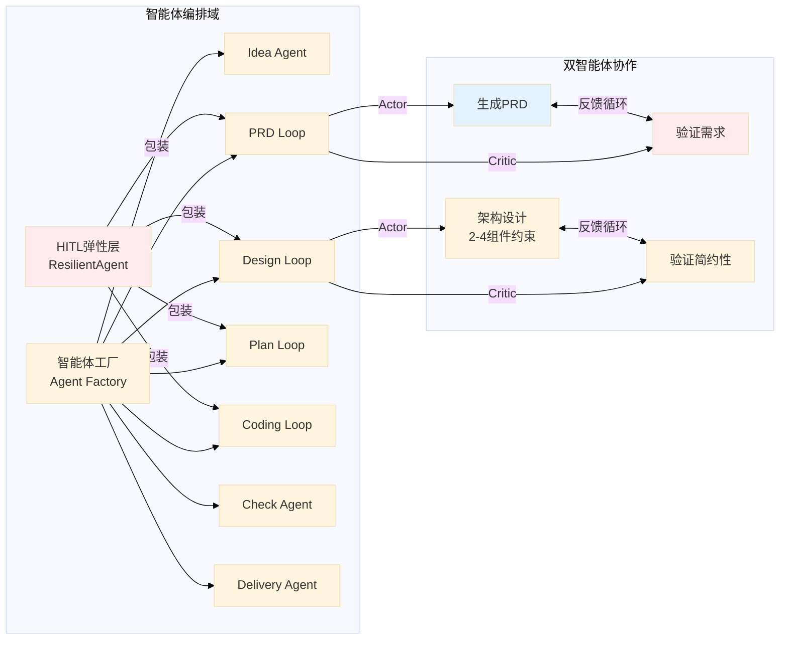

# Cowork Forge 系统架构文档

**版本**: 1.0  
**生成时间**: 2025-01-20  
**文档状态**: 正式发布  

---

## 1. 架构概览 (Architecture Overview)

### 1.1 架构设计哲学

Cowork Forge 采用**人机协作优先 (Human-in-the-Loop First)** 的设计理念，构建了一套面向软件开发生命周期 (SDLC) 的 AI 智能体自动化系统。其核心架构哲学包括：

| 设计原则 | 技术实现 | 业务价值 |
|---------|---------|---------|
| **简约优先 (Simplicity First)** | 指令模板硬性约束（2-4组件、5-12任务限制） | 避免 AI 过度工程化，确保生成代码可维护 |
| **人机协作 (HITL)** | ResilientAgent 弹性层 + 强制审核节点 | 关键质量节点人工把控，防止自动化失控 |
| **弹性容错 (Resilient)** | 三级重试机制 + 人工决策介入 | 确保长流程稳定性，支持断点恢复 |
| **可追溯性 (Traceability)** | 会话隔离 + 文件系统持久化 | 完整记录决策历史，支持版本回退 |

### 1.2 核心架构模式

系统采用**分层多领域架构 (Layered Multi-Domain Architecture)**，基于 Actor-Critic 强化学习范式实现多智能体协作：

1. **Actor-Critic 协作模式**: 每个关键阶段配备双智能体（Actor 生成内容，Critic 验证质量），通过反馈循环确保输出质量
2. **管道编排模式 (Pipeline Orchestration)**: StageExecutor 实现阶段隔离，支持顺序执行和条件分支
3. **工具抽象模式 (Tool Abstraction)**: 标准化工具接口（adk_core::Tool），实现 AI 能力可扩展
4. **会话隔离模式 (Session Isolation)**: 基于 UUID 的会话空间，支持多项目并行开发

### 1.3 技术栈概览


---

## 2. 系统上下文 (System Context)

### 2.1 系统定位与业务价值

Cowork Forge 是一款**AI 原生的软件开发自动化工具**，定位在 AI 辅助编程 (AI-assisted Programming) 与低代码平台 (Low-code Platform) 之间的细分赛道。其核心价值在于：

- **端到端自动化**: 覆盖从需求构思 (Idea) 到项目交付 (Delivery) 的完整 SDLC
- **架构约束生成**: 通过提示工程强制简约架构，避免 "AI 幻觉" 导致的过度设计
- **可控的自动化**: 在 PRD、Design、Plan 等关键节点强制人工审核，平衡效率与质量

### 2.2 用户角色与场景


### 2.3 外部系统交互

| 外部系统 | 交互方式 | 数据交换 | 可靠性要求 |
|---------|---------|---------|-----------|
| **大语言模型服务** | HTTP API (OpenAI 兼容协议) | JSON 请求/响应，流式输出 | 高（速率限制 30次/分） |
| **文件系统** | 标准 IO 操作 | 文本/二进制文件读写 | 高（本地磁盘） |
| **操作系统/Shell** | 命令执行 (30秒超时) | 命令输入/输出捕获 | 中（超时保护） |
| **终端交互界面** | 同步交互 (dialoguer) | 菜单选择、文本输入 | 高（阻塞式） |

### 2.4 系统边界定义

**系统包含 (In-Scope)**:
- CLI 命令行界面（new/resume/revert/modify/status/init）
- 多智能体编排系统（7 阶段生命周期管理）
- Agent Actor-Critic 执行引擎
- 人机协作 (HITL) 交互层
- LLM 客户端和速率限制器
- 文件安全访问控制模块
- 会话和状态管理存储层
- 内部工具系统（文件操作、数据管理、验证）

**系统排除 (Out-of-Scope)**:
- 实际业务应用程序的运行时环境
- LLM 服务的内部实现细节（模型训练/推理）
- IDE 或编辑器插件（仅调用系统默认编辑器）
- CI/CD 流水线集成（通过 Shell 命令间接支持）
- 分布式版本控制系统服务端（Git 服务端）
- 容器编排平台（K8s/Docker Swarm）


---

## 3. 容器视图 (Container View)

### 3.1 领域模块划分

系统采用**分层领域架构**，基于 Rust Crate 物理隔离实现模块化：


### 3.2 核心容器详细说明

#### 3.2.1 CLI 交互与项目入口域 (cowork-cli)

**职责**: 系统入口，负责命令解析、配置加载、会话生命周期管理  
**技术实现**: 基于 `clap` 实现参数解析，`dialoguer` 实现交互式菜单

| 子组件 | 职责 | 关键接口 |
|-------|------|---------|
| 命令处理器 | 解析 new/resume/revert/modify/status/init 命令 | `execute_*_command` |
| 配置管理器 | TOML 文件 + 环境变量回退策略 | `load_config_with_fallback` |
| 会话管理器 | UUID 生成、状态机管理 (InProgress/Completed/Failed) | `generate_session_id`, `fingerprint_project_files` |

#### 3.2.2 AI 智能体编排域 (cowork-core/agents)

**架构模式**: Actor-Critic 双智能体协作  
**核心组件**:



#### 3.2.3 管道编排域 (cowork-core/pipeline)

**核心抽象**: `StageExecutor` 实现阶段隔离  
**关键能力**:
- **阶段隔离**: 通过忽略 escalate 标志，允许 LoopAgent 独立退出而不影响整体流程
- **四种管道构建器**:
  - `create_cowork_pipeline`: 七阶段完整工作流
  - `create_resume_pipeline`: 基于工件检测的断点续接
  - `create_partial_pipeline`: 从指定阶段重新开始（版本回退）
  - `create_modify_pipeline`: 增量修改专用管道

#### 3.2.4 工具系统域 (cowork-core/tools)

**工具分类架构**:

| 工具类别 | 实现文件 | 核心能力 | 安全机制 |
|---------|---------|---------|---------|
| 数据操作工具 | `data_tools.rs` | CRUD 需求/功能/任务 | 自动 ID 生成 (REQ-*/FEAT-*/TASK-*) |
| 文件操作工具 | `file_tools.rs` | 读/写/执行 | 路径遍历防护、30秒超时 |
| 验证检查工具 | `validation_tools.rs` | 依赖循环检测 (DFS算法)、功能覆盖分析 | 集合运算验证 |
| 流程控制工具 | `control_tools.rs` | 反馈记录、重规划请求 | 持久化到 feedback_history.json |
| HITL 交互工具 | `hitl_*.rs` | 内容审核、文件编辑 | 系统编辑器集成 |
| 变更管理工具 | `modify_tools.rs` | ChangeRequest 持久化 | 原子性写入 |

### 3.3 存储设计

采用**文件系统持久化**方案，基于 `.cowork` 目录实现会话隔离：

```
项目根目录/
├── .cowork/
│   ├── project_index.json          # 会话索引 [ProjectIndex]
│   └── sessions/
│       └── {uuid}/
│           ├── metadata.json       # 会话元数据 [SessionRecord]
│           ├── input.json          # 会话输入
│           ├── state.json          # 执行状态
│           ├── feedback_history.json # 反馈历史
│           └── artifacts/
│               ├── idea.md
│               ├── prd.md
│               ├── design.md
│               └── plan.json
└── src/                            # 生成的项目代码
```

**数据模型核心实体**:
- `ProjectIndex`: 项目级会话索引，支持多会话管理
- `SessionRecord`: 会话状态机 (InProgress → Completed/Failed)
- `Requirements`/`Feature`: 需求管理，支持优先级和状态追踪
- `DesignSpec`: 设计规范，强制组件数量约束 (2-4个)
- `ImplementationPlan`/`Task`: 实施计划，任务依赖图
- `ChangeRequest`: 变更管理，支持增量修改

### 3.4 跨域通信机制


---

## 4. 组件视图 (Component View)

### 4.1 核心功能组件

#### 4.1.1 StageExecutor (阶段执行器)

**职责**: 顺序执行多阶段智能体，隔离阶段状态  
**关键设计**:

```rust
pub struct StageExecutor {
    name: String,
    stages: Vec<(String, Arc<dyn Agent>)>, // 阶段名称与智能体映射
}

impl Agent for StageExecutor {
    async fn run(&self, ctx: Arc<dyn InvocationContext>) -> AdkResult<EventStream> {
        for (stage_name, agent) in &self.stages {
            // 关键：忽略 escalate 标志，防止 LoopAgent 退出影响整体流程
            let event_stream = agent.run(ctx.clone()).await?;
            // 流处理逻辑...
        }
    }
}
```

**架构价值**: 实现 "阶段内循环迭代，阶段间顺序执行" 的执行模型，支撑 Actor-Critic 的反馈循环机制。

#### 4.1.2 ResilientAgent (弹性代理包装器)

**三层容错机制**:


#### 4.1.3 LoopAgent (Actor-Critic 循环)

**协作模式实现**:

| 阶段 | Actor 职责 | Critic 职责 | 退出条件 |
|------|-----------|------------|---------|
| PRD | 分析需求生成文档 | 验证完整性、简约性 | ExitLoopTool 或 max=3 |
| Design | 创建架构设计 | 验证组件数量 (2-4)、简约性 | ExitLoopTool 或 max=3 |
| Plan | 创建任务列表 | 验证依赖无环、覆盖度 | ExitLoopTool 或 max=3 |
| Coding | 实现代码 | 验证任务完成、代码质量 | ExitLoopTool 或 max=5 |

### 4.2 技术支撑组件

#### 4.2.1 文件安全访问控制 (FileTools)

**安全机制**:
- **路径遍历防护**: `validate_path_security` 检查，禁止访问 `.cowork` 之外的敏感路径
- **命令执行沙箱**: `RunCommandTool` 30秒超时、禁止后台服务命令（`nohup`, `&`, `systemctl`）
- **并发安全**: 基于 Rust 所有权系统，文件操作原子性保证

#### 4.2.2 速率限制器 (RateLimiter)

**令牌桶算法简化实现**:
- 默认延迟: 2秒/请求（满足 30次/分钟限制）
- 装饰器模式: 包装 `Llm` trait，透明拦截请求
- 配置化: 通过 `RateLimitedLlm::with_delay` 动态调整

```rust
pub struct RateLimitedLlm {
    inner: Arc<dyn Llm>,
    delay: Duration, // 默认 2s
}
```

#### 4.2.3 数据验证引擎 (ValidationTools)

**算法实现**:
- **依赖循环检测**: DFS 算法检测任务依赖图
- **功能覆盖分析**: 集合运算验证代码实现覆盖需求
- **数据格式验证**: 基于 serde 的反序列化验证

### 4.3 组件交互关系


---

## 5. 关键流程 (Key Processes)

### 5.1 完整项目创建工作流


### 5.2 Actor-Critic 协作详细流程

**反馈循环机制**:

1. **初始化**: LoopAgent 加载 Actor 指令，配置工具集（含 ExitLoopTool）
2. **Actor 执行**: 生成内容（PRD/设计文档/任务列表/代码）
3. **Critic 验证**: 
   - 检查简约性约束（组件数、任务数）
   - 验证依赖关系（无环性）
   - 评估代码质量
4. **决策分支**:
   - **通过**: Critic 调用 ExitLoopTool，LoopAgent 退出，进入下一阶段
   - **失败**: Critic 提供具体反馈，Actor 基于反馈历史迭代修改（最多 3-5 次）

### 5.3 弹性错误恢复流程


### 5.4 增量修改工作流

**差异化处理流程**:

1. **变更分析** (Change Triage Agent):
   - 计算项目文件指纹（变更检测）
   - 分析影响范围（PRD/Design/Plan/Code）
   - 评估风险等级（低/中/高）

2. **代码补丁** (Code Patch Agent):
   - 基于 ChangeRequest 执行增量修改
   - 遵循现有代码风格（上下文学习）
   - 局部重构而非全量重写

3. **变更验证**:
   - Check Agent 验证修改质量
   - 功能完整性检查
   - 生成类 PR 描述的变更报告

---

## 6. 技术实现细节 (Technical Implementation)

### 6.1 核心模块实现

#### 6.1.1 智能体工厂实现模式

采用**建造者模式 (Builder Pattern)** 结合**依赖注入**:

```rust
pub fn create_prd_loop(
    llm: Arc<dyn Llm>,
    tools: Vec<Arc<dyn Tool>>,
    storage: Arc<dyn Storage>,
) -> Arc<dyn Agent> {
    // Actor: 生成需求
    let actor = LlmAgentBuilder::new()
        .with_model(llm.clone())
        .with_instruction(PRD_ACTOR_INSTRUCTION)
        .with_tools(tools.clone())
        .build();
    
    // Critic: 验证需求
    let critic = LlmAgentBuilder::new()
        .with_model(llm)
        .with_instruction(PRD_CRITIC_INSTRUCTION)
        .with_tools(tools)
        .build();
    
    // LoopAgent: 编排 Actor-Critic 循环
    let loop_agent = LoopAgentBuilder::new()
        .with_main_agent(actor)
        .with_critic_agent(critic)
        .with_max_iterations(3)
        .build();
    
    // ResilientAgent: 包装容错机制
    Arc::new(ResilientAgent::new(
        loop_agent,
        storage,
        "prd_loop".to_string()
    ))
}
```

#### 6.1.2 阶段隔离机制

**关键代码** (`StageExecutor::run`):

```rust
// 忽略 escalate 事件，防止 LoopAgent 的 ExitLoopTool 影响整体流程
while let Some(event) = stream.next().await {
    match event {
        Event::Action { action, .. } => {
            // 关键：不传递 escalate 标志到外层
            if action.name() != "ExitLoopTool" {
                yield event;
            }
        }
        _ => yield event,
    }
}
```

**架构意义**: 实现 "结构化并发" (Structured Concurrency)，子任务失败不影响父任务，支持阶段内重试。

### 6.2 关键算法设计

#### 6.2.1 断点恢复算法

基于**工件存在性检测**的状态推断:

```rust
fn detect_resume_stage(session_id: &str) -> ResumeStage {
    if has_code_files(session_id) {
        ResumeStage::Check  // 代码已生成，从检查开始
    } else if has_implementation_plan(session_id) 
           && has_design_spec(session_id) {
        ResumeStage::Coding // 设计完成，从编码开始
    } else if has_design_spec(session_id) {
        ResumeStage::Plan   // 需求完成，从规划开始
    } else if has_requirements(session_id) {
        ResumeStage::Design // 需求完成，从设计开始
    } else {
        ResumeStage::Prd    // 从头开始
    }
}
```

#### 6.2.2 任务依赖循环检测

**DFS 算法实现** (`CheckTaskDependenciesTool`):

```rust
fn detect_cycles(tasks: &[Task]) -> Option<Vec<String>> {
    let graph = build_dependency_graph(tasks);
    let mut visited = HashSet::new();
    let mut recursion_stack = HashSet::new();
    
    for task in tasks {
        if !visited.contains(&task.id) {
            if let Some(cycle) = dfs_detect(&graph, task.id, &mut visited, &mut recursion_stack) {
                return Some(cycle);
            }
        }
    }
    None
}
```

### 6.3 数据结构 design

#### 6.3.1 会话状态机


#### 6.3.2 Feature 生命周期模型

```rust
enum FeatureStatus {
    Planned,      // 计划中
    InProgress,   // 实现中
    Implemented,  // 已实现（代码存在）
    Verified,     // 已验证（测试通过）
    Delivered,    // 已交付
}

struct Feature {
    id: String,           // FEAT-001
    name: String,
    status: FeatureStatus,
    requirements: Vec<String>, // 关联需求 IDs
    tasks: Vec<String>,        // 关联任务 IDs
    created_at: DateTime<Utc>,
    updated_at: DateTime<Utc>,
}
```

### 6.4 性能优化策略

#### 6.4.1 LLM 调用优化

- **速率限制**: 默认 2秒延迟，防止 API 限流
- **流式输出**: 支持 `--stream` 标志，实时显示生成过程
- **上下文压缩**: Critic 阶段只传递关键差异，减少 Token 消耗

#### 6.4.2 存储优化

- **惰性加载**: `Storage` 实现按需加载 JSON 文件
- **增量持久化**: 工具执行后立即保存状态，避免批量写入阻塞
- **文件指纹缓存**: 增量修改时缓存文件哈希，避免重复计算

#### 6.4.3 并发设计

- **阶段内顺序**: 保证 Actor-Critic 交替执行的因果性
- **阶段间隔离**: StageExecutor 顺序执行，避免并发冲突
- **异步 IO**: 文件操作和 LLM 调用均为异步，支持并发会话管理

---

## 7. 部署架构 (Deployment Architecture)

### 7.1 运行时环境要求

| 组件 | 最低要求 | 推荐配置 |
|------|---------|---------|
| **操作系统** | Linux/macOS/Windows | Linux (Ubuntu 22.04+) |
| **Rust** | 1.70+ | 1.75+ |
| **内存** | 2GB | 4GB+（LLM上下文缓存） |
| **磁盘** | 1GB | 10GB+（项目工件存储） |
| **网络** | 可访问 LLM API | 本地 vLLM/Ollama 部署 |

### 7.2 部署拓扑结构


### 7.3 配置管理策略

**分层配置体系**:

1. **系统级配置** (`/etc/cowork/config.toml`): 全局默认
2. **用户级配置** (`~/.config/cowork/config.toml`): 个人偏好
3. **项目级配置** (`.cowork/config.toml`): 项目特定
4. **环境变量** (`COWORK_LLM_API_KEY`): 敏感信息
5. **命令行参数** (`--verbose`, --model`): 临时覆盖

**配置示例**:
```toml
[llm]
provider = "openai"  # 或 "vllm", "ollama"
api_key = "${OPENAI_API_KEY}"  # 支持 env 变量插值
model = "gpt-4"
rate_limit = "30/m"

[project]
template = "rust"  # 默认项目模板
editor = "code"    # 系统编辑器命令
```

### 7.4 可扩展性设计

#### 7.4.1 水平扩展能力

虽然 Cowork Forge 主要为单机 CLI 设计，但其架构支持以下扩展:

- **多会话并行**: 通过会话 ID 隔离，支持同时管理多个项目
- **多模型切换**: 配置中定义多个 LLM 配置，运行时切换
- **自定义工具**: 实现 `Tool` trait 即可扩展智能体能力

#### 7.4.2 垂直扩展路径

| 扩展点 | 实现方式 | 场景 |
|-------|---------|------|
| **新增开发阶段** | 实现 `Agent` trait，注册到 `StageExecutor` | 新增安全审计阶段 |
| **自定义验证规则** | 新增 `ValidationTool`，在 Critic 指令中引用 | 合规性检查 |
| **新语言支持** | 扩展 `coding` 阶段指令模板，新增文件扩展名映射 | Python/Go 项目生成 |
| **CI/CD 集成** | 使用 `--no-interactive` 模式，配合 Shell 脚本 | 自动化流水线 |

### 7.5 监控与运维

#### 7.5.1 可观测性

**结构化日志** (tracing):
- **INFO**: 阶段开始/完成、人机交互点
- **DEBUG**: 工具调用详情、LLM 请求参数
- **ERROR**: 执行异常、重试计数溢出

**会话审计日志**:
```json
// .cowork/sessions/{id}/audit.log
{
  "timestamp": "2025-01-20T10:00:00Z",
  "event": "stage_transition",
  "from": "design",
  "to": "plan",
  "actor": "DesignCritic",
  "decision": "approve"
}
```

#### 7.5.2 故障排查指南

| 故障现象 | 可能原因 | 解决方案 |
|---------|---------|---------|
| Max iterations 错误 | 任务过于复杂或描述不清 | 使用 `cowork modify` 细化需求，或人工介入提供指导 |
| API 速率限制 | LLM 调用过于频繁 | 检查 `rate_limit` 配置，或切换到本地 vLLM |
| 文件权限错误 | 安全路径验证失败 | 确保操作在 `project_root` 内，避免系统目录 |
| 会话状态不一致 | 强制退出导致元数据损坏 | 使用 `cowork revert` 回退到稳定阶段 |

#### 7.5.3 备份与恢复

**自动备份机制**:
- 每次阶段完成自动创建 `.cowork/sessions/{id}/backups/`
- 保留最近 5 个阶段的状态快照
- 支持 `cowork revert --to <stage>` 快速回退

**灾难恢复**:
```bash
# 手动备份会话
cp -r .cowork/sessions/{id} backup/

# 恢复会话
cp -r backup/{id} .cowork/sessions/
cowork resume --session {id}
```

---

## 8. 架构决策记录 (Architecture Decision Records)

### ADR-001: 文件系统持久化 vs 数据库存储

**决策**: 使用 JSON 文件系统而非 SQLite/PostgreSQL  
**理由**:
- 与代码仓库天然集成，便于版本控制
- 零配置部署，无需数据库服务
- 人类可读的工件 (Markdown/JSON)，便于审计  
**权衡**: 牺牲复杂查询性能，换取简单性和可移植性

### ADR-002: Actor-Critic 模式 vs 单智能体

**决策**: 关键阶段采用双智能体 (Actor-Critic) 协作  
**理由**:
- 分离生成与验证职责，降低单一提示词复杂度
- 通过循环机制实现自我纠正，减少人工干预频率  
**权衡**: 增加 Token 消耗和延迟，换取更高质量输出

### ADR-003: Rust 语言选型

**决策**: 使用 Rust 而非 Python/TypeScript  
**理由**:
- 类型安全保证运行时稳定性（长流程自动化关键）
- 性能优势：快速文件操作、低内存占用
- ADK 框架的原生支持  
**权衡**: 开发迭代速度较慢，学习曲线陡峭

---

## 9. 总结

Cowork Forge 的架构设计体现了 **"可控的自动化"** 理念：通过 Actor-Critic 协作机制保证 AI 输出质量，通过 HITL 弹性层确保人类在关键时刻的把控能力，通过阶段隔离和会话管理实现可靠的长流程执行。

该架构适用于需要**结构化 AI 辅助**的软件开发场景，特别是：
- 初创产品快速原型验证 (MVP 开发)
- 标准化微服务的批量生成
- 遗留系统的增量重构

**未来演进方向**:
- 支持分布式多智能体（多模型辩论机制）
- 集成 IDE 插件实现实时代码同步
- 引入向量化存储实现项目知识库检索
