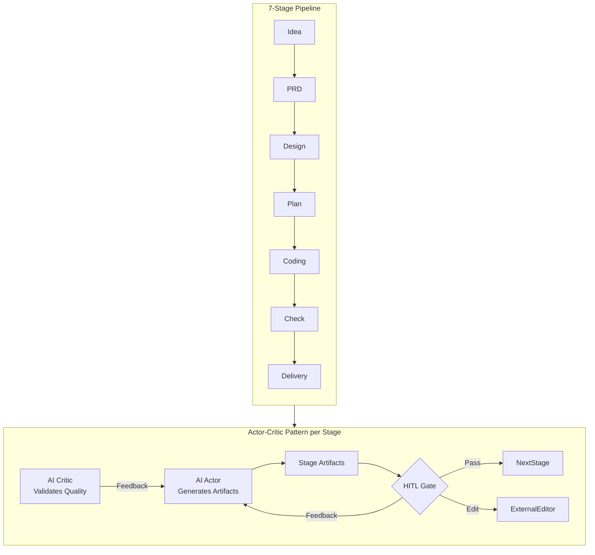
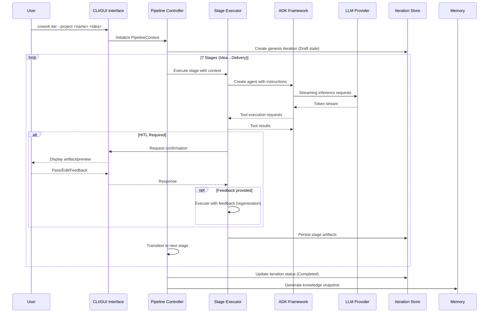
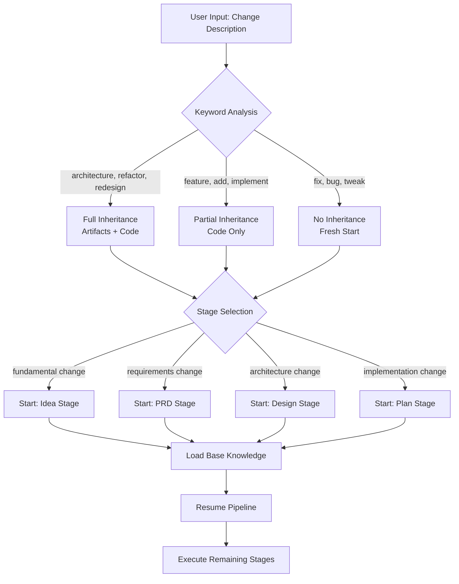
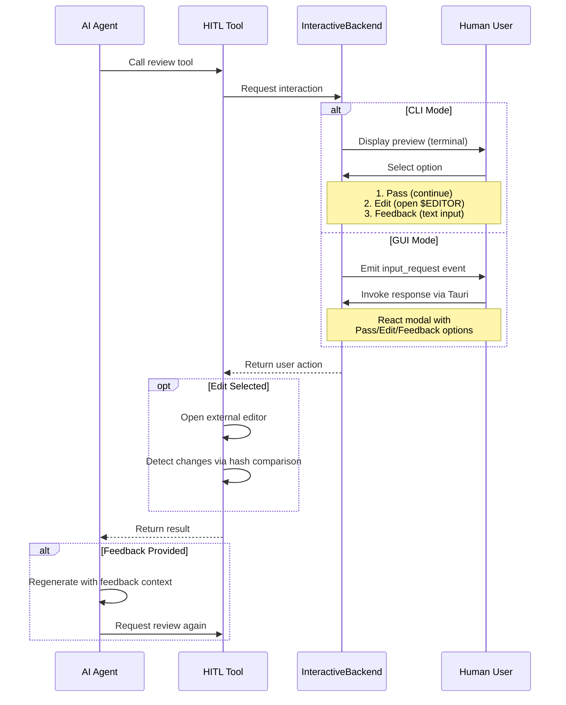
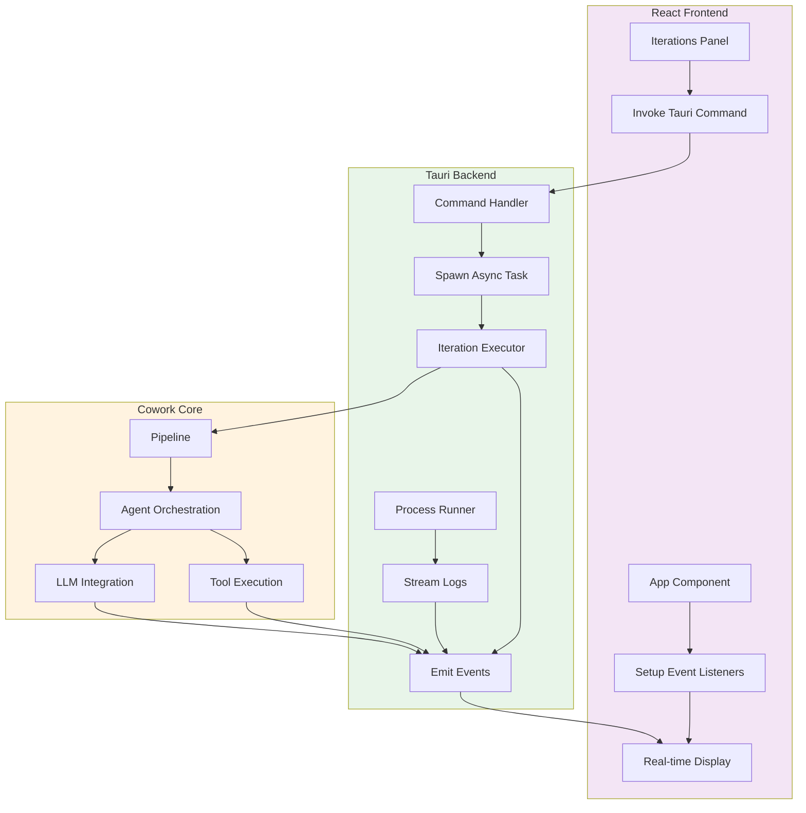
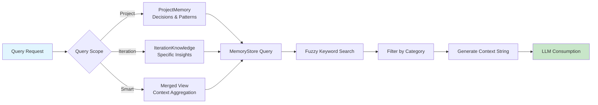
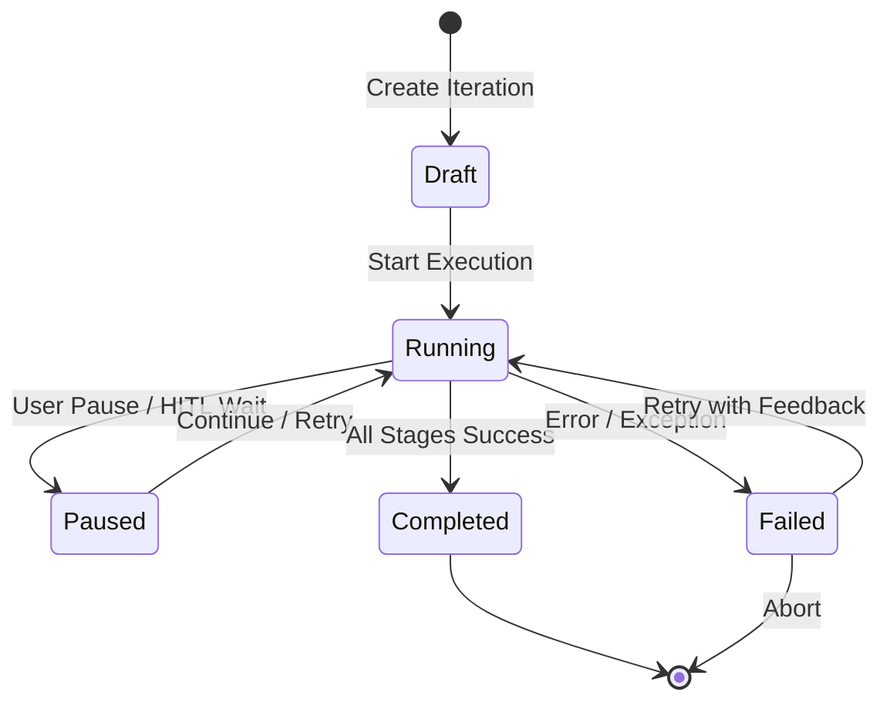
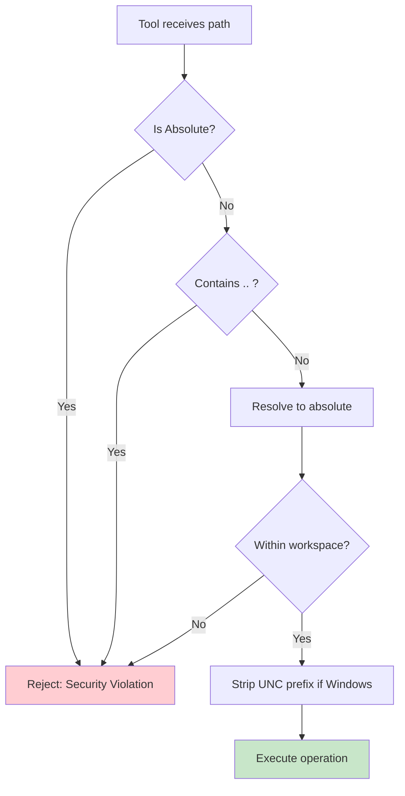

基于提供的研究材料，我分析了 Cowork Forge 系统架构、域模块和实现细节。以下是完整的核心工作流文档：

---

# 核心工作流

**文档版本**：1.0  
**系统**：Cowork Forge - AI 驱动的迭代式软件开发平台  
**生成时间**：2026-02-14 05:11:46 (UTC)

## 1. 工作流概述

### 1.1 系统架构上下文

Cowork Forge 实现了**领域驱动、事件驱动的架构**，围绕 7 阶段 AI 智能体流程。作为多 crate Rust 工作区运行，系统有三个主要分发渠道：用于自动化优先用户的 CLI 工具、用于交互式开发的基于 Tauri 的桌面 GUI，以及包含业务逻辑的核心域库。

### 1.2 核心执行范式

系统遵循**带人在回路（ HITL）门的 Actor-Critic 模式**：



### 1.3 关键流程节点

| 节点 | 职责 | 关键性 |
|------|---------------|-------------|
| **流程控制器** | 编排阶段执行，管理上下文状态，处理转换 | 关键 |
| **阶段执行器** | 连接流程与 ADK 框架，管理智能体生命周期和流式传输 | 关键 |
| **交互后端** | HITL 交互抽象（CLI vs GUI 实现） | 高 |
| **内存存储** | 项目知识和迭代历史的持久化层 | 高 |
| **工具注册表** | 30+ ADK 工具用于文件操作、验证和数据管理 | 中 |
| **限流 LLM** | 装饰器确保 API 合规（30 次/分钟，并发=1） | 中 |

### 1.4 流程协调机制

- **异步/等待并发**：Tokio 运行时管理并发流程执行和 I/O
- **事件驱动 GUI**：Tauri AppHandle 发射实时事件（agent_event、tool_call、progress）
- **状态隔离**：每个迭代在 `.cowork-v2/iterations/{id}/` 下维护隔离工作区
- **内存聚合**：三范围查询系统（项目级、迭代级、智能合并）

## 2. 主工作流

### 2.1 创世迭代创建流程

**业务价值**：通过结构化 AI 驱动的开发将自然语言想法转化为完整软件项目，为未来演进建立基线项目内存。

**执行路径**：



**关键技术细节**：

1. **阶段初始化**：每个阶段实现 `Stage` 特性，带 `execute()` 和 `execute_with_feedback()` 方法
2. **工件持久化**：阶段输出保存为 markdown 文件（idea.md、prd.md、design.md、plan.md）在迭代工作区
3. **Actor-Critic 实现**： 
   - Actor 指令（每个约 200 行）定义工作流步骤和工具模式
   - Critic 指令强制执行质量门（防循环保护、简单性验证）
4. **确认门**：关键阶段（Idea、PRD、Design、Plan、Coding）返回 `needs_confirmation() = true`

### 2.2 演进迭代流程

**业务价值**：通过利用历史上下文支持增量开发和重构，同时支持三种继承策略。

**变更范围分析算法**：



**继承模式矩阵**：

| 模式 | 工件转移 | 代码转移 | 用例 |
|------|------------------|---------------|----------|
| **无** | ❌ | ❌ | 全新开始、实验性变更 |
| **部分** | ❌ | ✅ | 增量功能、缺陷修复 |
| **完整** | ✅ | ✅ | 重大重构、架构变更 |

**流程详情**：
1. **NLP 分析**：`iteration.rs` 中的 `analyze_change_scope()` 使用关键词匹配确定最佳起始阶段
2. **知识加载**：`LoadBaseKnowledgeTool` 从先前迭代检索历史决策、模式和已知问题
3. **工作区准备**：继承模式决定哪些文件从基线迭代工作区复制到新迭代工作区

### 2.3 人在回路（HITL）验证流程

**业务价值**：确保在关键决策点的人工监督，同时支持通过反馈循环进行迭代优化。



**实现机制**：
- **CLI 后端**：使用 `dialoguer` crate 进行交互式提示，支持通过 `edit` crate 打开系统默认编辑器
- **GUI 后端**：使用 `tokio::sync::oneshot` 通道实现异步请求/响应模式，超时 3000 秒
- **内容审查**：`ReviewAndEditContentTool` 处理 markdown 内容（15 行预览限制）
- **文件审查**：`ReviewAndEditFileTool` 处理文件修改（10 行预览、外部编辑器集成）

### 2.4 GUI 实时执行和监控流程

**业务价值**：为 AI 智能体执行提供透明的可视性，带实时日志流式传输和开发服务器管理。



**事件类型**：
- `agent_event`：智能体消息和思考过程
- `agent_streaming`：逐令牌 LLM 输出
- `tool_call`：带参数的工具调用
- `tool_result`：工具执行结果
- `progress`：阶段完成百分比
- `input_request`：HITL 确认请求
- `project_log`：外部进程 stdout/stderr

**流程运行器架构**：
- **跨平台**：Windows（`cmd /C`）vs Unix（`sh -c`）命令执行
- **进程注册表**：`Arc<Mutex<HashMap>>` 按 iteration_id 跟踪活动进程
- **流式处理**：单独的 Tokio 任务异步读取 stdout/stderr
- **安全性**：`is_blocking_service_command()` 防止挂起命令（npm dev、http.server）的执行

### 2.5 内存查询和知识检索流程

**业务价值**：通过保留架构决策、设计模式和技术见解维护跨迭代的项目连续性。



**查询维度**：
1. **范围**：`project`（历史）、`iteration`（当前）、`latest`（合并）
2. **类别**：`decisions`、`patterns`、`insights`、`issues`
3. **阶段**：按流程阶段过滤（idea、prd、design 等）
4. **关键词**：标题和内容的模糊搜索

**知识提升工作流**：
- **见解捕获**：`SaveInsightTool` 在执行期间捕获观察
- **决策提升**：`PromoteToDecisionTool` 将见解提升为项目级架构决策
- **模式提取**：`PromoteToPatternTool` 创建可重用模式库条目
- **快照生成**：交付后，`SaveKnowledgeSnapshotTool` 将迭代数据压缩为 `IterationKnowledge`

## 3. 流程协调和控制

### 3.1 状态管理架构

**流程状态机**：



**上下文传播**：
- `PipelineContext` 携带跨阶段的执行状态，包含：
  - 当前迭代 ID 和元数据
  - 阶段序列和完成跟踪
  - 继承模式和基线知识引用
  - 用户反馈积累
- **不可变更新**：每个阶段接收克隆的上下文，输出带有更新工件的新上下文

### 3.2 多模块协调

**依赖注入模式**：
```rust
// 流程通过特性抽象进行编排
pub struct Pipeline {
    stages: Vec<Box<dyn Stage>>,
    backend: Arc<dyn InteractiveBackend>,
    store: Arc<IterationStore>,
}
```

**并发控制**：
- **单一迭代执行**：`RateLimitedLlm` 中的全局信号量确保一次只有一个活动 LLM 请求
- **GUI 状态共享**：`AppState` 包装在 `Arc<Mutex<>>` 中以跨 Tauri 命令进行线程安全访问
- **进程隔离**：每个迭代的开发服务器在独立子进程中运行，带专用 I/O 流

### 3.3 数据流架构

**工件流**：
1. **生成**：AI Actor 通过 LLM 推理创建内容
2. **验证**：AI Critic 检查质量标准
3. **审查**：HITL 门通过 InteractiveBackend 呈现给用户
4. **持久化**：保存到 `workspace/artifacts/{stage}.md`
5. **传播**：后续阶段通过 `LoadDocumentSummaryTool` 加载

**内存流**：
1. **捕获**：智能体工具（`SaveInsightTool`、`SaveIssueTool`）收集知识
2. **聚合**：`MemoryStore` 按标签和类别索引
3. **查询**：`QueryMemoryTool` 检索相关上下文
4. **注入**：上下文字符串预先添加到智能体提示以保持连续性

## 4. 异常处理和恢复

### 4.1 错误分类层级

| 级别 | 类型 | 处理策略 |
|-------|------|-------------------|
| **基础设施** | LLM API 失败、网络超时 | 指数退避、尊重限流、用户通知 |
| **域** | 无效状态转换、约束违规 | 入口点验证、提前失败并带上下文 |
| **工具** | 文件 I/O 错误、命令执行失败 | 路径验证、沙箱执行、详细错误消息 |
| **流程** | 阶段执行失败、智能体错误 | 暂停迭代、允许带反馈重试、保留部分工件 |

### 4.2 恢复机制

**迭代状态恢复**：
- **孤立状态检测**：项目加载时，自动将 `Running` 迭代重置为 `Paused`（处理崩溃）
- **部分工件恢复**：阶段完成单独跟踪；可以从任何已完成阶段恢复
- **工作区完整性**：带有验证的原子文件操作，然后再覆盖

**HITL 超时处理**：
- **GUI 模式**：oneshot 通道 3000 秒超时；如果用户无响应则自动失败迭代
- **CLI 模式**：阻塞等待，带 `ctrl+c` 处理以进行优雅中断

**工具执行安全性**：
- **路径验证**：`validate_path_security_within_workspace()` 防止目录遍历（`..` 拒绝、绝对路径拒绝）
- **命令阻止**：检测长时间运行的服务命令（npm dev、vite）以防止智能体挂起
- **文件扩展名过滤**：部署工具使用白名单方法（`.html`、`.js`、`.css` 等）防止敏感文件暴露

### 4.3 容错策略

**优雅降级**：
- **LLM 不可用**：流程暂停并显示明确错误消息；用户可以重试
- **编辑器不可用**：如果外部编辑器启动失败，HITL 回退到文本输入模式
- **进程崩溃**：`project_runner` 发射 `project_stopped` 事件；GUI 更新 UI 状态

**重试逻辑**：
- **瞬态失败**：LLM 限流（429 错误）触发自动延迟重试
- **验证失败**：Actor-Critic 循环允许在需要人工干预之前最多 3 次自动重新生成

## 5. 关键流程实现

### 5.1 阶段执行算法

```rust
// 阶段执行逻辑的伪代码表示
async fn execute_stage(
    &self,
    context: PipelineContext,
    backend: Arc<dyn InteractiveBackend>
) -> StageResult {
    // 1. 加载阶段特定指令（Actor + Critic）
    let actor_prompt = self.get_actor_instruction();
    let critic_prompt = self.get_critic_instruction();
    
    // 2. 使用工具注册表创建 ADK 智能体
    let agent = AgentBuilder::new()
        .with_llm(create_llm_client())
        .with_tools(get_stage_tools())
        .with_instruction(actor_prompt)
        .build();
    
    // 3. 使用流式输出执行
    let mut stream = agent.execute(context.to_prompt()).await;
    while let Some(chunk) = stream.next().await {
        backend.show_message(chunk.content).await;
        
        // 处理工具调用
        if let Some(tool_call) = chunk.tool_call {
            backend.show_tool_call(&tool_call).await;
            let result = execute_tool(tool_call).await;
            backend.show_tool_result(&result).await;
            agent.submit_tool_result(result).await;
        }
    }
    
    // 4. Critic 验证
    if let Some(critic_result) = validate_with_critic(&agent.output).await {
        if !critic_result.approved {
            return StageResult::Revision(critic_result.feedback);
        }
    }
    
    // 5. HITL 确认（如需要）
    if self.needs_confirmation() {
        match backend.request_confirmation(&agent.output).await {
            UserAction::Pass => StageResult::Success(agent.output),
            UserAction::Edit => {
                let edited = open_editor(&agent.output).await;
                StageResult::Success(edited)
            }
            UserAction::Feedback(fb) => StageResult::Revision(fb),
        }
    } else {
        StageResult::Success(agent.output)
    }
}
```

### 5.2 知识提取流程

**交付后处理**：
1. **文档分析**：解析 idea.md、prd.md、design.md、plan.md 以获取关键主题
2. **技术栈检测**：分析配置文件（package.json、Cargo.toml、requirements.txt）
3. **代码结构映射**：带深度限制的目录遍历（最多 10 级）
4. **决策提取**：识别带理由和后果的架构选择
5. **模式识别**：提取带使用示例的可重用解决方案
6. **问题文档化**：捕获已知问题和技术债务

**存储格式**：
```json
{
  "iteration_id": "uuid",
  "timestamp": "ISO 8601",
  "summary": "300-500 word narrative",
  "tech_stack": ["React", "Rust", "TypeScript"],
  "decisions": [{"title": "", "rationale": "", "consequences": []}],
  "patterns": [{"name": "", "tags": [], "usage": ""}],
  "known_issues": [{"description": "", "severity": "high|medium|low"}]
}
```

### 5.3 文件系统安全模型

**验证流程**：


**受保护路径**（部署阶段）：
- 版本控制：`.git`、`.gitignore`、`.gitattributes`
- IDE 配置：`.vscode`、`.idea`
- 构建产物：`target`、`node_modules`、`dist`、`build`
- 系统文件：`.cowork-v2`、`Cargo.lock`（可选）
- 文档：`README.md`、`LICENSE`、`CHANGELOG.md`

### 5.4 性能优化策略

**LLM 限流**：
- **全局信号量**：`tokio::sync::Semaphore(1)` 确保单个并发请求
- **请求间隔**：2 秒延迟强制 30 次/分钟策略
- **令牌流式传输**：实时令牌发射防止长生成期间的 UI 阻塞

**文件 I/O 优化**：
- **截断读取**：`ReadFileTruncatedTool` 限制大文件（>10KB）以防止上下文溢出
- **虚拟化渲染**：GUI 文件树使用 `react-window` 处理 1000+ 文件的目录
- **分块加载**：大文件以 10KB 块加载，带偏移/限制分页

**内存管理**：
- **延迟加载**：内存索引在首次查询时加载，随后请求缓存
- **上下文修剪**：LLM 提示仅包含 top-N 相关内存（可配置限制）
- **工作区清理**：部署阶段自动删除孤立文件

---

**核心工作流文档结束**