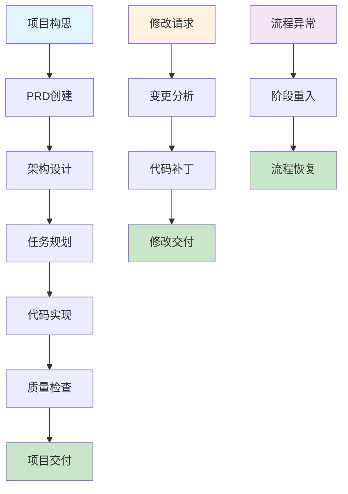
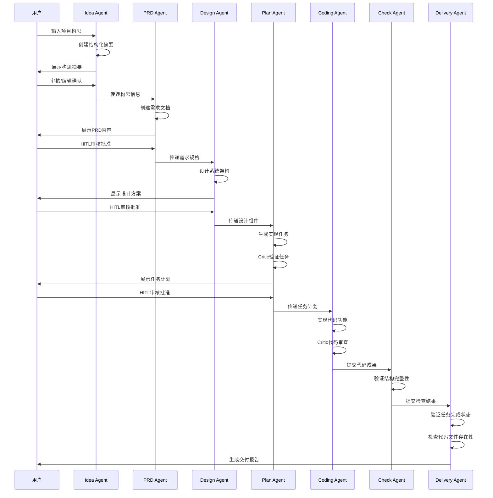
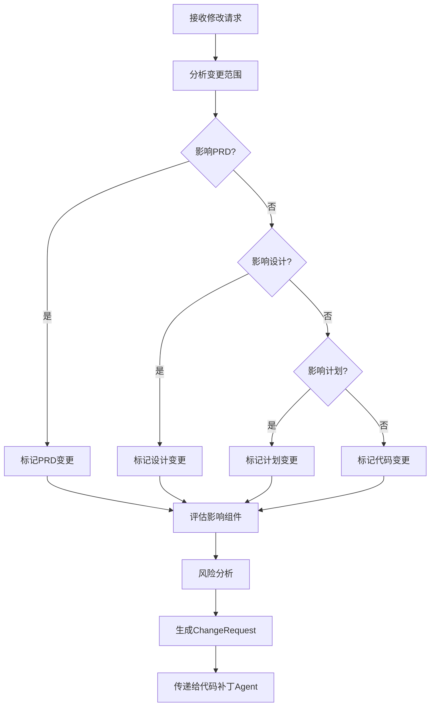
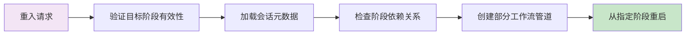
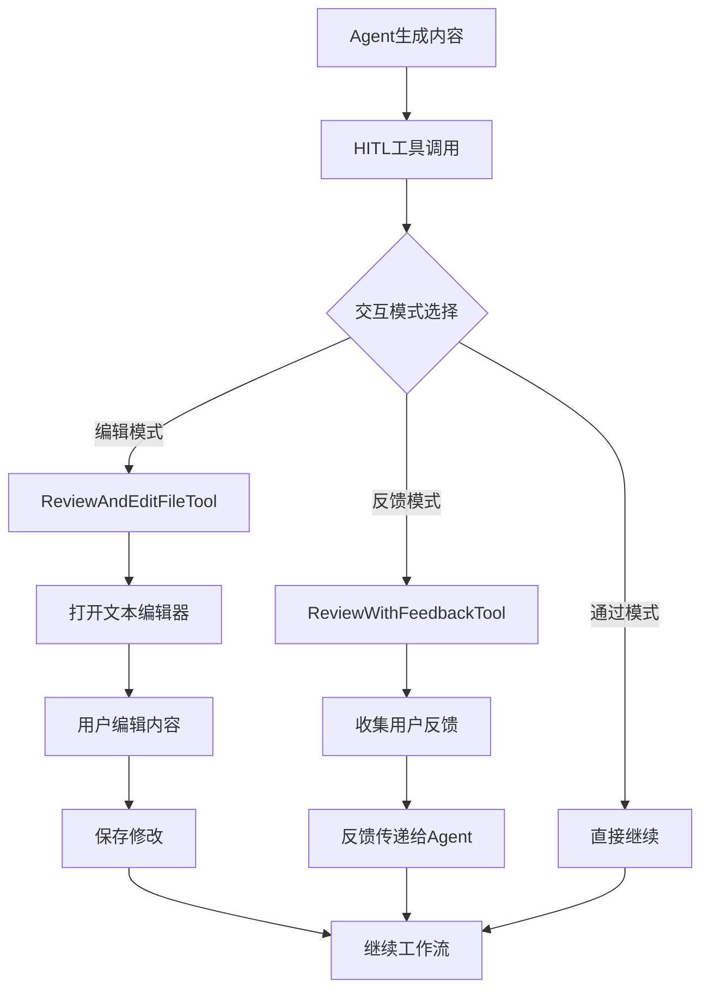
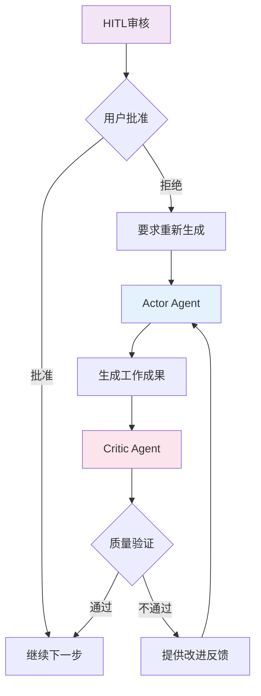
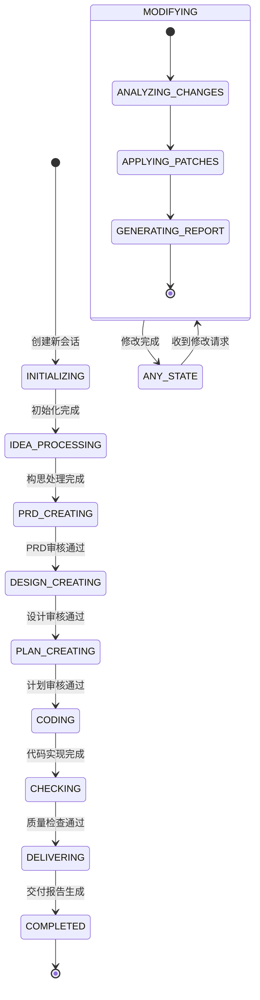
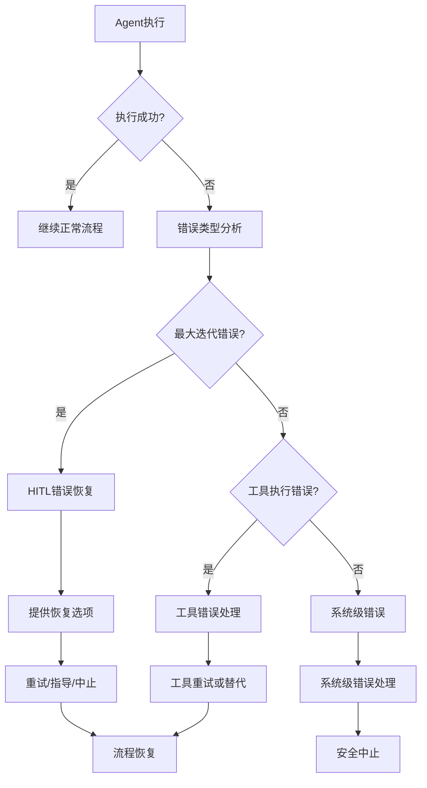
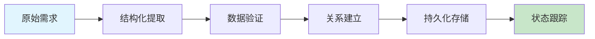

# Core Workflows

## 1. Workflow Overview

Cowork Forge系统采用基于AI智能体的多阶段工作流架构，实现从项目构思到交付的完整软件开发生命周期自动化。系统核心工作流建立在Actor-Critic模式基础上，结合Human-in-the-Loop(HITL)人机协作机制，确保开发过程的质量控制和用户参与。

### 1.1 系统主要工作流
- **项目创建完整工作流**：从构思到交付的全生命周期管理
- **增量修改工作流**：支持现有项目的变更管理和代码补丁
- **阶段重入工作流**：错误恢复和流程优化的重启机制
- **HITL交互工作流**：关键决策点的人机协作流程

### 1.2 核心执行路径


### 1.3 关键流程节点
- **构思处理节点**：Idea Agent处理用户输入，创建结构化摘要
- **需求确认节点**：PRD Actor-Critic系统创建和验证产品需求
- **架构审核节点**：设计Agent创建系统架构，HITL验证
- **任务规划节点**：计划Agent生成实现任务，Critic验证
- **代码实现节点**：编码Agent实现代码，Critic质量审查
- **质量检查节点**：检查Agent验证项目结构完整性
- **交付报告节点**：交付Agent生成最终交付报告

### 1.4 流程协调机制
系统采用管道编排模式（`crates/cowork-core/src/pipeline/mod.rs`）实现工作流协调，通过会话管理机制（`crates/cowork-core/src/storage/mod.rs`）维护流程状态，利用工具层（`crates/cowork-core/src/tools/mod.rs`）提供具体功能操作支持。

## 2. Main Workflows

### 2.1 项目创建完整工作流

#### 2.1.1 流程详细描述
项目创建工作流是系统的核心业务流程，涵盖从项目构思到最终交付的7个关键阶段，每个阶段都采用Actor-Critic模式确保质量。



#### 2.1.2 执行顺序和依赖关系
1. **顺序依赖**：每个阶段必须在前一阶段完成并通过审核后才能开始
2. **数据依赖**：前一阶段的输出作为后一阶段的输入数据
3. **审核依赖**：关键阶段必须通过HITL审核才能继续
4. **状态依赖**：会话状态管理确保流程的连续性和可恢复性

#### 2.1.3 输入输出数据流
- **输入**：用户项目构思（文本描述）
- **阶段间数据传递**：
  - 构思→PRD：结构化项目摘要
  - PRD→设计：产品需求规格
  - 设计→计划：系统架构组件
  - 计划→编码：具体实现任务
  - 编码→检查：代码文件和元数据
- **输出**：完整项目代码库 + 交付报告

### 2.2 增量修改工作流

#### 2.2.1 变更分析流程
修改Agent（`crates/cowork-core/src/instructions/modify.rs`）负责分析用户变更请求，确定影响范围。



#### 2.2.2 代码补丁实施流程
代码补丁Agent（`crates/cowork-core/src/instructions/code_patch.rs`）根据ChangeRequest实施具体修改。

**关键实施步骤：**
1. **变更影响分析**：识别受影响文件和组件
2. **代码修改策略**：确定最小化修改方案
3. **增量实现**：保持现有代码结构的基础上进行修改
4. **质量验证**：确保修改不破坏现有功能

#### 2.2.3 修改交付流程
修改交付Agent（`crates/cowork-core/src/instructions/modify_delivery.rs`）生成结构化变更报告。

**报告内容包含：**
- 变更范围分析
- 修改文件清单（新增/修改/删除）
- 实现细节说明
- 测试状态信息
- 会话元数据

### 2.3 阶段重入工作流

#### 2.3.1 重入决策机制
阶段跳转工具（`crates/cowork-core/src/tools/goto_stage_tool.rs`）实现重入决策逻辑。



#### 2.3.2 管道重组策略
管道编排模块（`crates/cowork-core/src/pipeline/mod.rs`）支持多种重入场景：

1. **PRD阶段重入**：重新进行需求分析和确认
2. **设计阶段重入**：重新设计系统架构
3. **计划阶段重入**：重新规划实现任务
4. **编码阶段重入**：重新实现代码功能

#### 2.3.3 状态恢复机制
存储管理模块（`crates/cowork-core/src/storage/mod.rs`）确保重入时的状态一致性：

- **会话元数据加载**：恢复之前的项目状态
- **工件数据继承**：保留已完成阶段的工作成果
- **流程状态同步**：确保重入后流程连续性

### 2.4 Human-in-the-Loop交互工作流

#### 2.4.1 HITL工具架构
系统提供多种HITL交互工具（`crates/cowork-core/src/tools/hitl_tools.rs`）支持不同交互场景。



#### 2.4.2 关键审核节点
系统在以下关键节点强制要求HITL审核：

1. **PRD确认节点**：确保需求准确理解
2. **架构设计节点**：确保技术方案合理性
3. **任务计划节点**：确保实现方案可行性
4. **重大变更节点**：确保修改方向正确

#### 2.4.3 错误恢复机制
HITL Agent包装器（`crates/cowork-core/src/agents/hitl.rs`）提供错误恢复能力：

- **最大迭代错误处理**：当Agent达到最大迭代次数时介入
- **用户指导重试**：允许用户提供指导后重新执行
- **流程中止选项**：在严重错误时提供安全退出机制

## 3. Flow Coordination and Control

### 3.1 多模块协调机制

#### 3.1.1 智能体协作模式
系统采用Actor-Critic架构实现质量保证闭环：



#### 3.1.2 管道编排策略
管道模块（`crates/cowork-core/src/pipeline/mod.rs`）实现灵活的工作流组装：

**支持的管道类型：**
- **全项目管道**：完整的7阶段工作流
- **部分管道**：从特定阶段开始的工作流
- **修改管道**：专门的增量修改工作流
- **重入管道**：错误恢复用的重入工作流

### 3.2 状态管理和同步

#### 3.2.1 会话状态机
系统采用基于会话的状态管理机制（`crates/cowork-core/src/data/models.rs`）：



#### 3.2.2 数据一致性保障
存储模块（`crates/cowork-core/src/storage/mod.rs`）确保数据一致性：

- **原子操作**：关键数据操作保证原子性
- **状态同步**：多个Agent间的状态同步机制
- **冲突解决**：并发修改的冲突检测和解决策略

### 3.3 执行控制和调度

#### 3.3.1 迭代控制机制
智能体框架（`crates/cowork-core/src/agents/mod.rs`）实现精细的迭代控制：

**控制策略：**
- **最大迭代限制**：防止无限循环
- **质量阈值控制**：基于Critic评分控制迭代次数
- **用户中断机制**：支持用户主动中断长时间运行的任务

#### 3.3.2 资源管理策略
LLM集成层（`crates/cowork-core/src/llm/rate_limiter.rs`）实现资源控制：

- **API速率限制**：防止LLM服务过载
- **并发控制**：管理同时运行的Agent数量
- **超时处理**：防止长时间等待阻塞工作流

## 4. Exception Handling and Recovery

### 4.1 错误检测和处理

#### 4.1.1 智能体执行错误处理
系统实现多层次的错误检测机制：



#### 4.1.2 数据验证错误处理
验证工具（`crates/cowork-core/src/tools/validation_tools.rs`）提供数据质量保障：

**验证类型：**
- **数据格式验证**：JSON schema合规性检查
- **功能覆盖验证**：需求与设计的对应关系检查
- **任务依赖验证**：循环依赖检测和解决

### 4.2 异常恢复机制

#### 4.2.1 HITL错误恢复
HITL Agent包装器（`crates/cowork-core/src/agents/hitl.rs`）实现智能错误恢复：

**恢复选项：**
1. **重试机制**：重置计数器后重新执行
2. **指导重试**：用户提供指导后重新执行
3. **流程中止**：严重错误时的安全退出

#### 4.2.2 阶段重入恢复
阶段跳转工具（`crates/cowork-core/src/tools/goto_stage_tool.rs`）支持流程级恢复：

**重入场景：**
- **质量检查失败**：重新从编码阶段开始
- **用户需求变更**：重新从PRD阶段开始
- **技术方案调整**：重新从设计阶段开始

### 4.3 容错策略设计

#### 4.3.1 数据持久化容错
存储系统实现多级容错机制：

- **会话备份**：定期保存会话状态快照
- **操作日志**：记录关键操作便于恢复
- **数据校验**：加载时验证数据完整性

#### 4.3.2 服务降级策略
LLM集成层实现服务不可用时的降级处理：

- **本地缓存**：缓存常用响应减少API依赖
- **超时降级**：长时间无响应时采用简化方案
- **备用方案**：关键功能的多方案实现

## 5. Key Process Implementation

### 5.1 核心算法流程

#### 5.1.1 任务依赖分析算法
验证工具（`crates/cowork-core/src/tools/validation_tools.rs`）实现DFS-based依赖分析：

```python
# 伪代码：循环依赖检测算法
def detect_circular_dependencies(tasks):
    visited = set()
    recursion_stack = set()
    
    def dfs(task_id):
        if task_id in recursion_stack:
            return True  # 发现循环依赖
        if task_id in visited:
            return False
            
        visited.add(task_id)
        recursion_stack.add(task_id)
        
        for dependency in tasks[task_id].dependencies:
            if dfs(dependency):
                return True
                
        recursion_stack.remove(task_id)
        return False
    
    for task_id in tasks:
        if dfs(task_id):
            return True
    return False
```

#### 5.1.2 变更影响分析算法
修改Agent实现基于图遍历的影响分析：

**分析维度：**
- **数据流影响**：变更对数据传递的影响
- **控制流影响**：变更对执行流程的影响
- **依赖影响**：变更对组件依赖关系的影响

### 5.2 数据处理管道

#### 5.2.1 结构化数据流水线
数据工具（`crates/cowork-core/src/tools/data_tools.rs`）实现高效的数据处理：



#### 5.2.2 代码生成流水线
编码Agent实现基于模板的代码生成策略：

**生成策略：**
- **组件化生成**：基于设计组件生成对应代码
- **模式复用**：重用已验证的代码模式
- **质量内建**：生成时即考虑代码质量标准

### 5.3 业务规则执行

#### 5.3.1 简单性优先规则
系统在所有阶段强制执行简单性优先原则：

**规则实现：**
- **设计阶段**：拒绝非核心架构组件（`crates/cowork-core/src/instructions/design.rs`）
- **计划阶段**：过滤非核心实现任务（`crates/cowork-core/src/instructions/plan.rs`）
- **编码阶段**：聚焦核心功能实现（`crates/cowork-core/src/instructions/coding.rs`）

#### 5.3.2 最小验证原则
检查Agent（`crates/cowork-core/src/instructions/check.rs`）实施最小化验证：

**验证范围：**
- **结构完整性**：基本项目结构检查
- **功能覆盖**：核心功能实现验证
- **依赖合理性**：任务依赖关系验证

### 5.4 技术实现细节

#### 5.4.1 安全文件操作实现
文件工具（`crates/cowork-core/src/tools/file_tools.rs`）实现安全约束：

**安全机制：**
- **路径验证**：防止目录遍历攻击
- **权限控制**：限制文件操作范围
- **命令过滤**：阻止危险命令执行

#### 5.4.2 速率限制实现
LLM速率限制器（`crates/cowork-core/src/llm/rate_limiter.rs`）采用延迟控制策略：

**控制算法：**
```rust
// 简化实现代码
impl Llm for RateLimitedLlm {
    async fn complete(&self, prompt: &str) -> Result<String> {
        // 添加延迟控制
        tokio::time::sleep(self.delay).await;
        self.inner.complete(prompt).await
    }
}
```

## 6. 性能优化流程

### 6.1 并发处理优化

#### 6.1.1 Agent并行执行策略
系统在适当阶段支持并行执行以提高效率：

**并行场景：**
- **独立任务实现**：无依赖关系的编码任务可以并行
- **批量文件操作**：多个文件读写操作可以并行化
- **验证检查**：不同类型的验证可以并行执行

#### 6.1.2 资源池管理
LLM客户端实现连接池管理：

- **连接复用**：减少API连接建立开销
- **负载均衡**：多个LLM实例间的负载分配
- **缓存优化**：频繁请求结果的缓存机制

### 6.2 内存和存储优化

#### 6.2.1 会话数据优化
存储系统实现高效的数据序列化和压缩：

**优化策略：**
- **增量存储**：只存储变更部分减少IO
- **数据压缩**：大型工件的压缩存储
- **懒加载**：按需加载大型数据文件

#### 6.2.2 缓存策略实现
系统实现多级缓存提高响应速度：

- **LLM响应缓存**：缓存常用提示的响应结果
- **文件内容缓存**：频繁访问文件的缓存机制
- **验证结果缓存**：重复验证结果的缓存复用

### 6.3 流程执行优化

#### 6.3.1 智能跳过机制
系统实现基于历史数据的智能跳过：

**跳过条件：**
- **相同内容检测**：避免重复生成相同内容
- **验证通过缓存**：已验证通过的步骤可以跳过
- **用户偏好记忆**：基于用户历史选择的优化

#### 6.3.2 渐进式交付优化
交付Agent实现渐进式报告生成：

- **部分成果交付**：允许阶段性的成果交付
- **增量报告更新**：基于变更的增量报告生成
- **用户反馈集成**：实时集成用户反馈到优化流程

---

*本文档基于Cowork Forge系统的多维度研究分析结果生成，提供了完整的核心工作流说明，涵盖业务过程、技术实现、异常处理和性能优化等关键方面。文档内容确保准确反映系统实际实现，为开发团队、运维团队和业务用户提供全面的流程指导。*