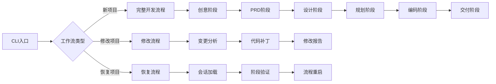
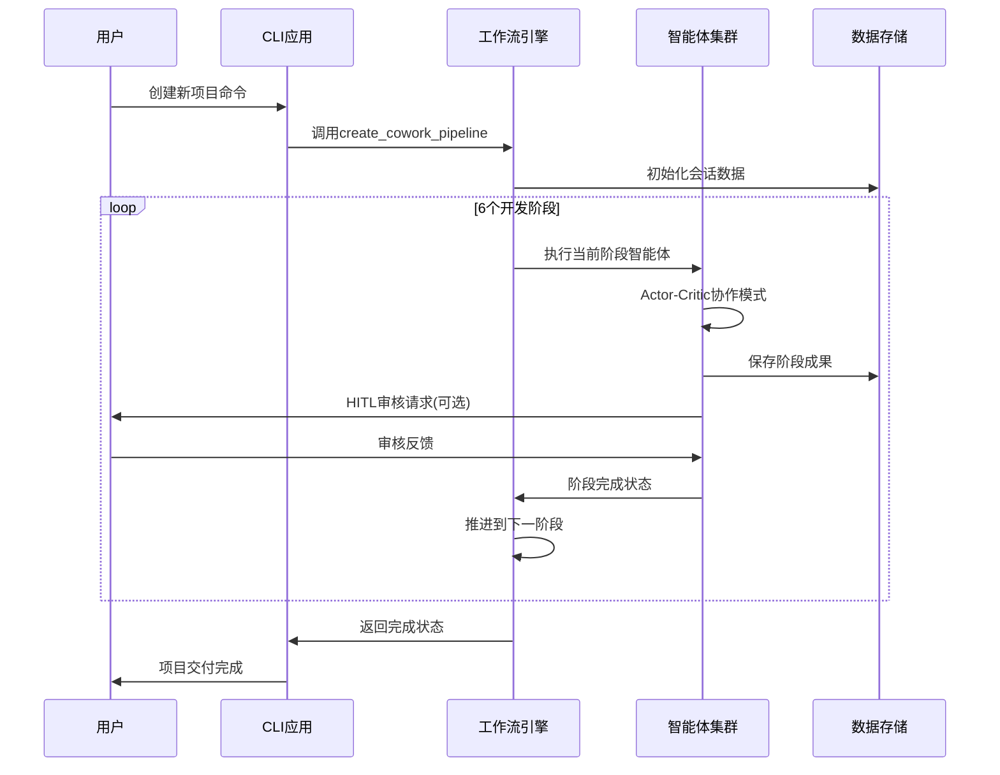
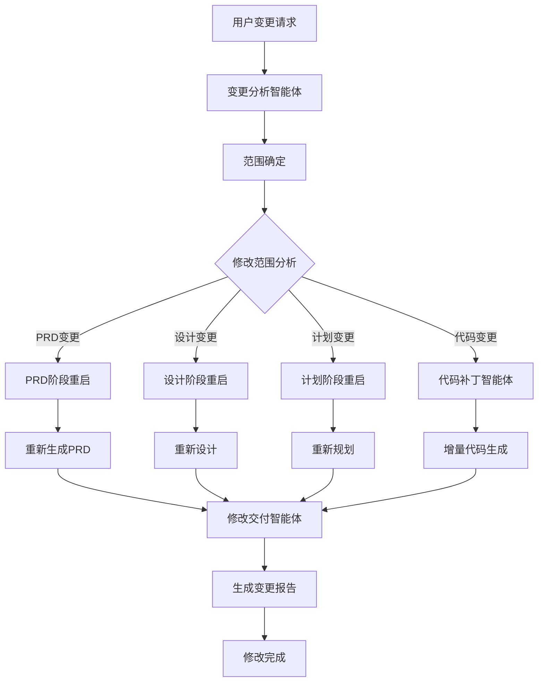
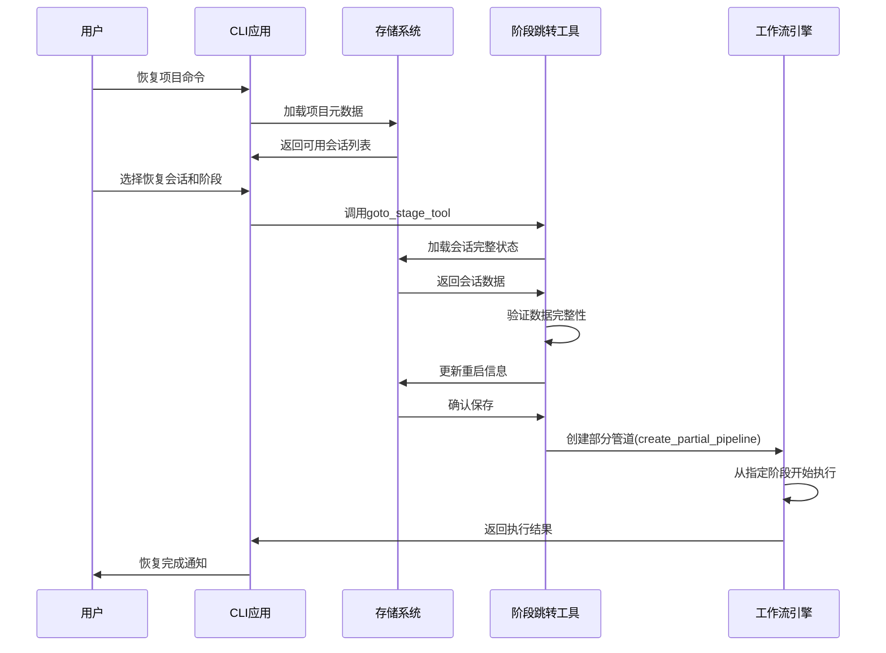
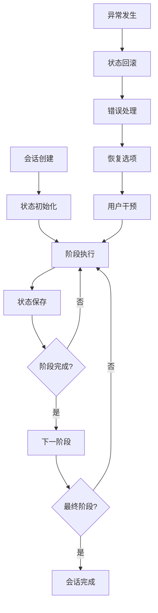
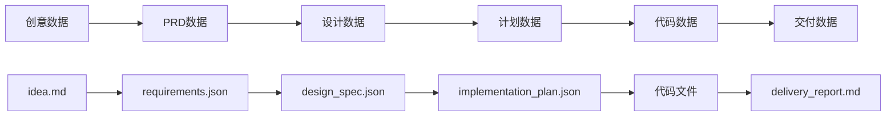
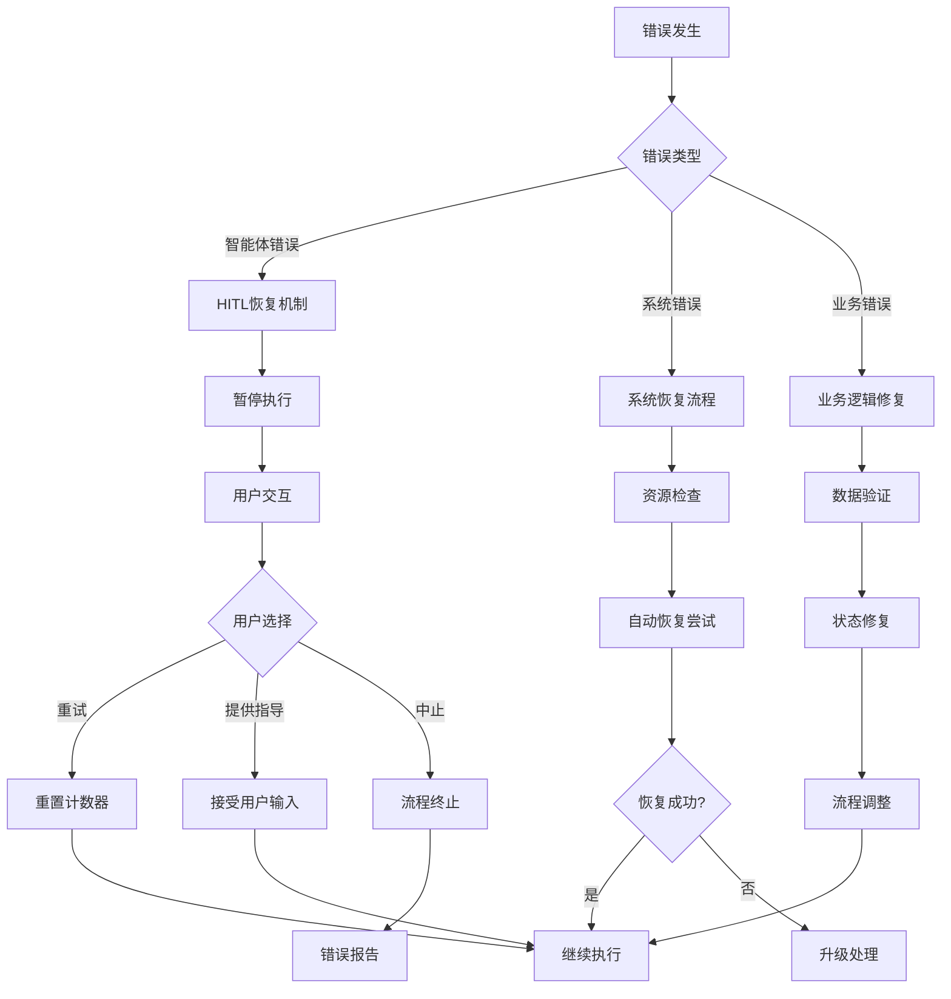
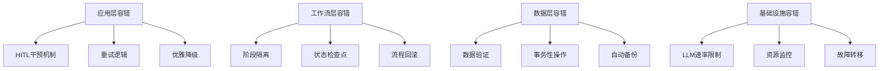
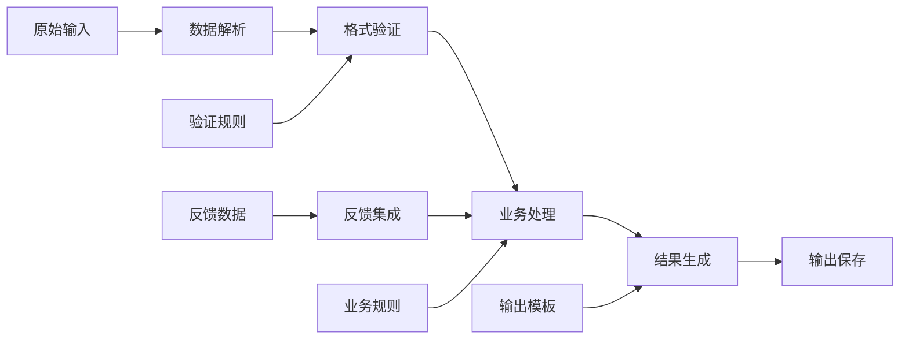

# 核心工作流文档

## 1. 工作流概览

### 1.1 系统主要工作流
Cowork Forge系统采用基于AI智能体的分层工作流架构，核心包含三大主要工作流：

**完整项目开发主工作流**：从项目创意到代码交付的端到端AI辅助开发流程，涵盖6个核心阶段：
- 创意收集（Idea阶段）
- 需求分析（PRD阶段）  
- 系统设计（Design阶段）
- 任务规划（Plan阶段）
- 代码实现（Coding阶段）
- 质量交付（Delivery阶段）

**项目修改工作流**：增量式变更处理流程，支持现有项目的修改和迭代
**项目恢复工作流**：中断恢复机制，支持从任意阶段继续执行

### 1.2 核心执行路径


### 1.3 关键流程节点
- **智能体执行节点**：各阶段AI智能体的具体执行逻辑
- **HITL交互节点**：人类参与循环的审核和干预点
- **状态保存节点**：会话状态和进度的持久化保存
- **验证检查节点**：数据格式、依赖关系的验证点

### 1.4 流程协调机制
系统采用**阶段执行器（StageExecutor）** 作为核心协调组件，具备以下特性：
- 顺序执行各工作流阶段
- 隔离智能体的升级标志，支持嵌套循环
- 状态持久化和恢复机制
- 异常处理和重试逻辑

## 2. 主要工作流详述

### 2.1 完整项目开发主工作流

#### 2.1.1 流程执行顺序和依赖关系


#### 2.1.2 各阶段详细流程

**阶段1：创意收集（Idea Agent）**
- **输入**：用户项目创意描述
- **处理过程**：
  1. 理解用户输入，创建结构化Markdown摘要
  2. 保存初始版本到`.cowork/sessions/<id>/artifacts/idea.md`
  3. 通过`ReviewAndEditContentTool`请求用户审核/编辑
  4. 强制保存用户编辑内容，防止数据丢失
  5. 最终化创意文档供PRD团队处理
- **输出**：标准化的项目创意文档
- **关键工具**：`SaveIdeaTool`, `LoadIdeaTool`, `ReviewAndEditContentTool`

**阶段2：PRD生成（PRD Agent - Actor-Critic模式）**
- **输入**：项目创意文档
- **处理过程**：
  1. **Actor角色**：从项目创意创建需求和特性
  2. 收集用户反馈，生成PRD文档
  3. **Critic角色**：验证Actor工作，执行简单性原则
  4. 7步工作流：创意加载→需求起草→用户审核→正式需求创建→文档保存→验证→反馈处理
  5. 防循环保护机制防止无限验证循环
- **输出**：产品需求文档（PRD）
- **数据存储**：`requirements.json`, `feature_list.json`

**阶段3：系统设计（Design Agent - Actor-Critic模式）**
- **输入**：PRD文档和需求规格
- **处理过程**：
  1. **Design Actor**：基于用户需求和反馈创建简单、最小化架构组件
  2. **Design Critic**：验证设计满足简单性标准（最多4个组件，最小技术栈）
  3. 强制执行简单优先原则
  4. 人类参与循环反馈集成
- **输出**：系统架构设计文档
- **验证检查**：`CheckFeatureCoverageTool`确保特性覆盖

**阶段4：任务规划（Plan Agent - Actor-Critic模式）**
- **输入**：设计规格文档
- **处理过程**：
  1. **Plan Actor**：基于设计规格创建实现任务，专注核心特性实现
  2. 排除测试、优化和部署任务
  3. **Plan Critic**：验证任务简单性、核心专注度和正确结构
  4. 健壮的错误处理和用户反馈集成
  5. 防循环保护机制
- **输出**：实现计划文档
- **验证检查**：`CheckTaskDependenciesTool`检测循环依赖

**阶段5：代码实现（Coding Agent - Actor-Critic模式）**
- **输入**：实现计划文档
- **处理过程**：
  1. **Coding Actor**：以实现简单性和最小化为重点实现任务
  2. **Coding Critic**：确保代码质量和完整性
  3. 自适应任务管理能力，基于实现发现创建/更新/删除任务
  4. 清晰的工作流规则和退出条件
- **输出**：生成的代码文件
- **关键工具**：文件操作工具集、命令执行工具

**阶段6：质量交付（Delivery Agent）**
- **输入**：所有阶段成果和生成的代码
- **处理过程**：
  1. 最终项目交付验证和报告生成
  2. 关键预检查系统：验证任务完成状态和实际代码文件存在性
  3. 协调多个数据源：需求、设计文档、任务计划、反馈历史
  4. 创建综合交付文档
  5. 严格验证逻辑：仅任务完成不足，需要具体代码文件证据
- **输出**：交付报告和完整项目代码
- **验证工具**：`CheckDataFormatTool`数据格式验证

### 2.2 项目修改工作流

#### 2.2.1 修改流程执行机制


#### 2.2.2 关键流程节点详述

**变更分析阶段（Change Triage Agent）**
- **输入**：用户变更请求描述
- **处理过程**：
  1. 分析变更请求，确定修改范围（需求、设计、计划、代码）
  2. 识别受影响组件，评估风险等级
  3. 创建结构化`ChangeRequest`对象
  4. 系统化变更分析工作流：范围确定→影响评估→接受标准提取
- **输出**：变更请求分析报告
- **数据存储**：通过`SaveChangeRequestTool`保存变更请求

**代码补丁阶段（Code Patch Agent）**
- **输入**：变更请求和基础代码
- **处理过程**：
  1. 基于`ChangeRequests`实现对现有代码库的增量变更
  2. 遵循代码修改工作流策略和最佳实践
  3. 使用可用工具实施代码修改
  4. 生成目标代码补丁
- **输出**：增量代码修改
- **关键能力**：精准的代码修改和版本管理

**修改交付阶段（Modify Delivery Agent）**
- **输入**：变更请求、补丁元数据、会话状态
- **处理过程**：
  1. 加载需求和设计规格
  2. 分析文件变更，读取修改文件
  3. 合并反馈历史
  4. 生成类似Pull Request格式的详细修改文档
- **输出**：结构化变更报告
- **报告内容**：添加/修改/删除文件、范围分析、实现详情、测试状态、会话信息

### 2.3 项目恢复工作流

#### 2.3.1 恢复机制设计


#### 2.3.2 关键恢复逻辑

**会话状态加载**
- 通过`storage::load_session_metadata`加载会话元数据
- 使用`storage::load_requirements`等函数加载各阶段数据
- 验证数据完整性和一致性

**阶段跳转执行**
- `GotoStageTool`处理阶段验证和重启逻辑
- 支持从PRD、设计、计划、编码阶段重启
- 维护会话上下文和状态连续性

**流程继续执行**
- `create_resume_pipeline`从最后完成阶段继续
- `create_partial_pipeline`从指定阶段开始
- 保持工作流状态的一致性

## 3. 流程协调与控制

### 3.1 多模块协调机制

#### 3.1.1 智能体协作模式
系统采用**Actor-Critic双智能体模式**实现质量保障：
- **Actor角色**：负责内容创建和执行
- **Critic角色**：负责质量验证和审核
- **循环迭代**：直到Critic批准或达到最大迭代次数

#### 3.1.2 工作流引擎协调
`StageExecutor`的核心协调功能：
```rust
pub struct StageExecutor {
    // 顺序执行阶段，隔离升级标志
    pub async fn execute_stages(&self, stages: Vec<Box<dyn Agent>>) -> Result<()>
}
```

**关键协调特性**：
- 阶段顺序执行保障
- 智能体状态隔离
- 嵌套循环支持（通过ExitLoopTool）
- 非终止性复杂多阶段工作流执行

### 3.2 状态管理与同步

#### 3.2.1 会话状态管理


#### 3.2.2 数据一致性保障
- **事务性操作**：关键操作具备原子性
- **状态验证**：阶段转换前的状态验证
- **数据备份**：重要状态的自动备份机制
- **恢复点**：关键节点创建恢复点

### 3.3 数据传递与共享

#### 3.3.1 阶段间数据流


#### 3.3.2 数据共享机制
- **标准化数据格式**：JSON格式的结构化数据存储
- **版本控制**：通过会话ID隔离不同版本
- **数据依赖管理**：显式声明和处理数据依赖关系
- **缓存策略**：频繁访问数据的缓存优化

### 3.4 执行控制与调度

#### 3.4.1 流程调度策略
**自适应调度机制**：
- 基于阶段完成状态的动态调度
- 优先级管理：关键路径优先
- 资源感知调度：考虑LLM速率限制和系统资源

#### 3.4.2 执行控制逻辑
```rust
// 流程执行控制伪代码
impl WorkflowScheduler {
    async fn schedule_workflow(&self, workflow_type: WorkflowType) -> Result<()> {
        match workflow_type {
            WorkflowType::FullDevelopment => self.execute_full_pipeline(),
            WorkflowType::Modification => self.execute_modify_pipeline(),
            WorkflowType::Resume => self.execute_resume_pipeline(),
        }
    }
}
```

## 4. 异常处理与恢复

### 4.1 错误检测与处理

#### 4.1.1 错误分类体系
**智能体执行错误**：
- LLM API调用失败
- 工具执行异常
- 数据验证失败
- 迭代次数超限

**系统级错误**：
- 文件系统错误
- 内存不足
- 网络连接问题
- 配置错误

**业务逻辑错误**：
- 数据不一致
- 工作流状态异常
- 用户输入无效

#### 4.1.2 错误处理机制


### 4.2 异常恢复机制

#### 4.2.1 HITL恢复机制（ResilientAgent）
**核心恢复逻辑**：
```rust
pub struct ResilientAgent {
    base_agent: Arc<dyn Agent>,
    max_retries: u32,
    current_attempt: AtomicU32,
}

impl ResilientAgent {
    // 错误恢复处理
    async fn handle_error(&self, error: &Error) -> RecoveryAction {
        if error.is_max_iterations() {
            self.prompt_user_for_guidance().await
        } else {
            RecoveryAction::Retry(self.current_attempt.load(Ordering::SeqCst))
        }
    }
}
```

**用户交互选项**：
1. **重试**：重置计数器，重新尝试执行
2. **提供指导并重试**：接受用户输入指导后重试
3. **中止**：终止当前流程，生成错误报告

#### 4.2.2 自动恢复策略
**会话状态恢复**：
- 自动检测和修复损坏的会话数据
- 从最近的有效状态点恢复
- 数据完整性验证和修复

**资源故障恢复**：
- LLM服务不可用时的备用策略
- 文件系统错误的自动处理
- 内存溢出的优雅降级

### 4.3 容错策略设计

#### 4.3.1 多层次容错架构


#### 4.3.2 关键容错机制
**智能体执行容错**：
- 最大迭代次数限制（防无限循环）
- 输出验证和过滤
- 执行超时控制

**数据操作容错**：
- 文件操作的原子性保障
- 数据格式的严格验证
- 操作失败的自动回滚

### 4.4 失败重试与降级

#### 4.4.1 智能重试策略
**自适应重试机制**：
- 基于错误类型的差异化重试策略
- 指数退避算法防止资源耗尽
- 最大重试次数限制

**重试上下文保持**：
- 保持会话状态跨重试周期
- 维护用户交互上下文
- 保存中间执行结果

#### 4.4.2 优雅降级方案
**功能降级策略**：
- LLM服务不可用时的本地处理模式
- 复杂功能的简化版本
- 关键路径优先保障

**性能降级策略**：
- 资源受限时的简化处理
- 批量操作的串行化执行
- 非关键功能的延迟执行

## 5. 关键流程实现

### 5.1 核心算法流程

#### 5.1.1 工作流执行引擎算法
```rust
// 阶段执行算法伪代码
impl StageExecutor {
    async fn execute_stages(&self, stages: Vec<Box<dyn Agent>>) -> Result<()> {
        for (index, stage) in stages.iter().enumerate() {
            // 阶段前置检查
            self.validate_stage_prerequisites(index).await?;
            
            // 执行当前阶段
            let result = self.execute_stage_with_recovery(stage).await;
            
            // 处理执行结果
            match result {
                Ok(_) => {
                    // 保存阶段状态
                    self.save_stage_progress(index).await?;
                    // 推进到下一阶段
                    continue;
                }
                Err(e) => {
                    // 错误处理和恢复
                    let recovery_action = self.handle_stage_error(e, index).await?;
                    match recovery_action {
                        RecoveryAction::Retry(_) => continue, // 重试当前阶段
                        RecoveryAction::Abort => break, // 中止流程
                        RecoveryAction::Skip => continue, // 跳过当前阶段
                    }
                }
            }
        }
        Ok(())
    }
}
```

#### 5.1.2 智能体协作算法
**Actor-Critic模式实现**：
```rust
async fn execute_actor_critic_workflow(
    actor: Box<dyn Agent>,
    critic: Box<dyn Agent>,
    max_iterations: u32
) -> Result<WorkflowResult> {
    let mut iteration = 0;
    
    while iteration < max_iterations {
        // Actor生成内容
        let actor_result = actor.execute().await?;
        
        // Critic验证内容
        let critic_result = critic.execute_with_input(actor_result.output()).await?;
        
        if critic_result.is_approved() {
            return Ok(WorkflowResult::success(actor_result));
        }
        
        // 基于Critic反馈优化
        let feedback = critic_result.feedback();
        actor.integrate_feedback(feedback).await?;
        
        iteration += 1;
    }
    
    Err(Error::MaxIterationsReached(max_iterations))
}
```

### 5.2 数据处理流水线

#### 5.2.1 数据流转和处理流程


#### 5.2.2 数据验证流水线
**多级验证机制**：
1. **格式验证**：JSON Schema验证、数据格式检查
2. **业务规则验证**：特性覆盖检查、任务依赖验证
3. **完整性验证**：数据关联性检查、引用完整性
4. **一致性验证**：跨阶段数据一致性验证

### 5.3 业务规则执行

#### 5.3.1 核心业务规则集
**简单性原则**：
- 设计阶段最多4个组件
- 最小化技术栈选择
- 核心功能优先实现

**质量保障规则**：
- 所有特性必须被设计覆盖
- 任务依赖不能形成循环
- 代码文件必须实际存在

**工作流控制规则**：
- 阶段顺序执行约束
- HITL审核触发条件
- 异常处理 escalation 规则

#### 5.3.2 规则执行引擎
```rust
// 业务规则执行伪代码
impl RuleEngine {
    async fn validate_design_rules(&self, design: &DesignSpec) -> Result<ValidationResult> {
        // 组件数量规则
        if design.components.len() > 4 {
            return Err(Error::ValidationFailed("设计组件不能超过4个".to_string()));
        }
        
        // 技术栈最小化规则
        if design.tech_stack.len() > 3 {
            return Err(Error::ValidationFailed("技术栈应保持最小化".to_string()));
        }
        
        // 特性覆盖规则
        self.validate_feature_coverage(design).await?;
        
        Ok(ValidationResult::valid())
    }
}
```

### 5.4 技术实现细节

#### 5.4.1 并发处理实现
**LLM调用并发控制**：
```rust
// 速率限制器实现
pub struct RateLimiter<L: Llm> {
    inner: L,
    delay: Duration,
}

#[async_trait]
impl<L: Llm> Llm for RateLimiter<L> {
    async fn complete(&self, prompt: &str) -> Result<String> {
        // 速率限制控制
        tokio::time::sleep(self.delay).await;
        self.inner.complete(prompt).await
    }
}
```

**异步任务管理**：
- 使用Tokio运行时管理异步任务
- 智能体执行的并发控制
- 资源竞争的公平调度

#### 5.4.2 性能优化策略
**缓存优化**：
- 频繁访问数据的内存缓存
- LLM响应的本地缓存
- 会话状态的快速加载

**资源管理**：
- 连接池管理（LLM客户端）
- 内存使用监控和优化
- 文件IO的批量处理

**执行优化**：
- 懒加载数据减少内存占用
- 并行处理独立任务
- 增量更新避免全量处理

---

## 文档总结

本核心工作流文档详细描述了Cowork Forge系统的三大核心工作流及其实现机制。系统通过精心的流程设计、健壮的异常处理和完善的恢复机制，确保了AI辅助开发流程的可靠性和用户体验。

**核心价值体现**：
1. **自动化效率**：通过AI智能体协作大幅减少人工编码工作量
2. **质量保障**：Actor-Critic模式和HITL机制确保输出质量
3. **灵活性**：支持完整开发、增量修改和流程恢复多种模式
4. **可靠性**：多层次容错和恢复机制保障系统稳定性

该文档为开发团队提供了清晰的流程实现指导，为运维团队提供了流程监控和故障排查依据，为新团队成员提供了快速理解系统的工作流知识基础。