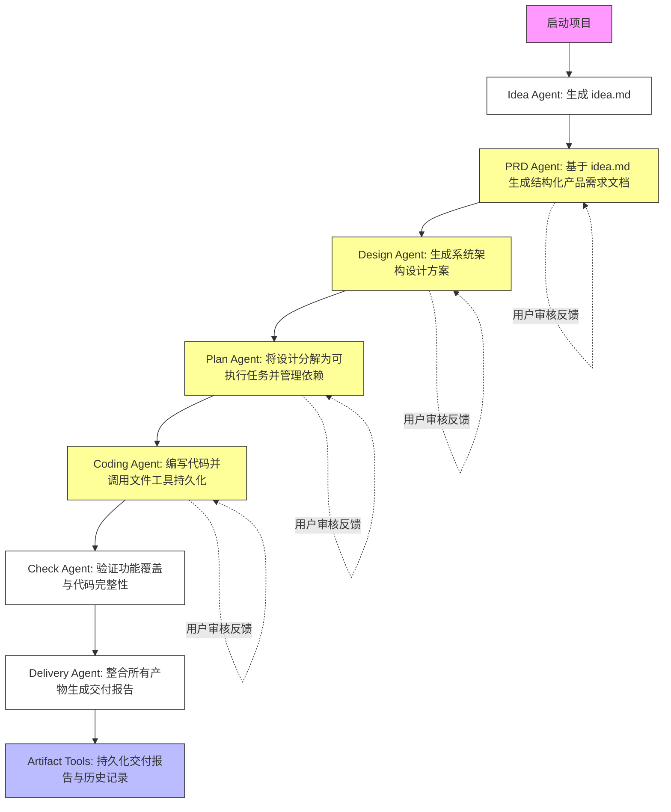
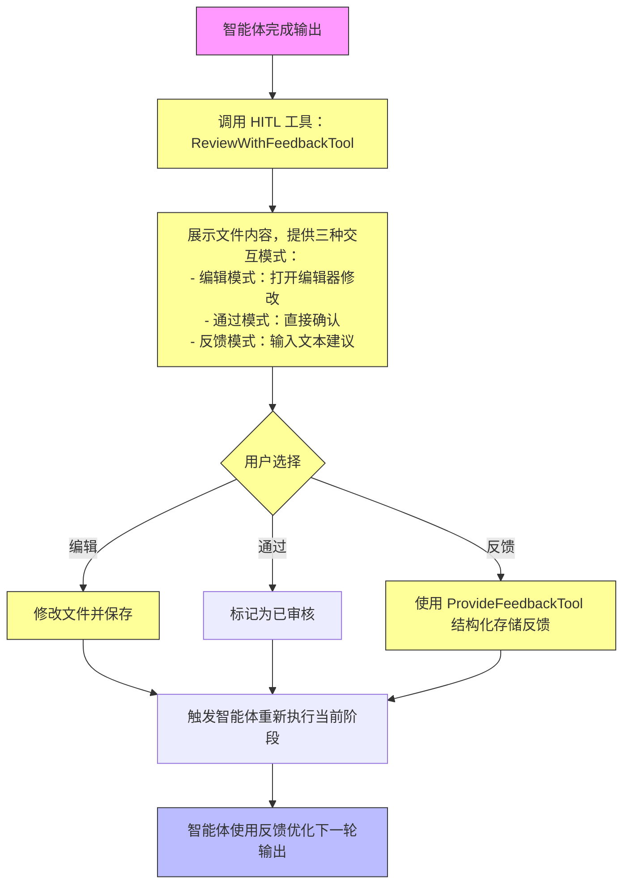

# Core Workflows

## 1. Workflow Overview

Cowork Forge 是一个基于多智能体协作的AI自动化软件开发系统，通过结构化的工作流将用户模糊的项目构想转化为可交付的软件产品。系统采用分层架构设计，核心价值在于实现**人机协同的端到端自动化开发闭环**，显著降低重复性工作成本，提升交付质量与一致性。

### 系统主工作流
系统的核心工作流是一个**七阶段顺序流水线**，由AI智能体驱动，辅以人类在环（HITL）审核与工具验证，形成完整的开发闭环：
1. **Idea Agent**：捕获用户初始构想，生成`idea.md`
2. **PRD Agent**：基于`idea.md`生成结构化产品需求文档
3. **Design Agent**：根据需求设计系统架构方案
4. **Plan Agent**：将架构分解为可执行的开发任务
5. **Coding Agent**：编写代码并持久化到文件系统
6. **Check Agent**：进行最小化质量校验
7. **Delivery Agent**：整合所有产物生成最终交付报告

### 核心执行路径
系统存在三条关键执行路径：
- **完整开发路径**：从`new`命令启动，依次执行全部七个阶段。
- **恢复开发路径**：从`resume`命令启动，系统自动检测`.cowork/`目录中的历史产物，智能判断恢复点（PRD、design、plan或coding），跳过已完成阶段。
- **中断恢复路径**：从`modify --from <stage>`命令启动，用户可指定任意前置阶段（PRD、design、plan、coding）作为新起点，系统清理后续产物并重启流水线。

### 关键流程节点
系统包含五个关键的流程节点，是实现人机协同的核心：
1. **HITL审核节点**：在PRD、Design、Plan、Coding四个阶段的输出后，调用HITL工具邀请用户审查。
2. **状态检测节点**：在`resume`和`pipeline`启动时，扫描`.cowork/`目录，识别已有产物以确定当前状态。
3. **文件存在性验证节点**：在Delivery Agent执行前，必须验证实际代码文件（如`index.html`）的存在，而非仅依赖任务状态。
4. **阶段恢复节点**：通过`GotoStageTool`，允许在Check Agent发现严重问题时，回退到任意前置阶段。
5. **限流节点**：在LLM调用前，通过`RateLimiter`强制插入延迟，确保API调用符合配额。

### 流程协调机制
系统通过**工具模式（Tool Pattern）**实现模块间解耦与协调：
- **智能体编排层**（Pipeline/Agents）定义流程顺序，不直接操作数据。
- **功能工具层**（Tools）提供原子化操作（文件读写、数据CRUD、验证、用户交互），被智能体调用。
- **持久化存储层**（Storage）作为唯一可信数据源，所有工具通过`save_json`/`load_json`读写`.cowork/`目录下的JSON文件。
- **数据模型层**（Models）定义了所有数据结构的契约（如`Requirement`, `Feature`, `Task`），确保各层数据格式一致。

## 2. Main Workflows

### 核心业务流程：从构想到交付的完整开发流程

该流程是系统的核心价值实现路径，覆盖从用户原始想法到可交付软件产品的全过程。

**执行顺序与依赖关系**：
1. **Idea Agent**（输入：用户初始构想） → 生成`idea.md`（输出）
2. **PRD Agent**（输入：`idea.md`） → 生成结构化`requirements.json`和`feature_list.json`（输出）
3. **Design Agent**（输入：`requirements.json`, `feature_list.json`） → 生成`design_spec.json`（输出）
4. **Plan Agent**（输入：`design_spec.json`） → 生成`implementation_plan.json`（输出）
5. **Coding Agent**（输入：`implementation_plan.json`） → 生成实际代码文件（如`index.html`, `script.js`）（输出）
6. **Check Agent**（输入：`requirements.json`, `feature_list.json`, `design_spec.json`, `implementation_plan.json`, 代码文件） → 验证完整性，输出通过/失败
7. **Delivery Agent**（输入：所有上述产物） → 生成`delivery_report.md`（输出）

**关键输入/输出数据流**：
- **输入**：每个阶段的输入均为前一阶段的输出产物（JSON文件或Markdown文档）。
- **输出**：每个阶段的输出均为结构化数据（JSON）或文档（Markdown），并被持久化到`.cowork/`目录。
- **数据流**：`idea.md` → `requirements.json` → `design_spec.json` → `implementation_plan.json` → 代码文件 → `delivery_report.md`

**技术实现细节**：
- **智能体编排**：由`pipeline/mod.rs`中的`create_cowork_pipeline()`函数构建，使用`SequentialAgent`将七个智能体串联。
- **HITL集成**：在PRD、Design、Plan、Coding阶段，智能体在生成草稿后，会调用`ReviewWithFeedbackTool`工具，暂停流程，等待用户交互。
- **工具调用**：Coding Agent通过`WriteFileTool`直接写入代码文件，而非通过数据模型层，实现了代码生成的“直写”模式。
- **状态管理**：所有状态变更（如任务完成）都通过`update_task_status()`等工具更新`implementation_plan.json`，确保状态与文件系统同步。

**业务价值**：
- **自动化**：将原本需要数天的人工需求分析、架构设计、任务拆解工作，压缩为数分钟的AI生成。
- **一致性**：所有输出均遵循预设的模板和结构，确保团队交付物风格统一。
- **可追溯**：所有中间产物（`idea.md`, `prd_draft.md`, `design_draft.md`）都被保留，形成完整的开发审计日志。

### 关键技术流程：人工审核与反馈流程

该流程是保障输出质量与符合业务意图的核心人机协同机制，贯穿于PRD、Design、Plan、Coding四个关键阶段。

**执行顺序**：
1. **智能体输出**：PRD、Design、Plan或Coding Agent完成草稿生成（如`prd_draft.md`）。
2. **调用HITL工具**：智能体调用`ReviewWithFeedbackTool`，传入文件路径和提示语。
3. **用户交互**：工具展示文件内容预览，并提供三种交互模式：
   - **编辑模式**：用户输入`edit`，打开默认编辑器（如VSCode）修改文件。
   - **通过模式**：用户输入`pass`，确认无修改，流程继续。
   - **反馈模式**：用户输入文本建议（如“需求太多，合并为4个”），反馈被原样捕获。
4. **反馈处理**：
   - 若为`edit`，工具保存修改后的文件，智能体读取新内容继续。
   - 若为`pass`，工具返回`{action: \"pass\"}`，智能体直接进入下一阶段。
   - 若为`feedback`，工具返回`{action: \"feedback\", feedback: \"...\"}`，智能体在下一轮迭代中，将此反馈作为上下文，重新生成草稿。
5. **反馈持久化**：`ProvideFeedbackTool`将结构化反馈（类型、严重性、详情）存入`feedback_history.json`，供后续智能体参考。

**技术实现细节**：
- **工具实现**：`hitl_tools.rs`中的`ReviewWithFeedbackTool`使用`dialoguer`库实现CLI交互，支持`Input`和`Editor`。
- **反馈结构化**：`control_tools.rs`中的`ProvideFeedbackTool`定义了`feedback_type`（`build_error`, `quality_issue`, `missing_requirement`, `suggestion`）和`severity`（`critical`, `major`, `minor`）的枚举，确保反馈可被机器解析。
- **迭代机制**：智能体（如`LoopAgent`）通过`with_max_iterations(1)`实现单次迭代，避免无限循环，每次迭代都基于最新的文件内容和反馈历史。

**业务价值**：
- **质量保障**：确保AI生成的产物符合人类专家的业务意图，避免“自嗨式”输出。
- **灵活调整**：用户可以在任何阶段介入，无需重启整个流程。
- **知识沉淀**：反馈历史被持久化，形成团队的“决策日志”，可用于后续项目复盘。

## 3. Flow Coordination and Control

### 多模块协调机制

系统采用**分层解耦、工具驱动**的协调机制，确保高内聚、低耦合。

1. **智能体编排层**（Pipeline/Agents）：
   - **职责**：定义流程顺序和智能体生命周期。
   - **协调方式**：通过`SequentialAgent`串联智能体。每个智能体在执行时，通过调用`Tool`来完成具体任务，而非直接操作其他模块。
   - **示例**：`create_cowork_pipeline()`函数在`pipeline/mod.rs`中，将`IdeaAgent`、`PRDLoop`、`DesignLoop`等按顺序组装成一个`SequentialAgent`。

2. **功能工具层**（Tools）：
   - **职责**：提供原子化、安全的执行单元。
   - **协调方式**：所有工具实现`adk_core::Tool` trait，被智能体通过`tool(Arc::new(WriteFileTool))`注入。工具之间无直接依赖，通过共享的`.cowork/`目录进行数据交换。
   - **示例**：`Coding Agent`调用`WriteFileTool`写入`index.html`，`Delivery Agent`调用`ListFilesTool`检查该文件是否存在。

3. **持久化存储层**（Storage）：
   - **职责**：作为唯一的、可信的数据源。
   - **协调方式**：所有工具（如`WriteFileTool`, `CreateRequirementTool`）最终都通过`storage/mod.rs`中的`save_json()`函数将数据写入`.cowork/`目录下的JSON文件。所有智能体通过`load_json()`读取数据。
   - **示例**：`PRD Agent`调用`CreateRequirementTool`，该工具内部调用`save_requirements()`，将新需求写入`requirements.json`。`Design Agent`随后调用`get_requirements()`，内部调用`load_requirements()`读取。

4. **数据模型层**（Models）：
   - **职责**：定义数据契约。
   - **协调方式**：所有工具和智能体都基于`data/models.rs`中定义的`Requirement`, `Feature`, `Task`等结构体进行序列化和反序列化，确保数据格式在各层间完全一致。

### 状态管理与同步

系统采用**文件系统作为状态存储**的轻量级方案，实现状态的持久化与同步。

- **状态定义**：系统状态由`.cowork/`目录下的多个JSON文件共同定义：
  - `requirements.json`: 需求状态
  - `feature_list.json`: 特性状态
  - `design_spec.json`: 架构状态
  - `implementation_plan.json`: 任务状态
  - `session/meta.json`: 会话元数据（当前阶段、重启原因）
  - `artifacts/`: 所有Markdown草稿和最终报告

- **状态同步**：
  - **写入**：当一个工具（如`CreateTaskTool`）更新`implementation_plan.json`时，它会调用`save_implementation_plan()`，该函数会确保父目录存在并原子性地写入文件。
  - **读取**：下一个智能体（如`Coding Agent`）在执行时，会调用`load_implementation_plan()`，读取最新的状态。
  - **一致性**：由于所有操作都是顺序执行的（单线程），且文件系统是原子写入，因此状态在任何时刻都是强一致的。

### 数据传递与共享

数据传递完全通过**文件系统**进行，而非内存或数据库。

- **传递方式**：上游智能体的输出是文件，下游智能体的输入是读取这些文件。
- **共享机制**：所有智能体共享同一个`.cowork/`目录。例如：
  - `Idea Agent`创建`artifacts/idea.md`
  - `PRD Agent`读取`artifacts/idea.md`，并创建`data/requirements.json`
  - `Design Agent`读取`data/requirements.json`，并创建`data/design_spec.json`
- **优势**：
  - **简单可靠**：无需复杂的IPC或网络通信。
  - **可审计**：所有中间产物都以人类可读的格式（JSON, Markdown）保存。
  - **可恢复**：即使系统崩溃，重启后也能从文件中恢复状态。

### 执行控制与调度

执行控制由`pipeline/mod.rs`中的`SequentialAgent`和`LoopAgent`实现。

- **顺序调度**：`SequentialAgent`按预设顺序依次调用每个子智能体，只有当前智能体完成，才会启动下一个。
- **循环调度**：对于需要迭代的阶段（如PRD、Design），使用`LoopAgent`。`LoopAgent`内部包含一个Actor和一个Critic智能体，它们交替执行，直到达到`max_iterations`（通常为1）。
- **中断控制**：`GotoStageTool`是唯一的“中断”工具。当Check Agent发现严重问题时，它会调用`goto_stage(stage: \"design\")`，该工具会更新`session/meta.json`中的`current_stage`字段，但**不立即中断**。真正的中断和重启发生在用户重新执行`modify --from design`命令时，由CLI重新构建流水线。

## 4. Exception Handling and Recovery

### 错误检测与处理

系统采用**分层错误处理**策略，确保健壮性。

1. **工具层**：
   - 所有工具（`Tool`）的`execute()`方法返回`adk_core::Result<Value>`。
   - 在执行文件操作时，使用`anyhow::Context`提供清晰的错误上下文，如`Failed to read file .cowork/artifacts/idea.md: No such file or directory`。
   - 文件路径安全验证：`file_tools.rs`中的工具会检查路径是否包含`..`或绝对路径，防止路径穿越攻击。

2. **智能体层**：
   - 智能体在调用工具失败时，会将错误作为上下文传递给LLM，让LLM自行判断如何处理（如“文件不存在，请检查路径”）。
   - `Check Agent`和`Delivery Agent`是主要的“质量门禁”节点，它们会主动检测异常：
     - `Check Agent`：如果`check_feature_coverage()`失败，会返回“某些特性未被覆盖”。
     - `Delivery Agent`：如果`list_files()`返回空，会直接拒绝生成报告，输出`❌ Project incomplete: No code files found...`。

3. **流水线层**：
   - `pipeline/mod.rs`中的`create_resume_pipeline()`和`create_partial_pipeline()`会主动检查`.cowork/`目录是否存在，若不存在则报错`No project found`。
   - `create_partial_pipeline()`会验证`start_stage`参数是否为合法阶段（`prd`, `design`, `plan`, `coding`），否则报错`Unknown stage`。

### 异常恢复机制

系统提供了**多级恢复机制**，是其核心竞争力。

1. **阶段恢复（GotoStage）**：
   - **触发**：当`Check Agent`发现严重问题（如架构设计不合理）时，它会调用`GotoStageTool`。
   - **执行**：`GotoStageTool`会更新`session/meta.json`，将`current_stage`设置为指定阶段（如`design`），并记录`restart_reason`。
   - **重启**：用户必须手动执行`cowork modify --from design`。此时，CLI会调用`create_partial_pipeline(config, \"design\")`，该函数会：
     - 清理`data/design_spec.json`、`implementation_plan.json`、`code_metadata.json`等后续阶段的产物。
     - 重置`session/meta.json`中的`current_stage`。
     - 从`design`阶段重新启动流水线。

2. **自动恢复（Resume）**：
   - **触发**：用户执行`cowork resume`。
   - **执行**：`create_resume_pipeline()`会扫描`.cowork/`目录：
     - 如果`delivery_report.md`存在 → 报错“项目已完成”。
     - 如果`implementation_plan.json`存在 → 从`coding`阶段恢复。
     - 如果`design_spec.json`存在 → 从`plan`阶段恢复。
     - 如果`requirements.json`存在 → 从`design`阶段恢复。
     - 否则 → 从`prd`阶段恢复。
   - **优势**：无需用户手动判断恢复点，系统智能决策。

3. **失败重试**：
   - **LLM调用失败**：`RateLimiter`会自动处理API限流，通过延迟重试。
   - **文件读写失败**：工具会抛出错误，由智能体在下一轮迭代中尝试重新读取或处理。

### 容错策略设计

1. **“最小化验证”原则**：`Check Agent`的设计哲学是“**Be lenient! If structure is complete, approve it!**”。它不追求100%测试覆盖率，而是验证“基本结构是否完整”，避免因过度校验导致流程卡死。
2. **“文件存在性”验证**：`Delivery Agent`不信任任务状态，只信任`list_files()`的结果。这确保了“任务已标记完成”但“代码未写”的虚假状态不会被误认为是交付。
3. **“非交互式”设计**：`Idea Agent`等智能体被设计为“不能与用户对话”，必须通过`review_and_edit_file`工具进行交互，这强制了流程的标准化，避免了AI陷入无休止的问答循环。

### 失败重试与降级

- **重试**：系统默认不实现自动重试。LLM调用失败（如网络超时）会导致智能体执行失败，用户需手动重新执行命令。
- **降级**：系统没有显式的降级策略。其“降级”体现在`Check Agent`的“最小化验证”上，当无法进行深度校验时，它选择“通过”而非“失败”，保证流程能继续。

## 5. Key Process Implementation

### 核心算法流程：智能体迭代与反馈闭环

该流程是系统智能化的核心，体现在PRD、Design、Plan、Coding四个Loop Agent中。

**算法步骤**：
1. **初始化**：智能体（如`PRD Actor`）读取上游输入（`idea.md`）。
2. **生成草稿**：调用`write_file()`生成一个草稿文件（`prd_draft.md`）。
3. **HITL交互**：调用`ReviewWithFeedbackTool`，等待用户输入。
4. **反馈处理**：
   - **输入为`edit`**：工具保存修改，智能体读取新草稿，进入步骤2。
   - **输入为`pass`**：工具返回`{action: \"pass\"}`，智能体进入步骤5。
   - **输入为`feedback`**：工具返回`{action: \"feedback\", feedback: \"...\"}`，智能体将此反馈作为新的上下文，进入步骤2。
5. **生成正式输出**：调用`create_requirement()`、`add_feature()`等工具，将草稿内容转化为结构化数据（`requirements.json`）。
6. **结束**：`PRD Critic`调用`get_requirements()`进行验证，若通过，则结束。

**关键算法细节**：
- **`max_iterations=1`**：为了解决`adk-rust`中`LoopAgent`的致命bug（子智能体退出会终止整个序列），系统采用`max_iterations=1`的“伪循环”策略。每次迭代都是一个独立的`SequentialAgent`执行，通过文件系统传递状态，实现逻辑上的循环。
- **反馈作为上下文**：LLM的提示词（`PRD_ACTOR_INSTRUCTION`）明确要求智能体“**Revise the draft based on feedback**”，这使得反馈不是简单的注释，而是成为下一轮生成的“输入”。

### 数据处理管道

系统的数据处理管道是一个**“文件系统管道”**，数据在各阶段间流动。

1. **输入阶段**：`Idea Agent`接收用户输入（CLI参数）。
2. **转换阶段**：
   - `PRD Agent`：将自然语言`idea.md` → 结构化`requirements.json`。
   - `Design Agent`：将`requirements.json` → `design_spec.json`。
   - `Plan Agent`：将`design_spec.json` → `implementation_plan.json`。
3. **执行阶段**：`Coding Agent`将`implementation_plan.json` → 实际代码文件。
4. **验证阶段**：`Check Agent`读取所有JSON和代码文件，进行一致性检查。
5. **输出阶段**：`Delivery Agent`将所有数据聚合，生成`delivery_report.md`。

**数据处理特点**：
- **无内存缓存**：所有数据都持久化到磁盘，避免了内存泄漏和状态丢失。
- **JSON Schema**：虽然`schemas.rs`是占位符，但`models.rs`中的结构体定义了事实上的Schema，确保数据格式正确。
- **增量更新**：工具（如`UpdateTaskStatusTool`）只更新`implementation_plan.json`中的特定字段，而非重写整个文件。

### 业务规则执行

系统通过**指令集（Instructions）**将业务规则编码为LLM的提示词。

- **PRD业务规则**：
  - `PRD_ACTOR_INSTRUCTION`：要求必须先生成草稿，再经过HITL审核，才能生成正式需求。
  - `PRD_CRITIC_INSTRUCTION`：要求只能使用`get_requirements()`获取数据，禁止读取文件，确保验证的简洁性。
- **Design业务规则**：
  - `DESIGN_ACTOR_INSTRUCTION`：要求组件数量必须在2-6个之间。
  - `DESIGN_CRITIC_INSTRUCTION`：要求验证所有特性都被组件覆盖。
- **Coding业务规则**：
  - `CODING_ACTOR_INSTRUCTION`：要求代码必须“简单、干净”，禁止过度工程化。
  - `CODING_CRITIC_INSTRUCTION`：要求必须验证`list_files()`结果，确保文件真实存在。
- **Delivery业务规则**：
  - `DELIVERY_AGENT_INSTRUCTION`：**核心规则**：“**Task status alone is NOT enough - verify actual implementation!**”。这是系统最核心的业务规则，防止了“虚假完成”。

### 技术实现细节

1. **LLM限流**：`rate_limiter.rs`中的`RateLimitedLlm`包装器，在每次`generate_content()`调用前插入`sleep(Duration::from_millis(2000))`，确保每分钟不超过30次调用，符合OpenAI的免费配额。
2. **安全文件操作**：`file_tools.rs`中的`WriteFileTool`会检查路径是否包含`..`或绝对路径，防止路径穿越。`RunCommandTool`会阻止`rm`, `kill`等危险命令。
3. **会话管理**：`storage/mod.rs`中的`SessionMeta`结构体记录了`current_stage`和`restart_reason`，是实现`modify`和`resume`功能的关键。
4. **异步执行**：所有工具和智能体都使用`async_trait`，确保I/O操作（文件读写、LLM调用）不会阻塞主线程。
5. **日志与调试**：`main.rs`通过`tracing`库提供不同级别的日志，`verbose`模式可查看`adk`内部的详细执行过程，便于调试。

该系统通过精妙的架构设计，将复杂的AI开发流程转化为一个稳定、可靠、可审计的自动化流水线，为软件开发团队提供了前所未有的效率提升。