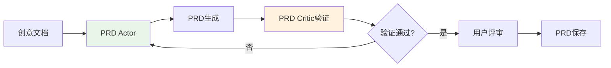
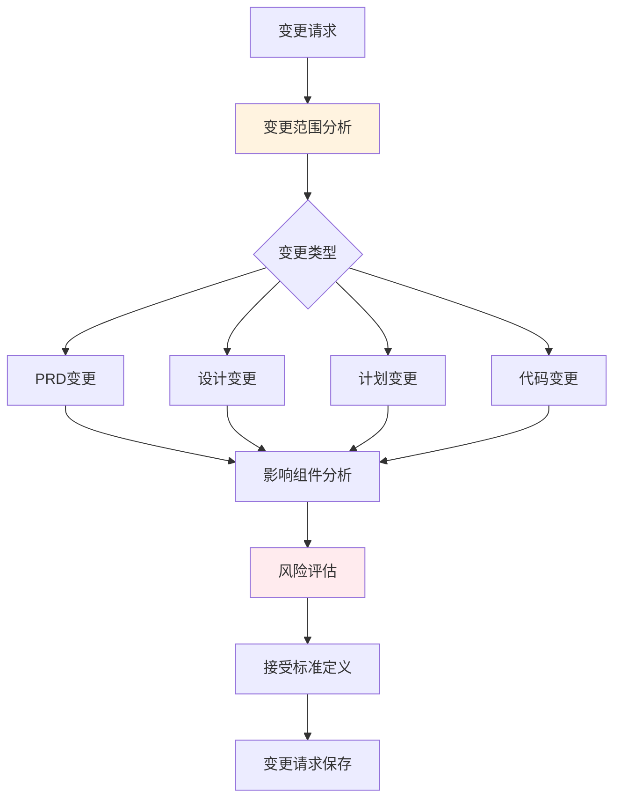
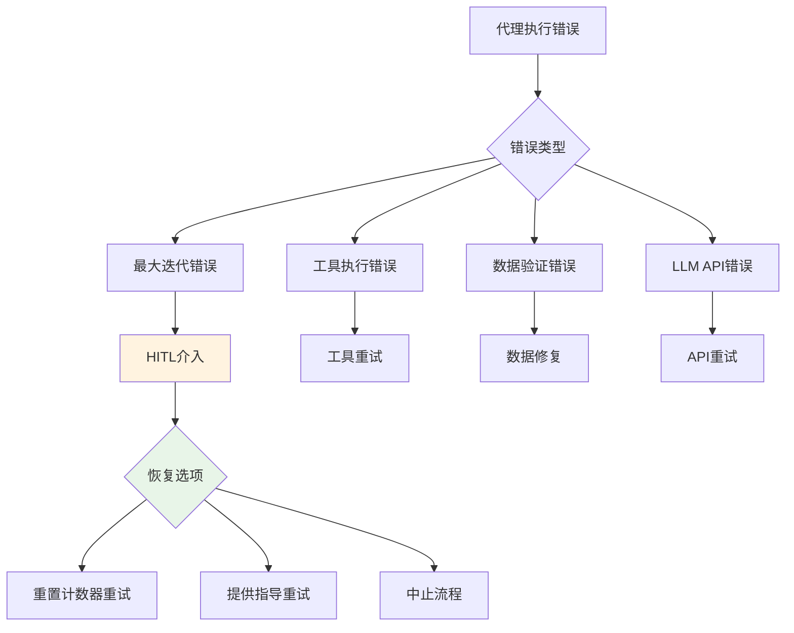

# Core Workflows

## 1. Workflow Overview

Cowork Forge系统采用基于AI代理协作的软件开发编排架构，通过智能化的流程管理实现从创意到交付的完整软件开发自动化。系统核心工作流采用分层设计，结合Actor-Critic模式和Human-in-the-Loop机制，确保每个开发阶段的质量控制和用户参与。

### 1.1 系统主要工作流
- **新项目开发流程**：完整的软件开发生命周期，从创意采集到项目交付
- **项目修改流程**：增量变更处理流程，支持现有项目的精确修改
- **流程恢复流程**：错误恢复和阶段跳转机制，提供灵活的流程控制

### 1.2 核心执行路径
```
创意采集 → PRD生成 → 架构设计 → 任务规划 → 编码实施 → 质量检查 → 项目交付
```

### 1.3 关键流程节点
- **Human-in-the-Loop审核点**：PRD评审、设计评审、计划评审
- **质量检查点**：结构完整性检查、代码质量验证、交付前验证
- **状态转换点**：阶段完成确认、错误恢复触发、流程继续

### 1.4 流程协调机制
系统采用管道编排器(Pipeline Orchestrator)作为核心协调组件，通过智能代理工厂创建和管理各个开发阶段的代理实例，实现流程的自动化协调和控制。

```mermaid
graph TB
   [CLI命令输入] --> B[管道编排器]
    B --> C[代理工厂]
    C --> D[创意代理]
    D --> E[PRD代理]
    E --> F[设计代理]
    F --> G[规划代理]
    G --> H[编码代理]
    H --> I[交付代理]
    
    E --> E1[用户评审]
    F --> F1[架构评审]
    G --> G1[计划评审]
    
    E1 --> E
    F1 --> F
    G1 --> G
    
    style B fill:#e3f2fd
    style C fill:#f3e5f5
```

## 2. Main Workflows

### 2.1 新项目开发流程

新项目开发流程是系统的核心业务流程，采用阶段式瀑布模型与敏捷迭代相结合的方式，确保开发过程的规范性和灵活性。

#### 2.1.1 创意采集阶段（Idea Agent）
**执行入口**：`crates/cowork-core/src/instructions/idea.rs`

**核心流程**：
1. **创意理解**：解析用户输入的创意描述，提取关键需求要素
2. **结构化处理**：按照预定义模板将创意转换为结构化文档
3. **文档保存**：使用SaveIdeaTool保存idea.md文档到会话目录
4. **非交互处理**：强调一次性理解，避免问答循环

**关键工具**：
- SaveIdeaTool：创意文档保存
- LoadIdeaTool：创意文档加载

**数据流**：
```
用户输入 → 创意解析 → 结构化处理 → idea.md保存 → 用户评审
```

#### 2.1.2 PRD生成阶段（PRD Agent）
**执行入口**：`crates/cowork-core/src/instructions/prd.rs`

**Actor-Critic模式**：
- **PRD Actor**：负责需求分析和PRD文档生成
- **PRD Critic**：作为守门员验证生成内容的质量和完整性

**核心流程**：
1. **需求分析**：基于创意文档提取产品需求和功能特性
2. **PRD生成**：创建标准化的产品需求文档
3. **用户验证**：强制性的HITL评审步骤，确保需求准确性
4. **文档持久化**：使用SavePrdDocTool保存最终PRD



#### 2.1.3 架构设计阶段（Design Agent）
**执行入口**：`crates/cowork-core/src/instructions/design.rs`

**核心流程**：
1. **需求加载**：读取PRD文档作为设计输入
2. **架构草稿**：创建系统架构初步设计
3. **用户反馈整合**：通过HITL机制收集用户反馈
4. **正式设计生成**：基于反馈完善架构设计
5. **设计验证**：Design Critic验证设计完整性和质量
6. **文档保存**：保存设计文档到项目仓库

**关键技术特性**：
- 支持架构组件识别和技术选型
- 提供系统交互设计和数据流规划
- 集成设计模式和最佳实践

#### 2.1.4 任务规划阶段（Plan Agent）
**执行入口**：`crates/cowork-core/src/instructions/plan.rs`

**核心流程**：
1. **设计文档分析**：解析架构设计，识别实现任务
2. **任务创建**：生成详细的实现任务清单
3. **依赖分析**：使用CheckTaskDependenciesTool分析任务依赖关系
4. **用户评审**：强制性的计划评审步骤
5. **计划验证**：Critic角色验证任务完整性和可行性

**依赖管理**：
- 采用DFS算法检测循环依赖
- 支持任务优先级排序和资源分配
- 提供任务估算和工作量分析

#### 2.1.5 编码实施阶段（Coding Agent）
**执行入口**：`crates/cowork-core/src/instructions/coding.rs`

**双代理协作**：
- **Coding Actor**：负责代码实现，遵循简单清洁代码原则
- **Coding Critic**：验证任务完成情况和代码质量

**核心流程**：
1. **任务加载**：读取实现计划中的待办任务
2. **代码生成**：按照设计规范实现功能代码
3. **质量检查**：Critic验证代码质量和任务完成度
4. **文件操作**：使用安全文件工具进行代码文件管理

**代码质量保证**：
- 简单清洁代码原则实施
- 基础代码结构验证
- 文件存在性检查和质量门控

#### 2.1.6 质量检查阶段（Check Agent）
**执行入口**：`crates/cowork-core/src/instructions/check.rs`

**最小验证原则**：
- 关注基础结构完整性而非全面测试
- 特征覆盖率验证
- 任务依赖完整性检查
- 文件存在性验证

**核心流程**：
1. **结构检查**：验证项目基础结构完整性
2. **覆盖率分析**：确保所有特征都有对应的实现
3. **依赖验证**：检查任务依赖关系的正确性
4. **问题检测**：识别关键问题并决定是否需要重启工作流

#### 2.1.7 项目交付阶段（Delivery Agent）
**执行入口**：`crates/cowork-core/src/instructions/delivery.rs`

**严格验证逻辑**：
- 任务完成状态验证
- 实际代码文件存在性检查
- 多数据源协调（需求、设计、计划、反馈历史）

**核心流程**：
1. **预检系统**：验证项目真正完成状态
2. **数据收集**：协调所有开发阶段的数据
3. **交付验证**：确保所有必要条件满足
4. **报告生成**：创建完整的交付文档
5. **文档保存**：使用SaveDeliveryReportTool保存交付报告

### 2.2 项目修改流程

项目修改流程专门处理现有项目的增量变更需求，提供精确的变更范围控制和风险评估。

#### 2.2.1 变更分析阶段（Modify Agent）
**执行入口**：`crates/cowork-core/src/instructions/modify.rs`

**变更范围分析**：
- **PRD变更**：需求层面的修改需求
- **设计变更**：架构设计层面的调整
- **计划变更**：实现计划的更新
- **代码变更**：具体代码的修改

**核心流程**：
1. **变更请求分析**：解析用户变更需求
2. **影响评估**：识别受影响组件和特征
3. **风险分析**：评估变更风险和复杂度
4. **接受标准提取**：定义变更验收标准
5. **变更请求保存**：使用SaveChangeRequestTool持久化分析结果



#### 2.2.2 代码修改实施（Code Patch Agent）
**执行入口**：`crates/cowork-core/src/instructions/code_patch.rs`

**核心流程**：
1. **变更请求加载**：读取分析的变更需求
2. **代码分析**：识别需要修改的代码部分
3. **增量修改**：实施精确的代码变更
4. **最佳实践遵循**：确保修改符合编码规范
5. **修改验证**：检查修改的正确性和完整性

**技术特性**：
- 支持增量修改，避免全量重写
- 提供修改策略和工作流指导
- 集成代码审查和质量检查

#### 2.2.3 变更交付阶段（Modify Delivery Agent）
**执行入口**：`crates/cowork-core/src/instructions/modify_delivery.rs`

**核心流程**：
1. **需求设计规范加载**：读取基线需求设计文档
2. **文件变更分析**：识别新增、修改、删除的文件
3. **范围分析**：分析变更的技术和业务范围
4. **实现细节记录**：详细记录修改实施过程
5. **测试状态记录**：记录相关的测试活动
6. **变更报告生成**：创建Pull Request风格的变更报告

**报告内容**：
- 变更摘要和范围描述
- 技术实现细节
- 影响分析和风险评估
- 会话跟踪和版本信息

### 2.3 流程恢复流程

流程恢复机制提供工作流中断时的恢复能力，支持从特定阶段重新开始执行。

#### 2.3.1 阶段跳转控制（Goto Stage Tool）
**执行入口**：`crates/cowork-core/src/tools/goto_stage_tool.rs`

**核心流程**：
1. **阶段验证**：验证目标阶段的有效性和可达性
2. **会话元数据加载**：读取当前会话的状态信息
3. **重启信息更新**：更新会话的重启配置
4. **元数据保存**：保存更新后的会话状态

**支持阶段**：
- PRD阶段：产品需求文档生成
- 设计阶段：系统架构设计
- 规划阶段：实现任务规划
- 编码阶段：代码实施

#### 2.3.2 工作流重新组装（Pipeline Orchestrator）
**执行入口**：`crates/cowork-core/src/pipeline/mod.rs`

**智能阶段检测**：
- 条件工作流组装逻辑
- 阶段依赖关系分析
- 管道组合优化

**核心流程**：
1. **阶段分析**：识别需要执行的阶段序列
2. **管道创建**：根据阶段需求创建对应的工作流管道
3. **条件组装**：基于当前状态智能组装工作流
4. **流程管理**：管理管道的执行和状态跟踪

#### 2.3.3 代理实例重新创建（Agent Factory）
**执行入口**：`crates/cowork-core/src/agents/mod.rs`

**核心流程**：
1. **代理类型识别**：根据目标阶段确定需要的代理类型
2. **实例创建**：创建对应的代理实例
3. **配置加载**：加载代理的配置和上下文
4. **生命周期管理**：管理代理的执行生命周期

## 3. Flow Coordination and Control

### 3.1 多模块协调机制

系统采用集中式协调与分布式执行相结合的模式，确保各个功能模块的高效协作。

#### 3.1.1 管道编排协调
**协调中心**：Pipeline Orchestrator (`crates/cowork-core/src/pipeline/mod.rs`)

**协调策略**：
- **顺序执行**：确保开发阶段的正确执行顺序
- **条件分支**：基于阶段结果决定后续流程
- **错误处理**：流程中断时的恢复机制
- **状态同步**：保持各个模块状态的一致性

#### 3.1.2 代理间协作
**协作模式**：Actor-Critic模式结合HITL机制

**协作机制**：
- **数据传递**：通过会话存储实现代理间数据共享
- **状态通知**：阶段完成状态的事件通知机制
- **质量门控**：Critic角色的质量验证控制点
- **用户介入**：关键决策点的HITL参与

### 3.2 状态管理同步

系统采用会话级别的状态管理机制，确保流程状态的持久化和一致性。

#### 3.2.1 会话状态管理
**管理组件**：Storage Engine (`crates/cowork-core/src/storage/mod.rs`)

**状态数据类型**：
- **项目索引**：项目基础信息和元数据
- **会话输入**：用户输入和配置信息
- **需求数据**：PRD和需求规格
- **设计规格**：系统架构设计文档
- **实现计划**：任务规划和时间安排
- **代码元数据**：代码实现的相关信息
- **反馈历史**：用户反馈和评审记录

#### 3.2.2 状态同步机制
**同步策略**：
- **文件基同步**：基于文件系统的状态持久化
- **事务完整性**：文件操作的原子性保证
- **会话继承**：修改/恢复工作流的会话状态继承
- **变更跟踪**：通过文件指纹跟踪项目变更

### 3.3 数据传递共享

系统采用统一的数据模型和存储架构，确保数据在各个模块间的顺畅传递。

#### 3.3.1 数据模型统一
**模型定义**：Data Models (`crates/cowork-core/src/data/models.rs`)

**核心数据模型**：
- **Requirements**：需求管理数据结构
- **Features**：功能特性定义
- **DesignComponents**：设计组件描述
- **ImplementationTasks**：实现任务规划
- **SessionMetadata**：会话管理数据
- **FeedbackHistory**：反馈跟踪记录

#### 3.3.2 数据流设计
**数据流路径**：
```
创意数据 → PRD数据 → 设计数据 → 计划数据 → 代码数据 → 交付数据
```

**数据验证**：通过Validation Tools确保数据质量和一致性

### 3.4 执行控制调度

系统采用智能的执行控制机制，确保工作流的高效执行和资源优化。

#### 3.4.1 LLM调用优化
**速率限制**：Rate Limiter Middleware (`crates/cowork-core/src/llm/rate_limiter.rs`)

**优化策略**：
- **可配置延迟**：支持自定义API调用延迟
- **默认限流**：<30次/分钟的标准速率限制
- **错误处理**：API调用失败的重试机制
- **性能监控**：调用性能和成功率跟踪

#### 3.4.2 资源管理
**资源类型**：
- **LLM资源**：大语言模型API调用配额管理
- **文件资源**：文件IO操作的安全管理
- **内存资源**：会话数据的内存优化
- **进程资源**：子进程执行的安全控制

## 4. Exception Handling and Recovery

### 4.1 错误检测处理

系统采用多层错误检测机制，确保及时发现和处理各种异常情况。

#### 4.1.1 代理执行错误处理
**处理组件**：HITL Resilience Wrapper (`crates/cowork-core/src/agents/hitl.rs`)

**错误类型**：
- **最大迭代错误**：代理执行超过最大迭代次数
- **工具执行错误**：工具调用失败或超时
- **数据验证错误**：数据格式或完整性问题
- **LLM API错误**：大语言模型服务异常

**错误处理流程**：


#### 4.1.2 文件操作安全处理
**安全机制**：File Tools Security (`crates/cowork-core/src/tools/file_tools.rs`)

**安全约束**：
- **路径验证**：防止绝对路径和目录遍历攻击
- **权限控制**：限制文件操作范围在当前目录内
- **隐藏文件过滤**：自动过滤系统隐藏文件
- **阻塞命令检测**：防止长时间运行的服务阻塞

### 4.2 异常恢复机制

系统提供多层次的异常恢复机制，确保流程中断后的快速恢复。

#### 4.2.1 会话状态恢复
**恢复策略**：
- **状态检查点**：关键阶段的状态保存
- **增量恢复**：从最近的有效状态继续执行
- **数据完整性验证**：恢复前验证数据的完整性
- **上下文重建**：重新构建执行上下文环境

#### 4.2.2 流程重新开始
**恢复工具**：Goto Stage Tool (`crates/cowork-core/src/tools/goto_stage_tool.rs`)

**恢复流程**：
1. **阶段验证**：确认目标阶段的有效性
2. **状态加载**：加载对应的会话状态
3. **元数据更新**：更新重启相关信息
4. **流程重启**：从指定阶段重新开始执行

### 4.3 容错策略设计

系统采用预防为主、恢复为辅的容错策略设计。

#### 4.3.1 预防性容错
**预防措施**：
- **输入验证**：所有用户输入的严格验证
- **资源限制**：执行时间和资源使用的限制
- **数据备份**：关键数据的自动备份机制
- **依赖检查**：执行前检查系统依赖状态

#### 4.3.2 恢复性容错
**恢复策略**：
- **优雅降级**：主要功能失败时的备用方案
- **重试机制**：可重试操作的自动重试逻辑
- **状态回滚**：错误发生时的状态回滚能力
- **用户通知**：重要错误的用户通知机制

### 4.4 失败重试降级

系统提供智能的重试和降级机制，确保在各种异常情况下的系统可用性。

#### 4.4.1 重试策略
**重试配置**：
- **指数退避**：重试间隔的指数增长策略
- **最大重试次数**：防止无限重试的限额控制
- **重试条件**：基于错误类型的条件重试
- **超时控制**：重试操作的总时间限制

#### 4.4.2 降级方案
**降级策略**：
- **功能降级**：非核心功能的临时禁用
- **性能降级**：资源限制下的性能优化
- **质量降级**：紧急情况下的质量要求放松
- **人工介入**：自动化失败时的人工接管

## 5. Key Process Implementation

### 5.1 核心算法流程

系统实现多个核心算法，支撑关键业务流程的执行。

#### 5.1.1 任务依赖分析算法
**算法位置**：CheckTaskDependenciesTool (`crates/cowork-core/src/tools/validation_tools.rs`)

**算法实现**：
```python
def check_circular_dependencies(tasks):
    # 使用DFS检测循环依赖
    visited = set()
    recursion_stack = set()
    
    def dfs(task_id):
        if task_id in recursion_stack:
            return True  # 发现循环依赖
        if task_id in visited:
            return False
            
        visited.add(task_id)
        recursion_stack.add(task_id)
        
        for dependency in tasks[task_id].dependencies:
            if dfs(dependency):
                return True
                
        recursion_stack.remove(task_id)
        return False
    
    for task_id in tasks:
        if dfs(task_id):
            return True  # 存在循环依赖
            
    return False  # 无循环依赖
```

**算法特性**：
- **时间复杂度**：O(V+E)，其中V为任务数，E为依赖关系数
- **空间复杂度**：O(V)用于存储访问状态
- **正确性保证**：基于DFS的循环检测标准算法

#### 5.1.2 文件变更分析算法
**算法位置**：Modify Delivery Agent (`crates/cowork-core/src/instructions/modify_delivery.rs`)

**变更检测逻辑**：
1. **文件指纹比对**：计算文件内容的哈希值进行变更检测
2. **结构差异分析**：分析文件增删改的具体变化
3. **影响范围评估**：基于依赖关系分析变更的影响范围
4. **风险评估计算**：结合变更复杂度和影响范围计算风险等级

### 5.2 数据处理管道

系统构建完整的数据处理管道，支持开发数据的流动和转换。

#### 5.2.1 数据转换流程
**转换阶段**：
1. **原始创意** → **结构化需求**（Idea Agent）
2. **需求数据** → **架构设计**（Design Agent）
3. **设计规格** → **实现计划**（Plan Agent）
4. **任务计划** → **代码实现**（Coding Agent）
5. **代码文件** → **交付报告**（Delivery Agent）

#### 5.2.2 数据质量保证
**质量检查点**：
- **格式验证**：JSON Schema验证数据格式
- **完整性检查**：必需字段的存在性验证
- **一致性验证**：相关数据间的一致性检查
- **业务规则验证**：业务逻辑的正确性验证

### 5.3 业务规则执行

系统实现丰富的业务规则，确保开发过程的规范性和质量。

#### 5.3.1 开发规范规则
**规范类型**：
- **代码规范**：简单清洁代码原则的实施
- **文档规范**：标准化文档模板和格式要求
- **流程规范**：阶段间协作的标准化流程
- **质量规范**：各个阶段的质量验收标准

#### 5.3.2 质量控制规则
**质量门控**：
- **入口条件**：每个阶段开始前必须满足的条件
- **出口条件**：阶段完成后必须达到的标准
- **评审要求**：强制性的HITL评审节点
- **验证规则**：自动化的质量验证规则

### 5.4 技术实现细节

系统采用先进的技术实现方案，确保性能、可靠性和可维护性。

#### 5.4.1 异步处理架构
**技术选择**：基于Rust的异步运行时

**实现特性**：
- **非阻塞IO**：文件操作和网络请求的异步处理
- **并发控制**：智能的并发执行控制
- **资源管理**：高效的资源分配和释放
- **错误传播**：完善的错误处理链

#### 5.4.2 模块化设计
**模块化原则**：
- **单一职责**：每个模块专注特定功能领域
- **接口隔离**：清晰的模块接口定义
- **依赖倒置**：高层模块不依赖低层模块的实现细节
- **开闭原则**：对扩展开放，对修改关闭

#### 5.4.3 配置化管理
**配置系统**：LLM Config Management (`crates/cowork-core/src/llm/config.rs`)

**配置来源**：
- **TOML文件**：项目级配置文件
- **环境变量**：系统环境配置
- **命令行参数**：运行时参数覆盖
- **默认值**：内置的合理默认值

**配置优先级**：命令行参数 > 环境变量 > 配置文件 > 默认值

通过以上详细的核心工作流文档，开发团队可以全面理解Cowork Forge系统的执行机制、协调方式和异常处理策略，为系统开发、运维和优化提供完整的技术指导。