# Core Workflows

## 1. 工作流概述

### 1.1 系统定位与核心价值

Cowork Forge 是一款基于 **ADK（Agent Development Kit）** 框架构建的 AI 驱动软件开发自动化平台。系统采用 **Actor-Critic 多智能体协作架构**，覆盖从项目创意构思到最终交付的完整软件开发生命周期（SDLC）。通过人机协作（Human-in-the-Loop, HITL）模式在关键质量节点引入人工审核，确保 AI 生成内容符合**简约优先（Simplicity First）**原则，避免过度工程化。

### 1.2 核心执行路径

系统定义了四条核心执行路径，满足不同场景下的软件项目开发需求：

| 工作流类型 | 触发命令 | 核心特征 | 适用场景 |
|-----------|---------|---------|---------|
| **完整新建工作流** | `cowork new` | 七阶段顺序执行，强制人工审核节点 | 从零开始的新项目开发 |
| **增量修改工作流** | `cowork modify` | 变更影响分析，增量代码补丁，类 PR 报告 | 需求变更与功能增强 |
| **断点恢复工作流** | `cowork resume` | 工件状态检测，智能续接，断点恢复 | 中断后继续执行 |
| **版本回退工作流** | `cowork revert` | 状态快照回退，阶段级重执行 | 设计缺陷或需求变更后的重新规划 |

### 1.3 关键流程节点架构

所有工作流共享统一的分层执行架构：

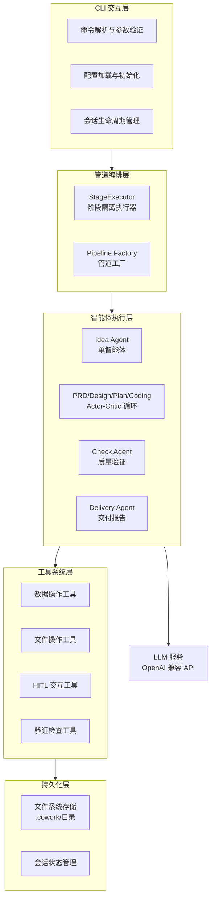

### 1.4 流程协调机制

系统采用以下协调机制确保多智能体协作的一致性和可靠性：

1. **会话隔离机制**：每个工作流实例对应独立 Session，通过 UUID 标识，确保多项目并行开发时的数据隔离
2. **阶段隔离执行**：`StageExecutor` 隔离各阶段的 escalate 标志，防止 LoopAgent 的退出信号影响整体工作流
3. **状态持久化**：基于文件系统的 JSON 持久化，支持断点恢复和状态回溯
4. **反循环保护**：Critic 智能体跟踪反馈历史，检测重复问题并升级至人工审核
5. **速率限制**：LLM 调用通过装饰器模式实现 2 秒延迟（<30 次/分钟），确保 API 合规

## 2. 主工作流详解

### 2.1 完整项目创建工作流

**业务价值**：实现从自然语言描述的项目创意到可交付软件代码的端到端自动化转换，通过七阶段递进式开发确保架构简约性和实现完整性。

**执行流程**：

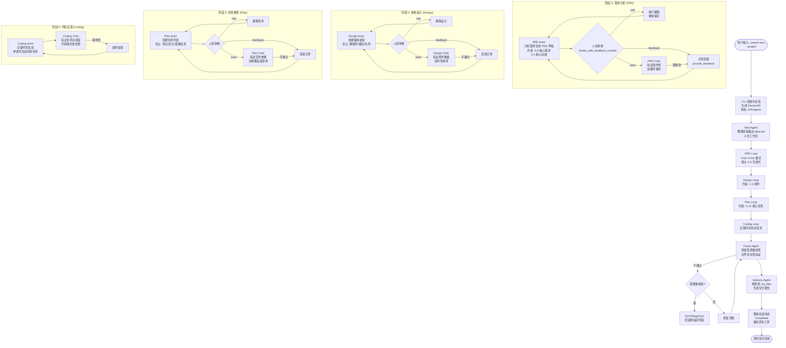

**关键执行细节**：

1. **PRD 阶段约束**：
   - Actor 必须生成包含 3-6 个核心需求和 2-4 个核心功能的 PRD 草稿
   - 强制拒绝非核心需求（性能优化、测试基础设施、CI/CD、监控）
   - 人机审核通过 `review_with_feedback_content` 工具实现，支持 edit/pass/feedback 三种操作

2. **Design 阶段约束**：
   - 组件数量严格限制在 2-4 个
   - 强制使用最简单技术栈（推荐 SQLite/JSON 而非复杂数据库）
   - 推荐单体架构，禁止微服务、缓存层、消息队列（除非绝对必要）

3. **Coding 阶段特性**：
   - 不同于前三阶段的多轮迭代，Coding Actor 在单轮中完成所有待办任务
   - 代码生成遵循现有项目模式，通过 `list_files` 和 `read_file` 工具上下文感知
   - 禁止自动生成测试代码（除非 PRD 明确要求）

### 2.2 增量修改工作流

**业务价值**：支持对已交付项目的安全变更，通过变更影响分析和增量补丁实现需求演进，同时维护变更可追溯性。

**执行流程**：

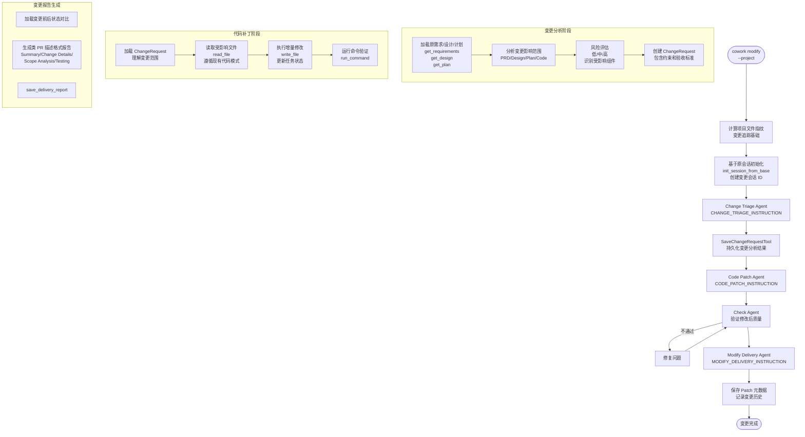

**关键技术机制**：

1. **文件指纹计算**：在修改前计算项目文件哈希，用于后续变更追踪和冲突检测
2. **状态继承**：通过 `init_session_from_base` 实现会话状态继承，复制历史工件作为上下文
3. **变更范围识别**：Triage Agent 分析变更是否影响需求层（PRD）、架构层（Design）、计划层（Plan）或仅代码层（Code），指导后续执行路径

### 2.3 断点恢复工作流

**业务价值**：确保长时间运行的 AI 开发流程具备容错能力，支持从任意中断点恢复执行，避免重复计算。

**执行流程**：

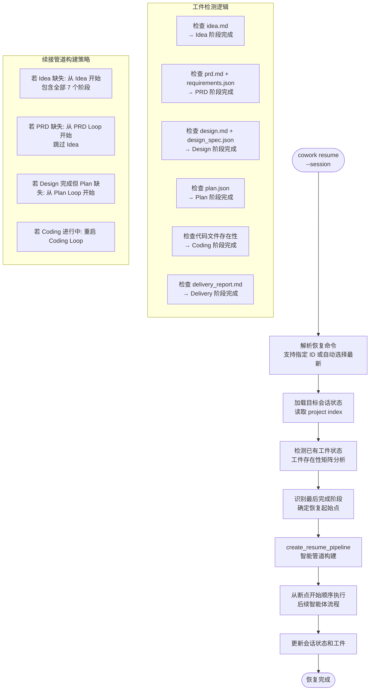

**状态恢复策略**：

系统通过检测 `.cowork/sessions/<id>/artifacts/` 和 `.cowork/sessions/<id>/state/` 目录下的文件存在性，构建**阶段完成度矩阵**。`create_resume_pipeline` 函数基于此矩阵动态构建执行管道，确保：

- 已完成的阶段（工件存在且有效）被跳过
- 未完成或部分完成的阶段重新执行
- 依赖关系保持连贯（如重启 Coding 阶段时，确保 Plan 数据已加载）

### 2.4 版本回退工作流

**业务价值**：当架构设计出现根本性缺陷或需求发生方向性变化时，允许从特定阶段重新开始，保留前期有价值的分析结果。

**执行流程**：

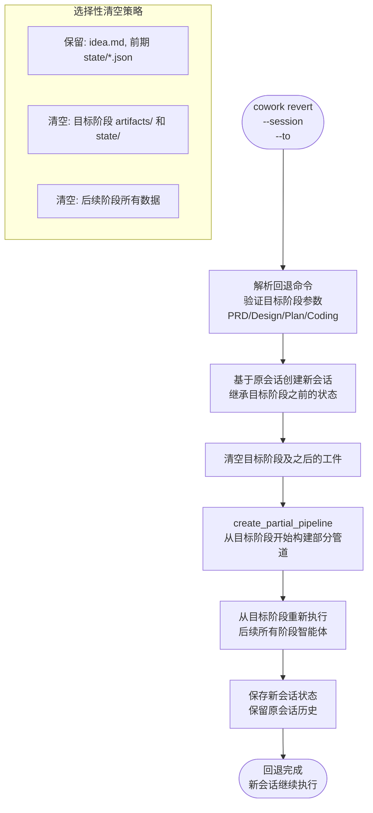

## 3. 流程协调与控制

### 3.1 管道编排机制

系统采用 **StageExecutor** 实现精确的流程控制，确保多阶段顺序执行和状态隔离：

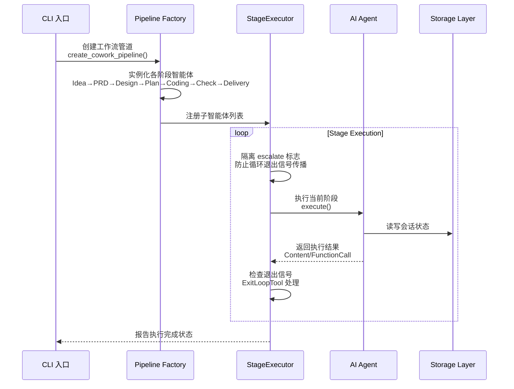

**StageExecutor 核心职责**：

1. **阶段隔离**：每个阶段拥有独立的 escalate 标志上下文，确保 LoopAgent（PRD/Design/Plan/Coding）的内部循环退出不会终止整个管道
2. **流式输出**：实现 `Agent` trait，支持异步流式输出 LLM 生成内容，实时反馈给用户
3. **状态检查**：在阶段转换时验证前置阶段工件的存在性，确保数据连续性

### 3.2 状态管理与数据流

系统采用**会话隔离 + 文件系统持久化**的架构管理状态：

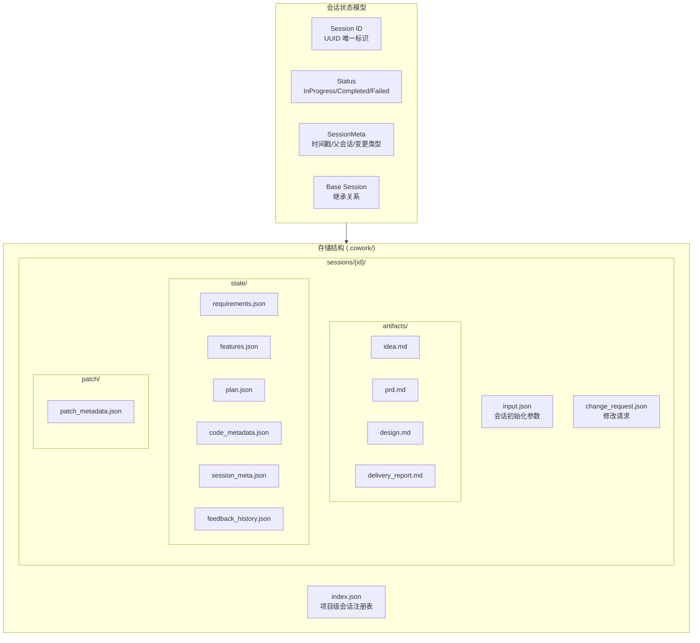

**数据流控制原则**：

1. **向前依赖**：每个阶段只能读取当前及之前阶段产生的数据，禁止反向依赖
2. **不可变工件**：一旦阶段标记为完成，其生成的 markdown 工件（idea.md, prd.md 等）原则上只读，修改需通过增量修改工作流
3. **状态自动更新**：`auto_update_feature_status` 机制在任务状态变更时自动级联更新功能状态

### 3.3 人机协作（HITL）协调机制

系统在关键质量节点强制引入人工审核，通过工具链实现无缝协作：

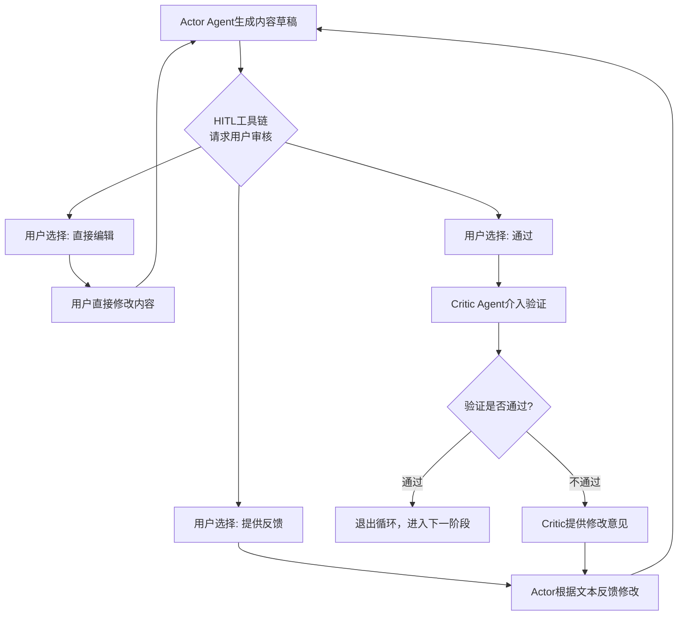

**HITL 决策矩阵**：

| 阶段 | 审核工具 | 编辑能力 | 反馈处理 | 循环上限 |
|------|---------|---------|---------|---------|
| Idea | ReviewAndEditContentTool | 是 | 重新保存 | 无限制 |
| PRD | ReviewWithFeedbackContentTool | 是 | 记录至 feedback_history | 3-5 次 |
| Design | ReviewWithFeedbackContentTool | 是 | 记录至 feedback_history | 3-5 次 |
| Plan | ReviewWithFeedbackContentTool | 是 | 记录至 feedback_history | 3-5 次 |
| Coding | 无（自动流转） | 否 | Critic 直接反馈 | 3 次 |

## 4. 异常处理与恢复

### 4.1 弹性错误恢复架构

系统通过 **ResilientAgent** 包装器实现健壮的错误处理，确保在遇到 AI 执行异常时不立即失败，而是提供分级恢复策略：

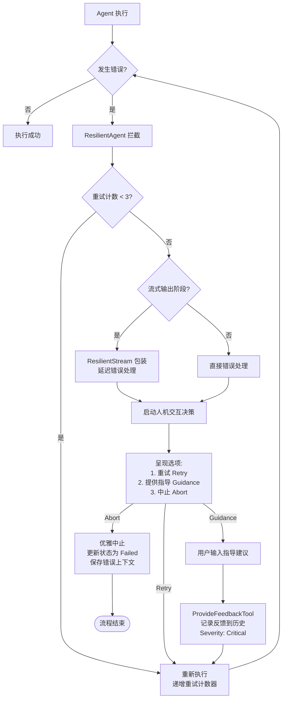

**异常分类与处理策略**：

| 异常类型 | 检测方式 | 自动重试 | 人工介入 | 恢复机制 |
|---------|---------|---------|---------|---------|
| **Max Iterations** | ADK 框架抛出 | 3 次 | 强制 | 用户指导后重试 |
| **LLM API 错误** | HTTP 状态码 | 3 次 | 可选 | 延迟重试 |
| **工具执行失败** | ToolResult 错误码 | 0 次 | 强制 | 修复后重试 |
| **循环检测** | Critic 反馈历史分析 | N/A | 强制 | RequestHumanReviewTool |

### 4.2 反循环保护机制

为防止 Actor-Critic 循环陷入无限迭代，系统在多个层面实现保护：

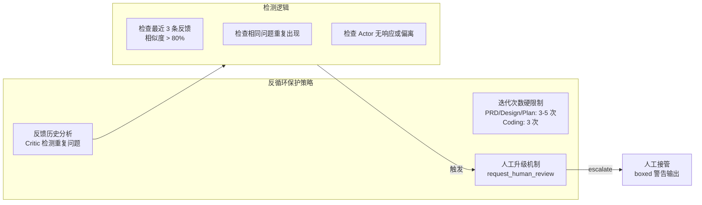

**Critic 决策规则**：

1. **首次迭代**：Actor 生成初稿 → Critic 全面检查 → 提供具体反馈
2. **二次迭代**：Actor 修改 → Critic 对比反馈历史 → 如发现未解决问题，提升警告级别
3. **三次迭代**：如问题依旧存在，Critic 调用 `request_human_review` 工具，在控制台输出带框警告（⚠️ 🚨），并返回 Agent Error 暂停执行

### 4.3 故障转移与降级策略

当关键服务不可用时，系统的降级行为：

| 故障场景 | 影响范围 | 降级策略 | 用户体验 |
|---------|---------|---------|---------|
| LLM API 超时 | 当前阶段 | 指数退避重试（1s, 2s, 4s） | 显示等待提示 |
| LLM API 完全不可用 | 整个工作流 | 保存当前状态，提示用户检查配置 | 优雅退出，状态保留 |
| 文件系统权限错误 | 特定工具调用 | 跳过该操作，记录警告 | 继续执行，事后提醒 |
| 用户中断（Ctrl+C） | 当前执行 | 保存会话状态为 InProgress | 可 resume 恢复 |
| 磁盘空间不足 | 持久化操作 | 暂停新文件写入，清理日志 | 提示清理空间 |

## 5. 关键流程实现

### 5.1 Actor-Critic 双智能体模式

系统在 PRD、Design、Plan、Coding 阶段采用 **Actor-Critic** 架构，实现生成与验证的解耦：

**架构模式**：

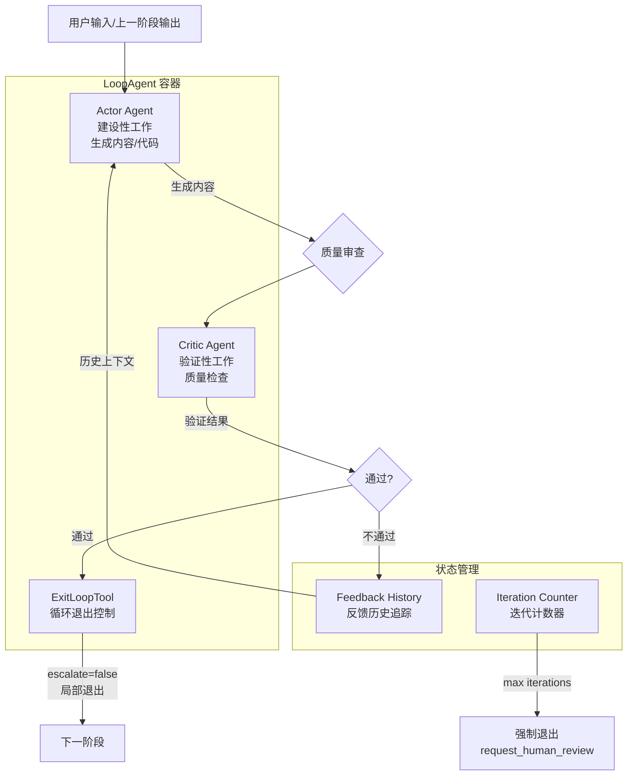

**Actor 与 Critic 职责划分**：

| 维度 | Actor 职责 | Critic 职责 |
|------|-----------|------------|
| **核心任务** | 创建 PRD/设计文档/任务列表/代码 | 验证简约性、完整性、一致性 |
| **工具使用** | create_*, save_*, write_file | get_*, check_*, provide_feedback |
| **退出条件** | 不直接退出 | 验证通过时调用 exit_loop() |
| **人工交互** | 响应 feedback，执行修改 | 触发人工升级（循环保护时） |
| **约束强化** | 遵循简约原则编码 | 强制拒绝过度工程化设计 |

### 5.2 工具系统集成架构

工具系统遵循 **ADK Tool 标准接口**，实现智能体能力的模块化扩展：

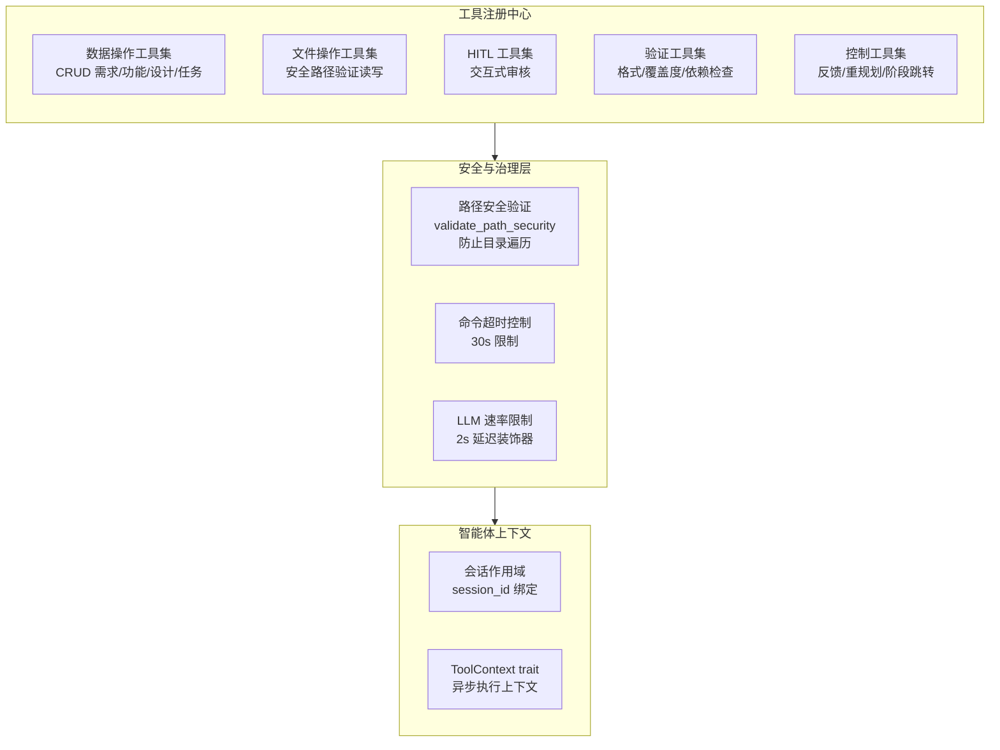

**关键工具实现细节**：

1. **文件操作安全**：
   - 所有路径通过 `validate_path_security` 检查，禁止 `..`、绝对路径、超出项目根目录的访问
   - `RunCommandTool` 实施 30 秒超时，拦截 `npm start`、`python server.py` 等阻塞性服务命令

2. **数据操作原子性**：
   - `CreateTaskTool` 自动处理依赖关系，防止循环依赖（通过 DFS 检测）
   - `UpdateTaskStatusTool` 自动级联更新关联 Feature 的状态

3. **HITL 工具集成**：
   - `ReviewWithFeedbackContentTool` 使用 `dialoguer` crate 实现跨平台 CLI 交互
   - 支持 `$EDITOR` 环境变量调用用户首选编辑器

### 5.3 LLM 服务抽象与速率控制

系统通过分层抽象实现与具体 LLM 提供商的解耦：

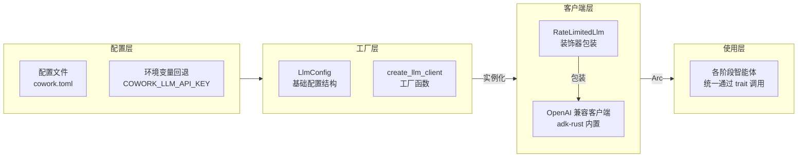

**速率限制策略**：

```rust
// 伪代码示意
pub struct RateLimitedLlm {
    inner: Arc<dyn Llm>,
    delay_ms: u64,  // 默认 2000ms
}

impl Llm for RateLimitedLlm {
    async fn generate_content(&self, request: Request) -> Result<Response> {
        // 每次调用前强制延迟
        tokio::time::sleep(Duration::from_millis(self.delay_ms)).await;
        self.inner.generate_content(request).await
    }
}
```

**性能特征**：
- **延迟**：固定 2 秒延迟确保 <30 次/分钟的 API 限制合规
- **并发**：通过 `Arc<dyn Llm>` 实现多智能体间 LLM 客户端共享
- **容错**：网络错误通过 anyhow 上下文传播，由 ResilientAgent 处理重试

### 5.4 并发处理与资源管理

虽然系统以顺序执行为主，但在以下场景实现并发优化：

1. **文件指纹计算**（Modify 工作流）：
   - 使用异步文件 I/O 并行计算项目文件哈希
   - 忽略模式匹配（`.gitignore` 规则）减少无效计算

2. **智能体初始化**：
   - 管道构建阶段并行初始化各阶段智能体
   - 工具集在智能体间共享（通过 `Arc`），避免重复实例化

3. **流式输出处理**：
   - LLM 生成内容通过 `futures::Stream` 异步流式返回
   - 终端实时渲染与后续处理逻辑并行执行

**资源限制策略**：

| 资源类型 | 限制策略 | 实现机制 |
|---------|---------|---------|
| **LLM API 调用** | 速率限制 | 2 秒延迟装饰器 |
| **Shell 命令** | 超时控制 | 30 秒硬超时 |
| **文件句柄** | 作用域限制 | Rust RAII + 显式关闭 |
| **会话存储** | 空间管理 | 自动清理 Failed 状态临时文件 |
| **内存使用** | 流式处理 | 大文件分块读取，避免一次性加载 |

---

**文档生成时间**：2026-01-31 05:56:42 (UTC)  
**版本**：基于 Cowork Forge 架构设计 v1.0
