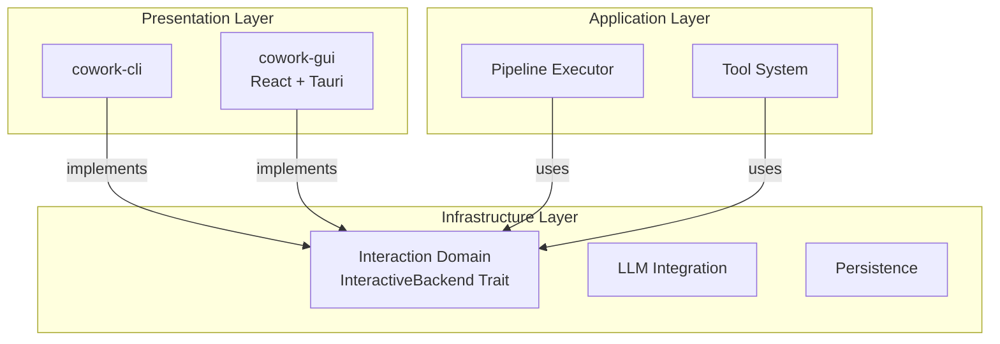
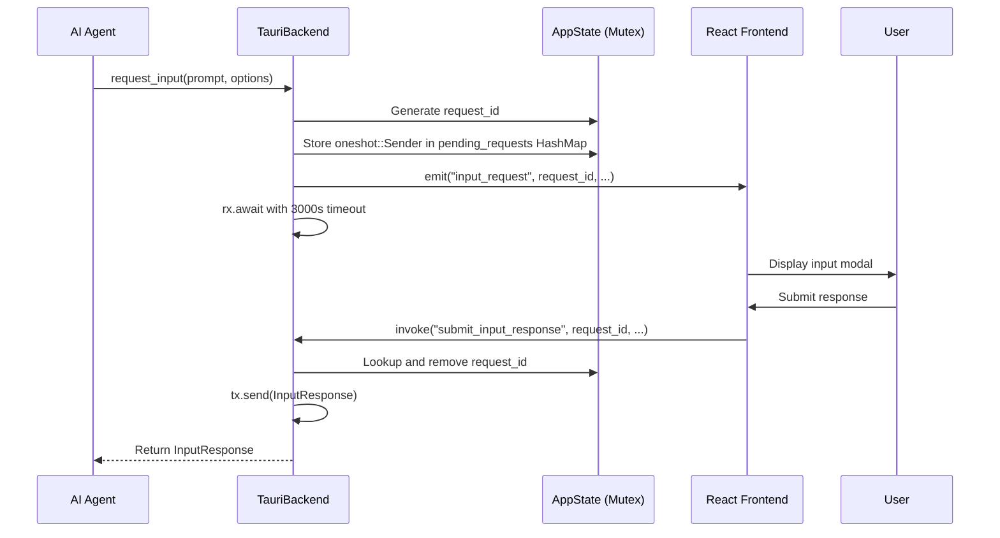

**交互域技术文档**
**Cowork Forge 系统**
*生成时间：2024-12-19*

---

## 1. 执行摘要

**交互域**作为 Cowork Forge 核心业务逻辑与其用户界面之间的基础设施桥梁。遵循六边形架构模式（端口和适配器），该域实现 `InteractiveBackend` 特性——标准化端口，使系统能够进行双接口策略。

通过将用户交互抽象为统一的异步接口，该域允许 AI 流程（7 阶段开发工作流）在自动化优先的 CLI 环境和交互式桌面 GUI 体验中完全相同地执行，而无需修改核心域逻辑。

**关键能力：**
- **双接口抽象**：单一特性实现同时支持终端（CLI）和桌面（Tauri）接口
- **实时流式传输**：AI 智能体输出和工具执行结果的低延迟传输
- **人在回路（HITL）**：用于人工验证门的同步请求-响应协调
- **上下文感知消息**：丰富的元数据传播实现复杂的 UI 渲染

---

## 2. 架构定位

### 2.1 层级分类
在领域驱动设计（DDD）架构中，交互域位于**基础设施层**，为表示层实现出站适配器：



### 2.2 设计模式：端口和适配器
该域通过以下方式实现**端口和适配器**模式：
- **端口**：`InteractiveBackend` 特性定义所有 UI 交互的契约
- **适配器**：具体实现（`CliBackend`、`TauriBackend`）将端口适配到特定技术

这种解耦确保 React 前端或终端库的变化永远不会传播到流程或工具域。

---

## 3. 核心抽象：InteractiveBackend 特性

`InteractiveBackend` 特性定义了 AI 流程与用户之间双向通信的契约。它使用 Rust 的 `async_trait` 宏实现，以支持跨 tokio 运行时的异步操作。

### 3.1 接口定义

| 方法 | 目的 | 方向 |
|--------|---------|-----------|
| `show_message` | 显示系统通知（信息/警告/错误/成功） | 后端 → 用户 |
| `show_message_with_context` | 带智能体/阶段元数据的丰富消息 | 后端 → 用户 |
| `send_streaming` | 实时 LLM 令牌流式传输 | 后端 → 用户 |
| `send_tool_call` | 工具调用可视化 | 后端 → 用户 |
| `send_tool_result` | 工具执行完成显示 | 后端 → 用户 |
| `show_progress` | 任务进度报告（0-100%） | 后端 → 用户 |
| `request_input` | 带超时的 HITL 输入收集 | 后端 ↔ 用户 |
| `submit_response` | 挂起请求的异步响应处理 | 用户 → 后端 |

### 3.2 上下文感知消息
`MessageContext` 结构通过携带元数据实现复杂的 UI 渲染：

```rust
struct MessageContext {
    agent_name: String,      // e.g., "Actor", "Critic"
    stage_name: String,      // e.g., "Design", "Coding"
    message_type: MessageType // Normal, Thinking, ToolCall, ToolResult, Streaming
}
```

此上下文允许 GUI 应用颜色编码、智能体头像和阶段特定分组，而无需解析消息内容。

---

## 4. 实现：CLI 后端

位于 `crates/cowork-core/src/interaction/cli.rs`，CLI 实现使用 `dialoguer` 和 `console` crate 提供基于终端的交互。

### 4.1 技术特征
- **无状态设计**：方法调用之间无持久状态
- **UTF-8 合规**：国际项目名称和内容的全 Unicode 支持
- **外部编辑器集成**：使用 `dialoguer::Editor` 启动系统默认编辑器（VS Code、Vim 等）进行内容审查
- **彩色输出**：使用 `console` crate 的 emoji 前缀、ANSI 彩色消息

### 4.2 HITL 实现
对于人在回路交互，CLI 后端：
1. 带语法高亮提示显示内容预览
2. 呈现选项：`[Pass]`、`[Edit]`、`[Cancel]` 或 `[Feedback]`
3. 对于"Edit"选择：生成外部编辑器进程并监控文件更改
4. 返回结构化 `InputResponse` 到等待的流程阶段

### 4.3 流式传输行为
实时 LLM 流式传输通过 `stdout` 刷新实现：
```rust
print!("{}", chunk);
std::io::stdout().flush().unwrap();
```
这确保令牌立即出现，而不是缓冲到换行符。

---

## 5. 实现：Tauri 后端

位于 `crates/cowork-core/src/interaction/tauri.rs`，Tauri 实现通过事件发射和命令调用启用桌面 GUI 交互。

### 5.1 事件驱动架构
后端使用 Tauri's `AppHandle` 向 WebView 前端发射事件：

| 事件名称 | 负载 | 目的 |
|------------|---------|---------|
| `agent_event` | 带上下文的结构化消息 | 常规智能体通信 |
| `agent_streaming` | 令牌块 + 元数据 | 实时 LLM 输出 |
| `tool_call` | 工具名称 + 参数 | 工具执行开始 |
| `tool_result` | 结果数据 + 成功标志 | 工具执行完成 |
| `progress` | 任务 ID + 百分比 | 长时间运行任务更新 |
| `input_request` | 请求 ID + 提示 + 选项 | HITL 模态框触发 |
| `project_loaded` | 项目元数据 | 状态变更通知 |

### 5.2 异步上下文中的同步 HITL
Tauri 后端最复杂的方面是在异步流程中管理同步用户输入。实现使用 **tokio oneshot 通道**：



**关键实现细节：**
- **挂起请求存储**：`HashMap<String, oneshot::Sender<InputResponse>>` 受 `Arc<Mutex<>>` 保护
- **超时处理**：3000 秒（50 分钟）超时使用 `tokio::select!` 防止流程无限期停滞
- **请求关联**：基于 UUID 的请求 ID 确保响应匹配到正确的等待智能体

### 5.3 状态管理（V2 架构）
V2 架构移除事件总线，改为直接状态共享：
```rust
pub struct AppState {
    pending_requests: HashMap<String, oneshot::Sender<InputResponse>>,
    project_registry_manager: ProjectRegistryManager,
    workspace_path: Option<PathBuf>,
}
```
访问通过跨 Tauri 命令和交互后端共享的 `Arc<Mutex<AppState>>` 同步。

---

## 6. 人在回路（HITL）机制

HITL 系统通过在关键阶段边界暂停 AI 执行来启用 Actor-Critic 模式进行人工验证。

### 6.1 交互流程

**步骤 1：触发**
- 阶段执行器检测 `needs_confirmation()` 或智能体调用 `ReviewAndEditContentTool`
- 工具从流程上下文获取 `InteractiveBackend`

**步骤 2：呈现**
- **CLI**：在终端中使用 dialoguer 提示呈现内容预览
- **GUI**：发射 `input_request` 事件；React 前端显示模态对话框

**步骤 3：用户操作**
- **Pass**：批准并继续流程
- **Edit**：在外部编辑器（CLI）或内联编辑器（GUI）中修改内容
- **Feedback**：提供注释，通过 `execute_with_feedback()` 触发智能体重新生成

**步骤 4：解决**
- CLI 直接通过 stdin 接收输入
- GUI 通过 `submit_input_response` Tauri 命令接收输入，解决 oneshot 通道

### 6.2 错误处理
- **超时**：3000 秒后返回 `InputResponse::Timeout`，允许流程根据配置中止或继续
- **取消**：用户可以取消迭代，触发流程中止和清理
- **连接丢失**：GUI 断开连接由超时机制处理；CLI 通过信号处理器处理 Ctrl+C

---

## 7. 集成模式

### 7.1 流程域集成
流程域使用交互后端进行：
1. **阶段进度报告**：在长时间运行的 AI 操作期间发射进度更新
2. **流式显示**：将 LLM 令牌流转发到用户界面
3. **确认门**：在阶段边界暂停等待人工批准

**代码模式：**
```rust
// In stage_executor.rs
backend.send_streaming(content, &agent_name, is_thinking).await?;
if stage_config.requires_confirmation {
    let response = backend.request_input(prompt, options, None).await?;
    match response {
        InputResponse::Feedback(comment) => {
            return self.execute_with_feedback(comment).await;
        }
        // ... handle other variants
    }
}
```

### 7.2 工具域集成
`hitl_content_tools.rs` 和 `hitl_file_tools.rs` 模块中的工具使用后端进行：
- 显示文件供审查（`ReviewAndEditFileTool`）
- 收集结构化反馈（`ReviewWithFeedbackTool`）
- 显示工具执行确认

### 7.3 前端集成（GUI）
React 前端（`crates/cowork-gui/src/App.jsx`）在触发执行之前建立事件监听器：

```javascript
// Event listeners setup
listen('agent_streaming', (event) => addStreamingMessage(event.payload));
listen('input_request', (event) => showInputModal(event.payload));
listen('tool_call', (event) => logToolInvocation(event.payload));

// Command invocation
invoke('gui_execute_iteration', { projectId, iterationId });
```

---

## 8. 数据结构

### 8.1 InputResponse 枚举
定义用户对 HITL 请求的可能响应：
- `Pass`：继续无更改
- `Edit { content }`：编辑器修改的内容
- `Feedback { comment }`：带注释的重新生成请求
- `Cancel`：中止迭代
- `Timeout`：3000 秒窗口内无响应

### 8.2 MessageType 枚举
为 UI 样式分类消息：
- `Normal`：标准智能体消息
- `Thinking`：智能体内部推理（通常以不同方式渲染）
- `ToolCall`：工具调用通知
- `ToolResult`：成功/失败指示器
- `Streaming`：实时 LLM 输出片段

### 8.3 ProgressInfo 结构
```rust
struct ProgressInfo {
    task_id: String,
    current: u32,
    total: u32,
    message: Option<String>,
}
```

---

## 9. 配置与扩展

### 9.1 实现新后端
添加新接口（如 WebSocket API）：
1. 为你的结构实现 `InteractiveBackend`
2. 使用适当的异步同步处理 `request_input` 方法
3. 确保所有字符串输入/输出的 UTF-8 合规
4. 为 HITL 操作实现超时处理

### 9.2 后端选择
应用程序在运行时选择后端：
- **CLI**：`CliBackend` 在 `cowork-cli/src/main.rs` 中实例化
- **GUI**：`TauriBackend` 在 `cowork-gui/src-tauri/src/lib.rs` 中实例化，可访问 Tauri's `AppHandle`

### 9.3 安全考虑
- **路径验证**：通过 `send_tool_call` 显示的所有文件操作已由运行时安全预先验证
- **输入清理**：后端不清理内容（由工具域处理），但确保正确编码（UTF-8）
- **超时保护**：防止放弃的 HITL 请求导致资源耗尽

---

## 10. 最佳实践

1. **始终等待超时**：实现自定义后端时，确保 `request_input` 实现超时逻辑以防止僵尸流程
2. **保留上下文**：准确传递 `MessageContext` 以在 GUI 模式中启用丰富的 UI 功能，同时保持 CLI 兼容性
3. **非阻塞事件**：事件发射不应阻塞 AI 流程；如需要，使用 `tokio::spawn` 进行即发即忘通知
4. **UTF-8 合规**：所有实现必须正确处理 Unicode，特别是对于国际开发团队
5. **状态清理**：实现 HITL 时，始终从挂起映射中删除完成的请求 ID 以防止内存泄漏

---

## 11. 相关文件

| 文件路径 | 职责 |
|-----------|---------------|
| `crates/cowork-core/src/interaction/mod.rs` | 特性定义和共享类型 |
| `crates/cowork-core/src/interaction/cli.rs` | 基于终端的实现 |
| `crates/cowork-core/src/interaction/tauri.rs` | 桌面 GUI 实现 |
| `crates/cowork-cli/src/main.rs` | CLI 后端实例化和路由 |
| `crates/cowork-gui/src-tauri/src/lib.rs` | Tauri 后端注册和状态管理 |
| `crates/cowork-gui/src-tauri/src/gui_types.rs` | 前端-后端通信的 DTO |

---

## 12. 结论

交互域通过严格分离接口关注点和业务逻辑，展示了系统对六边形架构的坚持。通过 `InteractiveBackend` 特性，Cowork Forge 实现了真正的接口可移植性——使相同的复杂 AI 流程能够在自动化 CI/CD 环境（CLI）和丰富的交互式开发环境（桌面 GUI）中运行，而无需代码重复或域污染。

该域复杂的异步 HITL 工作流处理，结合上下文感知消息和健壮的并发管理，为软件开发生态系统中可靠的人机协作奠定了基础。