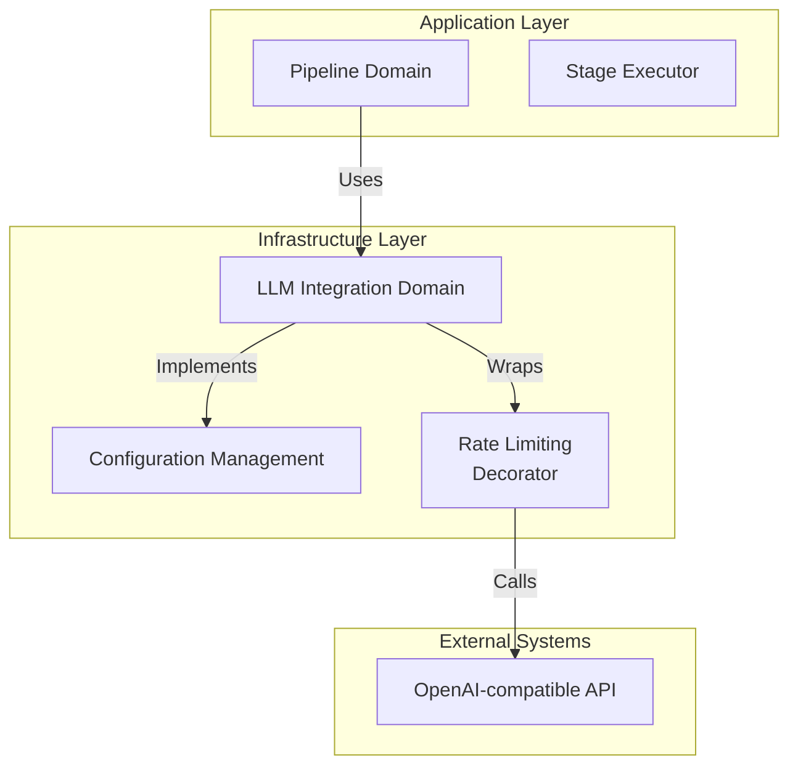
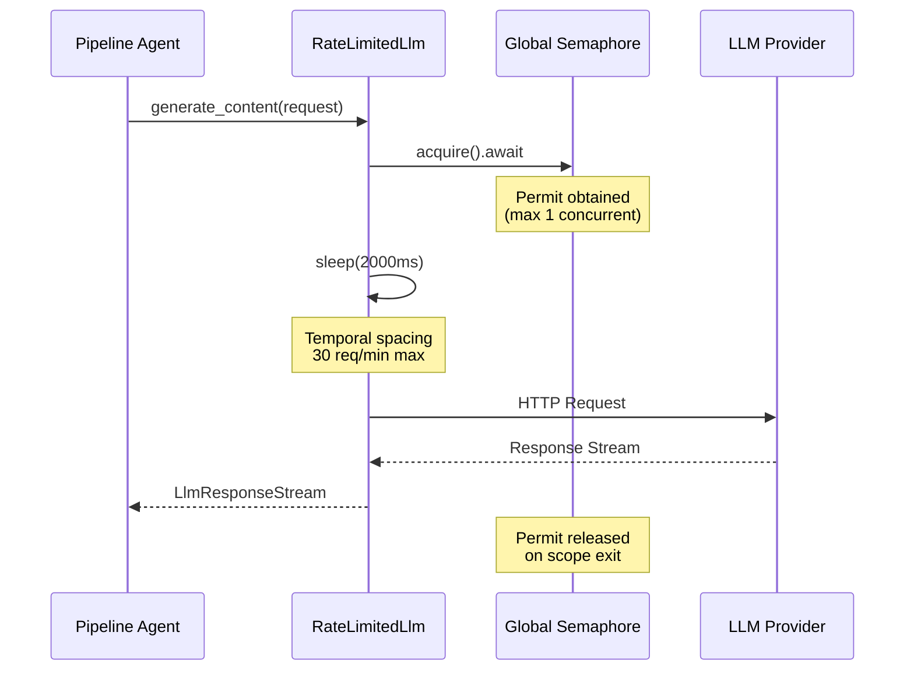

**LLM 集成域技术文档**

---

## 1. 概述

**LLM 集成域**提供了将 Cowork Forge 连接到 OpenAI 兼容大型语言模型 API 的基础设施层。作为六边形架构中的基础设施域，它抽象了外部 API 通信、认证以及关键生产关注点（如限流和配额管理）的复杂性。

该域作为核心 AI 智能体流程与外部 LLM 提供商之间的唯一桥梁，确保系统在保持 API 合规（30 次请求/分钟）的同时，为流程域的阶段执行器和智能体编排组件提供干净、基于特性的接口。

**关键职责：**
- 配置管理，支持基于文件（TOML）和基于环境的部署
- 工厂式客户端实例化，带自动限流装饰
- 双重机制限流（并发控制 + 时间节流）以防止 API 配额耗尽
- 与 `adk-rust` 生态系统（`adk_core` 特性 和 `adk_model` OpenAI 客户端）的无缝集成

---

## 2. 架构设计

### 2.1 模式实现

该域实现两个主要设计模式以实现清晰关注点分离和生产级可靠性：

**工厂模式**：`create_llm_client` 函数作为集中式工厂，编排客户端初始化、配置验证和自动限流装饰。这确保系统默认情况下使用的所有 LLM 客户端都符合 API 约束。

**装饰器模式**：`RateLimitedLlm` 结构实现 `adk_core::Llm` 特性，同时包装内部 LLM 实现。这允许透明地添加限流关注点，而无需修改底层 OpenAI 客户端逻辑，遵循单一职责原则。

### 2.2 系统定位

在清洁架构层级中，该域位于**基础设施层**，仅依赖外部框架（`adk-rust`、`tokio`），并为域定义的接口提供实现：



---

## 3. 核心组件

### 3.1 配置管理（`llm/config.rs`）

配置系统支持双源初始化，以适应开发工作流和容器化生产环境：

**配置结构：**
- `LlmConfig`：顶级配置容器
- `ModelConfig`：特定模型参数，包括 API 基础 URL、认证密钥和模型选择

**加载策略：**
- **基于文件**：`ModelConfig::from_file(path)` 反序列化 TOML 配置文件，用于持久化、版本控制的设置
- **基于环境**：`ModelConfig::from_env()` 从环境变量（`LLM_API_BASE_URL`、`LLM_API_KEY`、`LLM_MODEL_NAME`）读取，用于容器化部署和密钥管理

### 3.2 限流基础设施（`llm/rate_limiter.rs`）

`RateLimitedLlm` 装饰器实现复杂的双重机制限流策略，对 API 配额合规至关重要：

**机制 1：并发控制**
- 使用全局 `tokio::sync::Semaphore`（通过 `tokio::sync::OnceCell` 初始化），允许计数为 **1**
- 确保整个应用程序在任何给定时间只有一个 API 请求在飞行
- 通过 `init_global_rate_limiter(max_concurrent: usize)` 延迟初始化

**机制 2：时间节流**
- 在每次 API 调用前强制执行强制 **2 秒延迟**（2000ms），使用 `tokio::time::sleep`
- 保证系统在持续负载下不超过 **30 次请求/分钟**
- 在 `RateLimitedLlm::with_default_delay()` 构造函数中实现

**线程安全：**
全局信号量存储在 `static OnceCell` 中，确保跨异步任务边界的线程安全、一次性初始化，无竞争条件。

### 3.3 客户端工厂

`create_llm_client` 函数是获取 LLM 实例的主要入口点：

```rust
pub fn create_llm_client(config: &LlmConfig) -> Result<Arc<dyn Llm>>
```

**编排流程：**
1. 初始化全局限流器信号量（幂等操作）
2. 通过 `OpenAIConfig::compatible()` 构造带自定义基础 URL 支持的 `OpenAIConfig`
3. 从 `adk_model` crate 实例化 `OpenAIClient`
4. 使用默认 2000ms 延迟将客户端包装在 `RateLimitedLlm` 中
5. 返回适合智能体组件依赖注入的 `Arc<dyn Llm>`

---

## 4. 限流策略深度解析

通过结合并发和时间控制实现 30 次请求/分钟限制的防御深度方法：



**为什么双重机制？**
- **并发控制**防止可能触发提供商限流或连接池耗尽的突发流量
- **时间节流**确保即使在顺序操作期间也符合每分钟配额
- 组合在保持可预测 API 使用成本的同时提供负载下的优雅降级

---

## 5. 与智能体系统的集成

### 5.1 特性实现

该域实现 `adk_core::Llm` 特性，为智能体框架提供标准接口：

```rust
#[async_trait]
impl Llm for RateLimitedLlm {
    fn name(&self) -> &str;
    async fn generate_content(
        &self, 
        request: LlmRequest, 
        stream: bool
    ) -> Result<LlmResponseStream>;
}
```

### 5.2 流程域消费

流程域的 `StageExecutor` 通过依赖注入消费 LLM 客户端：

- **初始化**：执行器在流程上下文设置期间通过工厂函数接收 `Arc<dyn LLM>`
- **执行**：在阶段执行期间（Idea、PRD、Design 等），执行器使用阶段特定指令调用 `generate_content()`
- **流式传输**：支持流式响应（用于实时 GUI 更新）和同步完成模式
- **反馈循环**：Actor-Critic 模式依赖限流客户端进行初始生成和重新生成循环

### 5.3 错误处理

所有错误使用 `anyhow` crate 进行符合人体工程学的错误处理传播：
- 配置解析错误（无效 TOML、缺少环境变量）
- HTTP 连接失败
- 限流信号量中毒（极不可能，使用 tokio 的实现）
- API 认证错误

---

## 6. 配置参考

### 6.1 TOML 配置文件

```toml
[llm]
api_base_url = "https://api.openai.com/v1"
api_key = "sk-..."
model_name = "gpt-4"
max_retries = 3
timeout_seconds = 120
```

### 6.2 环境变量

| 变量 | 描述 | 必需 |
|----------|-------------|----------|
| `LLM_API_BASE_URL` | OpenAI 兼容 API 的基础 URL | 是 |
| `LLM_API_KEY` | 认证密钥 | 是 |
| `LLM_MODEL_NAME` | 模型标识符（如 gpt-4、gpt-3.5-turbo） | 是 |

**优先级**：当 TOML 和环境变量同时存在时，应用程序调用的特定加载方法决定哪个优先。工厂模式通常优先考虑显式配置对象而不是环境变量回退。

---

## 7. 使用模式

### 7.1 初始化（应用程序启动）

```rust
use cowork_core::llm::{create_llm_client, LlmConfig};

// Load configuration
let config = LlmConfig::from_file("config.toml")?;

// Create rate-limited client
let llm_client = create_llm_client(&config)?;
// Client is now ready for injection into Pipeline Domain
```

### 7.2 运行时使用（智能体执行）

```rust
// Inside StageExecutor or Agent implementation
let response = llm_client
    .generate_content(request, true)  // true = streaming
    .await?;

// Process streaming chunks
while let Some(chunk) = response.stream.next().await {
    // Emit to GUI via Interaction Domain or process locally
}
```

### 7.3 自定义限流（高级）

对于需要不同限流的场景（如不同配额的不同提供商）：

```rust
use cowork_core::llm::RateLimitedLlm;

// Custom delay: 1 second (60 req/min)
let custom_limited = RateLimitedLlm::new(inner_client, 1000);
```

---

## 8. 运维考虑

### 8.1 API 配额管理

默认 30 次请求/分钟限制对于标准 OpenAI 层级是保守的。对于具有更高限额的企業层级：
- 修改 `with_default_delay()` 中的延迟常量（当前 2000ms）
- 如果提供商支持并发连接，调整全局信号量计数
- 监控限流响应的日志（HTTP 429）作为回退保护

### 8.2 延迟影响

2 秒强制延迟引入基线延迟：
- **顺序操作**：单次执行的 7 阶段流程至少产生 14 秒的限流开销
- **反馈循环**：Actor-Critic 迭代将此开销倍增
- **缓解**：由于 Tokio 的异步运行时，延迟对其他应用程序组件是非阻塞的

### 8.3 监控和可观察性

要监控的关键指标：
- **信号量等待时间**：如果多个智能体同时请求 LLM 访问，指示队列深度
- **请求持续时间**：包括 2 秒延迟和 API 延迟的总时间
- **错误率**：认证失败或限流突破（HTTP 429）

---

## 9. 文件结构

```
crates/cowork-core/src/llm/
├── mod.rs              # Module exports and public API
├── config.rs           # LlmConfig, ModelConfig, factory function
└── rate_limiter.rs     # RateLimitedLlm decorator, global semaphore
```

**相关文件：**
- `crates/cowork-core/src/tech_stack.rs`：技术检测（LLM 操作的辅助）
- `crates/cowork-core/src/pipeline/stage_executor.rs`：LLM 客户端的主要消费者

---

## 10. 总结

LLM 集成域提供了到外部 AI 服务的生产级健壮桥梁，同时强制执行关键操作约束。通过将限流逻辑封装在装饰器模式中，并支持灵活的配置源，它使流程域能够专注于编排逻辑，而无需担心 API 合规细节。双重机制限流（并发 + 时间）确保在提供商配额内的可靠运行，使其适合长时间运行的自主智能体流程以及交互式 GUI 驱动的开发工作流。