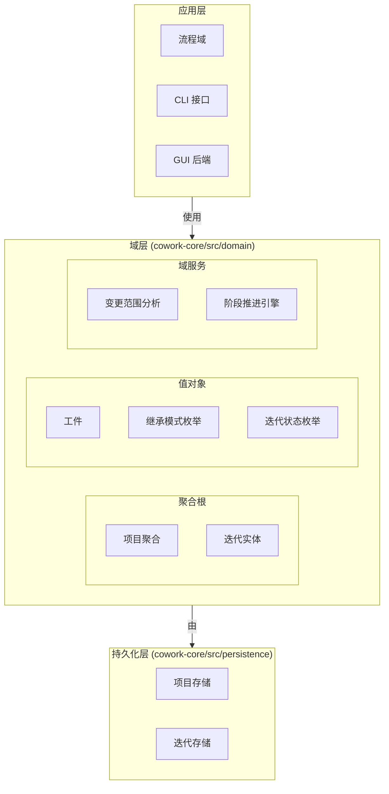
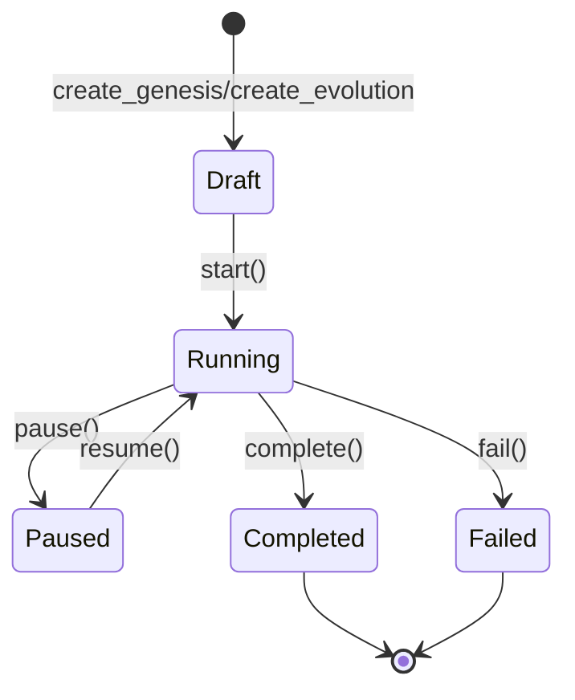
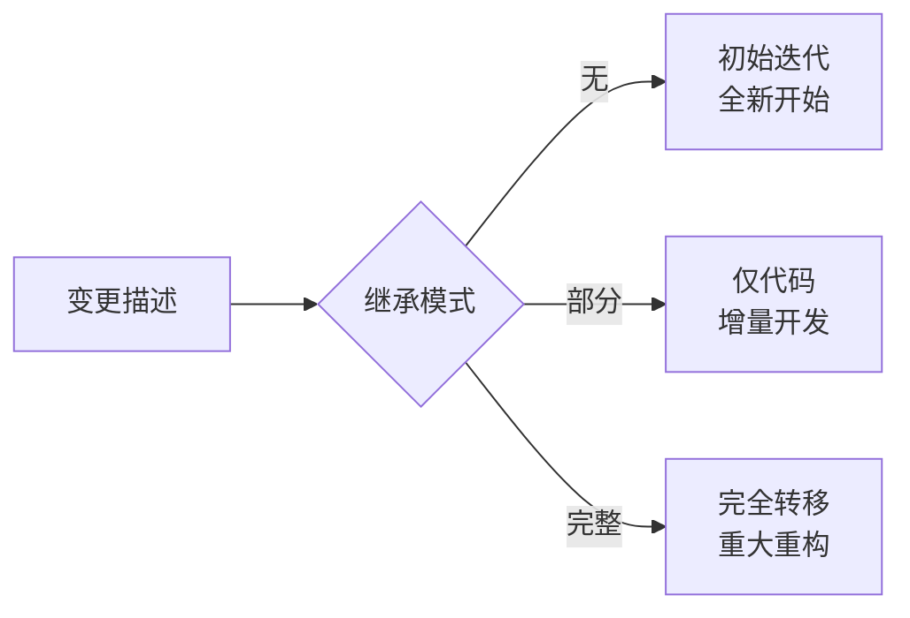
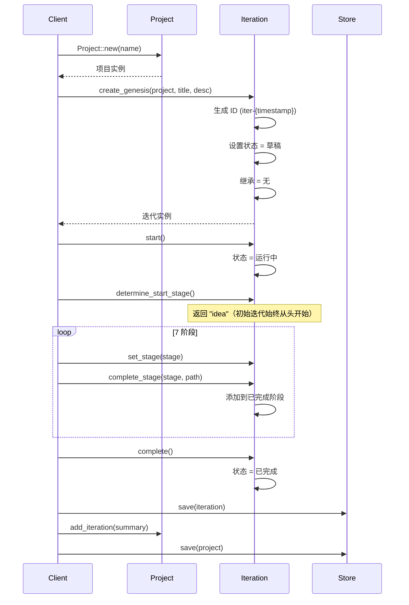
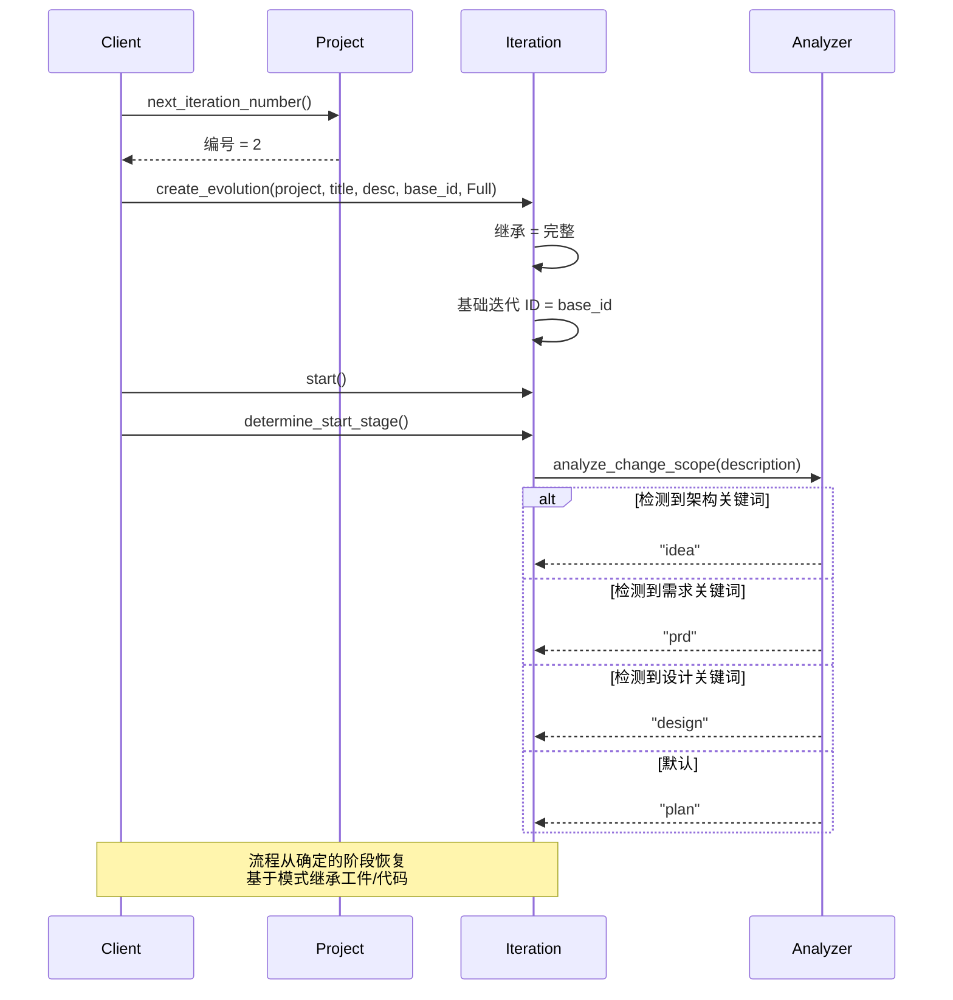

**域逻辑技术文档**

**Cowork Forge - 核心业务域**

---

## 1. 概述

**域逻辑**层构成 Cowork Forge 架构的核心，封装了管理 AI 辅助软件开发生态系统的核心业务实体、不变性和行为规则。遵循**领域驱动设计（DDD）**原则实现，该域定义了 `Project` 和 `Iteration` 的基本构造，通过复杂的 7 阶段开发流程管理其生命周期、关系和状态转换。

作为六边形架构中的**聚合根**层，域逻辑与基础设施关注点保持严格分离，确保业务规则保持纯净、可测试，独立于持久化机制、UI 实现或外部 AI 服务集成。

---

## 2. 架构设计

### 2.1 领域驱动设计结构

域逻辑实现具有清晰边界的分层架构：



### 2.2 核心设计原则

1. **聚合根模式**：`Project` 作为管理 `Iteration` 生命周期和元数据一致性的聚合根
2. **实体-持久化分离**：域实体是纯 Rust 结构，带业务逻辑，而持久化处理 JSON 序列化和文件系统操作
3. **状态机强制**：迭代状态转换严格控制（Draft → Running → Completed/Failed）
4. **时间一致性**：自动时间戳管理（`created_at`、`updated_at`、`started_at`、`completed_at`）确保可审计性
5. **策略模式**：继承模式实现演进迭代的不同工件转移策略

---

## 3. 核心域实体

### 3.1 项目聚合根

`Project` 实体表示包含所有项目元数据和迭代历史的顶级聚合。

**关键特征：**
- **ID 生成**：使用格式 `proj-{timestamp}` 自动生成唯一标识符（如 `proj-1703123456789`）
- **元数据管理**：`ProjectMetadata` 结构跟踪 `tech_stack`、`project_type` 和 `language`，带自动检测能力
- **迭代集合**：维护 `Vec<IterationSummary>` 用于轻量级迭代跟踪，无需加载完整迭代数据
- **当前迭代指针**：对活动迭代的可选引用（`current_iteration_id`），支持暂停/恢复工作流

**核心操作：**
```rust
// Construction
Project::new(name: String) -> Self

// Iteration Management
add_iteration(summary: IterationSummary)  // Appends and updates timestamp
set_current_iteration(id: String)         // Sets active iteration pointer
next_iteration_number() -> u32            // Generates sequential numbers (1, 2, 3...)

// Queries
get_latest_completed_iteration() -> Option<&IterationSummary>
```

### 3.2 迭代实体

`Iteration` 实体实现有限状态机，表示通过 7 阶段流程（Idea → PRD → Design → Plan → Coding → Check → Delivery）的单个开发周期。

#### 3.2.1 创建模式

该域通过工厂方法支持两种不同的创建模式：

**创世迭代**（`create_genesis`）：
- 使用 `InheritanceMode::None` 初始化新项目
- 无先前迭代的工件或代码继承
- 从阶段 1（Idea）开始

**演进迭代**（`create_evolution`）：
- 通过 `base_iteration_id` 派生自现有迭代
- 可配置的继承策略（Full/Partial/None）
- 通过 `analyze_change_scope()` 智能阶段选择

#### 3.2.2 状态机

迭代通过严格定义的状态转换：



**状态行为：**
- **Draft**：初始状态，允许配置和修改
- **Running**：流程执行进行中，锁定迭代进行修改
- **Paused**：临时暂停，保留执行上下文
- **Completed**：成功完成 7 阶段，工件最终确定
- **Failed**：错误终止，保留失败上下文

#### 3.2.3 阶段推进引擎

`Iteration` 通过以下方式跟踪流程执行：

- `current_stage: Option<String>`：当前执行阶段标识符
- `completed_stages: Vec<String>`：已完成阶段的历史记录
- **Artifacts**：将阶段名称映射到工件文件路径的类型安全存储

**阶段管理 API：**
```rust
set_stage(stage: impl Into<String>)           // Sets current execution stage
complete_stage(stage, artifact_path)          // Records completion and persists path
determine_start_stage() -> String             // Returns optimal starting stage
```

### 3.3 工件值对象

`Artifacts` 结构为迭代交付物提供类型安全存储：

```rust
pub struct Artifacts {
    pub idea: Option<String>,
    pub prd: Option<String>,
    pub design: Option<String>,
    pub plan: Option<String>,
    pub coding: Option<String>,
    pub check: Option<String>,
    pub delivery: Option<String>,
}
```

**访问模式：**
- `get(stage: &str) -> Option<&String>`: 按阶段名称检索路径
- `set(stage: &str, path: String)`: 带验证存储工件路径

---

## 4. 继承策略模式

该域实现三种继承策略，支持迭代开发工作流：

### 4.1 继承模式枚举



**None**：
- **用例**：新项目初始化或完全重写
- **行为**：无工件或代码转移；从 Idea 阶段开始
- **阶段选择**：始终返回 "idea"

**Partial**：
- **用例**：为现有代码库添加功能
- **行为**：仅转移代码文件；重新生成所有文档工件（PRD、Design 等）
- **阶段选择**：始终返回 "idea"（工件的完整重新生成）

**Full**：
- **用例**：架构重构或重大重新设计
- **行为**：从基线迭代复制所有代码和工件
- **阶段选择**：使用 `analyze_change_scope()` 进行智能阶段确定

### 4.2 变更范围分析算法

`analyze_change_scope()` 函数实现基于关键词的自然语言处理，为带完全继承的演进迭代确定最佳流程入口点：

**分类逻辑：**
```rust
fn analyze_change_scope(description: &str) -> String {
    let desc_lower = description.to_lowercase();
    
    // Architecture keywords trigger complete redesign
    if matches_keywords(&desc_lower, &["架构", "architecture", "重构", "rewrite", "重新设计", "redesign"]) {
        return "idea".to_string();
    }
    
    // Requirement keywords trigger PRD regeneration
    if matches_keywords(&desc_lower, &["需求", "requirement", "功能", "feature", "添加", "add"]) {
        return "prd".to_string();
    }
    
    // Design keywords trigger Design stage entry
    if matches_keywords(&desc_lower, &["设计", "design", "数据库", "database", "接口", "api"]) {
        return "design".to_string();
    }
    
    // Default: Code-level changes
    "plan".to_string()
}
```

**战略优势：**
- 避免稳定工件的冗余重新生成
- 在需要时支持架构同时保留实现细节
- 支持中英文关键词匹配，用于多语言交互

---

## 5. 持久化层集成

域逻辑通过仓库模式实现与持久化关注点的严格分离：

### 5.1 项目存储

管理项目级 JSON 格式的持久化：

- **存储位置**：`{workspace}/.cowork-v2/project.json`
- **职责**： 
  - 项目聚合的 CRUD 操作
  - 项目结构初始化
  - 使用 `serde_json` 的元数据序列化/反序列化
  - 时间戳同步

**API 表面：**
```rust
load() -> Result<Option<Project>>
save(project: &Project) -> Result<()>
exists() -> bool
create(project: Project) -> Result<()>
update(project: Project) -> Result<()>
```

### 5.2 迭代存储

管理迭代特定持久化，带工作区隔离：

- **存储位置**：`{workspace}/.cowork-v2/iterations/{iteration_id}.json`
- **工作区管理**：确保 V2 迭代特定工作区架构
- **批量操作**：支持 `load_all()` 和 `load_summaries()` 用于高效列表

**工作区路径解析：**
```rust
workspace_path(iteration_id: &str) -> PathBuf  // Returns iteration workspace
iteration_path(iteration_id: &str) -> PathBuf  // Returns JSON storage path
ensure_workspace(iteration_id: &str) -> Result<PathBuf>  // Creates if missing
```

### 5.3 数据完整性

- **原子写入**：JSON 序列化使用临时文件的原子重命名操作
- **验证**：模式验证确保向后兼容性
- **错误处理**：使用 `anyhow` 的全面错误传播，用于上下文丰富的失败

---

## 6. 公共 API 参考

### 6.1 项目聚合 API

| 方法 | 签名 | 描述 |
|--------|-----------|-------------|
| **构造函数** | `new(name: String) -> Self` | 创建带自动生成 ID 和时间戳的项目 |
| **迭代跟踪** | `add_iteration(summary: IterationSummary)` | 追加迭代摘要并更新 `updated_at` |
| **当前迭代** | `set_current_iteration(id: String)` | 设置活动迭代指针 |
| **排序** | `next_iteration_number() -> u32` | 返回下一个序列号（1 开始） |
| **查询** | `get_latest_completed_iteration() -> Option<&IterationSummary>` | 检索最近完成的迭代 |

### 6.2 迭代实体 API

| 方法 | 签名 | 描述 |
|--------|-----------|-------------|
| **创世工厂** | `create_genesis(project, title, description) -> Self` | 创建带 `InheritanceMode::None` 的新迭代 |
| **演进工厂** | `create_evolution(project, title, description, base_id, inheritance) -> Self` | 创建带可配置继承的派生迭代 |
| **状态转换** | `start()` | 转换 Draft → Running，设置 `started_at` |
| **状态转换** | `pause()` | 转换 Running → Paused |
| **状态转换** | `resume()` | 转换 Paused → Running |
| **状态转换** | `complete()` | 转换 Running → Completed，设置 `completed_at` |
| **状态转换** | `fail()` | 转换 Running → Failed |
| **阶段控制** | `set_stage(stage)` | 更新当前执行阶段 |
| **阶段控制** | `complete_stage(stage, path)` | 记录阶段完成和工件路径 |
| **分析** | `determine_start_stage() -> String` | 根据继承模式返回起始阶段 |
| **投影** | `to_summary() -> IterationSummary` | 转换为轻量摘要用于项目跟踪 |

---

## 7. 业务工作流

### 7.1 创世迭代流



### 7.2 演进迭代流



---

## 8. 实现细节

### 8.1 实体关系

```rust
// Project Aggregate
pub struct Project {
    pub id: String,                              // proj-{timestamp}
    pub name: String,
    pub metadata: ProjectMetadata,               // tech_stack, type, language
    pub iterations: Vec<IterationSummary>,       // Lightweight references
    pub current_iteration_id: Option<String>,
    pub created_at: DateTime<Utc>,
    pub updated_at: DateTime<Utc>,
}

// Iteration Entity
pub struct Iteration {
    pub id: String,                              // iter-{timestamp}
    pub project_id: String,
    pub number: u32,                             // Sequential (1, 2, 3...)
    pub title: String,
    pub description: String,
    pub status: IterationStatus,
    pub inheritance: InheritanceMode,
    pub base_iteration_id: Option<String>,
    pub current_stage: Option<String>,
    pub completed_stages: Vec<String>,
    pub artifacts: Artifacts,
    pub created_at: DateTime<Utc>,
    pub updated_at: DateTime<Utc>,
    pub started_at: Option<DateTime<Utc>>,
    pub completed_at: Option<DateTime<Utc>>,
}
```

### 8.2 继承模式枚举

```rust
pub enum InheritanceMode {
    None,      // Fresh start, no inheritance
    Partial,   // Code only, regenerate artifacts
    Full,      // Complete artifact and code transfer
}
```

### 8.3 相关文件

域逻辑实现跨越以下源文件：

- `crates/cowork-core/src/domain/project.rs` - 项目聚合定义
- `crates/cowork-core/src/domain/iteration.rs` - 迭代实体和状态机
- `crates/cowork-core/src/persistence/project_store.rs` - 项目持久化逻辑
- `crates/cowork-core/src/persistence/iteration_store.rs` - 迭代持久化和工作区管理

---

## 9. 与外部域的集成

### 9.1 上游依赖（域逻辑依赖）
- **无**（域逻辑是核心，仅依赖于标准库和用于序列化的 serde）

### 9.2 下游消费者（依赖域逻辑）

**流程域**：
- 使用 `Iteration` 作为主要执行上下文
- 调用 `determine_start_stage()` 建立入口点
- 通过实体 API 管理状态转换

**持久化域**：
- 为域实体实现存储机制
- `ProjectStore` 和 `IterationStore` 依赖实体定义
- 保持域逻辑和 I/O 关注点分离

**内存域**：
- 消费 `Iteration` 摘要用于知识生成
- 跟踪 `base_iteration_id` 关系用于知识谱系

**工具域**：
- 文件工具通过 `IterationStore` 访问迭代工作区
- 数据工具操作迭代特定数据存储

---

## 10. 最佳实践和约束

### 10.1 域不变性强制
1. **ID 不可变性**：一旦分配，项目和迭代 ID 永不改变
2. **状态转换有效性**：无效转换（如 Draft → Completed）通过方法可见性在编译时防止
3. **时间一致性**：`updated_at` 在所有可变操作上自动修改
4. **工作区隔离**：每个迭代维护隔离的工作区目录，防止交叉污染

### 10.2 使用指南
- 始终使用工厂方法（`create_genesis`、`create_evolution`）而不是直接结构实例化
- 状态转换后立即持久化迭代以防止数据丢失
- 使用 `IterationSummary` 进行列表以避免将完整迭代数据加载到内存
- 尊重聚合边界：通过项目聚合修改迭代，同时影响项目级不变性

---

**文档版本**：1.0  
**最后更新**：2026  
**相关文档**：流程域、持久化层、内存管理
