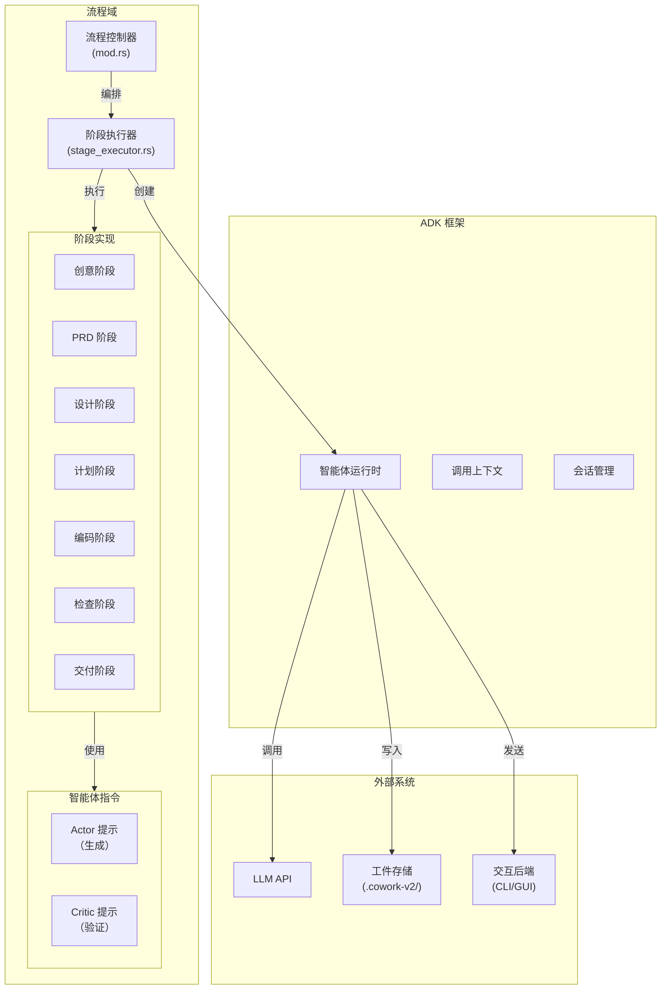
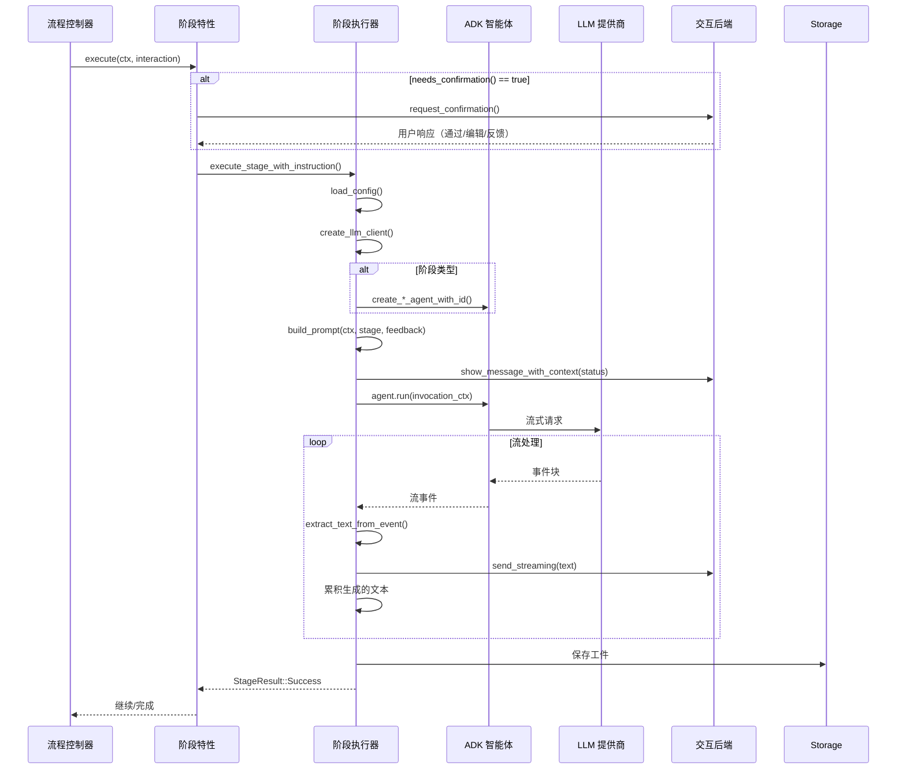
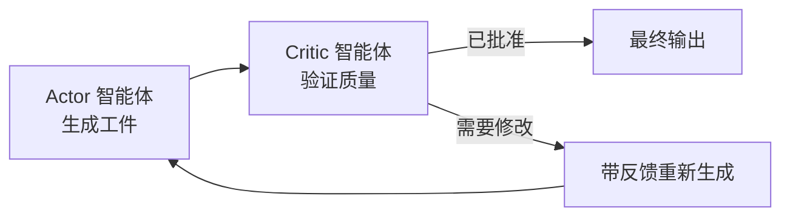

# 流程域技术文档

**版本：** 1.0  
**模块：** `cowork-core::pipeline`  
**最后更新：** 2026-02-14 05:14:32 (UTC)

## 1. 概述

流程域是 Cowork Forge 的中央编排引擎，实现了结构化的 7 阶段 AI 驱动软件开发生工作流。它通过迭代的、验证门的流程将自然语言需求转化为生产就绪代码，结合自主 AI 智能体和人工监督。

### 1.1 核心价值主张
- **结构化工作流**：通过顺序阶段（Idea → PRD → Design → Plan → Coding → Check → Delivery）强制执行架构严格性
- **质量保证**：带 AI 验证和人在回路（HITL）确认门的 Actor-Critic 模式
- **可扩展性**：策略模式实现自定义阶段实现，同时保持一致的执行语义
- **双接口支持**：统一执行框架通过 `InteractiveBackend` 抽象同时支持 CLI 自动化和 GUI 交互

### 1.2 域边界
流程域作为**核心业务域**在六边形架构中运行，依赖于：
- **域逻辑**：用于 `Project` 和 `Iteration` 实体管理
- **工具域**：用于智能体能力（文件操作、数据 CRUD、验证）
- **LLM 集成**：用于通过 `adk-rust` 的 AI 智能体编排
- **交互域**：用于人工反馈收集和进度流式传输

## 2. 架构设计

### 2.1 高级架构



### 2.2 设计模式

| 模式 | 实现 | 目的 |
|---------|---------------|---------|
| **策略** | 带 7 个具体实现的 `Stage` 特性 | 多态阶段执行，允许统一对待不同的阶段逻辑 |
| **Actor-Critic** | PRD、Design、Plan、Coding 阶段的双智能体循环 | 通过生成（Actor）和批评（Critic）循环的质量验证 |
| **模板方法** | `execute_stage_with_instruction()` | 带阶段特定定制点的通用执行框架 |
| **桥接** | `StageExecutor` 连接域逻辑与 `adk-rust` | 将流程编排与智能体框架细节解耦 |
| **状态机** | `StageResult` 变体（Success、Failed、Paused、NeedsRevision） | 明确处理阶段执行结果和转换 |

## 3. 核心组件

### 3.1 阶段特性抽象

`Stage` 特性定义了所有流程阶段的契约，启用多态执行，同时保持类型安全：

```rust
#[async_trait]
pub trait Stage: Send + Sync {
    /// Unique stage identifier (e.g., "idea", "prd", "coding")
    fn name(&self) -> &str;
    
    /// Human-readable description of stage purpose
    fn description(&self) -> bool;
    
    /// Determines if HITL confirmation is required before proceeding
    fn needs_confirmation(&self) -> bool;
    
    /// Primary execution entry point
    async fn execute(
        &self, 
        ctx: &PipelineContext, 
        interaction: &Arc<dyn InteractiveBackend>
    ) -> Result<StageResult>;
    
    /// Feedback-driven regeneration entry point
    async fn execute_with_feedback(
        &self, 
        ctx: &PipelineContext, 
        interaction: &Arc<dyn InteractiveBackend>,
        feedback: &str
    ) -> Result<StageResult>;
}
```

**关键设计决策：**
- **零大小类型**：所有阶段实现（`IdeaStage`、`PrdStage` 等）都是无字段的单元结构，将所有行为委托给共享执行器，带阶段特定常量
- **异步特性**：使用 `#[async_trait]` 跨阶段边界支持异步执行
- **反馈循环**：明确的 `execute_with_feedback()` 方法实现迭代优化，无需阶段特定逻辑重复

### 3.2 阶段实现

七个具体阶段实现提供工作流结构：

| 阶段 | 类型 | 确认 | 智能体模式 | 输出工件 |
|-------|------|-------------|---------------|-----------------|
| **Idea** | 单独 | 是 | 单智能体 | `idea.md` |
| **PRD** | 循环 | 是 | Actor-Critic | `prd.md` |
| **Design** | 循环 | 是 | Actor-Critic | `design.md` |
| **Plan** | 循环 | 是 | Actor-Critic | `plan.md` |
| **Coding** | 循环 | 是 | Actor-Critic | 代码文件 |
| **Check** | 单独 | 否 | 单智能体 | `check_report.md` |
| **Delivery** | 单独 | 否 | 单智能体 | `delivery_report.md` |

**实现模式：**
每个阶段是实现 `Stage` 特性的零大小类型：
```rust
pub struct DesignStage;

#[async_trait]
impl Stage for DesignStage {
    fn name(&self) -> &str { "design" }
    fn needs_confirmation(&self) -> bool { true }
    
    async fn execute(&self, ctx: &PipelineContext, interaction: &Arc<dyn InteractiveBackend>) -> Result<StageResult> {
        execute_stage_with_instruction(
            ctx, 
            interaction, 
            "design", 
            DESIGN_ACTOR_INSTRUCTION,
            None
        ).await
    }
    // ... execute_with_feedback implementation
}
```

### 3.3 阶段执行器

`StageExecutor`（`stage_executor.rs`）作为流程域和 `adk-rust` 智能体框架之间的**适配器**：

**职责：**
1. **智能体生命周期管理**：创建阶段特定智能体（`create_idea_agent_with_id`、`create_prd_loop_with_id` 等）
2. **上下文准备**：构建带项目状态、迭代元数据和历史上下文的 `InvocationContext`
3. **提示工程**：通过 `build_prompt()` 构建结合指令、反馈和内存的上下文提示
4. **流式处理**：管理实时 LLM 输出流式传输，带事件提取和 UI 传播
5. **工件协调**：将生成内容持久化到 `.cowork-v2/iterations/{id}/artifacts/{stage}.md`

**ADK 集成：**
实现自定义特性以连接域模型与智能体框架：
- `SimpleInvocationContext`：提供智能体配置、内存访问和运行配置
- `SimpleSession`：管理对话历史和状态持久化
- `SimpleState`：跨流式传输块的智能体状态键值存储

### 3.4 智能体指令

位于 `crates/cowork-core/src/instructions/`，此子系统包含约 **2000 行提示工程**，定义 AI 智能体行为：

**结构：**
- **Actor 指令**：定义生成行为、输出格式和工具使用模式
- **Critic 指令**：定义验证标准、质量标准和反馈生成
- **工具模式**：嵌入函数调用定义用于 `save_idea`、`get_requirements`、`update_task_status`、`goto_stage` 等

**示例流程（Design 阶段）：**
1. **Design Actor** 使用 `DESIGN_ACTOR_INSTRUCTION` 生成架构文档
2. **Design Critic** 使用 `DESIGN_CRITIC_INSTRUCTION` 根据标准验证
3. 如果验证失败，Critic 提供反馈触发重新生成循环
4. 批准后，最终工件持久化到存储

## 4. 执行流程

### 4.1 标准执行序列



### 4.2 Actor-Critic 循环（复杂阶段）

对于 PRD、Design、Plan 和 Coding 阶段，系统实现 **Actor-Critic 模式**：



**实现细节：**
- **循环智能体**：专业智能体构造函数（`create_prd_loop_with_id` 等）实例化配对的 Actor-Critic 智能体
- **迭代控制**：最大迭代限制防止无限重新生成循环
- **反馈集成**：Critic 批评作为反馈传递给 Actor 的下次生成尝试

### 4.3 人在回路集成

关键阶段（Idea、PRD、Design、Plan、Coding）实施确认门：

**确认点：**
1. **执行前**：用户批准进入阶段
2. **执行后**：用户在继续前审查生成的工件

**交互模式：**
- **Pass**：批准并继续下一阶段
- **Edit**：在外部编辑器中打开工件，重新加载修改内容
- **Feedback**：提供触发 `execute_with_feedback()` 的文本反馈

## 5. 数据模型和上下文

### 5.1 PipelineContext

跨阶段携带状态的执行上下文：

```rust
pub struct PipelineContext {
    pub project: Project,           // Project aggregate root
    pub iteration: Iteration,       // Current iteration entity
    pub workspace_path: PathBuf,    // Sandbox directory for artifacts
    // Additional configuration and state...
}
```

### 5.2 StageResult

强制状态机语义的结果类型：

```rust
pub enum StageResult {
    Success(Option<String>),    // Artifact content (optional)
    Failed(String),             // Error message
    Paused,                     // Awaiting external input
    NeedsRevision(String),      // Feedback for regeneration
}
```

### 5.3 工件存储

工件遵循结构化存储约定：
```
.cowork-v2/
└── iterations/
    └── {iteration_id}/
        └── artifacts/
            ├── idea.md
            ├── prd.md
            ├── design.md
            ├── plan.md
            ├── check.md
            └── delivery.md
```

## 6. 集成点

### 6.1 接口抽象

`InteractiveBackend` 特性（`crates/cowork-core/src/interaction/`）抽象 UI 关注点：

```rust
#[async_trait]
pub trait InteractiveBackend: Send + Sync {
    async fn show_message(&self, level: MessageLevel, message: &str);
    async fn show_message_with_context(&self, level: MessageLevel, message: &str, context: MessageContext);
    async fn send_streaming(&self, content: &str, display_name: &str, is_complete: bool);
    async fn request_confirmation(&self, content: &str) -> Result<UserResponse>;
}
```

**实现：**
- **CLI 后端**：带彩色输出的终端 UI，使用 `dialoguer`
- **Tauri 后端**：通过 Tauri 的 IPC 系统向 React 前端发射事件

### 6.2 LLM 集成

阶段执行器通过以下方式与 **LLM 集成域**交互：
- **限流客户端**：所有请求通过 `RateLimitedLlm`（30 次/分钟，并发=1）
- **配置加载**：`load_config()` 从 TOML 文件或环境变量解析 LLM 设置
- **模型选择**：阶段特定模型配置（如 Design 阶段使用更强模型，Check 阶段使用更快模型）

### 6.3 工具系统集成

智能体在执行期间调用 **工具域**的工具：
- **文件工具**：`ReadFileTool`、`WriteFileTool` 用于工件操作
- **数据工具**：`GetRequirementsTool`、`UpdateTaskStatusTool` 用于项目状态管理
- **HITL 工具**：`ReviewAndEditContentTool` 用于人工验证
- **内存工具**：`QueryMemoryTool` 用于历史上下文检索

## 7. 配置和可扩展性

### 7.1 添加新阶段

实现新流程阶段：

1. **创建阶段结构**：
```rust
pub struct CustomStage;
```

2. **实现阶段特性**：
```rust
#[async_trait]
impl Stage for CustomStage {
    fn name(&self) -> &str { "custom" }
    fn needs_confirmation(&self) -> bool { true }
    
    async fn execute(&self, ctx: &PipelineContext, interaction: &Arc<dyn InteractiveBackend>) -> Result<StageResult> {
        execute_stage_with_instruction(
            ctx,
            interaction,
            "custom",
            CUSTOM_INSTRUCTION,
            None
        ).await
    }
}
```

3. **定义指令**：
在 `crates/cowork-core/src/instructions/custom.rs` 创建 `CUSTOM_INSTRUCTION` 常量。

4. **注册到流程**：
添加到 `crates/cowork-core/src/pipeline/mod.rs` 中的 `get_all_stages()`。

### 7.2 自定义智能体行为

通过以下方式修改阶段行为：
- **指令更新**：编辑 `instructions/` 模块中的提示常量
- **工具注入**：通过在 `stage_executor.rs` 中向智能体构造函数添加工具来扩展智能体能力
- **上下文丰富**：修改 `build_prompt()` 以包含额外域上下文

## 8. 错误处理和弹性

### 8.1 错误类别

| 类别 | 处理策略 | 恢复 |
|----------|------------------|----------|
| **LLM 错误** | 指数退避重试 | StageResult::Failed |
| **工具执行** | 验证 + 回滚 | StageResult::Failed |
| **用户取消** | 优雅关闭 | StageResult::Paused |
| **验证失败** | Actor-Critic 循环 | StageResult::NeedsRevision |

### 8.2 流式传输弹性

- **部分内容持久化**：流式传输块在内存中累积，仅在成功完成后持久化
- **超时处理**：长时间生成有可配置超时
- **中断恢复**：支持在阶段边界暂停和恢复

## 9. 性能考虑

### 9.1 并发模型
- **单一流程执行**：每个迭代只有一个流程运行（由迭代状态机强制）
- **顺序阶段**：阶段串行执行以保持依赖排序
- **异步 I/O**：所有文件操作和 LLM 请求非阻塞（Tokio 运行时）

### 9.2 资源管理
- **内存**：流式处理防止将大工件完全加载到内存
- **限流**：全局信号量确保符合 LLM API 配额
- **存储**：工件原子写入以防止损坏

## 10. 安全考虑

### 10.1 路径验证
所有文件操作根据迭代工作区验证路径：
```rust
// Implicit in File Tools via Security domain
assert!(path.starts_with(&ctx.workspace_path));
```

### 10.2 沙箱
- **工作区隔离**：智能体只能访问 `.cowork-v2/iterations/{id}/` 内的文件
- **命令限制**：`RunCommandTool` 根据白名单验证命令
- **无网络访问**：智能体无法发起出站网络请求（除非通过 LLM 客户端）

## 11. 测试策略

### 11.1 单元测试
- **阶段逻辑**：使用模拟 `InteractiveBackend` 测试单个阶段行为
- **提示验证**：验证指令常量编译并包含所需占位符
- **结果处理**：测试 `StageResult` 状态转换

### 11.2 集成测试
- **端到端流程**：使用存根 LLM 响应执行完整 7 阶段工作流
- **HITL 模拟**：模拟确认门的人工输入
- **工件验证**：验证生成文件匹配预期模式

## 12. 未来增强

### 12.1 计划改进
- **并行阶段执行**：独立阶段（Check + Delivery）可以并发执行
- **检查点恢复**：系统重启后从任意阶段恢复
- **动态阶段注入**：运行时阶段注册用于插件架构

### 12.2 架构演进
- **事件溯源**：考虑用于复杂工作流可视化的事件溯源流程状态
- **分布式执行**：用于计算密集型编码阶段的远程智能体执行

---

## 附录 A：文件结构

```
crates/cowork-core/src/pipeline/
├── mod.rs                    # Pipeline controller and stage orchestration
├── stage_executor.rs         # ADK integration and execution framework
├── stages/
│   ├── idea.rs              # Idea stage implementation
│   ├── prd.rs               # PRD stage (Actor-Critic)
│   ├── design.rs            # Design stage (Actor-Critic)
│   ├── plan.rs              # Plan stage (Actor-Critic)
│   ├── coding.rs            # Coding stage (Actor-Critic)
│   ├── check.rs             # Quality check stage
│   └── delivery.rs          # Final delivery stage
└── ... 

crates/cowork-core/src/instructions/
├── idea.rs                  # Idea agent prompts
├── prd.rs                   # PRD Actor/Critic prompts
├── design.rs                # Design Actor/Critic prompts
├── plan.rs                  # Plan Actor/Critic prompts
├── coding.rs                # Coding Actor/Critic prompts
├── check.rs                 # Check agent prompts
├── delivery.rs              # Delivery agent prompts
└── ... 
```

## 附录 B：术语表

- **ADK**：智能体开发工具包（用于 LLM 智能体编排的 Rust 框架）
- **Actor-Critic**：一个智能体生成内容（Actor）另一个验证（Critic）的 ML 模式
- **创世迭代**：初始项目创建工作流（所有 7 阶段）
- **演进迭代**：在先前工作基础上构建的后续迭代
- **HITL**：人在回路（人工验证门）
- **阶段**：具有特定输入和输出的离散流程阶段
- **工件**：阶段生成的持久输出（Markdown 文件、代码等）