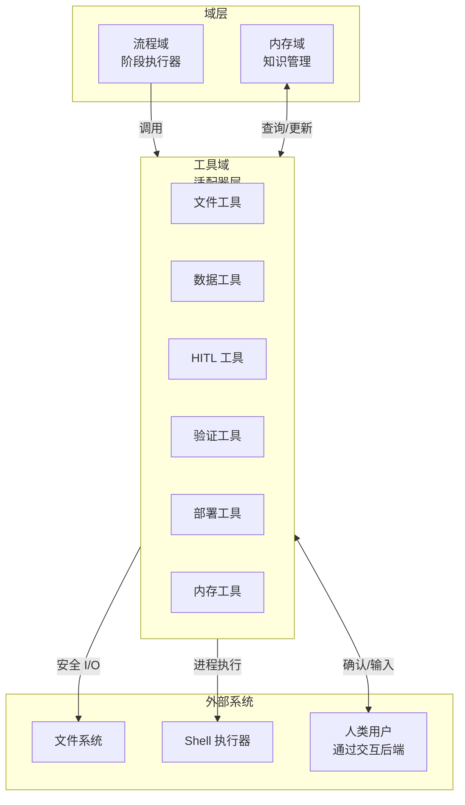
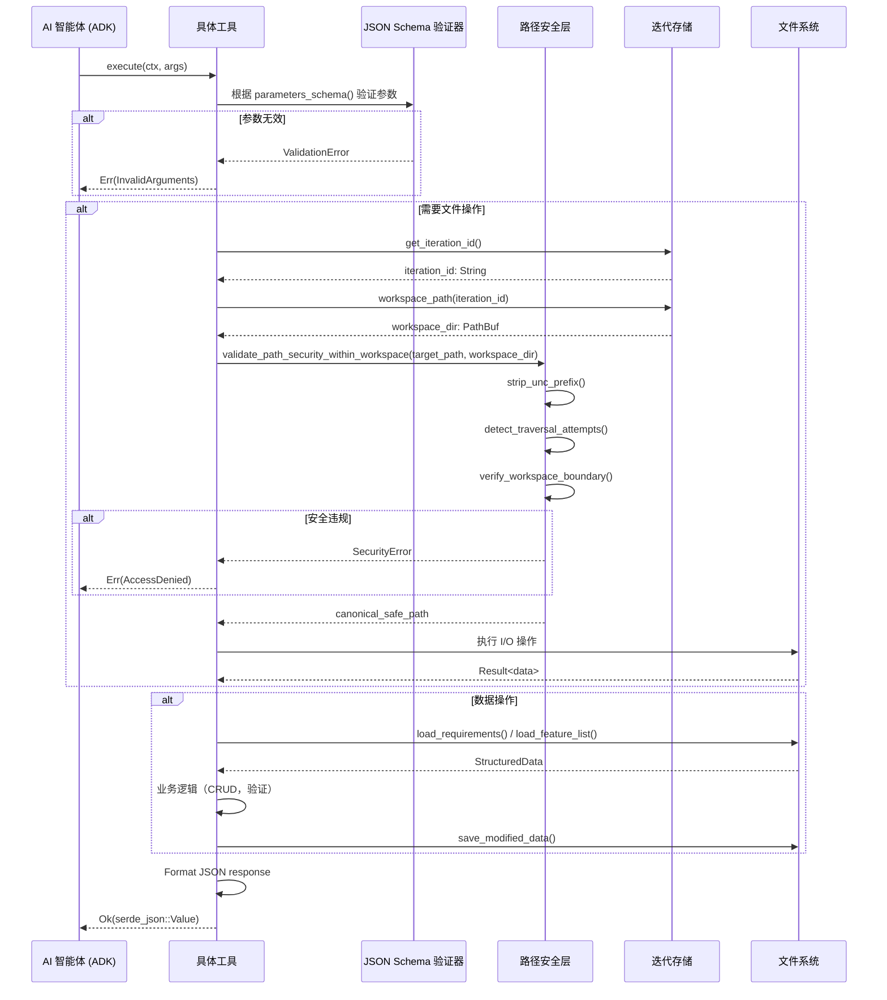

**工具域技术文档**
**Cowork Forge – AI 原生迭代开发平台**

**生成时间：** 2026-02-14 05:17:26 (UTC)  
**版本：** 1.0  
**域：** 支持域（基础设施）  
**Crate：** `cowork-core`

---

## 1. 执行概述

**工具域**为 Cowork Forge 中 AI 智能体和主机系统之间提供全面的操作接口。作为 7 阶段 AI 流程的执行层，该域实现了 30+ 专业工具，遵循 ADK（智能体开发工具包）`Tool` 特性规范。这些工具使 AI 智能体能够执行安全文件操作、管理结构化项目数据、通过验证门与人类用户交互、查询机构内存以及执行部署工作流。

**关键架构价值：**
- **安全优先设计**：通过路径遍历预防和 UNC 路径规范化强制执行严格的工作区隔离
- **统一接口**：标准化的基于 `async_trait` 的工具合约实现无缝智能体集成
- **跨平台兼容性**：统一处理 Windows UNC 路径和 POSIX 文件系统语义
- **人在回路（HITL）集成**：通过 `InteractiveBackend` 抽象将自动化智能体执行与人工监督桥接

---

## 2. 架构定位

在 Cowork Forge 的六边形架构中，工具域作为**基础设施适配器**运行，将域操作转换为系统级操作。它位于流程域（编排 AI 智能体）和外部系统（文件系统、进程执行器、人类用户）之间。



**依赖关系：**
- **上游**：流程域（通过阶段执行器）、智能体编排框架（`adk-rust`）
- **下游**：持久化域（IterationStore、MemoryStore）、交互域（InteractiveBackend）、文件系统

---

## 3. 工具分类

该域将 30+ 工具组织为六个功能类别，每个类别解决 AI 驱动开发生命周期中的特定操作关注点。

### 3.1 文件工具（`file_tools.rs`）
**目的**：工作区边界内的安全文件系统操作
- **ListFilesTool**：带模式匹配的目录遍历（使用 `walkdir`）
- **ReadFileTool**：带编码处理的完整文件内容检索
- **ReadFileTruncatedTool**：大文件的智能截断，带行数限制
- **ReadFileWithLimitTool**：调用计数限制的读取，防止令牌耗尽
- **WriteFileTool**：带父目录创建的原子文件写入
- **RunCommandTool**：带 30 秒超时和阻塞命令检测的 Shell 执行（防止 `vim` 等交互式命令）

### 3.2 数据工具（`data_tools.rs`）
**目的**：需求、特征和任务的结构化数据管理
- **需求管理**：`CreateRequirementTool`、`GetRequirementsTool`（REQ-ID 前缀）
- **特征管理**：`AddFeatureTool`、`UpdateFeatureStatusTool`、`GetDesignDocumentTool`（FEAT-ID 前缀）
- **任务管理**：`CreateTaskTool`、`UpdateTaskStatusTool`（TASK-ID 前缀，支持 pending→in_progress→completed/blocked 工作流）
- **组件管理**：`AddComponentTool`、`GetImplementationPlanTool`（COMP-ID 前缀）
- **状态工作流**：强制有效状态转换和依赖跟踪

### 3.3 HITL 工具（`hitl_tools.rs`、`hitl_content_tools.rs`）
**目的**：用于验证和优化的智能体-人交互
- **ReviewAndEditFileTool**：文件审查的二进制工作流（pass/edit），带外部编辑器集成
- **ReviewWithFeedbackFileTool**：三元工作流（pass/edit/feedback），启用带人类注释的智能体重新生成
- **ReviewAndEditContentTool**：生成工件（PRD、Design 文档）的内容级审查
- **ReviewWithFeedbackContentTool**：反馈驱动的内容优化

### 3.4 验证工具（`validation_tools.rs`）
**目的**：数据完整性和一致性验证
- **CheckDataFormatTool**：结构化数据文件的 JSON Schema 验证
- **CheckFeatureCoverageTool**：特征和需求之间的双向覆盖分析
- **CheckTaskDependenciesTool**：使用深度优先搜索（DFS）算法的循环依赖检测

### 3.5 部署工具（`deployment_tools.rs`）
**目的**：工作区工件到项目根的安全提升
- **CopyWorkspaceToProjectTool**：两阶段部署策略：
  - **阶段 1**：孤立文件清理（移除不在工作区的文件，受保护路径：`.git/`、`config.toml`、`README.md`）
  - **阶段 2**：扩展名过滤复制（白名单：`.html`、`.css`、`.js`、`.ts`、`.tsx`、`.json`、`.md`、图像、字体）

### 3.6 内存工具（`memory_tools.rs`）
**目的**：跨迭代的知识持久化和检索
- **QueryMemoryTool**：跨三个范围（project、iteration、smart-merged）的模糊关键词搜索
- **SaveInsightTool**：带分类的迭代见解捕获
- **SaveIssueTool**：记录技术债务和已知问题
- **SaveLearningTool**：记录架构学习
- **PromoteToDecisionTool**：将见解提升为架构决策
- **PromoteToPatternTool**：将见解提升为可重用设计模式

---

## 4. 核心实现模式

### 4.1 ADK 工具特性合约
所有工具实现来自 `adk_core` 的标准化 `Tool` 特性，确保与智能体框架的互操作性：

```rust
#[async_trait]
pub trait Tool: Send + Sync {
    fn name(&self) -> &str;
    fn description(&self) -> &str;
    fn parameters_schema(&self) -> Value; // JSON Schema for validation
    
    async fn execute(
        &self, 
        ctx: Arc<dyn ToolContext>, 
        args: Value
    ) -> adk_core::Result<Value>;
}
```

**关键实现细节：**
- **异步执行**：所有工具操作使用 `async_trait` 和 Tokio 运行时非阻塞
- **JSON Schema 验证**：参数在执行前根据声明的模式验证
- **结构化输出**：结果作为 `serde_json::Value` 返回，带一致的错误包装
- **上下文注入**：`ToolContext` 提供对迭代 ID 和全局状态的访问

### 4.2 工作区隔离架构
**安全模型**：所有接触文件系统的工具强制执行**工作区隔离**，以防止目录遍历攻击并确保项目隔离。

**验证流程：**
1. **UNC 规范化**：剥离 Windows UNC 前缀（`\\?\`）使用 `strip_unc_prefix()` 以实现跨平台路径一致性
2. **遍历检测**：拒绝包含 `..` 组件的路径（目录逃逸尝试）
3. **绝对路径阻止**：阻止绝对路径（如 `/etc/passwd`、`C:\Windows`），强制使用相对路径
4. **边界验证**：解析规范路径并验证它们位于迭代工作区内

```rust
pub fn validate_path_security_within_workspace(
    path: &Path,
    workspace: &Path
) -> Result<PathBuf, ToolError> {
    let normalized = strip_unc_prefix(path);
    if normalized.components().any(|c| c == Component::ParentDir) {
        return Err(ToolError::SecurityViolation("Path traversal detected".into()));
    }
    // Additional absolute path and boundary checks...
}
```

### 4.3 全局后端集成
HITL 工具需要通过 `InteractiveBackend` 特性访问用户界面层（CLI 或 GUI）。该域使用**全局单例模式**（通过 `Lazy<Mutex>` 线程安全）提供后端访问，而不污染工具签名：

```rust
static INTERACTION_BACKEND: Lazy<Mutex<Option<Arc<dyn InteractiveBackend>>>> = 
    Lazy::new(|| Mutex::new(None));

pub fn set_interaction_backend(backend: Arc<dyn InteractiveBackend>) {
    *INTERACTION_BACKEND.lock().unwrap() = Some(backend);
}
```

---

## 5. 工具执行生命周期

以下序列说明了 AI 智能体调用工具时的完整执行流：



---

## 6. 域特定行为

### 6.1 数据工具：ID 生成和工作流
数据工具使用 `generate_id()` 实用程序实现**结构化 ID 生成**：
- 需求：`REQ-001`、`REQ-002`
- 特征：`FEAT-001`
- 组件：`COMP-001`
- 任务：`TASK-001`

**状态工作流强制：**
任务强制有限状态机：`pending` → `in_progress` → (`completed` | `blocked`)。无效转换带描述性错误被拒绝。

### 6.2 验证工具：依赖分析
`CheckTaskDependencyTool` 使用 DFS 实现**循环检测**：
1. 从任务依赖构建邻接表
2. 跟踪已访问节点和递归栈
3. 检测指示循环依赖的回边
4. 返回识别循环链的详细错误消息

### 6.3 部署工具：安全协议
部署工具实施**破坏性操作安全**：
- **受保护路径**：删除时硬编码排除 `.git/`、`README.md` 和 `config.toml`
- **扩展名白名单**：仅复制明确批准用于部署的文件类型（源映射、配置文件和文档除非列入白名单）
- **两阶段提交**：清理阶段仅在成功的工作区验证后执行；复制阶段仅在成功清理后执行

---

## 7. 与相邻域的集成

### 7.1 持久化域
工具通过**存储抽象**与持久化交互：
- **IterationStore**：解析工作区路径并管理迭代元数据
- **MemoryStore**：内存工具的知识持久化处理
- **直接 FS**：文件工具绕过存储进行原始 I/O，但保持路径验证

### 7.2 内存域
内存工具作为内存域的**写入路径**：
- **查询操作**：委托给 `MemoryStore` 带 `MemoryQuery` 过滤（scope、category、keyword）
- **写操作**：追加到 `IterationKnowledge` 结构，带自动时间戳（`chrono`）
- **提升逻辑**：使用 `memory_tools.rs` 中的域逻辑将见解提升为决策/模式

### 7.3 交互域
HITL 工具消费 `InteractiveBackend` 特性：
- **CLI 实现**：使用 `dialoguer` 的基于终端的提示，带彩色输出（`colored` crate）
- **GUI 实现**：Tauri 事件发射（`input_request` 事件）带 oneshot 通道响应处理
- **超时处理**：GUI 后端为人类响应实现 3000 秒超时以防止无限阻塞

---

## 8. 错误处理和可观察性

### 8.1 错误分类
工具返回分类的结构化错误：
- **SecurityError**：路径违规、工作区逃逸
- **ValidationError**：模式不匹配、无效状态转换
- **IOError**：文件系统失败、权限被拒绝
- **TimeoutError**：命令执行超出限制
- **UserCancelledError**：用户中止的 HITL 交互

### 8.2 日志和透明度
所有工具执行通过 `println!` 宏发出结构化控制台输出以提高用户可见性：
```rust
println!("[Tool] Writing file: {}", path.display());
println!("[Tool] Command output: {}", stdout);
```

这确保 CLI 和 GUI 上下文中智能体行为的透明性（GUI 通过 Tauri 进程流捕获 stdout）。

---

## 9. 扩展指南

在该域中实现新工具：

1. **实现工具特性**：定义 `name()`、`description()` 和 `parameters_schema()`
2. **安全验证**：对于文件系统操作，始终使用 `validate_path_security_within_workspace()`
3. **上下文访问**：从全局存储检索 `iteration_id` 用于工作区相对操作
4. **错误映射**：将内部错误转换为带描述性消息的 `adk_core::Result`
5. **注册**：添加到 `tools/mod.rs` 中的工具注册表以供智能体发现

**示例模式：**
```rust
pub struct MyNewTool;

#[async_trait]
impl Tool for MyNewTool {
    fn name(&self) -> &str { "my_new_tool" }
    
    async fn execute(&self, ctx: Arc<dyn ToolContext>, args: Value) -> Result<Value> {
        // Parameter extraction
        // Security validation (if FS involved)
        // Business logic execution
        // JSON result formatting
    }
}
```

---

## 10. 性能考虑

- **异步并发**：工具执行是非阻塞的，允许流程处理多个并发工具调用（受 LLM 限流约束）
- **文件截断**：大文件处理使用 `ReadFileTruncatedTool` 防止 LLM 上下文中的令牌溢出
- **调用限制**：`ReadFileWithLimitTool` 实现调用计数跟踪以防止递归文件读取攻击
- **缓存**：IterationStore 路径在每个执行上下文解析一次，跨工具调用重用

---

**文档结束**