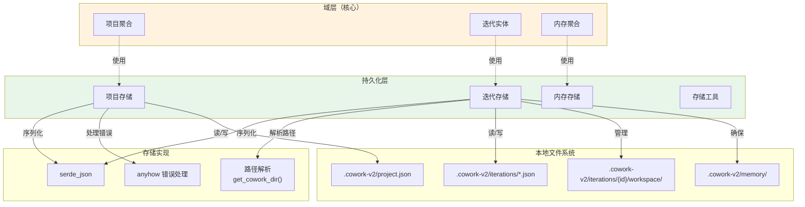
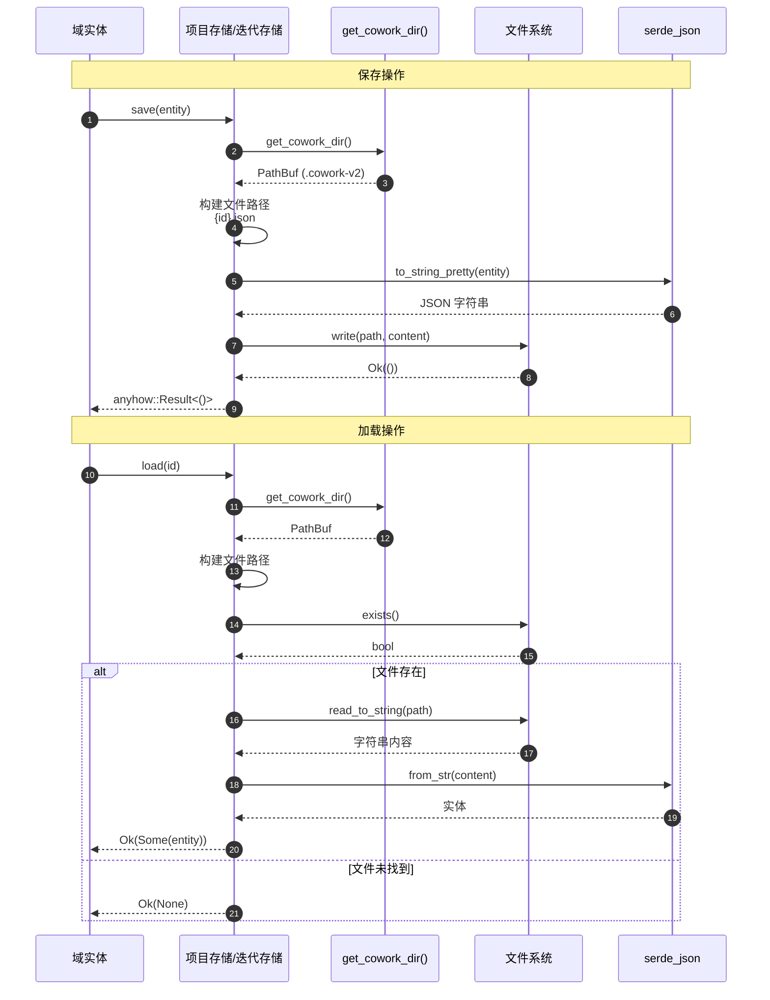
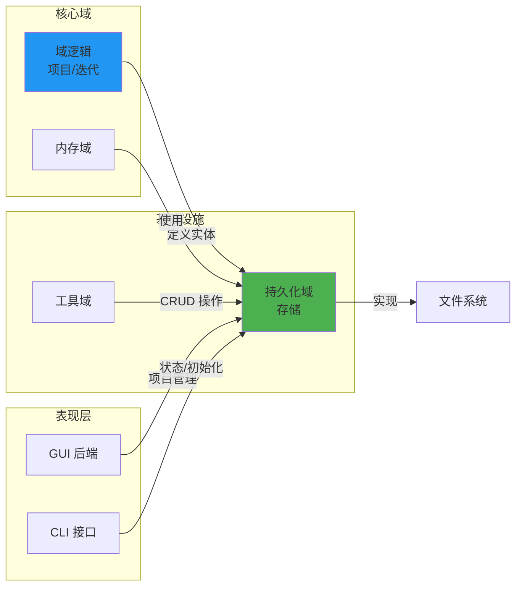

**持久化域技术文档**

**Cowork Forge** | **基础设施层** | **生成时间：** 2025-01-09 08:23:45 UTC

---

## 1. 概述

**持久化域**为 Cowork Forge 平台提供持久化存储抽象，实现文件数据访问层（DAL），将域实体持久化到本地文件系统。该域桥接核心业务逻辑（Project、Iteration 和 Memory 聚合）与长期存储，确保项目跨开发会话和系统重启的连续性。

**关键职责：**
- 实体序列化和反序列化（基于 JSON）
- 工作区目录结构管理（`.cowork-v2` 约定）
- 平台特定路径解析和文件 I/O 操作
- 工件存储的迭代作用域工作区隔离
- 原子写入操作和数据完整性强制

**架构分类：** 基础设施域（支持核心业务域）

---

## 2. 架构位置

持久化域位于六边形架构的基础设施层，实现**仓库模式**以将存储机制从域逻辑中抽象。它提供无状态数据访问对象（DAO），在域实体和持久化存储格式之间进行转换。

### 2.1 层级关系



### 2.2 设计模式

- **仓库模式：** 通过存储接口（`ProjectStore`、`IterationStore`）抽象数据访问，允许域层保持持久化不可知
- **数据访问层（DAL）：** 无状态服务层处理所有 CRUD 操作和查询能力
- **工作区隔离：** 每个迭代维护隔离的工作区目录，防止并发或历史迭代之间的工件冲突

---

## 3. 核心组件

### 3.1 项目存储

**位置：** `crates/cowork-core/src/persistence/project_store.rs`

管理 `Project` 聚合根的持久化生命周期，处理项目元数据、迭代跟踪和配置存储。

**关键操作：**

| 方法 | 签名 | 描述 |
|--------|-----------|-------------|
| `load` | `() -> Result<Option<Project>>` | 从 `project.json` 加载项目元数据；如未初始化则返回 `None` |
| `save` | `(&Project) -> Result<()>` | 使用漂亮打印 JSON 格式化持久化项目状态 |
| `exists` | `() -> Result<bool>` | 检查当前工作区中的项目初始化 |
| `create` | `(name: &str, path: &Path) -> Result<Project>` | 初始化新项目，带目录结构脚手架 |
| `update` | `(&Project) -> Result<()>` | 更新现有项目元数据 |
| `add_iteration` | `(iteration_id: &str) -> Result<()>` | 在项目的迭代集合中注册新迭代 |
| `set_current_iteration` | `(iteration_id: &str) -> Result<()>` | 更新活动迭代指针 |

**存储模式：**
```json
{
  "id": "uuid-v4-string",
  "name": "Project Name",
  "description": "Optional description",
  "path": "/absolute/path/to/project",
  "tech_stack": {
    "language": "Rust",
    "framework": "Tauri",
    "project_type": "DesktopApp"
  },
  "iterations": ["iter-001", "iter-002"],
  "current_iteration": "iter-002",
  "created_at": "2025-01-09T08:23:45Z",
  "updated_at": "2025-01-09T10:15:22Z"
}
```

### 3.2 迭代存储

**位置：** `crates/cowork-core/src/persistence/iteration_store.rs`

管理迭代实体及其关联的工作区工件。实现 V2 架构模式，带迭代特定工作区隔离。

**关键操作：**

| 方法 | 签名 | 描述 |
|--------|-----------|-------------|
| `load` | `(iteration_id: &str) -> Result<Option<Iteration>>` | 按 UUID 检索特定迭代 |
| `save` | `(&Iteration) -> Result<()>` | 持久化迭代状态到 `iterations/{id}.json` |
| `delete` | `(iteration_id: &str) -> Result<()>` | 移除迭代元数据，可选清理工作区 |
| `load_all` | `() -> Result<Vec<Iteration>>` | 检索所有迭代，按迭代号升序排序 |
| `load_summaries` | `() -> Result<Vec<IterationSummary>>` | 轻量级查询，仅返回基本元数据 |
| `workspace_path` | `(iteration_id: &str) -> Result<PathBuf>` | 解析到迭代工作区目录的绝对路径 |
| `ensure_workspace` | `(iteration_id: &str) -> Result<PathBuf>` | 幂等目录创建，用于工作区和内存子目录 |
| `iteration_path` | `(iteration_id: &str) -> PathBuf` | 构造迭代工件子目录的路径 |

**工作区结构：**
```
.cowork-v2/
├── project.json
├── iterations/
│   ├── iter-001.json
│   ├── iter-002.json
│   └── iter-{uuid}/
│       ├── workspace/          # Generated artifacts (code, docs)
│       │   ├── src/
│       │   ├── docs/
│       │   └── ...
│       └── memory/             # Knowledge snapshots
│           └── knowledge.json
```

### 3.3 存储工具

**位置：** `crates/cowork-core/src/storage/*.rs`

为持久化操作提供低级存储原语和横切关注点。

**关键功能：**

- **`get_cowork_dir()`**：解析与项目根相对的 `.cowork-v2` 目录路径，带平台特定路径规范化（处理 Windows UNC 路径）
- **`get_iteration_id()`**：从全局状态或文件系统检索当前活动迭代标识符
- **路径验证**：确保所有文件操作保持在项目工作区边界内（安全包含）

---

## 4. 存储约定和模式

### 4.1 目录结构

持久化域在项目根的 `.cowork-v2` 隐藏目录下强制执行严格目录约定：

| 路径组件 | 目的 | 生命周期 |
|----------------|---------|-----------|
| `project.json` | 项目元数据、技术栈、迭代注册表 | 持久（项目生命周期） |
| `iterations/` | 迭代元数据存储 | 持久（追加） |
| `iterations/{id}/workspace/` | 生成的工件、代码、文档 | 迭代作用域 |
| `iterations/{id}/memory/` | 知识快照、学习数据 | 迭代作用域 |
| `memory/` | 全局项目内存索引 | 持久 |

### 4.2 序列化策略

- **格式：** JSON（漂亮打印，2 空格缩进，人类可读）
- **库：** `serde_json`，使用 `to_string_pretty()` 写入和 `from_str()` 读取
- **错误处理：** `anyhow` crate 用于上下文丰富的错误传播
- **编码：** UTF-8 标准编码

### 4.3 并发模型

实现使用**同步、阻塞 I/O** 操作，适合桌面应用程序上下文：
- 文件操作是原子的（写入临时然后重命名模式，在适用的情况下）
- 不需要数据库锁定机制（文件系统级隔离）
- 适合单用户本地执行模型

---

## 5. 数据流和操作

### 5.1 实体持久化流



### 5.2 工作区初始化流

创建新迭代时，`IterationStore` 确保适当的工作区脚手架：

1. **目录创建：** `ensure_workspace()` 递归创建 `iterations/{id}/workspace/`
2. **内存目录：** 确保 `iterations/{id}/memory/` 存在用于知识持久化
3. **路径解析：** 返回用于下游工件生成的绝对 `PathBuf`
4. **验证：** 确认工作区包含在项目边界内

---

## 6. 错误处理和安全性

### 6.1 错误策略

- **库：** `anyhow` 用于错误上下文和传播
- **模式：** 提前返回，使用 `?` 操作符用于 I/O 和序列化错误
- **用户反馈：** 错误冒泡到接口层（CLI/GUI）用于用户呈现
- **恢复：** 优雅处理缺失文件（返回 `Option<T>` 而不是失败）

### 6.2 安全考虑

- **路径遍历预防：** 所有路径通过 `get_cowork_dir()` 解析，验证操作保持在 `.cowork-v2` 层次结构内
- **工作区包含：** 文件工具（在工具域中）在委托给持久化域之前根据项目根验证路径
- **原子写入：** 关键元数据更新使用写入临时重命名模式以防止中断时损坏

---

## 7. 与其他域的集成

### 7.1 上游依赖（消费者）

| 域 | 使用模式 | 集成点 |
|-----------|--------------|-------------------|
| **域逻辑** | 持久化的核心实体定义结构 | 传递给 Store 方法的 `Project`、`Iteration` 结构 |
| **工具域** | 文件工具、数据工具、内存工具需要存储 | 用于 CRUD 操作的直接 Store 实例化 |
| **GUI 后端** | 项目管理、迭代列表 | `ProjectManager` 为 Tauri 命令包装 Store 操作 |
| **CLI 域** | 项目初始化、状态检查 | 命令处理器中的直接 Store 使用 |

### 7.2 下游依赖（提供者）

| 服务 | 目的 |
|---------|---------|
| **文件系统** | 本地磁盘 I/O 操作 |
| **serde_json** | 序列化/反序列化引擎 |
| **anyhow** | 错误处理和上下文 |

### 7.3 域关系图



---

## 8. 实现考虑

### 8.1 性能特征

- **延迟：** 低（本地文件系统操作，通常元数据 <10ms）
- **吞吐量：** 适合文档大小的 JSON 文件（<10MB）；未针对二进制 blob 存储优化
- **可扩展性：** 受文件系统性能限制；已测试每个项目最多 100+ 迭代
- **内存：** 未实现流式反序列化；整个 JSON 文档加载到内存（元数据规模可接受）

### 8.2 迁移和演化

V2 架构（当前）保持向后兼容性考虑：
- 模式演化通过 serde 的 `default` 属性处理新字段
- 目录结构通过 `.cowork-v2` 命名约定版本化（允许未来 V3 并行安装）
- 当前未实现自动化迁移工具；重大版本升级的手动迁移脚本

### 8.3 配置

无需外部配置。存储位置是确定性的：
- **路径解析：** `{project_root}/.cowork-v2/`
- **平台处理：** 通过 `std::path::PathBuf` 的跨平台路径分隔符
- **环境：** 尊重标准文件系统权限（Unix 上的 UMASK，Windows 上的 ACL）

---

## 9. 使用示例

### 9.1 项目初始化
```rust
// Creates project structure and persists metadata
let project = ProjectStore::create("MyApp", &project_path)?;
ProjectStore::save(&project)?;
```

### 9.2 迭代生命周期
```rust
// Save new iteration
let iteration = Iteration::new_genesis(&project_id, idea_description);
IterationStore::save(&iteration)?;

// Ensure workspace exists for artifact generation
let workspace = IterationStore::ensure_workspace(&iteration.id)?;
// workspace now points to .cowork-v2/iterations/{id}/workspace/
```

### 9.3 查询操作
```rust
// Load all iterations sorted by number
let iterations = IterationStore::load_all()?;
for iter in iterations {
    println!("Iteration {}: {}", iter.number, iter.status);
}

// Check project existence
if ProjectStore::exists()? {
    let project = ProjectStore::load()?.expect("Project exists");
}
```

---

## 10. 未来考虑

- **模式迁移：** 用于跨版本演进 JSON 模式的正式迁移框架
- **压缩：** 用于大型迭代历史记录的可选 gzip 压缩
- **缓存：** 频繁访问项目元数据的内存缓存层
- **备份：** `.cowork-v2` 目录完整性的自动备份策略

---

**文档版本：** 1.0  
**最后更新：** 2025-01-09  
**维护者：** Cowork Forge 架构团队