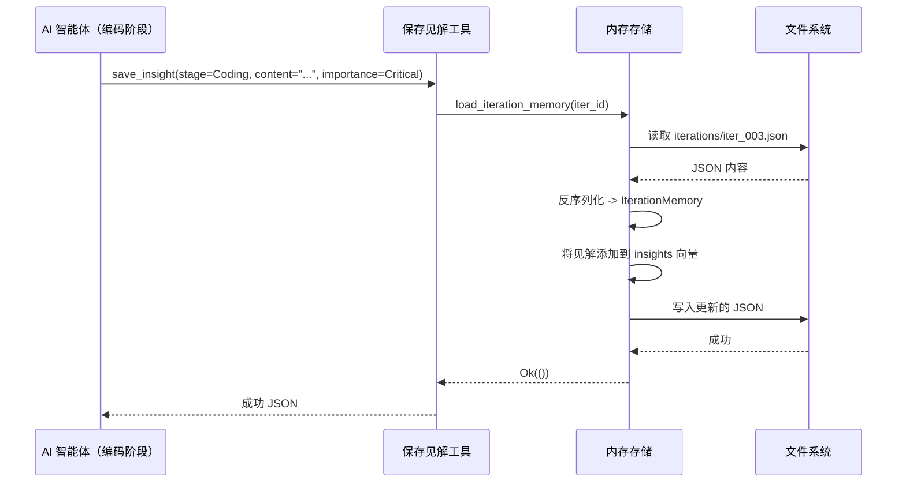
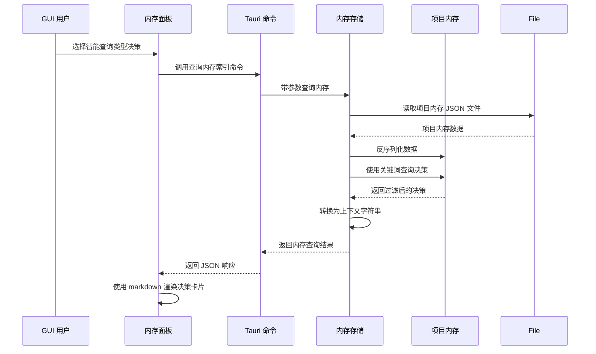

**内存域技术文档**

**版本：** 1.0  
**最后更新：** 2025-01-09  
**模块：** `cowork-core/src/domain/memory`  
**分类：** 核心业务域

---

## 1. 概述

**内存域**为 Cowork Forge 提供机构知识管理系统，通过复杂的双层内存架构实现跨多个开发迭代的项目连续性。该域实现仓库模式与聚合根设计，以持久化、查询和提升 AI 驱动开发流程中生成的知识工件。

### 1.1 目的和价值

- **知识持久化**：在软件开发生命周期中维护架构决策、设计模式和迭代特定见解
- **上下文连续性**：通过为 AI 智能体提供来自先前迭代的历史上下文实现演进开发
- **知识提升**：实施提升机制，将临时迭代见解转化为永久项目级决策和可重用模式
- **检索智能**：支持模糊关键词搜索、基于标签的过滤和 LLM 优化的上下文生成

### 1.2 架构位置

内存域位于流程域（生成知识）和工具域（消费知识）的交叉点。它作为系统的"集体记忆"，在执行期间可被 AI 智能体访问，也可通过 GUI/CLI 接口被人类用户访问。

---

## 2. 架构与设计原则

### 2.1 领域驱动设计结构

内存域遵循**领域驱动设计（DDD）**原则，具有清晰的聚合边界：

```
┌─────────────────────────────────────────────────────────────┐
│                    ProjectMemory                             │
│                  (Aggregate Root)                            │
├─────────────────────────────────────────────────────────────┤
│  ┌──────────────┐  ┌──────────────┐  ┌──────────────────┐  │
│  │  Decisions   │  │   Patterns   │  │ ProjectContext   │  │
│  │   [Vec]      │  │    [Vec]     │  │                  │  │
│  └──────────────┘  └──────────────┘  └──────────────────┘  │
│  ┌────────────────────────────────────────────────────────┐ │
│  │        IterationKnowledge [HashMap<iteration_id>]      │ │
│  │  ┌──────────────┬──────────────┬──────────────────┐  │ │
│  │  │   Insights   │    Issues    │    Learnings     │  │ │
│  │  └──────────────┴──────────────┴──────────────────┘  │ │
│  └────────────────────────────────────────────────────────┘ │
└─────────────────────────────────────────────────────────────┘
```

### 2.2 双层内存架构

系统实现双分存储模型：

**第一层：项目级内存**（`ProjectMemory`）
- **范围**：跨所有迭代全局
- **生命周期**：项目持续期间持久
- **内容**：架构决策、设计模式、项目上下文
- **存储**：`memory/project/memory.json`

**第二层：迭代级内存**（`IterationKnowledge` / `IterationMemory`）
- **范围**：特定于单个迭代
- **生命周期**：轮换（受保留策略约束）
- **内容**：见解、问题、学习、压缩的阶段摘要
- **存储**：`memory/iterations/{iteration_id}.json`

### 2.3 仓库模式实现

`MemoryStore` 充当仓库接口，将 JSON 文件持久化细节从域逻辑中抽象。它提供：
- `ProjectMemory` 的聚合持久化
- 迭代特定内存的 CRUD 操作
- 带过滤和合并能力的查询引擎
- 知识提升编排

---

## 3. 核心域模型

### 3.1 ProjectMemory（聚合根）

封装所有项目级知识的中心聚合：

```rust
pub struct ProjectMemory {
    pub project_id: String,
    pub created_at: DateTime<Utc>,
    pub updated_at: DateTime<Utc>,
    pub decisions: Vec<Decision>,
    pub patterns: Vec<Pattern>,
    pub context: ProjectContext,
    pub iteration_knowledge: HashMap<String, IterationKnowledge>,
}
```

**关键行为：**
- `query_decisions(keyword)`：跨决策标题和上下文进行模糊搜索
- `query_patterns(tag)`：按类别标签过滤模式
- `save_iteration_knowledge()`：缓存压缩的迭代摘要
- `cleanup_old_knowledge(keep_count)`：强制执行保留策略

### 3.2 IterationKnowledge

迭代重要信息的压缩快照，用于快速上下文加载：

```rust
pub struct IterationKnowledge {
    pub iteration_id: String,
    pub summaries: DocumentSummaries,  // Compressed idea, PRD, design, plan
    pub tech_stack: TechStackMetadata,
    pub key_decisions: Vec<String>,    // References to project decisions
    pub key_patterns: Vec<String>,     // References to project patterns
    pub code_structure: CodeStructureSummary,
    pub known_issues: Vec<String>,
    pub created_at: DateTime<Utc>,
}
```

### 3.3 IterationMemory

迭代执行遥测的详细捕获：

```rust
pub struct IterationMemory {
    pub iteration_id: String,
    pub insights: Vec<Insight>,    // AI-generated observations
    pub issues: Vec<Issue>,        // Problems encountered
    pub learnings: Vec<Learning>,  // Technical discoveries
    pub stage_results: Vec<StageResult>,
}
```

### 3.4 值对象

**Decision**：捕获带后果的架构选择
```rust
pub struct Decision {
    pub id: String,
    pub title: String,
    pub context: String,
    pub decision: String,
    pub consequences: Vec<String>,
    pub created_at: DateTime<Utc>,
    pub iteration_id: Option<String>,  // Source iteration if promoted
}
```

**Pattern**：可重用的设计解决方案
```rust
pub struct Pattern {
    pub id: String,
    pub name: String,
    pub description: String,
    pub usage_examples: Vec<String>,
    pub tags: Vec<String>,
    pub code_example: Option<String>,
    pub created_at: DateTime<Utc>,
}
```

**Insight**：带重要性级别的临时观察
```rust
pub struct Insight {
    pub id: String,
    pub content: String,
    pub stage: PipelineStage,
    pub importance: ImportanceLevel,  // Critical, Important, Normal
    pub created_at: DateTime<Utc>,
    pub promoted_to_decision: bool,
}
```

---

## 4. 持久化层

### 4.1 存储结构

```
.cowork-v2/
└── memory/
    ├── project/
    │   └── memory.json          # ProjectMemory aggregate
    └── iterations/
        ├── iter_001.json        # IterationMemory for iteration 1
        ├── iter_002.json        # IterationMemory for iteration 2
        └── ...
```

### 4.2 MemoryStore 接口

`MemoryStore` 提供持久化操作的主要 API：

**项目内存操作：**
- `load_project_memory(project_id) -> Result<ProjectMemory>`
- `save_project_memory(&ProjectMemory) -> Result<()>`
- `add_decision(project_id, Decision) -> Result<()>`
- `add_pattern(project_id, Pattern) -> Result<()>`

**迭代内存操作：**
- `load_iteration_memory(iteration_id) -> Result<IterationMemory>`
- `save_iteration_memory(&IterationMemory) -> Result<()>`

**查询操作：**
- `query(&MemoryQuery, iteration_id: Option<&str>) -> Result<MemoryQueryResult>`

### 4.3 序列化策略

- **格式**：人类可读的漂亮打印 JSON（`serde_json::to_string_pretty`）
- **时间追踪**：通过 `chrono::DateTime<Utc>` 的 ISO 8601 UTC 时间戳
- **模式演化**：通过 `#[serde(default)]` 的前向兼容结构定义

---

## 5. 查询引擎

### 5.1 查询范围

查询引擎支持三个语义范围：

| 范围 | 描述 | 用例 |
|-------|-------------|----------|
| `Project` | 仅查询项目级决策和模式 | 历史上下文检索 |
| `Iteration` | 仅查询特定迭代见解/问题 | 调试特定迭代 |
| `Smart` | 合并视图：项目内存 + 最新迭代知识 | 活动开发上下文 |

### 5.2 查询类型

```rust
pub enum MemoryQueryType {
    Decisions,    // 仅架构决策
    Patterns,    // 仅设计模式
    Insights,    // 仅 AI 观察
    Issues,      // 仅已知问题
    Learnings,   // 仅技术发现
    All,         // 跨所有类型的统一搜索
}
```

### 5.3 搜索能力

**模糊关键词搜索：**
- 标题和内容的，大小写不敏感子字符串匹配
- 搜索词的分词以支持部分匹配
- 结果排名的相关性评分

**基于标签的过滤：**
- 按类别标签检索模式（如 "architecture"、"performance"、"security"）
- 多标签交集支持

**时间过滤：**
- 知识检索的日期范围约束
- "最新 N 个"迭代限制

### 5.4 LLM 上下文生成

`MemoryQueryResult` 提供 `to_context_string()` 方法，将搜索结果格式化为 LLM 消费的优化提示：

```rust
impl MemoryQueryResult {
    pub fn to_context_string(&self) -> String {
        // Formats decisions, patterns, and insights
        // into structured markdown suitable for 
        // inclusion in AI agent prompts
    }
}
```

---

## 6. 知识提升

### 6.1 提升工作流

知识提升将临时迭代见解提升为永久项目资产：

```
┌──────────────┐     Critical Importance      ┌──────────────┐
│   Insight    │ ───────────────────────────> │   Decision   │
│  (Iteration) │    [PromoteToDecisionTool]   │   (Project)  │
└──────────────┘                              └──────────────┘

┌──────────────┐     Reusable Solution         ┌──────────────┐
│   Learning   │ ───────────────────────────> │    Pattern   │
│  (Iteration) │    [PromoteToPatternTool]    │   (Project)  │
└──────────────┘                              └──────────────┘
```

### 6.2 自动提升

系统为**Critical**重要性级别的见解实现自动提升：
- 在迭代最终化期间，`promote_insights_to_decisions()` 扫描标记为 `ImportanceLevel::Critical` 的见解
- 自动创建带有对源迭代引用的 Decision 条目
- 防止高影响观察的知识丢失

### 6.3 手动提升工具

**PromoteToDecisionTool**：将见解提升为架构决策
- 参数：title、context、decision text、consequences array
- 验证：确保决策标题的唯一性
- 副作用：更新 ProjectMemory 并持久化到磁盘

**PromoteToPatternTool**：创建可重用设计模式
- 参数：name、description、usage examples、tags、optional code example
- 验证：检查命名冲突
- 索引：添加到可搜索模式注册表

---

## 7. 工具集成（ADK）

内存域通过智能体开发工具包（ADK）暴露 10 个专业工具，用于 AI 智能体交互：

### 7.1 内存工具（`memory_tools.rs`）

| 工具 | 目的 | 目标层 |
|------|---------|-------------|
| `QueryMemoryTool` | 带范围/类型过滤的灵活内存检索 | 两者 |
| `SaveInsightTool` | 执行期间捕获 AI 观察 | 迭代 |
| `SaveIssueTool` | 记录遇到的问题 | 迭代 |
| `SaveLearningTool` | 记录技术发现 | 迭代 |
| `PromoteToDecisionTool` | 将见解提升为项目决策 | 项目 |
| `PromoteToPatternTool` | 创建可重用模式 | 项目 |

**QueryMemoryTool 参数：**
```rust
pub struct QueryMemoryParams {
    pub scope: MemoryScope,        // Project, Iteration, Smart
    pub query_type: MemoryQueryType, // Decisions, Patterns, Insights, All
    pub keywords: Vec<String>,     // Fuzzy search terms
    pub limit: Option<usize>,      // Result limiting
    pub iteration_id: Option<String>, // Required for Iteration scope
}
```

### 7.2 知识工具（`knowledge_tools.rs`）

| 工具 | 目的 |
|------|---------|
| `LoadDocumentSummaryTool` | 检索压缩的阶段摘要（idea、PRD、design、plan） |
| `LoadBaseKnowledgeTool` | 从基线迭代加载历史知识 |
| `SaveKnowledgeSnapshotTool` | 持久化带元数据的完整知识状态 |
| `ListFilesWorkspaceTool` | 带元数据提取的工作区内省 |

---

## 8. 集成模式

### 8.1 流程集成

在 7 阶段流程执行期间：
1. **捕获**：智能体在阶段期间使用 `SaveInsightTool` 记录观察
2. **聚合**：迭代完成时，`SaveKnowledgeSnapshotTool` 将阶段工件压缩为 `IterationKnowledge`
3. **继承**：演进迭代使用 `LoadBaseKnowledgeTool` 从先前迭代检索上下文
4. **上下文注入**：`QueryMemoryTool` 将历史决策/模式提供给智能体提示

### 8.2 GUI 集成

内存域支持基于 React 的 MemoryPanel：
- **实时查询**：`query_memory_index` Tauri 命令委托给 `MemoryStore`
- **可视化**：基于类别的颜色编码（Decisions=蓝色、Patterns=绿色、Insights=黄色）
- **详情视图**：带时间元数据的完整内容的 markdown 渲染
- **提升 UI**：通过模态接口将见解转换为决策的工作流

### 8.3 保留管理

`cleanup_old_knowledge(keep_count)` 方法实现轮换存储：
- 仅保留最近 N 个迭代的详细信息（`IterationMemory`）
- 永久保留压缩摘要（`IterationKnowledge`）
- 项目级决策和模式永久持久

---

## 9. 数据流示例

### 9.1 知识捕获流



### 9.2 跨迭代查询流



---

## 10. 配置与约束

### 10.1 存储约束

- **格式**：人类可读的 JSON 文件（漂亮打印）
- **大小限制**：无硬限制，但查询实现 `limit` 参数以提高性能
- **并发**：基于文件的锁防止并发访问期间的损坏
- **路径验证**：所有路径约束到项目工作区（`.cowork-v2/memory/`）

### 10.2 保留策略

- **默认迭代保留数**：10（通过 `cleanup_old_knowledge` 配置）
- **压缩**：`IterationKnowledge` 维护阶段文档的 1000 字符摘要
- **归档**：项目级内存（决策/模式）无自动删除

### 10.3 性能特征

- **查询延迟**：典型项目（< 50 迭代）< 100ms
- **内存占用**：ProjectMemory 每个会话加载一次，迭代内存按需加载
- **索引**：内存内 HashMap 用于迭代知识查找；文本搜索线性扫描

---

## 11. 最佳实践

### 11.1 智能体开发者

1. **见解粒度**：在任务完成边界保存见解，而不是每个操作
2. **重要性级别**：为触发提升的架构影响保留 `Critical`
3. **模式完整性**：将学习提升为模式时，包含具体使用示例

### 11.2 系统集成商

1. **查询范围选择**：活动开发使用 `Smart` 范围；架构规划使用 `Project`
2. **上下文窗口管理**：尊重 `limit` 参数以防止 LLM 上下文溢出
3. **提升时机**：在迭代审查期间将见解提升为决策，而不是在活动编码期间

---

## 12. 相关文档

- **流程域**：阶段执行和智能体编排
- **工具域**：ADK 工具实现模式
- **持久化域**：JSON 存储实现细节
- **GUI 前端**：MemoryPanel 组件架构

---

*本文档反映当前系统版本的内存域实现。实现细节请参阅相关文件部分列出的源文件。*