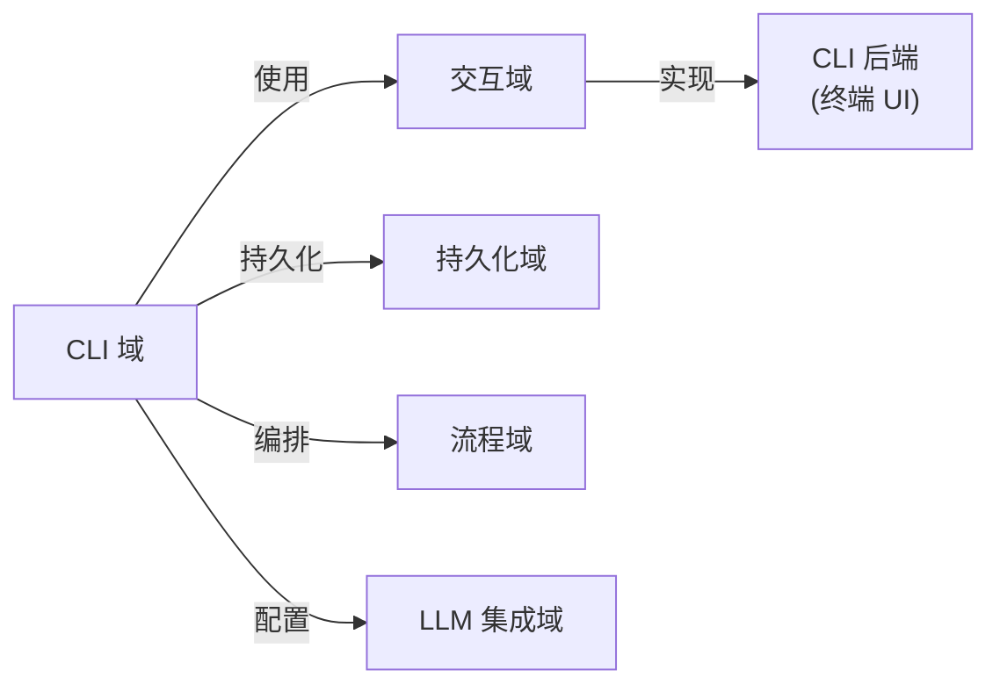
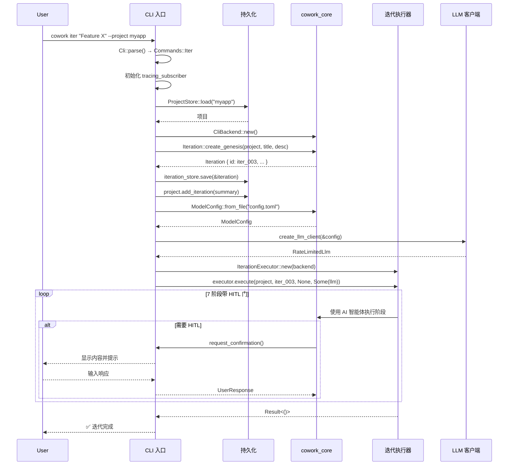
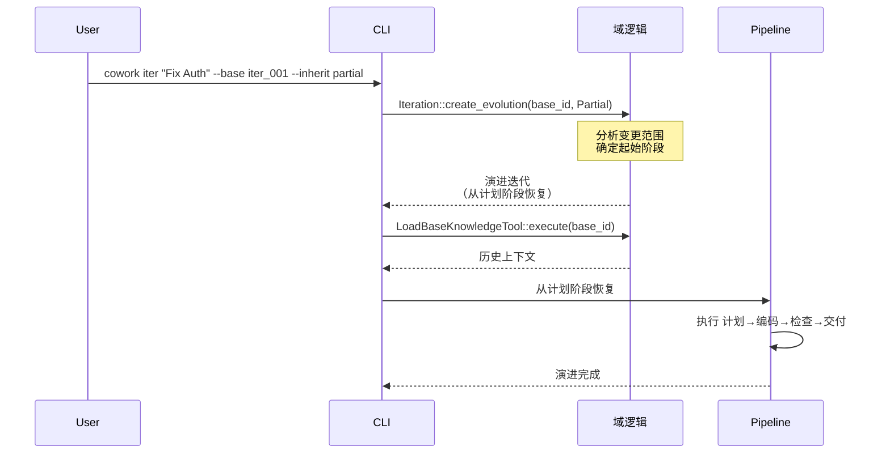

**CLI 域技术文档**
**Cowork Forge** | **版本 1.0** | **生成时间：2026**

---

## 1. 概述

**CLI 域**作为 Cowork Forge 的命令行界面入口点，为 AI 驱动的迭代式软件开发平台提供自动化优先的交互模型。作为基于 Rust 的终端应用程序实现，该域使开发者能够通过声明式 shell 命令编排完整的 7 阶段开发流程（Idea → PRD → Design → Plan → Coding → Check → Delivery）。

### 1.1 目的和业务价值

CLI 域满足自动化优先开发者和技术负责人，他们更喜欢基于终端的工作流、CI/CD 集成或可脚本化的开发操作。它提供：

- **批量操作**：用于自动化流程的非交互式迭代执行
- **快速原型设计**：通过单命令快速项目初始化和迭代创建
- **远程开发**：SSH 兼容的无头服务器环境接口
- **工作流脚本化**：用于复杂开发自动化场景的可组合命令

### 1.2 架构位置

在 Cowork Forge 的六边形架构中，CLI 域位于**表示层**，实现交互域中定义的 `InteractiveBackend` 特性。这确保核心域逻辑保持接口不可知，同时 CLI 为用户提供终端特定的适配器。

---

## 2. 技术架构

### 2.1 技术栈

| 组件 | 技术 | 目的 |
|-----------|-----------|---------|
| **语言** | Rust（2021 版） | 带异步支持的安全系统编程 |
| **CLI 框架** | clap v4.x | 基于派生的参数解析和子命令路由 |
| **异步运行时** | tokio | 异步迭代执行和 I/O |
| **错误处理** | anyhow | 带上下文的结构化错误传播 |
| **日志** | tracing + tracing_subscriber | 带可配置详细级别的结构化日志 |
| **终端 UI** | dialoguer | 交互式提示和确认对话框 |
| **格式化** | ansi_term / owo-colors | 彩色终端输出 |

### 2.2 模块结构

```
crates/cowork-cli/
├── src/
│   └── main.rs          # CLI 入口点，命令路由和编排
├── Cargo.toml           # 依赖：clap, tokio, anyhow, tracing, cowork-core
└── README.md
```

**关键依赖：**
- `cowork-core`：域逻辑、流程执行和持久化
- `clap`：带派生宏的命令行参数解析
- `tokio`：用于非阻塞 LLM API 调用和文件操作的异步运行时

---

## 3. 命令接口规范

CLI 通过 `cowork` 二进制暴露八个主要命令，支持全局标志和子命令特定选项。

### 3.1 全局参数

| 标志 | 短 | 描述 | 默认 |
|------|----|-------------|---------|
| `--config` | `-c` | 自定义配置文件路径（TOML） | `./config.toml` |
| `--verbose` | `-v` | 启用 debug 级别日志 | `false` |
| `--project` | `-p` | 目标项目名称（可选上下文） | 当前目录 |

### 3.2 命令参考

#### 3.2.1 `iter` — 创建和执行迭代

创建新迭代（创世或演进）并立即执行流程。

**语法：**
```bash
cowork iter [OPTIONS] <TITLE> [DESCRIPTION]
```

**选项：**
| 选项 | 描述 |
|--------|-------------|
| `--base <ID>` | 用于演进的基线迭代 ID（如果指定则创建演进迭代） |
| `--inherit <MODE>` | 继承模式：`none`、`partial` 或 `full`（默认：`none`） |
| `--stage <STAGE>` | 演进迭代的起始阶段（idea、prd、design、plan） |

**示例：**
```bash
# 创世迭代
cowork iter "User Authentication" "Implement JWT-based auth system"

# 演进迭代，部分继承（仅代码）
cowork iter "Add OAuth Support" "Extend auth with Google OAuth" \
    --base iter_001 --inherit partial

# 演进迭代，完全继承（工件 + 代码）
cowork iter "Refactor Database Layer" "Migrate to SQLx" \
    --base iter_002 --inherit full --stage design
```

#### 3.2.2 `list` — 列出迭代

显示当前项目中所有迭代，带状态指示器。

**语法：**
```bash
cowork list [OPTIONS]
```

**选项：**
| 选项 | 描述 |
|--------|-------------|
| `--all` | 在输出中包含已完成的迭代 |
| `--status <STATUS>` | 按状态过滤：`running`、`paused`、`completed`、`failed` |

**输出格式：**
```
ID          Title                Status      Stage       Created
iter_001    Initial Setup        Completed   Delivery    2024-01-15
iter_002    Add Auth             Running     Coding      2024-01-16
iter_003    Fix CSS              Paused      Check       2024-01-16
```

#### 3.2.3 `show` — 显示迭代详情

呈现特定迭代的详细信息，包括阶段工件和元数据。

**语法：**
```bash
cowork show <ITERATION_ID>
```

#### 3.2.4 `continue` — 恢复暂停的迭代

从其当前阶段恢复先前暂停的迭代执行。

**语法：**
```bash
cowork continue [ITERATION_ID]
```

*如果省略 `ITERATION_ID`，恢复最近暂停的迭代。*

#### 3.2.5 `init` — 初始化项目

在指定目录创建新的 Cowork Forge 项目结构。

**语法：**
```bash
cowork init [PATH]
```

**行为：**
- 创建 `.cowork-v2/` 元数据目录
- 初始化项目配置
- 自动检测技术栈（React、Vue、Rust、Python 等）

#### 3.2.6 `status` — 项目状态

显示聚合的项目统计，包括迭代计数、成功率和当前活动。

**语法：**
```bash
cowork status
```

#### 3.2.7 `delete` — 移除迭代

删除迭代及其关联的工作区数据，带交互式确认。

**语法：**
```bash
cowork delete <ITERATION_ID> [--force]
```

**安全特性：**
- 除非指定 `--force`，需要明确确认
- 验证迭代当前未运行
- 删除前归档工件（如配置）

#### 3.2.8 `regenerate-knowledge` — 更新知识库

为已完成的迭代重新生成知识快照，手动编辑迭代工件时有用。

**语法：**
```bash
cowork regenerate-knowledge <ITERATION_ID>
```

---

## 4. 实现细节

### 4.1 入口点和命令路由

CLI 入口点（`main.rs`）实现结构化初始化序列：

```rust
#[tokio::main]
async fn main() -> anyhow::Result<()> {
    // 1. 使用 clap 派生宏解析 CLI 参数
    let cli = Cli::parse();
    
    // 2. 初始化日志，可配置详细级别
    tracing_subscriber::fmt()
        .with_max_level(if cli.verbose { Level::DEBUG } else { Level::INFO })
        .init();
    
    // 3. 路由到命令处理器
    match cli.command {
        Commands::Iter(args) => cmd_iter(args).await,
        Commands::List(args) => cmd_list(args).await,
        // ... additional commands
    }
}
```

**命令枚举结构：**
```rust
#[derive(Subcommand)]
enum Commands {
    /// 创建并执行新迭代
    Iter(IterArgs),
    /// 列出所有迭代
    List(ListArgs),
    /// 显示迭代详情
    Show(ShowArgs),
    /// 继续暂停的迭代
    Continue(ContinueArgs),
    /// 初始化新项目
    Init(InitArgs),
    /// 显示项目状态
    Status,
    /// 删除迭代
    Delete(DeleteArgs),
    /// 为已完成的迭代重新生成知识
    RegenerateKnowledge(RegenerateArgs),
}
```

### 4.2 后端初始化和依赖注入

CLI 实现 `InteractiveBackend` 特性以提供终端特定交互能力：

```rust
async fn cmd_iter(args: IterArgs) -> anyhow::Result<()> {
    // 1. 初始化持久化存储
    let project_store = ProjectStore::new();
    let iteration_store = IterationStore::new();
    
    // 2. 加载或创建项目
    let project = project_store.load(&args.project)
        .ok_or_else(|| anyhow!("Project not found. Run 'cowork init' first"))?;
    
    // 3. 创建 CLI 后端（实现 InteractiveBackend）
    let backend = Arc::new(CliBackend::new());
    
    // 4. 使用限流初始化 LLM 客户端
    let config = ModelConfig::from_file("config.toml")
        .or_else(|_| ModelConfig::from_env())?;
    let llm_client = create_llm_client(&config)?;
    
    // 5. 创建迭代执行器
    let executor = IterationExecutor::new(backend.clone());
    
    // 6. 创建迭代（创世或演进）
    let iteration = if let Some(base_id) = args.base {
        Iteration::create_evolution(
            &project, 
            args.title, 
            args.description, 
            base_id, 
            args.inherit_mode
        )?
    } else {
        Iteration::create_genesis(&project, args.title, args.description)?
    };
    
    // 7. 执行流程
    executor.execute(project, iteration.id(), None, Some(llm_client)).await?;
    
    Ok(())
}
```

### 4.3 终端输出格式化

CLI 使用 ANSI 颜色代码进行语义输出分类：

| 颜色 | 语义含义 | 使用示例 |
|-------|-----------------|---------------|
| **绿色** | 成功/完成 | `✅ Iteration completed successfully` |
| **黄色** | 警告/运行中 | `⚠️  Iteration running: Step 3/7` |
| **青色** | 信息/暂停 | `⏸️  Iteration paused at PRD stage` |
| **红色** | 错误/失败 | `❌ Error: LLM API rate limit exceeded` |
| **蓝色** | 标题/元数据 | `show` 命令中的章节标题 |

### 4.4 配置管理

CLI 支持双源配置，优先级：

1. **基于文件**：`config.toml` 在项目根目录或通过 `--config` 指定
2. **基于环境**：LLM 凭证的环境变量

**配置解析：**
```rust
impl ModelConfig {
    pub fn from_file(path: &str) -> Result<Self, ConfigError> {
        // 从 TOML 加载
    }
    
    pub fn from_env() -> Result<Self, ConfigError> {
        // 从 OPENAI_API_KEY、OPENAI_BASE_URL 等加载
    }
}
```

---

## 5. 集成架构

### 5.1 域依赖

CLI 域保持对核心基础设施的严格依赖：



**依赖详情：**

| 依赖 | 接口 | 目的 |
|------------|-----------|---------|
| **交互域** | `InteractiveBackend` 特性 | HITL 提示、进度显示、流式输出 |
| **持久化域** | `ProjectStore`、`IterationStore` | 项目元数据和迭代工作区管理 |
| **流程域** | `IterationExecutor` | 7 阶段流程编排 |
| **LLM 集成** | `ModelConfig`、`create_llm_client` | AI 智能体配置和限流 API 访问 |

### 5.2 人在回路（HITL）实现

对于需要人工验证的阶段，CLI 实现 `InteractiveBackend` 特性方法：

```rust
impl InteractiveBackend for CliBackend {
    async fn request_confirmation(&self, content: &str) -> anyhow::Result<UserResponse> {
        // 带语法高亮显示内容
        println!("{}", content);
        
        // 使用 dialoguer 的交互式提示
        let options = vec!["Pass", "Edit", "Feedback"];
        let selection = Select::with_theme(&ColorfulTheme::default())
            .with_prompt("Action")
            .items(&options)
            .interact()?;
            
        match selection {
            0 => Ok(UserResponse::Pass),
            1 => Ok(UserResponse::Edit(self.open_editor(content).await?)),
            2 => Ok(UserResponse::Feedback(self.collect_feedback().await?)),
            _ => unreachable!(),
        }
    }
    
    async fn display_stream(&self, chunk: &str) -> anyhow::Result<()> {
        // AI 响应的实时流式输出
        print!("{}", chunk);
        std::io::stdout().flush()?;
        Ok(())
    }
}
```

---

## 6. 执行工作流

### 6.1 创世迭代流



### 6.2 演进迭代流



---

## 7. 错误处理和弹性

### 7.1 错误传播策略

CLI 使用 `anyhow` 进行符合人体工程学的错误处理，带上下文传播：

```rust
async fn cmd_delete(args: DeleteArgs) -> anyhow::Result<()> {
    let store = ProjectStore::new()
        .context("Failed to initialize project store")?;
        
    let iteration = store.load(&args.id)
        .with_context(|| format!("Iteration {} not found", args.id))?;
        
    if iteration.status() == IterationStatus::Running {
        return Err(anyhow!("Cannot delete running iteration. Pause first."));
    }
    
    if !args.force {
        let confirmed = Confirm::with_theme(&ColorfulTheme::default())
            .with_prompt("Delete iteration permanently?")
            .interact()?;
            
        if !confirmed {
            return Ok(()); // Graceful exit
        }
    }
    
    store.delete(&args.id)
        .context("Failed to delete iteration files")?;
        
    Ok(())
}
```

### 7.2 常见错误场景

| 错误代码 | 场景 | 用户消息 |
|------------|----------|--------------|
| `E001` | 项目未初始化 | `❌ Error: Run 'cowork init' first` |
| `E002` | 无效的基线迭代 | `❌ Error: Base iteration 'iter_999' not found` |
| `E003` | 缺少 LLM 配置 | `❌ Error: No LLM config found. Set OPENAI_API_KEY or create config.toml` |
| `E004` | 超过限流 | `⚠️  Warning: Rate limit hit. Retrying in 2s...` |
| `E005` | 工作区权限被拒绝 | `❌ Error: Permission denied accessing .cowork-v2/` |

---

## 8. 配置模式

### 8.1 config.toml 结构

```toml
[llm]
provider = "openai"
api_key = "sk-..."
base_url = "https://api.openai.com/v1"
model = "gpt-4"
temperature = 0.7
max_tokens = 4096

[cli]
theme = "auto"  # auto, light, dark
confirm_destructive = true
editor = "vim"  # or $EDITOR
```

### 8.2 环境变量

| 变量 | 目的 | 示例 |
|----------|---------|---------|
| `COWORK_CONFIG` | 覆盖默认配置路径 | `/path/to/config.toml` |
| `OPENAI_API_KEY` | LLM 认证 | `sk-abc123...` |
| `OPENAI_BASE_URL` | 自定义 LLM 端点 | `https://api.openai.com/v1` |
| `COWORK_EDITOR` | 首选外部编辑器 | `code --wait` |

---

## 9. 性能考虑

### 9.1 异步执行模型

CLI 利用 Tokio 的异步运行时处理并发操作：

- **LLM 流式传输**：实时终端输出的非阻塞令牌流式传输
- **文件 I/O**：工件生成期间的异步文件操作
- **流程管理**：检查阶段期间并行外部命令执行

### 9.2 内存管理

- **Arc<CliBackend>**：跨异步任务共享后端状态
- **流式处理**：大 AI 响应的恒定内存使用
- **工作区隔离**：每个迭代维护独立文件句柄

---

## 10. 安全考虑

### 10.1 路径验证

所有文件操作验证工作区包含：

```rust
fn validate_workspace_path(path: &Path) -> anyhow::Result<()> {
    let canonical = path.canonicalize()?;
    let workspace = get_workspace_root()?.canonicalize()?;
    
    if !canonical.starts_with(&workspace) {
        return Err(anyhow!("Path {} escapes workspace", path.display()));
    }
    Ok(())
}
```

### 10.2 敏感数据处理

- API 密钥从环境或配置文件加载，检查 `0600` 权限
- 不记录包含潜在机密的 LLM 提示
- SIGINT/SIGTERM 上安全临时文件清理

---

## 11. 扩展点

### 11.1 添加新命令

添加新子命令：

1. 使用 `clap::Args` 派生定义 args 结构
2. 添加变体到 `Commands` 枚举
3. 在 `main.rs` 中实现处理函数
4. 在命令路由器 match 语句中注册

```rust
#[derive(Args)]
struct ExportArgs {
    iteration_id: String,
    format: ExportFormat,
}

async fn cmd_export(args: ExportArgs) -> anyhow::Result<()> {
    // Implementation
}
```

### 11.2 自定义后端

`InteractiveBackend` 特性允许专业 CLI 实现（例如 JSON 输出模式、静默模式）：

```rust
struct JsonBackend;

impl InteractiveBackend for JsonBackend {
    async fn display_message(&self, msg: &str) -> anyhow::Result<()> {
        println!(r#"{{"type": "message", "content": "{}"}}"#, msg);
        Ok(())
    }
    // ... implement other methods
}
```

---

## 12. 故障排除指南

| 问题 | 诊断 | 解决方案 |
|-------|-----------|----------|
| `command not found: cowork` | 二进制不在 PATH 中 | 运行 `cargo install --path crates/cowork-cli` |
| `Failed to initialize project store` | `.cowork-v2/` 权限被拒绝 | 检查目录权限：`chmod 755 .cowork-v2` |
| `LLM client creation failed` | 缺少 API 密钥 | 设置 `OPENAI_API_KEY` 环境变量 |
| `Iteration execution hangs` | HITL 等待输入 | 检查外部编辑器是否在后台打开 |
| `Color codes not rendering` | 终端缺少 ANSI 支持 | 使用 `--no-color` 标志或设置 `NO_COLOR=1` |

---

**文档控制**
- **作者**：Cowork Forge 架构团队
- **审核周期**：季度
- **相关文档**： 
  - [流程域架构](./pipeline-domain.md)
  - [交互域规范](./interaction-domain.md)
  - [LLM 集成指南](./llm-integration.md)
