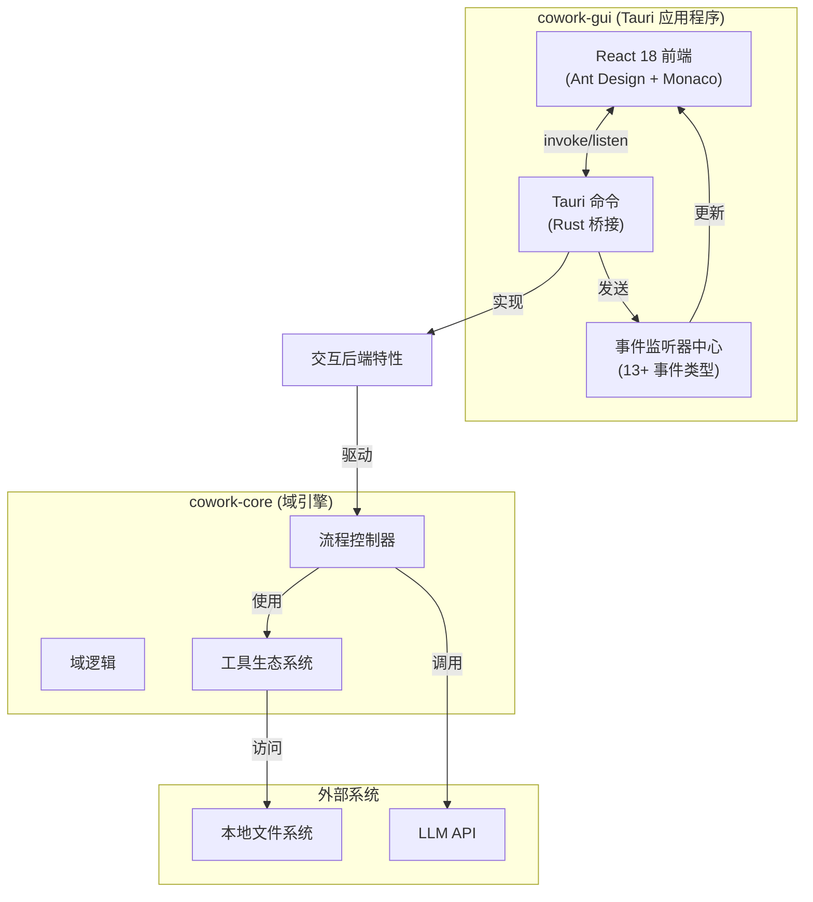
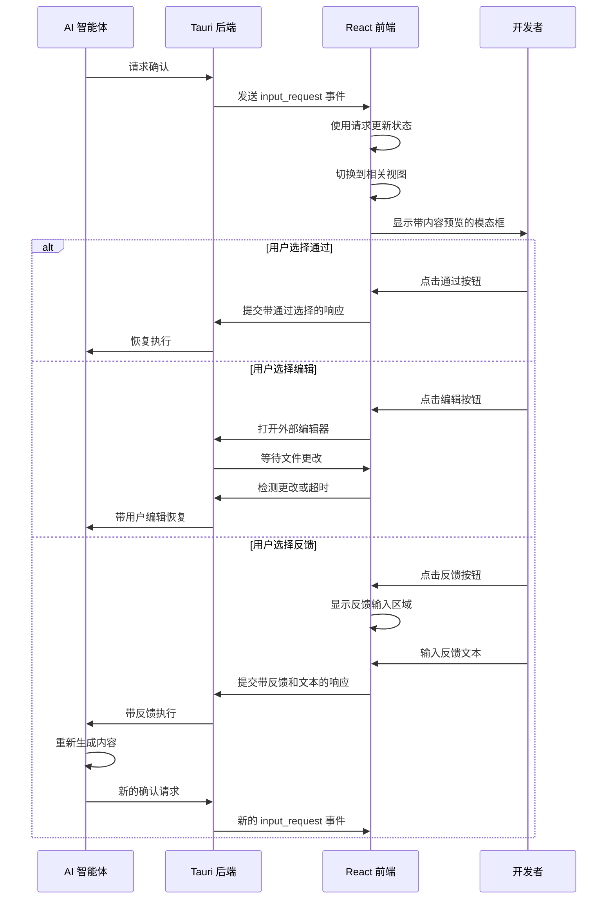

**GUI 前端域技术文档**

**生成时间：** 2026-02-14 05:21:52 (UTC)  
**版本：** 1.0  
**域：** 表示层（Cowork-GUI）

---

## 1. 执行摘要

**GUI 前端域**实现 Cowork Forge 系统的桌面表示层，通过基于 Tauri 的桌面应用程序外壳和 React 18 前端提供全面的 AI 辅助开发环境。该域为 7 阶段 AI 智能体流程提供主要人机界面，支持实时迭代监控、工件检查、代码编辑和人在回路（HITL）验证工作流。

**关键架构特征：**
- **多面板工作区**：八个功能面板（项目、迭代、聊天/工件、代码编辑器、运行器、预览、内存、知识）通过中央状态管理器编排
- **事件驱动实时通信**：通过 Tauri's invoke/listen API 的双向 IPC，支持流式 AI 智能体输出和异步 HITL 交互
- **双模式交互**：支持自动化执行监控和基于模态确认工作流的交互式反馈循环
- **性能优化渲染**：大文件树的虚拟化列表、用于代码编辑的 Monaco Editor 集成以及用于响应式反馈的乐观 UI 更新

---

## 2. 系统架构

### 2.1 容器上下文（C4 2 级）

GUI 前端作为 Cowork Forge 架构内的独立容器运行，通过明确定义的 IPC 边界专门与 Tauri 后端域通信：



### 2.2 组件架构（C4 3 级）

前端实现分层组件层次结构，清晰分离关注点：

```mermaid
flowchart TB
    subgraph EntryLayer["入口层"]
        Main[main.jsx<br/>主题与 React 根]
        IndexCSS[索引样式<br/>Ant Design 主题]
    end
    
    subgraph OrchestrationLayer["核心编排"]
        App[App.jsx<br/>状态管理中心]
        EventManager[事件监听器管理器<br/>agent_event, tool_call, input_request]
        InputModal[HITL 输入模态框<br/>确认与反馈]
    end
    
    subgraph PanelLayer["面板注册表"]
        Projects[项目面板<br/>CRUD 与多窗口]
        Iterations[迭代面板<br/>7 阶段生命周期]
        Chat[工件查看器<br/>流式聊天]
        Editor[代码编辑器<br/>Monaco + 虚拟树]
        Runner[运行器面板<br/>进程日志]
        Preview[预览面板<br/>开发服务器 IFrame]
        Memory[内存面板<br/>查询与浏览]
        Knowledge[知识面板<br/>知识库]]
    end
    
    subgraph Communication["IPC 层"]
        Commands[命令调用器<br/>gui_*, query_*]
        Listeners[事件监听器<br/>13+ 事件类型]
        Types[TypeScript 类型<br/>Serde 映射的 DTO]
    end
    
    Main --> App
    App --> EventManager
    App --> InputModal
    App --> Projects
    App --> Iterations
    App --> Chat
    App --> Editor
    App --> Runner
    App --> Preview
    App --> Memory
    App --> Knowledge
    
    Projects --> Commands
    Iterations --> Commands
    Editor --> Commands
    Memory --> Commands
    
    EventManager --> Listeners
    Listeners --> Chat
    Listeners --> Iterations
    Listeners --> Runner
```

---

## 3. 技术实现

### 3.1 技术栈

| 层级 | 技术 | 目的 |
|-------|-----------|---------|
| **UI 框架** | React 18 | 带并发功能的组件化声明式 UI |
| **组件库** | Ant Design 5.x | 企业级 UI 组件（表格、模态框、选项卡） |
| **桌面外壳** | Tauri 1.x+ | Rust 运行时，带原生 OS 集成 |
| **代码编辑器** | Monaco Editor | VS Code 驱动的编辑，带语法高亮和 IntelliSense |
| **虚拟化** | react-window | 大文件树和列表的性能优化 |
| **内容渲染** | ReactMarkdown + remark-gfm | AI 生成工件的 Markdown 解析 |
| **样式** | CSS Modules + Ant Design Tokens | 组件作用域样式与主题一致性 |
| **状态管理** | React Hooks (useState/useEffect) | App.jsx 中的中央状态管理，带属性传递 |
| **图标** | @ant-design/icons | 界面一致的图标 |

### 3.2 状态管理架构

该域使用 React 原生钩子系统的集中状态管理模式：

**中央状态中心（App.jsx）：**
- `currentSession`：活动项目/迭代上下文
- `activeView`：当前可见面板（projects、iterations、chat、code、run、memory、knowledge）
- `messages[]`：带类型区分的实时 AI 智能体消息缓冲区（user、agent、thinking、tool_call、tool_result）
- `pmMessages[]`：项目经理 Agent 聊天消息缓冲区（user、pm_agent）
- `chatMode`：聊天模式标识（pipeline、pm_agent、disabled），根据迭代状态自动切换
- `isProcessing`：流程操作的全局执行状态
- `inputRequest`：HITL 模态框状态管理
- `refreshTriggers`：内存/知识面板的基于计数器的缓存失效

**状态分发模式：**
```javascript
// Centralized state with selective prop drilling
<App>
  <ProjectsPanel currentSession={session} onProjectSelect={handler} />
  <IterationsPanel 
    currentSession={session} 
    isProcessing={isProcessing}
    onExecuteStatusChange={handler}
    refreshTrigger={refreshTrigger}
  />
  <CodeEditor currentIterationId={iterationId} />
  {/* ... additional panels */}
</App>
```

**事件驱动状态更新：**
系统通过 Tauri's 事件系统维护类似 WebSocket 的连接，而不是轮询：
- **发射**：后端通过 Rust 中的 `AppHandle` 发射事件
- **订阅**：前端在 `useEffect` 钩子中注册监听器，带清理
- **聚合**：流式内容聚合在本地状态缓冲区中

---

## 4. 通信层（IPC）

### 4.1 命令接口（前端 → 后端）

该域使用 Tauri's `invoke` API 暴露类型安全的命令调用：

**项目管理命令：**
| 命令 | 参数 | 返回 | 描述 |
|---------|-----------|--------|-------------|
| `gui_init_project` | `{ name, description?, path? }` | `ProjectDTO` | 初始化新项目工作区 |
| `get_all_projects` | - | `ProjectDTO[]` | 检索注册项目 |
| `open_project` | `{ projectId, newWindow? }` | `void` | 在当前/新窗口加载项目 |
| `delete_project` | `{ projectId }` | `boolean` | 从注册表移除项目 |
| `update_project` | `{ projectId, updates }` | `ProjectDTO` | 修改项目元数据 |

**迭代控制命令：**
| 命令 | 参数 | 返回 | 描述 |
|---------|-----------|--------|-------------|
| `gui_create_iteration` | `{ projectId, title, description, fromIteration? }` | `IterationDTO` | 创建创世/演进迭代 |
| `gui_execute_iteration` | `{ iterationId }` | `void` | 启动流程执行（异步） |
| `gui_continue_iteration` | `{ iterationId }` | `void` | 恢复暂停的迭代 |
| `gui_retry_iteration` | `{ iterationId, stage? }` | `void` | 重试失败阶段 |
| `gui_delete_iteration` | `{ iterationId }` | `boolean` | 移除迭代工作区 |

**文件操作：**
| 命令 | 参数 | 返回 | 描述 |
|---------|-----------|--------|-------------|
| `get_iteration_file_tree` | `{ iterationId }` | `FileNode[]` | 检索虚拟化文件树 |
| `read_iteration_file` | `{ iterationId, filePath }` | `string` | 读取文件内容 |
| `save_iteration_file` | `{ iterationId, filePath, content }` | `boolean` | 持久化文件更改 |
| `format_code` | `{ code, language }` | `string` | 使用外部格式化器格式化代码 |

**知识和内存：**
| 命令 | 参数 | 返回 | 描述 |
|---------|-----------|--------|-------------|
| `query_memory_index` | `{ scope, category?, stage?, limit?, keyword? }` | `MemoryEntry[]` | 搜索项目内存 |
| `load_memory_detail` | `{ memoryId }` | `MemoryDetail` | 检索完整内存内容 |
| `gui_get_project_knowledge` | `{ projectId }` | `KnowledgeDTO` | 获取聚合知识 |
| `gui_regenerate_knowledge` | `{ iterationId }` | `void` | 触发知识重新提取 |

### 4.2 事件接口（后端 → 前端）

系统为实时流式传输实现 13+ 种事件类型：

**生命周期事件：**
- `project_loaded`：项目上下文初始化时发射
- `iteration_started`：流程执行开始
- `iteration_completed`：带结果的完成
- `iteration_failed`：带诊断消息的错误状态
- `iteration_continued`：从暂停状态恢复

**智能体流式传输事件：**
- `agent_event`：结构化内容消息（thinking、progress、stage transitions）
- `agent_streaming`：来自 LLM API 的实时令牌流式传输

**执行事件：**
- `tool_call`：带名称和参数的工具调用
- `tool_result`：工具执行结果（success/failure with output）
- `progress`：阶段完成百分比和状态

**HITL 事件：**
- `input_request`：暂停等待人类输入，带元数据（type、options、context）
- `input_response`：（命令）从前端提交的响应

**流程事件：**
- `project_log`：开发服务器流程的 stdout/stderr
- `project_error`：流程执行错误

**实现模式：**
```javascript
// Event subscription in App.jsx
useEffect(() => {
  const unlisten = listen('agent_event', (event) => {
    const { payload } = event;
    setMessages(prev => [...prev, {
      type: payload.type, // 'thinking' | 'message' | 'stage'
      content: payload.content,
      timestamp: Date.now()
    }]);
  });
  
  return () => { unlisten.then(f => f()); };
}, []);
```

---

## 5. 功能组件

### 5.1 项目面板（`ProjectsPanel.jsx`）

**职责：**
- 项目生命周期管理（CRUD 操作）
- 多窗口项目加载支持
- 工作区目录访问集成
- 技术栈可视化

**关键功能：**
- **基于卡片的布局**：显示项目网格，带元数据（技术栈、最后修改、迭代计数）
- **多窗口支持**：使用 Tauri's 窗口管理 API 的"在新窗口中打开"功能
- **快速操作**：通过 OS 文件资源管理器直接访问工作区目录
- **删除安全**：带破坏性操作警告状态的确认模态框

**状态交互：**
- 选择时发射 `project_loaded` 事件
- 触发 `activeView` 转换到 'iterations'
- 为子组件管理 `currentSession` 上下文

### 5.2 迭代面板（`IterationsPanel.jsx`）

**职责：**
- 7 阶段流程可视化（Idea → PRD → Design → Plan → Coding → Check → Delivery）
- 迭代执行控制（启动、暂停、继续、重试）
- 实时状态跟踪和进度指示
- 带继承模式选择的演进迭代创建

**关键功能：**
- **阶段可视化**：视觉流程显示当前阶段、已完成阶段和待处理阶段，带颜色编码状态指示器
- **执行控件**：上下文感知按钮（启动用于草稿，继续用于暂停，重试用于失败）
- **演进工作流**："演进"按钮触发继承模式选择（Full/Partial/None）
- **实时状态**：通过 `iteration_started`、`iteration_completed` 事件实时更新

**HITL 集成：**
- 监听带 `ARTIFACT_TYPE` 上下文的 `input_request` 事件
- 根据确认类型自动切换到适当面板（工件/代码）
- 在人工验证阶段管理执行阻塞

### 5.3 代码编辑器（`CodeEditor.jsx`）

**职责：**
- 带虚拟化渲染的文件树导航
- 带 Monaco Editor 的多标签代码编辑
- 文件内容持久化
- 特定语言的语法高亮和格式化

**技术实现：**
- **虚拟化树**：对大目录结构（>1000 文件）使用 `react-window` 进行高性能渲染
- **Monaco 集成**：全功能编辑器，带 IntelliSense、错误高亮和小地图
- **语言检测**：基于文件扩展名自动设置模式（rs、js、ts、py、html、css、json、md、toml、yaml）
- **自动保存**：通过 `save_iteration_file` 对后端进行去抖动保存操作

**文件操作：**
- 延迟加载：通过 `read_iteration_file` 按需获取文件内容
- 更改跟踪：未保存更改的脏状态管理
- 跨面板集成：聊天/工件面板中的文件选择在编辑器中打开

### 5.4 运行器和预览面板（`RunnerPanel.jsx`、`PreviewPanel.jsx`）

**职责：**
- 开发服务器流程管理
- 带 ANSI 序列处理的实时日志流式传输
- 通过 iframe 嵌入的实时预览
- 流程生命周期控制（启动、停止、重启）

**技术功能：**
- **日志流式传输**：消费 `project_log` 事件，带终端式输出的 ANSI 颜色代码渲染
- **日志过滤**：流程输出的搜索和过滤功能
- **双选项卡界面**："运行程序"（日志）和"页面预览"（iframe）模式
- **安全控制**：优雅的流程终止和端口冲突检测

### 5.5 内存和知识面板（`MemoryPanel.jsx`、`KnowledgePanel.jsx`）

**职责：**
- 项目内存查询和浏览
- 知识工件可视化
- 历史决策和模式检索
- 跨内存条目的模糊搜索

**关键功能：**
- **查询接口**：按范围（project/iteration）、类别（decision/pattern/insight）和关键词过滤
- **Markdown 渲染**：代码块的丰富内容显示和语法高亮
- **详情模态框**：带完整上下文的内存条目钻取视图
- **刷新协调**：响应 `knowledge_regeneration_completed` 事件

---

## 6. 人在回路（HITL）实现

GUI 前端为 AI-人类协作实现复杂的 HITL 工作流：

### 6.1 确认流架构



### 6.2 模态框状态管理

`InputModal` 组件处理三种交互模式：
1. **文本输入**：用于重新生成请求的自由形式反馈
2. **选项选择**：用于工件确认的预定义选项（是/否/查看/反馈）
3. **工件审查**：带切换到相关面板的丰富内容显示

**超时处理：**
- 后端为 HITL 响应维护 3000 秒超时（50 分钟）
- 前端为长时间运行的操作显示倒计时警告
- 组件卸载时自动清理以防止内存泄漏

---

## 7. 性能优化

### 7.1 虚拟化策略

**文件树渲染：**
- 对超过 100 项的目录实现 `react-window` FixedSizeTree
- 延迟加载文件元数据（大小、修改时间）
- 折叠节点优化（子项仅在展开时渲染）

**内存列表：**
- 带动态高度支持的内存条目的虚拟化滚动
- 大结果集的"加载更多"模式分页
- 去抖动搜索输入（300ms）防止过多查询命令

### 7.2 流式传输优化

**消息聚合：**
- 缓冲快速 `agent_streaming` 事件（节流到 60fps 更新）
- 在高速令牌流式传输期间使用 `requestAnimationFrame` 实现平滑滚动
- 为 tool_call/tool_result 对实现消息去重

**记忆化：**
- 面板组件上的 `React.memo` 防止后台流式传输期间的不必要重新渲染
- 昂贵的 markdown 解析和语法高亮的 `useMemo`
- 传递给子组件的事件处理器的 `useCallback`

---

## 8. 集成模式

### 8.1 错误处理策略

**命令错误：**
- Rust `Result` 类型映射到 JavaScript 异常
- Ant Design `message` API 用于瞬态错误通知
- 关键失败的模态对话框（工作区访问被拒绝、迭代损坏）

**事件流错误：**
- `iteration_failed` 事件触发错误边界捕获
- 自动状态重置以防止 UI 不同步
- 瞬态网络问题的指数退避重试机制

### 8.2 跨面板通信

**刷新协调：**
```javascript
// Counter-based invalidation pattern
const [memoryRefreshTrigger, setMemoryRefreshTrigger] = useState(0);

// Trigger from App.jsx when iteration completes
useEffect(() => {
  if (iterationCompleted) {
    setMemoryRefreshTrigger(prev => prev + 1);
  }
}, [iterationCompleted]);

// Consumption in MemoryPanel
useEffect(() => {
  loadMemoryData();
}, [memoryRefreshTrigger]);
```

**视图切换：**
- 通过 `setActiveView` 属性传递的编程导航
- 上下文感知切换（例如，工件确认为代码文件切换到代码视图，为 markdown 切换到工件视图）

---

## 9. 安全考虑

**路径验证：**
- 所有文件路径由后端 `runtime_security` 模块在操作前验证
- 前端仅显示工作区相对路径（隐藏绝对路径）
- 通过后端路径规范化防止遍历攻击

**内容安全：**
- 预览面板的 IFrame 沙箱（`sandbox="allow-scripts allow-same-origin"`）
- Monaco Editor 在隔离上下文中运行
- Markdown 渲染清理 HTML 以防止通过 AI 生成内容的 XSS

**流程隔离：**
- 开发服务器在具有受限环境的独立流程中生成
- 前端无法执行任意 shell 命令（所有命令由后端工具域验证）

---

## 10. 已知限制和技术债务

**当前问题：**
1. **组件嵌套错误**：`main.jsx` 包含 `<App><App /></App>` 导致重复挂载（需要立即修复）
2. **紧耦合**：`App.jsx` 超过 200 LOC，带复杂的属性传递；是 Context API 或 Zustand 迁移的候选
3. **内存泄漏**：异步操作期间组件卸载时，早期返回中的事件监听器可能未正确清理

**未来改进：**
- 迁移到 TypeScript 以实现类型安全的 IPC 通信
- 为长时间运行的迭代（>10k 消息）实现虚拟化聊天历史
- 潜在 Web 部署场景的 Tauri IPC WebSocket 回退

---

## 11. 开发指南

**添加新面板：**
1. 在 `src/components/` 中创建组件
2. 在 `App.jsx` 中将面板键添加到 `activeView` 状态枚举
3. 在 `PANELS` 映射对象中实现，带图标和标题
4. 为 Tauri 后端添加必要的 IPC 命令
5. 在面板的 `useEffect` 中注册事件监听器

**事件监听器最佳实践：**
```javascript
useEffect(() => {
  let unlisten;
  
  const setupListener = async () => {
    unlisten = await listen('event_name', handler);
  };
  
  setupListener();
  
  return () => {
    if (unlisten) unlisten.then(f => f());
  };
}, []);
```

**样式约定：**
- 使用 Ant Design 令牌保持一致性（`token.colorPrimary`、`token.borderRadius`）
- 组件作用域样式的 CSS Modules
- 响应式断点：`xs`（<576px）、`sm`（≥576px）、`md`（≥768px）、`lg`（≥992px）、`xl`（≥1200px）

---

**结论：** GUI 前端域成功地将 AI 智能体流程的复杂性抽象为直观的桌面界面。其事件驱动架构实现了人类开发者和 AI 智能体之间的实时协作，而模块化面板结构支持从项目初始化到代码部署的多样化工作流。该域通过 Tauri IPC 边界与核心业务逻辑保持严格分离，确保架构完整性，同时提供响应迅速的用户体验。