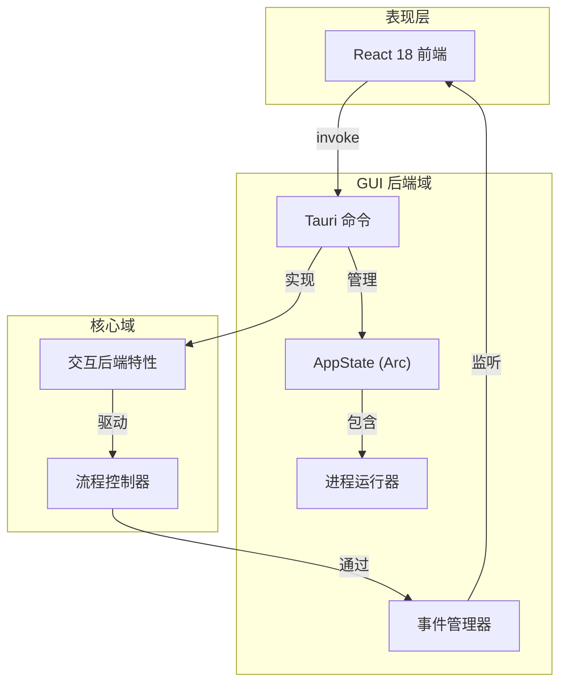

**GUI 后端域技术文档**

**生成时间：** 2024-12-19T10:30:00Z  
**版本：** 1.0  
**域：** 基础设施层（Tauri 后端）

---

## 1. 执行概述

**GUI 后端域**作为 Cowork Core 域引擎与基于 Tauri 桌面应用程序中 React 前端之间的基础设施桥梁。作为 `cowork-gui` crate 中的 Rust 实现，该域提供命令处理、状态管理和流程编排，以通过 Tauri 的 IPC（进程间通信）系统公开核心业务能力。

**架构位置：**  
该域在六边形架构中实现**适配器**模式，将核心域的 `InteractiveBackend` 特性适配到 Tauri 的事件驱动桌面运行时。它保持表示层关注点（React 前端）和业务逻辑（cowork-core）之间的严格分离，确保核心域保持 GUI 特定实现细节的不可知。

**关键职责：**
- **命令处理**：为前端调用暴露 24+ 个 JSON-RPC 端点
- **事件流式传输**：通过 Tauri 事件发射系统进行实时双向通信
- **流程管理**：跨平台开发服务器生命周期管理
- **状态桥接**：异步任务和 UI 线程之间的线程安全共享状态管理
- **DTO 转换**：用于前端消费的域模型序列化

---

## 2. 架构设计

### 2.1 六边形集成模式

GUI 后端域作为端口和适配器架构中的**主要适配器**，实现交互域定义的 `InteractiveBackend` 端口。这使核心流程能够无论通过 CLI 还是 GUI 调用都完全相同地运行，后端处理接口特定关注点（事件 vs 终端输出）。



### 2.2 并发模型

该域使用 **Tokio 的异步运行时**，带战略线程以保持 UI 响应性：

- **主线程**：处理 Tauri 命令调用和事件发射
- **后台任务**：CPU 密集型迭代执行在 `tokio::spawn` 任务中生成以防止阻塞
- **流程 I/O**：用于 stdout/stderr 流式传输的单独异步任务，带 `tokio::io::AsyncBufReadExt`
- **状态保护**：通过 `Arc<Mutex<T>>` 保护跨任务的共享可变状态以实现线程安全访问

---

## 3. 核心组件

### 3.1 命令处理器（`iteration_commands.rs`、`gui_commands.rs`）

命令处理器作为 React 前端的 API 表面，实现 Tauri 的命令模式，带异步函数签名。每个命令代表前端操作和核心域操作之间的用例桥梁。

**关键能力：**

| 命令 | 域操作 | 异步模式 |
|---------|-----------------|---------------|
| `gui_execute_iteration` | 带 LLM 集成的流程执行 | 带事件流式传输的后台生成 |
| `gui_continue_iteration` | 恢复暂停的执行 | 状态机转换 |
| `gui_retry_iteration` | 重试失败阶段 | 错误恢复包装器 |
| `query_memory_index` | 内存域搜索 | 直接 async/await |
| `create_project` | 项目聚合初始化 | 事务性创建 |
| `start_iteration_preview` | ProcessRunner 激活 | 子流程管理 |
| `pm_send_message` | 项目经理 Agent 消息处理 | 带上下文的历史消息 |
| `pm_restart_iteration` | 从指定阶段重新执行 | 流程跳转 |
| `get_system_locale` | 获取系统语言设置 | 同步返回 |

**实现模式：**
```rust
#[tauri::command]
pub async fn gui_execute_iteration(
    project_id: String,
    iteration_id: String,
    state: State<'_, AppState>,
    app_handle: AppHandle,
) -> Result<(), String> {
    // 1. State extraction from Arc<Mutex>
    // 2. TauriBackend initialization with AppHandle for events
    // 3. LLM client creation with rate limiting
    // 4. Background task spawning
    // 5. Immediate return to prevent UI blocking
}
```

**错误处理策略：**
域错误映射为 JSON 可序列化字符串以保持 Tauri 的 JSON-RPC 兼容性，保留错误上下文同时确保前端可解析。

### 3.2 项目注册管理器（`project_manager.rs`）

通过基于 JSON 的持久化管理项目注册表，提供项目元数据的 CRUD 操作和跨平台配置目录解析。

**关键功能：**
- **自动检测**：通过文件系统内省识别技术栈（React、Vue、Python、Rust）
- **注册持久化**：JSON 存储在平台特定配置目录（`dirs::config_dir()`）
- **多项目管理**：项目切换和注册表维护，无需重新加载工作区

**数据流：**
1. 前端请求带路径的项目创建
2. 管理器验证目录并检测技术栈
3. 项目带元数据注册在 JSON 注册表中
4. 核心域存储通过 `ProjectStore` 初始化

### 3.3 流程运行器（`project_runner.rs`）

**ProcessRunner** 服务管理外部开发服务器生命周期，带实时日志流式传输。此组件对"运行器和预览"面板功能至关重要，使用户能够执行 `npm run dev` 或类似命令，带 UI 反馈。

**架构：**
- **流程映射**：线程安全 `HashMap<String, Child>` 按迭代 ID 跟踪活动流程
- **流式处理**：用于 stdout/stderr 的异步读取器，带 ANSI 序列保留
- **跨平台生成**：
  - **Windows**：`cmd /C` 带 `CREATE_NO_WINDOW` 标志防止控制台闪烁
  - **Unix**：`sh -c` 带信号处理以实现优雅终止
- **事件发射**：日志行作为带迭代上下文的 `project_log` 事件发射，用于前端过滤

**生命周期管理：**
```rust
pub async fn start(
    &self,
    iteration_id: String,
    command: String,
    code_dir: PathBuf,
) -> Result<u32, String> {
    // 1. Validate workspace containment
    // 2. Platform-specific process spawning
    // 3. Spawn stdout/stderr streaming tasks
    // 4. Register PID in process map
    // 5. Emit initial project_log event
}
```

### 3.4 GUI 类型（`gui_types.rs`）

定义用于前端-后端通信的数据传输对象（DTO），通过 Serde 序列化确保 JavaScript/Rust 边界的类型安全。

**类型类别：**
- **项目 DTO**：`ProjectInfo`、`ProjectSummary` 带 RFC3339 时间戳格式化
- **迭代 DTO**：`IterationInfo` 带阶段状态枚举
- **内存 DTO**：`MemoryEntry`、`MemoryQuery` 带类别/影响分类
- **执行 DTO**：`ExecutionStatus`、`PreviewInfo` 用于运行时状态
- **事件负载**：用于 `agent_event`、`tool_call`、`input_request` 事件的结构化类型

---

## 4. 通信模式

### 4.1 命令调用（前端 → 后端）

前端使用 Tauri 的 `invoke` API 触发命令，传递结构化负载并接收基于 Promise 的响应。

**模式：**
- **同步感觉**：命令立即返回，带任务句柄或状态
- **长时间运行操作**：后台任务通过事件发射进度，而不是阻塞调用

### 4.2 事件流式传输（后端 → 前端）

实时更新使用 Tauri 的事件系统，带 `AppHandle` 用于发射和前端 `listen` API 用于消费。

**事件分类：**

| 事件 | 负载 | 频率 | 目的 |
|-------|---------|---------|---------|
| `agent_event` | 消息内容 | 每智能体消息 | 聊天界面更新 |
| `agent_streaming` | 令牌块 | 实时 | 打字指示器、实时内容 |
| `tool_call` | 工具名称/参数 | 每工具执行 | 工具使用可视化 |
| `tool_result` | 结果/错误 | 执行后 | 工具结果显示 |
| `progress` | 阶段/百分比 | 阶段转换 | 流程进度条 |
| `input_request` | 提示/选项 | HITL 门 | 模态对话框触发 |
| `iteration_started` | 迭代 ID | 每次执行一次 | UI 状态转换 |
| `iteration_completed` | 摘要 | 每次执行一次 | 成功处理 |
| `iteration_failed` | 错误详情 | 失败时 | 错误显示 |
| `project_log` | 日志行 + ANSI | 每 stdout/stderr 行 | 终端面板流式传输 |
| `project_stopped` | 退出码 | 流程终止 | 清理处理 |

### 4.3 人在回路（HITL）协调

TauriBackend 实现桥接 Tauri 事件系统的同步性质与核心流程的异步要求：

1. **请求发射**：流程发射带 oneshot 通道发送者的 `input_request` 事件
2. **前端模态**：React 显示输入模态框，阻塞进一步交互
3. **响应收集**：用户选择通过 `submit_input` 命令捕获
4. **通道解决**：后端通过 oneshot 通道接收响应，恢复流程
5. **超时处理**：3000 秒超时防止无限阻塞

---

## 5. 实现细节

### 5.1 状态管理

`AppState` 结构作为依赖注入容器：

```rust
pub struct AppState {
    pub project_manager: Arc<Mutex<ProjectRegistryManager>>,
    pub project_runner: Arc<Mutex<ProcessRunner>>,
    pub config: Arc<AppConfig>,
}
```

**访问模式：**
- **命令**：接收 `State<'_, AppState>` 参数用于 DI
- **后台任务**：在生成前克隆 `Arc` 句柄以维护所有权
- **线程安全**：互斥锁仅在关键部分持有以防止死锁

### 5.2 跨平台考虑

**路径处理：**
- Windows 兼容性的 UNC 路径规范化
- 工作区包含验证（所有路径相对于项目根解析）
- 通过 `dirs` crate 的平台特定配置目录解析

**流程管理：**
- **Windows**：`std::os::windows::process::CommandExt` 用于 `CREATE_NO_WINDOW`
- **Unix**：SIGTERM 与 SIGKILL 优雅关闭的信号处理
- **路径分隔**：环境变量处理差异（PATH vs Path）

### 5.3 DTO 转换

域模型（带业务逻辑的丰富实体）通过辅助函数转换为 DTO（序列化焦点结构）：

```rust
fn iteration_to_info(iteration: &Iteration, project: &Project) -> IterationInfo {
    IterationInfo {
        id: iteration.id.clone(),
        stage: iteration.current_stage.to_string(),
        status: iteration.status.to_string(),
        created_at: iteration.created_at.to_rfc3339(),
        // ... additional fields
    }
}
```

**时间戳处理：** 所有日期转换为 RFC3339 格式以兼容 JavaScript `Date`。

### 5.4 错误边界策略

后端实现**快速失败**方法，带优雅降级：

- **验证错误**：立即返回前端，带描述性消息
- **执行错误**：作为 `iteration_failed` 事件发射，带完整堆栈跟踪
- **流程错误**：`project_log` 事件标记 stderr 流以提高可见性
- **恐慌安全**：`std::panic::catch_unwind` 在后台任务中防止 GUI 崩溃

---

## 6. 集成工作流

### 6.1 实时迭代执行

**流：**
1. 用户在 IterationsPanel（React）中点击"执行"
2. 前端使用项目/迭代 ID 调用 `gui_execute_iteration`
3. 命令处理器提取状态并创建 `TauriBackend` 实例
4. 后台任务生成；命令立即返回
5. 流程执行，通过 `TauriBackend` 发射事件
6. 前端接收事件，更新聊天界面和进度条
7. HITL 门触发 `input_request` 事件，暂停流程
8. 用户通过模态框响应，流程恢复
9. 完成发射 `iteration_completed` 或 `iteration_failed`

### 6.2 开发服务器生命周期

**流：**
1. 用户打开 RunnerPanel 并点击"启动"
2. 前端使用命令（如 `npm run dev`）调用 `start_iteration_preview`
3. `ProcessRunner` 在迭代工作区生成子流程
4. 生成用于 stdout/stderr 读取的异步任务
5. 每行作为带 ANSI 代码的 `project_log` 事件发射
6. 前端在终端面板中显示，带颜色格式化
7. 用户点击"停止" → 通过 SIGTERM 优雅终止（Windows 上用 taskkill）
8. 发射带退出码的 `project_stopped` 以指示状态

### 6.3 内存查询操作

**流：**
1. 用户在 MemoryPanel 中选择过滤器（范围、类别、关键词）
2. 前端使用查询参数调用 `query_memory_index`
3. 命令委托给核心域的 `MemoryStore`
4. 应用模糊关键词匹配和过滤
5. 结果聚合并转换为 `MemoryEntry` DTO
6. 前端呈现带类别颜色编码的卡片（decisions=绿色、patterns=蓝色等）
7. 用户点击条目 → 调用 `load_memory_detail` 获取完整 markdown 内容

---

## 7. 安全和验证

### 7.1 工作区包含

所有文件操作根据迭代工作区根验证路径：
- **路径遍历预防**：规范化和前缀检查
- **符号链接处理**：验证前解析以防止逃逸
- **受保护路径**：`.git`、`node_modules` 和 `.cowork-v2` 目录保护

### 7.2 流程隔离

- **命令白名单**：无任意 shell 执行；命令根据项目配置验证
- **工作目录强制**：所有流程在迭代工作区内生成
- **资源限制**：通过 OS 流程管理的隐式限制；当前无 cgroup 集成

### 7.3 IPC 安全

- **命令暴露**：仅显式注解 `#[tauri::command]` 的函数暴露
- **负载验证**：Serde 反序列化错误被捕获和清理
- **状态访问**：Arc<Mutex> 确保无直接可变静态可访问

---

## 8. 配置和扩展

### 8.1 运行时配置

该域从以下位置读取配置：
- **TOML 文件**：`config.toml` 在项目根目录用于 LLM 设置
- **环境变量**：API 密钥和模型选择的回退
- **注册表 JSON**：`projects.json` 在系统配置目录

### 8.2 扩展命令处理器

添加新前端能力：
1. 在 `gui_types.rs` 中定义带 `Serialize`/`Deserialize` 派生的 DTO
2. 用 `#[tauri::command]` 注解实现处理函数
3. 在 `lib.rs` 的 Tauri 构建器中添加到命令注册表
4. 通过 `await invoke('command_name', payload)` 从前端调用

### 8.3 自定义事件类型

新事件类型需要：
1. 负载结构定义（Clone + Serialize）
2. 通过 `app_handle.emit("event_name", payload)` 发射
3. 带类型守卫的前端监听器注册

---

## 9. 性能考虑

- **内存使用**：ProcessRunner 为活动的开发服务器维护打开文件描述符；应用退出时自动清理
- **事件频率**：流式传输事件在 LLM 层节流（30 次/分钟），但工具调用立即发射
- **状态竞争**：互斥锁保持在最小；重量级操作（LLM 调用）在等待前释放锁
- **序列化成本**：大文件内容（代码文件）直接流式传输，而不是作为事件发射以防止 JSON 序列化开销

---

## 10. 依赖和关系

**上游依赖：**
- **交互域**：实现 `InteractiveBackend` 特性
- **流程域**：通过 `IterationExecutor` 驱动执行
- **持久化域**：使用 `ProjectStore`、`IterationStore`、`MemoryStore`
- **LLM 集成**：通过 `LlmConfig` 创建限流客户端

**下游消费者：**
- **GUI 前端域**：React 组件消费命令和事件
- **Tauri 运行时**：桌面外壳和 IPC 基础设施

**外部系统：**
- **OS 流程管理器**：子流程生命周期管理
- **文件系统**：工作区 I/O 操作
- **LLM API**：通过核心域委托

---

**文档维护：**  
本文档应在以下情况下更新：
- 新 Tauri 命令添加到公共 API
- 事件负载结构改变
- 跨平台流程处理逻辑修改
- 状态管理模式演进

**联系：**  
有关 GUI 后端域的技术问题，请参阅 `cowork-gui/src-tauri/src/` 目录结构和相关的 Rust 模块文档。