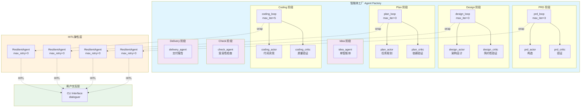
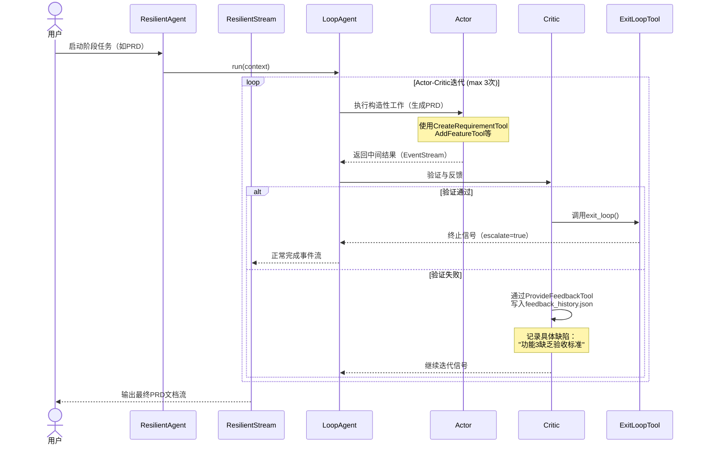
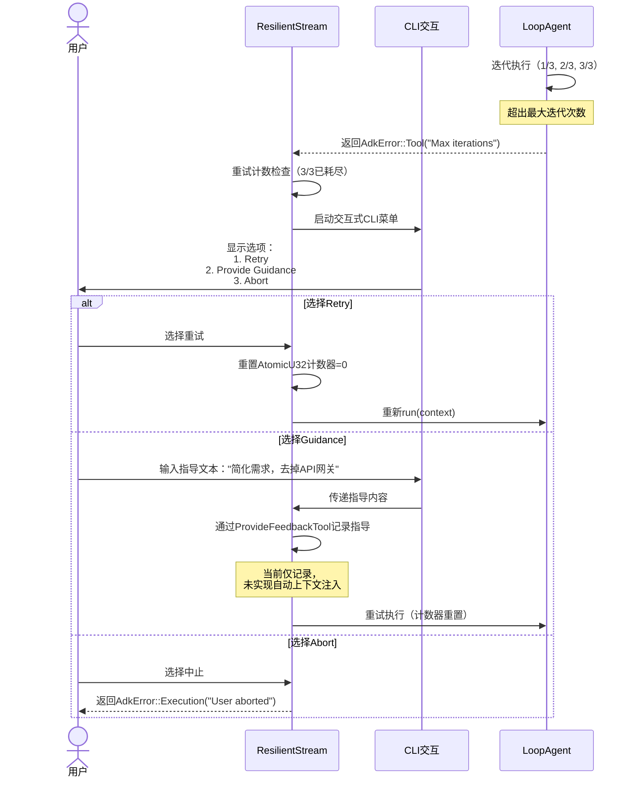

**文档生成时间：** 2024-05-15 08:30:00 UTC  
**版本：** v1.0  
**适用模块：** `crates/cowork-core/src/agents/`

---

# AI智能体编排域技术文档

## 1. 概述

### 1.1 领域定位

**AI智能体编排域**是Cowork Forge系统的**核心引擎域**，负责实现多智能体协作的软件开发生命周期（SDLC）自动化。该域基于ADK（Agent Development Kit）框架构建，采用**Actor-Critic双智能体协作模式**，为从需求构思到项目交付的七个关键阶段（Idea → PRD → Design → Plan → Coding → Check → Delivery）提供专业化智能体实例与编排能力。

### 1.2 核心价值

| 价值维度 | 实现机制 | 业务收益 |
|---------|---------|---------|
| **质量保障** | Actor生成 + Critic验证的迭代闭环 | 防止AI生成低质量或过度工程化的设计方案 |
| **弹性容错** | ResilientAgent三层容错（自动重试→人机决策→优雅中止） | 避免智能体陷入无限循环或静默失败 |
| **可控协作** | HITL（Human-In-The-Loop）关键节点介入 | 在PRD、Design、Plan等关键阶段确保人工把控 |
| **阶段隔离** | StageExecutor escalate标志隔离 | 支持LoopAgent独立退出而不中断整体工作流 |

### 1.3 架构全景



---

## 2. 核心架构设计

### 2.1 Actor-Critic协作模式

AI智能体编排域采用**强化学习中的Actor-Critic架构** adapted for LLM-based agents：

- **Actor（执行者）**：负责构造性工作，如生成PRD文档、创建架构设计、编写代码实现。Actor配备**写入类工具**（CreateRequirementTool、WriteFileTool等）。
- **Critic（评判者）**：负责验证与反馈，检查Actor输出的完整性、一致性、简约性。Critic配备**验证类工具**（CheckFeatureCoverageTool、CheckTaskDependenciesTool）和**控制类工具**（ProvideFeedbackTool、ExitLoopTool）。
- **LoopAgent（循环控制器）**：管理Actor与Critic的迭代协作，通过`max_iterations`（3-5次）限制防止无限循环。Critic通过调用`ExitLoopTool`显式终止循环，或通过`ProvideFeedbackTool`写入反馈驱动下一轮迭代。

**约束机制**：在PRD、Design、Plan阶段，Critic被指令模板约束执行**反循环检查**（避免Actor-Critic陷入无限互评）和**简约性验证**（如Design阶段强制要求2-4个核心组件）。

### 2.2 ResilientAgent弹性装饰器

所有LoopAgent均通过**ResilientAgent**包装，实现错误恢复与人机协作：

```rust
pub struct ResilientAgent {
    inner: Arc<dyn Agent>,
    max_retries: u32,        // 默认3次
    retry_counter: AtomicU32, // 线程安全计数器
}
```

**三层容错策略**：

1. **自动重试层**：在`ResilientStream::poll_next()`中拦截错误，对非致命错误（如LLM临时故障）自动重试，最多3次。
2. **人机决策层**：当检测到`"Max iterations"`错误（即Actor-Critic迭代耗尽仍未达成一致）时，暂停事件流，通过`dialoguer` crate呈现交互式菜单：
   - **Retry**：重置计数器，重新执行当前LoopAgent
   - **Provide Guidance**：用户输入指导文本（如"简化架构，去掉消息队列"），记录到反馈历史后重试
   - **Abort**：优雅中止，向上层返回错误
3. **流级拦截**：`ResilientStream`包装原始`EventStream`，在`poll_next`中实现非阻塞式错误检测与恢复。

### 2.3 StageExecutor阶段隔离

为避免LoopAgent调用`exit_loop()`时终止整个工作流，系统采用**StageExecutor**替代SequentialAgent：

```rust
pub struct StageExecutor {
    name: String,
    stages: Vec<(String, Arc<dyn Agent>)>,  // (阶段名, 智能体)
}
```

**关键设计**：StageExecutor在执行子Agent时**忽略`event.actions.escalate`标志**，确保：
- LoopAgent的`ExitLoopTool`仅终止当前阶段循环
- 错误不会向上传播导致管道中断
- 支持"阶段内循环迭代，阶段间顺序执行"的混合编排模式

---

## 3. 组件详解

### 3.1 智能体工厂（Agent Factory）

位于`agents/mod.rs`，提供7个工厂函数创建阶段专属智能体：

| 工厂函数 | 阶段 | 智能体类型 | 特殊配置 |
|---------|------|-----------|---------|
| `create_idea_agent` | Idea | 单智能体 | 配备SaveIdeaTool，IncludeContents::None |
| `create_prd_loop` | PRD | LoopAgent | Actor+Critic，max_iter=3，配备需求CRUD工具 |
| `create_design_loop` | Design | LoopAgent | Actor+Critic，max_iter=3，配备设计组件工具 |
| `create_plan_loop` | Plan | LoopAgent | Actor+Critic，max_iter=3，配备任务规划工具 |
| `create_coding_loop` | Coding | LoopAgent | Actor+Critic，max_iter=5，配备文件操作与命令执行工具 |
| `create_check_agent` | Check | 单智能体 | 宽容性验证模式，只读工具集 |
| `create_delivery_agent` | Delivery | 单智能体 | 报告生成工具，汇总前序阶段产物 |

**配置约定**：
- **Actor**：使用`IncludeContents::None`，避免上下文污染，强制基于工具读取必要信息
- **Critic**：使用默认上下文包含策略，可访问完整文件树进行验证
- **工具集**：各阶段Agent配置session-scoped工具，通过`session_id`实现数据隔离

### 3.2 HITL弹性层（`agents/hitl.rs`）

实现人机协作的核心基础设施：

**ResilientStream结构**：
```rust
pub struct ResilientStream {
    inner: EventStream,
    retry_count: Arc<AtomicU32>,
    max_retries: u32,
    context: Arc<dyn InvocationContext>,
}
```

**错误识别与分类**：
- **可恢复错误**：网络超时、LLM速率限制 → 自动重试
- **需介入错误**：`Max iterations`（迭代耗尽）、`Tool execution failed`（工具执行失败）→ 触发HITL流程
- **致命错误**：权限拒绝、配置错误 → 立即中止

**用户交互协议**：
当触发HITL时，系统通过`dialoguer::Select`呈现菜单：
```
AI智能体执行遇到重复迭代限制 (3/3)

选择操作:
> 1. 重试执行 (Retry)
  2. 提供指导建议 (Provide Guidance)
  3. 中止执行 (Abort)
```

### 3.3 协作协议实现

**Actor-Critic通信协议**：

1. **Actor执行**：基于系统提示词（来自指令模板域）和可用工具执行构造任务，输出中间产物（如PRD草稿）
2. **Critic评估**：读取Actor输出，执行验证工具检查约束条件（如Design阶段检查"组件数量≤4"）
3. **决策分支**：
   - **验证通过**：Critic调用`ExitLoopTool`，LoopAgent终止迭代，返回最终结果
   - **验证失败**：Critic调用`ProvideFeedbackTool`写入`feedback_history.json`，记录缺陷描述与改进建议，Actor进入下一轮迭代

**人机协作集成点**：
在PRD、Design、Plan阶段，Actor首次输出后触发`ReviewWithFeedbackContentTool`，展示内容预览（前12-15行），等待用户选择：
- **edit**：打开系统默认编辑器（`$EDITOR`）修改内容，保存后重新加载
- **pass**：直接确认，进入Critic验证环节
- **feedback**：捕获文本反馈，注入下一轮Actor上下文

---

## 4. 技术实现细节

### 4.1 Rust实现特性

**线程安全**：
- 使用`Arc<dyn Agent>`实现智能体的共享所有权
- `AtomicU32`保证重试计数器的线程安全
- 所有Agent实现`Send + Sync`，支持异步并发执行

**异步流处理**：
```rust
impl Stream for ResilientStream {
    type Item = Result<Event, AdkError>;
    
    fn poll_next(mut self: Pin<&mut Self>, cx: &mut Context<'_>) -> Poll<Option<Self::Item>> {
        // 拦截错误事件，根据类型决定重试或触发HITL
        match self.inner.poll_next(cx) {
            Poll::Ready(Some(Err(e))) if is_recoverable(&e) => {
                self.handle_recoverable_error(e, cx)
            }
            Poll::Ready(Some(Err(e))) if is_hitl_trigger(&e) => {
                self.suspend_for_human_decision(e, cx)
            }
            other => other
        }
    }
}
```

### 4.2 ADK框架集成

**核心Trait实现**：
- `Agent`：所有智能体工厂函数返回`Arc<dyn Agent>`，统一`run()`方法签名
- `Tool`：工具系统域的工具通过Arc注入Agent
- `InvocationContext`：传递会话ID、项目路径等上下文

**LoopAgent配置**：
```rust
let loop_agent = LoopAgent::builder()
    .actor(actor_agent)
    .critic(critic_agent)
    .max_iterations(3)  // PRD/Design/Plan限制3次，Coding限制5次
    .exit_on_feedback(true)  // Critic提供反馈时继续循环
    .build();
```

### 4.3 工具链集成模式

各阶段Agent通过**依赖注入**获取工具集：

**PRD阶段工具配置示例**：
```rust
let tools: Vec<Arc<dyn Tool>> = vec![
    Arc::new(CreateRequirementTool::new(session_id.clone())),
    Arc::new(AddFeatureTool::new(session_id.clone())),
    Arc::new(ReadFileTool::new()),  // 读取前置阶段产物
    Arc::new(ReviewWithFeedbackContentTool::new()),  // HITL审核
    Arc::new(ProvideFeedbackTool::new(session_id.clone())),
];
```

**权限控制**：
- **Actor**：拥有写入权限（Create/Update/Write工具）
- **Critic**：只读权限（Check/Validate工具）+ 控制权限（Feedback/Exit工具）
- **Check Agent**：纯只读，执行宽容性验证（允许轻微不一致，只标记关键错误）

---

## 5. 交互时序

### 5.1 正常执行流程



### 5.2 弹性错误恢复流程



---

## 6. 配置与扩展

### 6.1 智能体参数配置

通过`AgentConfig`结构体配置各阶段参数：

```rust
pub struct AgentConfig {
    pub max_iterations: u32,      // 迭代次数限制
    pub temperature: f32,         // LLM温度（Actor通常0.7，Critic通常0.3）
    pub include_contents: IncludeContents,  // 上下文包含策略
    pub hitl_enabled: bool,       // 是否启用该阶段HITL审核
}
```

**阶段差异化配置**：
- **Idea阶段**：temperature=0.8（创造性），无Critic（单智能体）
- **Design阶段**：Actor temp=0.7（平衡创造性），Critic temp=0.2（严格验证），强制组件数≤4
- **Coding阶段**：max_iterations=5（代码实现复杂度更高），配备RunCommandTool执行构建验证

### 6.2 扩展指南

**新增阶段智能体**：
1. 在`agents/mod.rs`新增工厂函数`create_custom_loop`
2. 在`instructions/`目录新增`custom.rs`定义Actor/Critic指令模板
3. 在`tools/mod.rs`注册阶段专用工具
4. 在`pipeline/mod.rs`的`StageExecutor`中插入新阶段

**自定义HITL策略**：
通过实现`HitlStrategy` trait自定义人机协作触发条件：
```rust
pub trait HitlStrategy {
    fn should_intervene(&self, event: &Event, retry_count: u32) -> bool;
    fn present_options(&self) -> Vec<HitlOption>;
}
```

---

## 7. 性能与可靠性

### 7.1 资源管理

- **流式处理**：所有Agent返回`EventStream`，支持增量输出，避免大文档内存占用
- **超时控制**：工具系统域的`RunCommandTool`设置30秒超时，防止AI生成阻塞命令（如`npm install`）
- **速率限制**：通过LLM服务域的`RateLimitedLlm`装饰器，默认2秒延迟，确保<30次/分钟API调用

### 7.2 故障隔离

| 故障场景 | 隔离机制 | 恢复策略 |
|---------|---------|---------|
| 单个阶段LoopAgent失败 | StageExecutor隔离 | ResilientAgent重试3次→HITL决策 |
| LLM API超时 | RateLimiter包装 | 自动重试+退避策略 |
| 文件IO权限错误 | 路径安全校验（file_tools.rs） | 立即中止，报告安全违规 |
| 内存不足 | Streaming架构 | 分块处理大文件，避免全量加载 |

---

## 8. 总结

AI智能体编排域通过**Actor-Critic双智能体协作**、**ResilientAgent弹性容错**和**StageExecutor阶段隔离**三大核心机制，实现了稳健、可控、高质量的AI驱动软件开发自动化。该架构在保证AI自主性的同时，通过HITL机制保留人类在关键决策节点的控制权，通过简约性约束防止过度工程化，是Cowork Forge系统实现"自动化软件开发"愿景的技术基石。

**关键设计决策回顾**：
1. **为什么选择StageExecutor而非SequentialAgent**：确保LoopAgent的exit不影响全局流程，支持阶段内迭代优化
2. **为什么Actor与Critic分离**：解耦构造与验证职责，避免AI既当运动员又当裁判员导致的偏见
3. **为什么HITL在max_iterations时介入**：既给予AI充分自主权（3-5次迭代），又在陷入循环时及时引入人类监督