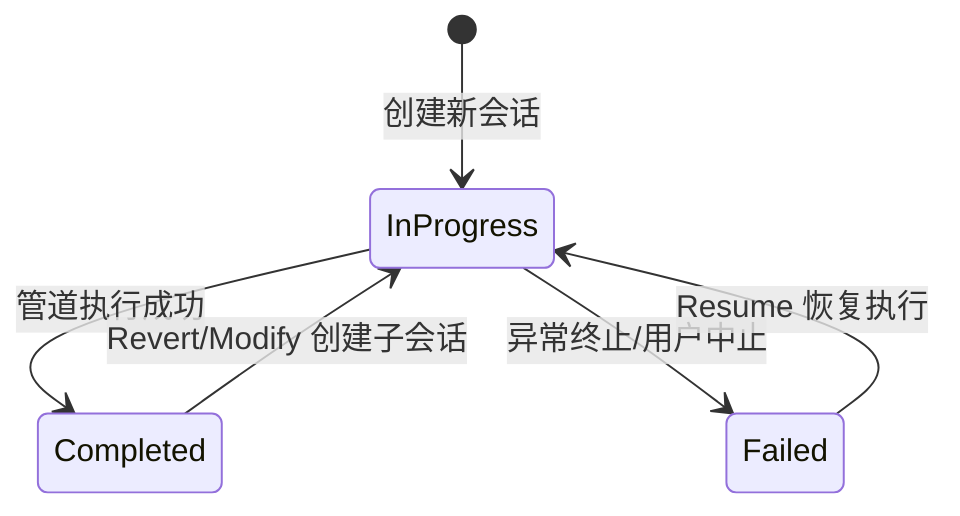

**技术文档：CLI交互与项目入口域**

**生成时间：** 2024-01-15 08:30:00 UTC  
**文档版本：** v1.0  
**适用范围：** Cowork Forge CLI 模块（crates/cowork-cli）

---

## 1. 概述

CLI交互与项目入口域（CLI Interaction & Project Entry Domain）是 Cowork Forge 系统的命令行交互门面（Facade）和项目生命周期编排器（Orchestrator）。作为系统的最外层组件，该域承担着解析用户指令、初始化执行环境、管理会话生命周期以及协调下游领域协同工作的核心职责。

该模块基于 Rust 异步运行时构建，采用分层架构设计，通过声明式 CLI 解析、分层配置策略和状态机驱动的会话管理，为七个核心 AI 智能体阶段（Idea → PRD → Design → Plan → Coding → Check → Delivery）提供统一的入口控制和执行编排能力。

### 1.1 核心职责

| 职责域 | 功能描述 | 关键实现 |
|--------|----------|----------|
| **命令解析** | 解析用户输入的六大核心命令及全局标志 | `clap` 派生宏实现类型安全解析 |
| **配置管理** | 分层加载 LLM 配置与项目配置，支持文件/环境变量双模式 | TOML 解析 + 环境变量 Fallback 策略 |
| **会话生命周期** | 管理 Session ID 生成、状态机转换（InProgress/Completed/Failed）、血缘追踪 | 时间戳派生 ID + `.cowork/` 目录持久化 |
| **执行编排** | 通过 ADK Runner 启动智能体管道，支持同步/流式双模式输出 | `adk_runner::Runner` 异步事件流处理 |
| **变更检测** | 项目文件指纹计算，支持增量修改场景的差异比对 | `walkdir` + 文件元数据哈希 |

### 1.2 架构定位

在 Cowork Forge 的分层架构中，CLI 域位于**界面交互层**，作为用户与核心领域层（AI 智能体编排域、管道编排域）之间的桥梁：

```
用户终端
    │
    ▼
[CLI交互与项目入口域] ←──── 配置/会话管理
    │
    ├──► [LLM服务域] ────────► 外部 LLM API
    │
    └──► [管道编排域] ───────► [AI智能体编排域]
              │
              ▼
        [工具系统域] ←───────► 文件系统/操作系统
```

---

## 2. 命令体系设计

系统提供六大核心命令，覆盖软件开发生命周期的全场景操作需求：

### 2.1 命令矩阵

| 命令 | 功能描述 | 适用场景 | 关键参数 |
|------|----------|----------|----------|
| `cowork new` | 创建全新项目会话，执行完整七阶段管道 | 从零开始构建新项目 | `--project <name>`, `--idea <description>` |
| `cowork resume` | 从断点继续执行，自动检测已完成阶段 | 中断恢复、异常续作 | `--session <id>`（可选，默认最新） |
| `cowork revert` | 回退到指定阶段重新执行 | 设计/规划阶段重大调整 | `--session <id>`, `--to <stage>` |
| `cowork modify` | 基于现有项目执行增量变更 | 需求变更、功能增强 | `--project <name>`, `--change <description>` |
| `cowork status` | 查询会话状态与历史记录 | 状态监控、会话管理 | `--project <name>`（可选） |
| `cowork init` | 初始化项目配置，生成默认 TOML 文件 | 首次使用配置环境 | 无 |

### 2.2 全局标志

```rust
#[derive(Parser)]
struct Cli {
    /// 配置文件路径（TOML 格式）
    #[arg(short, long)]
    config: Option<PathBuf>,
    
    /// 详细日志输出（Debug 级别）
    #[arg(short, long)]
    verbose: bool,
    
    /// LLM 流式输出模式
    #[arg(short, long)]
    stream: bool,
    
    #[command(subcommand)]
    command: Commands,
}
```

**设计考量：**
- **配置分离**：通过 `-c` 标志支持多环境配置（开发/生产/本地 LLM）
- **可观测性**：`-v` 启用 `tracing` 的 DEBUG 级别，默认仅显示 WARN 以上
- **用户体验**：`-s` 流式模式实时输出 AI 生成内容，降低等待焦虑

---

## 3. 核心子模块实现

### 3.1 命令处理器（Command Handler）

基于 `clap` 4.x 的派生宏（Derive Macro）实现声明式命令定义，通过零成本抽象实现类型安全的参数解析：

**关键实现模式：**
```rust
#[derive(Subcommand)]
enum Commands {
    /// 创建新项目
    New {
        /// 项目创意描述
        idea: String,
        /// 项目名称（可选，默认时间戳）
        #[arg(short, long)]
        project: Option<String>,
    },
    /// 从断点恢复
    Resume {
        /// 目标会话 ID（可选，默认最新成功会话）
        #[arg(short, long)]
        session: Option<String>,
    },
    // ... 其他命令
}

// 异步命令分发
async fn execute_command(cli: Cli) -> Result<()> {
    match cli.command {
        Commands::New { idea, project } => cmd_new(idea, project, cli.config).await,
        Commands::Resume { session } => cmd_resume(session, cli.config).await,
        // ...
    }
}
```

**错误传播策略：**
采用 `anyhow` 实现全链路错误上下文增强，确保错误信息包含当前执行的命令类型和会话 ID，便于故障定位。

### 3.2 配置管理器（Configuration Manager）

实现**分层 Fallback 配置策略**，优先级从高到低：

1. **命令行指定**（`-c/--config` 显式路径）
2. **当前目录配置文件**（`./config.toml`）
3. **用户级全局配置**（`~/.cowork/config.toml`）
4. **环境变量**（`COWORK_LLM_ENDPOINT`, `COWORK_API_KEY`）
5. **默认硬编码**（本地 Ollama 默认端点）

**配置模型：**
```rust
#[derive(Deserialize)]
struct ModelConfig {
    endpoint: String,
    api_key: String,
    model: String,
    timeout_secs: u64,
}

impl ModelConfig {
    /// 文件优先加载，失败时降级到环境变量
    pub fn load_with_fallback(path: Option<PathBuf>) -> Result<Self> {
        if let Some(p) = path {
            Self::from_file(p)
        } else if let Ok(cfg) = Self::from_file("./config.toml") {
            Ok(cfg)
        } else {
            Self::from_env()
        }
    }
}
```

### 3.3 会话管理器（Session Manager）

会话管理器负责维护**有状态的服务端会话（Stateful Session）**，通过文件系统实现进程间状态持久化。

#### 3.3.1 会话标识策略

采用**时间戳派生 ID** 生成唯一会话标识：
```rust
fn generate_session_id() -> String {
    format!("session-{}", chrono::Utc::now().timestamp())
}
```
**优势：** 天然按时间排序，人类可读，避免 UUID 的随机性带来的认知负担。

#### 3.3.2 会话状态机



**会话血缘追踪：**
Resume/Revert/Modify 命令创建**子会话（Child Session）**，通过 `base_session_id` 字段关联父会话，形成会话链（Session Chain），支持变更追溯和版本回滚。

```rust
struct SessionRecord {
    id: String,
    session_type: SessionType,      // New/Modify/Revert/Resume
    status: SessionStatus,          // InProgress/Completed/Failed
    base_session_id: Option<String>, // 父会话引用（血缘追踪）
    created_at: DateTime<Utc>,
    completed_at: Option<DateTime<Utc>>,
}
```

#### 3.3.3 项目文件指纹系统

针对 `cowork modify` 的增量变更场景，实现**基于元数据的轻量级指纹**：

```rust
type FileFingerprint = (u64, u64); // (文件长度, 修改时间戳)

fn collect_project_fingerprints(project_dir: &Path) -> HashMap<String, FileFingerprint> {
    WalkDir::new(project_dir)
        .filter_entry(|e| !is_ignored_path(e)) // 排除 .cowork/, target/, node_modules/
        .filter_map(|e| e.ok())
        .filter(|e| e.file_type().is_file())
        .map(|e| {
            let meta = e.metadata()?;
            let fingerprint = (meta.len(), meta.modified()?.duration_since(UNIX_EPOCH)?.as_secs());
            (e.path().to_string_lossy().to_string(), fingerprint)
        })
        .collect()
}
```

**变更检测算法：**
通过对比 Modify 命令执行前后的指纹映射，精确计算出 `added`、`modified`、`deleted` 文件集合，存储于 `PatchMetadata` 供后续审计。

---

## 4. 执行编排与 ADK 集成

### 4.1 管道工厂调用

CLI 域作为**管道编排域（Pipeline Domain）**的客户端，通过工厂函数创建不同类型的执行管道：

| CLI 命令 | 管道工厂函数 | 管道类型 |
|----------|--------------|----------|
| `new` | `create_cowork_pipeline` | 七阶段完整管道 |
| `resume` | `create_resume_pipeline` | 断点续接管道（动态跳过已完成阶段） |
| `revert` | `create_partial_pipeline` | 部分执行管道（从指定阶段开始） |
| `modify` | `create_modify_pipeline` | 增量修改管道（Change Triage → Code Patch → Check） |

### 4.2 ADK Runner 执行模型

```rust
async fn execute_pipeline(
    pipeline: Arc<dyn Agent>,
    config: ModelConfig,
    session_id: String,
    stream_mode: bool,
) -> Result<()> {
    // 1. 构建 LLM 客户端（带速率限制）
    let llm = create_llm_client(config)?;
    
    // 2. 初始化 ADK Runner
    let runner = Runner::new(RunnerConfig {
        agent: pipeline,
        session_service: Arc::new(InMemorySessionService::new()),
        // ... 其他配置
    });
    
    // 3. 启动异步事件流
    let mut event_stream = runner.run("user", &session_id, Content::text("开始执行")).await?;
    
    // 4. 消费事件流
    while let Some(event) = event_stream.next().await {
        match event {
            Event::Content { content, .. } if stream_mode => {
                // 流式模式：实时输出到 stdout
                print!("{}", content.text);
                stdout().flush()?;
            }
            Event::FunctionCall { name, args } => {
                tracing::debug!("工具调用: {} {:?}", name, args);
            }
            Event::Error { error } => {
                return Err(error.into());
            }
            _ => {}
        }
    }
    
    Ok(())
}
```

**关键设计：**
- **会话服务隔离**：每个命令执行使用独立的 `InMemorySessionService`，确保多会话并行安全
- **流式输出支持**：通过 `EventStream` 实时转发 LLM 的 Token 级输出，降低用户等待感知
- **优雅关闭**：监听管道完成事件，确保所有文件句柄和临时资源正确释放

---

## 5. 存储与状态持久化

CLI 域通过 `cowork_core::storage` 模块与存储层交互，维护 `.cowork/` 目录结构：

```
.cowork/
├── project_index.json          # 项目级会话索引（会话列表、当前状态）
├── config.toml                 # 项目级配置文件（可选）
└── sessions/
    ├── session-1672531200/     # 具体会话目录
    │   ├── metadata.json       # 会话元数据（类型、状态、父会话ID）
    │   ├── input.json          # 会话初始输入（idea、change description）
    │   ├── state.json          # 执行状态（当前阶段、上下文）
    │   ├── feedback_history.json # HITL 反馈历史记录
    │   └── patch_metadata.json # 增量修改元数据（Modify 命令特有）
    └── session-1672531300/
        └── ...
```

**状态更新策略：**
- **乐观更新**：管道启动时立即标记状态为 `InProgress`
- **最终一致性**：管道成功完成后标记 `Completed`，失败或异常时标记 `Failed`
- **原子写入**：所有 JSON 文件写入采用临时文件 + 重命名策略，防止写入中断导致数据损坏

---

## 6. 错误处理与弹性机制

### 6.1 分层错误处理

| 层级 | 错误类型 | 处理策略 |
|------|----------|----------|
| **CLI 解析层** | 参数格式错误、缺失必填项 | `clap` 自动生成帮助信息并退出码 2 |
| **配置层** | 文件不存在、TOML 解析失败 | 降级到环境变量，仍失败则返回用户友好提示 |
| **会话层** | 会话不存在、状态冲突 | 提示可用会话列表（`cowork status` 引导） |
| **执行层** | 智能体执行失败、工具调用错误 | 由下游 `ResilientAgent` 处理，CLI 负责最终状态标记 |

### 6.2 可观测性实现

基于 `tracing` 框架实现结构化日志：

```rust
fn init_logging(verbose: bool) {
    let filter = if verbose {
        LevelFilter::DEBUG
    } else {
        // 默认过滤 ADK 内部 crate 的 INFO 以下日志，减少噪音
        LevelFilter::WARN
            .add_directive("cowork_cli=info".parse().unwrap())
            .add_directive("cowork_core=info".parse().unwrap())
    };
    
    tracing_subscriber::fmt()
        .with_writer(std::io::stderr) // 强制输出到 stderr，避免污染 stdout
        .with_max_level(filter)
        .init();
}
```

**日志规范：**
- **stdout**：仅输出用户友好的进度提示（使用 emoji 标识：✨ 初始化、🔄 执行中、✅ 完成、❌ 错误）
- **stderr**：所有诊断日志、调试信息、错误堆栈

---

## 7. 接口契约

### 7.1 对外接口（用户界面）

**环境依赖：**
- Rust 运行时环境（≥1.70）
- 可写的文件系统权限（创建 `.cowork/` 目录）
- 网络连接（访问 LLM API 端点）
- 可选：系统默认编辑器（用于 HITL 审核流程的 `edit` 操作）

**退出码约定：**
| 退出码 | 含义 |
|--------|------|
| 0 | 执行成功 |
| 1 | 通用错误（执行失败） |
| 2 | CLI 参数解析错误 |
| 130 | 用户中断（Ctrl+C） |

### 7.2 对内接口（核心域通信）

```rust
// 与管道编排域的接口
pub fn create_cowork_pipeline(
    config: ModelConfig,
    session_id: String,
) -> Arc<dyn Agent>;

// 与存储域的接口
pub fn init_session_from_base(
    new_session_id: String,
    base_session_id: String,
) -> Result<SessionContext>;

// 与会话管理接口
pub fn mark_session_completed(session_id: &str) -> Result<()>;
pub fn mark_session_failed(session_id: &str, error: &str) -> Result<()>;
```

---

## 8. 典型工作流示例

### 8.1 完整新建流程（Happy Path）

```bash
$ cowork new "创建一个Rust CLI工具，用于管理待办事项" --project todo-cli
✨ 初始化新项目: todo-cli
📝 Session ID: session-1672531200
🔄 启动 AI 智能体管道...

[Idea] 整理创意中...
[Idea] ✓ 已生成 idea.md

[PRD] Actor 分析需求...
[PRD] Critic 验证中...
[PRD] 等待人工审核...
# 此时弹出交互菜单：edit / pass / feedback
> pass

[Design] Actor 创建架构...
[Design] Critic 验证简约性...
...

✅ 项目交付完成！所有工件已保存至 ./.cowork/sessions/session-1672531200/
```

### 8.2 增量修改流程

```bash
$ cowork modify --project todo-cli --change "添加优先级标签功能"
🔍 计算项目文件指纹...
📦 基于会话 session-1672531200 创建变更会话 session-1672534560
🔄 执行变更分析...

[Change Triage] 分析影响范围：
  - 影响组件: Task Model, CLI Parser
  - 风险等级: 中
  - 预计修改文件: src/models.rs, src/cli.rs

[Code Patch] 执行增量修改...
✅ 变更完成，已生成变更报告
```

---

## 9. 性能与约束

### 9.1 性能特征

- **启动延迟**：< 100ms（Rust 原生编译，无运行时 JIT）
- **内存占用**：基础 ~20MB，执行期间随管道复杂度增长（主要为 LLM 上下文缓存）
- **文件指纹计算**：< 1s（对于 <10,000 文件的项目）

### 9.2 使用约束

- **单实例执行**：同一时间同一项目目录仅允许一个活跃会话（通过文件锁实现）
- **路径安全**：所有文件操作被限制在项目根目录下，禁止路径遍历（`../`）访问父目录
- **命令超时**：Shell 命令执行默认 30 秒超时，防止无限阻塞

---

## 10. 扩展指南

### 10.1 添加新命令

1. 在 `Commands` 枚举中添加新变体
2. 实现对应的 `cmd_<name>` 异步处理函数
3. 如需新管道类型，在 `cowork-core` 中实现 `create_<name>_pipeline`
4. 更新 `execute_command` 分发逻辑

### 10.2 自定义配置源

实现 `ConfigProvider` trait 可接入外部配置中心（如 Consul、etcd）：

```rust
trait ConfigProvider {
    async fn load(&self) -> Result<ModelConfig>;
}

// 在 load_config 中添加新分支
match provider {
    ConfigSource::File(p) => ModelConfig::from_file(p),
    ConfigSource::Env => ModelConfig::from_env(),
    ConfigSource::Custom(provider) => provider.load().await,
}
```

---

## 结语

CLI 交互与项目入口域作为 Cowork Forge 系统的**门户层**，通过精心设计的命令体系、稳健的会话管理和透明的配置策略，为用户提供了直观且可靠的 AI 驱动开发入口。其基于 Rust 的零成本抽象实现，在保证类型安全的同时提供了接近原生性能的用户体验，是连接人类意图与 AI 执行能力的关键纽带。