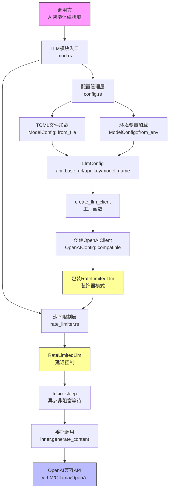
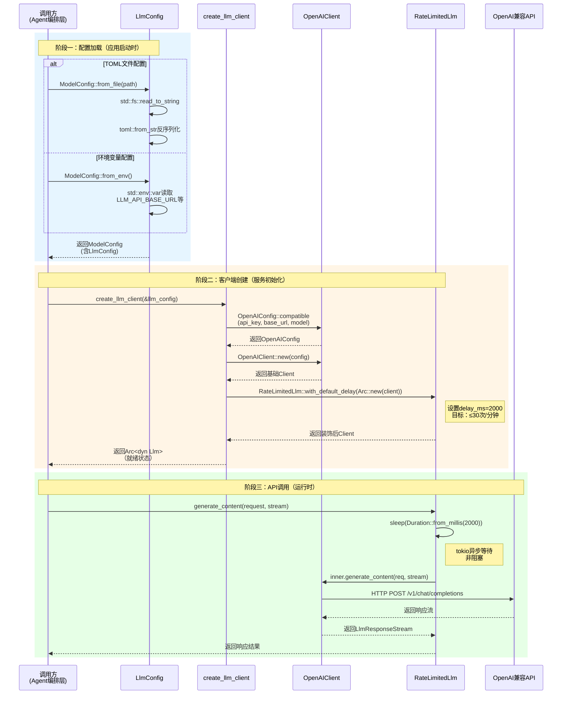

# LLM服务域技术文档

## 1. 概述

LLM服务域是 **Cowork Forge** 系统的智能能力基础设施层，负责为大语言模型（LLM）提供统一的配置管理、客户端抽象和访问控制能力。该模块通过标准化接口封装底层LLM API复杂性，支持OpenAI兼容的多种模型提供商（包括OpenAI官方API、vLLM本地部署、Ollama私有实例等），并通过装饰器模式实现透明的速率限制保护。

### 核心职责

| 职责维度 | 说明 |
|---------|------|
| **配置抽象** | 支持TOML文件与环境变量双模式配置，实现12-Factor App原则 |
| **客户端工厂** | 提供统一的LLM客户端创建接口，自动叠加速率控制层 |
| **速率管控** | 默认2秒延迟策略，确保API调用频率低于30次/分钟，避免触发服务商限流 |
| **协议兼容** | 通过OpenAI兼容模式支持私有化部署和本地模型推理 |

---

## 2. 架构设计

### 2.1 分层架构

LLM服务域采用**基础设施层**定位，通过Facade模式对外提供统一入口，内部实现配置管理、客户端工厂和速率限制三层分离：



### 2.2 设计模式

| 模式 | 应用位置 | 目的 |
|-----|---------|------|
| **工厂模式** | `create_llm_client` | 将配置转换为运行时实例，隔离创建逻辑 |
| **装饰器模式** | `RateLimitedLlm` | 透明叠加速率限制，不侵入核心LLM逻辑 |
| **Facade模式** | `mod.rs` | 统一模块入口，简化API暴露 |
| **依赖倒置** | `Arc<dyn Llm>` | 通过trait对象实现运行时多态，支持测试替身 |

---

## 3. 核心组件详解

### 3.1 配置管理（config.rs）

配置管理层实现**双策略配置加载**，支持生产环境的显式配置与容器化环境的动态配置：

#### 数据结构

```rust
/// 核心LLM连接配置
pub struct LlmConfig {
    pub api_base_url: String,  // 服务端点，如 https://api.openai.com/v1
    pub api_key: String,       // 认证密钥
    pub model_name: String,    // 模型标识，如 gpt-4, llama2-7b
}

/// 包装层，支持未来多模型类型扩展
pub struct ModelConfig {
    pub llm: LlmConfig,
    // 预留扩展字段：temperature, max_tokens等
}
```

#### 配置加载策略

**策略一：TOML文件配置（生产环境推荐）**
- 入口函数：`ModelConfig::from_file(path: &str) -> Result<ModelConfig>`
- 实现机制：使用`serde` + `toml` crate进行强类型反序列化
- 适用场景：固定配置的生产环境部署

**策略二：环境变量配置（容器化/开发环境）**
- 入口函数：`ModelConfig::from_env() -> Result<ModelConfig>`
- 环境变量映射：
  - `LLM_API_BASE_URL` → `api_base_url`
  - `LLM_API_KEY` → `api_key`
  - `LLM_MODEL_NAME` → `model_name`
- 适用场景：Docker容器、CI/CD流水线、敏感信息注入

#### 客户端工厂

```rust
/// 创建带速率限制的LLM客户端
pub fn create_llm_client(config: &LlmConfig) -> Result<Arc<dyn Llm>> {
    // 1. 创建OpenAI兼容配置
    let openai_config = OpenAIConfig::compatible()
        .with_api_key(&config.api_key)
        .with_base_url(&config.api_base_url)
        .with_model(&config.model_name);
    
    // 2. 实例化基础客户端
    let base_client = OpenAIClient::new(openai_config);
    
    // 3. 装饰速率限制层（默认2秒延迟）
    let rate_limited = RateLimitedLlm::with_default_delay(
        Arc::new(base_client)
    );
    
    Ok(Arc::new(rate_limited))
}
```

**关键设计决策**：
- 使用`OpenAIConfig::compatible()`适配OpenAI兼容端点，确保与vLLM、Ollama等本地部署方案无缝集成
- 返回`Arc<dyn Llm>`实现依赖倒置，上层模块通过标准trait接口调用，与具体实现解耦

### 3.2 速率限制器（rate_limiter.rs）

速率限制器采用**装饰器模式**，在不修改原有LLM客户端代码的前提下，通过包装添加延迟控制功能：

#### 实现结构

```rust
use async_trait::async_trait;
use std::sync::Arc;
use tokio::time::{sleep, Duration};

pub struct RateLimitedLlm {
    inner: Arc<dyn Llm>,      // 被装饰的LLM客户端
    delay_ms: u64,            // 延迟毫秒数
}

impl RateLimitedLlm {
    /// 自定义延迟
    pub fn new(inner: Arc<dyn Llm>, delay_ms: u64) -> Self {
        Self { inner, delay_ms }
    }
    
    /// 默认2秒延迟（对应30 RPM限制）
    pub fn with_default_delay(inner: Arc<dyn Llm>) -> Self {
        Self::new(inner, 2000)
    }
}

#[async_trait]
impl Llm for RateLimitedLlm {
    fn name(&self) -> &str {
        self.inner.name()
    }
    
    async fn generate_content(
        &self,
        request: GenerateContentRequest,
        stream: bool,
    ) -> Result<LlmResponseStream> {
        // 非阻塞延迟
        sleep(Duration::from_millis(self.delay_ms)).await;
        
        // 委托给内部实现
        self.inner.generate_content(request, stream).await
    }
}
```

#### 速率策略计算

- **默认配置**：2000ms延迟 = 30次/分钟（Requests Per Minute）
- **合规目标**：满足主流LLM服务商（OpenAI、Azure等）的Tier-1配额限制
- **异步实现**：使用`tokio::time::sleep`确保延迟期间不阻塞线程，支持高并发场景

---

## 4. 交互流程

### 4.1 运行时序

LLM服务域的完整生命周期包含**配置加载**、**客户端创建**、**API调用**三个阶段：



### 4.2 与ADK框架集成

LLM服务域深度集成ADK（Agent Development Kit）框架，遵循其抽象契约：

| ADK组件 | 集成方式 | 作用 |
|--------|---------|------|
| `adk_core::Llm` | Trait实现 | 定义LLM能力契约，`generate_content`方法 |
| `adk_model::openai` | 底层传输 | `OpenAIClient`和`OpenAIConfig`提供HTTP通信 |
| `adk_core::Tool` | 依赖关系 | 工具系统通过LLM客户端调用模型能力 |

---

## 5. 配置规范

### 5.1 TOML配置示例

适用于生产环境的显式配置文件（`cowork.toml`）：

```toml
[llm]
api_base_url = "https://api.openai.com/v1"
api_key = "sk-xxxxxxxxxxxxxxxxxxxxxxxx"
model_name = "gpt-4-turbo-preview"

# 可选扩展（预留）
[llm.parameters]
temperature = 0.7
max_tokens = 4096
```

### 5.2 环境变量配置示例

适用于容器化部署（Docker/Docker Compose）：

```bash
# 使用OpenAI官方API
export LLM_API_BASE_URL="https://api.openai.com/v1"
export LLM_API_KEY="sk-xxxxxxxx"
export LLM_MODEL_NAME="gpt-4"

# 使用本地vLLM部署
export LLM_API_BASE_URL="http://localhost:8000/v1"
export LLM_API_KEY="EMPTY"  # vLLM通常不需要认证
export LLM_MODEL_NAME="meta-llama/Llama-2-7b-chat-hf"
```

### 5.3 配置优先级

系统采用**显式优先**策略：
1. 若TOML文件存在且字段有效，使用文件配置
2. 若TOML缺失或字段不完整，回退到环境变量
3. 若两者均缺失，返回`anyhow::Result`错误，阻止应用启动

---

## 6. 扩展性设计

### 6.1 新增LLM提供商

当前架构支持通过`OpenAIConfig::compatible()`适配任何实现OpenAI API协议的端点。如需支持非兼容协议：

1. **实现自定义客户端**：实现`adk_core::Llm` trait
2. **扩展配置枚举**：在`ModelConfig`中增加提供商类型字段
3. **修改工厂函数**：在`create_llm_client`中增加分支逻辑

```rust
// 扩展示例：增加Azure OpenAI支持
pub enum ProviderType {
    OpenAICompatible,
    AzureOpenAI,
}

pub fn create_llm_client(config: &LlmConfig, provider: ProviderType) -> Result<Arc<dyn Llm>> {
    match provider {
        ProviderType::OpenAICompatible => { /* 现有逻辑 */ },
        ProviderType::AzureOpenAI => { /* Azure特定逻辑 */ },
    }
}
```

### 6.2 自定义速率策略

`RateLimitedLlm`支持毫秒级精度的延迟配置，可针对不同服务商的配额策略调整：

```rust
// 针对高配额账户（如OpenAI Tier-5：10,000 RPM）
let fast_client = RateLimitedLlm::new(base_client, 6); // 6ms延迟 ≈ 10,000 RPM

// 针对严格限制（如免费套餐：3 RPM）
let slow_client = RateLimitedLlm::new(base_client, 20000); // 20秒延迟
```

---

## 7. 最佳实践

### 7.1 生产环境建议

1. **密钥管理**：使用环境变量或密钥管理服务（AWS Secrets Manager、Azure Key Vault）注入`api_key`，避免硬编码
2. **连接池优化**：`OpenAIClient`内部维护HTTP连接池，建议作为单例在整个应用生命周期复用
3. **超时配置**：在`OpenAIConfig`中设置合理的请求超时（建议30-60秒），防止长文本生成导致阻塞

### 7.2 本地开发建议

1. **使用Ollama降低 costs**：在`LLM_API_BASE_URL`中指向本地Ollama实例（`http://localhost:11434/v1`）
2. **速率限制调整**：本地开发时可调用`RateLimitedLlm::new(inner, 0)`关闭延迟，加速迭代
3. **模型降级测试**：使用`gpt-3.5-turbo`等低成本模型验证流程，生产环境切换至`gpt-4`

### 7.3 故障排查

| 现象 | 可能原因 | 排查方法 |
|-----|---------|---------|
| `Connection refused` | 本地LLM服务未启动 | 检查vLLM/Ollama进程状态，验证端口连通性 |
| `429 Too Many Requests` | 速率限制不足 | 增加`delay_ms`值，或检查服务商配额 |
| `401 Unauthorized` | API Key无效或过期 | 验证`api_key`格式，检查环境变量注入 |
| 响应延迟过高 | 网络延迟或模型负载 | 使用`ping`检查网络，考虑切换就近Region |

---

## 8. 总结

LLM服务域作为Cowork Forge的**智能能力底座**，通过分层架构设计实现了配置灵活性、协议兼容性和访问可控性的平衡。其核心价值在于：

- **零侵入速率控制**：装饰器模式实现透明限流，不影响业务代码
- **双模式配置**：兼顾开发便利性与生产安全性
- **协议抽象**：OpenAI兼容层支持从云端API到本地私有化部署的无缝切换
- **资源保护**：默认2秒延迟策略防止API配额耗尽，确保系统稳定性

该模块作为基础设施域，为上层AI智能体编排域提供可靠、合规、可观测的LLM调用能力，是整个Cowork Forge系统实现AI驱动软件开发的基石。