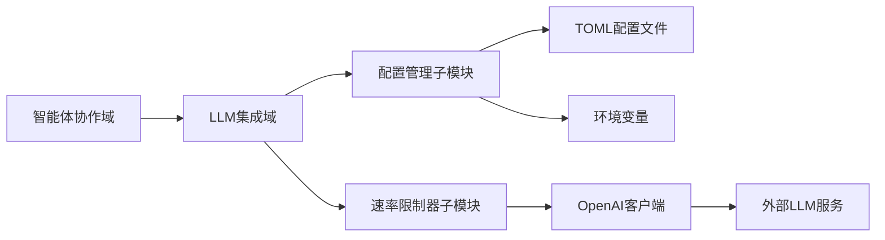
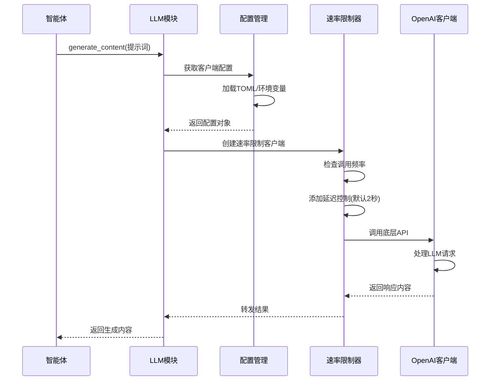

# LLM集成域技术文档

## 模块概述

LLM集成域是Cowork Forge系统的基础设施域模块，负责大语言模型的集成、配置和速率限制管理。该模块作为系统与外部LLM服务（如OpenAI API）的桥梁，为上层智能体提供稳定可靠的LLM调用能力。

### 模块定位
- **域类型**：基础设施域
- **重要性评分**：7.5/10
- **复杂度评分**：7.0/10
- **核心职责**：LLM客户端管理、配置加载、API调用速率控制

## 架构设计

### 模块组成
LLM集成域包含两个核心子模块：

#### 1. 配置管理子模块
- **代码路径**：`crates/cowork-core/src/llm/config.rs`
- **核心组件**：`ModelConfig`结构体
- **主要功能**：
  - 从TOML配置文件加载LLM配置
  - 环境变量配置管理
  - OpenAI客户端创建和初始化
  - 凭据管理和验证

#### 2. 速率限制器子模块
- **代码路径**：`crates/cowork-core/src/llm/rate_limiter.rs`
- **核心组件**：`RateLimitedLlm`包装器
- **主要功能**：
  - API调用延迟控制
  - 请求频率限制管理
  - 自定义base URL支持

### 系统交互关系



## 技术实现细节

### 配置管理实现

#### 配置结构定义
```rust
pub struct ModelConfig {
    pub api_key: String,
    pub base_url: Option<String>,
    pub model_name: String,
    pub max_tokens: Option<u32>,
    pub temperature: Option<f32>,
}
```

#### 配置加载流程
1. **优先级顺序**：环境变量 > TOML配置文件 > 默认值
2. **配置来源**：
   - TOML文件路径：`~/.config/cowork-forge/config.toml`
   - 环境变量前缀：`COWORK_LLM_`
3. **错误处理**：配置缺失或格式错误时提供明确的错误信息

### 速率限制器实现

#### 限制策略
- **默认延迟**：2秒/请求
- **频率限制**：支持<30次/分钟的限制
- **可配置性**：延迟时间可通过配置调整

#### 核心算法
```rust
pub struct RateLimiter {
    delay: Duration,
    last_call: Mutex<Option<Instant>>,
}

impl RateLimiter {
    pub async fn throttle(&self) {
        if let Some(last) = *self.last_call.lock().await {
            let elapsed = last.elapsed();
            if elapsed < self.delay {
                tokio::time::sleep(self.delay - elapsed).await;
            }
        }
        *self.last_call.lock().await = Some(Instant::now());
    }
}
```

### 客户端封装

#### LLM Trait接口
```rust
pub trait Llm: Send + Sync {
    async fn generate_content(&self, prompt: &str) -> Result<String, LlmError>;
    async fn generate_stream(&self, prompt: &str) -> Result<Receiver<String>, LlmError>;
}
```

#### 速率限制客户端
```rust
pub struct RateLimitedLlm {
    inner: OpenAIClient,
    rate_limiter: Arc<RateLimiter>,
}

impl Llm for RateLimitedLlm {
    async fn generate_content(&self, prompt: &str) -> Result<String, LlmError> {
        self.rate_limiter.throttle().await;
        self.inner.generate_content(prompt).await
    }
}
```

## 工作流程

### 标准API调用流程



### 错误处理流程
1. **配置错误**：配置缺失或格式错误时立即返回错误
2. **网络错误**：实现重试机制，最多重试3次
3. **速率限制**：自动等待并重试，避免API限制
4. **认证错误**：提供清晰的错误信息和修复建议

## 配置示例

### TOML配置文件
```toml
[llm]
api_key = "sk-xxxxxxxxxxxxxxxx"
base_url = "https://api.openai.com/v1"
model_name = "gpt-4"
max_tokens = 4000
temperature = 0.7
rate_limit_delay = 2  # 秒
```

### 环境变量配置
```bash
export COWORK_LLM_API_KEY="sk-xxxxxxxxxxxxxxxx"
export COWORK_LLM_BASE_URL="https://api.openai.com/v1"
export COWORK_LLM_MODEL_NAME="gpt-4"
export COWORK_LLM_RATE_LIMIT_DELAY="2"
```

## 性能优化

### 连接管理
- **连接池**：复用HTTP连接，减少连接建立开销
- **超时设置**：合理的请求超时和连接超时配置
- **压缩传输**：支持gzip压缩减少网络传输量

### 内存优化
- **流式处理**：支持流式响应，减少内存占用
- **对象复用**：客户端实例复用，避免重复创建

## 监控与日志

### 监控指标
- API调用成功率
- 平均响应时间
- 速率限制触发次数
- 错误类型分布

### 日志记录
- 详细的请求/响应日志（调试模式）
- 错误日志包含完整的上下文信息
- 性能指标日志用于监控和分析

## 最佳实践

### 配置管理
1. **敏感信息**：API密钥通过环境变量管理，避免硬编码
2. **配置验证**：启动时验证配置完整性
3. **热重载**：支持配置热重载，无需重启服务

### 错误处理
1. **优雅降级**：LLM服务不可用时提供备选方案
2. **重试策略**：实现指数退避重试机制
3. **熔断机制**：连续失败时暂时禁用服务

### 性能调优
1. **批处理**：支持批量请求优化性能
2. **缓存策略**：对重复请求实现结果缓存
3. **连接优化**：调整连接池参数适应不同负载

## 扩展性设计

### 多LLM提供商支持
- 抽象LLM接口，支持多种后端服务
- 插件化架构，便于添加新的LLM集成

### 自定义适配器
- 支持自定义base URL，兼容OpenAI兼容的API
- 可扩展的认证机制支持

## 总结

LLM集成域作为Cowork Forge系统的关键基础设施，通过精心的架构设计和实现，为上层智能体提供了稳定、高效、可配置的LLM服务集成能力。模块的模块化设计、完善的错误处理机制和性能优化措施，确保了系统在各种场景下的可靠运行。

该模块的成功实现为整个AI辅助开发流程提供了坚实的技术基础，是Cowork Forge系统能够实现从需求分析到代码交付全流程自动化的重要支撑。