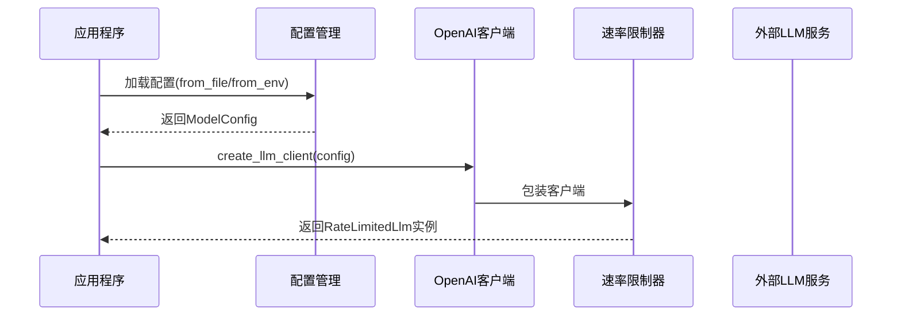

# LLM集成域技术文档

## 1. 模块概述

LLM集成域是Cowork Forge系统中负责与大语言模型服务对接的核心基础设施模块。该域通过配置管理与速率限制中间件，为上层智能体提供统一、安全、可控的LLM推理接口，确保系统在与外部LLM服务交互时的稳定性和合规性。

### 1.1 核心价值
- **统一接口**：屏蔽底层LLM API差异，提供标准化的LLM调用接口
- **稳定性保障**：通过速率限制机制防止API调用超限
- **配置驱动**：支持多种配置来源和环境适配
- **安全隔离**：严格管理API密钥和端点配置

## 2. 架构设计

### 2.1 模块结构
```
llm/
├── mod.rs          # 模块导出聚合
├── config.rs       # 配置管理与客户端创建
└── rate_limiter.rs # 速率限制中间件
```

### 2.2 核心组件关系
```mermaid
graph TD
   [应用程序] --> B[LLM配置管理]
    B --> C{配置来源}
    C -->|文件| D[解析TOML配置]
    C -->|环境变量| E[读取环境变量]
    D --> F[创建ModelConfig]
    E --> F
    F --> G[创建OpenAI客户端]
    G --> H[速率限制包装器]
    H --> I[RateLimitedLlm实例]
    I --> J[智能体调用]
```

## 3. 核心实现细节

### 3.1 配置管理 (config.rs)

#### 3.1.1 配置数据结构
```rust
/// LLM服务配置
#[derive(Debug, Clone, Serialize, Deserialize)]
pub struct LlmConfig {
    pub api_base_url: String,  // API基础端点
    pub api_key: String,       // API密钥
    pub model_name: String,    // 模型名称
}

/// 完整模型配置
#[derive(Debug, Clone, Serialize, Deserialize)]
pub struct ModelConfig {
    pub llm: LlmConfig,        // LLM配置节
}
```

#### 3.1.2 配置加载策略
- **文件配置优先**：从`config.toml`文件加载，支持完整配置结构
- **环境变量备用**：当文件不存在时，从环境变量加载关键参数
- **错误处理完善**：使用anyhow库提供详细的错误上下文信息

#### 3.1.3 客户端创建流程
```rust
pub fn create_llm_client(config: &LlmConfig) -> Result<Arc<dyn Llm>> {
    // 1. 创建OpenAI兼容配置
    let openai_config = OpenAIConfig::compatible(
        &config.api_key,
        &config.api_base_url,
        &config.model_name,
    );
    
    // 2. 实例化OpenAI客户端
    let client = OpenAIClient::new(openai_config)?;
    
    // 3. 包装速率限制器
    let rate_limited_client = RateLimitedLlm::with_default_delay(Arc::new(client));
    
    Ok(Arc::new(rate_limited_client))
}
```

### 3.2 速率限制器 (rate_limiter.rs)

#### 3.2.1 实现原理
```rust
pub struct RateLimitedLlm {
    inner: Arc<dyn Llm>,    // 底层LLM实现
    delay_ms: u64,          // 延迟时间(毫秒)
}
```

#### 3.2.2 默认配置
- **默认延迟**：2000毫秒（2秒）
- **调用限制**：确保每分钟不超过30次调用
- **异步支持**：基于tokio的异步睡眠机制

#### 3.2.3 核心方法
```rust
#[async_trait]
impl Llm for RateLimitedLlm {
    async fn generate_content(
        &self,
        req: LlmRequest,
        stream: bool,
    ) -> adk_core::Result<LlmResponseStream> {
        // 延迟等待
        sleep(Duration::from_millis(self.delay_ms)).await;
        
        // 委托给底层LLM
        self.inner.generate_content(req, stream).await
    }
}
```

## 4. 集成流程

### 4.1 初始化序列


### 4.2 API调用流程
1. **智能体发起请求** → 调用`generate_content`方法
2. **速率限制检查** → 等待指定延迟时间
3. **实际API调用** → 委托给底层OpenAI客户端
4. **响应处理** → 返回响应流给调用方

## 5. 配置示例

### 5.1 TOML配置文件
```toml
[llm]
api_base_url = "https://api.openai.com/v1"
api_key = "sk-xxxxxxxxxxxxxxxx"
model_name = "gpt-4"
```

### 5.2 环境变量配置
```bash
export LLM_API_BASE_URL="https://api.openai.com/v1"
export LLM_API_KEY="sk-xxxxxxxxxxxxxxxx"
export LLM_MODEL_NAME="gpt-4"
```

## 6. 错误处理机制

### 6.1 配置加载错误
- 文件不存在或格式错误
- 环境变量未设置
- TOML解析失败

### 6.2 客户端创建错误
- API端点连接失败
- 认证信息无效
- 模型不可用

### 6.3 速率限制错误
- 网络超时处理
- 重试机制（当前版本未实现）

## 7. 性能与优化

### 7.1 速率限制策略
- **保守设计**：采用固定的2秒延迟，确保稳定性
- **可配置性**：支持自定义延迟时间
- **异步非阻塞**：使用tokio异步睡眠，不阻塞线程

### 7.2 内存管理
- **Arc共享**：使用`Arc<dyn Llm>`实现客户端共享
- **零拷贝**：配置结构实现Clone trait，避免重复解析

## 8. 扩展性设计

### 8.1 多LLM提供商支持
当前基于adk-rust的OpenAI客户端，但架构支持扩展其他LLM提供商：

```rust
// 潜在的扩展接口
pub trait LlmProvider {
    fn create_client(config: &LlmConfig) -> Result<Arc<dyn Llm>>;
}
```

### 8.2 动态速率控制
未来可实现的智能速率控制：
- 基于响应时间的动态调整
- 错误率监控与自适应延迟
- 批量请求优化

## 9. 测试支持

### 9.1 单元测试
```rust
#[cfg(test)]
mod tests {
    #[test]
    fn test_config_parse() {
        // TOML配置解析测试
        let config: ModelConfig = toml::from_str(toml_content).unwrap();
        assert_eq!(config.llm.api_base_url, "http://localhost:8000/v1");
    }
}
```

### 9.2 集成测试准备
- 模拟API端点支持
- 配置验证工具
- 性能基准测试

## 10. 最佳实践

### 10.1 配置管理
- 优先使用文件配置，便于版本控制
- 敏感信息（API密钥）建议使用环境变量
- 为不同环境维护独立的配置文件

### 10.2 错误处理
- 在调用层捕获并记录LLM错误
- 实现适当的重试逻辑（当前版本需扩展）
- 监控API使用量和错误率

### 10.3 性能监控
- 记录API调用延迟和成功率
- 监控速率限制触发频率
- 定期评估默认延迟设置的合理性

## 总结

LLM集成域作为Cowork Forge系统的关键基础设施，通过简洁而强大的设计实现了与外部LLM服务的可靠交互。其模块化的架构、完善的配置管理和稳健的速率限制机制，为上层智能体提供了高质量的LLM服务支撑，是系统稳定运行的重要保障。随着系统演进，该域具备良好的扩展性，可支持更多的LLM提供商和更智能的速率控制策略。