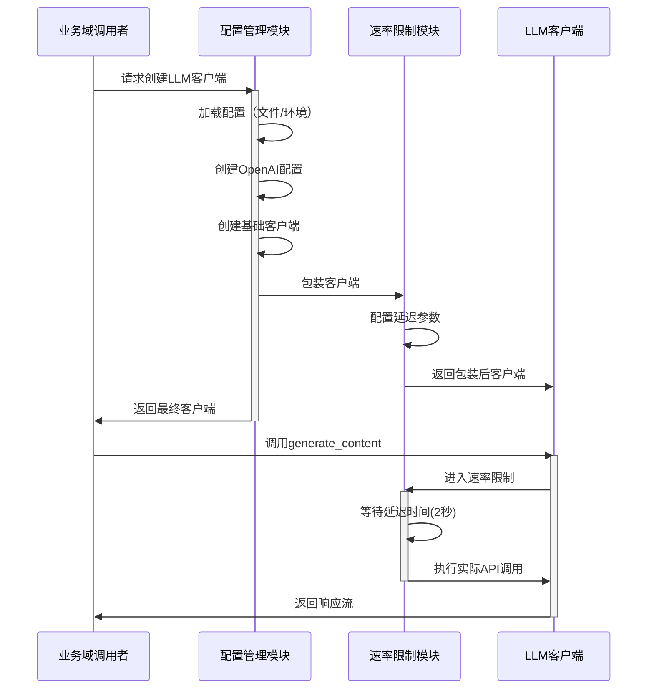

# LLM集成域技术文档

## 1. 模块概述

LLM集成域是Cowork Forge系统的核心基础设施模块，负责大语言模型的集成、配置管理和API调用优化。该模块作为系统的智能决策引擎，为其他业务域提供高质量的AI能力支持。

### 1.1 核心职责
- **模型集成**: 集成开源大语言模型服务，支持OpenAI兼容API
- **配置管理**: 统一的配置加载和环境变量管理
- **速率限制**: API调用频率控制和流量管理
- **客户端封装**: 提供标准化的LLM调用接口

### 1.2 架构定位
作为基础设施域的重要组成部分，LLM集成域位于系统底层，为上层业务域（代理管理域、指令执行层等）提供AI能力支撑。

## 2. 模块组件架构

### 2.1 整体架构图

```mermaid
graph TB
   [LLM集成域] --> B[配置管理模块 config.rs]
    A --> C[速率限制模块 rate_limiter.rs]
    
    B --> D[配置文件加载]
    B --> E[环境变量加载]
    B --> F[客户端创建]
    
    C --> G[延迟控制]
    C --> H[API调用包装]
    
    D --> I[TOML解析]
    E --> J[环境变量读取]
    F --> K[OpenAI客户端创建]
    
    G --> L[异步延迟机制]
    H --> M[LLM代理封装]
    
    K --> N[速率限制包装]
    N --> O[最终客户端实例]
```

### 2.2 核心交互流程



## 3. 配置管理模块 (config.rs)

### 3.1 核心数据结构

```rust
/// LLM配置结构体
#[derive(Debug, Clone, Serialize, Deserialize)]
pub struct LlmConfig {
    pub api_base_url: String,  // API基础URL
    pub api_key: String,       // API密钥
    pub model_name: String,    // 模型名称
}

/// 完整模型配置
#[derive(Debug, Clone, Serialize, Deserialize)]
pub struct ModelConfig {
    pub llm: LlmConfig,        // LLM配置节
}
```

### 3.2 配置加载机制

#### 3.2.1 文件配置加载
```rust
/// 从TOML文件加载配置
pub fn from_file(path: &str) -> Result<Self> {
    let content = std::fs::read_to_string(path)
        .with_context(|| format!("Failed to read config file: {}", path))?;
    let config: Self = toml::from_str(&content)
        .with_context(|| "Failed to parse config.toml")?;
    Ok(config)
}
```

#### 3.2.2 环境变量加载（备选方案）
```rust
/// 从环境变量加载配置
pub fn from_env() -> Result<Self> {
    Ok(Self {
        llm: LlmConfig {
            api_base_url: std::env::var("LLM_API_BASE_URL")?,
            api_key: std::env::var("LLM_API_KEY")?,
            model_name: std::env::var("LLM_MODEL_NAME")?,
        },
    })
}
```

### 3.3 客户端创建流程

```rust
/// 创建LLM客户端（含速率限制包装）
pub fn create_llm_client(config: &LlmConfig) -> Result<Arc<dyn Llm>> {
    // 创建OpenAI兼容配置
    let openai_config = OpenAIConfig::compatible(
        &config.api_key,
        &config.api_base_url,
        &config.model_name,
    );

    // 创建基础客户端
    let client = OpenAIClient::new(openai_config)?;

    // 包装速率限制器（默认2秒延迟）
    let rate_limited_client = RateLimitedLlm::with_default_delay(Arc::new(client));

    Ok(Arc::new(rate_limited_client))
}
```

## 4. 速率限制模块 (rate_limiter.rs)

### 4.1 核心实现

```rust
/// 速率限制LLM包装器
pub struct RateLimitedLlm {
    inner: Arc<dyn Llm>,      // 底层LLM实现
    delay_ms: u64,            // 延迟时间（毫秒）
}

impl RateLimitedLlm {
    /// 创建带默认延迟的包装器（2秒 = 每分钟30次调用）
    pub fn with_default_delay(inner: Arc<dyn Llm>) -> Self {
        Self::new(inner, 2000)
    }
}
```

### 4.2 异步延迟实现

```rust
#[async_trait]
impl Llm for RateLimitedLlm {
    async fn generate_content(
        &self,
        req: LlmRequest,
        stream: bool,
    ) -> adk_core::Result<LlmResponseStream> {
        // API调用前等待延迟时间
        sleep(Duration::from_millis(self.delay_ms)).await;
        
        // 委托给底层LLM执行实际调用
        self.inner.generate_content(req, stream).await
    }
}
```

## 5. 技术实现细节

### 5.1 依赖关系
- **adk-rust框架**: 使用adk-model的OpenAI客户端
- **异步运行时**: 基于tokio的异步延迟机制
- **配置管理**: TOML格式配置文件支持
- **错误处理**: anyhow库提供上下文错误信息

### 5.2 性能特性
- **默认速率限制**: 2秒延迟，支持每分钟30次API调用
- **异步非阻塞**: 使用tokio::sleep实现非阻塞延迟
- **内存安全**: Arc智能指针确保线程安全共享
- **零成本抽象**: Rust trait系统提供高效的多态支持

### 5.3 配置示例

#### 5.3.1 TOML配置文件格式
```toml
[llm]
api_base_url = "http://localhost:8000/v1"
api_key = "your-api-key"
model_name = "gpt-4"
```

#### 5.3.2 环境变量配置
```bash
export LLM_API_BASE_URL="http://localhost:8000/v1"
export LLM_API_KEY="your-api-key"
export LLM_MODEL_NAME="gpt-4"
```

## 6. 集成使用示例

### 6.1 基本使用流程

```rust
// 加载配置
let config = ModelConfig::from_file("config.toml")
    .or_else(|_| ModelConfig::from_env())?;

// 创建LLM客户端
let llm_client = create_llm_client(&config.llm)?;

// 使用LLM客户端
let request = LlmRequest::new("分析这个需求...");
let response = llm_client.generate_content(request, false).await?;
```

### 6.2 错误处理策略

```rust
match create_llm_client(&config.llm) {
    Ok(client) => {
        // 正常使用客户端
    }
    Err(e) => {
        eprintln!("LLM客户端创建失败: {}", e);
        // 优雅降级或重试逻辑
    }
}
```

## 7. 质量保证

### 7.1 单元测试覆盖
模块包含完整的单元测试，验证配置解析和客户端创建功能：

```rust
#[test]
fn test_config_parse() {
    let toml_content = r#"
[llm]
api_base_url = "http://localhost:8000/v1"
api_key = "test-key"
model_name = "gpt-4"
    "#;

    let config: ModelConfig = toml::from_str(toml_content).unwrap();
    assert_eq!(config.llm.api_base_url, "http://localhost:8000/v1");
    // ... 更多断言
}
```

### 7.2 容错设计
- **配置回退**: 文件配置失败时自动尝试环境变量
- **错误上下文**: 详细的错误信息和上下文
- **资源安全**: 自动资源管理和清理

## 8. 扩展性和维护性

### 8.1 扩展点
- **自定义速率限制**: 支持动态调整延迟时间
- **多模型支持**: 可扩展支持多种LLM提供商
- **监控集成**: 可添加调用统计和性能监控

### 8.2 维护指南
- **配置更新**: 修改config.toml后无需重启服务
- **版本兼容**: 保持与adk-rust框架的版本兼容性
- **日志记录**: 集成系统统一的日志框架

## 9. 总结

LLM集成域作为Cowork Forge系统的智能核心，通过精心设计的配置管理和速率限制机制，为整个系统提供了稳定可靠的AI能力支持。模块采用现代化的Rust异步编程模式，确保了高性能和高可靠性，同时保持了良好的扩展性和维护性。

该模块的成功实现为系统的其他业务域（如需求分析、架构设计、代码生成等）提供了坚实的技术基础，是Cowork Forge实现AI驱动软件开发自动化的关键支撑组件。