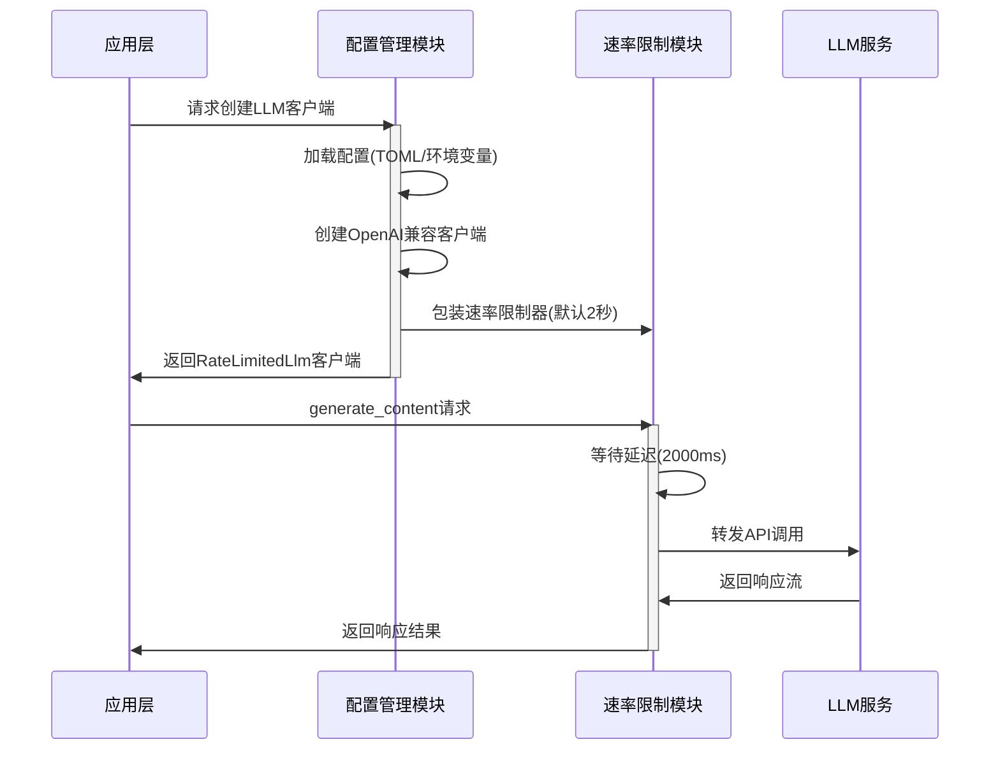

# Cowork Forge LLM集成域技术文档

## 1. 模块概述

LLM集成域是Cowork Forge系统的核心基础设施模块，负责为上层应用提供可靠的大型语言模型服务集成能力。该模块采用松耦合设计，通过配置管理和速率限制中间件，确保系统与外部LLM服务的稳定、安全交互。

### 1.1 模块定位
- **层级定位**: 基础设施层
- **核心职责**: LLM服务配置管理、API客户端创建、速率限制控制
- **依赖关系**: 作为底层基础设施，为智能体工作流域提供AI能力支持

### 1.2 设计目标
- **可靠性**: 确保API调用的稳定性和容错能力
- **可配置性**: 支持多种配置源（TOML文件、环境变量）
- **安全性**: 实现速率限制保护，防止API滥用
- **扩展性**: 支持OpenAI兼容的多种LLM服务

## 2. 架构设计

### 2.1 模块结构
```
LLM集成域
├── 配置管理模块 (config.rs)
│   ├── 配置结构定义
│   ├── 配置加载机制
│   └── 客户端创建工厂
└── 速率限制模块 (rate_limiter.rs)
    ├── 延迟控制器
    └── 包装器模式实现
```

### 2.2 核心组件交互



## 3. 配置管理模块详细设计

### 3.1 配置数据结构

```rust
[derive(Debug, Clone, Serialize, Deserialize)]
pub struct LlmConfig {
    pub api_base_url: String,  // API基础地址
    pub api_key: String,       // API密钥
    pub model_name: String,    // 模型名称
}

#[derive(Debug, Clone, Serialize, Deserialize)]
pub struct ModelConfig {
    pub llm: LlmConfig,        // LLM配置节
}
```

### 3.2 配置加载机制

模块支持两种配置加载方式，优先级为：TOML文件 > 环境变量

#### 3.2.1 TOML文件配置
```toml
[llm]
api_base_url = "http://localhost:8000/v1"
api_key = "your-api-key"
model_name = "gpt-4"
```

**实现要点**：
- 使用`toml`库进行配置解析
- 完整的错误处理上下文
- 支持相对路径和绝对路径

#### 3.2.2 环境变量配置
```bash
export LLM_API_BASE_URL="http://localhost:8000/v1"
export LLM_API_KEY="your-api-key"
export LLM_MODEL_NAME="gpt-4"
```

**实现要点**：
- 作为TOML配置的备用方案
- 适用于容器化部署环境
- 支持配置隔离和安全管理

### 3.3 客户端创建工厂

```rust
pub fn create_llm_client(config: &LlmConfig) -> Result<Arc<dyn Llm>> {
    // 创建OpenAI兼容配置
    let openai_config = OpenAIConfig::compatible(
        &config.api_key,
        &config.api_base_url,
        &config.model_name,
    );
    
    // 创建基础客户端
    let client = OpenAIClient::new(openai_config)?;
    
    // 包装速率限制器
    let rate_limited_client = RateLimitedLlm::with_default_delay(Arc::new(client));
    
    Ok(Arc::new(rate_limited_client))
}
```

**技术特点**：
- 使用`adk-rust`的OpenAI客户端作为基础
- 支持自定义OpenAI兼容端点
- 自动包装速率限制中间件
- 返回`Arc<dyn Llm>` trait对象，实现依赖倒置

## 4. 速率限制模块详细设计

### 4.1 核心数据结构

```rust
pub struct RateLimitedLlm {
    inner: Arc<dyn Llm>,    // 底层LLM实现
    delay_ms: u64,          // 延迟时间(毫秒)
}
```

### 4.2 速率限制策略

#### 4.2.1 默认策略
- **延迟时间**: 2000毫秒（2秒）
- **调用频率**: ≤30次/分钟
- **设计依据**: 满足大多数LLM服务的速率限制要求

#### 4.2.2 自定义策略
支持通过构造函数自定义延迟时间：
```rust
// 自定义1秒延迟
RateLimitedLlm::new(client, 1000)

// 使用默认2秒延迟  
RateLimitedLlm::with_default_delay(client)
```

### 4.3 异步实现机制

```rust
#[async_trait]
impl Llm for RateLimitedLlm {
    async fn generate_content(
        &self,
        req: LlmRequest,
        stream: bool,
    ) -> adk_core::Result<LlmResponseStream> {
        // 等待延迟
        sleep(Duration::from_millis(self.delay_ms)).await;
        
        // 委托给底层LLM
        self.inner.generate_content(req, stream).await
    }
}
```

**技术实现**：
- 使用`async_trait`宏支持异步trait
- 采用`tokio::time::sleep`实现异步延迟
- 保持与底层LLM一致的API接口

## 5. 错误处理机制

### 5.1 配置加载错误
```rust
use anyhow::{Context, Result};

// 文件读取错误
.with_context(|| format!("Failed to read config file: {}", path))

// 配置解析错误  
.with_context(|| "Failed to parse config.toml")

// 环境变量缺失错误
.with_context(|| "LLM_API_BASE_URL not set")
```

### 5.2 客户端创建错误
```rust
// OpenAI客户端创建失败
.with_context(|| "Failed to create OpenAI client")
```

### 5.3 错误处理策略
- **上下文信息**: 提供详细的错误上下文
- **错误传播**: 使用`?`操作符进行错误传播
- **类型安全**: 使用`Result<T>`类型确保错误处理

## 6. 性能与优化

### 6.1 资源管理
- **智能指针**: 使用`Arc`实现共享所有权，避免重复创建客户端
- **连接复用**: 底层OpenAI客户端支持连接池和复用
- **内存优化**: 配置对象实现`Clone` trait，支持轻量级复制

### 6.2 速率限制优化
- **异步非阻塞**: 使用异步sleep，不阻塞线程
- **精确控制**: 毫秒级延迟控制精度
- **可调节性**: 支持根据服务商要求调整延迟时间

## 7. 测试策略

### 7.1 单元测试
```rust
#[cfg(test)]
mod tests {
    #[test]
    fn test_config_parse() {
        // TOML配置解析测试
        let config: ModelConfig = toml::from_str(toml_content).unwrap();
        assert_eq!(config.llm.api_base_url, "http://localhost:8000/v1");
    }
}
```

### 7.2 集成测试要点
- 配置加载功能验证
- 客户端创建流程测试
- 速率限制效果验证
- 错误处理场景测试

## 8. 部署与配置

### 8.1 典型配置方案

#### 8.1.1 开发环境配置
```toml
# config.toml
[llm]
api_base_url = "http://localhost:8000/v1"
api_key = "dev-api-key"
model_name = "gpt-3.5-turbo"
```

#### 8.1.2 生产环境配置
```bash
# 环境变量方式
LLM_API_BASE_URL="https://api.openai.com/v1"
LLM_API_KEY="prod-api-key"
LLM_MODEL_NAME="gpt-4"
```

### 8.2 安全考虑
- API密钥通过配置文件或环境变量管理
- 支持HTTPS加密通信
- 速率限制防止API滥用
- 错误信息脱敏处理

## 9. 扩展性设计

### 9.1 多LLM提供商支持
当前架构已支持OpenAI兼容接口，可轻松扩展支持：
- Azure OpenAI服务
- 本地部署的LLM服务
- 其他云服务商的LLM API

### 9.2 高级功能扩展
- **动态速率限制**: 根据服务响应动态调整延迟
- **熔断机制**: 在服务不可用时自动降级
- **负载均衡**: 支持多个LLM端点负载均衡
- **缓存策略**: 实现响应缓存提升性能

## 10. 总结

LLM集成域作为Cowork Forge系统的关键基础设施，通过模块化设计和稳健的实现，为上层智能体工作流提供了可靠的AI能力支持。其配置灵活性、速率控制能力和错误处理机制，确保了系统在与外部LLM服务交互时的稳定性和安全性。

该模块的设计体现了现代Rust系统编程的最佳实践，包括类型安全、异步编程、错误处理和测试驱动开发，为系统的长期维护和扩展奠定了坚实基础。