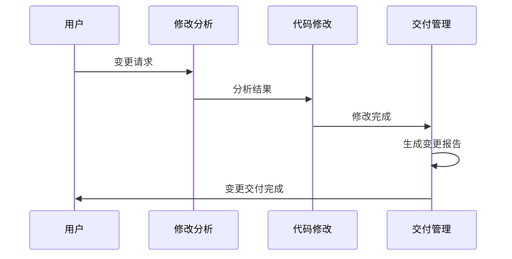

# Cowork Forge 交付管理域技术文档

## 1. 模块概述

### 1.1 定位与职责
交付管理域是Cowork Forge系统软件开发生命周期的最终阶段，负责项目交付验证、报告生成和变更文档化。作为系统的"守门人"，该模块确保只有真正完成的项目才能进入交付阶段，防止虚假完成状态。

### 1.2 核心功能
- **项目完整性验证**：通过代码文件存在性检查确保项目真正完成
- **交付报告生成**：自动化生成完整的项目交付文档
- **变更报告管理**：处理增量修改后的变更报告生成
- **工件管理**：统一管理PRD、设计文档等交付工件

## 2. 架构设计

### 2.1 模块组成
```
交付管理域
├── 交付代理模块 (delivery.rs)
├── 修改交付模块 (modify_delivery.rs)
└── 工件工具层 (artifact_tools.rs)
```

### 2.2 数据流架构
```mermaid
graph TB
   [项目完成请求] --> B{完整性验证}
    B -->|通过| C[加载项目数据]
    B -->|失败| D[输出警告信息]
    
    C --> E[生成交付报告]
    E --> F[保存交付工件]
    F --> G[流程结束]
    
    H[变更请求] --> I[修改交付代理]
    I --> J[分析变更范围]
    J --> K[生成变更报告]
    K --> L[保存变更记录]
```

## 3. 核心实现细节

### 3.1 交付代理指令系统
交付代理采用严格的预检查机制，确保项目真实完成：

```rust
// 关键验证逻辑
pub const DELIVERY_AGENT_INSTRUCTION: &str = r#"
# ⚠️ CRITICAL RULE - READ FIRST ⚠️
**This is the FINAL agent. But ONLY generate report if project is TRULY complete!**

# CRITICAL Pre-Check (DO THIS FIRST!)
**Before generating the report, you MUST verify the project is complete:**

1. Call `get_plan()` to check task status
2. **CRITICAL**: Use `list_files(".")` to verify actual code files exist
3. **If NO code files exist**:
   - DO NOT generate delivery report
   - Output: "❌ Project incomplete: No code files found."
   - STOP immediately
"#;
```

### 3.2 完整性验证策略
交付管理域采用双重验证机制：
1. **任务状态验证**：通过`get_plan()`检查所有任务是否标记为完成
2. **实际文件验证**：通过`list_files(".")`验证实际代码文件存在性

这种设计有效防止了"任务标记完成但实际代码缺失"的虚假完成状态。

### 3.3 修改交付机制
修改交付模块专门处理增量变更场景：

```rust
pub const MODIFY_DELIVERY_INSTRUCTION: &str = r#"
# Role: Modify Delivery Agent
You are a **Modify Delivery Agent** responsible for generating a comprehensive change report after incremental modifications.

## Your Task
Given:
1. **ChangeRequest**: What was requested
2. **Patch Metadata**: What files were actually changed
3. **Base Session**: Original project state
4. **Current Session**: Updated project state
"#;
```

## 4. 工具层实现

### 4.1 工件操作工具
工件工具层提供会话范围的交付文档管理：

```rust
// 交付报告保存工具
pub struct SaveDeliveryReportTool {
    session_id: String,
}

#[async_trait]
impl Tool for SaveDeliveryReportTool {
    fn name(&self) -> &str {
        "save_delivery_report"
    }
    
    async fn execute(&self, _ctx: Arc<dyn ToolContext>, args: Value) -> adk_core::Result<Value> {
        let content = args["content"].as_str()
            .or_else(|| args[" content"].as_str()) // 处理LLM键名空格问题
            .ok_or_else(|| adk_core::AdkError::Tool("Missing 'content' parameter".to_string()))?;
        
        save_delivery_report(&self.session_id, content)
            .map_err(|e| adk_core::AdkError::Tool(e.to_string()))?;

        Ok(json!({
            "status": "success",
            "message": "Delivery report saved successfully"
        }))
    }
}
```

### 4.2 支持的工件类型
- **交付报告** (`save_delivery_report`)：完整的项目交付文档
- **PRD文档** (`save_prd_doc`)：产品需求文档
- **设计文档** (`save_design_doc`)：系统架构设计文档
- **反馈历史** (`load_feedback_history`)：开发过程中的反馈记录

## 5. 交付报告格式规范

### 5.1 标准交付报告结构
```markdown
# Delivery Report

## Project Summary
[项目概述]

## Requirements (X total)
- REQ-001: [标题] ✅
- REQ-002: [标题] ✅

## Features (X total)
- FEAT-001: [功能名称] - [描述] ✅
- FEAT-002: [功能名称] - [描述] ✅

## Architecture
- 组件1: [技术栈]
- 组件2: [技术栈]

## Tasks Completed
总计: X个任务
状态: 全部完成

## Project Files Generated
- index.html
- style.css
- script.js
[列出所有生成的文件]

## Quality Checks
- 构建: ✅ 通过
- 测试: ✅ 通过（纯前端项目为N/A）
- 代码规范: ✅ 通过（纯前端项目为N/A）

## Getting Started
```bash
# 如何运行项目
```

## Next Steps
[用户的后续步骤]
```

### 5.2 变更报告格式
变更报告采用类Pull Request的描述格式：
```markdown
# Change Report: [简要标题]

## Summary
变更的简要描述。

## Change Details
### User Request
[用户的原始变更请求]

### Implementation
- **新增文件**: 新文件列表
- **修改文件**: 修改文件列表
- **删除文件**: 删除文件列表

### Scope Analysis
- PRD更新: 是/否
- 设计更新: 是/否
- 计划更新: 是/否
- 代码变更: 是/否
```

## 6. 业务流程集成

### 6.1 主工作流集成
交付管理域作为软件开发流程的最终环节：
```
新项目开发流程:
创意采集 → 需求分析 → 架构设计 → 实现规划 → 编码实施 → 质量检查 → [交付管理]
```

### 6.2 变更工作流集成


## 7. 错误处理与容错机制

### 7.1 完整性检查失败处理
当项目完整性验证失败时，交付代理会：
1. 立即停止报告生成流程
2. 输出明确的警告信息
3. 避免生成虚假的交付报告

### 7.2 异常场景处理
- **文件不存在**：输出具体警告，指导用户检查实现状态
- **数据加载失败**：提供清晰的错误信息，建议重新运行前置阶段
- **存储操作失败**：保持事务完整性，避免部分保存状态

## 8. 会话管理与状态持久化

### 8.1 会话范围工件管理
所有交付工件都与会话ID关联，确保：
- 多会话环境下的数据隔离
- 交付历史的完整追溯
- 变更报告的版本管理

### 8.2 状态恢复支持
交付管理域支持从任意阶段重新开始工作流：
- 完整的交付状态序列化
- 增量变更的精确跟踪
- 反馈历史的完整加载

## 9. 技术特点与优势

### 9.1 质量控制优势
1. **双重验证机制**：任务状态 + 实际文件的完整性检查
2. **防虚假完成**：严格的预检查防止过早交付
3. **标准化输出**：统一的报告格式确保交付质量

### 9.2 工程化价值
1. **自动化文档**：减少手动文档编写工作量
2. **变更追踪**：完整的修改历史记录
3. **团队协作**：标准化的交付流程支持团队协作

## 10. 使用指南

### 10.1 标准交付流程
1. 确保所有开发阶段已完成
2. 验证实际代码文件存在
3. 运行交付代理生成报告
4. 审核交付报告内容
5. 完成项目交付

### 10.2 变更交付流程
1. 提交变更请求
2. 系统分析变更范围
3. 实施代码修改
4. 生成变更报告
5. 完成变更交付

交付管理域作为Cowork Forge系统的最终质量保证环节，通过严格的完整性验证和标准化的报告生成，确保了软件项目的真实完成状态和高质量的交付文档。