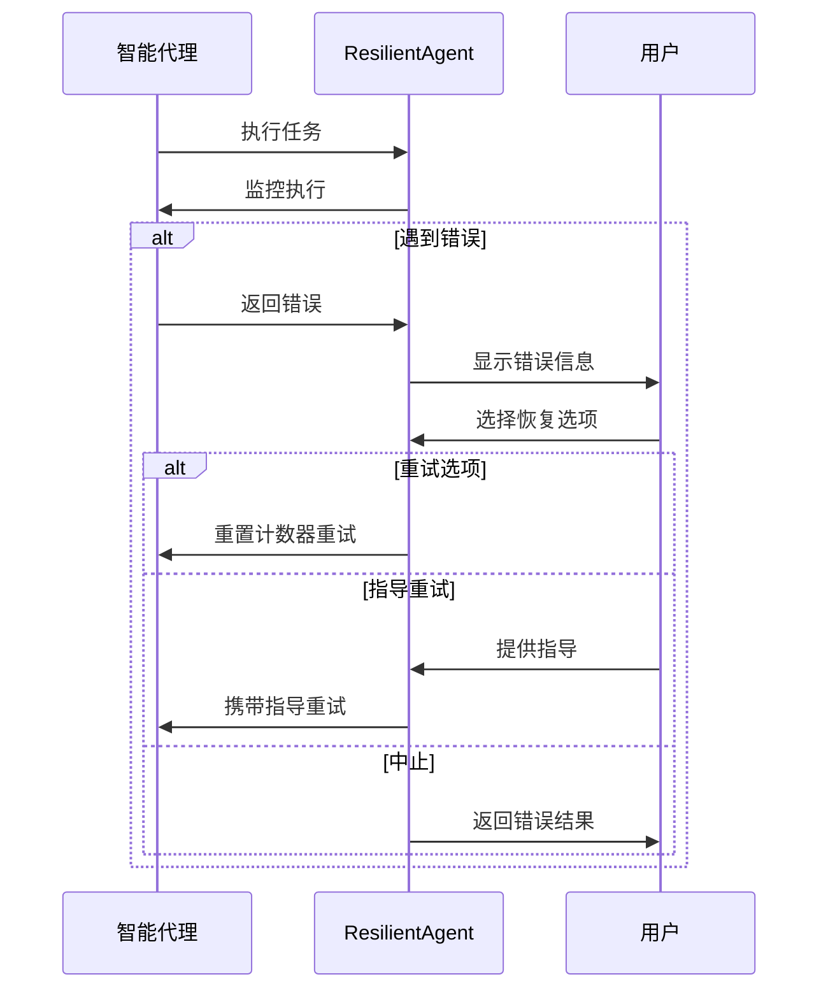

# 代理管理域技术文档

## 1. 概述

代理管理域是Cowork Forge系统的核心组件，负责智能代理的创建、生命周期管理和错误恢复。该模块采用工厂模式和Actor-Critic循环机制，为软件开发流程的各个阶段提供智能决策支持。

## 2. 核心架构

### 2.1 模块组成

代理管理域包含三个核心子模块：

#### 2.1.1 代理工厂模块 (`agents/mod.rs`)
- **职责**: 代理实例的创建和管理
- **实现**: 使用`LlmAgentBuilder`构建不同类型的智能代理
- **特性**: 支持单代理和循环代理两种模式

#### 2.1.2 HITL恢复模块 (`agents/hitl.rs`)
- **职责**: 错误拦截和人类参与循环机制
- **实现**: 通过`ResilientAgent`包装提供容错能力
- **特性**: 支持用户干预和指导重试

#### 2.1.3 指令管理模块 (`instructions/mod.rs`)
- **职责**: 指令模板聚合和统一访问
- **实现**: 提供10种标准化指令模块
- **特性**: 模块化组织和可扩展性

### 2.2 架构特点

```mermaid
graph TB
   [代理工厂] --> B[单代理模式]
    A --> C[循环代理模式]
    
    B --> D[IdeaAgent]
    B --> E[CheckAgent]  
    B --> F[DeliveryAgent]
    
    C --> G[PRD Loop]
    C --> H[Design Loop]
    C --> I[Plan Loop]
    C --> J[Coding Loop]
    
    G --> G1[PRD Actor]
    G --> G2[PRD Critic]
    
    K[HITL恢复] --> L[错误拦截]
    L --> M[用户干预]
    M --> N[恢复策略]
    
    O[指令管理] --> P[指令聚合]
    P --> Q[统一接口]
```

## 3. 核心实现机制

### 3.1 代理创建模式

#### 3.1.1 单代理模式
用于简单的单次任务执行，如创意采集、质量检查和交付报告生成：

```rust
pub fn create_idea_agent(model: Arc<dyn Llm>, session_id: &str) -> Result<Arc<dyn adk_core::Agent>> {
    LlmAgentBuilder::new("idea_agent")
        .instruction(IDEA_AGENT_INSTRUCTION)
        .model(model)
        .tool(Arc::new(SaveIdeaTool::new(session_id.to_string())))
        .tool(Arc::new(LoadIdeaTool::new(session_id.to_string())))
        .tool(Arc::new(ReviewAndEditContentTool))
        .include_contents(IncludeContents::None)
        .build()
}
```

#### 3.1.2 循环代理模式 (Actor-Critic)
用于需要迭代改进的复杂任务，如PRD生成、架构设计等：

```rust
pub fn create_prd_loop(model: Arc<dyn Llm>, session_id: &str) -> Result<Arc<dyn adk_core::Agent>> {
    let prd_actor = LlmAgentBuilder::new("prd_actor").build()?;
    let prd_critic = LlmAgentBuilder::new("prd_critic").build()?;
    
    let mut loop_agent = LoopAgent::new("prd_loop", vec![Arc::new(prd_actor), Arc::new(prd_critic)]);
    loop_agent = loop_agent.with_max_iterations(3);
    
    Ok(Arc::new(ResilientAgent::new(Arc::new(loop_agent))))
}
```

### 3.2 关键问题解决

#### 3.2.1 LoopAgent终止问题
- **问题**: `SequentialAgent`在`LoopAgent`调用`exit_loop()`时会意外终止
- **解决方案**: 使用`max_iterations`替代`exit_loop`工具，让循环自然结束
- **实现**: 设置最大迭代次数(3-5次)，避免无限循环

#### 3.2.2 错误恢复机制
通过`ResilientAgent`实现三层错误处理：

```rust
pub struct ResilientAgent {
    inner: Arc<dyn Agent>,
    subs: Vec<Arc<dyn Agent>>,
}
```

## 4. 代理类型详解

### 4.1 单代理类型

| 代理名称 | 职责 | 关键工具 | 迭代次数 |
|---------|------|----------|----------|
| IdeaAgent | 创意采集和结构化 | SaveIdeaTool, LoadIdeaTool | 单次 |
| CheckAgent | 质量保证 | CheckDataFormatTool, CheckFeatureCoverageTool | 单次 |
| DeliveryAgent | 交付报告生成 | SaveDeliveryReportTool, LoadFeedbackHistoryTool | 单次 |

### 4.2 循环代理类型

| 循环名称 | Actor职责 | Critic职责 | 最大迭代 |
|---------|-----------|------------|----------|
| PRD Loop | PRD文档生成 | 需求验证 | 3次 |
| Design Loop | 架构设计 | 设计评审 | 3次 |
| Plan Loop | 任务规划 | 计划验证 | 3次 |
| Coding Loop | 代码实现 | 代码评审 | 5次 |

## 5. HITL错误恢复机制

### 5.1 恢复流程



### 5.2 恢复策略

1. **重试执行**: 重置迭代计数器，重新执行代理
2. **指导重试**: 用户提供指导信息后重试
3. **中止执行**: 终止当前任务，返回错误结果

## 6. 指令系统架构

### 6.1 指令模板管理

系统包含10种标准化指令模板，涵盖所有开发阶段：

- `IDEA_AGENT_INSTRUCTION`: 创意采集指令
- `PRD_ACTOR_INSTRUCTION`/`PRD_CRITIC_INSTRUCTION`: PRD生成和验证指令
- `DESIGN_ACTOR_INSTRUCTION`/`DESIGN_CRITIC_INSTRUCTION`: 设计指令
- `PLAN_ACTOR_INSTRUCTION`/`PLAN_CRITIC_INSTRUCTION`: 规划指令
- `CODING_ACTOR_INSTRUCTION`/`CODING_CRITIC_INSTRUCTION`: 编码指令
- `CHECK_AGENT_INSTRUCTION`: 检查指令
- `DELIVERY_AGENT_INSTRUCTION`: 交付指令

### 6.2 工具集成

每个代理都配置了特定的工具集，支持：
- 文件操作 (`ReadFileTool`, `WriteFileTool`, `ListFilesTool`)
- 命令执行 (`RunCommandTool`)
- 数据验证 (`CheckDataFormatTool`, `CheckFeatureCoverageTool`)
- 会话管理 (`SaveIdeaTool`, `GetRequirementsTool`)

## 7. 性能优化策略

### 7.1 迭代控制
- PRD/Design/Plan循环: 最大3次迭代
- Coding循环: 最大5次迭代（代码实现更复杂）
- 通过`max_iterations`防止无限循环

### 7.2 内存管理
- 使用`Arc`进行智能指针管理
- 代理实例的共享和复用
- 会话级别的资源隔离

### 7.3 错误处理优化
- 异步错误拦截机制
- 非阻塞的用户交互
- 优雅的降级处理

## 8. 集成关系

### 8.1 与编排管理域的关系
- 代理管理域为编排管理域提供代理实例
- 支持工作流管道的动态组装
- 提供阶段跳转和流程恢复能力

### 8.2 与业务域的关系
- 通过指令系统调用各业务域功能
- 为需求、设计、规划、编码、交付域提供智能代理支持
- 支持跨域协作和数据流转

### 8.3 与LLM集成域的关系
- 依赖LLM集成域提供模型服务
- 通过`LlmAgentBuilder`集成大语言模型能力
- 支持模型配置和API调用优化

## 9. 技术优势

1. **模块化设计**: 清晰的代理类型分离和职责划分
2. **容错性强**: 多层错误恢复机制确保系统稳定性
3. **扩展性好**: 支持新代理类型的快速集成
4. **用户体验佳**: HITL机制提供灵活的人工干预能力
5. **性能优化**: 合理的迭代控制和资源管理策略

## 10. 总结

代理管理域是Cowork Forge系统的智能核心，通过创新的Actor-Critic循环模式和HITL错误恢复机制，成功实现了AI自动化与人类专家监督的有机结合。该模块的设计体现了现代软件工程的最佳实践，为软件开发团队提供了高效、可靠的智能决策支持能力。