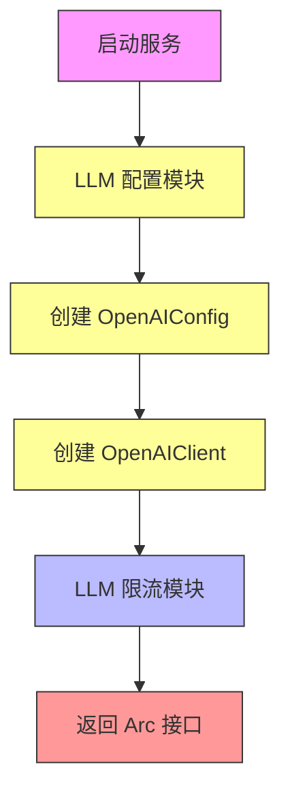
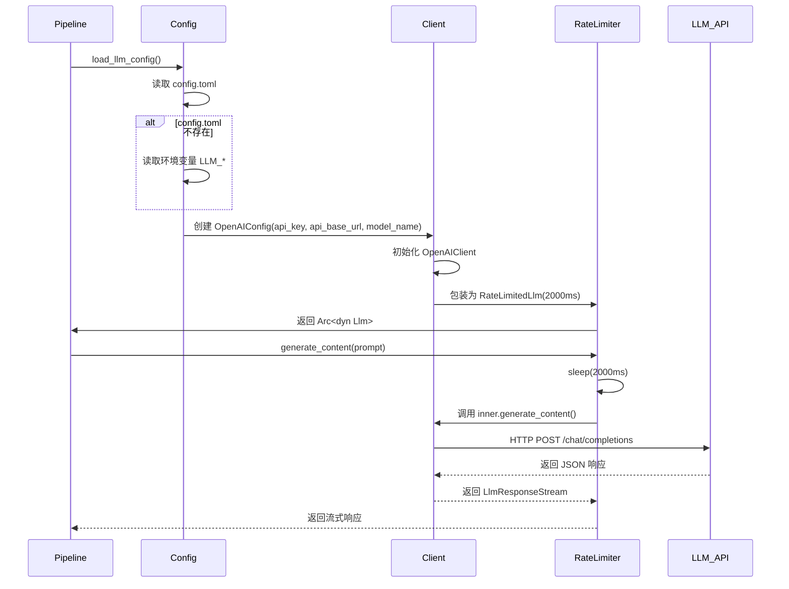

# 大语言模型集成层技术文档

## 概述

大语言模型集成层（Large Language Model Integration Layer）是 Cowork Forge 系统的核心基础设施之一，负责封装与外部大语言模型（LLM）服务的交互逻辑，为智能体编排层提供统一、稳定、合规的推理能力接口。该层采用“配置管理 + 限流控制”的双重设计，实现了对 OpenAI 兼容 API 的灵活接入与安全调用，屏蔽了底层 API 差异，确保系统在多环境部署中的一致性与高可用性。

作为基础设施层（Infrastructure Domain）的关键组件，大语言模型集成层不包含任何业务逻辑，其核心价值在于为上层智能体提供“可信赖的智能大脑”。该层通过标准化的 `Llm` trait 接口，使智能体无需关心 API 调用细节，只需关注提示词（Prompt）设计与输出解析，极大提升了系统的可维护性与扩展性。

## 架构设计

大语言模型集成层采用模块化分层架构，由两个核心子模块构成，形成“配置加载 → 客户端创建 → 限流包装”的完整调用链路：



### 1. LLM 配置模块

**职责**：从多种来源加载 LLM 服务的连接参数，构建标准化的客户端配置对象。

**核心实现**：
- **配置结构体**：定义 `LlmConfig` 与 `ModelConfig` 两个结构体，分别表示 LLM 服务参数与整体模型配置。
  ```rust
  #[derive(Debug, Clone, Serialize, Deserialize)]
  pub struct LlmConfig {
      pub api_base_url: String,  // API 基础地址，支持自定义端点
      pub api_key: String,       // 认证密钥
      pub model_name: String,    // 模型标识，如 "gpt-4", "claude-3"
  }
  ```

- **多源加载机制**：
  - **首选配置文件**：从项目根目录的 `config.toml` 文件加载配置，支持结构化配置，便于版本管理。
    ```toml
    [llm]
    api_base_url = "https://api.openai.com/v1"
    api_key = "sk-xxxxxxxx"
    model_name = "gpt-4-turbo"
    ```
  - **环境变量后备**：当 `config.toml` 不存在或解析失败时，自动回退至环境变量 `LLM_API_BASE_URL`、`LLM_API_KEY`、`LLM_MODEL_NAME`，支持 Docker、Kubernetes 等云原生部署。
  - **错误处理**：使用 `anyhow` 库提供完整的错误上下文，确保配置加载失败时能清晰定位问题（如“LLM_API_KEY not set”）。

- **客户端创建**：`create_llm_client()` 函数接收 `LlmConfig`，使用 `adk-model` 提供的 `OpenAIConfig::compatible()` 方法创建兼容自定义端点的客户端，并自动包装为限流版本。

**设计优势**：
- **高灵活性**：支持调用 OpenAI 官方服务、本地部署的 Ollama、vLLM、或任何兼容 OpenAI API 的第三方服务（如阿里云通义千问、腾讯云混元）。
- **零侵入性**：上层智能体仅依赖 `Arc<dyn Llm>` 接口，无需感知底层是 OpenAI 还是其他服务商。
- **可测试性**：提供完整的单元测试，验证 TOML 解析逻辑，确保配置可靠性。

### 2. LLM 限流模块

**职责**：在所有 LLM 请求前插入延迟，确保调用频率符合服务提供商的配额限制，防止因超限被封禁。

**核心实现**：
- **限流包装器**：`RateLimitedLlm` 结构体包装任意 `Llm` 实现，重写 `generate_content()` 方法，在调用前执行异步延迟。
  ```rust
  #[async_trait]
  impl Llm for RateLimitedLlm {
      async fn generate_content(
          &self,
          req: LlmRequest,
          stream: bool,
      ) -> adk_core::Result<LlmResponseStream> {
          // 关键限流逻辑：等待指定毫秒数
          sleep(Duration::from_millis(self.delay_ms)).await;
          
          // 委托真实调用
          self.inner.generate_content(req, stream).await
      }
  }
  ```

- **默认延迟策略**：采用 **2000 毫秒（2秒）** 的固定延迟，确保每分钟调用不超过 30 次（60s / 2s = 30），符合 OpenAI 免费版与多数商用 API 的速率限制（<30 RPM）。
- **默认构造器**：提供 `with_default_delay()` 静态方法，简化使用，避免手动传参。
- **无状态设计**：限流器不维护请求计数器，采用“固定间隔”策略，实现简单、可靠、无并发竞争问题。

**设计优势**：
- **稳定性保障**：从根本上避免因高频调用导致的服务中断，提升系统鲁棒性。
- **低复杂度**：相比令牌桶或漏桶算法，固定延迟策略实现简单，无状态，易于调试与维护。
- **可配置性**：虽当前为固定 2 秒，但结构体设计支持未来扩展为动态限流（如根据响应头动态调整）。

## 核心交互流程

大语言模型集成层的完整调用流程如下：



1. **启动阶段**：智能体编排层调用 `create_llm_client()`。
2. **配置加载**：`load_llm_config()` 优先从 `config.toml` 加载，失败则从环境变量获取。
3. **客户端创建**：使用 `adk-model` 的 `OpenAIConfig::compatible()` 创建支持自定义端点的客户端。
4. **限流包装**：将客户端包装为 `RateLimitedLlm`，注入 2 秒延迟。
5. **智能体调用**：智能体通过 `Arc<dyn Llm>` 接口发起 `generate_content()` 请求。
6. **限流执行**：`RateLimitedLlm` 在调用前等待 2 秒，再将请求转发给底层客户端。
7. **API 调用**：底层客户端通过 HTTP 请求与 LLM 服务通信，返回生成内容。

## 技术实现细节

- **依赖库**：
  - `serde`：用于配置结构体的序列化与反序列化。
  - `toml`：解析 `config.toml` 配置文件。
  - `std::env`：读取环境变量。
  - `adk-model`：提供 `OpenAIConfig` 与 `OpenAIClient` 的标准实现。
  - `adk-core`：定义 `Llm` trait 与 `LlmRequest`/`LlmResponseStream` 接口契约。
  - `tokio`：实现异步延迟（`sleep`）。
  - `anyhow`：提供优雅的错误处理与上下文追踪。

- **接口契约**：
  所有 LLM 实现必须遵循 `adk-core::Llm` trait，定义如下核心方法：
  ```rust
  pub trait Llm: Send + Sync {
      fn name(&self) -> &str; // 返回模型名称，用于日志与监控
      async fn generate_content(&self, req: LlmRequest, stream: bool) -> Result<LlmResponseStream>;
  }
  ```
  该接口支持同步与流式响应，满足不同场景需求（如生成长文档时使用流式以降低内存占用）。

- **安全与健壮性**：
  - **路径安全**：配置文件读取使用 `std::fs::read_to_string`，无路径注入风险。
  - **密钥保护**：API Key 通过环境变量注入，避免硬编码，符合安全最佳实践。
  - **错误隔离**：任何 LLM 调用失败（网络超时、认证失败）均通过 `anyhow::Error` 上下文返回，不影响主流程，可由上层智能体进行重试或降级处理。

## 配置示例与部署指南

### 本地开发环境（使用 Ollama）

```toml
[llm]
api_base_url = "http://localhost:11434/v1"
api_key = "no-key-needed"  # Ollama 不需要 API Key
model_name = "llama3:8b"
```

### 云环境部署（Docker）

```bash
# 启动容器时注入环境变量
docker run -e LLM_API_BASE_URL="https://api.openai.com/v1" \
           -e LLM_API_KEY="sk-xxxxxxxx" \
           -e LLM_MODEL_NAME="gpt-4o" \
           cowork-forge
```

### 企业私有化部署（使用 vLLM）

```toml
[llm]
api_base_url = "http://llm-server.internal:8000/v1"
api_key = "your-enterprise-token"
model_name = "meta-llama/Meta-Llama-3-70B-Instruct"
```

## 优势与价值

| 维度 | 价值说明 |
|------|----------|
| **可移植性** | 支持任意 OpenAI 兼容 API，轻松切换本地/云端/私有模型，无需修改业务代码。 |
| **稳定性** | 2秒限流机制有效规避服务配额限制，保障 7×24 小时稳定运行。 |
| **可维护性** | 配置与逻辑分离，修改模型或 API 地址仅需更新配置文件，无需重新编译。 |
| **扩展性** | 新增其他 LLM 服务商（如 Anthropic、Google Gemini）只需实现 `Llm` trait，无需重构。 |
| **安全性** | 密钥不硬编码，支持环境变量注入，符合企业安全审计要求。 |

## 总结

大语言模型集成层是 Cowork Forge 实现“AI 原生开发”的基石。它通过简洁而严谨的设计，将复杂的 LLM 服务调用抽象为一个稳定、安全、可配置的接口，使智能体编排层能够专注于“如何思考”，而非“如何调用”。其“配置即代码”、“限流即默认”的设计理念，体现了系统轻量、可靠、可移植的核心工程哲学，为未来支持多模型路由、负载均衡、A/B 测试等高级功能奠定了坚实基础。