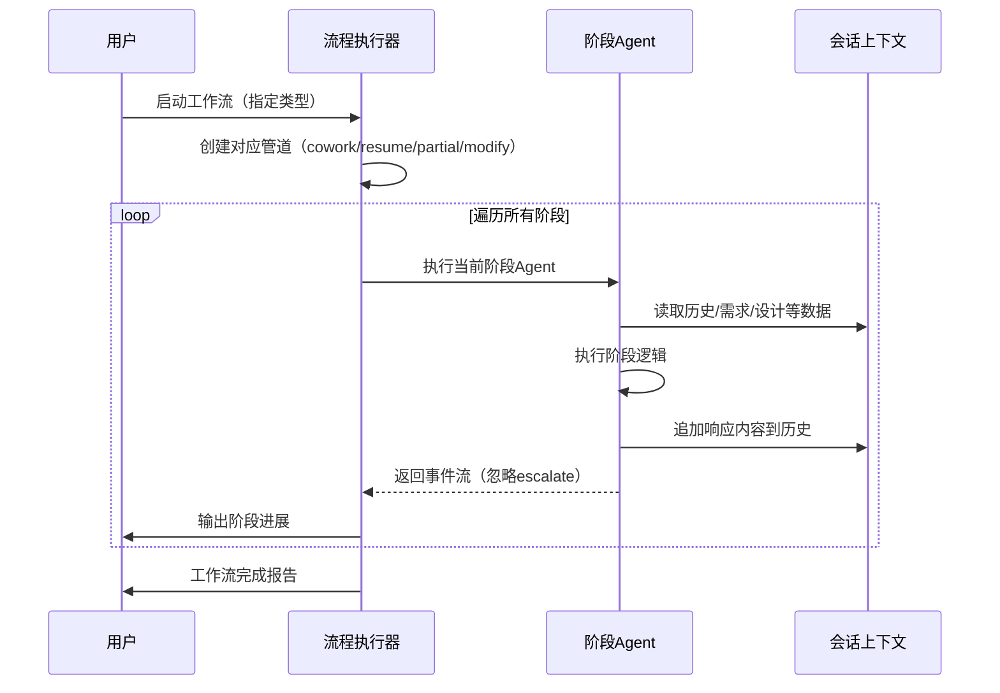
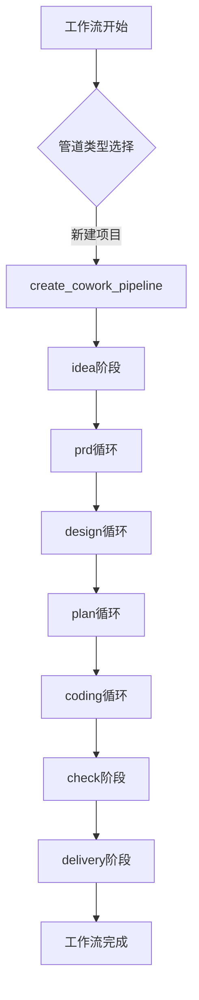
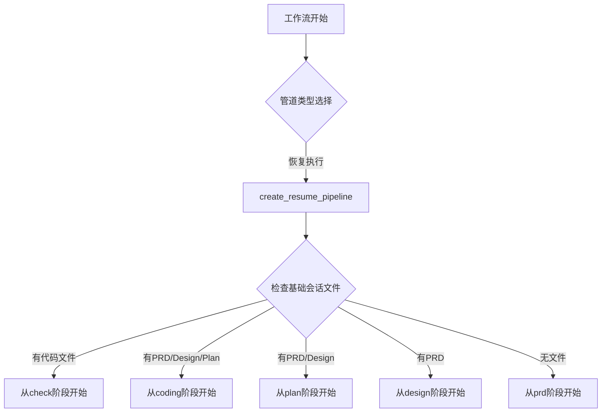
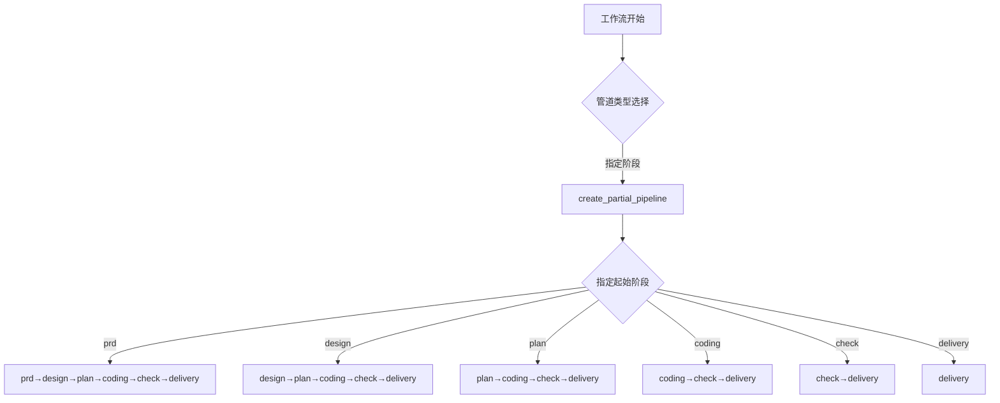
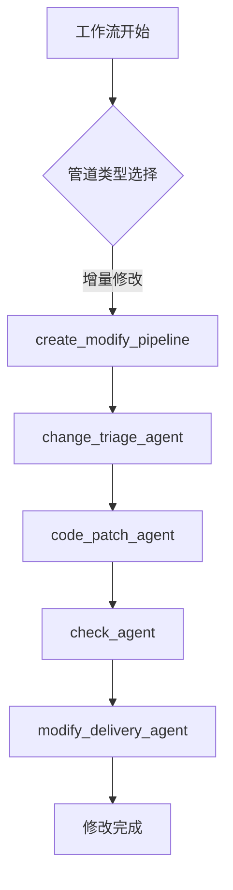

# 工作流引擎域技术文档

## 1. 概述

工作流引擎域是 Cowork Forge 系统的核心业务域，负责协调和管理整个 AI 辅助开发工作流的执行。该模块通过流程编排、阶段管理和异常处理机制，实现从项目创意到代码交付的自动化流程。基于 Rust 异步编程模型构建，采用模块化设计，支持完整执行、智能恢复、部分执行和增量修改四种工作流模式。

## 2. 模块功能

### 2.1 核心职责
- **流程编排**：按顺序执行工作流阶段，管理智能体的执行顺序和状态隔离
- **阶段管理**：支持阶段的启动、暂停、恢复和跳转操作
- **异常处理**：通过隔离机制处理阶段内错误，避免工作流整体终止
- **会话管理**：与数据存储域交互，实现工作流状态的持久化和恢复

### 2.2 子模块组成
| 子模块名称 | 代码路径 | 主要功能 | 重要性 |
|---------|---------|---------|--------|
| 流程执行器 | `crates/cowork-core/src/pipeline/mod.rs` | 工作流阶段执行和状态管理 | 10.0 |
| 阶段管理器 | `crates/cowork-core/src/tools/goto_stage_tool.rs` | 阶段切换和跳转控制 | 8.0 |

## 3. 技术实现

### 3.1 核心数据结构
```rust
// StageExecutor 结构体定义
pub struct StageExecutor {
    name: String,                    // 执行器名称
    stages: Vec<(String, Arc<dyn Agent>)>, // 阶段列表（阶段名，智能体实例）
}

// 管道构造函数
pub fn create_cowork_pipeline() -> StageExecutor    // 完整工作流
pub fn create_resume_pipeline() -> StageExecutor    // 恢复工作流  
pub fn create_partial_pipeline() -> StageExecutor   // 部分工作流
pub fn create_modify_pipeline() -> StageExecutor    // 修改工作流
```

### 3.2 关键实现特性
- **异步执行模型**：基于 `async_trait` 和 `futures` 库实现非阻塞式阶段执行
- **状态隔离机制**：每个阶段独立维护 `escalate` 标志，避免循环退出影响其他阶段
- **智能恢复算法**：通过检查基础会话文件存在性自动确定恢复起点
- **增量修改支持**：专用管道处理局部变更，包含变更分析、代码补丁生成等阶段

### 3.3 创新技术点
1. **Escalate 标志隔离**：允许阶段内循环（如 ExitLoopTool）独立退出，不传播终止信号
2. **文件存在性检测**：智能判断恢复起点，支持从 PRD、Design、Plan、Coding 等阶段恢复
3. **部分执行优化**：支持从指定阶段开始执行，避免重复处理已完成阶段

## 4. 交互机制

### 4.1 内部交互模式


### 4.2 外部依赖关系
- **上游依赖**：应用接口域（CLI 命令行调用）
- **下游调用**：智能体协作域（阶段智能体执行）
- **数据依赖**：数据存储域（会话状态持久化）
- **工具依赖**：工具服务域（文件操作、验证等功能）

## 5. 工作流类型详解

### 5.1 完整项目开发流程


### 5.2 智能恢复流程


### 5.3 部分执行流程


### 5.4 增量修改流程


## 6. 实际应用场景

### 6.1 新项目创建
```bash
# CLI 命令示例
cowork create my-project --description "项目描述"
```
**执行流程**：触发 `create_cowork_pipeline()`，按顺序执行 idea→prd→design→plan→coding→check→delivery 阶段。

### 6.2 项目恢复执行
```bash
# CLI 命令示例  
cowork resume my-project
```
**智能判断**：基于会话文件中已有的 PRD、设计文档、代码文件等，自动选择最优恢复起点。

### 6.3 局部修改处理
```bash
# CLI 命令示例
cowork modify my-project --stage coding --change "功能优化需求"
```
**专用管道**：使用 `create_modify_pipeline()`，仅执行变更相关的特定阶段。

## 7. 性能与可靠性

### 7.1 性能优化
- **异步并行**：阶段间采用异步执行，最大化资源利用率
- **状态缓存**：会话上下文缓存历史数据，减少重复计算
- **增量处理**：修改流程仅处理变更部分，提升执行效率

### 7.2 容错机制
- **阶段隔离**：单个阶段失败不影响整体工作流执行
- **自动恢复**：支持从断点继续执行，避免重复工作
- **人工干预**：集成 HITL 机制，关键决策点支持人工审核

## 8. 总结

工作流引擎域作为 Cowork Forge 系统的核心调度模块，通过创新的阶段隔离机制和灵活管道设计，实现了高效可靠的 AI 辅助开发流程管理。其技术特点包括：

1. **架构优势**：分层设计确保模块间解耦，便于维护和扩展
2. **执行效率**：异步模型和智能恢复机制提升整体性能
3. **用户体验**：支持多种工作流模式，适应不同开发场景
4. **工程质量**：状态隔离和容错机制保障流程稳定性

该模块为整个系统提供了坚实的工作流基础，是实现从需求到代码自动化交付的关键技术支撑。

---
*文档生成时间：2026-01-30 13:55:54 (UTC)*  
*基于研究材料版本：1769781354*