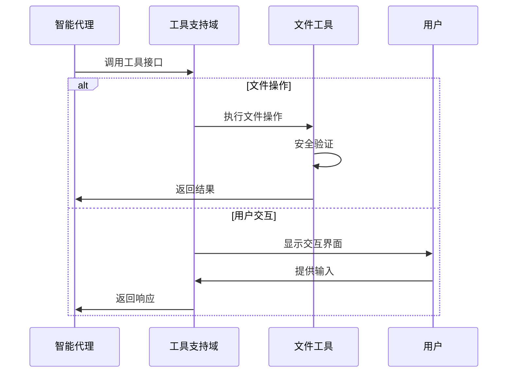

# Cowork Forge 工具支持域技术文档

## 1. 模块概述

### 1.1 核心定位
工具支持域是Cowork Forge系统的底层支撑模块，为整个软件开发编排流程提供基础功能支持。该域包含11个核心工具模块，涵盖了文件操作、用户交互、数据验证、HITL（人类参与循环）等关键功能，支撑着从需求分析到项目交付的全流程自动化。

### 1.2 架构层级
- **层级位置**: 基础设施层
- **重要性评分**: 7.0/10.0
- **复杂度评分**: 6.0/10.0
- **依赖关系**: 依赖数据存储域，服务于所有业务域

## 2. 模块组织结构

### 2.1 模块架构图
```mermaid
graph TB
   [工具支持域] --> B[文件工具模块]
    A --> C[控制工具模块]
    A --> D[验证工具模块]
    A --> E[数据工具模块]
    A --> F[HITL工具模块]
    A --> G[专业工具模块]
    
    B --> B1[ListFilesTool]
    B --> B2[ReadFileTool]
    B --> B3[WriteFileTool]
    B --> B4[RunCommandTool]
    
    C --> C1[ProvideFeedbackTool]
    C --> C2[AskUserTool]
    
    D --> D1[CheckDataFormatTool]
    D --> D2[CheckFeatureCoverageTool]
    D --> D3[CheckTaskDependenciesTool]
    
    E --> E1[CreateRequirementTool]
    E --> E2[AddFeatureTool]
    E --> E3[CreateDesignComponentTool]
    
    F --> F1[ReviewAndEditFileTool]
    F --> F2[ReviewWithFeedbackTool]
    
    G --> G1[IdeaTools]
    G --> G2[ModifyTools]
    G --> G3[ArtifactTools]
    
    H[Tool Trait接口] --> B1
    H --> C1
    H --> D1
    H --> E1
```

### 2.2 核心模块列表

| 模块名称 | 文件路径 | 功能描述 | 重要性 |
|---------|---------|---------|--------|
| 文件工具模块 | `file_tools.rs` | 安全文件操作和命令执行 | 8.0 |
| 控制工具模块 | `control_tools.rs` | 用户交互和反馈收集 | 7.0 |
| 验证工具模块 | `validation_tools.rs` | 数据格式检查和覆盖率分析 | 7.0 |
| 数据工具模块 | `data_tools.rs` | 结构化数据CRUD操作 | 7.0 |
| HITL工具模块 | `hitl_tools.rs` | 人类参与循环支持 | 8.0 |
| 专业工具模块 | 多个专业工具文件 | 特定业务域专用工具 | 6.0-8.0 |

## 3. 核心实现技术

### 3.1 技术栈基础
```rust
// 核心依赖库
use adk_core::{Tool, ToolContext};  // 工具框架基础
use async_trait::async_trait;       // 异步特性支持
use serde_json::{json, Value};      // JSON序列化
use std::sync::Arc;                 // 线程安全引用计数
```

### 3.2 工具接口设计
所有工具都实现了统一的`Tool` trait，确保一致的调用接口：

```rust
#[async_trait]
pub trait Tool: Send + Sync {
    fn name(&self) -> &str;
    fn description(&self) -> &str;
    fn parameters_schema(&self) -> Option<Value>;
    async fn execute(&self, ctx: Arc<dyn ToolContext>, args: Value) -> adk_core::Result<Value>;
}
```

## 4. 核心功能模块详解

### 4.1 文件工具模块 (`file_tools.rs`)

#### 4.1.1 安全路径验证机制
```rust
/// 三层安全验证规则：
/// 1. 拒绝绝对路径（禁止访问系统目录）
/// 2. 拒绝父目录访问（禁止路径遍历攻击）
/// 3. 限定在当前工作目录范围内
fn validate_path_security(path: &str) -> Result<PathBuf, String> {
    // 实现细节...
}
```

#### 4.1.2 主要工具功能
- **ListFilesTool**: 递归/非递归文件列表，支持深度控制
- **ReadFileTool**: 安全文件读取，支持行范围限定
- **WriteFileTool**: 安全文件写入，包含备份机制
- **RunCommandTool**: 受限命令执行，防止任意代码执行

### 4.2 控制工具模块 (`control_tools.rs`)

#### 4.2.1 用户交互模式
```rust
// ProvideFeedbackTool - 结构化的反馈收集
enum FeedbackType {
    BuildError,           // 构建错误
    QualityIssue,         // 质量问题
    MissingRequirement,   // 缺失需求
    Suggestion,           // 改进建议
}

enum Severity {
    Critical,             // 严重问题
    Major,                // 主要问题
    Minor,                // 次要问题
}
```

#### 4.2.2 交互工具
- **ProvideFeedbackTool**: 结构化反馈收集
- **AskUserTool**: 用户输入收集和确认

### 4.3 验证工具模块 (`validation_tools.rs`)

#### 4.3.1 数据格式验证
```rust
// 支持的数据类型验证
enum DataType {
    Requirements,         // 需求数据验证
    Features,            // 功能数据验证
    Design,              // 设计数据验证
    Plan,                // 计划数据验证
}
```

#### 4.3.2 验证功能
- **CheckDataFormatTool**: JSON schema一致性检查
- **CheckFeatureCoverageTool**: 功能覆盖率分析
- **CheckTaskDependenciesTool**: 任务依赖关系验证

### 4.4 数据工具模块 (`data_tools.rs`)

#### 4.4.1 结构化数据操作
```rust
// 需求创建工具参数schema
{
    "type": "object",
    "properties": {
        "title": {"type": "string"},
        "description": {"type": "string"},
        "priority": {"enum": ["high", "medium", "low"]},
        "category": {"enum": ["functional", "non_functional"]},
        "acceptance_criteria": {"type": "array", "items": {"type": "string"}}
    }
}
```

#### 4.4.2 数据工具
- **CreateRequirementTool**: SMART需求创建
- **AddFeatureTool**: 功能定义和需求关联
- **DesignComponentTools**: 架构组件管理

### 4.5 HITL工具模块 (`hitl_tools.rs`)

#### 4.5.1 人类参与循环机制
```rust
// 三种用户交互模式
enum InteractionMode {
    EditMode,    // 编辑模式 - 打开文本编辑器
    PassMode,    // 通过模式 - 直接继续
    FeedbackMode // 反馈模式 - 提供文本反馈
}
```

#### 4.5.2 HITL工具
- **ReviewAndEditFileTool**: 文件审查和编辑
- **ReviewWithFeedbackTool**: 带反馈的审查

## 5. 安全机制设计

### 5.1 路径安全验证
```rust
// 安全路径验证实现
fn validate_path_security(path: &str) -> Result<PathBuf, String> {
    // 规则1：拒绝绝对路径
    if path_obj.is_absolute() {
        return Err("Security: Absolute paths are not allowed".to_string());
    }
    
    // 规则2：拒绝父目录访问
    if path.contains("..") {
        return Err("Security: Parent directory access is not allowed".to_string());
    }
    
    // 规则3：验证路径在允许范围内
    // 实现细节...
}
```

### 5.2 命令执行限制
- 限制可执行命令白名单
- 参数验证和转义处理
- 执行环境隔离

## 6. 交互流程设计

### 6.1 工具调用序列


### 6.2 错误处理机制
- **安全错误**: 立即终止并返回错误信息
- **业务错误**: 提供详细错误信息和恢复建议
- **网络错误**: 重试机制和优雅降级

## 7. 性能优化策略

### 7.1 异步执行模型
```rust
#[async_trait]
impl Tool for ListFilesTool {
    async fn execute(&self, ctx: Arc<dyn ToolContext>, args: Value) -> adk_core::Result<Value> {
        // 异步文件操作实现
        // 支持并发工具执行
    }
}
```

### 7.2 会话级数据缓存
- 工具实例按会话隔离
- 数据加载缓存优化
- 减少重复文件IO操作

## 8. 扩展性设计

### 8.1 模块化架构
- 独立的工具模块实现
- 统一的Tool trait接口
- 插件式工具注册机制

### 8.2 配置化管理
- 工具参数schema定义
- 运行时参数验证
- 工具功能动态启用/禁用

## 9. 总结

工具支持域作为Cowork Forge系统的底层支撑模块，通过模块化的工具设计和严格的安全机制，为上层业务域提供了可靠的基础功能支持。该域的成功实现确保了整个软件开发编排系统的稳定性、安全性和可扩展性。

**核心优势**:
- **安全性**: 多层安全验证机制防止恶意操作
- **模块化**: 清晰的工具分类和职责分离
- **可扩展**: 统一的接口设计支持新工具快速集成
- **用户体验**: 丰富的交互工具支持HITL机制

该域的稳定运行是Cowork Forge系统能够实现从创意到交付全流程自动化的重要保障。