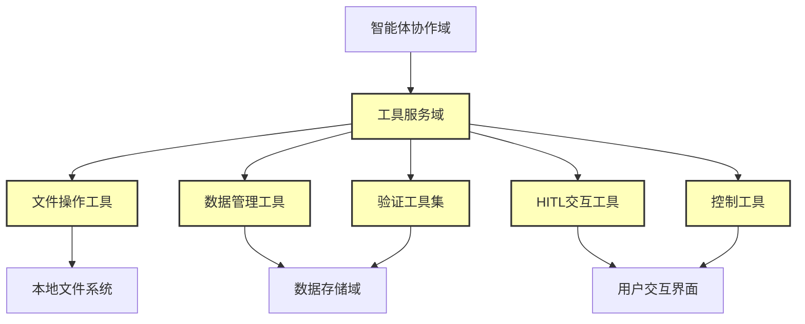
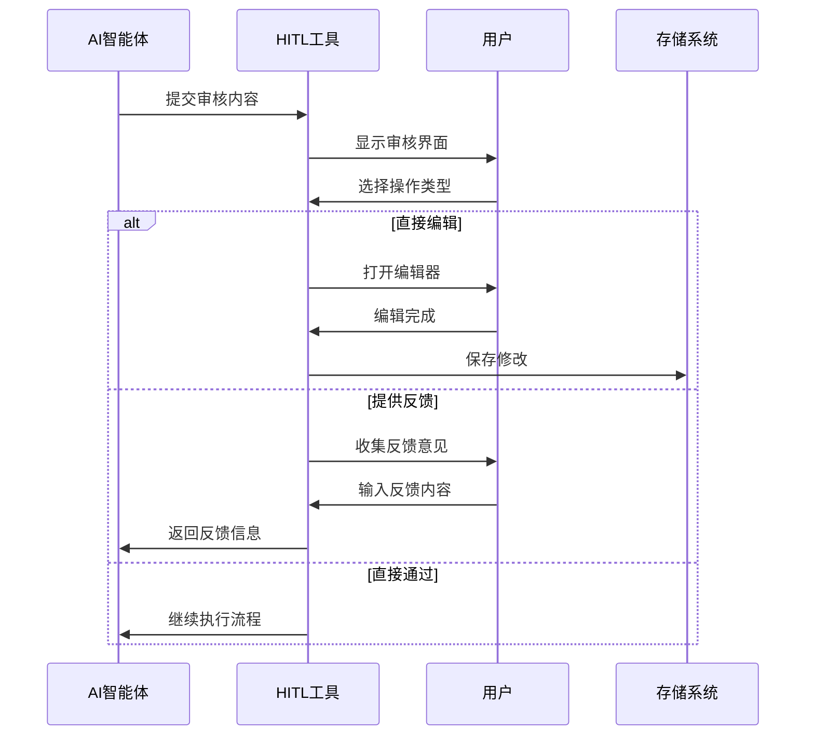
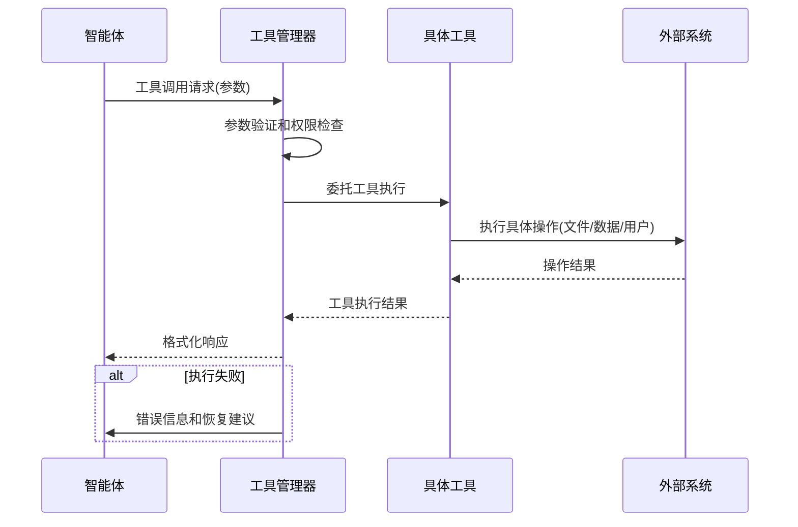

# Cowork Forge 工具服务域技术文档

## 模块概述

工具服务域是Cowork Forge系统的核心支撑模块，为AI智能体提供执行软件开发工作流所需的各种功能工具。该模块采用模块化设计，包含文件操作、数据管理、验证检查、HITL交互和控制功能五大类工具集，为整个AI辅助开发流程提供基础能力支撑。

## 架构设计

### 模块位置与依赖关系

**代码路径**：`crates/cowork-core/src/tools/`
**模块类型**：工具支持域
**重要性评分**：8.5/10.0
**复杂度评分**：8.0/10.0

### 架构层次图



## 核心子模块详解

### 1. 文件操作工具 (`file_tools.rs`)

**重要性**：9.0/10.0  
**功能描述**：提供安全的文件系统操作能力，包括文件读写、目录列表和命令执行功能。

#### 核心工具组件

| 工具名称 | 功能描述 | 关键技术特性 |
|---------|---------|-------------|
| `ListFilesTool` | 目录内容列表 | 安全路径验证、递归遍历控制 |
| `ReadFileTool` | 文件内容读取 | 编码自动检测、大小限制保护 |
| `WriteFileTool` | 文件内容写入 | 原子写入、备份机制、权限检查 |
| `RunCommandTool` | 命令执行 | 命令白名单、超时控制、输出捕获 |

#### 安全约束机制
```rust
// 安全路径验证示例
pub fn validate_path(path: &Path) -> Result<(), ToolError> {
    // 防止路径遍历攻击
    if path.components().any(|c| matches!(c, Component::ParentDir)) {
        return Err(ToolError::SecurityViolation("Path traversal detected"));
    }
    // 限制操作范围在当前项目目录内
    if !path.starts_with(&self.project_root) {
        return Err(ToolError::SecurityViolation("Operation outside project root"));
    }
    Ok(())
}
```

### 2. 数据管理工具 (`data_tools.rs`)

**重要性**：9.0/10.0  
**功能描述**：提供项目数据的CRUD操作和状态管理，支撑需求、特性、设计、任务等核心业务对象的管理。

#### 数据模型管理工具

| 工具名称 | 管理对象 | 核心操作 |
|---------|---------|---------|
| `CreateRequirementTool` | 产品需求 | 创建、验证、关联特性 |
| `AddFeatureTool` | 产品特性 | 添加、更新、状态跟踪 |
| `CreateDesignComponentTool` | 设计组件 | 架构设计、组件关系 |
| `CreateTaskTool` | 开发任务 | 任务分解、依赖管理 |

#### 状态管理机制
```rust
// 数据状态一致性保证
pub struct DataStateManager {
    session: Arc<Session>,
    validation_rules: HashMap<DataType, ValidationRule>,
}

impl DataStateManager {
    pub fn update_with_validation(&self, data_type: DataType, data: &impl Serialize) -> Result<()> {
        // 前置验证
        self.validate_before_update(data_type, data)?;
        // 原子更新
        self.session.atomic_update(|| {
            self.perform_data_update(data_type, data)
        })?;
        // 后置验证
        self.validate_after_update(data_type)
    }
}
```

### 3. 验证工具集 (`validation_tools.rs`)

**重要性**：8.0/10.0  
**功能描述**：提供数据格式验证、特性覆盖验证和任务依赖验证等质量控制功能。

#### 验证工具分类

**格式验证工具** (`CheckDataFormatTool`)
- JSON/YAML语法验证
- 数据结构完整性检查
- 必填字段验证

**业务逻辑验证** (`CheckFeatureCoverageTool`)
- 需求-特性映射覆盖率
- 特性实现状态跟踪
- 遗漏检测和报告生成

**依赖关系验证** (`CheckTaskDependenciesTool`)
- 任务依赖循环检测
- 执行顺序合理性验证
- 关键路径分析

### 4. HITL交互工具 (`hitl_tools.rs`, `hitl_content_tools.rs`)

**重要性**：7.0/10.0  
**功能描述**：实现人类参与循环（Human-in-the-Loop）机制，支持用户审核、编辑和反馈功能。

#### 交互工具类型

| 工具类型 | 交互模式 | 应用场景 |
|---------|---------|---------|
| `ReviewAndEditFileTool` | 文件级审核编辑 | 代码文件审查、文档修改 |
| `ReviewWithFeedbackTool` | 反馈式审核 | 设计评审、需求确认 |
| `ReviewAndEditContentTool` | 内容级编辑 | 文本内容修订、配置调整 |

#### HITL工作流程


### 5. 控制工具 (`control_tools.rs`)

**重要性**：7.0/10.0  
**功能描述**：提供流程控制、用户交互和异常处理等控制功能。

#### 控制工具组件

**反馈管理工具**
- `ProvideFeedbackTool`：记录用户反馈和建议
- `RequestReplanningTool`：请求重新规划工作流

**用户交互工具**
- `AskUserTool`：向用户询问信息或确认
- `RequestHumanReviewTool`：请求人工审核关键决策

## 技术实现细节

### 工具接口设计

工具服务域采用标准化的Trait接口设计，确保工具的一致性和可扩展性：

```rust
#[async_trait]
pub trait Tool: Send + Sync {
    /// 工具名称标识
    fn name(&self) -> String;
    
    /// 参数模式定义
    fn description(&self) -> String;
    
    /// 参数模式定义
    fn parameters(&self) -> Value;
    
    /// 工具执行方法
    async fn run(&self, input: Value) -> Result<Value, ToolError>;
    
    /// 是否产生副作用
    fn is_side_effect(&self) -> bool {
        true
    }
}
```

### 会话上下文管理

每个工具实例都与会话上下文绑定，确保数据隔离和状态一致性：

```rust
pub struct ToolContext {
    pub session: Arc<Session>,
    pub project_root: PathBuf,
    pub security_context: SecurityContext,
    pub rate_limiter: Arc<RateLimiter>,
}

impl ToolContext {
    pub fn new(session: Arc<Session>) -> Self {
        Self {
            session: session.clone(),
            project_root: session.project_root().to_path_buf(),
            security_context: SecurityContext::default(),
            rate_limiter: Arc::new(RateLimiter::new(10, Duration::from_secs(1))),
        }
    }
}
```

### 错误处理机制

工具服务域实现分层的错误处理策略：

```rust
#[derive(Debug, thiserror::Error)]
pub enum ToolError {
    #[error("IO错误: {0}")]
    IoError(#[from] std::io::Error),
    
    #[error("安全违规: {0}")]
    SecurityViolation(String),
    
    #[error("数据验证失败: {0}")]
    ValidationError(String),
    
    #[error("用户取消操作")]
    UserCancelled,
    
    #[error("工具执行超时")]
    Timeout,
    
    #[error("资源配置不足")]
    ResourceExhausted,
}
```

## 集成与交互模式

### 与智能体协作域的集成

工具服务域通过标准接口与智能体协作域集成：

```rust
// 智能体工具配置示例
pub fn configure_prd_agent_tools(session: Arc<Session>) -> Vec<Arc<dyn Tool>> {
    vec![
        Arc::new(CreateRequirementTool::new(session.clone())),
        Arc::new(AddFeatureTool::new(session.clone())),
        Arc::new(CheckDataFormatTool::new(session.clone())),
        Arc::new(ReviewWithFeedbackTool::new(session.clone())),
        Arc::new(ProvideFeedbackTool::new(session.clone())),
    ]
}
```

### 数据流设计

工具服务域的数据流采用请求-响应模式，支持异步操作和状态管理：



## 安全与性能考虑

### 安全机制

1. **路径安全**：所有文件操作都进行路径遍历攻击检测
2. **命令白名单**：限制可执行的系统命令范围
3. **资源限制**：设置文件大小、执行时间等资源限制
4. **权限隔离**：基于会话的权限控制和数据隔离

### 性能优化

1. **异步执行**：所有工具操作都支持异步执行
2. **连接池**：数据库连接和外部服务连接使用连接池
3. **缓存机制**：频繁访问的数据实施缓存策略
4. **速率限制**：外部API调用实施速率限制控制

## 使用示例

### 文件操作工具使用

```rust
// 创建文件操作工具实例
let file_tools = FileOperationTools::new(session.clone());

// 读取项目文件
let content = file_tools.read_file("src/main.rs").await?;

// 写入生成代码
file_tools.write_file("src/generated/mod.rs", &generated_code).await?;

// 执行构建命令
let build_output = file_tools.run_command("cargo", &["build", "--release"]).await?;
```

### 数据管理工具使用

```rust
// 创建需求管理工具
let req_tool = CreateRequirementTool::new(session.clone());

// 添加产品需求
let requirement = req_tool.create_requirement(
    "用户认证系统",
    "实现基于JWT的用户登录和权限管理",
    Priority::High
).await?;

// 关联产品特性
let feature_tool = AddFeatureTool::new(session.clone());
feature_tool.add_feature(&requirement.id, "用户注册功能", "实现新用户注册流程").await?;
```

## 总结

工具服务域作为Cowork Forge系统的核心支撑模块，为AI智能体提供了完整的功能工具集。通过模块化设计和标准化接口，该域实现了高度的可扩展性和可维护性。安全机制和性能优化措施确保了系统的稳定运行，而HITL交互工具则为人工干预和质量控制提供了有效途径。

该模块的成功实施为整个AI辅助开发流程提供了坚实的技术基础，是Cowork Forge系统实现从需求到代码端到端自动化的关键支撑。