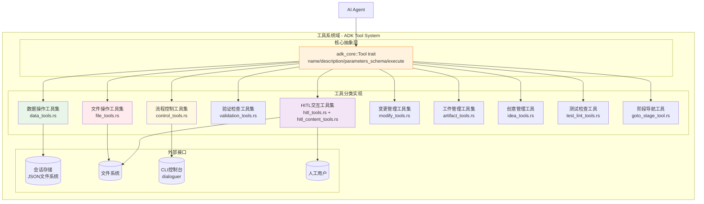
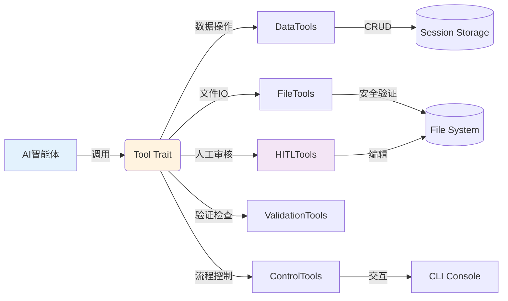
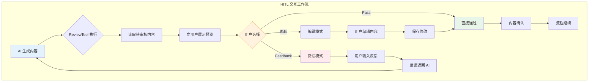
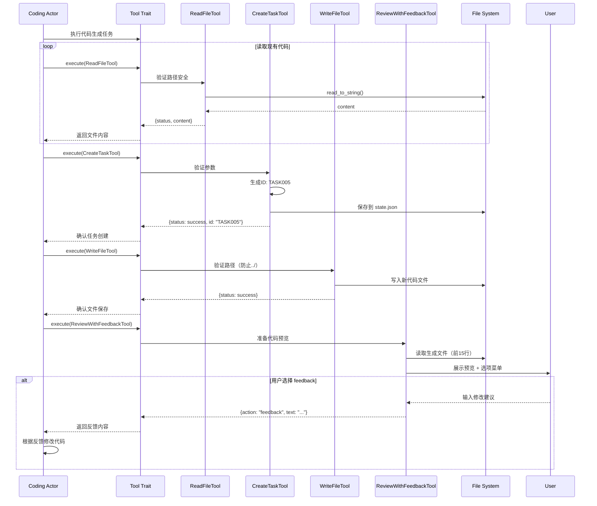

基于提供的系统架构研究材料，以下是针对 **Cowork Forge 工具系统域** 的详细技术文档：

---

# 工具系统域技术文档

## 1. 概述

### 1.1 定义与定位

工具系统域（Tool System Domain）是 Cowork Forge 核心框架的**能力抽象层**，为 AI 智能体（Agent）提供标准化、安全、可控的操作接口。该域通过实现 `adk_core::Tool` trait，将大语言模型（LLM）的决策能力转化为具体的系统操作，涵盖数据持久化、文件系统访问、流程控制、人机协作（HITL）交互等关键能力。

### 1.2 核心职责

| 职责维度 | 具体描述 |
|---------|---------|
| **能力封装** | 为智能体提供 11 类标准化工具接口，屏蔽底层实现复杂性 |
| **安全控制** | 实现路径遍历防护、命令执行超时、服务命令拦截等安全机制 |
| **会话隔离** | 通过 `session_id` 实现数据操作的命名空间隔离，支持多项目并行 |
| **人机协作** | 提供交互式审核、反馈收集、人工决策等 HITL 能力 |
| **数据一致性** | 确保需求、功能、任务等核心数据模型的 CRUD 操作原子性 |

### 1.3 设计原则

- **简约优先**：工具接口保持最小化设计，避免过度抽象
- **安全默认**：文件操作默认启用路径验证，命令执行默认 30 秒超时
- **可观测性**：所有工具执行返回结构化 JSON 响应，包含状态码和详细描述
- **弹性容错**：支持工具执行错误的自动捕获和人工介入决策

---

## 2. 架构设计

### 2.1 整体架构

工具系统域采用**分层模块化架构**，基于 ADK（Agent Development Kit）框架的 `Tool` trait 标准构建：



### 2.2 核心组件关系



---

## 3. 详细模块设计

### 3.1 数据操作工具集（Data Tools）

**模块路径**：`crates/cowork-core/src/tools/data_tools.rs`

#### 功能描述
提供软件开发生命周期核心数据模型的 CRUD 操作，支持需求（Requirements）、功能（Feature）、设计组件（Design Component）、任务（Task）的全生命周期管理。

#### 核心工具清单

| 工具名称 | 功能描述 | ID 生成规则 | 关联数据模型 |
|---------|---------|------------|------------|
| `CreateRequirementTool` | 创建项目需求 | `REQ{序号:03}` | Requirements |
| `AddFeatureTool` | 添加功能特性 | `FEAT{序号:03}` | Feature |
| `CreateDesignComponentTool` | 创建架构组件 | `COMP{序号:03}` | DesignComponent |
| `CreateTaskTool` | 创建实施任务 | `TASK{序号:03}` | Task |
| `UpdateTaskStatusTool` | 更新任务状态 | - | Task.status |
| `UpdateFeatureStatusTool` | 更新功能状态 | - | Feature.status |
| `GetRequirementsTool` | 查询需求数据 | - | Requirements |
| `GetDesignTool` | 查询设计规范 | - | DesignSpec |
| `GetPlanTool` | 查询实施计划 | - | ImplementationPlan |

#### 技术实现要点

1. **会话隔离机制**：所有操作通过 `session_id` 参数定位到 `.cowork/sessions/{session_id}/` 目录下的 JSON 文件
2. **原子 ID 生成**：采用 `format!("{}{:03}", prefix, count)` 模式，前缀分别为 REQ/FEAT/COMP/TASK
3. **状态机管理**：支持功能状态（Draft → Review → Completed）和任务状态（Todo → InProgress → Done）的流转

**示例调用**：
```rust
// AI Agent 通过 ToolContext 获取 session_id 并执行
let args = json!({
    "title": "用户认证模块",
    "description": "实现基于JWT的登录认证",
    "priority": "High"
});
// 自动保存到 state.json 并返回 { "status": "success", "id": "REQ001" }
```

### 3.2 文件操作工具集（File Tools）

**模块路径**：`crates/cowork-core/src/tools/file_tools.rs`

#### 功能描述
提供受限的文件系统访问能力，确保 AI 智能体在预定义的安全边界内执行文件读写和命令执行。

#### 核心工具清单

| 工具名称 | 功能 | 安全约束 |
|---------|------|---------|
| `ListFilesTool` | 递归列举目录结构 | 路径白名单验证 |
| `ReadFileTool` | 读取文本文件内容 | 禁止读取二进制文件 |
| `WriteFileTool` | 写入/覆盖文件 | 路径遍历防护 |
| `RunCommandTool` | 执行 Shell 命令 | 30秒超时、服务命令拦截 |

#### 安全机制详解

**路径安全验证**（`validate_path_security`）：
- 禁止绝对路径（以 `/` 或 `\` 开头）
- 禁止路径遍历（`../` 或 `..\`）
- 限制工作目录为项目根目录或 `.cowork` 目录

**命令执行安全**：
```rust
// 自动拦截长期运行服务命令
fn is_blocking_service_command(cmd: &str) -> bool {
    let services = ["npm start", "python -m http.server", "cargo watch"];
    services.iter().any(|s| cmd.contains(s))
}

// 30秒超时机制
let output = tokio::time::timeout(
    Duration::from_secs(30),
    process::Command::new("sh").arg("-c").arg(command).output()
).await;
```

### 3.3 流程控制工具集（Control Tools）

**模块路径**：`crates/cowork-core/src/tools/control_tools.rs`

#### 功能描述
提供工作流控制、用户交互和反馈管理的标准化接口，支持 Actor-Critic 模式的反馈循环。

#### 核心工具清单

| 工具名称 | 功能描述 | 使用场景 |
|---------|---------|---------|
| `ProvideFeedbackTool` | 记录反馈历史 | Critic 向 Actor 提供改进建议 |
| `RequestReplanningTool` | 请求重规划 | Check Agent 发现严重问题需回退 |
| `AskUserTool` | 询问用户确认 | 需要用户决策的岔路口 |
| `RequestHumanReviewTool` | 请求人工审核升级 | 超出 AI 决策能力的复杂场景 |

#### 交互实现
使用 `dialoguer` crate 实现富文本交互：
- 彩色 emoji 提示（✅/⚠️/❌）
- 单选/多选菜单（`Select`/`MultiSelect`）
- 文本输入（`Input`）

### 3.4 HITL 交互工具集（Human-in-the-Loop Tools）

**模块路径**：
- `crates/cowork-core/src/tools/hitl_tools.rs`
- `crates/cowork-core/src/tools/hitl_content_tools.rs`

#### 功能描述
实现人机协作审核的核心机制，在关键质量节点（PRD、Design、Plan）强制引入人工审核，支持三种交互模式。

#### 工具分类

**文件审核模式**：
- `ReviewAndEditFileTool`：编辑或直接通过
- `ReviewWithFeedbackTool`：支持反馈循环的文件审核

**内容审核模式**：
- `ReviewAndEditContentTool`：审核内存中的文本内容
- `ReviewWithFeedbackContentTool`：带反馈的三模式内容审核（edit/pass/feedback）

#### 工作流程



### 3.5 验证检查工具集（Validation Tools）

**模块路径**：`crates/cowork-core/src/tools/validation_tools.rs`

#### 功能描述
提供数据完整性、一致性和质量的自动化验证能力，支持静态分析和依赖关系检查。

#### 核心工具清单

| 工具名称 | 验证内容 | 算法/机制 |
|---------|---------|----------|
| `CheckDataFormatTool` | JSON Schema 合规性 | 结构体反序列化验证 |
| `CheckFeatureCoverageTool` | 功能覆盖度分析 | 集合运算（需求⊆功能） |
| `CheckTaskDependenciesTool` | 任务依赖环路检测 | DFS 深度优先搜索算法 |

#### 环路检测实现
```rust
// CheckTaskDependenciesTool 使用 DFS 检测循环依赖
fn has_cycle(tasks: &[Task]) -> Result<(), Vec<String>> {
    let mut visited = HashSet::new();
    let mut rec_stack = HashSet::new();
    
    for task in tasks {
        if !visited.contains(&task.id) {
            if dfs_detect_cycle(task, &mut visited, &mut rec_stack, &task_map) {
                return Err(cycle_path);
            }
        }
    }
    Ok(())
}
```

### 3.6 变更管理工具集（Modify Tools）

**模块路径**：`crates/cowork-core/src/tools/modify_tools.rs`

#### 功能描述
支持增量修改工作流（Modify Workflow），处理变更请求（ChangeRequest）的持久化和加载。

#### 核心工具
- `SaveChangeRequestTool`：保存变更分析结果，包括影响范围（PRD/Design/Plan/Code）和风险等级（Low/Medium/High）
- `LoadChangeRequestTool`：加载历史变更请求，支持变更追溯

### 3.7 其他专用工具

| 工具类别 | 文件路径 | 功能描述 |
|---------|---------|---------|
| **工件管理** | `artifact_tools.rs` | 保存交付报告、PRD、设计文档等最终工件 |
| **阶段导航** | `goto_stage_tool.rs` | 支持工作流跳转到指定阶段（用于 Revert 场景） |
| **创意管理** | `idea_tools.rs` | 创意整理阶段的专用数据操作 |
| **测试检查** | `test_lint_tools.rs` | 执行代码测试和质量检查命令 |

---

## 4. 技术实现规范

### 4.1 Tool Trait 实现标准

所有工具必须实现 `adk_core::Tool` trait，采用 `async_trait` 宏支持异步执行：

```rust
#[async_trait]
pub trait Tool: Send + Sync {
    /// 工具标识符（LLM 调用时使用）
    fn name(&self) -> &str;
    
    /// 功能描述（提供给 LLM 的上下文）
    fn description(&self) -> &str;
    
    /// JSON Schema 参数定义（用于校验LLM输入）
    fn parameters_schema(&self) -> Value;
    
    /// 异步执行入口
    async fn execute(
        &self, 
        ctx: Arc<dyn ToolContext>, 
        args: Value
    ) -> Result<Value, AdkError>;
}
```

### 4.2 错误处理规范

统一使用 `AdkError::Tool` 包装工具执行错误，确保错误信息对 LLM 可读：

```rust
match operation {
    Ok(result) => Ok(json!({ "status": "success", "data": result })),
    Err(e) => Err(AdkError::Tool(format!(
        "{} execute failed: {}", 
        self.name(), 
        e
    ))),
}
```

### 4.3 工具注册机制

在 `tools/mod.rs` 中集中注册所有工具，通过宏或工厂模式实现自动化注册：

```rust
pub fn register_all_tools() -> Vec<Arc<dyn Tool>> {
    vec![
        Arc::new(CreateRequirementTool),
        Arc::new(ReadFileTool),
        Arc::new(ReviewWithFeedbackContentTool),
        // ... 其他工具
    ]
}
```

---

## 5. 交互流程示例

### 5.1 完整工具调用序列

以下序列图展示 AI Agent 在 Coding 阶段使用多种工具协作的完整流程：



---

## 6. 安全与性能考量

### 6.1 安全防护矩阵

| 风险类别 | 防护措施 | 实施位置 |
|---------|---------|---------|
| **路径遍历攻击** | 正则表达式过滤 `../` 和绝对路径 | `file_tools::validate_path_security` |
| **命令注入** | 白名单拦截长期服务命令 | `file_tools::is_blocking_service_command` |
| **资源耗尽** | 30秒命令执行超时 | `RunCommandTool::execute_with_timeout` |
| **数据越权** | session_id 隔离命名空间 | 所有 DataTools 的存储路径构造 |

### 6.2 性能优化

- **异步 IO**：所有文件和命令操作使用 `tokio::fs` 和 `tokio::process`，避免阻塞线程
- **延迟加载**：数据工具仅在需要时加载 JSON 状态文件，不维护常驻内存缓存
- **速率限制**：通过 `RateLimitedLlm` 包装器控制工具调用频率（默认 2 秒延迟）

---

## 7. 扩展性设计

### 7.1 新增工具开发指南

如需为特定领域（如测试自动化、部署操作）新增工具：

1. **实现 Trait**：创建新结构体实现 `Tool` trait
2. **定义 Schema**：在 `parameters_schema()` 中明确定义 JSON Schema
3. **安全审计**：如涉及文件/命令操作，必须调用 `validate_path_security`
4. **注册工具**：在 `tools/mod.rs` 中添加到工具注册表

### 7.2 工具组合模式

支持工具链式调用构建复杂工作流，例如：

```rust
// 变更分析工作流组合
let workflow = vec![
    Arc::new(SaveChangeRequestTool),
    Arc::new(CheckFeatureCoverageTool),
    Arc::new(ReviewWithFeedbackContentTool),
];
```

---

## 8. 总结

工具系统域作为 Cowork Forge 的**能力基石**，通过标准化的 `Tool` trait 接口，将 AI 智能体的认知能力转化为可执行、可观测、可管控的系统操作。其设计体现了以下核心特征：

1. **安全优先**：路径验证、超时控制、命令拦截三层防护确保系统安全
2. **人机协同**：HITL 工具集实现关键节点的强制人工审核，保证输出质量
3. **数据驱动**：数据工具与会话存储紧密集成，实现完整的生命周期数据管理
4. **弹性设计**：支持错误恢复、重规划、阶段回退等容错机制

该架构支持独立开发者、技术架构师和软件工程师在 AI 辅助软件开发场景中的多样化需求，是连接大语言模型能力与软件工程实践的关键桥梁。
