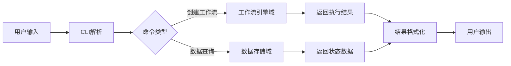
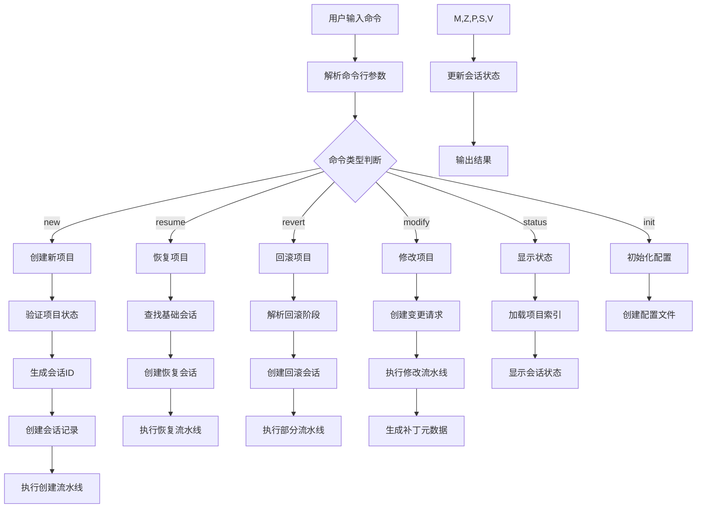
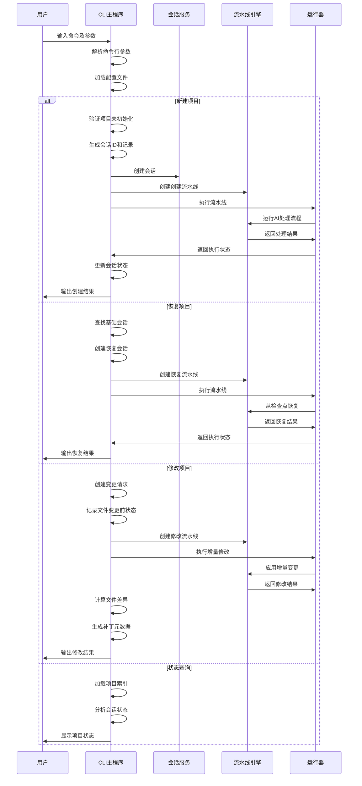

# 应用接口域技术文档

## 文档概述

**文档版本**：1.0  
**生成时间**：2025-03-29 10:30:00 UTC  
**对应系统版本**：Cowork Forge v1.0  

## 1. 域定义与概述

### 1.1 域定位
应用接口域是Cowork Forge系统的用户交互入口层，属于**用户界面域**类型，负责提供完整的命令行接口（CLI）体验。该域作为系统与最终用户的主要交互通道，将用户指令转换为系统内部工作流执行命令。

### 1.2 核心价值
- **用户友好性**：通过直观的命令行接口降低使用门槛
- **流程封装**：将复杂的多智能体工作流封装为简单命令操作
- **状态管理**：提供项目生命周期管理能力（创建、恢复、修改、监控）
- **交互桥梁**：连接用户意图与系统内部AI驱动的工作流引擎

### 1.3 架构位置
在系统分层架构中，应用接口域位于最上层，直接面向用户，向下调用工作流引擎域启动具体业务流程。

## 2. 核心功能模块

### 2.1 CLI主程序模块
**代码路径**：`crates/cowork-cli/src/main.rs`  
**重要性评分**：8.0/10.0  
**复杂度评分**：6.0/10.0

#### 2.1.1 功能职责
- **命令解析**：解析用户输入的命令行参数和子命令
- **会话管理**：管理项目会话的创建、恢复和状态跟踪
- **流水线调度**：调用相应的工作流流水线执行具体业务逻辑
- **结果展示**：向用户反馈执行状态和结果信息

#### 2.1.2 支持的命令类型
| 命令 | 功能描述 | 对应工作流 |
|------|----------|------------|
| `new` | 创建新项目 | 完整项目开发流程 |
| `resume` | 恢复中断项目 | 项目恢复流程 |
| `revert` | 回滚项目到指定阶段 | 部分流程执行 |
| `modify` | 修改现有项目 | 项目修改流程 |
| `status` | 显示项目状态 | 状态查询功能 |
| `init` | 初始化系统配置 | 配置初始化 |

### 2.2 技术实现架构

#### 2.2.1 技术栈组成
```rust
// 核心依赖库
- clap: 命令行参数解析
- tokio: 异步运行时支持
- ADK框架: 会话管理和流水线集成
- serde: 配置序列化/反序列化
```

#### 2.2.2 核心数据结构
```rust
// 命令行参数结构
pub struct Cli {
    #[command(subcommand)]
    command: Commands,
    #[arg(short, long)]
    config: Option<PathBuf>,
    #[arg(short, long)]
    verbose: bool,
}

// 子命令枚举
pub enum Commands {
    New { /* 新建参数 */ },
    Resume { /* 恢复参数 */ },
    Modify { /* 修改参数 */ },
    // ... 其他命令
}
```

## 3. 详细架构设计

### 3.1 模块内部结构

应用接口域采用单一模块设计，所有功能集中在CLI主程序中，通过子命令分发实现功能隔离。

**架构特点**：
- **单一入口点**：所有用户交互通过main.rs统一处理
- **命令路由**：基于clap库实现命令解析和路由分发
- **异步执行**：利用tokio运行时支持高并发操作
- **错误统一处理**：集中式错误处理和用户反馈

### 3.2 与下层域的关系

#### 3.2.1 依赖关系矩阵
| 目标域 | 关系类型 | 强度 | 描述 |
|--------|----------|------|------|
| 工作流引擎域 | 服务调用 | 9.0/10.0 | 调用工作流引擎执行具体业务流程 |
| 数据存储域 | 数据提供 | 7.0/10.0 | 获取项目状态和会话数据用于展示 |

#### 3.2.2 交互模式


## 4. 核心工作流程

### 4.1 完整命令执行流程

#### 4.1.1 流程图描述


#### 4.1.2 序列交互图


### 4.2 关键业务流程详解

#### 4.2.1 项目创建流程（new命令）
1. **参数验证**：检查项目目录是否已初始化
2. **会话生成**：创建唯一会话ID和项目记录
3. **流水线创建**：实例化完整开发工作流（6阶段）
4. **执行监控**：监控流水线执行状态，处理中间结果
5. **结果持久化**：保存最终状态和交付物

#### 4.2.2 项目恢复流程（resume命令）
1. **会话查找**：基于项目标识符查找基础会话
2. **状态验证**：确认会话可恢复状态
3. **检查点恢复**：从断点位置重新初始化工作流
4. **增量执行**：只执行未完成的阶段任务

## 5. 技术实现细节

### 5.1 命令行解析实现

```rust
// 基于clap库的命令定义示例
#[derive(Parser)]
#[command(name = "cowork")]
#[command(about = "AI-powered collaborative software development system")]
pub struct Cli {
    #[command(subcommand)]
    pub command: Commands,
    
    #[arg(short, long, value_name = "FILE")]
    pub config: Option<PathBuf>,
    
    #[arg(short, long)]
    pub verbose: bool,
}

#[derive(Subcommand)]
pub enum Commands {
    /// Create a new project from scratch
    New {
        #[arg(short, long)]
        name: String,
        
        #[arg(short, long)]
        description: Option<String>,
    },
    // ... 其他命令实现
}
```

### 5.2 会话管理机制

#### 5.2.1 会话生命周期
- **创建阶段**：生成唯一会话ID，初始化项目结构
- **执行阶段**：维护执行状态和进度信息
- **持久化阶段**：定期保存状态到存储系统
- **恢复阶段**：从持久化数据重建执行上下文

#### 5.2.2 状态跟踪实现
```rust
pub struct SessionState {
    pub session_id: String,
    pub project_name: String,
    pub current_stage: DevelopmentStage,
    pub completed_stages: Vec<DevelopmentStage>,
    pub created_at: DateTime<Utc>,
    pub last_updated: DateTime<Utc>,
    pub status: SessionStatus,
}
```

### 5.3 错误处理策略

#### 5.3.1 错误分类
- **用户输入错误**：参数验证失败，提供友好提示
- **系统配置错误**：配置文件问题，指导用户修复
- **执行过程错误**：工作流执行异常，支持重试机制
- **资源访问错误**：文件权限或网络问题，提供解决方案

#### 5.3.2 恢复机制
- **优雅降级**：在部分功能失败时继续其他操作
- **重试逻辑**：对临时性错误实现自动重试
- **状态回滚**：确保失败操作不影响系统一致性

## 6. 配置与定制化

### 6.1 配置文件结构
```yaml
# cowork-forge-config.yaml
llm:
  provider: "openai"
  api_key: "${OPENAI_API_KEY}"
  model: "gpt-4"
  
storage:
  base_path: "./.cowork-projects"
  session_ttl: "7d"
  
ui:
  verbose: false
  stream_output: true
```

### 6.2 环境变量支持
- `COWORK_CONFIG_PATH`：自定义配置文件路径
- `OPENAI_API_KEY`：LLM服务认证密钥
- `COWORK_LOG_LEVEL`：日志级别控制

## 7. 使用示例与最佳实践

### 7.1 典型使用场景

#### 7.1.1 全新项目开发
```bash
# 创建新项目
cowork new --name "my-awesome-app" --description "A revolutionary application"

# 监控执行进度（verbose模式）
cowork new --name "test-project" --verbose

# 使用自定义配置
cowork new --name "custom-project" --config ./my-config.yaml
```

#### 7.1.2 项目维护操作
```bash
# 查看项目状态
cowork status

# 恢复中断项目
cowork resume --session-id "session-123"

# 增量修改项目
cowork modify --change-request "添加用户认证功能"
```

### 7.2 性能优化建议

1. **配置优化**：根据项目规模调整LLM模型和并发参数
2. **存储管理**：定期清理过期会话数据释放磁盘空间
3. **网络优化**：在低速网络环境下调整超时和重试参数

## 8. 扩展与集成

### 8.1 插件扩展机制
应用接口域支持通过配置扩展支持新的命令类型，未来版本计划支持插件架构。

### 8.2 API集成潜力
当前为CLI接口，具备扩展为REST API或Web界面的架构基础。

## 9. 总结

应用接口域作为Cowork Forge系统的用户入口，承担着至关重要的桥梁作用。通过精心设计的命令行接口，将复杂的AI驱动开发流程简化为直观的用户操作，显著降低了技术门槛。该域的实现体现了现代CLI工具的最佳实践，具备良好的可扩展性和维护性。

**关键优势**：
- **用户体验优秀**：直观的命令设计，详细的帮助信息
- **功能完整**：覆盖项目全生命周期管理需求
- **技术稳健**：基于成熟技术栈，错误处理完善
- **扩展性强**：为未来功能扩展预留架构空间

随着系统演进，应用接口域将继续作为用户与AI辅助开发能力之间的核心连接层，持续优化交互体验和功能丰富度。