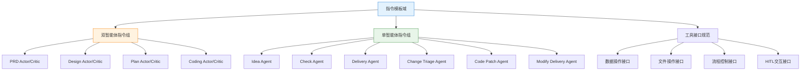
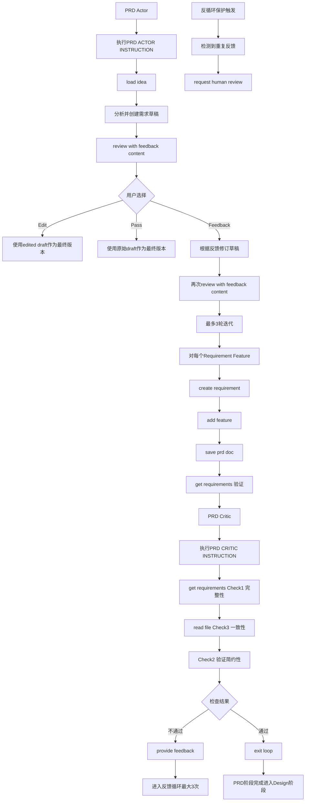

# 指令模板域技术文档

## 1. 概述

### 1.1 定义与定位

**指令模板域（Instruction Template Domain）**是Cowork Forge系统的核心业务域，负责管理覆盖软件开发生命周期全阶段的智能体提示词（Prompt Templates）。该域通过结构化的指令定义，规范AI智能体在需求分析、架构设计、任务规划、代码实现等关键环节的行为模式，确保多智能体协作的一致性和输出质量。

作为系统的"中枢神经系统"，指令模板域嵌入"简约优先"（Simplicity-First）的核心设计哲学，通过硬性约束防止AI产生过度工程化（Over-Engineering）的架构方案。

### 1.2 核心价值

| 价值维度 | 具体体现 |
|---------|---------|
| **行为标准化** | 为10个workflow stage定义统一的行为规范和输出标准 |
| **质量约束** | 通过指令内嵌规则限制组件数量（2-4个）、任务数量（5-12个） |
| **反循环保护** | 在Critic指令中植入自感知机制，防止无限迭代 |
| **人机协作** | 在关键节点强制插入人工审核（HITL）触发器 |

### 1.3 领域边界

- **包含**：所有智能体系统提示词、Actor-Critic交互协议、约束规则定义、工具调用规范
- **不包含**：LLM API调用实现（属于LLM服务域）、具体的工具实现逻辑（属于工具系统域）、会话状态管理（属于数据与存储管理域）

## 2. 架构设计

### 2.1 整体结构

指令模板域采用**模块化常量定义架构**，通过Rust的模块系统实现指令的分层管理：

```rust
// 模块层级结构
crates/cowork-core/src/instructions/
├── mod.rs           // 指令聚合模块，统一暴露所有指令常量
├── idea.rs          // Idea Agent指令（单智能体）
├── prd.rs           // PRD阶段指令（Actor-Critic对）
├── design.rs        // Design阶段指令（Actor-Critic对）
├── plan.rs          // Plan阶段指令（Actor-Critic对）
├── coding.rs        // Coding阶段指令（Actor-Critic对）
├── check.rs         // Check Agent指令（单智能体）
├── delivery.rs      // Delivery Agent指令（单智能体）
├── modify.rs        // Change Triage Agent指令（单智能体）
├── code_patch.rs    // Code Patch Agent指令（单智能体）
└── modify_delivery.rs // Modify Delivery Agent指令（单智能体）
```

### 2.2 Actor-Critic双智能体模式

在PRD、Design、Plan、Coding四个关键阶段，指令模板域实现**Actor-Critic双智能体协作模式**：

```
┌─────────────────────────────────────────────────────────────┐
│                        Stage Loop                           │
│  ┌──────────────┐                    ┌──────────────┐      │
│  │    Actor     │ ────(create)─────> │  Artifacts   │      │
│  │   (演员)     │                    │   (工件)     │      │
│  └──────┬───────┘                    └──────┬───────┘      │
│         │                                   │              │
│         │<────────(validate)────────────────┘              │
│         │                                   │              │
│         │<────────(feedback loop)──────────┘              │
│         │                    max_iterations=3             │
│  ┌──────▼───────┐                                          │
│  │   Critic     │ ────(exit_loop/save)───> Next Stage     │
│  │  (评论家)    │                                          │
│  └──────────────┘                                          │
└─────────────────────────────────────────────────────────────┘
```

**指令职责划分**：
- **Actor指令**：定义6-7步工作流程，负责内容生成，调用创建类工具（`create_*`），在关键步骤触发人机审核
- **Critic指令**：定义5-6项强制检查清单，负责质量验证，调用读取类工具（`get_*`/`read_file`），通过`provide_feedback()`或`exit_loop()`控制流程

### 2.3 架构流程图



## 3. 核心实现机制

### 3.1 指令存储与格式

指令模板采用**Rust常量字符串**（`&'static str`）实现，使用原始字符串字面量（Raw String Literals）保留Markdown格式和特殊字符：

```rust
// crates/cowork-core/src/instructions/prd.rs
pub const PRD_ACTOR_INSTRUCTION: &str = r#"
你是PRD Actor，负责分析项目需求。
...
## 工作流程
1. 使用`load_idea()`获取创意文档
2. 分析需求，创建需求草稿（不要直接保存）
3. 调用`review_with_feedback_content()`进行人工审核
...
## 约束规则
- 功能数量：核心功能不超过5个
- 复杂度：禁止提出微服务、缓存层、消息队列等非必要架构
"#;
```

**技术特点**：
- **编译时确定**：利用Rust的`&'static str`实现零运行时开销
- **格式化保留**：使用`r#"`包裹，保留Markdown的代码块、列表层次
- **规模控制**：单指令长度1K-5K行，确保行为描述的完备性

### 3.2 简约优先约束机制

指令模板通过**显式禁止规则**防止过度工程化：

| 约束维度 | 具体规则 | 适用阶段 |
|---------|---------|---------|
| **架构规模** | 组件数量限制2-4个 | Design Actor |
| **任务粒度** | 核心任务限制5-12个 | Plan Actor |
| **技术选型** | 禁止推荐Kubernetes、Redis、Kafka等中间件 | Design/Plan Actor |
| **工程实践** | 禁止生成测试代码、CI/CD配置、性能优化代码 | Coding Actor |
| **部署相关** | 禁止Dockerfile、K8s YAML等部署配置 | Coding Actor |

**约束实现方式**：
在指令文本中嵌入强制性检查项，Critic Agent需验证：
```markdown
## 强制检查清单（Critic）
3. [ ] 检查是否包含非核心任务（测试/部署/优化）
   - 若发现：标记为`over_engineering`，要求删除
```

### 3.3 反循环保护机制

为防止Actor-Critic陷入无限反馈循环，Critic指令中植入**自感知检测逻辑**：

```rust
pub const PRD_CRITIC_INSTRUCTION: &str = r#"
...
## 反循环保护
如果发现以下情况，立即调用`request_human_review()`：
1. 已经连续3次给出相同或相似的修改建议
2. Actor反复犯同样的错误
3. 无法确定需求是否满足（存在歧义）

此时应升级至人工审核，而非继续循环。
"#;
```

## 4. 指令分类详解

### 4.1 双智能体指令组（Actor-Critic Pairs）

#### 4.1.1 PRD阶段指令

**PRD Actor指令**：
- **目标**：将创意文档转化为结构化需求规格说明书
- **关键步骤**：
  1. 调用`load_idea()`加载创意
  2. 创建需求与功能草稿（内存中构建）
  3. 触发`review_with_feedback_content()`人工审核（强制）
  4. 根据审核结果（edit/pass/feedback）处理修订
  5. 调用`save_prd_doc()`保存PRD文档
  6. 使用`get_requirements()`验证保存结果

**PRD Critic指令**：
- **验证维度**：
  1. 需求完整性检查（通过`get_requirements()`）
  2. 简约性验证（无过度设计）
  3. 文档一致性检查（比对`read_file("artifacts/prd.md")`与内存数据）
- **退出条件**：所有检查通过 → 调用`exit_loop()`

#### 4.1.2 Design阶段指令

**Design Actor指令**：
- **核心约束**：组件数量严格限制在**2-4个**
- **输出**：架构组件图、组件职责定义、组件间接口契约
- **审核点**：架构设计必须通过人机审核确认组件边界

**Design Critic指令**：
- **专项检查**：
  - 组件数量核查（>4个则要求合并）
  - 循环依赖检测（通过`get_design()`分析）
  - 简约性验证（禁止引入消息队列、缓存层等非必要组件）

#### 4.1.3 Plan阶段指令

**Plan Actor指令**：
- **任务数量约束**：核心任务**5-12个**
- **依赖管理**：使用`create_task()`创建任务，明确`dependencies`字段
- **排他性规则**：任务范围仅限于核心功能实现，明确排除：
  - 单元测试编写
  - 性能基准测试
  - 部署脚本开发
  - 日志监控系统搭建

**Plan Critic指令**：
- **依赖验证**：通过`CheckTaskDependenciesTool`检测循环依赖
- **覆盖度检查**：验证所有需求都有对应任务（`CheckFeatureCoverageTool`）
- **任务粒度审核**：检查任务描述是否过于宽泛（应可在一个编码session完成）

#### 4.1.4 Coding阶段指令

**Coding Actor指令**：
- **执行模式**：基于任务列表顺序实现
- **工具链**：
  - `get_plan()`获取实施计划
  - `update_task_status()`更新任务状态（Todo→InProgress→Done）
  - `write_file()`写入代码文件
  - `read_file()`读取已有代码（保持风格一致性）
- **代码规范**：
  - 仅实现业务逻辑代码
  - 禁止创建测试文件（`*_test.go`、`*_spec.js`等）
  - 禁止添加性能优化代码（缓存、连接池等，除非需求明确要求）

**Coding Critic指令**：
- **验证策略**：
  1. 任务完成度检查（所有任务状态为Done）
  2. 代码质量检查（文件存在性、语法合理性）
  3. **合规性检查**：确认没有测试代码、部署配置混入

### 4.2 单智能体指令组

#### 4.2.1 Idea Agent指令

- **职责**：将用户原始输入整理为结构化创意文档
- **流程**：理解输入 → 创建摘要 → 保存文档 → 人机审核 → 处理编辑
- **特殊性**：仅此阶段和PRD/Design/Plan阶段有强制HITL审核

#### 4.2.2 Check Agent指令

- **职责**：宽容性质量检查（Permissive Validation）
- **特点**：
  - 非阻塞式检查（不像Critic那样循环反馈）
  - 验证文件存在性和基本完整性
  - 可触发`request_replanning()`请求重规划

#### 4.2.3 Delivery Agent指令

- **职责**：生成交付报告，汇总项目全过程产物
- **预检要求**：先通过`get_requirements()`、`get_plan()`等确认前置阶段完成
- **输出格式**：类制品清单（Artifact Inventory）+ 项目摘要

#### 4.2.4 增量修改指令组

**Change Triage指令**：
- **分析维度**：影响范围（PRD/Design/Plan/Code）、风险等级（Low/Medium/High）
- **输出**：结构化ChangeRequest对象，保存至`save_change_request()`

**Code Patch指令**：
- **执行策略**：增量代码修改，要求遵循现有代码模式
- **约束**：仅修改与变更请求直接相关的代码，保持其他部分不变

## 5. 工具接口规范

指令模板域定义了智能体可调用的**工具接口目录**，这些接口在工具系统域实现：

### 5.1 数据访问接口

```rust
// 加载类（只读）
load_idea() -> Option<Idea>
get_requirements() -> Vec<Requirement>
get_design() -> DesignSpec
get_plan() -> ImplementationPlan

// 创建类（写入）
create_requirement(title, description, priority) -> RequirementID
add_feature(name, description, acceptance_criteria) -> FeatureID
create_design_component(name, responsibility, interfaces) -> ComponentID
create_task(title, description, dependencies, estimated_effort) -> TaskID
update_task_status(task_id, status)
```

### 5.2 文档工件接口

```rust
save_prd_doc(markdown_content) -> Result<PathBuf>
save_design_doc(markdown_content) -> Result<PathBuf>
save_delivery_report(content) -> Result<PathBuf>
```

### 5.3 人机协作（HITL）接口

```rust
// 内容审核（展示前12-15行，提供edit/pass/feedback选项）
review_with_feedback_content(title, content, prompt) 
  -> Result<{action: "edit"|"pass"|"feedback", content: Option<String>}>

// 人工升级（当检测到循环或重大歧义时）
request_human_review(reason, context) -> Result<HumanResponse>
```

### 5.4 流程控制接口

```rust
provide_feedback(feedback_type, message)  // Actor-Critic间反馈
exit_loop()                               // Critic确认通过，结束当前Loop
goto_stage(stage_name)                    // 跳转到指定阶段（用于恢复）
request_replanning(reason)                // 请求回退到Plan阶段重规划
```

## 6. 典型交互流程示例

以**PRD阶段**为例，展示指令模板如何协调Actor、Critic和Human的交互：



## 7. 扩展与维护指南

### 7.1 新增阶段指令

若需新增工作流阶段（如`Security Audit`）：

1. **创建指令文件**：`crates/cowork-core/src/instructions/security.rs`
2. **定义Actor/Critic常量**：
   ```rust
   pub const SECURITY_ACTOR_INSTRUCTION: &str = r#"..."#;
   pub const SECURITY_CRITIC_INSTRUCTION: &str = r#"..."#;
   ```
3. **在mod.rs中暴露**：
   ```rust
   pub mod security;
   pub use security::{SECURITY_ACTOR_INSTRUCTION, SECURITY_CRITIC_INSTRUCTION};
   ```
4. **在智能体工厂注册**：在`agents/mod.rs`中创建对应的LoopAgent

### 7.2 修改约束规则

调整简约性约束（如放宽组件数量限制）：

- **仅修改Critic指令**：调整检查清单中的数量阈值
- **同步更新Actor指令**：确保创建阶段的约束提示与Critic一致
- **避免修改历史会话**：约束变更仅影响新会话，`instructions`模块为代码级配置，不溯及既往

### 7.3 指令版本管理

考虑到指令模板的演进，建议实施**语义化版本控制**：

- 重大行为变更（如新增强制检查项）→ 主版本升级
- 描述优化（不改变行为逻辑）→ 次版本升级
- 错别字修正 → 补丁版本

通过Git标签管理指令版本，便于回溯和A/B测试不同指令集的效果。

## 8. 总结

指令模板域作为Cowork Forge的**智能行为定义层**，通过结构化的Prompt Engineering实现了：

1. **标准化智能体行为**：10个阶段的统一行为规范，确保端到端开发流程的可预测性
2. **质量内建机制**：通过Critic的强制检查清单和简约优先约束，从源头防止架构腐化
3. **人机协作融合**：在关键质量关卡嵌入HITL触发器，实现AI效率与人类判断力的有机结合
4. **弹性容错能力**：反循环保护机制和错误恢复指令，保障长时间运行的稳定性

该领域的设计体现了**"Prompt as Code"**的理念，将AI行为定义提升至工程化管理的层面，是多智能体协作系统架构的核心支撑域。